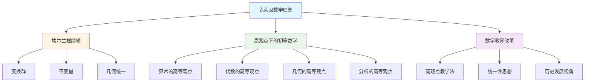
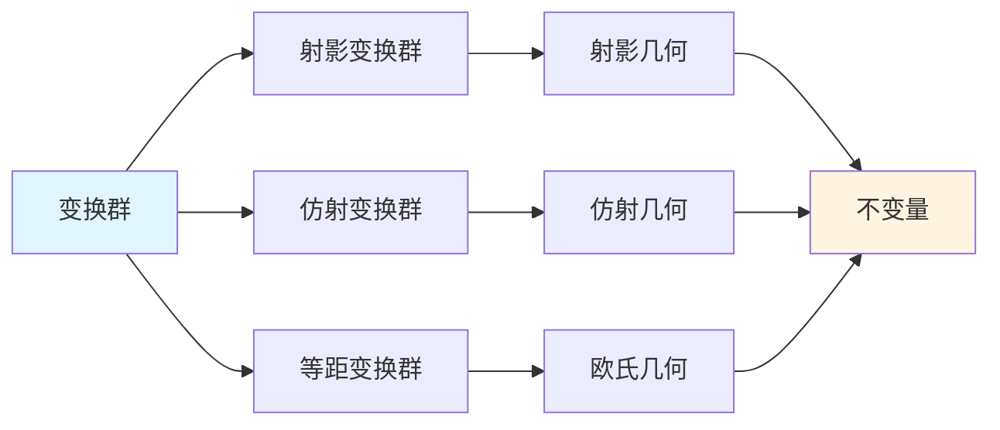
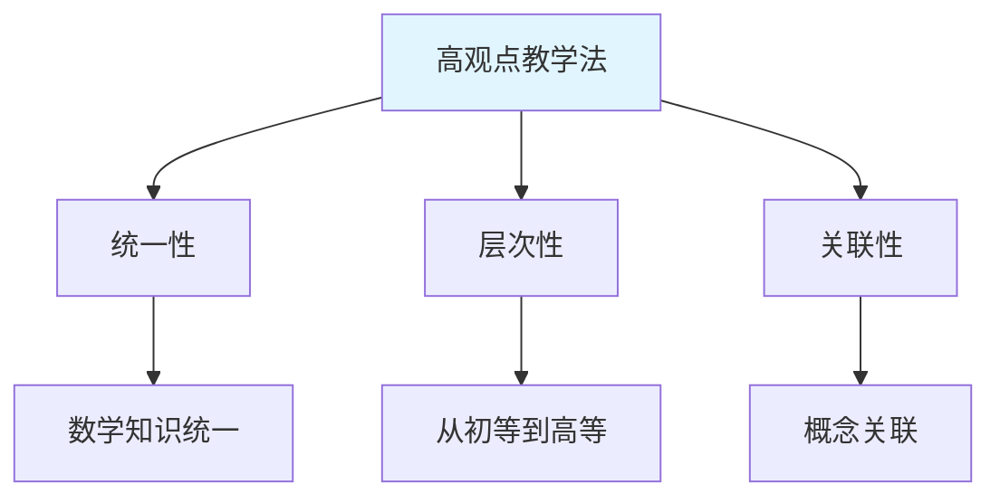

# 克莱因数学理念的概念关联网络

**创建日期**: 2025年12月4日
**研究领域**: 克莱因数学理念 - 数学知识关联分析 - 关联关系分析
**主题编号**: K.08.02.01 (Klein.数学知识关联分析.关联关系分析.概念关联网络)
**优先级**: P1（高优先级）⭐⭐⭐⭐

---

## 📑 目录

- [克莱因数学理念的概念关联网络](#克莱因数学理念的概念关联网络)
  - [📑 目录](#-目录)
  - [📋 一、概述](#-一概述)
    - [1.1 研究目标](#11-研究目标)
    - [1.2 网络构建方法](#12-网络构建方法)
    - [1.3 核心概念识别](#13-核心概念识别)
  - [🔷 二、核心概念体系](#-二核心概念体系)
    - [2.1 几何学概念](#21-几何学概念)
      - [概念1：变换群（Transformation Group） / **Transformationsgruppe**](#概念1变换群transformation-group--transformationsgruppe)
      - [概念2：不变量（Invariant） / **Invariante**](#概念2不变量invariant--invariante)
      - [概念3：射影几何（Projective Geometry） / **Projektive Geometrie**](#概念3射影几何projective-geometry--projektive-geometrie)
      - [概念4：欧氏几何（Euclidean Geometry） / **Euklidische Geometrie**](#概念4欧氏几何euclidean-geometry--euklidische-geometrie)
      - [概念5：非欧几何（Non-Euclidean Geometry） / **Nichteuklidische Geometrie**](#概念5非欧几何non-euclidean-geometry--nichteuklidische-geometrie)
    - [2.2 代数学概念](#22-代数学概念)
      - [概念1：群（Group） / **Gruppe**](#概念1群group--gruppe)
      - [概念2：对称性（Symmetry） / **Symmetrie**](#概念2对称性symmetry--symmetrie)
      - [概念3：同构（Isomorphism） / **Isomorphismus**](#概念3同构isomorphism--isomorphismus)
      - [概念4：代数结构（Algebraic Structure） / **Algebraische Struktur**](#概念4代数结构algebraic-structure--algebraische-struktur)
    - [2.3 分析学概念](#23-分析学概念)
      - [概念1：极限（Limit） / **Grenzwert**](#概念1极限limit--grenzwert)
      - [概念2：连续性（Continuity） / **Stetigkeit**](#概念2连续性continuity--stetigkeit)
      - [概念3：严格性（Rigorousness） / **Strenge**](#概念3严格性rigorousness--strenge)
    - [2.4 教育概念](#24-教育概念)
      - [概念1：高观点（Advanced Standpoint） / **Höherer Standpunkt**](#概念1高观点advanced-standpoint--höherer-standpunkt)
      - [概念2：统一性（Unity） / **Einheitlichkeit**](#概念2统一性unity--einheitlichkeit)
      - [概念3：数学化（Mathematization） / **Mathematisierung**](#概念3数学化mathematization--mathematisierung)
  - [🔗 三、概念关联关系类型](#-三概念关联关系类型)
    - [3.1 包含关系](#31-包含关系)
      - [关系1：集合包含关系](#关系1集合包含关系)
      - [关系2：结构包含关系](#关系2结构包含关系)
      - [关系3：层次包含关系](#关系3层次包含关系)
    - [3.2 等价关系](#32-等价关系)
      - [关系1：结构等价关系](#关系1结构等价关系)
      - [关系2：功能等价关系](#关系2功能等价关系)
      - [关系3：理论等价关系](#关系3理论等价关系)
    - [3.3 依赖关系](#33-依赖关系)
      - [关系1：定义依赖关系](#关系1定义依赖关系)
      - [关系2：理解依赖关系](#关系2理解依赖关系)
      - [关系3：应用依赖关系](#关系3应用依赖关系)
    - [3.4 应用关系](#34-应用关系)
      - [关系1：理论应用关系](#关系1理论应用关系)
      - [关系2：方法应用关系](#关系2方法应用关系)
      - [关系3：工具应用关系](#关系3工具应用关系)
  - [🌐 四、概念网络可视化](#-四概念网络可视化)
    - [4.1 核心概念网络图](#41-核心概念网络图)
    - [4.2 几何学概念网络](#42-几何学概念网络)
    - [4.3 教育概念网络](#43-教育概念网络)
  - [📊 五、关联强度分析](#-五关联强度分析)
    - [5.1 强关联概念](#51-强关联概念)
      - [强关联1：变换群 ↔ 不变量](#强关联1变换群--不变量)
      - [强关联2：几何类型 ↔ 变换群](#强关联2几何类型--变换群)
      - [强关联3：高观点 ↔ 统一性](#强关联3高观点--统一性)
    - [5.2 中等关联概念](#52-中等关联概念)
      - [中等关联1：群论 ↔ 几何学](#中等关联1群论--几何学)
      - [中等关联2：初等数学 ↔ 高等数学](#中等关联2初等数学--高等数学)
      - [中等关联3：不变量 ↔ 几何性质](#中等关联3不变量--几何性质)
    - [5.3 弱关联概念](#53-弱关联概念)
      - [弱关联1：数学教育 ↔ 数学研究](#弱关联1数学教育--数学研究)
      - [弱关联2：理论 ↔ 应用](#弱关联2理论--应用)
      - [弱关联3：历史 ↔ 现代](#弱关联3历史--现代)
  - [🎯 六、应用价值](#-六应用价值)
    - [6.1 对课程设计的启示](#61-对课程设计的启示)
    - [6.2 对教学组织的启示](#62-对教学组织的启示)
    - [6.3 对学习路径的启示](#63-对学习路径的启示)
  - [🌍 七、国际视角与权威对标](#-七国际视角与权威对标)
    - [7.1 Wikipedia资源对标](#71-wikipedia资源对标)
    - [7.2 国际大学课程对标](#72-国际大学课程对标)
    - [7.3 国际研究机构](#73-国际研究机构)
  - [🔗 八、与其他文档的关联性](#-八与其他文档的关联性)
    - [8.1 与本专题其他文档的关联](#81-与本专题其他文档的关联)
    - [8.2 与项目其他文档的关联](#82-与项目其他文档的关联)
  - [📊 九、总结与展望](#-九总结与展望)
    - [9.1 核心价值总结](#91-核心价值总结)
    - [9.2 网络特点](#92-网络特点)
    - [9.3 未来展望](#93-未来展望)

---

## 📋 一、概述

### 1.1 研究目标

**研究目标**：

构建克莱因数学理念的完整概念关联网络，揭示：

1. **核心概念体系**：克莱因数学理念中的核心概念
2. **关联关系**：概念之间的各种关联关系
3. **网络结构**：概念网络的整体结构
4. **应用价值**：对数学教育的指导意义

### 1.2 网络构建方法

**构建方法**：

1. **概念提取**：从克莱因的著作和理念中提取核心概念
2. **关系识别**：识别概念之间的关联关系
3. **网络构建**：构建概念关联网络
4. **可视化**：使用图论方法可视化网络

### 1.3 核心概念识别

**核心概念分类**：

- **几何学概念**：变换群、不变量、射影几何等
- **代数学概念**：群、环、域等
- **教育概念**：高观点、统一性、数学化等
- **方法论概念**：公理化、形式化等

---

## 🔷 二、核心概念体系

### 2.1 几何学概念

**几何学核心概念体系**：

#### 概念1：变换群（Transformation Group） / **Transformationsgruppe**

**定义**：

几何变换的集合，满足群的性质。

**关联概念**：

- **群**：变换群是群的具体例子
- **几何变换**：变换群由几何变换组成
- **不变量**：变换群决定不变量
- **几何类型**：变换群对应几何类型

**在网络中的位置**：

- **中心节点**：概念网络的核心节点
- **连接多个概念**：连接几何、代数、不变量等概念

#### 概念2：不变量（Invariant） / **Invariante**

**定义**：

在变换群作用下保持不变的几何量。

**关联概念**：

- **变换群**：不变量依赖于变换群
- **几何性质**：不变量描述几何性质
- **几何分类**：不变量用于几何分类

**在网络中的位置**：

- **关键节点**：概念网络的关键节点
- **连接几何性质**：连接几何性质和变换群

#### 概念3：射影几何（Projective Geometry） / **Projektive Geometrie**

**定义**：

研究在射影变换群下不变性质的几何。

**关联概念**：

- **射影变换群**：$PGL(n+1)$
- **交比**：射影几何的核心不变量
- **射影平面**：射影几何的基本对象

**在网络中的位置**：

- **几何节点**：几何概念网络的重要节点
- **连接其他几何**：连接仿射几何、欧氏几何

#### 概念4：欧氏几何（Euclidean Geometry） / **Euklidische Geometrie**

**定义**：

研究在等距变换群下不变性质的几何。

**关联概念**：

- **等距变换群**：$E(n)$
- **距离**：欧氏几何的核心不变量
- **角度**：欧氏几何的重要不变量

**在网络中的位置**：

- **基础几何节点**：几何概念网络的基础节点
- **连接初等几何**：连接初等几何概念

#### 概念5：非欧几何（Non-Euclidean Geometry） / **Nichteuklidische Geometrie**

**定义**：

不满足欧氏平行公设的几何。

**关联概念**：

- **双曲几何**：双曲平面上的几何
- **椭圆几何**：椭圆空间上的几何
- **变换群**：非欧几何也有对应的变换群

**在网络中的位置**：

- **扩展几何节点**：几何概念网络的扩展节点
- **连接现代几何**：连接现代几何概念

### 2.2 代数学概念

**代数学核心概念体系**：

#### 概念1：群（Group） / **Gruppe**

**定义**：

满足结合律、单位元、逆元的代数结构。

**关联概念**：

- **变换群**：群在几何中的应用
- **对称性**：群描述对称性
- **代数结构**：群是基本的代数结构

**在网络中的位置**：

- **代数核心节点**：代数学概念网络的核心节点
- **连接几何**：连接几何和代数

#### 概念2：对称性（Symmetry） / **Symmetrie**

**定义**：

在某种变换下保持不变的性质。

**关联概念**：

- **对称群**：描述对称性的群
- **几何对象**：具有对称性的几何对象
- **不变量**：对称性是不变量的体现

**在网络中的位置**：

- **连接节点**：连接几何和代数的节点
- **统一概念**：统一理解几何和代数

#### 概念3：同构（Isomorphism） / **Isomorphismus**

**定义**：

保持结构的双射映射。

**关联概念**：

- **结构保持**：同构保持代数结构
- **分类工具**：同构用于分类
- **等价关系**：同构建立等价关系

**在网络中的位置**：

- **关系节点**：描述概念关系的节点
- **分类工具**：用于概念分类

#### 概念4：代数结构（Algebraic Structure） / **Algebraische Struktur**

**定义**：

具有运算的集合。

**关联概念**：

- **群、环、域**：基本的代数结构
- **数系**：数系是代数结构
- **统一性**：代数结构体现统一性

**在网络中的位置**：

- **结构节点**：描述结构的节点
- **统一框架**：提供统一的框架

### 2.3 分析学概念

**分析学核心概念体系**：

#### 概念1：极限（Limit） / **Grenzwert**

**定义**：

函数在某点的极限值。

**关联概念**：

- **连续性**：极限用于定义连续性
- **严格性**：极限的严格定义
- **拓扑**：从拓扑理解极限

**在网络中的位置**：

- **分析核心节点**：分析学概念网络的核心节点
- **连接拓扑**：连接分析和拓扑

#### 概念2：连续性（Continuity） / **Stetigkeit**

**定义**：

函数在某点连续。

**关联概念**：

- **极限**：连续性用极限定义
- **拓扑**：从拓扑理解连续性
- **几何**：连续性的几何意义

**在网络中的位置**：

- **分析节点**：分析学概念网络的重要节点
- **连接几何**：连接分析和几何

#### 概念3：严格性（Rigorousness） / **Strenge**

**定义**：

数学证明的严格性。

**关联概念**：

- **公理化**：严格性的基础
- **逻辑**：严格性的逻辑基础
- **教育**：严格性在教育中的意义

**在网络中的位置**：

- **方法论节点**：方法论概念网络的节点
- **连接教育**：连接数学和教育

### 2.4 教育概念

**教育核心概念体系**：

#### 概念1：高观点（Advanced Standpoint） / **Höherer Standpunkt**

**定义**：

从高等数学视角看初等数学。

**关联概念**：

- **统一性**：高观点体现统一性
- **层次性**：高观点体现层次性
- **初等数学**：高观点的应用对象

**在网络中的位置**：

- **教育核心节点**：教育概念网络的核心节点
- **连接数学**：连接数学和教育

#### 概念2：统一性（Unity） / **Einheitlichkeit**

**定义**：

数学知识的统一性。

**关联概念**：

- **高观点**：统一性通过高观点体现
- **数学知识**：统一性贯穿数学知识
- **教学方法**：统一性指导教学方法

**在网络中的位置**：

- **理念节点**：教育理念网络的节点
- **统一框架**：提供统一的框架

#### 概念3：数学化（Mathematization） / **Mathematisierung**

**定义**：

将实际问题转化为数学问题。

**关联概念**：

- **应用**：数学化的应用
- **教育**：数学化在教育中的意义
- **实践**：数学化的实践

**在网络中的位置**：

- **应用节点**：应用概念网络的节点
- **连接实践**：连接理论和实践

---

## 🔗 三、概念关联关系类型

### 3.1 包含关系

**包含关系（Containment Relation）** / **Enthaltenseins-Relation**：

一个概念包含另一个概念，形成概念的层次结构。

#### 关系1：集合包含关系

**定义**：

概念$A$包含概念$B$，如果$B$是$A$的特殊情况。

**几何示例**：

- **变换群 ⊃ 等距变换群**：等距变换群是变换群的子群
- **变换群 ⊃ 仿射变换群**：仿射变换群是变换群的子群
- **变换群 ⊃ 射影变换群**：射影变换群是变换群的子群

**几何类型示例**：

- **射影几何 ⊃ 仿射几何 ⊃ 欧氏几何**：几何的包含关系
- **几何 ⊃ 欧氏几何**：欧氏几何是几何的特殊情况

#### 关系2：结构包含关系

**定义**：

概念$A$的结构包含概念$B$的结构。

**代数示例**：

- **域 ⊃ 环 ⊃ 群**：代数结构的包含关系
- **复数 ⊃ 实数 ⊃ 有理数 ⊃ 整数 ⊃ 自然数**：数系的包含关系

#### 关系3：层次包含关系

**定义**：

高级概念包含低级概念。

**教育示例**：

- **高等数学 ⊃ 初等数学**：高等数学包含初等数学
- **抽象概念 ⊃ 具体概念**：抽象概念包含具体概念

### 3.2 等价关系

**等价关系（Equivalence Relation）** / **Äquivalenzrelation**：

两个概念在某种意义下等价，可以相互转换。

#### 关系1：结构等价关系

**定义**：

两个概念在结构上等价。

**几何示例**：

- **几何类型 ↔ 变换群**：通过埃尔兰根纲领，几何类型与变换群一一对应
  - 欧氏几何 ↔ 等距变换群
  - 仿射几何 ↔ 仿射变换群
  - 射影几何 ↔ 射影变换群

#### 关系2：功能等价关系

**定义**：

两个概念在功能上等价。

**示例**：

- **不变量 ↔ 几何性质**：不变量描述几何性质，几何性质由不变量决定
- **群作用 ↔ 对称性**：群作用描述对称性，对称性由群作用决定

#### 关系3：理论等价关系

**定义**：

两个概念在理论上等价。

**示例**：

- **高观点 ↔ 统一性**：高观点体现统一性，统一性通过高观点实现
- **群论方法 ↔ 几何方法**：在某些情况下，群论方法和几何方法等价

### 3.3 依赖关系

**依赖关系（Dependency Relation）** / **Abhängigkeitsrelation**：

一个概念依赖于另一个概念，形成概念之间的依赖链。

#### 关系1：定义依赖关系

**定义**：

概念$A$的定义依赖于概念$B$。

**几何示例**：

- **不变量依赖于变换群**：不变量的定义需要变换群
- **几何类型依赖于变换群**：几何类型的定义需要变换群
- **几何性质依赖于不变量**：几何性质的定义需要不变量

#### 关系2：理解依赖关系

**定义**：

理解概念$A$需要先理解概念$B$。

**教育示例**：

- **理解高等数学需要先理解初等数学**：高等数学建立在初等数学基础上
- **理解抽象概念需要先理解具体概念**：抽象概念从具体概念抽象而来

#### 关系3：应用依赖关系

**定义**：

应用概念$A$需要先掌握概念$B$。

**示例**：

- **应用群论需要先掌握群论基础**：群论应用需要群论基础
- **应用高观点需要先理解高等数学**：高观点应用需要高等数学基础

### 3.4 应用关系

**应用关系（Application Relation）** / **Anwendungsrelation**：

一个概念应用于另一个概念，形成概念之间的应用链。

#### 关系1：理论应用关系

**定义**：

理论$A$应用于领域$B$。

**示例**：

- **群论应用于几何学**：用群论研究几何
- **不变量理论应用于几何分类**：用不变量理论分类几何
- **高观点应用于初等数学教学**：用高观点指导初等数学教学

#### 关系2：方法应用关系

**定义**：

方法$A$应用于问题$B$。

**示例**：

- **变换群方法应用于几何研究**：用变换群方法研究几何
- **不变量方法应用于性质研究**：用不变量方法研究性质
- **统一性方法应用于课程设计**：用统一性方法设计课程

#### 关系3：工具应用关系

**定义**：

工具$A$应用于任务$B$。

**示例**：

- **群论作为工具应用于几何**：群论是研究几何的工具
- **不变量作为工具应用于分类**：不变量是分类的工具
- **高观点作为工具应用于教学**：高观点是教学的工具

---

## 🌐 四、概念网络可视化

### 4.1 核心概念网络图

### 4.2 几何学概念网络

### 4.3 教育概念网络

---

## 📊 五、关联强度分析

### 5.1 强关联概念

**强关联（Strong Association）** / **Starke Assoziation**：

概念之间直接、密切的关联关系。

#### 强关联1：变换群 ↔ 不变量

**关联强度**：⭐⭐⭐⭐⭐（最强）

**关联类型**：定义依赖关系

**关联描述**：

- **变换群决定不变量**：不变量由变换群决定
- **不变量描述变换群**：不变量描述变换群的性质
- **核心关系**：这是埃尔兰根纲领的核心关系

**网络位置**：

- **核心边**：概念网络的核心边
- **连接核心节点**：连接变换群和不变量两个核心节点

#### 强关联2：几何类型 ↔ 变换群

**关联强度**：⭐⭐⭐⭐⭐（最强）

**关联类型**：等价关系

**关联描述**：

- **一一对应**：几何类型与变换群一一对应
- **埃尔兰根纲领**：通过埃尔兰根纲领建立对应
- **统一框架**：这是几何统一的框架

**网络位置**：

- **核心边**：概念网络的核心边
- **连接几何和群论**：连接几何概念和群论概念

#### 强关联3：高观点 ↔ 统一性

**关联强度**：⭐⭐⭐⭐（强）

**关联类型**：理念关系

**关联描述**：

- **高观点体现统一性**：高观点是统一性的体现
- **统一性通过高观点实现**：统一性通过高观点实现
- **教育理念**：这是克莱因的教育理念

**网络位置**：

- **教育核心边**：教育概念网络的核心边
- **连接教育理念**：连接高观点和统一性

### 5.2 中等关联概念

**中等关联（Medium Association）** / **Mittlere Assoziation**：

概念之间间接、中等的关联关系。

#### 中等关联1：群论 ↔ 几何学

**关联强度**：⭐⭐⭐⭐（中等偏强）

**关联类型**：应用关系

**关联描述**：

- **群论应用于几何**：用群论研究几何
- **几何提供群论例子**：几何提供群论的具体例子
- **相互促进**：群论和几何相互促进

**网络位置**：

- **跨领域边**：连接代数和几何的边
- **应用关系**：体现应用关系

#### 中等关联2：初等数学 ↔ 高等数学

**关联强度**：⭐⭐⭐（中等）

**关联类型**：层次关系

**关联描述**：

- **高等数学包含初等数学**：高等数学建立在初等数学基础上
- **高观点连接**：通过高观点连接初等和高等
- **层次关系**：体现数学的层次关系

**网络位置**：

- **层次边**：连接不同层次的边
- **教育关系**：体现教育关系

#### 中等关联3：不变量 ↔ 几何性质

**关联强度**：⭐⭐⭐（中等）

**关联类型**：描述关系

**关联描述**：

- **不变量描述几何性质**：不变量用于描述几何性质
- **几何性质由不变量决定**：几何性质由不变量决定
- **分类工具**：不变量是分类几何性质的工具

**网络位置**：

- **描述边**：连接不变量和几何性质的边
- **分类关系**：体现分类关系

### 5.3 弱关联概念

**弱关联（Weak Association）** / **Schwache Assoziation**：

概念之间间接、较弱的关联关系。

#### 弱关联1：数学教育 ↔ 数学研究

**关联强度**：⭐⭐（弱）

**关联类型**：间接关系

**关联描述**：

- **教育受研究影响**：数学教育受数学研究影响
- **研究受教育影响**：数学研究受数学教育影响
- **相互影响**：教育和研究相互影响

**网络位置**：

- **间接边**：间接连接的边
- **影响关系**：体现影响关系

#### 弱关联2：理论 ↔ 应用

**关联强度**：⭐⭐（弱）

**关联类型**：一般关系

**关联描述**：

- **理论指导应用**：理论指导应用
- **应用验证理论**：应用验证理论
- **相互促进**：理论和应用相互促进

**网络位置**：

- **一般边**：一般关联的边
- **指导关系**：体现指导关系

#### 弱关联3：历史 ↔ 现代

**关联强度**：⭐⭐（弱）

**关联类型**：时间关系

**关联描述**：

- **历史影响现代**：历史发展影响现代
- **现代继承历史**：现代继承历史发展
- **时间关联**：体现时间关联

**网络位置**：

- **时间边**：时间关联的边
- **发展关系**：体现发展关系

---

## 🎯 六、应用价值

### 6.1 对课程设计的启示

**课程组织**：

- 基于概念关联网络组织课程内容
- 强调概念之间的关系
- 构建系统的知识结构

### 6.2 对教学组织的启示

**教学策略**：

- 从核心概念出发
- 沿着关联关系展开
- 建立概念网络

### 6.3 对学习路径的启示

**学习路径设计**：

- 基于概念依赖关系
- 从基础概念到高级概念
- 沿着关联路径学习

---

## 🌍 七、国际视角与权威对标

### 7.1 Wikipedia资源对标

- **Concept network**条目
  - 概念网络理论
  - 网络分析方法

- **Mathematical concept**条目
  - 数学概念
  - 概念关系

- **Knowledge graph**条目
  - 知识图谱
  - 概念关联

### 7.2 国际大学课程对标

- **MIT 6.034 Artificial Intelligence**
  - 人工智能课程
  - 概念网络方法

- **Stanford CS224W Graph Neural Networks**
  - 图神经网络课程
  - 网络分析方法

### 7.3 国际研究机构

- **国际数学联盟（IMU）**
  - 数学教育研究
  - 概念网络研究

- **美国数学会（AMS）**
  - 数学教育研究
  - 概念网络研究

---

## 🔗 八、与其他文档的关联性

### 8.1 与本专题其他文档的关联

- **08-数学知识关联分析/01-知识体系梳理**：知识体系基础
  - 知识体系梳理
  - 概念体系基础

- **01-核心理论/01-埃尔兰根纲领**：理论基础
  - 埃尔兰根纲领
  - 变换群理论

- **02-高观点下的初等数学**：应用领域
  - 高观点应用
  - 概念应用

- **02-理论关联图谱**：理论层关联
  - 理论关联
  - 概念关联的扩展

- **03-教育应用关联**：教育层关联
  - 教育关联
  - 概念关联的应用

### 8.2 与项目其他文档的关联

- **research/06-思维表征**：概念表征方法
  - 概念表征
  - 网络表征

- **docs/04-几何学**：几何学内容
  - 几何概念
  - 概念网络的应用

---

## 📊 九、总结与展望

### 9.1 核心价值总结

**概念关联网络的核心价值**：

1. **理论价值**：
   - 理解概念之间的关系
   - 建立概念的统一理解
   - 揭示概念的本质

2. **教育价值**：
   - 指导课程设计
   - 指导教学组织
   - 指导学习路径

3. **实践价值**：
   - 为教学提供框架
   - 为研究提供方法
   - 为应用提供指导

### 9.2 网络特点

**概念关联网络的特点**：

- **系统性**：系统的概念体系
- **关联性**：丰富的概念关联
- **可视化**：清晰的可视化表示
- **应用性**：广泛的应用价值

### 9.3 未来展望

**未来发展方向**：

1. **网络扩展**：扩展概念网络
2. **方法创新**：创新网络分析方法
3. **应用拓展**：在新领域的应用

---

**创建日期**: 2025年12月4日
**最后更新**: 2025年12月4日
**状态**: ✅ 文档内容已扩展，包含详细的概念体系、关联分析和网络可视化
