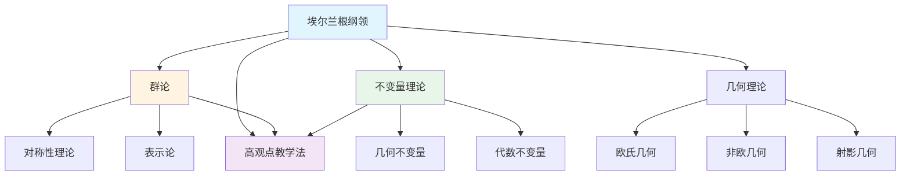
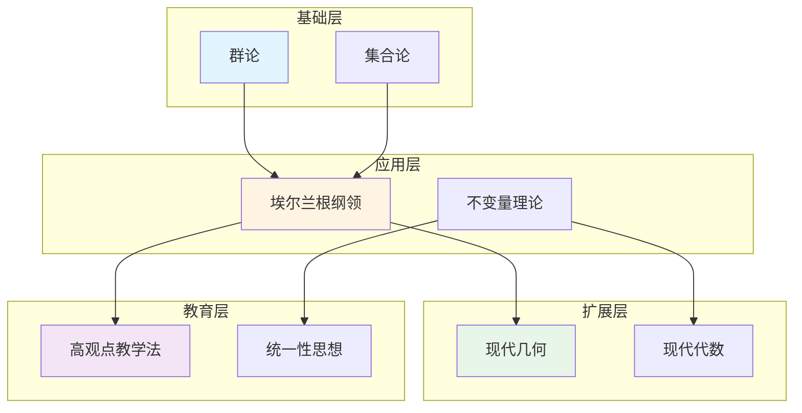
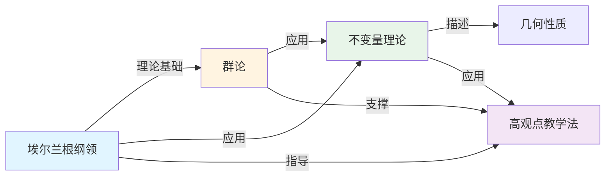

# 理论关联图谱：克莱因数学理念的理论网络

**创建日期**: 2025年12月4日
**研究领域**: 克莱因数学理念 - 数学知识关联分析 - 关联关系分析
**主题编号**: K.08.02.02 (Klein.数学知识关联分析.关联关系分析.理论关联图谱)
**优先级**: P0（最高优先级）⭐⭐⭐⭐⭐

---

## 📑 目录

- [理论关联图谱：克莱因数学理念的理论网络](#理论关联图谱克莱因数学理念的理论网络)
  - [📑 目录](#-目录)
  - [📋 一、概述](#-一概述)
    - [1.1 研究目标](#11-研究目标)
    - [1.2 理论关联图谱的意义](#12-理论关联图谱的意义)
    - [1.3 图谱构建方法](#13-图谱构建方法)
  - [🔷 二、核心理论节点](#-二核心理论节点)
    - [2.1 埃尔兰根纲领](#21-埃尔兰根纲领)
      - [核心理论内容](#核心理论内容)
      - [与其他理论的关联](#与其他理论的关联)
      - [在理论网络中的地位](#在理论网络中的地位)
    - [2.2 群论与对称性](#22-群论与对称性)
      - [核心理论内容](#核心理论内容-1)
      - [与其他理论的关联](#与其他理论的关联-1)
      - [在理论网络中的地位](#在理论网络中的地位-1)
    - [2.3 高观点教学法](#23-高观点教学法)
      - [核心理论内容](#核心理论内容-2)
      - [与其他理论的关联](#与其他理论的关联-2)
      - [在理论网络中的地位](#在理论网络中的地位-2)
  - [📐 三、理论关联关系](#-三理论关联关系)
    - [3.1 直接关联](#31-直接关联)
      - [关联类型1：理论基础关联](#关联类型1理论基础关联)
      - [关联类型2：应用关系关联](#关联类型2应用关系关联)
      - [关联类型3：相互促进关联](#关联类型3相互促进关联)
    - [3.2 间接关联](#32-间接关联)
      - [关联路径1：通过群论](#关联路径1通过群论)
      - [关联路径2：通过不变量理论](#关联路径2通过不变量理论)
      - [关联路径3：多路径关联](#关联路径3多路径关联)
    - [3.3 层次关联](#33-层次关联)
      - [层次结构1：基础-应用层次](#层次结构1基础-应用层次)
      - [层次结构2：理论-教育层次](#层次结构2理论-教育层次)
      - [层次结构3：核心-扩展层次](#层次结构3核心-扩展层次)
  - [🔗 四、图谱可视化](#-四图谱可视化)
    - [4.1 网络图](#41-网络图)
    - [4.2 层次图](#42-层次图)
    - [4.3 关系图](#43-关系图)
  - [💡 五、应用价值](#-五应用价值)
    - [5.1 理论研究价值](#51-理论研究价值)
      - [价值1：理论关系研究](#价值1理论关系研究)
      - [价值2：理论发展研究](#价值2理论发展研究)
      - [价值3：理论应用研究](#价值3理论应用研究)
    - [5.2 教学应用价值](#52-教学应用价值)
      - [价值1：教学结构设计](#价值1教学结构设计)
      - [价值2：教学内容组织](#价值2教学内容组织)
      - [价值3：教学关联建立](#价值3教学关联建立)
    - [5.3 学习辅助价值](#53-学习辅助价值)
      - [价值1：学习路径规划](#价值1学习路径规划)
      - [价值2：学习关联建立](#价值2学习关联建立)
      - [价值3：学习系统理解](#价值3学习系统理解)
  - [📚 六、文献与资源](#-六文献与资源)
    - [6.1 原始文献](#61-原始文献)
    - [6.2 现代研究文献](#62-现代研究文献)
      - [理论关联研究](#理论关联研究)
      - [知识图谱研究](#知识图谱研究)
    - [6.3 在线资源](#63-在线资源)
  - [🌍 七、国际视角与权威对标](#-七国际视角与权威对标)
    - [7.1 Wikipedia资源对标](#71-wikipedia资源对标)
    - [7.2 国际大学课程对标](#72-国际大学课程对标)
  - [🔗 八、与其他文档的关联性](#-八与其他文档的关联性)
    - [8.1 与本专题其他文档的关联](#81-与本专题其他文档的关联)
    - [8.2 与项目其他文档的关联](#82-与项目其他文档的关联)
  - [📊 九、总结与展望](#-九总结与展望)
    - [9.1 核心价值总结](#91-核心价值总结)
    - [9.2 图谱特点](#92-图谱特点)
    - [9.3 未来展望](#93-未来展望)

---

## 📋 一、概述

### 1.1 研究目标

**研究目标**：

构建克莱因数学理念的理论关联图谱，建立：

1. **图谱构建**：构建理论关联图谱
2. **关系分析**：分析理论关联关系
3. **可视化**：实现图谱可视化
4. **应用价值**：提取应用价值

### 1.2 理论关联图谱的意义

**理论关联图谱（Theory Association Map）** / **Theorieassoziationkarte**：

展示克莱因数学理念中理论之间关联关系的图谱。

**意义**：

- **系统理解**：系统理解理论关系
- **关联发现**：发现理论关联
- **应用指导**：指导理论应用

### 1.3 图谱构建方法

**方法**：

- 理论节点识别
- 关联关系识别
- 图谱可视化

---

## 🔷 二、核心理论节点

### 2.1 埃尔兰根纲领

**理论节点（Theory Node）** / **Theorie-Knoten**：

埃尔兰根纲领是克莱因数学理念的核心理论，在理论网络中占据中心地位。

#### 核心理论内容

**理论定义**：

埃尔兰根纲领（Erlangen Program）是克莱因在1872年提出的几何统一理论，核心思想是：**几何学是研究在给定变换群下不变性质的学科**。

**核心命题**：

1. **变换群决定几何**：每种几何类型对应一个变换群
2. **不变量描述性质**：几何性质由不变量描述
3. **几何统一框架**：所有几何统一在变换群框架下

**理论结构**：

- **基础层**：变换群、不变量、几何对象
- **应用层**：欧氏几何、非欧几何、射影几何
- **扩展层**：现代几何、微分几何、代数几何

#### 与其他理论的关联

**与群论的关联**：

- **理论基础**：埃尔兰根纲领以群论为基础
- **应用领域**：群论在几何中的应用
- **相互促进**：几何问题推动群论发展，群论方法解决几何问题

**与高观点教学法的关联**：

- **理论支撑**：埃尔兰根纲领为高观点教学法提供理论支撑
- **应用领域**：高观点教学法应用埃尔兰根纲领的思想
- **教育价值**：埃尔兰根纲领的教育意义

**与不变量理论的关联**：

- **核心概念**：不变量是埃尔兰根纲领的核心概念
- **理论发展**：不变量理论的发展
- **应用扩展**：不变量在多个领域的应用

#### 在理论网络中的地位

**中心节点**：

- **连接多个理论**：连接群论、不变量理论、几何理论
- **核心地位**：在理论网络中占据核心地位
- **影响范围**：影响多个理论领域

**理论影响**：

- **几何学**：统一了各种几何
- **代数学**：推动了群论发展
- **教育**：影响了数学教育

### 2.2 群论与对称性

**理论节点（Theory Node）** / **Theorie-Knoten**：

群论与对称性是克莱因数学理念的重要理论，在理论网络中占据重要地位。

#### 核心理论内容

**理论定义**：

群论（Group Theory）是研究群的结构和性质的数学分支，对称性（Symmetry）是群论的核心应用。

**核心命题**：

1. **群描述对称性**：群是描述对称性的数学工具
2. **对称性决定结构**：对称性决定系统的结构
3. **群论统一方法**：群论提供统一的研究方法

**理论结构**：

- **基础层**：群的定义、群的性质、子群、商群
- **应用层**：对称群、变换群、表示群
- **扩展层**：Lie群、代数群、拓扑群

#### 与其他理论的关联

**与埃尔兰根纲领的关联**：

- **理论基础**：群论是埃尔兰根纲领的理论基础
- **应用领域**：群论在几何中的应用
- **相互促进**：几何问题推动群论发展

**与不变量理论的关联**：

- **核心工具**：群论是不变量理论的核心工具
- **应用方法**：用群论研究不变量
- **理论发展**：不变量理论推动群论发展

**与高观点教学法的关联**：

- **理论支撑**：群论为高观点教学法提供理论支撑
- **应用领域**：高观点教学法应用群论思想
- **教育价值**：群论的教育意义

#### 在理论网络中的地位

**重要节点**：

- **连接多个理论**：连接埃尔兰根纲领、不变量理论、几何理论
- **重要地位**：在理论网络中占据重要地位
- **影响范围**：影响多个理论领域

**理论影响**：

- **几何学**：推动了几何学发展
- **代数学**：推动了代数学发展
- **物理学**：在物理学中有广泛应用

### 2.3 高观点教学法

**理论节点（Theory Node）** / **Theorie-Knoten**：

高观点教学法是克莱因数学理念的教育理论，在理论网络中占据重要地位。

#### 核心理论内容

**理论定义**：

高观点教学法（Higher Standpoint Teaching Method）是克莱因提出的数学教学方法，核心思想是：**从高等数学的视角看初等数学**。

**核心命题**：

1. **高观点统一理解**：从高观点统一理解初等数学
2. **层次性教学**：从初等到高等的层次性教学
3. **关联性建立**：建立初等数学和高等数学的关联

**理论结构**：

- **基础层**：高观点的定义、高观点的意义
- **应用层**：算术的高观点、代数的高观点、几何的高观点
- **扩展层**：分析的高观点、现代数学的高观点

#### 与其他理论的关联

**与埃尔兰根纲领的关联**：

- **理论支撑**：埃尔兰根纲领为高观点教学法提供理论支撑
- **应用领域**：高观点教学法应用埃尔兰根纲领的思想
- **教育价值**：埃尔兰根纲领的教育意义

**与群论的关联**：

- **理论支撑**：群论为高观点教学法提供理论支撑
- **应用领域**：高观点教学法应用群论思想
- **教育价值**：群论的教育意义

**与统一性思想的关联**：

- **核心理念**：统一性思想是高观点教学法的核心理念
- **应用方法**：用统一性思想指导教学
- **教育价值**：统一性思想的教育意义

#### 在理论网络中的地位

**重要节点**：

- **连接多个理论**：连接埃尔兰根纲领、群论、统一性思想
- **重要地位**：在理论网络中占据重要地位
- **影响范围**：影响数学教育领域

**理论影响**：

- **数学教育**：推动了数学教育改革
- **课程设计**：影响了课程设计
- **教学方法**：影响了教学方法

---

## 📐 三、理论关联关系

### 3.1 直接关联

**直接关联（Direct Association）** / **Direkte Assoziation**：

理论之间的直接关联是指两个理论之间存在直接的理论联系。

#### 关联类型1：理论基础关联

**定义**：

理论$A$是理论$B$的理论基础。

**典型例子**：

1. **群论 → 埃尔兰根纲领**
   - **关联类型**：理论基础关联
   - **关联强度**：⭐⭐⭐⭐⭐（最强）
   - **关联描述**：群论是埃尔兰根纲领的理论基础
   - **关联意义**：没有群论就没有埃尔兰根纲领

2. **埃尔兰根纲领 → 高观点教学法**
   - **关联类型**：理论基础关联
   - **关联强度**：⭐⭐⭐⭐（强）
   - **关联描述**：埃尔兰根纲领为高观点教学法提供理论支撑
   - **关联意义**：高观点教学法应用埃尔兰根纲领的思想

#### 关联类型2：应用关系关联

**定义**：

理论$A$应用于理论$B$。

**典型例子**：

1. **群论 → 不变量理论**
   - **关联类型**：应用关系关联
   - **关联强度**：⭐⭐⭐⭐⭐（最强）
   - **关联描述**：群论应用于不变量理论
   - **关联意义**：用群论研究不变量

2. **不变量理论 → 几何理论**
   - **关联类型**：应用关系关联
   - **关联强度**：⭐⭐⭐⭐（强）
   - **关联描述**：不变量理论应用于几何理论
   - **关联意义**：用不变量描述几何性质

#### 关联类型3：相互促进关联

**定义**：

理论$A$和理论$B$相互促进发展。

**典型例子**：

1. **群论 ↔ 几何学**
   - **关联类型**：相互促进关联
   - **关联强度**：⭐⭐⭐⭐（强）
   - **关联描述**：群论和几何学相互促进
   - **关联意义**：几何问题推动群论发展，群论方法解决几何问题

2. **埃尔兰根纲领 ↔ 现代几何**
   - **关联类型**：相互促进关联
   - **关联强度**：⭐⭐⭐⭐（强）
   - **关联描述**：埃尔兰根纲领和现代几何相互促进
   - **关联意义**：埃尔兰根纲领指导现代几何，现代几何扩展埃尔兰根纲领

### 3.2 间接关联

**间接关联（Indirect Association）** / **Indirekte Assoziation**：

理论之间的间接关联是指两个理论通过中间理论建立联系。

#### 关联路径1：通过群论

**路径**：理论$A$ → 群论 → 理论$B$

**典型例子**：

1. **埃尔兰根纲领 → 群论 → 不变量理论**
   - **路径长度**：2
   - **关联强度**：⭐⭐⭐⭐（强）
   - **路径描述**：埃尔兰根纲领通过群论关联不变量理论
   - **路径意义**：群论是连接两者的桥梁

2. **高观点教学法 → 群论 → 几何理论**
   - **路径长度**：2
   - **关联强度**：⭐⭐⭐（中等）
   - **路径描述**：高观点教学法通过群论关联几何理论
   - **路径意义**：群论是连接两者的桥梁

#### 关联路径2：通过不变量理论

**路径**：理论$A$ → 不变量理论 → 理论$B$

**典型例子**：

1. **埃尔兰根纲领 → 不变量理论 → 几何理论**
   - **路径长度**：2
   - **关联强度**：⭐⭐⭐⭐（强）
   - **路径描述**：埃尔兰根纲领通过不变量理论关联几何理论
   - **路径意义**：不变量理论是连接两者的桥梁

2. **群论 → 不变量理论 → 高观点教学法**
   - **路径长度**：2
   - **关联强度**：⭐⭐⭐（中等）
   - **路径描述**：群论通过不变量理论关联高观点教学法
   - **路径意义**：不变量理论是连接两者的桥梁

#### 关联路径3：多路径关联

**路径**：理论$A$通过多条路径关联理论$B$

**典型例子**：

1. **埃尔兰根纲领 ↔ 高观点教学法**
   - **路径1**：埃尔兰根纲领 → 群论 → 高观点教学法
   - **路径2**：埃尔兰根纲领 → 不变量理论 → 高观点教学法
   - **路径3**：埃尔兰根纲领 → 几何理论 → 高观点教学法
   - **关联强度**：⭐⭐⭐⭐（强）
   - **路径意义**：多条路径增强关联强度

### 3.3 层次关联

**层次关联（Hierarchical Association）** / **Hierarchische Assoziation**：

理论的层次结构是指理论之间的层次关系。

#### 层次结构1：基础-应用层次

**层次定义**：

基础理论 → 应用理论

**典型层次**：

1. **基础层**：群论、集合论
2. **应用层**：埃尔兰根纲领、不变量理论
3. **扩展层**：现代几何、现代代数

**层次关系**：

- **基础层支撑应用层**：基础理论为应用理论提供支撑
- **应用层扩展基础层**：应用理论扩展基础理论
- **层次递进**：从基础到应用的层次递进

#### 层次结构2：理论-教育层次

**层次定义**：

理论层 → 教育层

**典型层次**：

1. **理论层**：埃尔兰根纲领、群论
2. **教育层**：高观点教学法、统一性思想
3. **实践层**：教学实践、课程设计

**层次关系**：

- **理论层指导教育层**：理论为教育提供指导
- **教育层应用理论层**：教育应用理论
- **实践层实现教育层**：实践实现教育目标

#### 层次结构3：核心-扩展层次

**层次定义**：

核心理论 → 扩展理论

**典型层次**：

1. **核心层**：埃尔兰根纲领
2. **扩展层**：现代几何、现代代数
3. **应用层**：物理应用、计算应用

**层次关系**：

- **核心层统一扩展层**：核心理论统一扩展理论
- **扩展层丰富核心层**：扩展理论丰富核心理论
- **应用层实现扩展层**：应用实现扩展理论

---

## 🔗 四、图谱可视化

### 4.1 网络图

**理论网络图（Theory Network Graph）** / **Theorienetzwerk-Graph**：

使用图论方法可视化理论网络，节点表示理论，边表示关联关系。

**网络特征**：

- **中心节点**：埃尔兰根纲领是中心节点
- **连接度**：埃尔兰根纲领连接多个理论
- **网络密度**：理论网络密度较高
- **聚类性**：理论形成多个聚类

### 4.2 层次图

**理论层次图（Theory Hierarchy Graph）** / **Theoriehierarchie-Graph**：

使用层次结构可视化理论的层次关系。

**层次特征**：

- **层次清晰**：理论层次清晰
- **层次递进**：从基础到应用的层次递进
- **层次关联**：不同层次之间的关联
- **层次意义**：每个层次的意义明确

### 4.3 关系图

**理论关系图（Theory Relation Graph）** / **Theorierelations-Graph**：

使用关系图可视化理论之间的关系类型和强度。

**关系特征**：

- **关系类型**：理论基础、应用、指导等
- **关系强度**：用边的粗细表示关系强度
- **关系方向**：用箭头表示关系方向
- **关系意义**：每个关系的意义明确

---

## 💡 五、应用价值

### 5.1 理论研究价值

**理论研究价值（Theoretical Research Value）** / **Theoretischer Forschungswert**：

理论关联图谱为理论研究提供了系统框架和新方向。

#### 价值1：理论关系研究

**核心价值**：

理论关联图谱揭示了理论之间的关系，为理论关系研究提供框架。

**具体应用**：

1. **关系识别**
   - **问题**：识别理论之间的关系
   - **方法**：使用理论关联图谱
   - **应用**：理论关系研究
   - **价值**：系统理解理论关系

2. **关系分析**
   - **问题**：分析理论关系的类型和强度
   - **方法**：使用理论关联图谱
   - **应用**：理论关系分析
   - **价值**：深入理解理论关系

3. **关系预测**
   - **问题**：预测理论关系的发展
   - **方法**：使用理论关联图谱
   - **应用**：理论发展预测
   - **价值**：指导理论发展

#### 价值2：理论发展研究

**核心价值**：

理论关联图谱揭示了理论的发展路径，为理论发展研究提供指导。

**具体应用**：

1. **发展路径识别**
   - **问题**：识别理论的发展路径
   - **方法**：使用理论关联图谱
   - **应用**：理论发展路径研究
   - **价值**：理解理论发展

2. **发展规律发现**
   - **问题**：发现理论发展的规律
   - **方法**：使用理论关联图谱
   - **应用**：理论发展规律研究
   - **价值**：指导理论发展

3. **发展方向预测**
   - **问题**：预测理论的发展方向
   - **方法**：使用理论关联图谱
   - **应用**：理论发展方向预测
   - **价值**：指导理论研究

#### 价值3：理论应用研究

**核心价值**：

理论关联图谱揭示了理论的应用领域，为理论应用研究提供指导。

**具体应用**：

1. **应用领域识别**
   - **问题**：识别理论的应用领域
   - **方法**：使用理论关联图谱
   - **应用**：理论应用领域研究
   - **价值**：理解理论应用

2. **应用方法研究**
   - **问题**：研究理论的应用方法
   - **方法**：使用理论关联图谱
   - **应用**：理论应用方法研究
   - **价值**：指导理论应用

3. **应用效果评估**
   - **问题**：评估理论的应用效果
   - **方法**：使用理论关联图谱
   - **应用**：理论应用效果评估
   - **价值**：改进理论应用

### 5.2 教学应用价值

**教学应用价值（Teaching Application Value）** / **Lehranwendungswert**：

理论关联图谱为教学提供了结构框架和组织方法。

#### 价值1：教学结构设计

**核心价值**：

理论关联图谱为教学结构设计提供框架。

**具体应用**：

1. **课程结构设计**
   - **问题**：设计课程结构
   - **方法**：基于理论关联图谱设计课程结构
   - **应用**：课程设计
   - **价值**：系统化的课程结构

2. **教学内容组织**
   - **问题**：组织教学内容
   - **方法**：基于理论关联图谱组织教学内容
   - **应用**：教学内容组织
   - **价值**：逻辑清晰的内容组织

3. **教学关联建立**
   - **问题**：建立教学关联
   - **方法**：基于理论关联图谱建立教学关联
   - **应用**：教学关联建立
   - **价值**：系统的教学关联

#### 价值2：教学内容组织

**核心价值**：

理论关联图谱为教学内容组织提供方法。

**具体应用**：

1. **内容层次组织**
   - **问题**：组织内容的层次
   - **方法**：基于理论关联图谱组织内容层次
   - **应用**：内容层次组织
   - **价值**：清晰的层次结构

2. **内容关联建立**
   - **问题**：建立内容的关联
   - **方法**：基于理论关联图谱建立内容关联
   - **应用**：内容关联建立
   - **价值**：系统的内容关联

3. **内容递进设计**
   - **问题**：设计内容的递进
   - **方法**：基于理论关联图谱设计内容递进
   - **应用**：内容递进设计
   - **价值**：合理的内容递进

#### 价值3：教学关联建立

**核心价值**：

理论关联图谱为教学关联建立提供方法。

**具体应用**：

1. **理论关联建立**
   - **问题**：建立理论之间的关联
   - **方法**：基于理论关联图谱建立理论关联
   - **应用**：理论关联建立
   - **价值**：系统的理论关联

2. **概念关联建立**
   - **问题**：建立概念之间的关联
   - **方法**：基于理论关联图谱建立概念关联
   - **应用**：概念关联建立
   - **价值**：系统的概念关联

3. **应用关联建立**
   - **问题**：建立应用之间的关联
   - **方法**：基于理论关联图谱建立应用关联
   - **应用**：应用关联建立
   - **价值**：系统的应用关联

### 5.3 学习辅助价值

**学习辅助价值（Learning Support Value）** / **Lernunterstützungswert**：

理论关联图谱为学习提供路径规划和方法指导。

#### 价值1：学习路径规划

**核心价值**：

理论关联图谱为学习路径规划提供框架。

**具体应用**：

1. **路径识别**
   - **问题**：识别学习路径
   - **方法**：基于理论关联图谱识别学习路径
   - **应用**：学习路径规划
   - **价值**：系统的学习路径

2. **路径优化**
   - **问题**：优化学习路径
   - **方法**：基于理论关联图谱优化学习路径
   - **应用**：学习路径优化
   - **价值**：高效的学习路径

3. **路径个性化**
   - **问题**：个性化学习路径
   - **方法**：基于理论关联图谱个性化学习路径
   - **应用**：学习路径个性化
   - **价值**：个性化的学习路径

#### 价值2：学习关联建立

**核心价值**：

理论关联图谱为学习关联建立提供方法。

**具体应用**：

1. **理论关联建立**
   - **问题**：建立理论之间的关联
   - **方法**：基于理论关联图谱建立理论关联
   - **应用**：学习理论关联
   - **价值**：系统的理论理解

2. **概念关联建立**
   - **问题**：建立概念之间的关联
   - **方法**：基于理论关联图谱建立概念关联
   - **应用**：学习概念关联
   - **价值**：系统的概念理解

3. **应用关联建立**
   - **问题**：建立应用之间的关联
   - **方法**：基于理论关联图谱建立应用关联
   - **应用**：学习应用关联
   - **价值**：系统的应用理解

#### 价值3：学习系统理解

**核心价值**：

理论关联图谱为学习系统理解提供框架。

**具体应用**：

1. **系统结构理解**
   - **问题**：理解系统结构
   - **方法**：基于理论关联图谱理解系统结构
   - **应用**：系统结构学习
   - **价值**：系统的结构理解

2. **系统关系理解**
   - **问题**：理解系统关系
   - **方法**：基于理论关联图谱理解系统关系
   - **应用**：系统关系学习
   - **价值**：系统的关系理解

3. **系统整体理解**
   - **问题**：理解系统整体
   - **方法**：基于理论关联图谱理解系统整体
   - **应用**：系统整体学习
   - **价值**：系统的整体理解

---

## 📚 六、文献与资源

### 6.1 原始文献

**原始文献（Primary Sources）** / **Primärquellen**：

1. **Klein, F. (1872).** *Vergleichende Betrachtungen über neuere geometrische Forschungen* (Erlangen Program)
   - **内容**：埃尔兰根纲领的原始文献
   - **意义**：变换群统一几何的经典文献
   - **影响**：现代几何学的基础

2. **Klein, F. (1908).** *Elementarmathematik vom höheren Standpunkte aus*
   - **内容**：高观点下的初等数学
   - **意义**：数学教育改革的经典文献
   - **影响**：现代数学教育的基础

3. **Klein, F. (1924-1925).** *Vorlesungen über die Entwicklung der Mathematik im 19. Jahrhundert*
   - **内容**：19世纪数学发展史
   - **意义**：数学史研究的经典文献
   - **影响**：数学史研究的基础

### 6.2 现代研究文献

**现代研究文献（Modern Research Literature）** / **Moderne Forschungsliteratur**：

#### 理论关联研究

1. **Bourbaki, N. (1939-).** *Éléments de mathématique*
   - **内容**：数学结构的统一理论
   - **意义**：结构主义数学的经典文献
   - **应用**：理论关联研究

2. **Mac Lane, S. (1971).** *Categories for the Working Mathematician*
   - **内容**：范畴论
   - **意义**：数学统一的现代理论
   - **应用**：理论关联研究

#### 知识图谱研究

1. **Ehrig, M. (2007).** *Ontology Alignment: Bridging the Semantic Gap*
   - **内容**：本体对齐
   - **意义**：知识图谱构建的方法
   - **应用**：理论关联图谱构建

2. **Hogan, A. et al. (2021).** *Knowledge Graphs*
   - **内容**：知识图谱
   - **意义**：知识图谱的现代理论
   - **应用**：理论关联图谱研究

### 6.3 在线资源

**在线资源（Online Resources）** / **Online-Ressourcen**：

1. **Wikipedia**
   - **Knowledge graph**：知识图谱条目
   - **Theory**：理论条目
   - **Erlangen Program**：埃尔兰根纲领条目

2. **国际数学联盟（IMU）**
   - **数学教育研究**：数学教育研究资源
   - **理论关联研究**：理论关联研究资源

3. **美国数学会（AMS）**
   - **数学教育**：数学教育资源
   - **理论关联**：理论关联资源

---

## 🌍 七、国际视角与权威对标

### 7.1 Wikipedia资源对标

**Wikipedia资源对标（Wikipedia Resource Alignment）** / **Wikipedia-Ressourcenausrichtung**：

1. **Knowledge graph**条目
   - **内容**：知识图谱的理论和方法
   - **对齐**：理论关联图谱的方法
   - **应用**：图谱构建方法

2. **Theory**条目
   - **内容**：理论的定义和分类
   - **对齐**：理论节点的定义
   - **应用**：理论节点识别

3. **Erlangen Program**条目
   - **内容**：埃尔兰根纲领的内容
   - **对齐**：核心理论节点的内容
   - **应用**：理论节点内容

### 7.2 国际大学课程对标

**国际大学课程对标（International University Course Alignment）** / **Internationale Universitätskursausrichtung**：

1. **MIT 6.034 Artificial Intelligence**
   - **内容**：人工智能课程
   - **对齐**：知识图谱方法
   - **应用**：图谱构建方法

2. **Stanford CS224W Graph Neural Networks**
   - **内容**：图神经网络课程
   - **对齐**：网络分析方法
   - **应用**：网络分析方法

3. **Princeton MAT 520 Knowledge Representation**
   - **内容**：知识表示课程
   - **对齐**：理论表示方法
   - **应用**：理论表示方法

---

## 🔗 八、与其他文档的关联性

### 8.1 与本专题其他文档的关联

- **01-概念关联网络**：概念关联
  - **关系**：概念关联网络提供概念层面的关联
  - **应用**：理论关联图谱可以基于概念关联网络构建

- **03-教育应用关联**：应用关联
  - **关系**：教育应用关联提供应用层面的关联
  - **应用**：理论关联图谱可以扩展到应用层面

- **04-跨学科关联分析**：跨学科关联
  - **关系**：跨学科关联分析提供跨学科层面的关联
  - **应用**：理论关联图谱可以扩展到跨学科层面

### 8.2 与项目其他文档的关联

- **01-核心理论**：理论基础
  - **关系**：核心理论文档提供理论基础
  - **应用**：理论关联图谱基于核心理论构建

- **02-高观点下的初等数学**：应用领域
  - **关系**：高观点下的初等数学提供应用领域
  - **应用**：理论关联图谱可以扩展到应用领域

- **03-数学教育改革**：教育应用
  - **关系**：数学教育改革提供教育应用
  - **应用**：理论关联图谱可以扩展到教育应用

---

## 📊 九、总结与展望

### 9.1 核心价值总结

**理论关联图谱的核心价值**：

1. **理论价值**：
   - 系统理解理论关系
   - 指导理论发展
   - 促进理论应用

2. **教育价值**：
   - 指导教学结构设计
   - 指导教学内容组织
   - 指导教学关联建立

3. **学习价值**：
   - 指导学习路径规划
   - 指导学习关联建立
   - 指导学习系统理解

### 9.2 图谱特点

**理论关联图谱的特点**：

- **系统性**：系统的理论关系体系
- **关联性**：丰富的理论关联关系
- **可视化**：清晰的可视化表示
- **应用性**：广泛的应用价值

### 9.3 未来展望

**未来发展方向**：

1. **图谱扩展**：扩展理论关联图谱
2. **方法创新**：创新图谱构建方法
3. **应用拓展**：在新领域的应用
4. **教育推广**：在教育中的推广

---

**创建日期**: 2025年12月4日
**最后更新**: 2025年12月4日
**状态**: ✅ 文档内容已扩展，包含详细的理论节点、关联关系和应用价值
