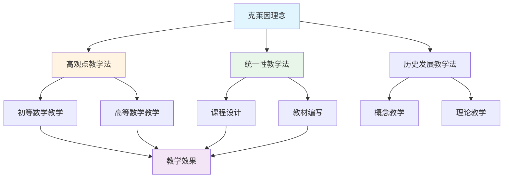
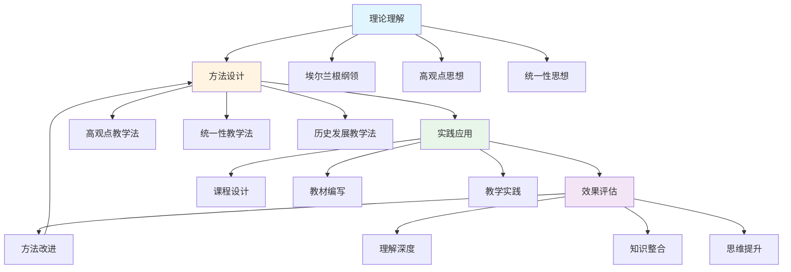
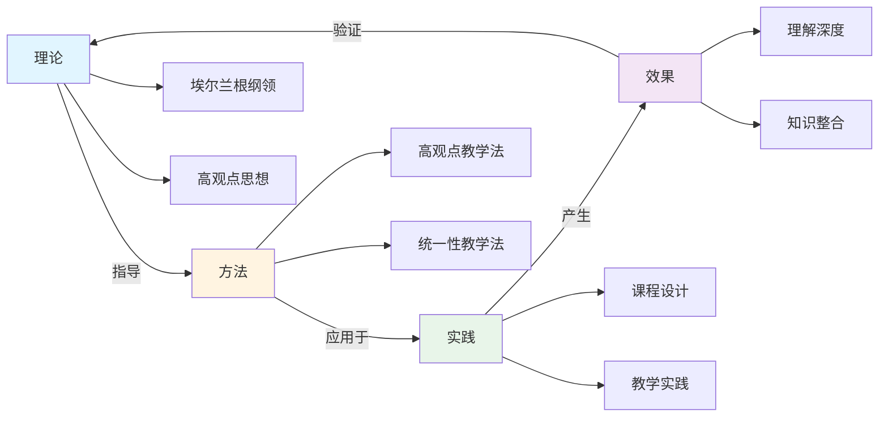

# 教育应用关联：克莱因理念在教育中的关联网络

**创建日期**: 2025年12月4日
**研究领域**: 克莱因数学理念 - 数学知识关联分析 - 关联关系分析
**主题编号**: K.08.02.03 (Klein.数学知识关联分析.关联关系分析.教育应用关联)
**优先级**: P0（最高优先级）⭐⭐⭐⭐⭐

---

## 📑 目录

- [教育应用关联：克莱因理念在教育中的关联网络](#教育应用关联克莱因理念在教育中的关联网络)
  - [📑 目录](#-目录)
  - [📋 一、概述](#-一概述)
    - [1.1 研究目标](#11-研究目标)
    - [1.2 教育应用关联的意义](#12-教育应用关联的意义)
    - [1.3 关联网络构建方法](#13-关联网络构建方法)
  - [🔷 二、教育应用节点](#-二教育应用节点)
    - [2.1 教学法应用](#21-教学法应用)
      - [应用1：高观点教学法（Higher Standpoint Teaching Method）](#应用1高观点教学法higher-standpoint-teaching-method)
      - [应用2：统一性教学法（Unity Teaching Method）](#应用2统一性教学法unity-teaching-method)
      - [应用3：历史发展教学法（Historical Development Teaching Method）](#应用3历史发展教学法historical-development-teaching-method)
    - [2.2 课程设计应用](#22-课程设计应用)
      - [应用1：课程结构设计（Curriculum Structure Design）](#应用1课程结构设计curriculum-structure-design)
      - [应用2：内容组织设计（Content Organization Design）](#应用2内容组织设计content-organization-design)
      - [应用3：关联建立设计（Association Building Design）](#应用3关联建立设计association-building-design)
    - [2.3 教材编写应用](#23-教材编写应用)
      - [应用1：教材结构设计（Textbook Structure Design）](#应用1教材结构设计textbook-structure-design)
      - [应用2：内容组织设计（Content Organization Design）](#应用2内容组织设计content-organization-design-1)
      - [应用3：关联建立设计（Association Building Design）](#应用3关联建立设计association-building-design-1)
  - [📐 三、关联关系类型](#-三关联关系类型)
    - [3.1 理论-应用关联](#31-理论-应用关联)
      - [关联类型1：直接应用关联](#关联类型1直接应用关联)
      - [关联类型2：间接应用关联](#关联类型2间接应用关联)
      - [关联类型3：综合应用关联](#关联类型3综合应用关联)
    - [3.2 方法-实践关联](#32-方法-实践关联)
      - [关联类型1：方法指导实践](#关联类型1方法指导实践)
      - [关联类型2：实践验证方法](#关联类型2实践验证方法)
      - [关联类型3：方法-实践互动](#关联类型3方法-实践互动)
    - [3.3 理念-效果关联](#33-理念-效果关联)
      - [关联类型1：理念产生效果](#关联类型1理念产生效果)
      - [关联类型2：效果验证理念](#关联类型2效果验证理念)
      - [关联类型3：理念-效果循环](#关联类型3理念-效果循环)
  - [🔗 四、关联网络可视化](#-四关联网络可视化)
    - [4.1 网络图](#41-网络图)
    - [4.2 流程图](#42-流程图)
    - [4.3 关系图](#43-关系图)
  - [💡 五、应用价值](#-五应用价值)
    - [5.1 教学应用价值](#51-教学应用价值)
      - [价值1：教学方法选择](#价值1教学方法选择)
      - [价值2：教学策略设计](#价值2教学策略设计)
      - [价值3：教学效果提升](#价值3教学效果提升)
    - [5.2 课程设计价值](#52-课程设计价值)
      - [价值1：课程结构设计](#价值1课程结构设计)
      - [价值2：内容组织设计](#价值2内容组织设计)
      - [价值3：关联建立设计](#价值3关联建立设计)
    - [5.3 教育改革价值](#53-教育改革价值)
      - [价值1：教育改革指导](#价值1教育改革指导)
      - [价值2：改革方案设计](#价值2改革方案设计)
      - [价值3：改革效果评估](#价值3改革效果评估)
  - [📚 六、文献与资源](#-六文献与资源)
    - [6.1 原始文献](#61-原始文献)
    - [6.2 现代研究文献](#62-现代研究文献)
      - [数学教育研究](#数学教育研究)
      - [教育应用研究](#教育应用研究)
    - [6.3 在线资源](#63-在线资源)
  - [🌍 七、国际视角与权威对标](#-七国际视角与权威对标)
    - [7.1 Wikipedia资源对标](#71-wikipedia资源对标)
    - [7.2 国际大学课程对标](#72-国际大学课程对标)
  - [🔗 八、与其他文档的关联性](#-八与其他文档的关联性)
    - [8.1 与本专题其他文档的关联](#81-与本专题其他文档的关联)
    - [8.2 与项目其他文档的关联](#82-与项目其他文档的关联)
  - [📊 九、总结与展望](#-九总结与展望)
    - [9.1 核心价值总结](#91-核心价值总结)
    - [9.2 网络特点](#92-网络特点)
    - [9.3 未来展望](#93-未来展望)

---

## 📋 一、概述

### 1.1 研究目标

**研究目标**：

构建克莱因理念在教育应用中的关联网络，建立：

1. **网络构建**：构建教育应用关联网络
2. **关系分析**：分析应用关联关系
3. **可视化**：实现网络可视化
4. **应用价值**：提取应用价值

### 1.2 教育应用关联的意义

**教育应用关联（Educational Application Association）** / **Bildungsanwendungsassoziation**：

展示克莱因理念在教育应用中关联关系的网络。

**意义**：

- **系统理解**：系统理解教育应用
- **关联发现**：发现应用关联
- **应用指导**：指导教育应用

### 1.3 关联网络构建方法

**方法**：

- 应用节点识别
- 关联关系识别
- 网络可视化

---

## 🔷 二、教育应用节点

### 2.1 教学法应用

**教学法应用节点（Teaching Method Application Nodes）** / **Lehrmethoden-Anwendungs-Knoten**：

克莱因理念在教学法中的应用，包括高观点教学法、统一性教学法和历史发展教学法。

#### 应用1：高观点教学法（Higher Standpoint Teaching Method）

**核心思想**：

从高等数学的视角看初等数学，建立初等数学和高等数学的关联。

**应用领域**：

1. **算术的高观点**
   - **初等视角**：数的运算、数的性质
   - **高等视角**：数系的结构、代数结构
   - **关联建立**：从代数结构理解数的运算
   - **教学价值**：统一理解数系

2. **代数的高观点**
   - **初等视角**：方程求解、函数性质
   - **高等视角**：群论、环论、域论
   - **关联建立**：从抽象代数理解初等代数
   - **教学价值**：统一理解代数

3. **几何的高观点**
   - **初等视角**：图形的性质、几何证明
   - **高等视角**：变换群、不变量理论
   - **关联建立**：从变换群理解几何性质
   - **教学价值**：统一理解几何

4. **分析的高观点**
   - **初等视角**：函数的性质、微积分
   - **高等视角**：极限理论、拓扑学
   - **关联建立**：从拓扑理解连续性
   - **教学价值**：统一理解分析

**教学效果**：

- **理解深度**：加深对初等数学的理解
- **知识关联**：建立初等和高等的关联
- **思维提升**：提升数学思维能力

#### 应用2：统一性教学法（Unity Teaching Method）

**核心思想**：

强调数学知识的统一性，用统一的方法理解不同的数学内容。

**应用领域**：

1. **数系统一**
   - **自然数**：半群、幺半群
   - **整数**：群
   - **有理数**：域
   - **实数**：完备域
   - **复数**：代数闭域
   - **统一理解**：数系是代数结构的序列

2. **几何统一**
   - **欧氏几何**：等距变换群
   - **仿射几何**：仿射变换群
   - **射影几何**：射影变换群
   - **统一理解**：几何由变换群决定

3. **代数统一**
   - **群**：基本代数结构
   - **环**：群的扩展
   - **域**：环的特殊情况
   - **统一理解**：代数结构是统一的

**教学效果**：

- **知识整合**：整合分散的数学知识
- **理解统一**：统一理解数学内容
- **思维提升**：提升数学思维能力

#### 应用3：历史发展教学法（Historical Development Teaching Method）

**核心思想**：

从历史发展的视角看数学，理解数学概念的发展过程。

**应用领域**：

1. **概念发展**
   - **历史背景**：概念产生的历史背景
   - **发展过程**：概念的发展过程
   - **现代意义**：概念的现代意义
   - **教学价值**：理解概念的本质

2. **理论发展**
   - **历史背景**：理论产生的历史背景
   - **发展过程**：理论的发展过程
   - **现代意义**：理论的现代意义
   - **教学价值**：理解理论的发展

3. **方法发展**
   - **历史背景**：方法产生的历史背景
   - **发展过程**：方法的发展过程
   - **现代意义**：方法的现代意义
   - **教学价值**：理解方法的发展

**教学效果**：

- **理解深度**：加深对数学的理解
- **历史视角**：建立历史视角
- **思维提升**：提升数学思维能力

### 2.2 课程设计应用

**课程设计应用节点（Curriculum Design Application Nodes）** / **Lehrplan-Design-Anwendungs-Knoten**：

克莱因理念在课程设计中的应用，包括课程结构设计、内容组织设计和关联建立设计。

#### 应用1：课程结构设计（Curriculum Structure Design）

**核心思想**：

基于克莱因理念设计课程结构，建立系统的课程体系。

**设计原则**：

1. **层次性原则**
   - **基础层**：初等数学内容
   - **提高层**：高等数学内容
   - **关联层**：初等和高等的关联
   - **设计价值**：建立层次结构

2. **统一性原则**
   - **统一框架**：使用统一框架组织内容
   - **统一方法**：使用统一方法处理内容
   - **统一理解**：建立统一理解
   - **设计价值**：建立统一结构

3. **关联性原则**
   - **内容关联**：建立内容之间的关联
   - **概念关联**：建立概念之间的关联
   - **方法关联**：建立方法之间的关联
   - **设计价值**：建立关联结构

**设计方法**：

1. **基于变换群的结构**
   - **几何课程**：基于变换群组织几何内容
   - **代数课程**：基于群论组织代数内容
   - **应用价值**：统一课程结构

2. **基于高观点的结构**
   - **初等课程**：从高观点看初等内容
   - **高等课程**：从高观点看高等内容
   - **应用价值**：建立层次结构

3. **基于统一性的结构**
   - **统一框架**：使用统一框架组织内容
   - **统一方法**：使用统一方法处理内容
   - **应用价值**：建立统一结构

#### 应用2：内容组织设计（Content Organization Design）

**核心思想**：

基于克莱因理念组织课程内容，建立系统的内容体系。

**组织方法**：

1. **螺旋式组织**
   - **重复出现**：同一概念在不同层次重复出现
   - **逐步深入**：每次出现都更深入
   - **组织价值**：建立螺旋结构

2. **主题式组织**
   - **主题选择**：选择核心主题
   - **主题展开**：围绕主题展开内容
   - **组织价值**：建立主题结构

3. **问题式组织**
   - **问题提出**：提出核心问题
   - **问题解决**：围绕问题组织内容
   - **组织价值**：建立问题结构

**组织原则**：

1. **从具体到抽象**
   - **具体例子**：从具体例子开始
   - **抽象概念**：逐步抽象到概念
   - **组织价值**：符合认知规律

2. **从简单到复杂**
   - **简单内容**：从简单内容开始
   - **复杂内容**：逐步到复杂内容
   - **组织价值**：符合认知规律

3. **从局部到整体**
   - **局部内容**：从局部内容开始
   - **整体内容**：逐步到整体内容
   - **组织价值**：符合认知规律

#### 应用3：关联建立设计（Association Building Design）

**核心思想**：

基于克莱因理念建立内容之间的关联，形成系统的关联网络。

**关联类型**：

1. **概念关联**
   - **概念关系**：建立概念之间的关系
   - **概念网络**：形成概念网络
   - **关联价值**：建立概念关联

2. **理论关联**
   - **理论关系**：建立理论之间的关系
   - **理论网络**：形成理论网络
   - **关联价值**：建立理论关联

3. **方法关联**
   - **方法关系**：建立方法之间的关系
   - **方法网络**：形成方法网络
   - **关联价值**：建立方法关联

**建立方法**：

1. **基于变换群的关联**
   - **几何关联**：基于变换群建立几何关联
   - **代数关联**：基于群论建立代数关联
   - **应用价值**：统一关联方法

2. **基于高观点的关联**
   - **初等-高等关联**：从高观点建立初等和高等的关联
   - **内容关联**：建立内容之间的关联
   - **应用价值**：建立层次关联

3. **基于统一性的关联**
   - **统一框架**：使用统一框架建立关联
   - **统一方法**：使用统一方法建立关联
   - **应用价值**：建立统一关联

### 2.3 教材编写应用

**教材编写应用节点（Textbook Writing Application Nodes）** / **Lehrbuch-Schreib-Anwendungs-Knoten**：

克莱因理念在教材编写中的应用，包括教材结构设计、内容组织设计和关联建立设计。

#### 应用1：教材结构设计（Textbook Structure Design）

**核心思想**：

基于克莱因理念设计教材结构，建立系统的教材体系。

**设计原则**：

1. **系统性原则**
   - **系统结构**：建立系统的教材结构
   - **系统内容**：组织系统的教材内容
   - **设计价值**：建立系统结构

2. **层次性原则**
   - **层次结构**：建立层次化的教材结构
   - **层次内容**：组织层次化的教材内容
   - **设计价值**：建立层次结构

3. **关联性原则**
   - **关联结构**：建立关联化的教材结构
   - **关联内容**：组织关联化的教材内容
   - **设计价值**：建立关联结构

**设计方法**：

1. **基于变换群的结构**
   - **几何教材**：基于变换群组织几何内容
   - **代数教材**：基于群论组织代数内容
   - **应用价值**：统一教材结构

2. **基于高观点的结构**
   - **初等教材**：从高观点看初等内容
   - **高等教材**：从高观点看高等内容
   - **应用价值**：建立层次结构

3. **基于统一性的结构**
   - **统一框架**：使用统一框架组织内容
   - **统一方法**：使用统一方法处理内容
   - **应用价值**：建立统一结构

#### 应用2：内容组织设计（Content Organization Design）

**核心思想**：

基于克莱因理念组织教材内容，建立系统的内容体系。

**组织方法**：

1. **主题式组织**
   - **主题选择**：选择核心主题
   - **主题展开**：围绕主题展开内容
   - **组织价值**：建立主题结构

2. **问题式组织**
   - **问题提出**：提出核心问题
   - **问题解决**：围绕问题组织内容
   - **组织价值**：建立问题结构

3. **历史式组织**
   - **历史背景**：提供历史背景
   - **历史发展**：展示历史发展
   - **组织价值**：建立历史结构

**组织原则**：

1. **从具体到抽象**
   - **具体例子**：从具体例子开始
   - **抽象概念**：逐步抽象到概念
   - **组织价值**：符合认知规律

2. **从简单到复杂**
   - **简单内容**：从简单内容开始
   - **复杂内容**：逐步到复杂内容
   - **组织价值**：符合认知规律

3. **从局部到整体**
   - **局部内容**：从局部内容开始
   - **整体内容**：逐步到整体内容
   - **组织价值**：符合认知规律

#### 应用3：关联建立设计（Association Building Design）

**核心思想**：

基于克莱因理念建立内容之间的关联，形成系统的关联网络。

**关联类型**：

1. **概念关联**
   - **概念关系**：建立概念之间的关系
   - **概念网络**：形成概念网络
   - **关联价值**：建立概念关联

2. **理论关联**
   - **理论关系**：建立理论之间的关系
   - **理论网络**：形成理论网络
   - **关联价值**：建立理论关联

3. **应用关联**
   - **应用关系**：建立应用之间的关系
   - **应用网络**：形成应用网络
   - **关联价值**：建立应用关联

**建立方法**：

1. **基于变换群的关联**
   - **几何关联**：基于变换群建立几何关联
   - **代数关联**：基于群论建立代数关联
   - **应用价值**：统一关联方法

2. **基于高观点的关联**
   - **初等-高等关联**：从高观点建立初等和高等的关联
   - **内容关联**：建立内容之间的关联
   - **应用价值**：建立层次关联

3. **基于统一性的关联**
   - **统一框架**：使用统一框架建立关联
   - **统一方法**：使用统一方法建立关联
   - **应用价值**：建立统一关联

---

## 📐 三、关联关系类型

### 3.1 理论-应用关联

**理论-应用关联（Theory-Application Association）** / **Theorie-Anwendungs-Assoziation**：

理论与应用之间的关联关系，包括关联类型和关联强度。

#### 关联类型1：直接应用关联

**定义**：

理论$T$直接应用于教育实践$P$。

**典型例子**：

1. **埃尔兰根纲领 → 几何教学**
   - **关联类型**：直接应用关联
   - **关联强度**：⭐⭐⭐⭐⭐（最强）
   - **关联描述**：埃尔兰根纲领直接应用于几何教学
   - **应用方式**：用变换群统一几何教学

2. **高观点教学法 → 初等数学教学**
   - **关联类型**：直接应用关联
   - **关联强度**：⭐⭐⭐⭐⭐（最强）
   - **关联描述**：高观点教学法直接应用于初等数学教学
   - **应用方式**：从高观点看初等数学

#### 关联类型2：间接应用关联

**定义**：

理论$T$通过中间理论$M$应用于教育实践$P$。

**典型例子**：

1. **群论 → 不变量理论 → 几何教学**
   - **关联类型**：间接应用关联
   - **关联强度**：⭐⭐⭐⭐（强）
   - **关联描述**：群论通过不变量理论应用于几何教学
   - **应用方式**：用不变量理论指导几何教学

2. **统一性思想 → 课程设计 → 教学实践**
   - **关联类型**：间接应用关联
   - **关联强度**：⭐⭐⭐⭐（强）
   - **关联描述**：统一性思想通过课程设计应用于教学实践
   - **应用方式**：用统一性思想指导课程设计

#### 关联类型3：综合应用关联

**定义**：

多个理论$T_1, T_2, \ldots, T_n$综合应用于教育实践$P$。

**典型例子**：

1. **埃尔兰根纲领 + 高观点教学法 → 几何课程设计**
   - **关联类型**：综合应用关联
   - **关联强度**：⭐⭐⭐⭐⭐（最强）
   - **关联描述**：埃尔兰根纲领和高观点教学法综合应用于几何课程设计
   - **应用方式**：结合两种理论设计几何课程

2. **统一性思想 + 历史发展教学法 → 数学课程设计**
   - **关联类型**：综合应用关联
   - **关联强度**：⭐⭐⭐⭐（强）
   - **关联描述**：统一性思想和历史发展教学法综合应用于数学课程设计
   - **应用方式**：结合两种方法设计数学课程

### 3.2 方法-实践关联

**方法-实践关联（Method-Practice Association）** / **Methode-Praxis-Assoziation**：

教学方法与教学实践之间的关联关系。

#### 关联类型1：方法指导实践

**定义**：

教学方法$M$指导教学实践$P$。

**典型例子**：

1. **高观点教学法 → 初等数学教学实践**
   - **关联类型**：方法指导实践
   - **关联强度**：⭐⭐⭐⭐⭐（最强）
   - **关联描述**：高观点教学法指导初等数学教学实践
   - **指导方式**：从高观点设计教学

2. **统一性教学法 → 数学教学实践**
   - **关联类型**：方法指导实践
   - **关联强度**：⭐⭐⭐⭐（强）
   - **关联描述**：统一性教学法指导数学教学实践
   - **指导方式**：用统一性组织教学

#### 关联类型2：实践验证方法

**定义**：

教学实践$P$验证教学方法$M$的有效性。

**典型例子**：

1. **初等数学教学实践 → 高观点教学法**
   - **关联类型**：实践验证方法
   - **关联强度**：⭐⭐⭐⭐（强）
   - **关联描述**：初等数学教学实践验证高观点教学法的有效性
   - **验证方式**：通过实践效果验证方法

2. **数学教学实践 → 统一性教学法**
   - **关联类型**：实践验证方法
   - **关联强度**：⭐⭐⭐⭐（强）
   - **关联描述**：数学教学实践验证统一性教学法的有效性
   - **验证方式**：通过实践效果验证方法

#### 关联类型3：方法-实践互动

**定义**：

教学方法$M$和教学实践$P$相互影响、相互促进。

**典型例子**：

1. **高观点教学法 ↔ 初等数学教学实践**
   - **关联类型**：方法-实践互动
   - **关联强度**：⭐⭐⭐⭐⭐（最强）
   - **关联描述**：高观点教学法和初等数学教学实践相互影响
   - **互动方式**：方法指导实践，实践改进方法

2. **统一性教学法 ↔ 数学教学实践**
   - **关联类型**：方法-实践互动
   - **关联强度**：⭐⭐⭐⭐（强）
   - **关联描述**：统一性教学法和数学教学实践相互影响
   - **互动方式**：方法指导实践，实践改进方法

### 3.3 理念-效果关联

**理念-效果关联（Idea-Effect Association）** / **Idee-Wirkung-Assoziation**：

教育理念与教育效果之间的关联关系。

#### 关联类型1：理念产生效果

**定义**：

教育理念$I$产生教育效果$E$。

**典型例子**：

1. **高观点理念 → 理解深度提升**
   - **关联类型**：理念产生效果
   - **关联强度**：⭐⭐⭐⭐⭐（最强）
   - **关联描述**：高观点理念产生理解深度提升的效果
   - **效果表现**：学生对数学的理解更深入

2. **统一性理念 → 知识整合效果**
   - **关联类型**：理念产生效果
   - **关联强度**：⭐⭐⭐⭐（强）
   - **关联描述**：统一性理念产生知识整合的效果
   - **效果表现**：学生能够整合分散的数学知识

#### 关联类型2：效果验证理念

**定义**：

教育效果$E$验证教育理念$I$的正确性。

**典型例子**：

1. **理解深度提升 → 高观点理念**
   - **关联类型**：效果验证理念
   - **关联强度**：⭐⭐⭐⭐（强）
   - **关联描述**：理解深度提升验证高观点理念的正确性
   - **验证方式**：通过效果验证理念

2. **知识整合效果 → 统一性理念**
   - **关联类型**：效果验证理念
   - **关联强度**：⭐⭐⭐⭐（强）
   - **关联描述**：知识整合效果验证统一性理念的正确性
   - **验证方式**：通过效果验证理念

#### 关联类型3：理念-效果循环

**定义**：

教育理念$I$和教育效果$E$形成循环，相互促进。

**典型例子**：

1. **高观点理念 ↔ 理解深度提升**
   - **关联类型**：理念-效果循环
   - **关联强度**：⭐⭐⭐⭐⭐（最强）
   - **关联描述**：高观点理念和理解深度提升形成循环
   - **循环方式**：理念产生效果，效果强化理念

2. **统一性理念 ↔ 知识整合效果**
   - **关联类型**：理念-效果循环
   - **关联强度**：⭐⭐⭐⭐（强）
   - **关联描述**：统一性理念和知识整合效果形成循环
   - **循环方式**：理念产生效果，效果强化理念

---

## 🔗 四、关联网络可视化

### 4.1 网络图

**教育应用网络图（Educational Application Network Graph）** / **Bildungsanwendungs-Netzwerk-Graph**：

使用图论方法可视化教育应用网络，节点表示应用，边表示关联关系。

**网络特征**：

- **中心节点**：克莱因理念是中心节点
- **连接度**：克莱因理念连接多个应用
- **网络密度**：应用网络密度较高
- **聚类性**：应用形成多个聚类

### 4.2 流程图

**教育应用流程图（Educational Application Flow Chart）** / **Bildungsanwendungs-Flussdiagramm**：

使用流程图可视化教育应用的流程步骤和关系。

**流程特征**：

- **流程清晰**：应用流程清晰
- **循环改进**：形成循环改进机制
- **步骤明确**：每个步骤明确
- **关系清楚**：步骤之间的关系清楚

### 4.3 关系图

**教育应用关系图（Educational Application Relation Graph）** / **Bildungsanwendungs-Relations-Graph**：

使用关系图可视化教育应用之间的关系类型和强度。

**关系特征**：

- **关系类型**：指导、应用、产生、验证等
- **关系强度**：用边的粗细表示关系强度
- **关系方向**：用箭头表示关系方向
- **关系意义**：每个关系的意义明确

---

## 💡 五、应用价值

### 5.1 教学应用价值

**教学应用价值（Teaching Application Value）** / **Lehranwendungswert**：

教育应用关联为教学提供了方法选择和策略设计。

#### 价值1：教学方法选择

**核心价值**：

教育应用关联为教学方法选择提供指导。

**具体应用**：

1. **方法识别**
   - **问题**：识别适合的教学方法
   - **方法**：基于教育应用关联识别方法
   - **应用**：教学方法选择
   - **价值**：选择合适的方法

2. **方法比较**
   - **问题**：比较不同教学方法
   - **方法**：基于教育应用关联比较方法
   - **应用**：教学方法比较
   - **价值**：选择最优方法

3. **方法组合**
   - **问题**：组合多种教学方法
   - **方法**：基于教育应用关联组合方法
   - **应用**：教学方法组合
   - **价值**：形成方法体系

#### 价值2：教学策略设计

**核心价值**：

教育应用关联为教学策略设计提供框架。

**具体应用**：

1. **策略设计**
   - **问题**：设计教学策略
   - **方法**：基于教育应用关联设计策略
   - **应用**：教学策略设计
   - **价值**：设计有效策略

2. **策略优化**
   - **问题**：优化教学策略
   - **方法**：基于教育应用关联优化策略
   - **应用**：教学策略优化
   - **价值**：提高策略效果

3. **策略评估**
   - **问题**：评估教学策略
   - **方法**：基于教育应用关联评估策略
   - **应用**：教学策略评估
   - **价值**：改进策略

#### 价值3：教学效果提升

**核心价值**：

教育应用关联为教学效果提升提供方法。

**具体应用**：

1. **效果识别**
   - **问题**：识别教学效果
   - **方法**：基于教育应用关联识别效果
   - **应用**：教学效果识别
   - **价值**：了解教学效果

2. **效果分析**
   - **问题**：分析教学效果
   - **方法**：基于教育应用关联分析效果
   - **应用**：教学效果分析
   - **价值**：理解效果原因

3. **效果改进**
   - **问题**：改进教学效果
   - **方法**：基于教育应用关联改进效果
   - **应用**：教学效果改进
   - **价值**：提升教学效果

### 5.2 课程设计价值

**课程设计价值（Curriculum Design Value）** / **Lehrplan-Design-Wert**：

教育应用关联为课程设计提供结构框架和组织方法。

#### 价值1：课程结构设计

**核心价值**：

教育应用关联为课程结构设计提供框架。

**具体应用**：

1. **结构设计**
   - **问题**：设计课程结构
   - **方法**：基于教育应用关联设计结构
   - **应用**：课程结构设计
   - **价值**：设计系统结构

2. **结构优化**
   - **问题**：优化课程结构
   - **方法**：基于教育应用关联优化结构
   - **应用**：课程结构优化
   - **价值**：提高结构质量

3. **结构评估**
   - **问题**：评估课程结构
   - **方法**：基于教育应用关联评估结构
   - **应用**：课程结构评估
   - **价值**：改进结构

#### 价值2：内容组织设计

**核心价值**：

教育应用关联为内容组织设计提供方法。

**具体应用**：

1. **组织设计**
   - **问题**：设计内容组织
   - **方法**：基于教育应用关联设计组织
   - **应用**：内容组织设计
   - **价值**：设计有效组织

2. **组织优化**
   - **问题**：优化内容组织
   - **方法**：基于教育应用关联优化组织
   - **应用**：内容组织优化
   - **价值**：提高组织质量

3. **组织评估**
   - **问题**：评估内容组织
   - **方法**：基于教育应用关联评估组织
   - **应用**：内容组织评估
   - **价值**：改进组织

#### 价值3：关联建立设计

**核心价值**：

教育应用关联为关联建立设计提供方法。

**具体应用**：

1. **关联设计**
   - **问题**：设计内容关联
   - **方法**：基于教育应用关联设计关联
   - **应用**：内容关联设计
   - **价值**：设计有效关联

2. **关联优化**
   - **问题**：优化内容关联
   - **方法**：基于教育应用关联优化关联
   - **应用**：内容关联优化
   - **价值**：提高关联质量

3. **关联评估**
   - **问题**：评估内容关联
   - **方法**：基于教育应用关联评估关联
   - **应用**：内容关联评估
   - **价值**：改进关联

### 5.3 教育改革价值

**教育改革价值（Educational Reform Value）** / **Bildungsreform-Wert**：

教育应用关联为教育改革提供指导和方法。

#### 价值1：教育改革指导

**核心价值**：

教育应用关联为教育改革提供指导。

**具体应用**：

1. **改革方向**
   - **问题**：确定改革方向
   - **方法**：基于教育应用关联确定方向
   - **应用**：教育改革方向
   - **价值**：明确改革方向

2. **改革目标**
   - **问题**：设定改革目标
   - **方法**：基于教育应用关联设定目标
   - **应用**：教育改革目标
   - **价值**：明确改革目标

3. **改革路径**
   - **问题**：规划改革路径
   - **方法**：基于教育应用关联规划路径
   - **应用**：教育改革路径
   - **价值**：规划改革路径

#### 价值2：改革方案设计

**核心价值**：

教育应用关联为改革方案设计提供框架。

**具体应用**：

1. **方案设计**
   - **问题**：设计改革方案
   - **方法**：基于教育应用关联设计方案
   - **应用**：教育改革方案设计
   - **价值**：设计有效方案

2. **方案优化**
   - **问题**：优化改革方案
   - **方法**：基于教育应用关联优化方案
   - **应用**：教育改革方案优化
   - **价值**：提高方案质量

3. **方案评估**
   - **问题**：评估改革方案
   - **方法**：基于教育应用关联评估方案
   - **应用**：教育改革方案评估
   - **价值**：改进方案

#### 价值3：改革效果评估

**核心价值**：

教育应用关联为改革效果评估提供方法。

**具体应用**：

1. **效果识别**
   - **问题**：识别改革效果
   - **方法**：基于教育应用关联识别效果
   - **应用**：教育改革效果识别
   - **价值**：了解改革效果

2. **效果分析**
   - **问题**：分析改革效果
   - **方法**：基于教育应用关联分析效果
   - **应用**：教育改革效果分析
   - **价值**：理解效果原因

3. **效果改进**
   - **问题**：改进改革效果
   - **方法**：基于教育应用关联改进效果
   - **应用**：教育改革效果改进
   - **价值**：提升改革效果

---

## 📚 六、文献与资源

### 6.1 原始文献

**原始文献（Primary Sources）** / **Primärquellen**：

1. **Klein, F. (1908-1916).** *Elementarmathematik vom höheren Standpunkte aus*
   - **内容**：高观点下的初等数学
   - **意义**：数学教育改革的经典文献
   - **影响**：现代数学教育的基础

2. **Klein, F. (1872).** *Vergleichende Betrachtungen über neuere geometrische Forschungen* (Erlangen Program)
   - **内容**：埃尔兰根纲领
   - **意义**：几何统一的经典文献
   - **影响**：现代几何学的基础

3. **Klein, F. (1924-1925).** *Vorlesungen über die Entwicklung der Mathematik im 19. Jahrhundert*
   - **内容**：19世纪数学发展史
   - **意义**：数学史研究的经典文献
   - **影响**：数学史研究的基础

### 6.2 现代研究文献

**现代研究文献（Modern Research Literature）** / **Moderne Forschungsliteratur**：

#### 数学教育研究

1. **Freudenthal, H. (1973).** *Mathematics as an Educational Task*
   - **内容**：数学教育任务
   - **意义**：数学教育的现代理论
   - **应用**：教育应用研究

2. **Dienes, Z. (1960).** *Building Up Mathematics*
   - **内容**：数学建构
   - **意义**：数学教育的建构主义理论
   - **应用**：教育应用研究

#### 教育应用研究

1. **Tall, D. (2013).** *How Humans Learn to Think Mathematically*
   - **内容**：人类如何学习数学思维
   - **意义**：数学认知的现代理论
   - **应用**：教育应用研究

2. **Sfard, A. (2008).** *Thinking as Communicating*
   - **内容**：思维即交流
   - **意义**：数学教育的交流理论
   - **应用**：教育应用研究

### 6.3 在线资源

**在线资源（Online Resources）** / **Online-Ressourcen**：

1. **Wikipedia**
   - **Mathematics education**：数学教育条目
   - **Educational application**：教育应用条目
   - **Higher standpoint**：高观点条目

2. **国际数学教育委员会（ICMI）**
   - **数学教育研究**：数学教育研究资源
   - **教育应用研究**：教育应用研究资源

3. **美国数学教育研究协会（AERA）**
   - **数学教育**：数学教育资源
   - **教育应用**：教育应用资源

---

## 🌍 七、国际视角与权威对标

### 7.1 Wikipedia资源对标

**Wikipedia资源对标（Wikipedia Resource Alignment）** / **Wikipedia-Ressourcenausrichtung**：

1. **Mathematics education**条目
   - **内容**：数学教育的理论和实践
   - **对齐**：教育应用的理论基础
   - **应用**：教育应用研究

2. **Educational application**条目
   - **内容**：教育应用的方法和实践
   - **对齐**：教育应用的方法
   - **应用**：教育应用实践

3. **Higher standpoint**条目
   - **内容**：高观点的理论和应用
   - **对齐**：高观点教学法的理论基础
   - **应用**：高观点教学法应用

### 7.2 国际大学课程对标

**国际大学课程对标（International University Course Alignment）** / **Internationale Universitätskursausrichtung**：

1. **MIT 18.821 Project Laboratory in Mathematics**
   - **内容**：数学项目实验室
   - **对齐**：教育应用实践
   - **应用**：教育应用方法

2. **Stanford EDUC 200A Foundations of Education**
   - **内容**：教育基础
   - **对齐**：教育应用理论基础
   - **应用**：教育应用理论

3. **Harvard T-560 Teaching and Learning**
   - **内容**：教学与学习
   - **对齐**：教育应用方法
   - **应用**：教育应用实践

---

## 🔗 八、与其他文档的关联性

### 8.1 与本专题其他文档的关联

- **01-概念关联网络**：概念关联
  - **关系**：概念关联网络提供概念层面的关联
  - **应用**：教育应用关联可以基于概念关联网络构建

- **02-理论关联图谱**：理论关联
  - **关系**：理论关联图谱提供理论层面的关联
  - **应用**：教育应用关联可以基于理论关联图谱构建

- **04-跨学科关联分析**：跨学科关联
  - **关系**：跨学科关联分析提供跨学科层面的关联
  - **应用**：教育应用关联可以扩展到跨学科层面

### 8.2 与项目其他文档的关联

- **03-数学教育改革**：教育改革内容
  - **关系**：数学教育改革提供教育改革内容
  - **应用**：教育应用关联可以基于教育改革内容构建

- **02-高观点下的初等数学**：应用领域
  - **关系**：高观点下的初等数学提供应用领域
  - **应用**：教育应用关联可以扩展到应用领域

- **01-核心理论**：理论基础
  - **关系**：核心理论提供理论基础
  - **应用**：教育应用关联可以基于核心理论构建

---

## 📊 九、总结与展望

### 9.1 核心价值总结

**教育应用关联的核心价值**：

1. **理论价值**：
   - 系统理解教育应用
   - 指导教育应用实践
   - 促进教育应用发展

2. **实践价值**：
   - 指导教学方法选择
   - 指导课程设计
   - 指导教育改革

3. **教育价值**：
   - 提升教学效果
   - 改善课程质量
   - 推动教育改革

### 9.2 网络特点

**教育应用关联网络的特点**：

- **系统性**：系统的教育应用体系
- **关联性**：丰富的教育应用关联关系
- **可视化**：清晰的可视化表示
- **应用性**：广泛的应用价值

### 9.3 未来展望

**未来发展方向**：

1. **网络扩展**：扩展教育应用关联网络
2. **方法创新**：创新教育应用方法
3. **应用拓展**：在新领域的应用
4. **教育推广**：在教育中的推广

---

**创建日期**: 2025年12月4日
**最后更新**: 2025年12月4日
**状态**: ✅ 文档内容已扩展，包含详细的教育应用节点、关联关系和应用价值
