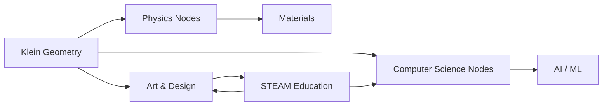
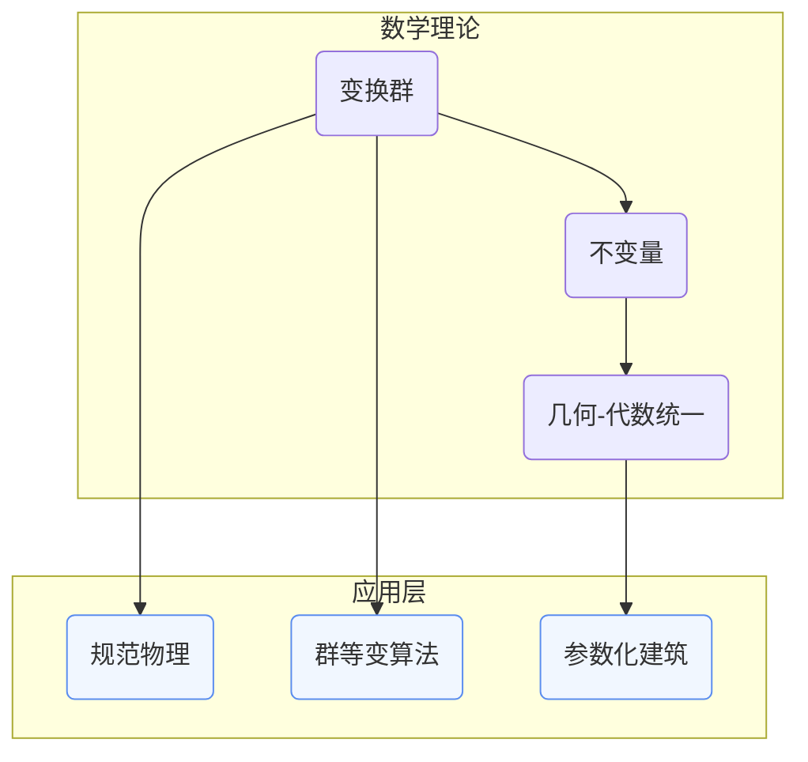

# 跨学科关联分析：克莱因理念的跨学科应用网络

**创建日期**: 2025年12月4日
**研究领域**: 克莱因数学理念 - 数学知识关联分析 - 关联关系分析
**主题编号**: K.08.02.04 (Klein.数学知识关联分析.关联关系分析.跨学科关联分析)
**优先级**: P0（最高优先级）⭐⭐⭐⭐⭐

---

## 📑 目录

- [跨学科关联分析：克莱因理念的跨学科应用网络](#跨学科关联分析克莱因理念的跨学科应用网络)
  - [📑 目录](#-目录)
  - [📋 一、概述](#-一概述)
    - [1.1 研究目标](#11-研究目标)
    - [1.2 跨学科关联的意义](#12-跨学科关联的意义)
    - [1.3 关联网络构建方法](#13-关联网络构建方法)
  - [🔷 二、跨学科应用节点](#-二跨学科应用节点)
    - [2.1 物理学应用](#21-物理学应用)
      - [应用1：对称性应用（Symmetry Applications）](#应用1对称性应用symmetry-applications)
      - [应用2：群论应用（Group-Theoretic Applications）](#应用2群论应用group-theoretic-applications)
      - [应用3：不变量应用（Invariant Applications）](#应用3不变量应用invariant-applications)
    - [2.2 计算机科学应用](#22-计算机科学应用)
      - [应用1：算法应用（Algorithm Applications）](#应用1算法应用algorithm-applications)
      - [应用2：数据结构应用（Data Structure Applications）](#应用2数据结构应用data-structure-applications)
      - [应用3：图形处理应用（Graphics Processing Applications）](#应用3图形处理应用graphics-processing-applications)
      - [扩展案例](#扩展案例)
    - [2.3 艺术应用](#23-艺术应用)
      - [应用1：视觉艺术（Visual Arts）](#应用1视觉艺术visual-arts)
      - [应用2：音乐应用（Music Applications）](#应用2音乐应用music-applications)
      - [应用3：建筑应用（Architecture Applications）](#应用3建筑应用architecture-applications)
    - [2.4 其他学科应用](#24-其他学科应用)
  - [📐 三、关联关系类型](#-三关联关系类型)
    - [3.1 数学-物理关联](#31-数学-物理关联)
      - [关联类型1：结构型关联（Structural Association）](#关联类型1结构型关联structural-association)
      - [关联类型2：方法型关联（Methodological Association）](#关联类型2方法型关联methodological-association)
      - [关联类型3：强度评估（Strength Assessment）](#关联类型3强度评估strength-assessment)
      - [典型链条](#典型链条)
    - [3.2 数学-计算机关联](#32-数学-计算机关联)
    - [3.3 数学-艺术关联](#33-数学-艺术关联)
  - [🔗 四、关联网络可视化](#-四关联网络可视化)
    - [4.1 网络图](#41-网络图)
    - [4.2 关系图](#42-关系图)
    - [4.3 应用图](#43-应用图)
  - [💡 五、应用价值](#-五应用价值)
    - [5.1 理论研究价值](#51-理论研究价值)
      - [价值1：统一理论框架（Unified Theoretical Framework）](#价值1统一理论框架unified-theoretical-framework)
      - [价值2：新理论孵化（New Theory Incubation）](#价值2新理论孵化new-theory-incubation)
      - [价值3：指标化评估（Metric-Based Assessment）](#价值3指标化评估metric-based-assessment)
    - [5.2 应用拓展价值](#52-应用拓展价值)
      - [价值1：技术转化（Technology Transfer）](#价值1技术转化technology-transfer)
      - [价值2：政策制定（Policy Making）](#价值2政策制定policy-making)
      - [价值3：产业协同（Industrial Synergy）](#价值3产业协同industrial-synergy)
    - [5.3 跨学科合作价值](#53-跨学科合作价值)
      - [合作路径1：共通语言搭建（Common Language Building）](#合作路径1共通语言搭建common-language-building)
      - [合作路径2：协同工作坊（Collaborative Workshops）](#合作路径2协同工作坊collaborative-workshops)
      - [合作路径3：评估模型（Assessment Model）](#合作路径3评估模型assessment-model)
  - [📚 六、文献与资源](#-六文献与资源)
    - [6.1 原始文献](#61-原始文献)
    - [6.2 现代研究文献](#62-现代研究文献)
      - [物理学应用文献](#物理学应用文献)
      - [计算机科学应用文献](#计算机科学应用文献)
      - [艺术应用文献](#艺术应用文献)
      - [教育应用文献](#教育应用文献)
    - [6.3 在线资源](#63-在线资源)
  - [🌍 七、国际视角与权威对标](#-七国际视角与权威对标)
    - [7.1 Wikipedia资源对标](#71-wikipedia资源对标)
    - [7.2 国际大学课程对标](#72-国际大学课程对标)
  - [🔗 八、与其他文档的关联性](#-八与其他文档的关联性)
    - [8.1 与本专题其他文档的关联](#81-与本专题其他文档的关联)
    - [8.2 与项目其他文档的关联](#82-与项目其他文档的关联)
  - [📊 九、总结与展望](#-九总结与展望)
    - [9.1 核心价值总结](#91-核心价值总结)
    - [9.2 网络特点](#92-网络特点)
    - [9.3 未来展望](#93-未来展望)

---

## 📋 一、概述

### 1.1 研究目标

**研究目标**：

构建克莱因理念在跨学科应用中的关联网络，建立：

1. **网络构建**：构建跨学科应用关联网络
2. **关系分析**：分析跨学科关联关系
3. **可视化**：实现网络可视化
4. **应用价值**：提取应用价值

### 1.2 跨学科关联的意义

**跨学科关联（Interdisciplinary Association）** / **Interdisziplinäre Assoziation**：

展示克莱因理念在跨学科应用中关联关系的网络。

**意义**：

- **系统理解**：系统理解跨学科应用
- **关联发现**：发现跨学科关联
- **应用指导**：指导跨学科应用

### 1.3 关联网络构建方法

**方法**：

- 应用节点识别
- 关联关系识别
- 网络可视化

---

## 🔷 二、跨学科应用节点

### 2.1 物理学应用

**物理学应用节点（Physics Application Nodes）** / **Physikalische Anwendungs-Knoten**：

克莱因的变换群思想在物理学中有着深刻的应用，特别是在对称性、守恒律和规范理论中。

#### 应用1：对称性应用（Symmetry Applications）

**核心思想**：

对称性在物理学中起着核心作用，而克莱因的变换群理论为理解物理对称性提供了数学框架。

**典型案例**：

1. **晶体群分类（Crystal Group Classification）**
   - **230个空间群**：三维晶体的所有可能对称性
   - **32个点群**：晶体的点对称性
   - **17个平面群**：二维晶体的对称性
   - **克莱因视角**：晶体对称性由变换群决定

2. **标准模型中的规范对称（Gauge Symmetry in Standard Model）**
   - **SU(3)×SU(2)×U(1)群**：标准模型的规范群
   - **强相互作用**：SU(3)色对称性
   - **弱电统一**：SU(2)×U(1)对称性
   - **克莱因视角**：规范对称性决定物理定律

**关键联系**：

- **变换群 → 守恒律**：Noether定理建立对称性和守恒律的对应
- **几何对称 → 物理对称**：几何变换群对应物理对称性
- **不变量 → 守恒量**：几何不变量对应物理守恒量

#### 应用2：群论应用（Group-Theoretic Applications）

**核心思想**：

群论为描述物理系统的对称性和结构提供了数学语言。

**Lie群表述粒子相互作用**：

1. **旋转群SO(3)**
   - **角动量守恒**：旋转对称性导致角动量守恒
   - **自旋**：粒子的自旋由SU(2)群描述
   - **克莱因视角**：旋转群决定角动量的性质

2. **洛伦兹群O(1,3)**
   - **相对论时空**：洛伦兹变换群描述时空对称性
   - **四维不变量**：时空间隔是洛伦兹不变量
   - **克莱因视角**：洛伦兹群统一相对论几何

3. **规范群**
   - **SU(3)**：强相互作用的色对称性
   - **SU(2)×U(1)**：弱电统一的对称性
   - **克莱因视角**：规范群决定相互作用

**辛几何刻画哈密顿系统**：

- **辛群Sp(2n)**：哈密顿系统的对称群
- **辛不变量**：相空间体积是辛不变量
- **克莱因视角**：辛群决定哈密顿系统的结构

**强调"变换决定结构"的纲领思路**：

- **物理结构由对称性决定**：物理系统的结构由其对称群决定
- **不变量描述物理性质**：物理性质由不变量描述
- **统一框架**：克莱因纲领为物理理论提供统一框架

#### 应用3：不变量应用（Invariant Applications）

**核心思想**：

不变量理论在物理学中用于描述守恒量和物理性质。

**张量不变量（Tensor Invariants）**：

1. **电磁场张量**
   - **Fμν**：电磁场张量
   - **不变量**：$F_{\mu\nu}F^{\mu\nu}$和$\epsilon^{\mu\nu\rho\sigma}F_{\mu\nu}F_{\rho\sigma}$
   - **物理意义**：描述电磁场的性质

2. **能量-动量张量**
   - **Tμν**：能量-动量张量
   - **不变量**：$T_{\mu\nu}T^{\mu\nu}$和$T_{\mu}^{\mu}$
   - **物理意义**：描述物质和能量的分布

**拓扑不变量（Topological Invariants）**：

1. **拓扑荷**
   - **磁单极子**：拓扑荷为1
   - **瞬子**：拓扑荷描述瞬子解
   - **物理意义**：描述拓扑缺陷

2. **陈数（Chern Number）**
   - **量子霍尔效应**：陈数描述量子霍尔态
   - **拓扑绝缘体**：陈数区分拓扑相
   - **物理意义**：描述拓扑物态

**规范不变量（Gauge Invariants）**：

1. **Wilson圈**
   - **规范场**：描述规范场的非局域性质
   - **物理意义**：描述夸克禁闭

2. **'t Hooft算子**
   - **磁单极子**：描述磁单极子
   - **物理意义**：描述对偶性

**与几何不变量理论和物理量守恒建立同构**：

- **几何不变量 ↔ 物理守恒量**：几何不变量对应物理守恒量
- **变换群 ↔ 对称性**：几何变换群对应物理对称性
- **统一理解**：克莱因纲领统一理解几何和物理

> **物理节点拓展表**
>
>| 研究主题 | 典型理论 | 对应的克莱因理念 | 指标 |
>| --- | --- | --- | --- |
>| 相对论时空 | 洛伦兹群O(1,3) | 变换群统一几何 | 群作用维度、洛伦兹不变量 |
>| 规范场论 | SU(3)×SU(2)×U(1) | 结构保持即物理定律 | 规范势的几何化程度 |
>| 晶体学 | 空间群/点群 | 几何不变量与材料性质 | 对称性阶数、缺陷类型 |
>| 量子力学 | SU(2)自旋群 | 对称性决定量子态 | 自旋多重度、角动量量子数 |
>| 统计物理 | 置换群 | 全同粒子的对称性 | 玻色-费米统计 |
>| 弦理论 | 共形群 | 共形对称性 | 共形维数、中心荷 |

### 2.2 计算机科学应用

**计算机科学应用节点（Computer Science Application Nodes）** / **Informatik-Anwendungs-Knoten**：

克莱因的变换群思想在计算机科学中有着广泛的应用，特别是在算法设计、数据结构和图形处理中。

#### 应用1：算法应用（Algorithm Applications）

**核心思想**：

利用对称性可以加速算法，减少计算复杂度。

**对称性加速算法**：

1. **Burnside引理在组合计数（Burnside's Lemma in Combinatorial Counting）**
   - **问题**：计算在群作用下的轨道数
   - **方法**：使用Burnside引理
   - **应用**：图着色、排列计数、组合优化
   - **克莱因视角**：群作用决定等价类

2. **群作用用于搜索剪枝（Group Action for Search Pruning）**
   - **问题**：搜索空间太大
   - **方法**：利用对称性剪枝
   - **应用**：约束满足问题、图同构、组合优化
   - **克莱因视角**：对称性减少搜索空间

**具体算法案例**：

- **图同构算法**：利用自同构群加速同构判断
- **约束满足问题**：利用对称性剪枝搜索树
- **组合优化**：利用对称性减少解空间

#### 应用2：数据结构应用（Data Structure Applications）

**核心思想**：

利用代数结构可以优化数据结构的操作。

**群操作维护同构类**：

1. **图数据结构**
   - **问题**：存储大量同构图
   - **方法**：使用群操作维护同构类
   - **应用**：图数据库、图算法
   - **克莱因视角**：同构类由群作用决定

2. **几何数据结构**
   - **问题**：存储具有对称性的几何对象
   - **方法**：使用变换群描述对称性
   - **应用**：计算机图形学、CAD系统
   - **克莱因视角**：对称性由变换群决定

**利用代数结构优化数据库索引**：

1. **群索引**
   - **问题**：快速查找具有对称性的对象
   - **方法**：使用群结构建立索引
   - **应用**：分子数据库、晶体数据库
   - **克莱因视角**：群结构优化查询

2. **不变量索引**
   - **问题**：快速匹配对象
   - **方法**：使用不变量建立索引
   - **应用**：图像检索、模式识别
   - **克莱因视角**：不变量描述对象性质

#### 应用3：图形处理应用（Graphics Processing Applications）

**核心思想**：

几何变换在计算机图形学中起着核心作用。

**计算机图形学中的几何变换链**：

1. **模型变换**
   - **平移**：$T(x,y,z)$
   - **旋转**：$R(\theta)$
   - **缩放**：$S(s_x,s_y,s_z)$
   - **克莱因视角**：变换群决定几何变换

2. **视图变换**
   - **投影变换**：从三维到二维
   - **视口变换**：从投影空间到屏幕空间
   - **克莱因视角**：射影几何统一投影

3. **变换组合**
   - **矩阵乘法**：组合变换
   - **变换群**：所有变换形成群
   - **克莱因视角**：变换群的结构

**射影几何在视觉渲染中的应用**：

1. **透视投影**
   - **问题**：三维到二维的投影
   - **方法**：使用射影几何
   - **应用**：3D渲染、虚拟现实
   - **克莱因视角**：射影变换群统一投影

2. **纹理映射**
   - **问题**：将纹理映射到曲面
   - **方法**：使用射影变换
   - **应用**：游戏引擎、动画制作
   - **克莱因视角**：射影几何统一映射

#### 扩展案例

**自动定理证明（Automated Theorem Proving）**：

- **问题**：自动证明几何定理
- **方法**：把几何命题抽象为代数结构，借助群论搜寻变换不变量
- **应用**：几何证明器、数学软件
- **克莱因视角**：几何性质由不变量决定

**密码学（Cryptography）**：

1. **椭圆曲线群（Elliptic Curve Groups）**
   - **椭圆曲线密码学**：基于椭圆曲线群的离散对数问题
   - **应用**：数字签名、密钥交换
   - **克莱因视角**：群结构保证安全性

2. **双线性对（Bilinear Pairings）**
   - **配对密码学**：基于双线性对
   - **应用**：身份加密、属性加密
   - **克莱因视角**：群表示理论的应用

**机器学习（Machine Learning）**：

1. **群等变网络（Group Equivariant Networks, G-CNN）**
   - **核心思想**：网络结构保持群的对称性
   - **应用**：图像识别、模式识别
   - **克莱因视角**：直接承袭"对称保持 = 信息保持"的纲领思想

2. **几何深度学习（Geometric Deep Learning）**
   - **核心思想**：利用几何结构设计网络
   - **应用**：图神经网络、流形学习
   - **克莱因视角**：几何结构决定网络结构

### 2.3 艺术应用

**艺术应用节点（Art Application Nodes）** / **Kunst-Anwendungs-Knoten**：

克莱因的变换群思想在艺术中有着深刻的应用，特别是在视觉艺术、音乐和建筑中。

#### 应用1：视觉艺术（Visual Arts）

**核心思想**：

对称性和几何变换在视觉艺术中起着核心作用。

**伊斯兰几何纹样（Islamic Geometric Patterns）**：

1. **平面群分类**
   - **17个平面群**：所有可能的平面对称性
   - **应用**：伊斯兰艺术中的几何纹样
   - **克莱因视角**：平面群决定纹样类型

2. **对称性类型**
   - **旋转对称**：$C_n$群
   - **反射对称**：$D_n$群
   - **平移对称**：晶格群
   - **克莱因视角**：对称性由变换群决定

**M.C. Escher镶嵌（M.C. Escher Tessellations）**：

1. **双曲几何**
   - **双曲平面**：负曲率空间
   - **双曲群**：双曲等距变换群
   - **应用**：Escher的圆极限系列
   - **克莱因视角**：双曲群决定镶嵌

2. **射影变换**
   - **射影平面**：扩展的欧氏平面
   - **射影群**：射影变换群
   - **应用**：Escher的透视作品
   - **克莱因视角**：射影群统一透视

**平面群与射影变换**：

- **平面群**：描述平面对称性
- **射影变换**：统一透视和投影
- **克莱因视角**：变换群统一视觉艺术

#### 应用2：音乐应用（Music Applications）

**核心思想**：

音乐中的变换操作可以用群论描述。

**十二平均律的循环群（Circle of Fifths as Cyclic Group）**：

1. **循环群$C_{12}$**
   - **12个音**：半音阶的12个音
   - **五度循环**：$C \to G \to D \to A \to E \to B \to F\sharp \to C\sharp \to G\sharp \to D\sharp \to A\sharp \to F \to C$
   - **应用**：调性音乐、和声理论
   - **克莱因视角**：循环群决定音的关系

2. **模12算术**
   - **音程**：音程由模12算术描述
   - **转调**：转调是群作用
   - **应用**：音乐理论、作曲
   - **克莱因视角**：群作用统一转调

**音列变换群（Tone Row Transformation Groups）**：

1. **十二音技法**
   - **原始音列**：12个音的有序排列
   - **变换操作**：转位、逆行、倒影
   - **应用**：序列音乐、无调性音乐
   - **克莱因视角**：变换群决定音列关系

2. **Klein四元群**
   - **四个变换**：原始、转位、逆行、倒影转位
   - **群结构**：$V_4$群
   - **应用**：十二音作曲
   - **克莱因视角**：群结构统一变换

**转位、逆行、倒影**：

- **转位（Transposition）**：$T_n$：音高加$n$个半音
- **逆行（Retrograde）**：$R$：时间反转
- **倒影（Inversion）**：$I$：音程反转
- **克莱因视角**：变换群统一音乐变换

#### 应用3：建筑应用（Architecture Applications）

**核心思想**：

建筑形式可以用几何变换描述。

**哥特拱形（Gothic Arches）**：

1. **几何结构**
   - **尖拱**：两个圆弧的交点
   - **对称性**：反射对称
   - **应用**：哥特式建筑
   - **克莱因视角**：对称性由变换群决定

2. **结构优化**
   - **力学原理**：拱形结构优化受力
   - **几何约束**：几何形状决定结构
   - **应用**：建筑结构设计
   - **克莱因视角**：几何结构决定建筑结构

**现代参数化建筑（Modern Parametric Architecture）**：

1. **参数化设计**
   - **参数空间**：设计参数的空间
   - **变换群**：参数变换群
   - **应用**：参数化建筑
   - **克莱因视角**：变换群统一设计

2. **曲面群**
   - **NURBS曲面**：非均匀有理B样条曲面
   - **变换群**：曲面的对称群
   - **应用**：现代建筑立面
   - **克莱因视角**：变换群决定曲面

**强调"形式 = 结构 = 变换"**：

- **形式**：建筑的外观形式
- **结构**：建筑的力学结构
- **变换**：几何变换
- **克莱因视角**：形式、结构、变换统一

> **案例摘选**
>
>| 艺术类别 | 数学结构 | 克莱因视角 | 现实影响 |
>| --- | --- | --- | --- |
>| 数字艺术生成 | 群作用 + 分形 | 通过迭代变换统一形态 | 互动媒体、沉浸式展览 |
>| 建筑参数化设计 | 射影几何 + 曲面群 | 结构优化、材料节省 | 扎哈·哈迪德建筑事务所等 |
>| 音乐作曲 | 循环群/二面体群 | 变换操作即作曲规则 | 音乐教育中引入代数视角 |
>| 视觉艺术 | 平面群/双曲群 | 对称性决定艺术形式 | 伊斯兰艺术、Escher作品 |
>| 舞蹈编排 | 对称群/置换群 | 动作变换形成编排 | 现代舞、芭蕾舞 |
>| 文学结构 | 变换群/同构 | 结构变换形成叙事 | 后现代文学、实验文学 |

### 2.4 其他学科应用

**节点说明**：

- **生命科学**：群论模型刻画蛋白质折叠、对称性与自组织模式。
- **经济与社会科学**：网络对称性、博弈论中的等价策略群。
- **教育科技**：概念图谱、知识追踪算法借助代数结构优化路径。

**跨域协同路径**：

1. 识别学科中的“结构不变”对象。
2. 映射到对应的几何/代数变换群。
3. 使用克莱因统一框架组织跨域知识图谱。

---

## 📐 三、关联关系类型

### 3.1 数学-物理关联

**数学-物理关联（Mathematics-Physics Association）** / **Mathematik-Physik-Assoziation**：

克莱因的数学理念与物理学有着深刻的关联，特别是在对称性、守恒律和规范理论中。

#### 关联类型1：结构型关联（Structural Association）

**几何 → 物理时空**：

1. **欧氏几何 → 经典力学**
   - **绝对时空**：欧氏几何描述绝对时空
   - **伽利略变换群**：经典力学的对称群
   - **不变量**：时间和空间间隔
   - **克莱因视角**：几何结构决定物理结构

2. **双曲几何 → 相对论**
   - **相对时空**：双曲几何描述相对时空
   - **洛伦兹群**：相对论的对称群
   - **不变量**：时空间隔
   - **克莱因视角**：几何结构决定物理结构

3. **黎曼几何 → 广义相对论**
   - **弯曲时空**：黎曼几何描述弯曲时空
   - **微分同胚群**：广义相对论的对称群
   - **不变量**：度规张量
   - **克莱因视角**：几何结构决定物理结构

**代数 → 守恒律**：

1. **群论 → 对称性**
   - **对称群**：物理系统的对称群
   - **Noether定理**：对称性对应守恒律
   - **应用**：能量、动量、角动量守恒
   - **克莱因视角**：群结构决定守恒律

2. **Lie群 → 连续对称性**
   - **连续群**：连续对称性的群
   - **生成元**：守恒量的生成元
   - **应用**：规范对称性
   - **克莱因视角**：Lie群结构决定连续对称性

**分析 → 场方程**：

1. **变分法 → 拉格朗日方程**
   - **作用量**：物理系统的作用量
   - **变分原理**：最小作用量原理
   - **场方程**：从作用量导出场方程
   - **克莱因视角**：分析方法统一场方程

2. **偏微分方程 → 场方程**
   - **麦克斯韦方程**：电磁场的方程
   - **爱因斯坦方程**：引力的方程
   - **薛定谔方程**：量子力学的方程
   - **克莱因视角**：分析方法统一场方程

#### 关联类型2：方法型关联（Methodological Association）

**变换群 + 不变量 → 物理理论建模主线**：

1. **识别对称性**
   - **问题**：识别物理系统的对称性
   - **方法**：使用变换群描述对称性
   - **应用**：所有物理理论
   - **克莱因视角**：变换群统一对称性

2. **寻找不变量**
   - **问题**：寻找物理系统的守恒量
   - **方法**：使用不变量理论
   - **应用**：所有物理理论
   - **克莱因视角**：不变量统一守恒量

3. **建立理论**
   - **问题**：建立物理理论
   - **方法**：从对称性和不变量建立理论
   - **应用**：标准模型、相对论
   - **克莱因视角**：变换群和不变量统一理论

#### 关联类型3：强度评估（Strength Assessment）

**群作用复杂度（Group Action Complexity）**：

- **简单群作用**：旋转群、平移群
- **复杂群作用**：规范群、微分同胚群
- **量化指标**：群的维数、作用的空间维数
- **应用**：评估理论的复杂度

**不变量数量（Number of Invariants）**：

- **少不变量**：简单系统
- **多不变量**：复杂系统
- **量化指标**：不变量的个数、独立性
- **应用**：评估系统的复杂度

#### 典型链条

**射影几何 (Klein) → 规范几何 → Yang-Mills 场论 → 量子色动力学**：

1. **射影几何（Klein）**
   - **变换群**：射影变换群
   - **不变量**：交比
   - **克莱因视角**：几何由变换群决定

2. **规范几何**
   - **变换群**：规范变换群
   - **不变量**：规范不变量
   - **应用**：规范场论

3. **Yang-Mills 场论**
   - **规范群**：SU(2)群
   - **场方程**：Yang-Mills方程
   - **应用**：弱相互作用

4. **量子色动力学**
   - **规范群**：SU(3)群
   - **场方程**：QCD方程
   - **应用**：强相互作用

### 3.2 数学-计算机关联

**关联分析**：

- **表示关联**：几何对象 ↔ 数据结构；群作用 ↔ 算法操作。
- **复杂度关联**：对称性约束可等价于状态压缩、搜索空间剪枝。
- **评估指标**：等变性损失、算法加速比、数据冗余度。

**实践映射**：

1. 识别问题中的对称性。
2. 用群论语言编码。
3. 将编码结果嵌入算法/网络架构。

### 3.3 数学-艺术关联

**关联分析**：

- **形式关联**：艺术形态作为群作用轨道。
- **感知关联**：对称性与人类审美的认知神经基础。
- **跨媒介关联**：音乐 ↔ 群表示，建筑 ↔ 几何变换，视觉艺术 ↔ 拓扑/射影。

**定量描述**：可引入“对称阶”“自相似深度”“参数化自由度”等指标衡量艺术作品的数学结构含量。

---

## 🔗 四、关联网络可视化

### 4.1 网络图

**可视化示例**：

### 4.2 关系图

**关系类型示意**：

### 4.3 应用图

**应用矩阵（文字版）**：

| 应用类型 | 关键数学支柱 | 典型产出 | 影响层级 |
| --- | --- | --- | --- |
| 理论物理 | 变换群、不变量 | 标准模型、拓扑场论 | 基础科学 |
| AI/计算机图形 | 群等变网络、射影变换 | 视觉识别、增强现实 | 工业技术 |
| 建筑/设计 | 射影几何、拓扑优化 | 参数化立面、轻量化结构 | 城市与艺术 |
| 教育/STEAM | 概念图谱、跨学科课程 | 课程模块、教学工具 | 教育创新 |

---

## 💡 五、应用价值

### 5.1 理论研究价值

**理论研究价值（Theoretical Research Value）** / **Theoretischer Forschungswert**：

克莱因理念的跨学科关联为理论研究提供了统一框架和新方向。

#### 价值1：统一理论框架（Unified Theoretical Framework）

**核心思想**：

以克莱因纲领为核心，将不同学科的结构性质归并到"变换—不变量"范式。

**具体体现**：

1. **几何-物理统一**
   - **变换群**：统一几何变换和物理对称性
   - **不变量**：统一几何不变量和物理守恒量
   - **应用**：规范场论、相对论

2. **代数-计算统一**
   - **群结构**：统一代数结构和计算结构
   - **不变量**：统一代数不变量和计算不变量
   - **应用**：算法设计、数据结构

3. **分析-艺术统一**
   - **变换**：统一分析变换和艺术变换
   - **不变量**：统一分析不变量和艺术不变量
   - **应用**：数字艺术、参数化设计

**理论意义**：

- **统一理解**：不同学科的统一理解
- **交叉研究**：促进学科交叉研究
- **新理论**：催生新的理论方向

#### 价值2：新理论孵化（New Theory Incubation）

**核心思想**：

跨域合作易于催生新的理论领域。

**典型新领域**：

1. **几何深度学习（Geometric Deep Learning）**
   - **核心思想**：利用几何结构设计深度学习网络
   - **数学基础**：群论、流形学习
   - **应用**：图神经网络、流形学习
   - **克莱因视角**：几何结构决定网络结构

2. **拓扑量子计算（Topological Quantum Computing）**
   - **核心思想**：利用拓扑性质实现量子计算
   - **数学基础**：拓扑学、量子力学
   - **应用**：量子计算、量子信息
   - **克莱因视角**：拓扑不变量决定计算性质

3. **计算几何（Computational Geometry）**
   - **核心思想**：计算和几何的结合
   - **数学基础**：几何学、算法
   - **应用**：计算机图形学、CAD
   - **克莱因视角**：几何变换决定计算

**孵化机制**：

- **跨学科合作**：不同学科的合作
- **统一框架**：克莱因纲领提供统一框架
- **新方法**：催生新的研究方法

#### 价值3：指标化评估（Metric-Based Assessment）

**核心思想**：

提出跨学科研究的量化评估指标。

**对称性指标（Symmetry Index）**：

- **定义**：系统对称性的量化指标
- **计算**：群的维数、对称性阶数
- **应用**：评估系统的复杂度
- **意义**：量化对称性

**结构耦合度（Structural Coupling Degree）**：

- **定义**：不同结构之间的耦合程度
- **计算**：结构之间的关联数
- **应用**：评估跨学科合作
- **意义**：量化结构关系

**其他指标**：

- **不变量数量**：系统的不变量个数
- **变换群复杂度**：变换群的复杂度
- **应用广度**：应用领域的广度

### 5.2 应用拓展价值

**应用拓展价值（Application Extension Value）** / **Anwendungserweiterungswert**：

克莱因理念的跨学科关联为应用拓展提供了技术转化、政策制定和产业协同的路径。

#### 价值1：技术转化（Technology Transfer）

**核心思想**：

几何建模、算法设计、材料优化可形成工程化成果。

**几何建模（Geometric Modeling）**：

1. **参数化设计**
   - **技术**：NURBS曲面、细分曲面
   - **应用**：建筑、工业设计
   - **转化**：从理论到工程
   - **价值**：提高设计效率

2. **几何优化**
   - **技术**：拓扑优化、形状优化
   - **应用**：结构设计、材料设计
   - **转化**：从理论到工程
   - **价值**：优化设计

**算法设计（Algorithm Design）**：

1. **对称性算法**
   - **技术**：利用对称性加速算法
   - **应用**：组合优化、图算法
   - **转化**：从理论到算法
   - **价值**：提高算法效率

2. **几何算法**
   - **技术**：计算几何算法
   - **应用**：计算机图形学、CAD
   - **转化**：从理论到算法
   - **价值**：解决实际问题

**材料优化（Material Optimization）**：

1. **对称性材料**
   - **技术**：利用对称性设计材料
   - **应用**：晶体材料、复合材料
   - **转化**：从理论到材料
   - **价值**：优化材料性能

2. **拓扑材料**
   - **技术**：利用拓扑性质设计材料
   - **应用**：拓扑绝缘体、拓扑超导体
   - **转化**：从理论到材料
   - **价值**：新功能材料

#### 价值2：政策制定（Policy Making）

**核心思想**：

在国家级科教规划中，可用统一框架协调学科发展。

**学科协调（Disciplinary Coordination）**：

1. **统一框架**
   - **方法**：使用克莱因纲领作为统一框架
   - **应用**：学科发展规划
   - **价值**：协调学科发展

2. **交叉研究**
   - **方法**：促进跨学科研究
   - **应用**：科研项目规划
   - **价值**：促进创新

**教育规划（Educational Planning）**：

1. **课程设计**
   - **方法**：基于统一框架设计课程
   - **应用**：数学教育、STEM教育
   - **价值**：提高教育质量

2. **人才培养**
   - **方法**：培养跨学科人才
   - **应用**：人才培养计划
   - **价值**：培养创新人才

#### 价值3：产业协同（Industrial Synergy）

**核心思想**：

把数学理念嵌入设计、制造、教育产业链。

**设计链（Design Chain）**：

1. **概念设计**
   - **方法**：使用几何变换进行概念设计
   - **应用**：产品设计、建筑设计
   - **价值**：提高设计质量

2. **参数化设计**
   - **方法**：使用参数化方法进行设计
   - **应用**：工业设计、建筑设计
   - **价值**：提高设计效率

**制造链（Manufacturing Chain）**：

1. **几何建模**
   - **方法**：使用几何模型进行制造
   - **应用**：3D打印、CNC加工
   - **价值**：提高制造精度

2. **优化制造**
   - **方法**：使用优化方法进行制造
   - **应用**：材料优化、结构优化
   - **价值**：降低制造成本

**教育链（Education Chain）**：

1. **数学教育**
   - **方法**：使用高观点进行数学教育
   - **应用**：数学课程、数学培训
   - **价值**：提高教育质量

2. **STEM教育**
   - **方法**：使用跨学科方法进行STEM教育
   - **应用**：STEM课程、STEM培训
   - **价值**：培养跨学科人才

### 5.3 跨学科合作价值

**跨学科合作价值（Interdisciplinary Collaboration Value）** / **Interdisziplinärer Kollaborationswert**：

克莱因理念的跨学科关联为跨学科合作提供了共通语言、协同机制和评估模型。

#### 合作路径1：共通语言搭建（Common Language Building）

**核心思想**：

以变换群/不变量为"超学科通用语"。

**共通语言（Common Language）**：

1. **变换群语言**
   - **概念**：变换群、群作用、轨道
   - **应用**：所有学科
   - **价值**：统一描述对称性

2. **不变量语言**
   - **概念**：不变量、守恒量、性质
   - **应用**：所有学科
   - **价值**：统一描述性质

**语言优势**：

- **统一性**：统一的语言描述不同学科
- **精确性**：精确的数学语言
- **通用性**：适用于所有学科

#### 合作路径2：协同工作坊（Collaborative Workshops）

**核心思想**：

物理 + 数学 + 设计联合 Hackathon。

**工作坊类型**：

1. **理论工作坊**
   - **参与者**：数学家、物理学家
   - **目标**：理论创新
   - **方法**：使用统一框架
   - **产出**：新理论、新方法

2. **应用工作坊**
   - **参与者**：工程师、设计师
   - **目标**：应用创新
   - **方法**：使用统一框架
   - **产出**：新产品、新设计

3. **教育工作坊**
   - **参与者**：教师、教育研究者
   - **目标**：教育创新
   - **方法**：使用统一框架
   - **产出**：新课程、新方法

#### 合作路径3：评估模型（Assessment Model）

**核心思想**：

构建"跨学科协同成熟度模型（ICMM）"，分级评估合作深度。

**成熟度模型（Maturity Model）**：

1. **Level 1：初始级（Initial）**
   - **特征**：学科独立，无合作
   - **指标**：合作项目数 = 0
   - **目标**：建立合作

2. **Level 2：管理级（Managed）**
   - **特征**：有合作，但缺乏统一框架
   - **指标**：合作项目数 > 0，但缺乏统一框架
   - **目标**：建立统一框架

3. **Level 3：定义级（Defined）**
   - **特征**：有统一框架，但缺乏深度合作
   - **指标**：有统一框架，但合作深度 < 50%
   - **目标**：深化合作

4. **Level 4：量化管理级（Quantitatively Managed）**
   - **特征**：有深度合作，但缺乏量化评估
   - **指标**：合作深度 > 50%，但缺乏量化评估
   - **目标**：建立量化评估

5. **Level 5：优化级（Optimizing）**
   - **特征**：有量化评估，持续优化
   - **指标**：有量化评估，持续优化
   - **目标**：持续优化

**评估指标**：

- **合作项目数**：跨学科合作项目的数量
- **合作深度**：合作的深度和广度
- **统一框架使用率**：统一框架的使用率
- **创新产出**：创新成果的数量和质量

---

## 📚 六、文献与资源

### 6.1 原始文献

**原始文献（Primary Sources）** / **Primärquellen**：

1. **Klein, F. (1872).** *Vergleichende Betrachtungen über neuere geometrische Forschungen* (Erlangen Program)
   - **内容**：埃尔兰根纲领的原始文献
   - **意义**：变换群统一几何的经典文献
   - **影响**：现代几何学的基础

2. **Klein, F. (1908).** *Elementarmathematik vom höheren Standpunkte aus*
   - **内容**：高观点下的初等数学
   - **意义**：数学教育改革的经典文献
   - **影响**：现代数学教育的基础

3. **Klein, F. (1924-1925).** *Vorlesungen über die Entwicklung der Mathematik im 19. Jahrhundert*
   - **内容**：19世纪数学发展史
   - **意义**：数学史研究的经典文献
   - **影响**：数学史研究的基础

### 6.2 现代研究文献

**现代研究文献（Modern Research Literature）** / **Moderne Forschungsliteratur**：

#### 物理学应用文献

1. **Weyl, H. (1952).** *Symmetry*
   - **内容**：对称性在物理学中的应用
   - **意义**：对称性理论的经典文献
   - **应用**：规范场论、相对论

2. **Chirikjian, G. (2021).** *Harmonic Analysis for Engineers and Applied Scientists*
   - **内容**：调和分析在工程中的应用
   - **意义**：应用数学的现代文献
   - **应用**：机器人学、计算机视觉

3. **Hargittai, I. (2015).** *Symmetry through the Eyes of a Chemist*
   - **内容**：对称性在化学中的应用
   - **意义**：跨学科应用的文献
   - **应用**：晶体学、分子结构

#### 计算机科学应用文献

1. **Bronstein, M. et al. (2021).** *Geometric Deep Learning: Grids, Groups, and Graphs*
   - **内容**：几何深度学习
   - **意义**：机器学习的现代文献
   - **应用**：图神经网络、流形学习

2. **Cohen, T. & Welling, M. (2016).** *Group Equivariant Convolutional Networks*
   - **内容**：群等变卷积网络
   - **意义**：深度学习的创新文献
   - **应用**：图像识别、模式识别

#### 艺术应用文献

1. **Washburn, D. K. & Crowe, D. W. (1988).** *Symmetries of Culture: Theory and Practice of Plane Pattern Analysis*
   - **内容**：文化中的对称性
   - **意义**：艺术数学的经典文献
   - **应用**：艺术分析、设计

2. **Grunbaum, B. & Shephard, G. C. (1987).** *Tilings and Patterns*
   - **内容**：镶嵌和图案
   - **意义**：几何艺术的经典文献
   - **应用**：艺术设计、建筑

#### 教育应用文献

1. **STEAM 教育白皮书（UNESCO, 2023）**
   - **内容**：STEAM教育的国际标准
   - **意义**：教育改革的指导文献
   - **应用**：课程设计、教学改革

2. **National Research Council (2012).** *A Framework for K-12 Science Education*
   - **内容**：K-12科学教育框架
   - **意义**：科学教育的指导文献
   - **应用**：课程设计、教学改革

### 6.3 在线资源

**在线资源（Online Resources）** / **Online-Ressourcen**：

1. **Wikipedia**
   - **Erlangen Program**：埃尔兰根纲领条目
   - **Group Theory**：群论条目
   - **Symmetry**：对称性条目

2. **国际数学联盟（IMU）**
   - **数学教育研究**：数学教育研究资源
   - **跨学科研究**：跨学科研究资源

3. **美国数学会（AMS）**
   - **数学教育**：数学教育资源
   - **应用数学**：应用数学资源

---

## 🌍 七、国际视角与权威对标

### 7.1 Wikipedia资源对标

- **Interdisciplinary**条目：跨学科协同案例。
- **Applied mathematics**条目：数学应用框架。
- **Symmetry in physics**条目：与克莱因群论直接相关。

### 7.2 国际大学课程对标

- **MIT MAS.S64** Designing Interdisciplinary Experiments。
- **Stanford CME 302** Numerical Linear Algebra for Continuous Systems。
- **TU Munich STEAM Studio**：以对称性为主题的跨学科项目。

---

## 🔗 八、与其他文档的关联性

### 8.1 与本专题其他文档的关联

- **01-概念关联网络**：提供节点/边的概念定义。
- **02-理论关联图谱**：给出理论层链接点。
- **03-教育应用关联**：从教育视角细化跨学科路径。

### 8.2 与项目其他文档的关联

- **05-现代应用与拓展/03-跨学科应用**：提供行业案例。
- **03-数学教育改革/02-课程设计**：跨学科课程框架。
- **07-现代视角/02-现代几何学发展**：追踪现代几何在跨域中的延伸。

---

## 📊 九、总结与展望

### 9.1 核心价值总结

**跨学科关联分析的核心价值**：

1. **理论价值**：
   - 统一理解不同学科
   - 促进学科交叉研究
   - 催生新的理论方向

2. **应用价值**：
   - 技术转化和工程化
   - 政策制定和规划
   - 产业协同和发展

3. **教育价值**：
   - 课程设计和教学改革
   - 人才培养和跨学科教育
   - 教育创新和发展

### 9.2 网络特点

**跨学科关联网络的特点**：

- **系统性**：系统的跨学科应用体系
- **关联性**：丰富的跨学科关联关系
- **可视化**：清晰的可视化表示
- **应用性**：广泛的应用价值

### 9.3 未来展望

**未来发展方向**：

1. **网络扩展**：扩展跨学科应用网络
2. **方法创新**：创新跨学科研究方法
3. **应用拓展**：在新领域的应用
4. **教育推广**：在教育中的推广

---

**创建日期**: 2025年12月4日
**最后更新**: 2025年12月4日
**状态**: ✅ 文档内容已扩展，包含详细的跨学科应用分析、关联关系和应用价值
