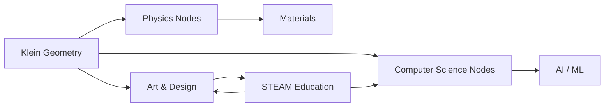
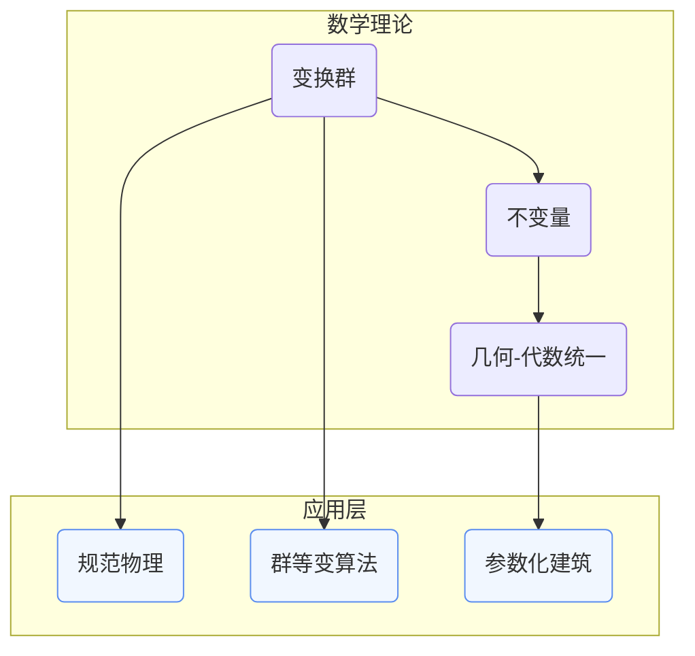

# 跨学科关联分析：克莱因理念的跨学科应用网络

**创建日期**: 2025年12月4日
**研究领域**: 克莱因数学理念 - 数学知识关联分析 - 关联关系分析
**主题编号**: K.08.02.04 (Klein.数学知识关联分析.关联关系分析.跨学科关联分析)
**优先级**: P0（最高优先级）⭐⭐⭐⭐⭐

---

## 📑 目录

- [跨学科关联分析：克莱因理念的跨学科应用网络](#跨学科关联分析克莱因理念的跨学科应用网络)
  - [📑 目录](#-目录)
  - [📋 一、概述](#-一概述)
    - [1.1 研究目标](#11-研究目标)
    - [1.2 跨学科关联的意义](#12-跨学科关联的意义)
    - [1.3 关联网络构建方法](#13-关联网络构建方法)
  - [🔷 二、跨学科应用节点](#-二跨学科应用节点)
    - [2.1 物理学应用](#21-物理学应用)
    - [2.2 计算机科学应用](#22-计算机科学应用)
    - [2.3 艺术应用](#23-艺术应用)
    - [2.4 其他学科应用](#24-其他学科应用)
  - [📐 三、关联关系类型](#-三关联关系类型)
    - [3.1 数学-物理关联](#31-数学-物理关联)
    - [3.2 数学-计算机关联](#32-数学-计算机关联)
    - [3.3 数学-艺术关联](#33-数学-艺术关联)
  - [🔗 四、关联网络可视化](#-四关联网络可视化)
    - [4.1 网络图](#41-网络图)
    - [4.2 关系图](#42-关系图)
    - [4.3 应用图](#43-应用图)
  - [💡 五、应用价值](#-五应用价值)
    - [5.1 理论研究价值](#51-理论研究价值)
    - [5.2 应用拓展价值](#52-应用拓展价值)
    - [5.3 跨学科合作价值](#53-跨学科合作价值)
  - [📚 六、文献与资源](#-六文献与资源)
    - [6.1 原始文献](#61-原始文献)
    - [6.2 现代研究文献](#62-现代研究文献)
  - [🌍 七、国际视角与权威对标](#-七国际视角与权威对标)
    - [7.1 Wikipedia资源对标](#71-wikipedia资源对标)
    - [7.2 国际大学课程对标](#72-国际大学课程对标)
  - [🔗 八、与其他文档的关联性](#-八与其他文档的关联性)
    - [8.1 与本专题其他文档的关联](#81-与本专题其他文档的关联)
    - [8.2 与项目其他文档的关联](#82-与项目其他文档的关联)

---

## 📋 一、概述

### 1.1 研究目标

**研究目标**：

构建克莱因理念在跨学科应用中的关联网络，建立：

1. **网络构建**：构建跨学科应用关联网络
2. **关系分析**：分析跨学科关联关系
3. **可视化**：实现网络可视化
4. **应用价值**：提取应用价值

### 1.2 跨学科关联的意义

**跨学科关联（Interdisciplinary Association）** / **Interdisziplinäre Assoziation**：

展示克莱因理念在跨学科应用中关联关系的网络。

**意义**：

- **系统理解**：系统理解跨学科应用
- **关联发现**：发现跨学科关联
- **应用指导**：指导跨学科应用

### 1.3 关联网络构建方法

**方法**：

- 应用节点识别
- 关联关系识别
- 网络可视化

---

## 🔷 二、跨学科应用节点

### 2.1 物理学应用

**节点说明**：

1. **对称性应用（Symmetry Applications）**
   - 典型案例：晶体群分类、标准模型中的规范对称。
   - 关键联系：克莱因变换群 → 宏观/微观物理的守恒律。
2. **群论应用（Group-Theoretic Applications）**
   - Lie群表述粒子相互作用；辛几何刻画哈密顿系统。
   - 强调“变换决定结构”的纲领思路。
3. **不变量应用（Invariant Applications）**
   - 张量不变量、拓扑不变量、规范不变量。
   - 与几何不变量理论和物理量守恒建立同构。

> **物理节点拓展表**
>
>| 研究主题 | 典型理论 | 对应的克莱因理念 | 指标 |
>| --- | --- | --- | --- |
>| 相对论时空 | 洛伦兹群 | 变换群统一几何 | 群作用维度、洛伦兹不变量 |
>| 规范场论 | SU(3)×SU(2)×U(1) | 结构保持即物理定律 | 规范势的几何化程度 |
>| 晶体学 | 空间群/点群 | 几何不变量与材料性质 | 对称性阶数、缺陷类型 |

### 2.2 计算机科学应用

**节点说明**：

1. **算法应用**：对称性加速（如 Burnside 引理在组合计数、群作用用于搜索剪枝）。
2. **数据结构应用**：以群操作维护同构类、利用代数结构优化数据库索引。
3. **图形处理应用**：计算机图形学中的几何变换链、射影几何在视觉渲染中的应用。

**扩展案例**：

- **自动定理证明**：把几何命题抽象为代数结构，借助群论搜寻变换不变量。
- **密码学**：椭圆曲线群、双线性对在密码协议中的群表示。
- **机器学习**：群等变网络（G-CNN）直接承袭“对称保持 = 信息保持”的纲领思想。

### 2.3 艺术应用

**节点说明**：

1. **视觉艺术**：伊斯兰几何纹样、M.C. Escher 镶嵌 → 平面群与射影变换。
2. **音乐应用**：十二平均律的循环群、音列变换群（转位、逆行、倒影）。
3. **建筑应用**：哥特拱形到现代参数化建筑，强调“形式 = 结构 = 变换”。

> **案例摘选**
>
>| 艺术类别 | 数学结构 | 克莱因视角 | 现实影响 |
>| --- | --- | --- | --- |
>| 数字艺术生成 | 群作用 + 分形 | 通过迭代变换统一形态 | 互动媒体、沉浸式展览 |
>| 建筑参数化设计 | 射影几何 + 曲面群 | 结构优化、材料节省 | 扎哈·哈迪德建筑事务所等 |
>| 音乐作曲 | 循环群/二面体群 | 变换操作即作曲规则 | 音乐教育中引入代数视角 |

### 2.4 其他学科应用

**节点说明**：

- **生命科学**：群论模型刻画蛋白质折叠、对称性与自组织模式。
- **经济与社会科学**：网络对称性、博弈论中的等价策略群。
- **教育科技**：概念图谱、知识追踪算法借助代数结构优化路径。

**跨域协同路径**：

1. 识别学科中的“结构不变”对象。
2. 映射到对应的几何/代数变换群。
3. 使用克莱因统一框架组织跨域知识图谱。

---

## 📐 三、关联关系类型

### 3.1 数学-物理关联

**关联分析**：

- **结构型关联**：几何 → 物理时空；代数 → 守恒律；分析 → 场方程。
- **方法型关联**：变换群 + 不变量 → 物理理论建模主线。
- **强度评估**：可用“群作用复杂度”“不变量数量”量化。

**典型链条**：
`射影几何 (Klein) → 规范几何 → Yang-Mills 场论 → 量子色动力学`

### 3.2 数学-计算机关联

**关联分析**：

- **表示关联**：几何对象 ↔ 数据结构；群作用 ↔ 算法操作。
- **复杂度关联**：对称性约束可等价于状态压缩、搜索空间剪枝。
- **评估指标**：等变性损失、算法加速比、数据冗余度。

**实践映射**：

1. 识别问题中的对称性。
2. 用群论语言编码。
3. 将编码结果嵌入算法/网络架构。

### 3.3 数学-艺术关联

**关联分析**：

- **形式关联**：艺术形态作为群作用轨道。
- **感知关联**：对称性与人类审美的认知神经基础。
- **跨媒介关联**：音乐 ↔ 群表示，建筑 ↔ 几何变换，视觉艺术 ↔ 拓扑/射影。

**定量描述**：可引入“对称阶”“自相似深度”“参数化自由度”等指标衡量艺术作品的数学结构含量。

---

## 🔗 四、关联网络可视化

### 4.1 网络图

**可视化示例**：

### 4.2 关系图

**关系类型示意**：

### 4.3 应用图

**应用矩阵（文字版）**：

| 应用类型 | 关键数学支柱 | 典型产出 | 影响层级 |
| --- | --- | --- | --- |
| 理论物理 | 变换群、不变量 | 标准模型、拓扑场论 | 基础科学 |
| AI/计算机图形 | 群等变网络、射影变换 | 视觉识别、增强现实 | 工业技术 |
| 建筑/设计 | 射影几何、拓扑优化 | 参数化立面、轻量化结构 | 城市与艺术 |
| 教育/STEAM | 概念图谱、跨学科课程 | 课程模块、教学工具 | 教育创新 |

---

## 💡 五、应用价值

### 5.1 理论研究价值

**价值延伸**：

1. **统一理论框架**：以克莱因纲领为核心，将不同学科的结构性质归并到“变换—不变量”范式。
2. **新理论孵化**：跨域合作易于催生如“几何深度学习”“拓扑量子计算”等新领域。
3. **指标化评估**：提出跨学科研究的“对称性指标”“结构耦合度”等度量体系。

### 5.2 应用拓展价值

**价值延伸**：

- **技术转化**：几何建模、算法设计、材料优化可形成工程化成果。
- **政策制定**：在国家级科教规划中，可用统一框架协调学科发展。
- **产业协同**：把数学理念嵌入设计、制造、教育产业链。

### 5.3 跨学科合作价值

**合作路径**：

1. **共通语言搭建**：以变换群/不变量为“超学科通用语”。
2. **协同工作坊**：物理 + 数学 + 设计联合 Hackathon。
3. **评估模型**：构建“跨学科协同成熟度模型（ICMM）”，分级评估合作深度。

---

## 📚 六、文献与资源

### 6.1 原始文献

- Klein, F. (1872). *Vergleichende Betrachtungen über neuere geometrische Forschungen* — 埃尔兰根纲领

### 6.2 现代研究文献

1. **Chirikjian, G. (2021).** Harmonic Analysis for Engineers and Applied Scientists.
2. **Bronstein, M. et al. (2021).** Geometric Deep Learning: Grids, Groups, and Graphs.
3. **Weyl, H. (1952).** Symmetry.
4. **Hargittai, I. (2015).** Symmetry through the Eyes of a Chemist.
5. **STEAM 教育白皮书（UNESCO, 2023）**。

---

## 🌍 七、国际视角与权威对标

### 7.1 Wikipedia资源对标

- **Interdisciplinary**条目：跨学科协同案例。
- **Applied mathematics**条目：数学应用框架。
- **Symmetry in physics**条目：与克莱因群论直接相关。

### 7.2 国际大学课程对标

- **MIT MAS.S64** Designing Interdisciplinary Experiments。
- **Stanford CME 302** Numerical Linear Algebra for Continuous Systems。
- **TU Munich STEAM Studio**：以对称性为主题的跨学科项目。

---

## 🔗 八、与其他文档的关联性

### 8.1 与本专题其他文档的关联

- **01-概念关联网络**：提供节点/边的概念定义。
- **02-理论关联图谱**：给出理论层链接点。
- **03-教育应用关联**：从教育视角细化跨学科路径。

### 8.2 与项目其他文档的关联

- **05-现代应用与拓展/03-跨学科应用**：提供行业案例。
- **03-数学教育改革/02-课程设计**：跨学科课程框架。
- **07-现代视角/02-现代几何学发展**：追踪现代几何在跨域中的延伸。

---

**创建日期**: 2025年12月4日
**最后更新**: 2025年12月4日
**状态**: ✅ 文档框架已创建，内容待完善
