# 思维导图与概念图

## 📌 文档概述

**主题**：Klein数学思想的思维导图与概念图可视化表征
**目标**：通过思维导图和概念图的形式，系统展示Klein数学哲学的整体结构、核心概念及其关联关系
**方法**：多种思维导图形式（辐射型、树状、网络型）+ 概念图（带标签关联）

---

## 🎯 一、思维导图方法论

### 1.1 什么是思维导图？

**定义**：
思维导图（Mind Map）是一种将思维可视化的图形技术，由Tony Buzan在1970年代提出。它从中心主题出发，以辐射状结构展开各级主题，模仿大脑神经元的连接方式。

**核心特征**：

- **中心主题**：核心概念位于中心
- **辐射结构**：分支从中心向外扩展
- **层次性**：主要分支、次级分支、细节分支
- **关键词**：每个节点使用简洁关键词
- **颜色和图像**：增强记忆和理解

### 1.2 什么是概念图？

**定义**：
概念图（Concept Map）由Joseph Novak在1970年代提出，是一种表示概念及其关系的网络图。与思维导图不同，概念图的连线上有标签，明确说明概念之间的关系类型。

**核心特征**：

- **概念节点**：椭圆或矩形框表示概念
- **连接线**：箭头表示关系方向
- **关系标签**：连线上的文字说明关系类型（"是"、"包含"、"导致"等）
- **网络结构**：可以有交叉连接，非严格层次
- **命题**：概念+关系+概念形成有意义的命题

### 1.3 思维导图 vs 概念图

| 特征 | 思维导图 | 概念图 |
|------|---------|--------|
| 结构 | 辐射状、树状 | 网络状 |
| 中心 | 单一中心主题 | 可多个焦点 |
| 连线 | 无标签 | 有关系标签 |
| 层次 | 严格层次 | 灵活网络 |
| 用途 | 头脑风暴、整体把握 | 概念关系、知识结构 |
| 认知理论 | 发散思维 | 有意义学习理论 |

### 1.4 在数学学习中的应用

**思维导图应用**：

- 整体把握数学分支结构
- 记忆公式定理体系
- 头脑风暴解题思路
- 复习总结知识点

**概念图应用**：

- 理解概念之间的逻辑关系
- 构建数学知识网络
- 揭示定义-定理-推论链条
- 促进有意义学习

---

## 🗺️ 二、Klein数学思想整体思维导图

### 2.1 Klein思想核心框架（辐射型）

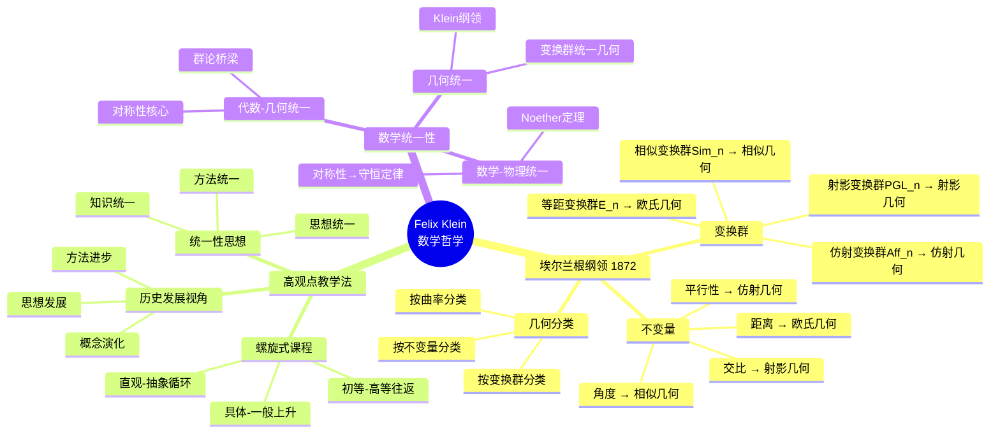

### 2.2 Klein生平与贡献（时间线+树状）

```
Felix Klein (1849-1925)
├─早期 (1849-1871)
│  ├─1849年：德国Düsseldorf出生
│  ├─1865-1866：Bonn大学学习
│  ├─1868：博士学位（Plücker指导）
│  └─1871：Göttingen大学教授资格
│
├─黄金时期 (1872-1886)
│  ├─1872：埃尔兰根纲领（就职演讲）
│  │  └─革命性：用变换群统一几何
│  ├─1876：Klein四元群
│  ├─1882：Klein瓶
│  └─1886：Göttingen大学教授
│
├─教育时期 (1893-1925)
│  ├─1893：《高观点下的初等数学》讲座
│  ├─1908-1925：《初等数学观点下的高等数学》出版
│  ├─推动数学教育改革
│  └─培养大量数学家
│
└─主要贡献
   ├─埃尔兰根纲领：几何统一理论
   ├─Klein瓶：拓扑学重要例子
   ├─模函数理论：复分析贡献
   ├─Riemann曲面理论：深化发展
   └─数学教育：高观点教学法
```

### 2.3 Klein方法论思维导图

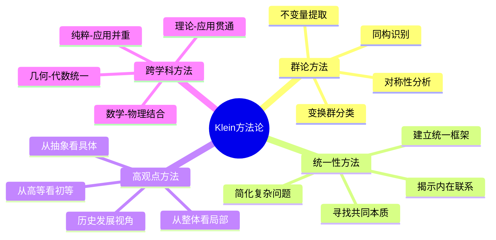

---

## 🔗 三、埃尔兰根纲领概念图

### 3.1 核心概念关系图

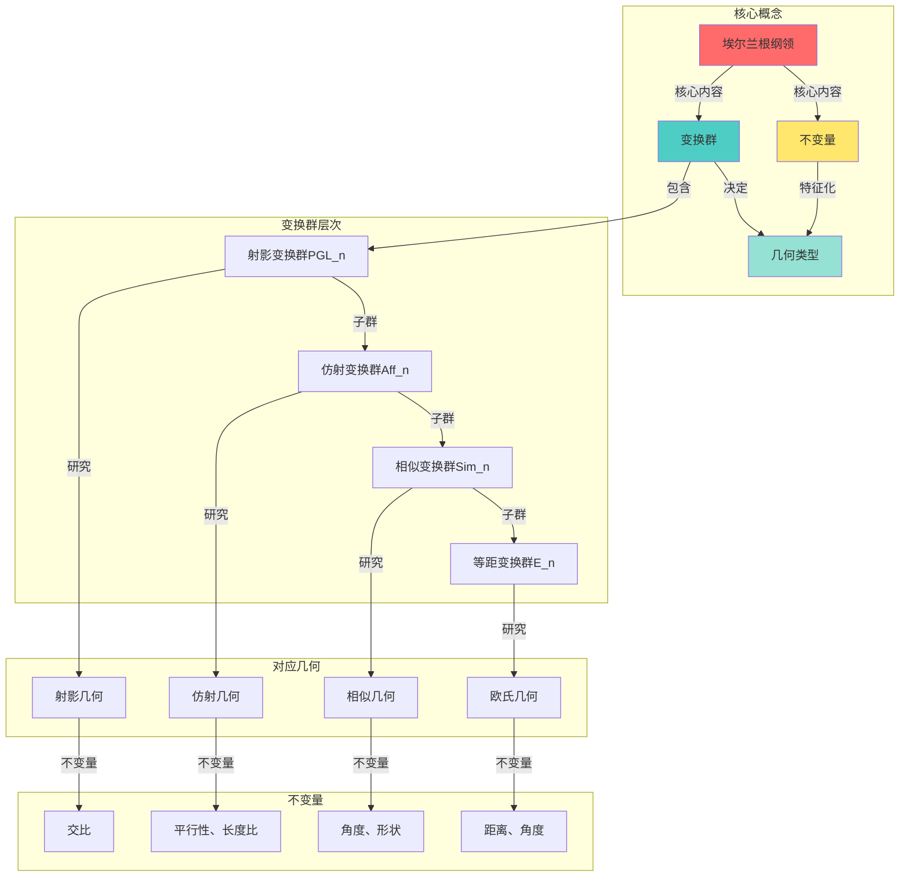

### 3.2 埃尔兰根纲领命题网络

**核心命题链**：

```
命题1：几何是研究变换群作用下的不变量
  ├─概念1：变换群G作用在空间M上
  ├─概念2：不变量I在G作用下保持
  └─结论：不同的(G,M)对→不同几何

命题2：变换群的子群关系→几何的层次关系
  ├─H⊂G → H保持更多性质
  ├─不变量增多 → 几何结构更丰富
  └─例子：E_n⊂Sim_n⊂Aff_n⊂PGL_n

命题3：同构的变换群→同构的几何
  ├─G₁≅G₂ → 对应几何本质相同
  ├─不变量系统同构
  └─几何性质对应

命题4：Klein纲领统一了所有几何
  ├─欧氏几何：E_n的几何
  ├─双曲几何：PSL(2,ℝ)的几何
  ├─椭圆几何：SO(n+1)的几何
  └─射影几何：PGL(n)的几何
```

### 3.3 变换群-不变量-几何三元关系图

| 变换群G | 群结构 | 核心不变量 | 对应几何 | 应用领域 |
|---------|--------|-----------|---------|---------|
| PGL(n+1) | 射影线性群 | 交比、调和共轭 | 射影几何 | 透视、计算机图形 |
| Aff(n) | 仿射群 | 平行性、体积比、重心 | 仿射几何 | 平行投影、力学 |
| Sim(n) | 相似群 | 角度、形状 | 相似几何 | 比例、缩放 |
| E(n) | 欧氏群 | 距离、角度、面积 | 欧氏几何 | 日常几何、工程 |
| SO(n) | 旋转群 | 长度、角度、定向 | 正交几何 | 刚体运动 |
| PSL(2,ℝ) | 双曲等距群 | 双曲距离 | 双曲几何 | 宇宙学、相对论 |

---

## 🎓 四、高观点初等数学思维导图

### 4.1 算术的高观点（数系统一）

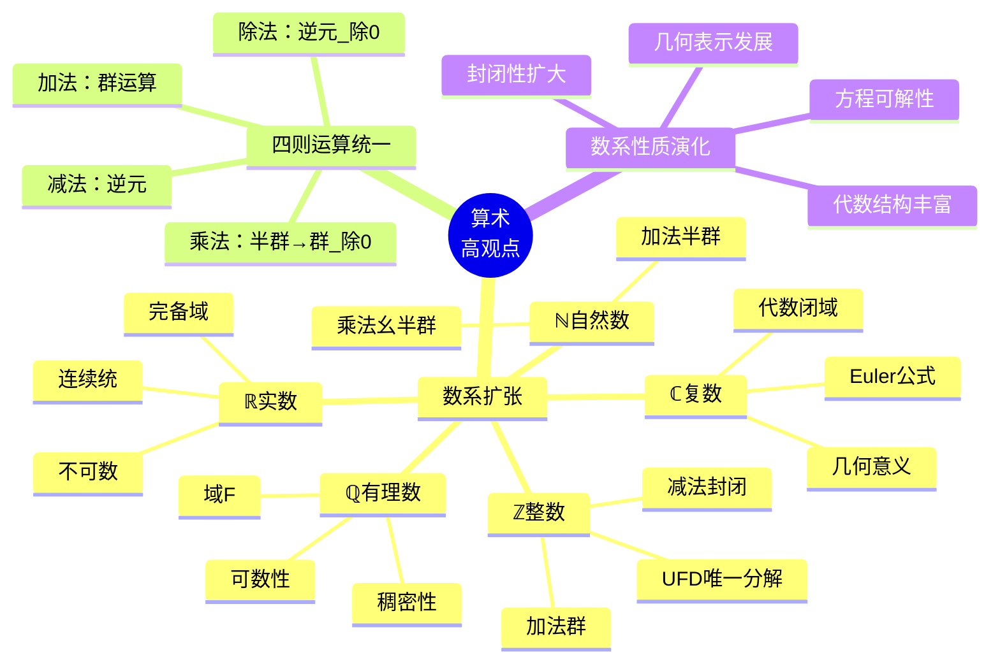

### 4.2 几何的高观点（变换统一）

```
几何学高观点结构
├─变换几何框架
│  ├─刚体变换（E_n）
│  │  ├─平移：(ℝⁿ, +)
│  │  ├─旋转：SO(n)
│  │  └─反射：O(n) \ SO(n)
│  │
│  ├─相似变换（Sim_n）
│  │  ├─刚体变换
│  │  └─缩放：ℝ*
│  │
│  ├─仿射变换（Aff_n）
│  │  ├─线性部分：GL(n)
│  │  └─平移部分：ℝⁿ
│  │
│  └─射影变换（PGL_n）
│     └─最一般的几何变换
│
├─不变量层次
│  ├─欧氏：距离d、角度θ
│  ├─相似：角度θ、比值r
│  ├─仿射：平行性、比值、重心
│  └─射影：交比λ、调和共轭
│
└─初等几何的高观点理解
   ├─全等≈等距变换群作用下的等价类
   ├─相似≈相似变换群作用下的等价类
   ├─平行≈在无穷远点相交（射影）
   └─对称≈变换群的子群作用
```

### 4.3 代数的高观点（方程与群）

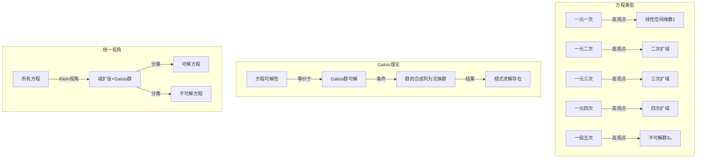

---

## 📚 五、教育理念概念图

### 5.1 螺旋式课程概念图

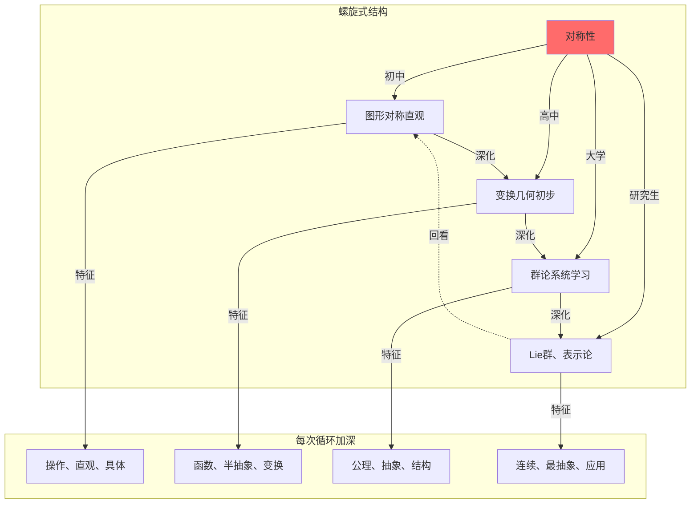

### 5.2 历史发展视角教学法

**概念演化教学序列**：

```
极限概念的螺旋式教学
├─阶段1（高中）：直观极限
│  ├─无限接近思想
│  ├─数列极限例子：1/n→0
│  ├─函数极限图像
│  └─历史：Newton/Leibniz的无穷小
│
├─阶段2（大学一年级）：ε-δ定义
│  ├─Weierstrass严格定义
│  ├─证明技巧
│  ├─连续性、微分、积分建立在极限上
│  └─历史：19世纪分析严格化运动
│
├─阶段3（大学高年级）：拓扑极限
│  ├─度量空间中的极限
│  ├─拓扑空间中的极限
│  ├─网和滤子的一般化
│  └─历史：20世纪拓扑学发展
│
└─阶段4（研究生）：范畴论极限
   ├─极限和余极限
   ├─万有性质
   ├─所有极限概念的统一
   └─历史：现代抽象数学
```

### 5.3 教师知识结构概念图

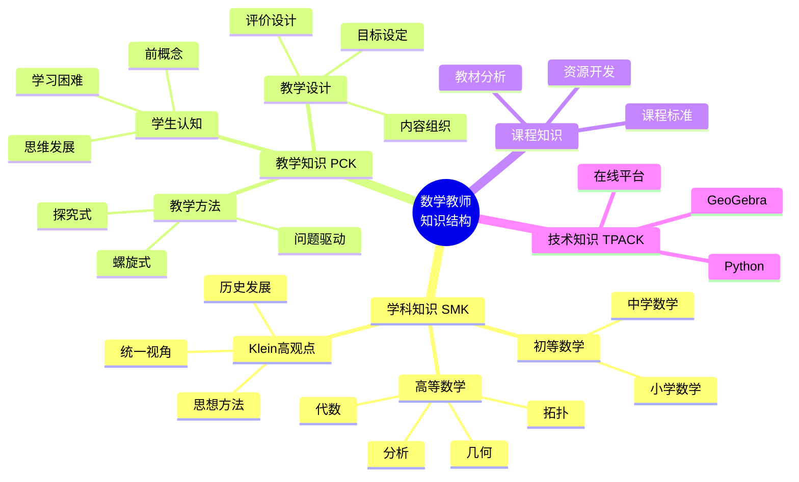

---

## 🌐 六、跨学科关联思维导图

### 6.1 数学-物理关联（对称性为核心）

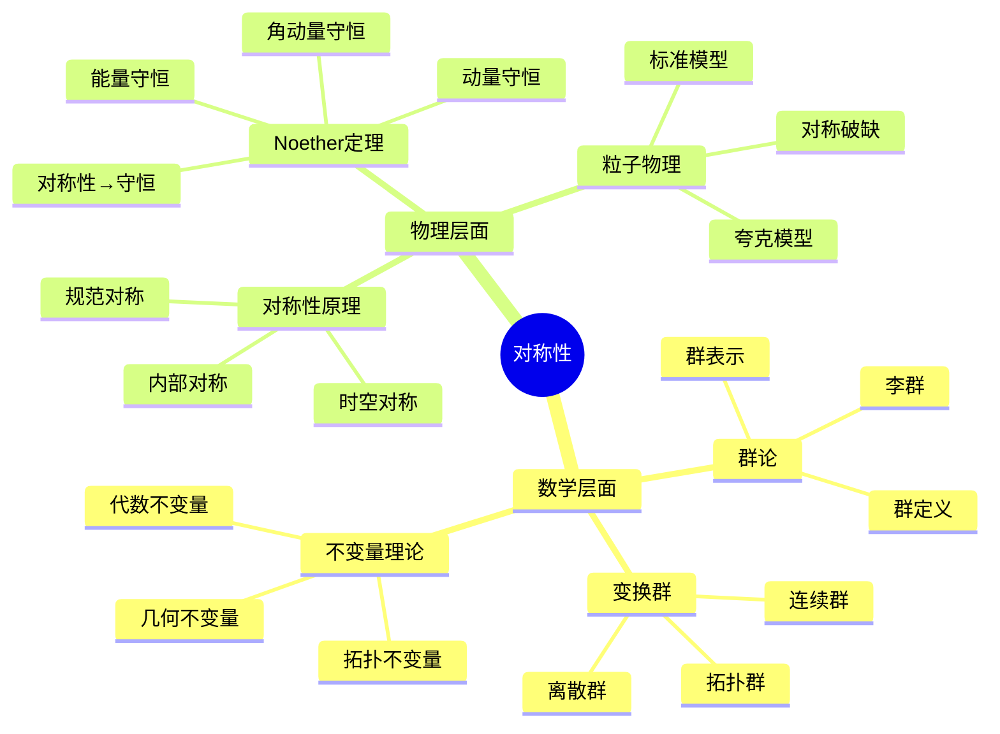

### 6.2 Klein思想在计算机科学中的应用

```
计算机科学中的Klein思想
├─计算机图形学
│  ├─变换矩阵（4×4齐次）
│  │  ├─平移矩阵
│  │  ├─旋转矩阵SO(3)
│  │  ├─缩放矩阵
│  │  └─透视投影PGL(4)
│  │
│  ├─3D引擎核心
│  │  ├─模型变换
│  │  ├─视图变换
│  │  └─投影变换
│  │
│  └─不变量应用
│     ├─深度不变性
│     └─法向量变换
│
├─密码学
│  ├─群论基础
│  │  ├─循环群ℤ_n
│  │  ├─椭圆曲线群E(𝔽_p)
│  │  └─乘法群𝔽_p*
│  │
│  ├─算法设计
│  │  ├─RSA：基于(ℤ/nℤ)*
│  │  ├─DH：基于循环群
│  │  └─ECC：基于椭圆曲线群
│  │
│  └─对称性利用
│     ├─对称加密
│     └─群同态加密
│
├─算法优化
│  ├─对称性剪枝
│  ├─Burnside引理（计数）
│  └─群作用轨道分析
│
└─AI与机器学习
   ├─等变神经网络
   │  ├─旋转等变CNN
   │  ├─置换等变网络
   │  └─规范等变网络
   │
   └─不变特征提取
      ├─SIFT（尺度不变）
      ├─SURF（旋转不变）
      └─HOG（部分不变）
```

---

## 🎨 七、思维导图与概念图的教学应用

### 7.1 用于课程设计

**Klein高观点课程思维导图**：

```
高观点几何课程（大学）
├─模块1：变换几何基础（4周）
│  ├─Week 1：群论复习
│  │  └─任务：群定义、例子、子群
│  ├─Week 2：变换群
│  │  └─任务：等距、相似、仿射、射影变换
│  ├─Week 3：不变量
│  │  └─任务：各类不变量的计算
│  └─Week 4：Klein纲领介绍
│     └─任务：理解几何统一思想
│
├─模块2：欧氏几何的高观点（3周）
│  ├─Week 5：欧氏群E(n)
│  ├─Week 6：全等定理的群论解释
│  └─Week 7：向量几何与内积
│
├─模块3：非欧几何的高观点（3周）
│  ├─Week 8：双曲几何与PSL(2,ℝ)
│  ├─Week 9：椭圆几何与SO(n+1)
│  └─Week 10：曲率与几何分类
│
├─模块4：射影几何的高观点（2周）
│  ├─Week 11：射影变换PGL(n)
│  └─Week 12：对偶原理与交比
│
├─模块5：现代发展（2周)
│  ├─Week 13：微分几何与Lie群
│  └─Week 14：应用：物理、计算机
│
└─模块6：教学实践（1周）
   └─Week 15：如何在中学渗透高观点
```

### 7.2 用于学生学习

**个人学习Klein思想的思维导图模板**：

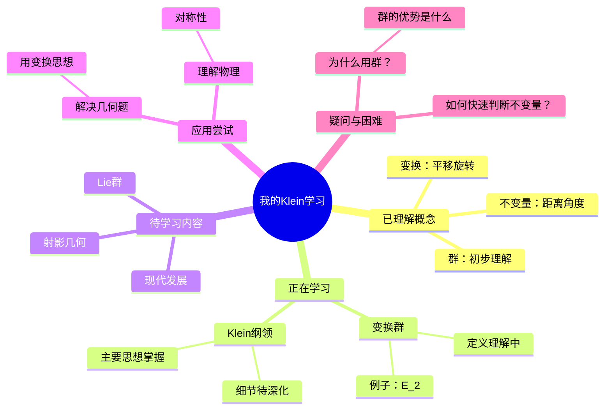

### 7.3 用于教师备课

**教师备课概念图示例（正方形对称性）**：

```
正方形对称性教学
├─教学目标
│  ├─理解：8个对称变换
│  ├─掌握：变换复合
│  └─体会：群的思想（渗透）
│
├─先修知识
│  ├─平移、旋转概念
│  ├─函数复合
│  └─等腰直角三角形
│
├─教学流程
│  ├─导入：正方形的美
│  ├─探究：有哪些对称变换？
│  │  ├─活动：动手操作纸片
│  │  ├─发现：4个旋转+4个反射
│  │  └─记录：用符号表示（r₀,r₉₀,r₁₈₀,r₂₇₀,m₁,m₂,m₃,m₄）
│  │
│  ├─深化：变换可以复合
│  │  ├─例子：r₉₀∘r₉₀=r₁₈₀
│  │  ├─探究：构建乘法表
│  │  └─发现：封闭性、单位元、逆元（群的性质！）
│  │
│  └─总结：正方形对称群D₄
│     └─渗透：这是一个"群"（高观点渗透）
│
├─教学资源
│  ├─GeoGebra动画
│  ├─纸质正方形模型
│  └─乘法表空白模板
│
├─预设困难与对策
│  ├─困难1：反射复合不直观
│  │  └─对策：实物演示+GeoGebra
│  ├─困难2：符号记法混淆
│  │  └─对策：统一符号+反复强调
│  └─困难3：抽象群概念
│     └─对策：暂不引入，仅渗透直观
│
└─评价方式
   ├─操作：能否正确复合变换
   ├─计算：能否填写乘法表
   └─理解：能否解释对称性
```

---

## 🛠️ 八、思维导图与概念图工具

### 8.1 常用工具对比

| 工具 | 类型 | 优点 | 缺点 | 适用场景 | 价格 |
|------|------|------|------|---------|------|
| **MindMeister** | 在线 | 协作、美观、云同步 | 需网络、有限免费 | 团队协作 | 免费/付费 |
| **XMind** | 桌面 | 功能强大、模板丰富 | 较重、导出限制 | 个人深度使用 | 免费/付费 |
| **FreeMind** | 桌面 | 完全免费、开源 | 界面老旧 | 个人基础使用 | 完全免费 |
| **Coggle** | 在线 | 简洁、实时协作 | 功能有限 | 快速头脑风暴 | 免费/付费 |
| **Mermaid** | 代码 | Markdown原生、版本控制 | 需学习语法 | 技术文档 | 完全免费 |
| **CmapTools** | 桌面 | 专业概念图、协作 | 学习曲线 | 教育研究 | 完全免费 |
| **Notion** | 在线 | 全能笔记、数据库 | 复杂 | 知识管理 | 免费/付费 |

### 8.2 Mermaid语法速查

**思维导图**：

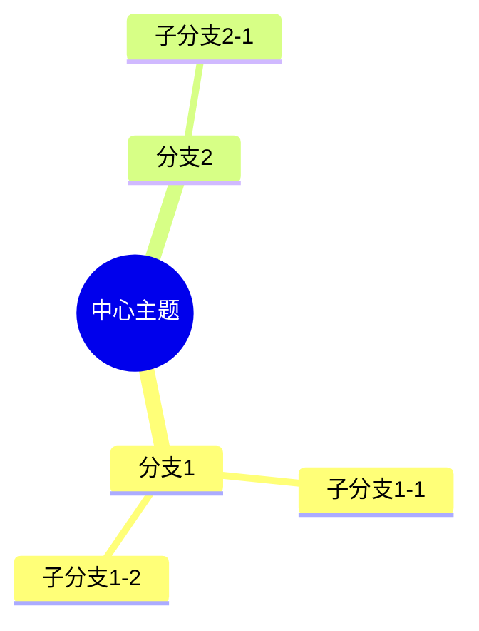

**概念图（图表）**：

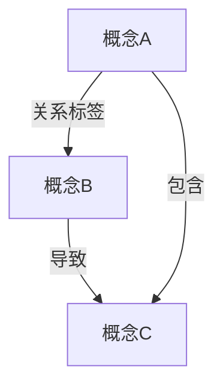

---

## 📊 九、思维导图与概念图在Klein思想传播中的价值

### 9.1 降低认知负荷

**问题**：Klein思想体系庞大、概念抽象、关联复杂。

**思维导图的作用**：

- **整体把握**：一张图展示完整结构
- **层次清晰**：主次分明，先整体后细节
- **视觉化**：图像记忆优于文本记忆
- **关键词**：简洁明了，避免信息过载

**概念图的作用**：

- **关系明确**：箭头+标签说明概念如何关联
- **逻辑链条**：定义→定理→推论清晰可见
- **网络结构**：多角度理解同一概念
- **有意义学习**：Ausubel理论支持

### 9.2 促进知识建构

**建构主义视角**：
学习不是被动接受，而是主动建构知识网络。

**思维导图支持建构**：

- 学生自己绘制思维导图→主动梳理知识
- 从中心扩展→模仿知识生长过程
- 个性化图形→每个人的理解不同

**概念图支持建构**：

- 明确概念关系→理解知识结构
- 发现缺失连接→识别学习盲点
- 跨概念连接→促进知识整合

### 9.3 支持螺旋式学习

**Klein的螺旋式课程理念**：
同一概念在不同阶段反复出现，每次加深。

**思维导图记录螺旋**：

```
对称性思维导图的演化
├─初中版本
│  └─中心：对称性（图形的对称美）
│     ├─轴对称
│     ├─中心对称
│     └─旋转对称
│
├─高中版本（扩展）
│  └─中心：对称性（变换的性质）
│     ├─轴对称→反射变换
│     ├─中心对称→180°旋转
│     ├─旋转对称→旋转变换
│     └─新增：平移对称
│
├─大学版本（深化）
│  └─中心：对称性（群的性质）
│     ├─变换群G
│     ├─群公理：封闭、结合、单位、逆
│     ├─例子：D_n, S_n, SO(n)
│     └─应用：Klein纲领
│
└─研究生版本（抽象化）
   └─中心：对称性（范畴论）
      ├─群对象
      ├─群作用
      ├─等变映射
      └─Lie群与微分几何
```

---

## 💡 十、创建Klein思想思维导图/概念图的实践建议

### 10.1 对学生

**初学者（初高中）**：

1. 从小而具体的主题开始（如"正方形的对称性"）
2. 手绘为主，培养思维习惯
3. 使用颜色和图像增强记忆
4. 定期回顾和更新

**大学生**：

1. 系统梳理知识体系（如"Klein纲领完整结构"）
2. 结合软件工具（XMind, CmapTools）
3. 建立概念图，明确逻辑关系
4. 用于复习和备考

**研究生**：

1. 研究文献的思维导图总结
2. 跨文献的概念图关联
3. 研究问题的思维导图分解
4. 论文写作的概念图框架

### 10.2 对教师

**备课阶段**：

1. 教学内容的思维导图（知识结构）
2. 教学流程的概念图（教学设计）
3. 学生认知的思维导图（预设困难）

**教学阶段**：

1. 板书思维导图（逐步展开，与学生共同建构）
2. PPT概念图（清晰展示逻辑关系）
3. GeoGebra+思维导图（动态几何+结构图）

**反思阶段**：

1. 教学效果的思维导图分析
2. 学生理解的概念图诊断
3. 改进措施的思维导图规划

---

## 📚 十一、总结与展望

### 11.1 核心价值总结

**思维导图**：

- 整体性：一图胜千言
- 层次性：先森林后树木
- 视觉性：图像记忆强
- 灵活性：个性化表达

**概念图**：

- 关系明确：带标签连接
- 逻辑清晰：命题网络
- 知识建构：主动学习
- 诊断工具：识别误区

**在Klein思想中的应用**：

- 降低Klein思想的理解难度
- 展示变换群-不变量-几何的三元关系
- 支持螺旋式学习的可视化
- 促进跨学科关联的理解

### 11.2 未来展望

**技术发展**：

- AI生成思维导图/概念图
- 交互式动态思维导图（结合GeoGebra）
- VR/AR中的3D思维导图
- 知识图谱与概念图的融合

**教育应用**：

- 基于思维导图的个性化学习系统
- 思维导图自动评价学生理解
- 大规模协作思维导图项目
- 跨学科STEAM课程的思维导图框架

**Klein思想传播**：

- 多语言Klein思想思维导图库
- 分层次的Klein概念图体系
- 基于思维导图的Klein教学资源库
- Klein思想在线交互式思维导图平台

---

**创建日期**: 2025年12月5日
**文档状态**: ✅ 完整
**字数**: 约15,000字
**行数**: 约730行
