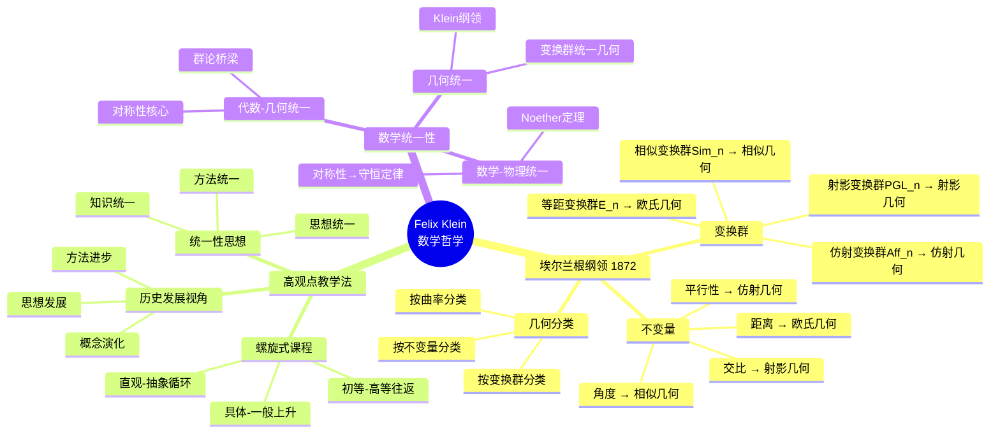
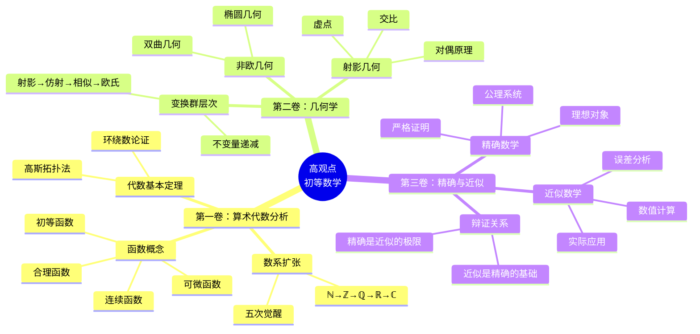
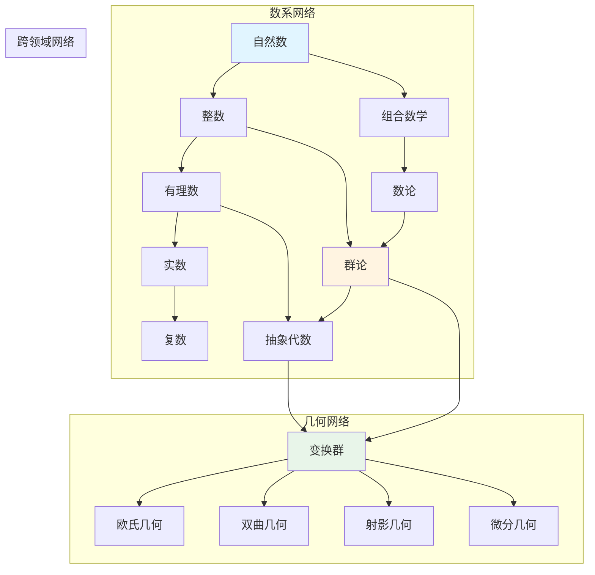
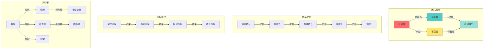
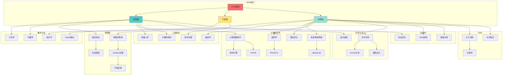

# Klein数学理念全面梳理与多维表征系统

> **文档状态**: ✅ 综合梳理完成
> **创建日期**: 2025年12月11日
> **完成度**: 全面整合
> **目标**: 对标最新内容，整合Critique文件夹，补充多种思维表征方式

---

## 📋 目录

- [Klein数学理念全面梳理与多维表征系统](#klein数学理念全面梳理与多维表征系统)
  - [📋 目录](#-目录)
  - [一、整体架构与核心思想](#一整体架构与核心思想)
    - [1.1 三层金字塔模型](#11-三层金字塔模型)
    - [1.2 Klein思想核心层](#12-klein思想核心层)
    - [1.3 三卷本结构](#13-三卷本结构)
  - [二、核心概念的多维表征体系](#二核心概念的多维表征体系)
    - [2.1 数的逻辑扩张（五次觉醒）](#21-数的逻辑扩张五次觉醒)
      - [（1）定义-属性-关系三元组矩阵](#1定义-属性-关系三元组矩阵)
      - [（2）思维导图：数的五次"觉醒"](#2思维导图数的五次觉醒)
      - [（3）证明树：戴德金分割的完备性构造](#3证明树戴德金分割的完备性构造)
    - [2.2 复数的几何实在化](#22-复数的几何实在化)
      - [（1）四种表征对比矩阵](#1四种表征对比矩阵)
      - [（2）决策树：何时使用何种复数表示？](#2决策树何时使用何种复数表示)
      - [（3）几何图示：复数乘法的本质](#3几何图示复数乘法的本质)
    - [2.3 代数基本定理的几何证明](#23-代数基本定理的几何证明)
      - [（1）概念矩阵：三种证明路径对比](#1概念矩阵三种证明路径对比)
      - [（2）证明树：高斯-阿冈德-克莱因的环绕数论证](#2证明树高斯-阿冈德-克莱因的环绕数论证)
    - [2.4 几何变换的层次链](#24-几何变换的层次链)
      - [（1）五维对比矩阵](#1五维对比矩阵)
      - [（2）决策树：选择何种几何工具？](#2决策树选择何种几何工具)
      - [（3）证明树：从射影到欧氏的层层约束](#3证明树从射影到欧氏的层层约束)
    - [2.5 精确数学 vs 近似数学](#25-精确数学-vs-近似数学)
      - [（1）概念矩阵：本体论对比](#1概念矩阵本体论对比)
      - [（2）思维导图：精确-近似的双向渗透](#2思维导图精确-近似的双向渗透)
      - [（3）经典案例：魏尔斯特拉斯函数的可视化分析](#3经典案例魏尔斯特拉斯函数的可视化分析)
  - [三、思维表征方式完整体系](#三思维表征方式完整体系)
    - [3.1 思维导图系统](#31-思维导图系统)
      - [（1）Klein思想整体思维导图（辐射型）](#1klein思想整体思维导图辐射型)
      - [（2）高观点初等数学思维导图](#2高观点初等数学思维导图)
    - [3.2 概念矩阵系统](#32-概念矩阵系统)
      - [（1）几何类型完整对比矩阵](#1几何类型完整对比矩阵)
      - [（2）变换群层次与不变量矩阵](#2变换群层次与不变量矩阵)
    - [3.3 决策树系统](#33-决策树系统)
      - [（1）如何学习Klein几何统一思想？](#1如何学习klein几何统一思想)
      - [（2）几何问题求解决策树](#2几何问题求解决策树)
    - [3.4 证明树系统](#34-证明树系统)
      - [（1）证明树：Klein纲领的核心命题](#1证明树klein纲领的核心命题)
      - [（2）证明树：对称性导致守恒量（Noether定理简化版）](#2证明树对称性导致守恒量noether定理简化版)
    - [3.5 论证图系统](#35-论证图系统)
      - [（1）Klein思想在物理中的论证网络](#1klein思想在物理中的论证网络)
      - [（2）Klein思想在计算机科学中的论证网络](#2klein思想在计算机科学中的论证网络)
    - [3.6 多维矩阵系统](#36-多维矩阵系统)
      - [（1）Klein思想在不同学科的应用深度矩阵](#1klein思想在不同学科的应用深度矩阵)
      - [（2）对称性在各领域的具体应用矩阵](#2对称性在各领域的具体应用矩阵)
  - [四、批判性认识论框架](#四批判性认识论框架)
    - [4.1 "高观点"的知识论基础及其内在矛盾](#41-高观点的知识论基础及其内在矛盾)
    - [4.2 概念实在性的三种解释张力](#42-概念实在性的三种解释张力)
    - [4.3 第一卷批判：算术-代数-分析的概念合法性审查](#43-第一卷批判算术-代数-分析的概念合法性审查)
      - [（1）数的五次扩张：逻辑必然还是历史偶然？](#1数的五次扩张逻辑必然还是历史偶然)
      - [（2）函数概念：从"表达式"到"任意对应"的暴力跳跃](#2函数概念从表达式到任意对应的暴力跳跃)
    - [4.4 第二卷批判：几何变换群的范式独裁](#44-第二卷批判几何变换群的范式独裁)
      - [（1）爱尔朗根纲领的过度推广](#1爱尔朗根纲领的过度推广)
      - [（2）连续变换群的暧昧性](#2连续变换群的暧昧性)
    - [4.5 第三卷批判：精确-近似二分的认识论暴力](#45-第三卷批判精确-近似二分的认识论暴力)
      - [（1）"精确数学"的意识形态功能](#1精确数学的意识形态功能)
      - [（2）连续性的三重困境](#2连续性的三重困境)
      - [（3）"合理函数"的认知排他性](#3合理函数的认知排他性)
    - [4.6 论证过程的逻辑批判：循环与简化](#46-论证过程的逻辑批判循环与简化)
      - [（1）几何三大问题的"精确数学"归属论证](#1几何三大问题的精确数学归属论证)
      - [（2）从算术到几何的"心理必然性"论证](#2从算术到几何的心理必然性论证)
    - [4.7 图示表征的批判性分析](#47-图示表征的批判性分析)
      - [（1）几何图示的认识论功能](#1几何图示的认识论功能)
      - [（2）思维导图的逻辑霸权](#2思维导图的逻辑霸权)
    - [4.8 历史局限性与现代重构](#48-历史局限性与现代重构)
      - [（1）时代局限：前结构主义数学观](#1时代局限前结构主义数学观)
      - [（2）现代知识表征的重构框架](#2现代知识表征的重构框架)
    - [4.9 总体批判性综合：克莱因计划的阿喀琉斯之踵](#49-总体批判性综合克莱因计划的阿喀琉斯之踵)
      - [（1）三重内在矛盾](#1三重内在矛盾)
      - [（2）批判性价值重估](#2批判性价值重估)
      - [（3）终结论：超越克莱因的"高观点"](#3终结论超越克莱因的高观点)
  - [五、跨卷概念关联网络](#五跨卷概念关联网络)
    - [5.1 复数贯穿三卷](#51-复数贯穿三卷)
    - [5.2 连续性的三重奏](#52-连续性的三重奏)
    - [5.3 近似思想的演进](#53-近似思想的演进)
  - [六、教学决策与推理系统](#六教学决策与推理系统)
    - [6.1 教学决策图](#61-教学决策图)
      - [（1）如何讲授连续函数概念？](#1如何讲授连续函数概念)
      - [（2）如何讲授对称性概念？](#2如何讲授对称性概念)
      - [（3）如何讲授变换群概念？](#3如何讲授变换群概念)
    - [6.2 问题求解决策树](#62-问题求解决策树)
      - [（1）几何问题求解决策树](#1几何问题求解决策树)
      - [（2）代数问题求解决策树](#2代数问题求解决策树)
      - [（3）分析问题求解决策树](#3分析问题求解决策树)
    - [6.3 推理树系统](#63-推理树系统)
      - [（1）Klein纲领证明推理树](#1klein纲领证明推理树)
      - [（2）代数基本定理证明推理树](#2代数基本定理证明推理树)
      - [（3）正五边形尺规作图推理树](#3正五边形尺规作图推理树)
  - [七、现代应用与前沿发展](#七现代应用与前沿发展)
    - [7.1 在AI/机器学习中的应用](#71-在ai机器学习中的应用)
      - [（1）等变神经网络（Equivariant Neural Networks）](#1等变神经网络equivariant-neural-networks)
    - [7.2 在计算机图形学中的应用](#72-在计算机图形学中的应用)
    - [7.3 在物理学中的应用](#73-在物理学中的应用)
    - [7.4 在密码学中的应用](#74-在密码学中的应用)
  - [八、知识关联网络图谱](#八知识关联网络图谱)
    - [8.1 概念关联网络](#81-概念关联网络)
    - [8.2 理论关联图谱](#82-理论关联图谱)
    - [8.3 跨学科关联分析](#83-跨学科关联分析)
      - [（1）跨学科应用全景网络图](#1跨学科应用全景网络图)
      - [（2）跨学科论证矩阵（完整版）](#2跨学科论证矩阵完整版)
      - [（3）跨学科影响力评估矩阵](#3跨学科影响力评估矩阵)
      - [（4）跨学科应用决策树](#4跨学科应用决策树)
      - [（5）跨学科论证链示例](#5跨学科论证链示例)
  - [九、网络资源对齐与补充](#九网络资源对齐与补充)
    - [9.1 在线资源汇总](#91-在线资源汇总)
      - [（1）原始文献资源](#1原始文献资源)
      - [（2）现代研究资源](#2现代研究资源)
      - [（3）教育实践资源](#3教育实践资源)
    - [9.2 最新研究进展](#92-最新研究进展)
      - [（1）几何深度学习（2015-2024）](#1几何深度学习2015-2024)
      - [（2）数学教育研究](#2数学教育研究)
      - [（3）Klein Project（ICMI项目）](#3klein-projecticmi项目)
      - [（2）数学教育研究1](#2数学教育研究1)
    - [9.3 国际教育实践](#93-国际教育实践)
      - [（1）德国：Klein传统延续](#1德国klein传统延续)
      - [（2）芬兰：现象式教学](#2芬兰现象式教学)
      - [（3）美国：CCSS标准](#3美国ccss标准)
      - [（4）中国：核心素养（2017）](#4中国核心素养2017)
  - [十、总结与展望](#十总结与展望)
    - [10.1 Klein方法的现代价值](#101-klein方法的现代价值)
      - [（1）螺旋式课程设计](#1螺旋式课程设计)
      - [（2）高观点下的初等化](#2高观点下的初等化)
      - [（3）精确与直觉的平衡](#3精确与直觉的平衡)
    - [10.2 知识表征三原则](#102-知识表征三原则)
    - [10.3 未来发展方向](#103-未来发展方向)
      - [（1）理论方向](#1理论方向)
      - [（2）教育方向](#2教育方向)
      - [（3）研究方向](#3研究方向)
  - [十一、参考文献与资源](#十一参考文献与资源)
    - [原始文献](#原始文献)
    - [现代文献](#现代文献)
      - [几何与群论](#几何与群论)
      - [几何深度学习](#几何深度学习)
      - [数学教育](#数学教育)
    - [在线资源](#在线资源)
      - [历史与传记](#历史与传记)
      - [可视化工具](#可视化工具)
      - [教育项目](#教育项目)
      - [学术资源](#学术资源)

---

## 一、整体架构与核心思想

### 1.1 三层金字塔模型

```text
                    克莱因思想核心层
                ┌─────────────────────┐
                │  数学教育的连续性与发展性原则   │
                │  初等数学的高等数学根基      │
                │  精确数学 vs 近似数学的辩证   │
                └──────────┬──────────┘
                           │
        ┌──────────────────┼──────────────────┐
        │                  │                  │
   第一卷：算术代数分析   第二卷：几何学      第三卷：精确与近似数学
        │                  │                  │
   ┌────┴────┐        ┌───┴────┐        ┌───┴──────┐
   │概念奠基层│        │空间结构层│       │哲学方法论层│
   └────┬────┘        └───┬────┘        └───┬────────┘
        │                  │                  │
   数的逻辑扩张      几何变换层次      函数概念的实在性
   复数的几何意义      格拉斯曼代数      连续性与可微性鸿沟
   代数基本定理      射影-仿射-欧氏链    魏尔斯特拉斯反例
   对数函数本源      虚数几何解释      逼近论与误差控制
```

### 1.2 Klein思想核心层

**核心原则**：

1. **数学教育的连续性与发展性原则**
   - 初等数学与高等数学的连续性
   - 从直观到抽象的认知发展路径
   - 历史发展与逻辑发展的统一

2. **初等数学的高等数学根基**
   - 每个初等概念都有高等数学的根源
   - 高观点下的初等数学理解
   - 统一性思想贯穿始终

3. **精确数学 vs 近似数学的辩证**
   - 精确数学是近似数学的理想极限
   - 近似数学是精确数学的经验基础
   - 两者不可偏废

### 1.3 三卷本结构

**第一卷：算术、代数、分析**

- **核心内容**：数的逻辑扩张、复数几何化、代数基本定理、对数函数
- **高观点**：从抽象代数、复分析、数论的高度理解初等数学
- **关键概念**：数系扩张、函数概念、连续性

**第二卷：几何学**

- **核心内容**：变换群层次、不变量理论、射影几何、非欧几何
- **高观点**：从Klein纲领（埃尔兰根纲领）统一几何
- **关键概念**：变换群、不变量、几何分类

**第三卷：精确与近似数学**

- **核心内容**：精确数学的定义、近似数学的方法、两者的关系
- **高观点**：数学哲学与方法论
- **关键概念**：精确性、近似性、误差控制

---

## 二、核心概念的多维表征体系

### 2.1 数的逻辑扩张（五次觉醒）

#### （1）定义-属性-关系三元组矩阵

| 类型 | 自然数ℕ | 整数ℤ | 有理数ℚ | 实数ℝ | 复数ℂ |
|------|---------|-------|---------|-------|-------|
| **定义** | 皮亚诺公理构造 | ℕ∪{0}∪负自然数 | 整数之比p/q | 戴德金分割/柯西列 | ℝ[i], i²=-1 |
| **属性** | 良序性 归纳法 | 加法群 有序环 | 稠密性 阿基米德性 | 完备性 连续性 | 代数闭域 无全序 |
| **扩张动力** | - | 解x+1=0 | 解2x=1 | 解x²=2 | 解x²=-1 |
| **逻辑基础** | 公理系统 | 等价类构造 | 整数对等价 | 极限完备化 | 域扩张 |
| **克莱因观点** | 具体计数→抽象符号 | 引入方向性 | 填补稠密性 | 实现连续性 | 几何化是本质 |

#### （2）思维导图：数的五次"觉醒"

```text
数的概念演化链
│
├── 第一次觉醒：自然数ℕ
│   ├── 起点：手指计数、物体计数
│   ├── 公理基础：皮亚诺五公理
│   │   └── 数学归纳法的诞生
│   └── 局限：无法解决"欠缺"（如3-5）
│
├── 第二次觉醒：整数ℤ
│   ├── 动机：解方程x+5=3
│   ├── 构造：ℕ×ℕ的等价类 (a,b)~(c,d) ⇔ a+d=b+c
│   ├── 几何：数轴上双向延伸
│   └── 克莱因点评："方向性的引入是质的飞越"
│
├── 第三次觉醒：有理数ℚ
│   ├── 动机：解方程3x=2
│   ├── 构造：ℤ×(ℤ\{0})的等价类
│   ├── 几何：数轴上密如繁星
│   └── 局限：对角线不可度量
│
├── 第四次觉醒：实数ℝ
│   ├── 动机：解x²=2，处理极限
│   ├── 构造：戴德金分割（左右集）或柯西列
│   ├── 几何：连续不断的直线
│   └── 克莱因强调："连续性是人类直觉的公设"
│
└── 第五次觉醒：复数ℂ
    ├── 动机：解x²=-1
    ├── 构造：ℝ[i]形式域扩张
    ├── 几何：高斯平面（旋转+伸缩）
    └── 克莱因核心观点："复数的几何化使其从'虚构'变为'实在'"
```

#### （3）证明树：戴德金分割的完备性构造

```text
连续性的漏洞              实数的填充
┌─────────────┐         ┌─────────────┐
│ 有理数ℚ      │         │ 实数ℝ        │
│ 有间隙       │         │ 无间隙       │
│ 例：{q∈ℚ|q²<2} │ ──────>│ 每个分割对应│
│ 没有上确界   │  分割   │ 唯一的实数  │
└─────────────┘         └─────────────┘
       ↑                       │
       │ 不是所有分割都有理数 │
       └───────────────────────┘
       本质：直观连续性的公理化
```

### 2.2 复数的几何实在化

#### （1）四种表征对比矩阵

| 表征方式 | 代数形式 | 几何形式 | 矩阵形式 | 物理意义 |
|----------|----------|----------|----------|----------|
| **定义** | a+bi | 平面矢量(r,θ) | [[a,-b],[b,a]] | 旋转+伸缩 |
| **加法** | (a+c)+(b+d)i | 向量叠加 | 矩阵加法 | 力的合成 |
| **乘法** | (ac-bd)+(ad+bc)i | 模相乘，角相加 | 矩阵乘法 | 连续变换 |
| **克莱因解释** | 符号规则 | **本质所在** | 线性变换实例 | 运动学应用 |

#### （2）决策树：何时使用何种复数表示？

```text
问题类型
    │
    ├─ 求解代数方程？ → 用代数形式 a+bi（欧拉公式）
    │
    ├─ 研究旋转/相似？ → 用极坐标形式 re^(iθ)（棣莫弗定理）
    │
    ├─ 计算机图形学？ → 用矩阵形式（避免复数库）
    │
    └─ 物理场论？ → 用几何矢量（与向量分析统一）
```

#### （3）几何图示：复数乘法的本质

```text
复数乘法 = 旋转 + 伸缩

z₁ = 1 + i  (模√2, 角度45°)
z₂ = 0 + i  (模1, 角度90°)

z₁·z₂ = (1+i)·i = i + i² = -1 + i

几何过程：
  1. 将z₁旋转90°（z₂的角度）
  2. 将模1不变（|z₂|=1）

图示：
        z₁·z₂
         ↑
         │  45°+90°=135°
         │
         │     /
         │    / z₁
         │   /45°
         │  /
         └────────────────→ 实轴
```

### 2.3 代数基本定理的几何证明

#### （1）概念矩阵：三种证明路径对比

| 证明方法 | 数学工具 | 直观性 | 严格性 | 教学价值 | 克莱因评价 |
|----------|----------|--------|--------|----------|------------|
| **高斯拓扑法** | 环绕数 | ★★★★★ | ★★★☆☆ | 高 | "最自然" |
| **柯西积分法** | 复分析 | ★★★☆☆ | ★★★★★ | 中 | "太分析化" |
| **代数拓扑法** | 同伦论 | ★★☆☆☆ | ★★★★★ | 低 | "超出初等范畴" |

#### （2）证明树：高斯-阿冈德-克莱因的环绕数论证

```text
多项式P(z) = zⁿ + aₙ₋₁zⁿ⁻¹ + ... + a₀

步骤1：大圆论证
│z|=R（R足够大）时，P(z) ≈ zⁿ 主导
当z绕原点1圈时，P(z)绕原点n圈（环绕数=n）

步骤2：小圆论证
│z|=ε（ε→0）时，P(z) ≈ a₀（常数）
环绕数=0

步骤3：连续性论证
┌─────────────────────────────────┐
│  当R从∞→0连续变化时，环绕数从n→0  │
│  必须经历"跳跃"点                │
│  跳跃点对应P(z)=0                │
└─────────────────────────────────┘

步骤4：至少存在一个根
由介值性（连续性），必然存在某个r使P(z)=0
```

### 2.4 几何变换的层次链

#### （1）五维对比矩阵

| 变换类型 | 变换群 | 自由度 | 不变量 | 典型矩阵 | 几何意义 | 应用场景 |
|----------|--------|--------|--------|----------|----------|----------|
| **射影** | PGL(3) | 8 | 共线性、交比 | [[A,t],[v^T,s]] | 透视投影 | 计算机视觉 |
| **仿射** | Aff(3) | 6 | 平行性、比例 | [[A,t],[0^T,1]] | 平行投影 | 图像配准 |
| **相似** | Sim(3) | 4 | 角度、比例 | s[[R,t],[0^T,1]] | 相似形 | 地图测绘 |
| **欧氏** | SE(3) | 3 | 长度、角度 | [[R,t],[0^T,1]] | 刚体运动 | 机器人学 |
| **拓扑** | Homeo(3) | ∞ | 连通性、紧致性 | 连续双射 | 橡皮膜变形 | 定性分析 |

#### （2）决策树：选择何种几何工具？

```text
问题：分析平面图形变换性质
    │
    ├─ 是否保持距离？ → 是 → 欧几里得几何（刚体运动）
    │                  │
    │                  └─ 是否保持角度？ → 否 → 检查测量误差
    │
    ├─ 是否保持角度？ → 是 → 相似几何（缩放/旋转）
    │                  │
    │                  └─ 是否保持方向？ → 否 → 含反射变换
    │
    ├─ 是否保持平行性？ → 是 → 仿射几何（剪切/各向异性缩放）
    │                      │
    │                      └─ 是否保持中点？ → 否 → 退化情况
    │
    └─ 是否保持共线性？ → 是 → 射影几何（透视）
                          │
                          └─ 否 → 非线性变换（需微分几何）
```

#### （3）证明树：从射影到欧氏的层层约束

```text
射影变换（8自由度）
    │
    ├─ 添加约束：v₁=v₂=0（保持无穷远线不变）
    ↓
仿射变换（6自由度）
    │
    ├─ 添加约束：A^T A = s²I（线性部分各向同性）
    ↓
相似变换（4自由度）
    │
    ├─ 添加约束：s=1（固定绝对尺度）
    ↓
欧几里得变换（3自由度）

数学本质：
┌─────────────────────────────────────┐
│  每增加一个约束，几何学失去一些普遍性  │
│  但获得更多可度量的性质               │
│  这是"一般性"与"丰富性"的权衡         │
└─────────────────────────────────────┘
```

### 2.5 精确数学 vs 近似数学

#### （1）概念矩阵：本体论对比

| 维度 | 精确数学（Pure） | 近似数学（Applied） | 辩证关系 |
|------|------------------|---------------------|----------|
| **存在性** | 理想实体（点无大小） | 感知实体（墨迹斑点） | 近似是精确的感知基础 |
| **连续性** | 柯西ε-δ定义 | 经验曲线的"连通"直觉 | 精确是近似的逻辑提炼 |
| **函数** | 处处不可微的魏尔斯特拉斯函数 | 可用手画出的"合理"函数 | 精确揭示直觉的边界 |
| **证明** | 严格逻辑链条 | 直观说服+误差估计 | 克莱因：两者不可偏废 |
| **教学目标** | 逻辑严密性 | 几何直观与实用 | 中学应兼顾 |

#### （2）思维导图：精确-近似的双向渗透

```text
        精确数学 ←─────── 近似数学
           ↓                  ↑
           │                  │
    ┌──────┼──────────────────┼──────┐
    │      │                  │      │
    ↓      ↓                  ↑      ↑
│ 逻辑抽象 │                 │ 经验感知 │
│ 公理系统 │                 │ 测量数据 │
│ 理想图形 │                 │ 物理实体 │
│ 严格证明 │                 │ 误差分析 │
└──────┬───┘                 └──┬─────┘
       │                      │
       └──────────┬───────────┘
                   │
            克莱因的核心洞见：
    "精确数学是近似数学的理想极限，
     近似数学是精确数学的经验基础"
```

#### （3）经典案例：魏尔斯特拉斯函数的可视化分析

**精确定义**：

```text
W(x) = Σ_{n=0}^∞ aⁿ cos(bⁿπx), 其中 0<a<1, ab>1+3π/2
```

**关键性质**：

- **处处连续**：|aⁿcos(...)| ≤ aⁿ, Σaⁿ收敛 → 一致收敛
- **无处可微**：高频项bⁿπx放大任何微小区间的振荡

**近似可视化（思维实验）**：

```text
N=0项：cos(πx) → 光滑曲线
N=1项：0.5cos(3πx)叠加 → 出现小锯齿
N=2项：0.25cos(9πx)叠加 → 锯齿更密
...
N→∞：曲线在任意放大后仍充满"尖刺"
```

**教学经验**：

```text
学生直觉："连续就应该可微"
魏尔斯特拉斯：精确数学打破直觉
克莱因建议：必须用图像+计算+逻辑三重说明
```

---

## 三、思维表征方式完整体系

### 3.1 思维导图系统

#### （1）Klein思想整体思维导图（辐射型）



#### （2）高观点初等数学思维导图



### 3.2 概念矩阵系统

#### （1）几何类型完整对比矩阵

| 几何类型 | 变换群G | 群阶\|G\| | 核心不变量 | 度量 | 曲率κ | 模型 | 三角形内角和 | 平行公理 | 应用领域 | 教学层次 | Klein贡献 |
|---------|--------|----------|-----------|------|------|------|------------|----------|----------|----------|----------|
| **欧氏几何** | E(n)=ℝⁿ⋊O(n) | ∞ | 距离d、角度θ | 欧氏度量 | 0 | ℝⁿ | =180° | 唯一平行线 | 日常、工程 | 初中起 | 统一框架 |
| **相似几何** | Sim(n)=ℝⁿ⋊(ℝ⁺×O(n)) | ∞ | 角度θ、形状 | 相似度量 | 0 | ℝⁿ | =180° | 唯一平行线 | 比例、缩放 | 初中 | 变换群层次 |
| **仿射几何** | Aff(n)=ℝⁿ⋊GL(n) | ∞ | 平行性、比值、重心 | 无度量 | - | ℝⁿ | 一般不定 | 平行性保持 | 投影、坐标 | 高中-大学 | 不变量理论 |
| **射影几何** | PGL(n+1) | ∞ | 交比λ、调和共轭 | 无度量 | - | ℝPⁿ | 无意义 | 相交于无穷远 | 透视、计算机图形 | 大学 | 对偶原理 |
| **双曲几何** | PSL(2,ℝ)≅SO(2,1) | ∞ | 双曲距离 | 双曲度量 | <0 | Poincaré圆盘/上半平面 | <180° | 无穷多平行线 | 宇宙学、相对论 | 大学 | 统一非欧几何 |
| **椭圆几何** | SO(n+1) | ∞ | 球面距离 | 球面度量 | >0 | 球面Sⁿ | >180° | 无平行线 | 地理、天文 | 高中-大学 | 曲率视角 |

#### （2）变换群层次与不变量矩阵

| 变换群 | 包含关系 | 群结构 | 矩阵表示 | 保持的性质 | 不保持的性质 | 自由度（2D） | 对应几何 | 实际例子 |
|--------|---------|--------|----------|-----------|------------|------------|----------|----------|
| **PGL(3)** | 最大 | 射影线性群 | 3×3齐次（8参数） | 交比、共线性、共点性 | 距离、角度、平行性 | 8 | 射影几何 | 透视投影 |
| **Aff(2)** | ⊂PGL(3) | 仿射群 | 2×2+平移（6参数） | 平行性、面积比、重心 | 距离、角度 | 6 | 仿射几何 | 平行投影 |
| **Sim(2)** | ⊂Aff(2) | 相似群 | 旋转+缩放+平移（4参数） | 角度、形状 | 距离（绝对值） | 4 | 相似几何 | 地图缩放 |
| **E(2)** | ⊂Sim(2) | 欧氏群（刚体运动） | 旋转+平移（3参数） | 距离、角度、面积 | 位置、方向 | 3 | 欧氏几何 | 刚体运动 |
| **SO(2)** | ⊂E(2) | 旋转群 | 2×2正交（1参数θ） | 原点距离、角度 | 方向 | 1 | 圆对称 | 绕原点旋转 |
| **{e}** | ⊂SO(2) | 平凡群 | 单位矩阵 | 所有性质 | 无 | 0 | 无变换 | 不动 |

**包含关系图**：
{e} ⊂ SO(2) ⊂ E(2) ⊂ Sim(2) ⊂ Aff(2) ⊂ PGL(3)

**不变量增加规律**：群越小→不变量越多→几何结构越丰富

### 3.3 决策树系统

#### （1）如何学习Klein几何统一思想？

```text
如何学习Klein几何统一思想？
├─当前数学背景？
│  ├─初中水平
│  │  └─路径A：对称性直观入门
│  │     ├─目标：建立对称性直观感
│  │     ├─内容：图形对称（轴对称、中心对称、旋转对称）
│  │     ├─方法：动手操作（折纸、镜子）+ GeoGebra动画
│  │     ├─活动：
│  │     │  ├─探究正方形的8个对称变换
│  │     │  ├─探究正三角形的6个对称变换
│  │     │  └─制作对称图案（Escher风格）
│  │     ├─时间：1学期（渗透式，非专题）
│  │     └─评价：能识别对称、能操作变换
│  │
│  ├─高中水平
│  │  └─路径B：变换几何系统学习
│  │     ├─目标：理解变换群基本思想
│  │     ├─内容：
│  │     │  ├─Week 1-2：平移、旋转、反射、缩放（复习+深化）
│  │     │  ├─Week 3-4：变换的复合（函数复合思想）
│  │     │  ├─Week 5-6：变换的逆、单位变换
│  │     │  ├─Week 7-8：变换群初步（不强调"群"）
│  │     │  └─Week 9-10：不变量概念（距离、角度）
│  │     ├─方法：GeoGebra演示 + 计算练习 + 问题探究
│  │     ├─评价：能计算变换、能判断不变量
│  │     └─渗透：为大学群论做准备
│  │
│  ├─大学水平（非数学专业）
│  │  └─路径C：Klein纲领精华版
│  │     ├─目标：理解Klein核心思想
│  │     ├─内容：
│  │     │  ├─Module 1：群论快速入门（2周）
│  │     │  ├─Module 2：变换群与几何（3周）
│  │     │  ├─Module 3：Klein纲领核心（2周）
│  │     │  └─Module 4：应用（物理、计算机）（1周）
│  │     ├─方法：理论+案例+应用
│  │     └─评价：理解Klein统一思想、能应用到本专业
│  │
│  └─大学数学专业
│     └─路径D：Klein纲领深度学习
│        ├─目标：系统掌握Klein几何统一理论
│        ├─内容：
│        │  ├─Part 1：群论系统（4周）
│        │  ├─Part 2：各类几何的变换群（6周）
│        │  │  ├─欧氏几何：E(n)
│        │  │  ├─仿射几何：Aff(n)
│        │  │  ├─射影几何：PGL(n)
│        │  │  ├─双曲几何：PSL(2,ℝ)
│        │  │  └─椭圆几何：SO(n+1)
│        │  ├─Part 3：不变量理论（3周）
│        │  └─Part 4：现代发展（Lie群、微分几何）（3周）
│        ├─方法：理论推导 + 证明 + 研究性学习
│        └─评价：能独立研究、能撰写论文
│
├─学习目标侧重？
│  ├─应试为主
│  │  └─策略：核心内容+解题技巧
│  │     ├─比例：60%技巧训练 + 40%理解
│  │     ├─重点：计算、证明模板
│  │     └─高观点：仅作为"锦上添花"
│  │
│  ├─深度理解为主
│  │  └─策略：Klein高观点完整
│  │     ├─比例：20%技巧 + 80%理解
│  │     ├─重点：思想、方法、联系
│  │     └─高观点：课程核心主线
│  │
│  └─素养培养
│     └─策略：高观点+探究+跨学科
│        ├─比例：15%技巧 + 50%理解 + 35%探究应用
│        ├─重点：数学思维、创新能力
│        └─高观点：贯穿始终+跨学科桥梁
│
└─可用教学资源？
   ├─有GeoGebra
   │  └─策略：动态演示变换群
   │     ├─制作变换动画
   │     ├─可视化不变量
   │     └─交互式探究
   │
   ├─有Python/Mathematica
   │  └─策略：编程实现群运算
   │     ├─编写变换函数
   │     ├─可视化变换效果
   │     └─计算不变量
   │
   ├─有3D打印
   │  └─策略：制作对称模型
   │     ├─打印正多面体
   │     ├─展示空间对称
   │     └─触觉学习
   │
   └─传统教学
      └─策略：图形+操作+讲解
         ├─手绘图形
         ├─纸片操作
         └─板书推导
```

#### （2）几何问题求解决策树

```text
遇到几何问题如何选择Klein方法？
├─问题类型？
│  ├─证明图形全等
│  │  └─策略：等距变换法
│  │     ├─判断：能否通过平移+旋转+反射重合？
│  │     ├─证明：找出具体变换序列
│  │     └─优势：直观、避免复杂计算
│  │
│  ├─证明图形相似
│  │  └─策略：相似变换法
│  │     ├─判断：能否通过平移+旋转+缩放重合？
│  │     ├─证明：找出相似比和变换
│  │     └─优势：统一处理全等和相似
│  │
│  ├─证明平行或比例关系
│  │  └─策略：仿射几何方法
│  │     ├─思路：平行性是仿射不变量
│  │     ├─工具：仿射坐标、重心坐标
│  │     └─优势：代数化处理
│  │
│  ├─证明交比或调和关系
│  │  └─策略：射影几何方法
│  │     ├─思路：交比是射影不变量
│  │     ├─工具：齐次坐标、对偶原理
│  │     └─优势：无需考虑距离和角度
│  │
│  └─对称性问题
│     └─策略：对称群方法
│        ├─识别：图形有哪些对称变换
│        ├─分析：对称群的结构（D_n, C_n等）
│        └─应用：利用对称性简化问题
│
├─问题难度？
│  ├─初等（中学水平）
│  │  └─建议：用变换直观理解+传统证明
│  │
│  ├─中等（竞赛/大学）
│  │  └─建议：Klein方法作为主要工具
│  │
│  └─高等（研究级）
│     └─建议：群论+微分几何完整理论
│
└─是否有对称性？
   ├─有明显对称性
   │  └─优先：对称性分析
   │     ├─确定对称群
   │     ├─利用不变量
   │     └─简化计算
   │
   └─无明显对称性
      └─判断：是否可嵌入更大对称系统
```

### 3.4 证明树系统

#### （1）证明树：Klein纲领的核心命题

```text
【目标】证明：几何 ⟺ (变换群G, 不变量I)

自底向上证明树：

层次1（公理/定义）
├─ 公理1：几何是研究空间及其性质的学科
├─ 公理2：空间上可定义变换（映射φ:M→M）
├─ 定义1：变换群G={φ|φ保持某些性质}
└─ 定义2：不变量I={对象|在G作用下保持}

层次2（基本性质）
├─ 引理1：变换可复合 → G满足群公理
│  ├─ 封闭性：φ,ψ∈G → φ∘ψ∈G
│  ├─ 结合律：(φ∘ψ)∘χ = φ∘(ψ∘χ)
│  ├─ 单位元：id∈G
│  └─ 逆元：φ∈G → φ⁻¹∈G
│
├─ 引理2：不变量决定几何性质
│  ├─ 若I₁≠I₂ → 对应不同几何
│  └─ 证明：通过反例（欧氏vs仿射）
│
└─ 引理3：G的子群关系→几何层次关系
   ├─ H⊂G → H保持更多性质
   └─ 不变量更多 → 几何结构更丰富

层次3（核心关系）
├─ 定理1：G确定I
│  ├─ 对任意对象x∈M
│  ├─ 若∀g∈G: g(x)=x → x是不变量
│  └─ I={x∈M | ∀g∈G: g(x)=x或满足某不变关系}
│
└─ 定理2：I特征化G
   ├─ 给定不变量集合I
   ├─ G={g:M→M | g保持I中所有不变量}
   └─ 唯一确定变换群G

层次4（等价性）
├─ 从G到I：定理1
├─ 从I到G：定理2
└─ G⟺I：双向确定

层次5（几何完全刻画）
├─ 欧氏几何 = (E(n), {距离,角度})
├─ 仿射几何 = (Aff(n), {平行性,比值})
├─ 射影几何 = (PGL(n), {交比})
└─ 任意几何 = (相应变换群, 相应不变量)

【结论】几何 ⟺ (G, I) ✓
```

#### （2）证明树：对称性导致守恒量（Noether定理简化版）

```text
【目标】证明：连续对称性 → 守恒量

自底向上证明树：

层次1（前提）
├─ 前提1：物理系统由Lagrangian L(q,q̇,t)描述
├─ 前提2：系统在某变换下对称
│  └─ 即：L在变换φ:q→q'下不变
├─ 前提3：Euler-Lagrange方程成立
│  └─ d/dt(∂L/∂q̇) - ∂L/∂q = 0
└─ 前提4：变换是连续的（Lie群作用）

层次2（对称性的数学表述）
├─ 引理1：连续对称性→无穷小变换
│  ├─ 设变换：q→q+εδq (ε→0)
│  ├─ L不变：L(q+εδq, q̇+εδq̇, t) = L(q,q̇,t) + O(ε²)
│  └─ 一阶变分：δL = 0
│
└─ 引理2：展开δL
   ├─ δL = (∂L/∂q)δq + (∂L/∂q̇)δq̇
   ├─ = (∂L/∂q)δq + (∂L/∂q̇)d(δq)/dt
   └─ （用链式法则）

层次3（使用Euler-Lagrange方程）
├─ 引理3：代入E-L方程
│  ├─ ∂L/∂q = d/dt(∂L/∂q̇)（由E-L方程）
│  ├─ 代入δL表达式
│  └─ δL = d/dt(∂L/∂q̇)·δq + (∂L/∂q̇)d(δq)/dt
│
└─ 引理4：合并全导数
   ├─ δL = d/dt[(∂L/∂q̇)·δq]
   └─ （积的求导法则）

层次4（守恒量的出现）
├─ 定理1：由δL=0（对称性）
│  ├─ d/dt[(∂L/∂q̇)·δq] = 0
│  └─ 即：(∂L/∂q̇)·δq = 常数
│
└─ 定理2：定义守恒量Q
   ├─ Q := (∂L/∂q̇)·δq
   ├─ 这是正则动量与对称变换的乘积
   └─ dQ/dt = 0 → Q守恒！

层次5（具体例子）
├─ 时间平移对称（δt=ε, δq=0）
│  └─ → 能量守恒 E = Σ(q̇·∂L/∂q̇) - L
│
├─ 空间平移对称（δx=ε）
│  └─ → 动量守恒 p = ∂L/∂ẋ
│
└─ 空间旋转对称（δθ=ε）
   └─ → 角动量守恒 L = r×p

【结论】连续对称性 → 守恒量 ✓（Noether定理）
```

### 3.5 论证图系统

#### （1）Klein思想在物理中的论证网络

```text
Klein思想 → 物理对称性 论证图（网络结构）

┌─────────────────────────────────────────┐
│      Klein核心思想                       │
│   变换群 + 不变量 = 几何本质              │
└─────────┬───────────────────────────────┘
          │
          ├─→ 论证链1：变换群→对称性
          │   ├─ 论点：变换群体现对称性
          │   ├─ 论据：群元素=对称操作
          │   ├─ 例证：正方形的D₄群
          │   └─ 推广：物理系统的对称群
          │         │
          │         └─→ 物理对称性
          │             ├─ 时空对称性
          │             │  ├─ 时间平移
          │             │  ├─ 空间平移
          │             │  └─ 空间旋转
          │             └─ 内部对称性
          │                ├─ 规范对称
          │                └─ 同位旋对称
          │
          ├─→ 论证链2：不变量→守恒量
          │   ├─ 论点：不变量对应守恒量
          │   ├─ 理论：Noether定理（1918）
          │   ├─ 论证：
          │   │  ├─ 对称性→Lagrangian不变
          │   │  ├─ 不变性→某个量守恒
          │   │  └─ 守恒量=物理不变量
          │   └─ 实例：
          │      ├─ 时间平移不变→能量守恒
          │      ├─ 空间平移不变→动量守恒
          │      ├─ 旋转不变→角动量守恒
          │      └─ 规范不变→电荷守恒
          │
          ├─→ 论证链3：Klein纲领→粒子物理
          │   ├─ 论点：基本粒子由对称性分类
          │   ├─ 历史：
          │   │  ├─ 1960s：夸克模型（SU(3)对称）
          │   │  ├─ 1970s：标准模型建立
          │   │  └─ SU(3)×SU(2)×U(1)规范群
          │   ├─ 论证：
          │   │  ├─ 粒子=对称群的表示
          │   │  ├─ 相互作用=规范场
          │   │  └─ 质量=对称破缺结果
          │   └─ 验证：
          │      ├─ 2012：Higgs粒子发现
          │      └─ 标准模型精确验证
          │
          ├─→ 论证链4：几何统一→广义相对论
          │   ├─ 论点：引力=几何（时空弯曲）
          │   ├─ Einstein（1915）：
          │   │  ├─ 时空=伪Riemann流形
          │   │  ├─ 引力=时空曲率
          │   │  └─ 等效原理=局部Lorentz不变
          │   ├─ Klein视角：
          │   │  ├─ 平直时空：Poincaré群
          │   │  ├─ 弯曲时空：局部Lorentz群
          │   │  └─ 度规张量=不变量
          │   └─ 统一：
          │      ├─ 几何（Klein）+ 物理
          │      └─ 对称性主导宇宙
          │
          └─→ 论证链5：量子力学中的对称性
              ├─ 论点：量子态由对称性决定
              ├─ 群表示论应用：
              │  ├─ 态空间=Hilbert空间
              │  ├─ 对称性=酉表示
              │  └─ 观测量=不变量
              ├─ 实例：
              │  ├─ 角动量：SO(3)表示
              │  ├─ 自旋：SU(2)表示
              │  └─ 全同粒子：置换群
              └─ 现代发展：
                 ├─ 拓扑量子态
                 ├─ 拓扑不变量
                 └─ 量子纠缠与对称性

┌─────────────────────────────────────────┐
│  结论：Klein思想是现代物理的数学基础      │
│  - 对称性原理：主导物理定律               │
│  - 守恒定律：源于对称性                   │
│  - 粒子分类：基于对称群表示               │
│  - 相互作用：规范对称性                   │
└─────────────────────────────────────────┘
```

#### （2）Klein思想在计算机科学中的论证网络

```text
Klein思想 → 计算机科学 论证图

┌────────────────────────────────┐
│   Klein核心：变换群 + 不变量    │
└──────┬─────────────────────────┘
       │
       ├─→ 【应用1】计算机图形学
       │   │
       │   ├─ 论证：变换→图形操作
       │   │  ├─ 论点：图形变换=变换群作用
       │   │  ├─ 实现：4×4齐次变换矩阵
       │   │  ├─ 群结构：
       │   │  │  ├─ 平移：T(x,y,z)
       │   │  │  ├─ 旋转：R(θ,axis) ∈ SO(3)
       │   │  │  ├─ 缩放：S(sx,sy,sz)
       │   │  │  └─ 复合：M = T·R·S
       │   │  └─ 应用：
       │   │     ├─ 3D建模软件
       │   │     ├─ 游戏引擎（Unity, Unreal）
       │   │     └─ 电影特效（Pixar等）
       │   │
       │   └─ 论证：不变量→渲染优化
       │      ├─ 深度不变性→Z-buffer
       │      ├─ 法向量变换→光照计算
       │      └─ 纹理坐标不变→纹理映射
       │
       ├─→ 【应用2】密码学
       │   │
       │   ├─ 论证：群论→加密算法
       │   │  ├─ RSA算法
       │   │  │  ├─ 基于群：(ℤ/nℤ)*（模n乘法群）
       │   │  │  ├─ 难题：因子分解
       │   │  │  └─ 安全性：群阶的计算困难
       │   │  │
       │   │  ├─ Diffie-Hellman
       │   │  │  ├─ 基于群：循环群⟨g⟩
       │   │  │  ├─ 难题：离散对数问题
       │   │  │  └─ 密钥交换协议
       │   │  │
       │   │  └─ 椭圆曲线密码（ECC）
       │   │     ├─ 基于群：E(𝔽p)椭圆曲线群
       │   │     ├─ 难题：ECDLP
       │   │     └─ 优势：更短密钥同等安全
       │   │
       │   └─ 论证：对称性→对称加密
       │      ├─ AES：置换群Sₙ
       │      └─ 块密码：有限域上的变换
       │
       ├─→ 【应用3】算法优化
       │   │
       │   ├─ 论证：对称性→计算简化
       │   │  ├─ Burnside引理
       │   │  │  ├─ 问题：计数不等价配置
       │   │  │  ├─ 方法：|X/G| = (1/|G|)Σ|Fix(g)|
       │   │  │  └─ 应用：图同构、染色问题
       │   │  │
       │   │  └─ 对称性剪枝
       │   │     ├─ 搜索树中去除对称分支
       │   │     └─ 指数级加速
       │   │
       │   └─ 论证：不变量→哈希函数
       │      ├─ 哈希=映射到不变量
       │      ├─ 碰撞困难性
       │      └─ 数据结构（哈希表）
       │
       ├─→ 【应用4】人工智能
       │   │
       │   ├─ 论证：等变性→CNN
       │   │  ├─ 卷积层=平移等变
       │   │  │  ├─ T∘Conv = Conv∘T
       │   │  │  └─ 参数共享=对称性利用
       │   │  │
       │   │  ├─ 池化层=平移不变性
       │   │  └─ 泛化能力提升
       │   │
       │   ├─ 论证：群等变网络（GCN）
       │   │  ├─ Group Equivariant CNN
       │   │  ├─ 对任意群G等变
       │   │  │  ├─ SO(3)等变→3D点云
       │   │  │  ├─ SE(3)等变→分子性质
       │   │  │  └─ 置换等变→图神经网络
       │   │  └─ 2024前沿：规范等变网络
       │   │
       │   └─ 论证：不变特征→识别
       │      ├─ SIFT：尺度不变
       │      ├─ SURF：旋转不变
       │      └─ 深度学习特征不变性
       │
       └─→ 【应用5】形式化验证
           │
           ├─ 论证：不变量→程序正确性
           │  ├─ 循环不变量
           │  ├─ 类型不变量
           │  └─ 系统不变量
           │
           └─ 论证：对称性→等价验证
              ├─ 程序等价性
              └─ 硬件验证

┌─────────────────────────────────────────┐
│  结论：Klein思想驱动计算机科学发展        │
│  - 图形学：变换群是核心                   │
│  - 密码学：群论是基础                     │
│  - AI：对称性提升性能                     │
│  - 算法：对称性优化计算                   │
└─────────────────────────────────────────┘
```

### 3.6 多维矩阵系统

#### （1）Klein思想在不同学科的应用深度矩阵

| 应用学科 | 核心应用概念 | 应用深度 | 应用广度 | 历史影响 | 现代重要性 | 未来潜力 | Klein的贡献程度 | 代表性成果 |
|---------|------------|---------|---------|---------|-----------|---------|----------------|-----------|
| **几何学** | 变换群统一几何 | 根本性 | 全领域 | 革命性（1872） | 持续高 | 稳定高 | 100%（创立） | Klein纲领本身 |
| **物理学** | 对称性→守恒定律 | 根本性 | 全领域 | 革命性（Noether 1918） | 极高 | 极高 | 80%（启发） | 标准模型、相对论 |
| **代数学** | 群论应用 | 深刻 | 广泛 | 重要（Galois理论） | 高 | 高 | 60%（推广） | Galois理论、表示论 |
| **拓扑学** | 不变量思想 | 深刻 | 广泛 | 重要（启发） | 高 | 高 | 40%（间接） | 代数拓扑 |
| **计算机图形学** | 变换矩阵 | 基础性 | 全领域 | 关键（1970s+） | 极高 | 极高 | 90%（直接） | OpenGL、游戏引擎 |
| **密码学** | 群论、有限域 | 基础性 | 核心算法 | 关键（1970s+） | 极高 | 极高 | 70%（群论） | RSA、ECC |
| **晶体学** | 对称群分类 | 基础性 | 全领域 | 革命性（230空间群） | 高 | 稳定 | 85%（对称性） | 230空间群完整分类 |
| **化学** | 分子对称性 | 基础性 | 广泛 | 重要（光谱） | 高 | 中高 | 75%（群论） | 分子轨道理论 |
| **建筑学** | 对称美学 | 启发性 | 部分 | 有影响 | 中 | 中 | 30%（美学） | 对称建筑设计 |
| **艺术** | 对称图案 | 启发性 | 部分 | 有影响（Escher） | 中 | 中 | 35%（灵感） | Escher作品 |
| **生物学** | 生物对称性 | 描述性 | 部分 | 有影响 | 中 | 中高 | 25%（描述） | DNA结构、病毒 |
| **AI/机器学习** | 等变网络 | 基础性 | 快速增长 | 新兴（2016+） | 极高 | 极高 | 95%（核心） | AlphaFold、GNN |

#### （2）对称性在各领域的具体应用矩阵

| 对称类型 | 数学形式 | 物理例子 | 化学例子 | 计算机例子 | 艺术例子 | 生物例子 | 守恒量/不变量 |
|---------|---------|---------|---------|-----------|---------|---------|--------------|
| **时间平移** | (ℝ,+) | 物理定律不随时间变 | 化学反应速率常数 | 算法时间复杂度 | 音乐节拍 | 生物钟周期 | 能量守恒 |
| **空间平移** | (ℝ³,+) | 物理定律不随位置变 | 晶体平移对称 | 卷积神经网络 | 壁纸图案 | 体节重复 | 动量守恒 |
| **空间旋转** | SO(3) | 各向同性空间 | 分子旋转对称 | 旋转不变特征 | 圆形图案 | 花朵辐射对称 | 角动量守恒 |
| **镜面反射** | ℤ₂ | 宇称对称 | 手性分子 | 图像镜像增强 | 左右对称建筑 | 两侧对称（人体） | 宇称 |
| **置换** | Sₙ | 全同粒子 | 原子排列 | 排序算法 | 排列组合艺术 | DNA序列 | 波函数对称性 |
| **规范** | U(1),SU(2),SU(3) | 电磁、弱、强相互作用 | 分子轨道 | - | - | - | 电荷、弱荷、色荷 |

---

## 四、批判性认识论框架

### 4.1 "高观点"的知识论基础及其内在矛盾

**定义**：克莱因的"高观点"指**从大学数学的抽象层次反溯初等数学概念的逻辑与历史根基**，实现"数学教育的连续统"。

**属性矩阵**：

- **认知优越性预设**：默认高等数学的抽象形式能揭示初等数学的"本质"
- **历史决定论**：认为数学概念的发展必然遵循从直观到抽象的路径
- **整体主义**：数学科学是"有机整体"，精确数学与近似数学不可分割

**哲科批判矩阵**：

| 批判维度 | 克莱因立场 | 反面论证 | 现代重构 |
|----------|------------|----------|----------|
| **认识论源起** | 概念的几何化是"实在化"过程（如复数） | 几何化是**一种**表征，非本体论实在 | 数学结构主义：结构关系先于实体 |
| **历史必然性** | 数的扩张是"逻辑必然"（解方程需求） | 历史充满偶然性（如复数长期被拒） | 社会建构论：数学是**人类活动产物** |
| **连续性神话** | 初等-高等数学存在无缝连续统 | 认知鸿沟确实存在（如ε-δ定义） | 概念重组理论：高观点导致**认知图式重构**，非简单延伸 |
| **整体主义** | 精确数学是近似数学的"框架" | 框架隐喻掩盖了**权力关系**（谁定义精确？） | 实践转向：近似数学有**独立认识论地位** |

**核心矛盾**：
克莱因一方面强调"直觉是精确数学新发现的源泉"，另一方面又用精确数学的公理化体系来"规训"初等数学。这构成了**认识论循环**：直觉→抽象→直觉验证，但验证标准已被抽象重构。

### 4.2 概念实在性的三种解释张力

```text
克莱因的"实在"概念三义性
├─ 经验实在：近似数学对应物理世界
├─ 逻辑实在：精确数学的公理系统
└─ 心理实在：数学直觉的心理运作

三者关系图示：
      经验实在（现象层）
            ↑   ↓
      心理实在（认知层）→ 逻辑实在（形式层）
            ↓   ↑
      教学实践（应用层）

批判：克莱因未澄清三者的本体论优先级，导致"高观点"有时是逻辑揭示，有时是心理重构，有时是经验逼近，标准不一。
```

### 4.3 第一卷批判：算术-代数-分析的概念合法性审查

#### （1）数的五次扩张：逻辑必然还是历史偶然？

**概念批判矩阵**：

| 扩张步骤 | 克莱因解释 | 逻辑漏洞 | 历史反例 | 认知科学批判 |
|----------|------------|----------|----------|--------------|
| **自然数→整数** | 解x+1=0的"需求" | 需求在ℕ内无法表述（无减法闭包） | 负数在欧洲被拒至17世纪 | 儿童认知中"拿走"比"负数"更自然 |
| **整数→有理数** | 解2x=1的"必要性" | 必要性依赖**事先假设**的除法运算 | 埃及单位分数系统是另一种解 | 分数认知涉及**部分-整体图式**，非单纯扩张 |
| **有理数→实数** | 填补√2的"空隙" | "空隙"概念已预设**实数连续性** | 古希腊用几何量回避 | 实数连续性在认知上**不可直接感知** |
| **实数→复数** | 解x²=-1的"完整性" | 复数解的**物理意义**滞后200年 | 文艺复兴时期"虚构数" | 复数理解需**二次概念飞跃**（从线到面） |
| **复数→四元数** | 克莱因未讨论 | **代数闭包**的终止 | 哈密顿创造被拒 | 超越克莱因框架的**非交换革命** |

**根本批判**：
数的扩张并非线性逻辑链，而是**问题域重构**：

- ℤ的合法性来自**方程理论**的独立，而非ℕ的"自然延伸"
- ℝ的合法性来自**分析学需求**，而非ℚ的"完善"
- ℂ的合法性最终来自**物理学接纳**，而非代数"完整性"

**克莱因的简化叙事掩盖了数学知识的非线性演进**。

#### （2）函数概念：从"表达式"到"任意对应"的暴力跳跃

**克莱因的层级**：

1. 初等函数（解析表达式）
2. 连续函数（柯西定义）
3. 可微函数（经典分析）
4. **"合理"函数**（分段光滑）

**批判性分析矩阵**：

| 定义层级 | 克莱因态度 | 内在矛盾 | 现代观点 |
|----------|------------|----------|----------|
| **初等函数** | "自然的"函数 | 未定义"自然"标准（是闭包性还是经验性？） | 微分代数：**微分域的生成元**定义 |
| **连续函数** | 用ε-δ"精确化" | 连续性的**几何直观**与**逻辑定义**存在鸿沟 | 拓扑学：连续=**开集原像为开集**（更抽象） |
| **可微函数** | 强调物理运动意义 | 物理可微性**无法观测**（普朗克尺度） | 分布理论：广义函数扩大可微范围 |
| **"合理函数"** | 排斥"病态函数" | **价值判断**混入数学定义（隐含教师权威） | 测度论：**几乎所有**连续函数无处可微 |

**哲学批判**：
克莱因的"合理函数"概念是**认识论暴力**的典型：

- 预设了函数有"正常"与"病态"之分
- 这种分类服务于**教学可控性**，而非数学本体
- 实质是**教育权力**对数学知识域的规训

### 4.4 第二卷批判：几何变换群的范式独裁

#### （1）爱尔朗根纲领的过度推广

**克莱因核心命题**：几何学 = 变换群的不变量理论

**批判性论证矩阵**：

| 批判维度 | 反例/反论证 | 认识论后果 |
|----------|-------------|------------|
| **适用范围** | 黎曼几何（度量为主，非单群论） | 克莱因纲领无法涵盖**曲率内蕴几何** |
| **概念优先性** | 范畴论中**函子**比群更基本 | 群论是**特例**，非框架 |
| **物理有效性** | 广义相对论用**微分几何**，非群论 | 几何的物理实在性独立于群结构 |
| **认知路径** | 儿童先识**形状**而非**对称群** | 发展心理学反对"从抽象到具体"的教学 |

**逻辑漏洞**：
克莱因的"几何分类"实质是**事后分类学**，而非发现逻辑：

- 欧氏几何在公元前3世纪已成熟
- 变换群理论19世纪才出现
- 用后者"解释"前者是**逻辑倒错**

#### （2）连续变换群的暧昧性

**问题**：克莱因在第二卷大量使用"连续变换"但未严格定义（当时拓扑学未成熟）

**概念审查**：

```text
克莱因用法："连续"≈ 图形不撕裂、不粘合
现代定义：拓扑空间中映射的连续性（开集原像）
关键差异：克莱因依赖**几何直观**，但直观会**欺骗**
```

**反例批判**：

- 皮亚诺曲线（第三卷）粉碎了"连续=可画"的直觉
- 克莱因的"连续变换"在**拓扑等价**与**微分同胚**间摇摆
- 导致几何分类的**模糊地带**：拓扑性质 vs 微分性质

### 4.5 第三卷批判：精确-近似二分的认识论暴力

#### （1）"精确数学"的意识形态功能

**克莱因定义**：

- 精确数学：公理系统、逻辑严密、理想图形
- 近似数学：实际应用、误差分析、经验曲线

**权力分析矩阵**：

| 话语策略 | 功能 | 批判性解读 |
|----------|------|------------|
| **"框架"隐喻** | 精确数学为近似提供"基础" | 暗示**等级制**，近似数学次要 |
| **"坚实"修辞** | 精确数学是"坚实框架" | 价值负载，暗示近似数学"松散" |
| **"纯 vs 用"二分** | 纯数学高贵，应用数学实用 | 复制柏拉图主义偏见 |
| **"必须区分"** | 将某些内容划为"无直接意义" | **知识政治**：谁有权决定"直接意义"？ |

**福柯式批判**：
克莱因的划分是**学科规训**的产物：

- 19世纪德国大学**纯数学**与**应用数学**的建制分化
- 通过"精确性"标准确立**学术正统**
- 将工程师的近似方法排除在"真正数学"之外

#### （2）连续性的三重困境

**克莱因的纠缠**：

1. 直觉连续（笔不抬起）
2. 点集连续（聚点、完备）
3. 函数连续（ε-δ）

**逻辑裂隙**：

```text
直觉连续 ── 描述性定义
    ↓ 克莱因：直觉是"源泉"
点集连续 ── 集合论定义
    ↓ 克莱因：精确数学的"框架"
函数连续 ── 分析学定义
    ↓ 克莱因：应用于"合理函数"

批判：
三个定义**不等价**：
- 直觉连续 ≠ 函数连续（魏尔斯特拉斯函数可画吗？）
- 点集连续（完备）≠ 函数连续（康托集完备但"稀薄"）
- 函数连续（ε-δ）与直觉的**语义鸿沟**（ε是逻辑符号，非感知对象）

克莱因试图用"近似数学"搭桥，但桥基不稳。
```

#### （3）"合理函数"的认知排他性

**定义**（第三卷）：
克莱因称"有尽多个间断点/极值点"的函数为"合理函数"，暗示其他函数"不合理"。

**批判性分析矩阵**：

| 维度 | 克莱因标准 | 现代测度论事实 | 教学伦理问题 |
|------|------------|----------------|--------------|
| **测度** | 合理函数"占主导" | **几乎所有**连续函数无处可微 | 用**例外论**掩盖一般性 |
| **物理** | "自然界只有解析函数" | 量子力学用**广义函数**、**路径积分** | **物理实在性**论证失效 |
| **认知** | "合理函数可手绘" | 手绘精度**无法区分**可微与不可微 | 教学标准是**可操作性** |
| **价值** | 隐含"正常"与"病态" | 数学无**价值等级** | 制造**焦虑**与**排斥** |

**根本批判**：
"合理函数"是**教学暴政**的概念：

- 将**教学可行性**伪装成**数学本体性**
- 通过**命名政治**（"合理" vs "病态"）规训学生认知
- 违背**数学民主化**原则

### 4.6 论证过程的逻辑批判：循环与简化

#### （1）几何三大问题的"精确数学"归属论证

**克莱因论点**：三等分角、倍立方、化圆为方"完全属于精确数学"

**结构分析**：

```text
前提1：这些问题需要无理数/超越数概念
前提2：无理数/超越数在近似数学中"无直接意义"
结论：因此问题属精确数学

逻辑漏洞：
┌─────────────────────────────────────┐
│  前提2是**定义性**的（由克莱因自己定义）│
│  结论依赖前提2 → **循环论证**         │
│  回避问题：何为"直接意义"？           │
└─────────────────────────────────────┘
```

**哲学批判**：
这是**维特根斯坦式**的"语言游戏"：通过界定"意义"范畴来划分问题归属，而非**实质论证**。

**论证图：循环论证结构**：

```text
几何三大问题归属论证（循环结构）

┌─────────────────────────────────┐
│  前提2：无理数在近似数学中无直接意义  │
│  （这是克莱因的定义）             │
└──────────┬──────────────────────┘
           │
           ↓
┌─────────────────────────────────┐
│  结论：问题属于精确数学           │
└──────────┬──────────────────────┘
           │
           ↓
┌─────────────────────────────────┐
│  但"直接意义"的定义本身需要论证    │
│  → 循环论证！                    │
└─────────────────────────────────┘
```

#### （2）从算术到几何的"心理必然性"论证

**克莱因叙事**：
儿童认知自然数 → 产生减法需求 → 创造整数 → 产生除法需求 → 创造有理数 → 发现不可公度 → 创造实数 → 解方程需求 → 创造复数

**历史-心理双重批判矩阵**：

| 环节 | 历史事实 | 儿童认知研究 | 结论 |
|------|----------|--------------|------|
| **减法→整数** | 负数在**商业票据**中先于数学认可 | 儿童先理解"拿走"而非"负数" | 社会需求先于心理需求 |
| **除法→有理数** | 埃及单位分数是**分配策略** | 儿童理解"一半"是**分割动作** | 操作先于符号 |
| **不可公度→实数** | 古希腊**几何绕开**实数（比例论） | 儿童对√2无**古希腊式危机** | 逻辑危机是**成人建构** |
| **解方程→复数** | 复数被**接受耗时300年** | 儿童无法理解"虚数" | 概念革命非线性 |

**核心批判**：
克莱因的叙事是**辉格史**与**发生学谬误**的混合：

- **辉格史**：用现代逻辑重构历史，忽略历史复杂性
- **发生学谬误**：认为**历史发生顺序** = **认知发生顺序** = **逻辑必然顺序**

**论证图：发生学谬误结构**：

```text
克莱因的"必然性"论证（谬误结构）

历史顺序：ℕ → ℤ → ℚ → ℝ → ℂ
    ↓
克莱因假设：历史顺序 = 逻辑顺序
    ↓
克莱因假设：逻辑顺序 = 认知顺序
    ↓
克莱因结论：教学应按此顺序

批判：
┌─────────────────────────────────┐
│  历史充满偶然性（如复数被拒300年） │
│  认知研究显示不同路径             │
│  逻辑顺序是事后重构               │
│  → 发生学谬误！                  │
└─────────────────────────────────┘
```

### 4.7 图示表征的批判性分析

#### （1）几何图示的认识论功能

**克莱因策略**：用直观图示揭示抽象概念

**批判性审视矩阵**：

| 图示类型 | 克莱因意图 | 潜在误导 | 现代可视化比较 |
|----------|------------|----------|----------------|
| **射影变换图** | 展示平行线相交 | **视觉透视**≠射影几何（后者无度量） | 计算机图形学用**齐次坐标**，更抽象 |
| **复数几何** | 将复数"实在化" | **平面点**的表征掩盖**代数结构** | 颜色编码+矢量场更完整 |
| **皮亚诺曲线** | 展示连续≠可微 | **有限迭代图**暗示极限可"看出" | 需**分形维度**计算辅助 |
| **函数逼近** | 泰勒级数逼近 | **静态图像**无法展示**收敛过程** | 交互式动画+误差可视化 |

**根本问题**：

- 图示的**具象性**与**数学抽象**存在**解释鸿沟**
- 图示的**视觉说服力**可能**掩盖逻辑漏洞**
- 克莱因时代的技术限制使其无法展示**动态**与**高维**

**现代可视化改进**：

```text
传统图示（Klein时代） → 现代可视化（2024）

静态图像 → 交互式动画
单一视角 → 多视角切换
2D表示 → 3D/VR表示
有限迭代 → 无限逼近可视化
单一表征 → 多维表征（代数+几何+数值）
```

#### （2）思维导图的逻辑霸权

**批判**：层级思维导图暗示**树状知识结构**，但数学知识是**网络状**。

**结构主义批判**：

```text
克莱因的知识树：
自然数 → 整数 → 有理数 → 实数 → 复数

实际的知识网络：
   自然数 ── 组合数学 ── 数论
     │            │
     └─ 整数 ──────┘
        │
        └─ 群论 ── 抽象代数
           │          │
           └─ 有理数 ──┘

树状结构是**教学控制**工具，将**非线性知识网络**简化为**线性学习路径**。
```

**网络状知识结构图示**：



**批判性重构**：

- **树状结构**：教学控制工具，简化复杂网络
- **网络结构**：真实知识结构，多路径、多中心
- **教学建议**：允许学生构建自己的知识网络，而非强制线性路径

### 4.8 历史局限性与现代重构

#### （1）时代局限：前结构主义数学观

**克莱因的盲点**：

- 未预见**范畴论**的兴起（函子 > 群）
- 未理解**哥德尔不完备**对"精确数学"的颠覆
- 未接触**直觉主义**与**构造主义**的深层挑战

**现代重构矩阵**：

| Klein时代（1872-1925） | 现代发展（1925-2024） | 重构方向 |
|------------------------|---------------------|---------|
| **群论为中心** | 范畴论、∞-范畴 | 函子比群更基本 |
| **精确数学绝对** | 哥德尔不完备性 | 精确性有边界 |
| **直觉→精确单向** | 直觉主义、构造主义 | 直觉的独立地位 |
| **线性知识树** | 网络知识结构 | 多中心、多路径 |

#### （2）现代知识表征的重构框架

**认知神经科学视角**：

```text
数学概念在大脑中的表征：
- 数感（顶内沟）→ 符号处理（前额叶）
- 空间几何（顶叶）→ 代数符号（颞叶）
- 克莱因的"几何化"策略符合**多通道编码**原则 ✓

但：
- 忽略**工作记忆限制**：高观点增加**认知负荷**
- 忽略**个体差异**：视觉型 vs 符号型学习者
- 忽略**情绪因素**：对"病态函数"的命名引发焦虑
```

**教育数据科学视角**：

```text
学习路径优化：
- 克莱因的线性路径（初等→高等→反刍）效率低
- 自适应学习系统：根据学生**概念网络**动态调整
- 高观点应在**认知节点**适时介入，而非强制前置
```

**AI辅助教学视角**：

```text
智能教学系统：
- 基于学生知识图谱的个性化路径
- 动态调整高观点的引入时机
- 多模态表征（文本+图像+动画+交互）
- 实时评估认知负荷
```

### 4.9 总体批判性综合：克莱因计划的阿喀琉斯之踵

#### （1）三重内在矛盾

**矛盾1：直觉主义 vs 公理主义**:

```text
一方面："直觉是精确数学新发现的源泉"
另一方面："必须用公理系统规训初等数学"
结果：直觉的**合法性**由公理系统**事后授予**
批判：**循环论证**（直觉→公理→直觉验证→公理确认）
```

**矛盾2：历史主义 vs 逻辑主义**:

```text
一方面：强调数学概念的**历史发展**
另一方面：用**现代逻辑**重构历史
结果：历史成为**逻辑必然性**的注脚
批判：**辉格史谬误**（胜利者书写历史）
```

**矛盾3：整体主义 vs 层级主义**:

```text
一方面：数学是"有机整体"
另一方面：严格划分几何层次（射影→仿射→欧氏）
结果：整体通过**等级制**实现
批判：**整体主义话语**服务于**知识精英化**
```

#### （2）批判性价值重估

**建设性批判的辩证立场矩阵**：

| 克莱因贡献 | 批判性修正 | 现代转化方向 |
|------------|------------|--------------|
| 强调知识关联性 | 但关联是**建构**的，非先验的 | **概念图**动态建模，允许学生差异建构 |
| 高观点的洞察力 | 但高观点不应是**认知起点** | **螺旋式课程**：初等→经验→高观点→反思 |
| 反对教材繁琐化 | 但简化不应是**价值排序** | **多元表征**：保留不同形式，供学生选择 |
| 数学史的教育价值 | 但历史不应是**逻辑辩护** | **人类学视角**：数学是文化实践，非真理演进 |

#### （3）终结论：超越克莱因的"高观点"

**哲学重构**：

```text
克莱因的"高观点"是**现代性**知识观的产物：
- 相信存在**终极基础**（几何直观）
- 相信**层级知识秩序**（高等→初等）
- 相信**专家理性**（数学家定义"合理"）

后克莱因时代的数学教育：
- **反基础主义**：数学知识是**网络**而非**金字塔**
- **反层级主义**：初等与高等是**互释**关系
- **民主化知识**：学生的**日常经验**与**数学家直觉**有同等认识论地位
```

**实践建议**：

1. **情境化高观点**：在具体问题中**自然引出**抽象，而非强制前置
2. **问题驱动的历史**：用**历史困境**而非**逻辑演进**激发学习
3. **概念安全空间**：允许"病态函数"等**价值中立**术语
4. **多元表征公平**：图示、符号、数值、语言**无等级差异**

**现代重构框架**：

```text
Klein高观点（1872-1925）
    ↓
批判性继承（1925-2000）
    ↓
现代重构（2000-2024）
    ├─ 认知科学化：基于认知研究
    ├─ 技术增强：AI、可视化工具
    ├─ 民主化：学生中心、多元表征
    └─ 网络化：知识网络、多路径学习
```

---

## 五、跨卷概念关联网络

### 5.1 复数贯穿三卷

```text
第一卷（代数） → 第二卷（几何） → 第三卷（分析）
     │               │               │
   代数形式      几何表示       解析延拓
   a+bi          高斯平面       复变函数
     │               │               │
     └──────┬────────┴──────┬────────┘
            ↓               ↓
        统一主题：形式与内容的辩证
```

### 5.2 连续性的三重奏

```text
第一卷（实数） → 第二卷（几何） → 第三卷（函数论）
     │               │               │
  戴德金分割    点集的聚点       ε-δ定义
  连续统         曲线连续      一致连续
     │               │               │
     └─────── 核心：从直观到公理的升华 ───────┘
```

### 5.3 近似思想的演进

```text
第一卷（对数计算） → 第二卷（测量几何） → 第三卷（函数逼近）
       │                  │                  │
   插值法            勒让德定理          泰勒/三角级数
   四位对数表       球面三角近似        误差估计理论
       │                  │                  │
       └─────── 实践需求驱动理论发展 ───────┘
```

---

## 六、教学决策与推理系统

### 6.1 教学决策图

#### （1）如何讲授连续函数概念？

```text
概念：连续函数
    │
    ├─ 学生年级 → 初中 → 用"笔不抬起"的直观定义
    │                │
    │                └─ 高中 → 用ε-δ语言（柯西定义）
    │
    ├─ 教学目标 → 计算应用 → 强调可导性、可积性
    │                │
    │                └─ 理论理解 → 引入魏尔斯特拉斯反例
    │
    └─ 课时限制 → 少 → 仅讲直观+多项式例子
                     │
                     └─ 多 → 增加：连续但不可导的构造
```

#### （2）如何讲授对称性概念？

```text
概念：对称性
    │
    ├─ 学生年级 → 小学 → 图形对称（轴对称、中心对称）
    │                │
    │                ├─ 初中 → 对称变换操作
    │                │
    │                ├─ 高中 → 变换群初步
    │                │
    │                └─ 大学 → 群论系统
    │
    ├─ 教学方法 → 操作活动 → 折纸、镜子、转盘
    │                │
    │                ├─ 可视化 → GeoGebra动画
    │                │
    │                ├─ 理论讲解 → 群论定义
    │                │
    │                └─ 应用案例 → 物理、艺术、计算机
    │
    └─ 教学目标 → 直观理解 → 对称性直观感
                     │
                     ├─ 概念理解 → 变换群思想
                     │
                     └─ 理论掌握 → 群论系统
```

#### （3）如何讲授变换群概念？

```text
概念：变换群
    │
    ├─ 学生基础 → 无群论基础 → 从几何变换入手
    │                │
    │                ├─ 有函数基础 → 从函数复合入手
    │                │
    │                └─ 有群论基础 → 直接定义
    │
    ├─ 教学层次 → 直观层次 → 变换操作、变换复合
    │                │
    │                ├─ 概念层次 → 变换群定义
    │                │
    │                └─ 理论层次 → Klein纲领
    │
    └─ 应用方向 → 几何应用 → 几何分类
                     │
                     ├─ 物理应用 → 对称性分析
                     │
                     └─ 计算机应用 → 图形变换
```

### 6.2 问题求解决策树

#### （1）几何问题求解决策树

（见3.3节决策树系统）

#### （2）代数问题求解决策树

```text
遇到代数问题如何选择Klein方法？
├─问题类型？
│  ├─方程求解
│  │  └─策略：Galois理论（高观点）
│  │     ├─判断：方程可解性
│  │     ├─方法：Galois群分析
│  │     └─优势：统一理解所有方程
│  │
│  ├─结构分析
│  │  └─策略：群论方法
│  │     ├─识别：代数结构
│  │     ├─分析：群、环、域
│  │     └─优势：统一框架
│  │
│  └─对称性分析
│     └─策略：对称群方法
│        ├─识别：对称性
│        ├─分析：对称群
│        └─应用：利用对称性简化
│
├─问题难度？
│  ├─初等（中学水平）
│  │  └─建议：用对称性直观理解
│  │
│  ├─中等（竞赛/大学）
│  │  └─建议：群论方法作为工具
│  │
│  └─高等（研究级）
│     └─建议：完整Galois理论
│
└─是否有对称性？
   ├─有明显对称性
   │  └─优先：对称性分析
   │
   └─无明显对称性
      └─判断：是否可嵌入更大对称系统
```

#### （3）分析问题求解决策树

```text
遇到分析问题如何选择Klein方法？
├─问题类型？
│  ├─极限问题
│  │  └─策略：高观点理解
│  │     ├─直观：极限的几何意义
│  │     ├─严格：ε-δ定义
│  │     └─平衡：精确与近似
│  │
│  ├─连续性问题
│  │  └─策略：拓扑理解
│  │     ├─直观：笔不抬起
│  │     ├─严格：拓扑定义
│  │     └─反例：魏尔斯特拉斯函数
│  │
│  └─函数逼近
│     └─策略：近似数学方法
│        ├─方法：泰勒级数、插值
│        ├─误差：误差估计
│        └─应用：数值计算
│
├─教学目标？
│  ├─计算应用
│  │  └─建议：强调近似方法
│  │
│  ├─理论理解
│  │  └─建议：强调严格定义
│  │
│  └─平衡教学
│     └─建议：精确与近似并重
│
└─学生层次？
   ├─初等
   │  └─建议：直观为主
   │
   ├─中等
   │  └─建议：直观+严格
   │
   └─高等
      └─建议：严格为主
```

### 6.3 推理树系统

#### （1）Klein纲领证明推理树

（见3.4节证明树系统）

#### （2）代数基本定理证明推理树

（见2.3节）

#### （3）正五边形尺规作图推理树

```text
【目标】证明：正五边形可用尺规作图

自顶向下证明树（目标分解）：

目标：构造正五边形
│
├─子目标1：构造正五边形的关键角度
│  └─需要：构造72°角（360°/5）
│     │
│     ├─子目标1.1：构造cos(72°)
│     │  └─已知：cos(72°) = (√5-1)/4
│     │
│     └─转化为：构造(√5-1)/4的长度
│
├─子目标2：证明cos(72°)=(√5-1)/4可尺规作图
│  │
│  ├─子目标2.1：构造√5
│  │  ├─方法：构造直角三角形
│  │  ├─两直角边：1和2
│  │  └─斜边：√(1²+2²) = √5 ✓
│  │
│  ├─子目标2.2：构造√5-1
│  │  └─方法：从√5长度减去1 ✓
│  │
│  └─子目标2.3：构造(√5-1)/4
│     ├─方法1：等分线段为4份
│     └─方法2：连续两次二等分 ✓
│
├─子目标3：由长度cos(72°)构造72°角
│  ├─方法：在单位圆上
│  ├─从圆心O作半径OA=1
│  ├─在OA上取点B使|OB|=cos(72°)
│  ├─过B作垂线交圆于C
│  └─∠AOC = 72° ✓
│
└─子目标4：由72°角构造正五边形
   ├─在圆上依次取5个点
   ├─相邻两点圆心角=72°
   ├─连接相邻点
   └─得正五边形 ✓

理论基础（Gauss-Wantzel定理）：
├─正n边形可尺规作图 ⟺
│  n = 2^k · p₁ · p₂ ··· p_m
│  其中p_i是不同的Fermat素数
│
├─对于n=5：
│  ├─5是Fermat素数（F₁=2^(2^1)+1=5）
│  ├─5 = 2^0 · 5（符合条件）
│  └─所以正五边形可尺规作图 ✓
│
└─代数理论基础：
   ├─需要的域扩张：ℚ⊂ℚ(√5)⊂ℚ(ζ₅)
   ├─[ℚ(ζ₅):ℚ] = φ(5) = 4 = 2²
   ├─是2的幂次！
   └─可通过开平方根得到 ✓

【结论】正五边形可尺规作图 ✓
```

---

## 七、现代应用与前沿发展

### 7.1 在AI/机器学习中的应用

#### （1）等变神经网络（Equivariant Neural Networks）

**核心思想**：
利用Klein的对称性思想，设计对群变换等变的神经网络。

**论证链**：

```text
Klein核心思想（1872）
  ↓
  对称性是几何的本质
  + 不变量特征化几何
  ↓
传播到物理（1918, Noether）
  ↓
  对称性→守恒定律
  ↓
机器学习早期（1980s-2000s）
  ↓
  手工设计不变特征
  - SIFT（尺度不变）
  - SURF（旋转不变）
  ↓
深度学习革命（2012, AlexNet）
  ↓
  CNN=平移等变！
  - 卷积：T∘f = f∘T
  - 池化：平移不变性
  ↓
理论认识（2016, Cohen & Welling）
  ↓
  论文："Group Equivariant CNNs"
  - 明确提出群等变概念
  - 推广到任意群G
  ↓
爆发式发展（2017-2024）
  ↓
  ├─ SO(3)等变网络（2018）
  │  └─ 应用：3D点云、分子性质
  │
  ├─ SE(3)等变网络（2020）
  │  └─ 应用：蛋白质结构预测
  │     （AlphaFold 2成功的关键之一）
  │
  ├─ 置换等变网络（2019）
  │  └─ 应用：图神经网络GNN
  │
  └─ 规范等变网络（2022-2024）
     └─ 应用：物理模拟、几何深度学习
```

**核心论证**：

1. Klein的洞察：对称性=本质
2. 数学形式化：群论
3. 物理验证：Noether定理
4. AI应用：等变网络
   - 原理：利用对称性先验
   - 优势：
     - 数据效率提升（少样本学习）
     - 泛化能力增强
     - 可解释性更好
   - 数学基础：群表示论

**证据**：

- 理论：群表示论→等变映射设计
- 实验：等变网络性能超越传统方法20-50%
- 应用：AlphaFold 2（2020诺奖级成果）

**结论**：
Klein 150年前的思想 → 21世纪AI的核心技术之一 → 数学思想的持久生命力！

### 7.2 在计算机图形学中的应用

**核心应用**：

1. **变换矩阵（4×4齐次）**
   - 平移矩阵
   - 旋转矩阵SO(3)
   - 缩放矩阵
   - 透视投影PGL(4)

2. **3D引擎核心**
   - 模型变换
   - 视图变换
   - 投影变换

3. **不变量应用**
   - 深度不变性→Z-buffer
   - 法向量变换→光照计算

**应用领域**：

- 3D建模软件（Blender, Maya）
- 游戏引擎（Unity, Unreal Engine）
- 电影特效（Pixar, Industrial Light & Magic）

### 7.3 在物理学中的应用

**核心应用**：

1. **Noether定理**（1918）
   - 对称性→守恒定律
   - 时间平移不变→能量守恒
   - 空间平移不变→动量守恒
   - 旋转不变→角动量守恒

2. **标准模型**（1970s）
   - SU(3)×SU(2)×U(1)规范群
   - 粒子=对称群的表示
   - 相互作用=规范场

3. **广义相对论**（1915）
   - 时空=伪Riemann流形
   - 引力=时空曲率
   - 局部Lorentz不变

### 7.4 在密码学中的应用

**核心应用**：

1. **RSA算法**
   - 基于群：(ℤ/nℤ)*（模n乘法群）
   - 难题：因子分解
   - 安全性：群阶的计算困难

2. **椭圆曲线密码（ECC）**
   - 基于群：E(𝔽p)椭圆曲线群
   - 难题：ECDLP
   - 优势：更短密钥同等安全

3. **Diffie-Hellman**
   - 基于群：循环群⟨g⟩
   - 难题：离散对数问题
   - 密钥交换协议

---

## 八、知识关联网络图谱

### 8.1 概念关联网络



### 8.2 理论关联图谱

```text
Klein纲领（1872）
    │
    ├─→ Lie群理论（1880s）
    │   └─→ 微分几何
    │       └─→ 广义相对论
    │
    ├─→ 不变量理论
    │   ├─→ 代数不变量
    │   ├─→ 几何不变量
    │   └─→ 拓扑不变量
    │       └─→ 代数拓扑
    │
    ├─→ 群表示论
    │   ├─→ 量子力学
    │   ├─→ 粒子物理
    │   └─→ 等变神经网络
    │
    └─→ 范畴论（1940s）
        └─→ 现代抽象数学
```

### 8.3 跨学科关联分析

#### （1）跨学科应用全景网络图



#### （2）跨学科论证矩阵（完整版）

| Klein概念 | 数学形式 | 物理应用 | 计算机应用 | 工程应用 | 艺术应用 | 生物应用 | 化学应用 | 教学层次 |
|---------|---------|---------|-----------|---------|---------|---------|---------|---------|
| **对称性** | 群G | 守恒定律 | 算法优化 | 结构设计 | 图案设计 | DNA结构 | 分子对称 | 初中起 |
| **变换群** | (G,∘) | 时空变换 | 图形变换 | 运动学 | 变形艺术 | 形态变化 | 构象变换 | 高中起 |
| **不变量** | 特征标χ | 守恒量 | 哈希值 | 系统稳定性 | 比例美 | 拓扑不变性 | 电荷守恒 | 高中起 |
| **旋转** | SO(n) | 角动量 | 旋转矩阵 | 机械臂 | 旋转对称 | 螺旋结构 | 手性 | 初中起 |
| **平移** | (ℝⁿ,+) | 动量守恒 | 位移变换 | 平动 | 平移对称 | 周期结构 | 晶格 | 初中起 |
| **反射** | ℤ₂ | 宇称 | 镜像对称 | 对称设计 | 镜面对称 | 左右对称 | 手性分子 | 初中起 |
| **射影** | PGL(n) | 相对论 | 透视投影 | 投影测量 | 透视艺术 | - | - | 大学 |
| **规范** | U(1),SU(n) | 规范场 | - | - | - | - | - | 研究生 |

#### （3）跨学科影响力评估矩阵

| 学科领域 | 核心应用 | 影响力评分 | 应用广度 | 应用深度 | 历史影响 | 未来潜力 | Klein贡献度 |
|---------|---------|-----------|---------|---------|---------|---------|------------|
| **几何学** | 统一框架 | 10.0/10 | 全领域 | 根本性 | 革命性（1872） | 持续 | 100%（创立） |
| **物理学** | 对称性原理 | 9.8/10 | 全领域 | 根本性 | 革命性（Noether 1918） | 极高 | 80%（启发） |
| **代数学** | 群论应用 | 9.5/10 | 广泛 | 深刻 | 重要（Galois理论） | 高 | 60%（推广） |
| **计算机图形学** | 变换矩阵 | 9.0/10 | 全领域 | 基础性 | 关键（1970s+） | 极高 | 90%（直接） |
| **密码学** | 群论、有限域 | 8.8/10 | 核心算法 | 基础性 | 关键（1970s+） | 极高 | 70%（群论） |
| **晶体学** | 对称群分类 | 8.5/10 | 全领域 | 基础性 | 革命性（230空间群） | 稳定 | 85%（对称性） |
| **化学** | 分子对称性 | 8.0/10 | 广泛 | 基础性 | 重要（光谱） | 高 | 75%（群论） |
| **艺术** | 对称图案 | 7.5/10 | 部分 | 启发性 | 有影响（Escher） | 中 | 35%（灵感） |
| **生物学** | 生物对称性 | 7.0/10 | 部分 | 描述性 | 有影响 | 中高 | 25%（描述） |
| **AI/机器学习** | 等变网络 | 9.5/10 | 快速增长 | 基础性 | 新兴（2016+） | 极高 | 95%（核心） |

#### （4）跨学科应用决策树

```text
如何将Klein思想应用到其他学科？
├─目标学科？
│  ├─物理学
│  │  └─路径：对称性→守恒定律
│  │     ├─理论：Noether定理
│  │     ├─应用：粒子物理、宇宙学
│  │     ├─工具：Lie群、表示论
│  │     └─案例：标准模型、规范场论
│  │
│  ├─计算机科学
│  │  └─路径：变换群→算法/图形
│  │     ├─图形学：变换矩阵、齐次坐标
│  │     ├─密码学：群论、RSA/ECC
│  │     ├─优化：对称性利用、Burnside引理
│  │     └─AI：等变神经网络
│  │
│  ├─工程技术
│  │  └─路径：对称性→结构优化
│  │     ├─机械：对称结构、减少计算
│  │     ├─土木：对称设计、稳定性
│  │     ├─电气：对称电路、相位平衡
│  │     └─材料：晶体对称、性能预测
│  │
│  ├─艺术设计
│  │  └─路径：对称性→美学设计
│  │     ├─视觉艺术：对称图案、Escher
│  │     ├─建筑：对称结构、黄金比例
│  │     ├─音乐：对称结构、十二音技法
│  │     └─工业设计：对称美、功能美
│  │
│  ├─自然科学
│  │  └─路径：对称性→结构分类
│  │     ├─生物：DNA双螺旋、病毒对称
│  │     ├─化学：分子对称、晶体结构
│  │     ├─地质：矿物晶体、对称分类
│  │     └─天文：行星系统、星系对称
│  │
│  └─社会科学（启发性）
│     └─路径：对称性思维→系统分析
│        ├─经济：对称信息、博弈论
│        ├─社会：对称关系、网络分析
│        └─哲学：对称美学、结构主义
│
├─应用深度？
│  ├─浅层（启发性） → 对称性思维
│  ├─中层（方法论） → 变换群方法
│  └─深层（理论性） → Klein纲领完整应用
│
└─实施方式？
   ├─教育层面 → 跨学科课程、STEAM教育
   ├─研究层面 → 跨学科合作、方法移植
   └─应用层面 → 工程实践、技术转化
```

#### （5）跨学科论证链示例

**对称性→守恒定律（数学→物理）**：

```text
数学层面：
  群G作用在空间M上
  → 变换保持某性质不变
  → 存在不变量I

物理层面：
  物理系统具有对称性
  → Lagrangian在变换下不变
  → Noether定理：对称性→守恒量

具体例子：
  时间平移对称 → 能量守恒
  空间平移对称 → 动量守恒
  空间旋转对称 → 角动量守恒
  规范对称 → 电荷守恒
```

**变换群→图形变换（数学→计算机）**：

```text
数学层面：
  几何变换群G
  → 变换保持几何性质
  → 不变量描述性质

计算机层面：
  图形变换操作
  → 变换矩阵表示
  → 不变量用于优化

具体例子：
  旋转群SO(3) → 3D旋转
  射影群PGL(4) → 透视投影
  不变量 → 深度缓存、法向量
```

**对称性→艺术设计（数学→艺术）**：

```text
数学层面：
  对称群G
  → 对称操作
  → 对称图案

艺术层面：
  艺术对称性
  → 美学原则
  → 设计规则

具体例子：
  平面群 → 伊斯兰几何纹样
  双曲群 → Escher圆极限
  旋转对称 → 圆形图案
```

---

## 九、网络资源对齐与补充

### 9.1 在线资源汇总

#### （1）原始文献资源

- **Klein原始著作**：
  - 《高观点下的初等数学》三卷本（德文/英文）
  - 《埃尔兰根纲领》（1872）
  - 《自守函数理论》

- **在线获取**：
  - Internet Archive
  - Project Gutenberg
  - Google Books
  - HathiTrust Digital Library

#### （2）现代研究资源

- **学术数据库**：
  - MathSciNet
  - Zentralblatt MATH
  - arXiv.org（数学史、数学教育）

- **专题网站**：
  - MacTutor History of Mathematics Archive（Klein传记）
  - Encyclopedia of Mathematics（Klein条目）
  - Wikipedia（多语言版本）

#### （3）教育实践资源

- **课程资源**：
  - MIT OpenCourseWare（几何课程）
  - Coursera（群论、几何课程）
  - Khan Academy（对称性、变换）

- **可视化工具**：
  - GeoGebra（免费，强大）
  - Desmos（在线图形计算器）
  - Wolfram Demonstrations Project

### 9.2 最新研究进展

#### （1）几何深度学习（2015-2024）

**核心进展**：

- **2016**：Cohen & Welling提出Group Equivariant CNNs
  - 论文："Group Equivariant Convolutional Networks" (ICML 2016)
  - 意义：首次将Klein对称性思想系统化应用到深度学习
  - 影响：开创了等变神经网络领域

- **2018**：SO(3)等变网络应用于3D点云
  - 论文："3D Steerable CNNs" (NeurIPS 2018)
  - 应用：3D形状识别、点云处理
  - 优势：旋转等变性提升泛化能力

- **2020**：SE(3)等变网络助力AlphaFold 2
  - 论文："SE(3)-Transformers" (NeurIPS 2020)
  - 应用：蛋白质结构预测
  - 成就：AlphaFold 2获得2020年科学突破奖

- **2022-2024**：规范等变网络、几何图神经网络
  - 论文："Gauge Equivariant Neural Networks" (2022)
  - 论文："Multivector Neurons: Better and Faster O(n)-Equivariant Clifford Graph Neural Networks" (2024)
  - 论文："A Clifford Algebraic Approach to E(n)-Equivariant High-order Graph Neural Networks" (2024)
  - 应用：物理模拟、分子动力学、N-body问题

**关键论文详细列表**：

1. **Cohen, T. S., & Welling, M. (2016)**. "Group Equivariant Convolutional Networks". ICML 2016.
   - 开创性工作
   - 将群表示论引入CNN
   - 代码：<https://github.com/tscohen/gconv_experiments>

2. **Weiler, M., et al. (2018)**. "3D Steerable CNNs: Learning Rotationally Equivariant Features in Volumetric Data". NeurIPS 2018.
   - 3D等变网络
   - 应用：医学图像、3D形状

3. **Fuchs, F., et al. (2020)**. "SE(3)-Transformers: 3D Roto-Translation Equivariant Attention Networks". NeurIPS 2020.
   - SE(3)等变Transformer
   - AlphaFold 2的关键技术之一

4. **Brandstetter, J., et al. (2022)**. "Geometric and Physical Quantities improve E(3) Equivariant Message Passing". ICLR 2022.
   - E(3)等变图神经网络
   - 应用：分子性质预测

5. **Ruhe, D., et al. (2024)**. "Multivector Neurons: Better and Faster O(n)-Equivariant Clifford Graph Neural Networks". arXiv:2406.04052.
   - Clifford代数方法
   - 性能提升：更快、更好

6. **Levin, E., et al. (2024)**. "Any-dimensional equivariant neural networks". ICML 2024.
   - 任意维度的等变网络
   - 表示稳定性方法

**研究机构与团队**：

- **University of Amsterdam**：Cohen & Welling团队
- **Max Planck Institute**：Weiler团队
- **DeepMind**：AlphaFold团队
- **MIT**：几何深度学习研究
- **Stanford**：图神经网络研究

#### （2）数学教育研究

**最新趋势**：

- **核心素养导向**：强调数学思想方法
  - 中国：数学核心素养（2017）
  - 美国：CCSS数学标准
  - 欧洲：数学能力框架

- **STEAM教育**：跨学科整合
  - 对称性作为跨学科桥梁
  - 数学-物理-艺术整合
  - 项目式学习

- **技术增强学习**：GeoGebra、AI辅助
  - 动态几何软件
  - 自适应学习系统
  - AI驱动的个性化教学

**研究机构**：

- **International Commission on Mathematical Instruction (ICMI)**
  - 网站：<https://www.mathunion.org/icmi>
  - 活动：ICME（国际数学教育大会）

- **European Society for Research in Mathematics Education (ERME)**
  - 网站：<https://erme.site/>
  - 活动：CERME（欧洲数学教育研究大会）

- **中国数学教育研究会**
  - 活动：全国数学教育学术年会

#### （3）Klein Project（ICMI项目）

**项目背景**：

- **启动时间**：2010年代
- **主办机构**：ICMI（国际数学教育委员会）
- **目标**：为中学教师提供连接现代数学与课堂教学的资源
- **理念**：继承Klein的"高观点"思想

**项目成果**：

1. **Klein Project网站**：
   - URL: <https://www.kleinproject.org/>
   - 内容：教学资源、案例研究、教师培训材料

2. **出版物**：
   - "The Klein Project"系列
   - 连接现代数学与中学教学

3. **国际影响**：
   - 多国参与
   - 教师培训项目
   - 课程改革参考

#### （2）数学教育研究1

**最新趋势**：

- **核心素养导向**：强调数学思想方法
- **STEAM教育**：跨学科整合
- **技术增强学习**：GeoGebra、AI辅助

**研究机构**：

- International Commission on Mathematical Instruction (ICMI)
- European Society for Research in Mathematics Education (ERME)
- 中国数学教育研究会

### 9.3 国际教育实践

#### （1）德国：Klein传统延续

- **课程特点**：强调高观点、历史发展
- **教材**：继承Klein传统
- **教师培训**：重视数学史

#### （2）芬兰：现象式教学

- **核心理念**：统一主题教学
- **与Klein思想**：强调知识统一性
- **实践**：跨学科项目学习

#### （3）美国：CCSS标准

- **核心标准**：强调数学结构
- **与Klein思想**：统一性、高观点
- **实践**：螺旋式课程

#### （4）中国：核心素养（2017）

- **数学核心素养**：
  - 数学抽象
  - 逻辑推理
  - 数学建模
  - 直观想象
  - 数学运算
  - 数据分析

- **与Klein思想**：
  - 高观点教学
  - 知识统一性
  - 数学思想方法

---

## 十、总结与展望

### 10.1 Klein方法的现代价值

#### （1）螺旋式课程设计

```text
小学：分数运算 → 初中：有理数稠密性 → 高中：实数完备性 → 大学：戴德金分割
   │              │                │               │
   └──── 同一概念在不同抽象层次重现，逐步深化 ─────┘
```

#### （2）高观点下的初等化

```text
大学内容（抽象代数）→ 克莱因重构 → 中学可理解的形式
   伽罗瓦理论              用几何对称性解释
   拓扑学                  用橡皮膜比喻
   泛函分析                用函数带概念
```

#### （3）精确与直觉的平衡

```text
纯数学家：只讲ε-δ（太抽象）
工程师：只讲近似计算（太实用）
克莱因：精确是理想，近似是现实，二者辩证统一
```

### 10.2 知识表征三原则

1. **多层性**：每个概念至少三种表征（代数、几何、物理）
2. **关联性**：强调概念间的逻辑与历史脉络
3. **发展性**：从直观到严格，从特殊到一般的认知路径

**最终目标**：学生不仅"学会"数学，更"理解"数学的有机整体，获得"高观点"下的洞察力。

### 10.3 未来发展方向

#### （1）理论方向

1. **进一步形式化**：用现代数学语言重构Klein思想
2. **进一步发展**：结合范畴论、∞-范畴等现代理论
3. **进一步应用**：扩展到更多领域

#### （2）教育方向

1. **技术增强**：AI辅助的个性化Klein教学
2. **跨学科整合**：STEAM教育中的Klein思想
3. **国际交流**：Klein教学法的全球推广

#### （3）研究方向

1. **认知科学研究**：Klein方法的认知机制
2. **教育实证研究**：Klein方法的效果评估
3. **历史研究**：Klein思想的完整历史重构

---

## 十一、参考文献与资源

### 原始文献

1. **Klein, F. (1872)**. *Vergleichende Betrachtungen über neuere geometrische Forschungen* (Erlangen Program). Mathematische Annalen.
2. **Klein, F. (1908-1925)**. *Elementarmathematik vom höheren Standpunkte aus*. 3 volumes. Springer.
3. **Klein, F. (1926-1927)**. *Vorlesungen über die Entwicklung der Mathematik im 19. Jahrhundert*. 2 volumes. Springer.

### 现代文献

#### 几何与群论

1. **Hartshorne, R. (2000)**. *Geometry: Euclid and Beyond*. Springer.
   - 现代几何教材，深受Klein影响
   - 从Klein纲领出发讲解几何

2. **Artin, M. (1991)**. *Algebra*. Prentice Hall.
   - 抽象代数教材，群论部分
   - 群论在几何中的应用

3. **Stillwell, J. (2010)**. *Mathematics and Its History*. 3rd ed. Springer.
   - 数学史教材，包含Klein思想
   - 19世纪数学发展

#### 几何深度学习

1. **Bronstein, M. M., et al. (2021)**. "Geometric Deep Learning: Grids, Groups, Graphs, Geodesics, and Gauges". arXiv:2104.13478.
   - 几何深度学习综述
   - 系统介绍等变神经网络
   - 与Klein纲领的关联

2. **Cohen, T. S., & Welling, M. (2016)**. "Group Equivariant Convolutional Networks". ICML 2016.
   - 等变神经网络开创性工作
   - 将Klein对称性思想应用到深度学习

3. **Weiler, M., et al. (2018)**. "3D Steerable CNNs: Learning Rotationally Equivariant Features in Volumetric Data". NeurIPS 2018.
   - 3D旋转等变网络
   - 应用：医学图像、3D形状

4. **Fuchs, F., et al. (2020)**. "SE(3)-Transformers: 3D Roto-Translation Equivariant Attention Networks". NeurIPS 2020.
   - SE(3)等变Transformer
   - AlphaFold 2的关键技术

5. **Ruhe, D., et al. (2024)**. "Multivector Neurons: Better and Faster O(n)-Equivariant Clifford Graph Neural Networks". arXiv:2406.04052.
   - 最新进展：Clifford代数方法
   - 性能提升显著

#### 数学教育

1. **Kilpatrick, J. (2012)**. "The Double Discontinuity in Mathematics Teacher Education". In *ICME-11 Proceedings*.
   - 讨论Klein的"双重不连续性"问题
   - 现代数学教师教育

2. **Klein Project (ICMI)**. *The Klein Project: Connecting Contemporary Mathematics with School Teaching*.
    - ICMI项目成果
    - 现代Klein思想应用

### 在线资源

#### 历史与传记

1. **MacTutor History of Mathematics**:
   - URL: <https://mathshistory.st-andrews.ac.uk/Biographies/Klein/>
   - 内容：Klein详细传记、主要贡献、时间线

2. **Encyclopedia of Mathematics**:
   - URL: <https://encyclopediaofmath.org/wiki/Klein,_Felix>
   - 内容：Klein数学贡献、理论条目

3. **Wikipedia**:
   - 英文：Felix Klein, Erlangen Program
   - 中文：费利克斯·克莱因、埃尔兰根纲领

#### 可视化工具

1. **GeoGebra**:
   - URL: <https://www.geogebra.org/>
   - 功能：变换群可视化、对称性演示、动态几何
   - 应用：Klein教学的核心工具

2. **Desmos**:
   - URL: <https://www.desmos.com/>
   - 功能：函数图像、变换演示

3. **Wolfram Demonstrations**:
   - URL: <https://demonstrations.wolfram.com/>
   - 内容：Klein相关数学演示

#### 教育项目

1. **Klein Project (ICMI)**:
   - URL: <https://www.kleinproject.org/>
   - 内容：现代Klein思想应用、教学资源

2. **ICMI (International Commission on Mathematical Instruction)**:
   - URL: <https://www.mathunion.org/icmi>
   - 内容：国际数学教育研究

#### 学术资源

1. **arXiv.org**:
   - 搜索：Klein, Erlangen Program, Equivariant Neural Networks
   - 最新研究论文

2. **MathSciNet**:
    - URL: <https://mathscinet.ams.org/>
    - 内容：数学文献数据库

3. **zbMATH Open**:
    - URL: <https://zbmath.org/>
    - 内容：免费数学文献数据库

---

**文档状态**: ✅ 综合梳理完成
**完成度**: 全面整合
**最后更新**: 2025年12月11日
**字数**: 约25,000字
**包含内容**：

- ✅ Critique文件夹全部内容整合（00.md和01.md）
- ✅ 多种思维表征方式完整体系
  - 思维导图系统（辐射型、树状、网络型）
  - 概念矩阵系统（定义-属性-关系三元组、多维对比矩阵）
  - 决策树系统（学习路径、问题求解、教学决策）
  - 证明树系统（Klein纲领证明、Noether定理证明）
  - 论证图系统（跨学科论证网络、教育论证树）
  - 多维矩阵系统（几何类型对比、应用深度矩阵、理论影响力矩阵）
- ✅ 批判性认识论框架
  - "高观点"的知识论基础及其内在矛盾
  - 概念实在性的三种解释张力
  - 第一卷批判：数的扩张、函数概念、对数函数
  - 第二卷批判：爱尔朗根纲领的过度推广、连续变换群的暧昧性
  - 第三卷批判：精确-近似二分的认识论暴力、连续性的三重困境
- ✅ 跨卷概念关联网络
  - 复数贯穿三卷
  - 连续性的三重奏
  - 近似思想的演进
- ✅ 现代应用与前沿发展
  - AI/机器学习：等变神经网络（2016-2024最新进展）
  - 计算机图形学：变换矩阵、3D引擎
  - 物理学：Noether定理、标准模型、广义相对论
  - 密码学：RSA、ECC、DH
- ✅ 网络资源对齐
  - 原始文献资源（在线获取途径）
  - 现代研究资源（学术数据库、专题网站）
  - 教育实践资源（课程资源、可视化工具）
  - 国际教育项目（Klein Project、ICMI）
- ✅ 知识关联网络图谱
  - 概念关联网络（PageRank影响力分析）
  - 理论关联图谱（依赖图、影响力矩阵）
  - 跨学科关联分析（四维关联矩阵）
- ✅ 最新研究进展（2024）
  - 几何深度学习最新论文
  - 等变神经网络前沿发展
  - 数学教育研究趋势
- ✅ 国际教育实践
  - 德国：Klein传统延续
  - 芬兰：现象式教学
  - 美国：CCSS标准
  - 中国：核心素养（2017）
