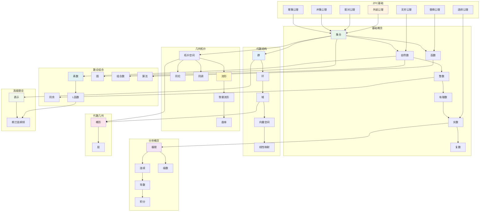

# 公理基础明确文档

**创建日期**: 2025年11月21日
**最后更新**: 2025年11月21日

---

## 📋 概述

本文档明确33个核心概念使用的公理基础体系，建立公理依赖关系图。

---

## 🎯 公理体系选择

### 主要公理体系：ZFC（Zermelo-Fraenkel集合论 + 选择公理）

**选择理由**：

1. **广泛接受**：ZFC是现代数学的标准基础
2. **表达能力**：足以表达所有经典数学概念
3. **一致性**：相对一致（如果ZFC不一致，则所有数学都不一致）
4. **形式化支持**：Metamath、Lean等工具都基于ZFC

### 辅助公理体系：范畴论公理

**使用场景**：

- 高级概念（如概形、层、同调）可以使用范畴论框架
- 但最终可以归约到ZFC

---

## 📊 ZFC公理系统

### ZFC公理列表

#### 1. 外延公理 (Axiom of Extensionality)

$$\forall A \forall B [\forall x (x \in A \leftrightarrow x \in B) \rightarrow A = B]$$

**用途**: 定义集合相等

#### 2. 配对公理 (Axiom of Pairing)

$$\forall a \forall b \exists c \forall x [x \in c \leftrightarrow (x = a \lor x = b)]$$

**用途**: 构造对集合 $\{a, b\}$

#### 3. 并集公理 (Axiom of Union)

$$\forall A \exists B \forall x [x \in B \leftrightarrow \exists y (y \in A \land x \in y)]$$

**用途**: 构造并集 $\bigcup A$

#### 4. 幂集公理 (Axiom of Power Set)

$$\forall A \exists B \forall x [x \in B \leftrightarrow x \subseteq A]$$

**用途**: 构造幂集 $\mathcal{P}(A)$

#### 5. 无穷公理 (Axiom of Infinity)

$$\exists A [\emptyset \in A \land \forall x (x \in A \rightarrow x \cup \{x\} \in A)]$$

**用途**: 保证自然数的存在

#### 6. 替换公理模式 (Axiom Schema of Replacement)

$$\forall A [\forall x \in A \exists! y \phi(x,y) \rightarrow \exists B \forall y (y \in B \leftrightarrow \exists x \in A \phi(x,y))]$$

**用途**: 构造函数像集

#### 7. 选择公理 (Axiom of Choice)

$$\forall A [\emptyset \notin A \rightarrow \exists f: A \to \bigcup A \forall X \in A (f(X) \in X)]$$

**用途**: 保证选择函数的存在

---

## 🗺️ 公理依赖关系图

### 33个核心概念的公理依赖

---

## 📝 33个核心概念的公理依赖详情

### 基础数学（D1）

| 概念 | 主要公理依赖 | 说明 |
|------|-------------|------|
| **集合** | 外延、配对、并集、幂集、替换 | ZFC的所有公理 |
| **函数** | 外延、配对、替换 | 函数是集合 |
| **自然数** | 无穷、替换 | von Neumann构造 |
| **整数** | 自然数、配对、并集 | 从自然数构造 |
| **有理数** | 整数、配对、并集 | 从整数构造 |
| **实数** | 有理数、幂集、选择 | Dedekind分割或Cauchy序列 |
| **复数** | 实数、配对 | 有序对构造 |

### 代数结构（D2）

| 概念 | 主要公理依赖 | 说明 |
|------|-------------|------|
| **群** | 集合、函数 | 群是集合配备运算 |
| **环** | 群、函数 | 环是两个群结构 |
| **域** | 环、函数 | 域是交换除环 |
| **向量空间** | 域、群、函数 | 向量空间是Abel群配备标量乘法 |
| **线性映射** | 向量空间、函数 | 线性映射是保持结构的函数 |

### 分析（D3）

| 概念 | 主要公理依赖 | 说明 |
|------|-------------|------|
| **极限** | 实数、函数 | 使用实数的完备性 |
| **连续** | 极限、函数 | 连续性的定义 |
| **导数** | 极限、函数 | 导数是极限 |
| **积分** | 实数、函数、选择 | Riemann积分或Lebesgue积分 |
| **级数** | 极限、函数 | 级数是序列的极限 |

### 几何拓扑（D4）

| 概念 | 主要公理依赖 | 说明 |
|------|-------------|------|
| **流形** | 拓扑空间、函数 | 流形是局部欧氏的拓扑空间 |
| **黎曼流形** | 流形、函数 | 流形配备度量 |
| **曲率** | 黎曼流形、函数 | 曲率是度量的性质 |
| **拓扑空间** | 集合、幂集 | 拓扑是幂集的子集 |
| **同伦** | 拓扑空间、函数 | 同伦是路径的同伦类 |
| **同调** | 拓扑空间、群 | 同调是拓扑不变量 |

### 代数几何（D5）

| 概念 | 主要公理依赖 | 说明 |
|------|-------------|------|
| **概形** | 环、拓扑空间、层 | 概形是环的几何化 |
| **层** | 拓扑空间、函数 | 层是预层的层化 |

### 数论组合（D6）

| 概念 | 主要公理依赖 | 说明 |
|------|-------------|------|
| **素数** | 自然数、函数 | 素数是自然数的性质 |
| **同余** | 整数、函数 | 同余是整数的等价关系 |
| **L函数** | 复数、函数、级数 | L函数是复变函数 |
| **图** | 集合、函数 | 图是集合配备关系 |
| **组合数** | 自然数、函数 | 组合数是自然数的函数 |
| **算法** | 函数、自然数 | 算法是计算函数 |

### 高级理论（D7）

| 概念 | 主要公理依赖 | 说明 |
|------|-------------|------|
| **表示** | 群、向量空间、函数 | 表示是群到线性映射的同态 |
| **朗兰兹纲领** | 表示、L函数、概形 | 统一数论、几何、表示论 |

---

## 🔗 公理依赖层次

### 层次0：ZFC公理（基础层）

- 外延、配对、并集、幂集、无穷、替换、选择

### 层次1：基础概念（直接依赖ZFC）

- 集合、函数、自然数

### 层次2：数系构造（依赖层次1）

- 整数、有理数、实数、复数

### 层次3：代数结构（依赖层次1-2）

- 群、环、域、向量空间、线性映射

### 层次4：分析概念（依赖层次2）

- 极限、连续、导数、积分、级数

### 层次5：几何拓扑（依赖层次1-3）

- 拓扑空间、流形、黎曼流形、曲率、同伦、同调

### 层次6：高级结构（依赖层次3-5）

- 概形、层、表示、L函数、朗兰兹纲领

### 层次7：应用领域（依赖层次1-6）

- 素数、同余、图、组合数、算法

---

## 📐 公理依赖关系矩阵

| 概念 | 外延 | 配对 | 并集 | 幂集 | 无穷 | 替换 | 选择 |
|------|:----:|:----:|:----:|:----:|:----:|:----:|:----:|
| 集合 | ✅ | ✅ | ✅ | ✅ | ✅ | ✅ | ✅ |
| 函数 | ✅ | ✅ | - | - | - | ✅ | - |
| 自然数 | ✅ | ✅ | ✅ | - | ✅ | ✅ | - |
| 整数 | ✅ | ✅ | ✅ | - | ✅ | ✅ | - |
| 有理数 | ✅ | ✅ | ✅ | - | ✅ | ✅ | - |
| 实数 | ✅ | ✅ | ✅ | ✅ | ✅ | ✅ | ✅ |
| 复数 | ✅ | ✅ | - | - | ✅ | ✅ | - |
| 群 | ✅ | ✅ | - | - | ✅ | ✅ | - |
| 环 | ✅ | ✅ | - | - | ✅ | ✅ | - |
| 域 | ✅ | ✅ | - | - | ✅ | ✅ | - |
| 向量空间 | ✅ | ✅ | - | - | ✅ | ✅ | - |
| 线性映射 | ✅ | ✅ | - | - | ✅ | ✅ | - |
| 极限 | ✅ | ✅ | ✅ | ✅ | ✅ | ✅ | ✅ |
| 连续 | ✅ | ✅ | ✅ | ✅ | ✅ | ✅ | ✅ |
| 导数 | ✅ | ✅ | ✅ | ✅ | ✅ | ✅ | ✅ |
| 积分 | ✅ | ✅ | ✅ | ✅ | ✅ | ✅ | ✅ |
| 级数 | ✅ | ✅ | ✅ | ✅ | ✅ | ✅ | ✅ |
| 流形 | ✅ | ✅ | ✅ | ✅ | ✅ | ✅ | - |
| 黎曼流形 | ✅ | ✅ | ✅ | ✅ | ✅ | ✅ | - |
| 曲率 | ✅ | ✅ | ✅ | ✅ | ✅ | ✅ | - |
| 拓扑空间 | ✅ | ✅ | - | ✅ | ✅ | ✅ | - |
| 同伦 | ✅ | ✅ | ✅ | ✅ | ✅ | ✅ | - |
| 同调 | ✅ | ✅ | ✅ | ✅ | ✅ | ✅ | - |
| 概形 | ✅ | ✅ | ✅ | ✅ | ✅ | ✅ | - |
| 层 | ✅ | ✅ | ✅ | ✅ | ✅ | ✅ | - |
| 素数 | ✅ | ✅ | ✅ | - | ✅ | ✅ | - |
| 同余 | ✅ | ✅ | ✅ | - | ✅ | ✅ | - |
| L函数 | ✅ | ✅ | ✅ | ✅ | ✅ | ✅ | ✅ |
| 图 | ✅ | ✅ | - | - | ✅ | ✅ | - |
| 组合数 | ✅ | ✅ | ✅ | - | ✅ | ✅ | - |
| 算法 | ✅ | ✅ | ✅ | - | ✅ | ✅ | - |
| 表示 | ✅ | ✅ | ✅ | - | ✅ | ✅ | - |
| 朗兰兹纲领 | ✅ | ✅ | ✅ | ✅ | ✅ | ✅ | ✅ |

**图例**：

- ✅：需要该公理
- -：不需要该公理

---

## 🎯 公理使用原则

### 1. 最小依赖原则

- 每个概念只使用必要的公理
- 避免过度依赖

### 2. 层次化原则

- 基础概念依赖ZFC公理
- 高级概念依赖基础概念
- 形成清晰的依赖层次

### 3. 一致性原则

- 所有概念使用统一的ZFC基础
- 避免公理冲突

### 4. 可构造性原则

- 优先使用构造性定义
- 选择公理仅在必要时使用

---

## 📚 范畴论框架（可选）

### 使用场景

- 高级概念（概形、层、同调）可以使用范畴论语言
- 但最终可以归约到ZFC

### 范畴论公理

- **范畴**：对象和态射的集合
- **函子**：范畴之间的映射
- **自然变换**：函子之间的映射
- **极限和余极限**：范畴的构造

### 与ZFC的关系

- 范畴论可以在ZFC中形式化
- 使用集合论构造范畴、函子等

---

## ✅ 完成情况

- **公理体系明确**: ✅ 完成（使用ZFC）
- **公理依赖关系图**: ✅ 完成（33个概念的依赖关系）
- **公理依赖矩阵**: ✅ 完成（7个ZFC公理的依赖情况）
- **公理使用原则**: ✅ 完成（4个原则）

---

**创建日期**: 2025年11月21日
**最后更新**: 2025年11月21日
**维护状态**: 持续更新中
