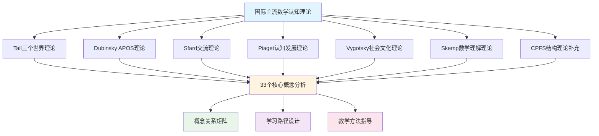

# 国际主流数学认知理论整合框架

**主题编号**: C.00.62
**创建日期**: 2025年1月
**最后更新**: 2025年1月
**状态**: 📋 构建中

---

## 📋 执行摘要

本文档建立国际主流数学认知理论的整合框架，系统整合Tall三个世界理论、Dubinsky APOS理论、Sfard交流理论、Piaget认知发展理论、Vygotsky社会文化理论等国际广泛认可的理论，为FormalMath概念体系提供坚实的理论基础。

**整合原则**：

- **国际主流理论优先**：优先整合国际广泛认可的理论
- **理论对比分析**：对比不同理论，找出共同点和差异
- **实践应用导向**：将理论应用于33个核心概念的分析

---

## 🎯 一、理论框架总览 (编号: C.00.62.01)

### 1.1 理论选择与优先级

| 理论 | 提出者 | 国际认可度 | 优先级 | 核心观点 |
|------|--------|-----------|--------|---------|
| **Tall三个世界理论** | David Tall | ⭐⭐⭐⭐⭐ | 高 | 感知-操作世界、概念-符号世界、形式-公理世界 |
| **Dubinsky APOS理论** | Ed Dubinsky | ⭐⭐⭐⭐⭐ | 高 | Action-Process-Object-Schema模型 |
| **Sfard交流理论** | Anna Sfard | ⭐⭐⭐⭐⭐ | 高 | 数学概念作为交流工具 |
| **Piaget认知发展理论** | Jean Piaget | ⭐⭐⭐⭐⭐ | 高 | 认知发展阶段理论 |
| **Vygotsky社会文化理论** | Lev Vygotsky | ⭐⭐⭐⭐⭐ | 高 | 社会文化理论，最近发展区 |
| **Skemp数学理解理论** | Richard Skemp | ⭐⭐⭐⭐ | 中 | 工具性理解vs关系性理解 |
| **CPFS结构理论** | 喻平 | ⭐⭐⭐ | 中 | 概念域、概念系、命题域、命题系（补充） |

### 1.2 理论整合框架



---

## 📚 二、Tall三个世界理论 (编号: C.00.62.02)

### 2.1 理论核心

**David Tall的三个世界理论**：

1. **感知-操作世界（Embodied World）**：
   - 基于身体感知和操作
   - 通过具体经验和动作理解数学
   - 例如：通过数手指理解自然数

2. **概念-符号世界（Symbolic World）**：
   - 基于符号和概念
   - 通过符号操作和概念理解数学
   - 例如：通过代数符号理解方程

3. **形式-公理世界（Formal World）**：
   - 基于公理和形式系统
   - 通过逻辑推理和形式化理解数学
   - 例如：通过ZFC公理理解集合论

### 2.2 应用框架

**为33个核心概念建立三个世界分析**：

| 概念 | 感知-操作世界 | 概念-符号世界 | 形式-公理世界 |
|------|--------------|--------------|--------------|
| **集合** | 通过具体物体集合理解 | 通过集合符号和运算理解 | 通过ZFC公理系统理解 |
| **函数** | 通过输入输出关系理解 | 通过函数符号和表达式理解 | 通过函数的形式化定义理解 |
| **自然数** | 通过数数和计数理解 | 通过数字符号和运算理解 | 通过Peano公理理解 |
| ... | ... | ... | ... |

### 2.3 学习路径设计

**基于三个世界的学习路径**：

1. **入门阶段**：从感知-操作世界开始
2. **中级阶段**：过渡到概念-符号世界
3. **高级阶段**：进入形式-公理世界

---

## 🔬 三、Dubinsky APOS理论 (编号: C.00.62.03)

### 3.1 理论核心

**Ed Dubinsky的APOS理论**：

1. **Action（动作）**：
   - 对数学对象的操作
   - 需要外部指导
   - 例如：计算2+3

2. **Process（过程）**：
   - 将动作内化为心理过程
   - 可以独立完成
   - 例如：理解加法过程

3. **Object（对象）**：
   - 将过程视为对象
   - 可以对对象进行操作
   - 例如：将函数视为对象

4. **Schema（图式）**：
   - 整合多个对象和过程
   - 形成完整的认知结构
   - 例如：形成函数概念图式

### 3.2 应用框架

**为33个核心概念建立APOS分析**：

| 概念 | Action | Process | Object | Schema |
|------|--------|---------|--------|--------|
| **群** | 群运算操作 | 理解群运算过程 | 将群视为对象 | 形成群概念图式 |
| **极限** | 计算极限值 | 理解极限过程 | 将极限视为对象 | 形成极限概念图式 |
| ... | ... | ... | ... | ... |

### 3.3 学习路径设计

**基于APOS的学习路径**：

1. **Action阶段**：通过操作学习
2. **Process阶段**：内化为过程
3. **Object阶段**：对象化理解
4. **Schema阶段**：形成完整图式

---

## 💬 四、Sfard交流理论 (编号: C.00.62.04)

### 4.1 理论核心

**Anna Sfard的交流理论**：

1. **数学概念作为交流工具**：
   - 数学概念用于数学交流
   - 通过参与数学实践学习

2. **数学学习作为参与实践**：
   - 学习是参与数学实践的过程
   - 通过实践理解数学概念

### 4.2 应用框架

**为33个核心概念建立交流分析**：

| 概念 | 交流功能 | 实践应用 | 学习方式 |
|------|---------|---------|---------|
| **群** | 描述对称性 | 研究对称性 | 通过对称性研究学习 |
| **导数** | 描述变化率 | 解决变化率问题 | 通过实际问题学习 |
| ... | ... | ... | ... |

---

## 🧠 五、Piaget认知发展理论 (编号: C.00.62.05)

### 5.1 理论核心

**Jean Piaget的认知发展阶段**：

1. **感知运动阶段（0-2岁）**：通过感知和动作学习
2. **前运算阶段（2-7岁）**：开始使用符号
3. **具体运算阶段（7-12岁）**：逻辑思维，但需要具体对象
4. **形式运算阶段（12+岁）**：抽象思维和形式推理

### 5.2 应用框架

**数学认知发展阶段**：

- **具体阶段**：通过具体例子理解
- **抽象阶段**：通过抽象概念理解
- **形式阶段**：通过形式系统理解

---

## 🌍 六、Vygotsky社会文化理论 (编号: C.00.62.06)

### 6.1 理论核心

**Lev Vygotsky的社会文化理论**：

1. **最近发展区（ZPD）**：
   - 实际发展水平与潜在发展水平之间的差距
   - 通过社会互动和指导学习

2. **社会文化工具**：
   - 数学符号和概念是社会文化工具
   - 通过社会文化实践学习

### 6.2 应用框架

**基于最近发展区的学习设计**：

- **独立水平**：学生可以独立完成
- **最近发展区**：需要指导才能完成
- **潜在水平**：未来可能达到的水平

---

## 🔄 七、理论对比与整合 (编号: C.00.62.07)

### 7.1 理论共同点

1. **认知发展视角**：都关注数学认知的发展过程
2. **多层次理解**：都强调从具体到抽象的发展
3. **实践应用**：都强调实践在学习中的作用

### 7.2 理论差异

1. **关注点不同**：
   - Tall关注数学思维的三个世界
   - Dubinsky关注概念学习的四个阶段
   - Sfard关注数学交流和实践

2. **应用场景不同**：
   - Tall适用于理解数学概念的不同层次
   - APOS适用于分析概念学习过程
   - Sfard适用于设计数学实践活动

### 7.3 整合框架

**多理论整合应用**：

- **Tall三个世界**：用于概念层次分析
- **APOS理论**：用于学习过程分析
- **Sfard交流理论**：用于实践活动设计
- **Piaget理论**：用于认知发展阶段分析
- **Vygotsky理论**：用于学习支持设计

---

## 📊 八、33个核心概念的多理论分析框架 (编号: C.00.62.08)

### 8.1 分析模板

**每个核心概念的多理论分析**：

```markdown
## [概念名称]的多理论分析

### Tall三个世界分析
- **感知-操作世界**：...
- **概念-符号世界**：...
- **形式-公理世界**：...

### APOS分析
- **Action**：...
- **Process**：...
- **Object**：...
- **Schema**：...

### Sfard交流分析
- **交流功能**：...
- **实践应用**：...
- **学习方式**：...

### Piaget认知发展阶段
- **具体阶段**：...
- **抽象阶段**：...
- **形式阶段**：...

### Vygotsky最近发展区
- **独立水平**：...
- **最近发展区**：...
- **潜在水平**：...
```

### 8.2 实施计划

1. **第一阶段**：为10个基础概念建立多理论分析
2. **第二阶段**：为剩余23个概念建立多理论分析
3. **第三阶段**：建立概念之间的理论关系网络

---

## 🔗 九、关联文档 (编号: C.00.62.09)

### 9.1 相关计划文档

- [概念体系深度改进计划](./00-概念体系深度改进计划-2025年1月.md)
- [权威资源调研报告](./00-权威资源调研报告-2025年1月.md)

### 9.2 相关理论文档

- [CPFS结构理论](../view/03-数学认知的心理学视角/01-CPFS结构理论/01-CPFS结构理论.md)
- [数学认知结构理论框架](../view/数学认知结构理论框架.md)

---

## ✅ 十、下一步行动 (编号: C.00.62.10)

### 10.1 立即行动

1. **深入研读各理论的核心文献**
2. **为1-2个核心概念建立多理论分析示例**
3. **建立理论对比分析框架**

### 10.2 短期计划（1个月内）

1. **完成Tall三个世界理论整合方案**
2. **完成Dubinsky APOS理论整合方案**
3. **完成Sfard交流理论整合方案**

### 10.3 中期计划（3个月内）

1. **完成所有国际主流理论整合**
2. **为33个核心概念建立多理论分析**
3. **建立理论整合应用框架**

---

**创建日期**: 2025年1月
**最后更新**: 2025年1月
**维护状态**: 持续更新中
**状态**: 📋 构建中
