# 国际优秀教育国家思维表征方法研究

**创建日期**: 2025年11月28日
**最后更新**: 2025年11月28日
**状态**: ✅ 研究文档完成

---

## 📋 概述

本文档深入研究新加坡、瑞典、挪威、芬兰等国际优秀教育国家在数学教育中应用的思维表征方法，包括思维导图、多维对比矩阵、决策树、决策逻辑路径等最新、最成熟的思维表征方式，为FormalMath项目提供全面的思维表征方法参考。

---

## 🎯 一、思维表征方法体系总览 (编号: C.INT.REP.01)

### 1.1 思维表征方法分类体系

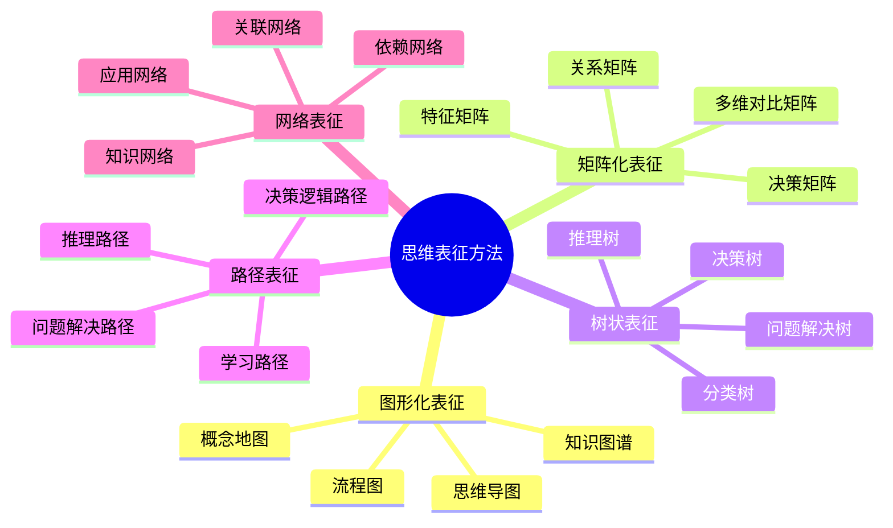

### 1.2 思维表征方法特征对比

| 表征方法 | 主要特点 | 优势 | 局限性 | 适用场景 | 国际应用 |
|---------|---------|------|--------|---------|---------|
| **思维导图** | 直观、层次清晰、易于理解 | 快速理解结构、易于记忆、促进创造力 | 难以量化、不够严格 | 知识概览、学习路径、概念梳理 | 新加坡、芬兰广泛使用 |
| **多维对比矩阵** | 量化、多维度、系统化 | 深入分析、易于对比、发现规律 | 可能过于复杂、需要专业知识 | 深入分析、对比研究、决策支持 | 瑞典、挪威强调使用 |
| **决策树** | 结构化、逻辑清晰、可操作 | 指导决策、展示路径、支持推理 | 可能过于简化、需要完整信息 | 决策分析、问题解决、概率推理 | 新加坡、瑞典广泛应用 |
| **决策逻辑路径** | 系统化、步骤清晰、可追溯 | 展示完整过程、支持反思、培养逻辑思维 | 可能过于详细、需要时间 | 问题解决、学习规划、教学指导 | 芬兰、挪威重点培养 |
| **知识图谱** | 网络化、关系完整、动态 | 展示复杂关系、支持探索、发现关联 | 可能过于复杂、难以理解 | 知识关联、研究分析、系统理解 | 各国都在发展 |
| **概念地图** | 概念化、关系明确、结构化 | 理解概念关系、组织知识、支持学习 | 可能过于静态、需要更新 | 概念学习、知识组织、教学规划 | 新加坡、芬兰常用 |

---

## 🇸🇬 二、新加坡数学教育思维表征方法 (编号: C.INT.REP.02)

### 2.1 新加坡数学教育思维表征方法体系

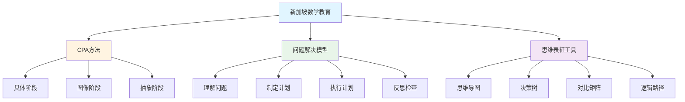

### 2.2 思维导图在新加坡数学教育中的应用

**应用特点**：
- ✅ **知识结构梳理**：使用思维导图梳理数学概念的知识结构
- ✅ **概念关系可视化**：通过思维导图展示概念之间的关系
- ✅ **学习路径规划**：使用思维导图规划学习路径
- ✅ **问题解决支持**：在问题解决过程中使用思维导图组织思路

**应用示例**：

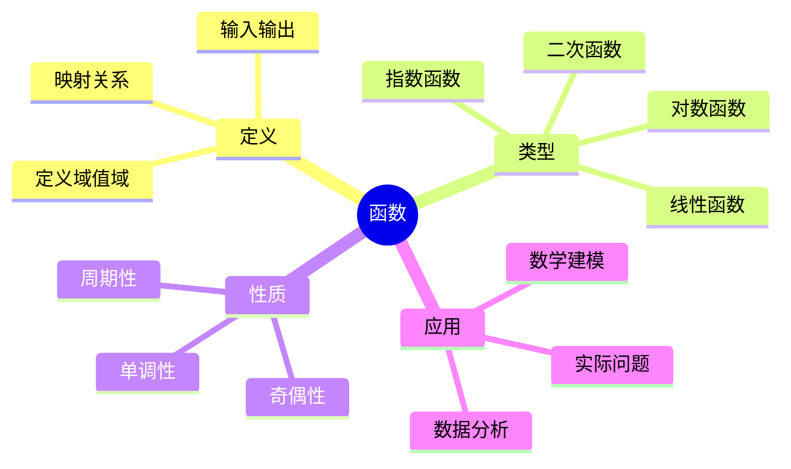

### 2.3 决策树在新加坡数学教育中的应用

**应用特点**：
- ✅ **问题分类决策**：使用决策树对数学问题进行分类
- ✅ **解题策略选择**：通过决策树选择最合适的解题策略
- ✅ **概率问题分析**：使用决策树分析概率问题
- ✅ **学习路径决策**：通过决策树规划学习路径

**应用示例**：

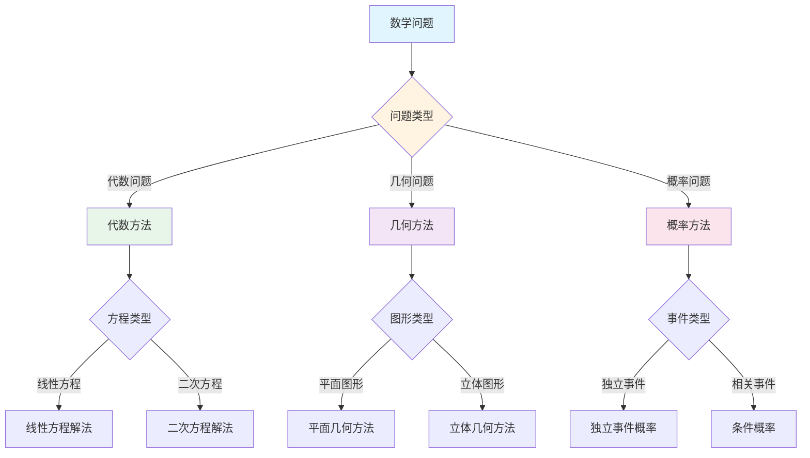

### 2.4 决策逻辑路径在新加坡数学教育中的应用

**应用特点**：
- ✅ **问题解决过程**：使用决策逻辑路径展示问题解决的完整过程
- ✅ **思维过程可视化**：通过决策逻辑路径可视化思维过程
- ✅ **反思和评估**：使用决策逻辑路径进行反思和评估
- ✅ **教学指导**：通过决策逻辑路径指导教学

**应用示例**：

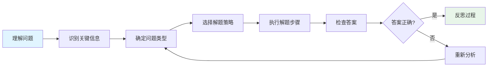

### 2.5 多维对比矩阵在新加坡数学教育中的应用

**应用特点**：
- ✅ **方法对比分析**：使用多维对比矩阵对比不同的解题方法
- ✅ **概念特征对比**：通过多维对比矩阵对比不同概念的特征
- ✅ **学习策略对比**：使用多维对比矩阵对比不同的学习策略
- ✅ **评估标准对比**：通过多维对比矩阵对比不同的评估标准

**应用示例**：

| 解题方法 | 适用问题类型 | 优势 | 局限 | 难度 | 推荐阶段 |
|---------|------------|------|------|------|---------|
| **直接法** | 简单问题 | 直接、快速 | 不适合复杂问题 | ⭐⭐ | 入门阶段 |
| **间接法** | 复杂问题 | 灵活、有效 | 需要技巧 | ⭐⭐⭐⭐ | 中级阶段 |
| **构造法** | 存在性问题 | 直观、有效 | 需要创造力 | ⭐⭐⭐⭐⭐ | 高级阶段 |
| **反证法** | 否定性问题 | 逻辑严密 | 需要逻辑思维 | ⭐⭐⭐⭐ | 中级阶段 |

---

## 🇸🇪 三、瑞典数学教育思维表征方法 (编号: C.INT.REP.03)

### 3.1 瑞典数学教育思维表征方法体系

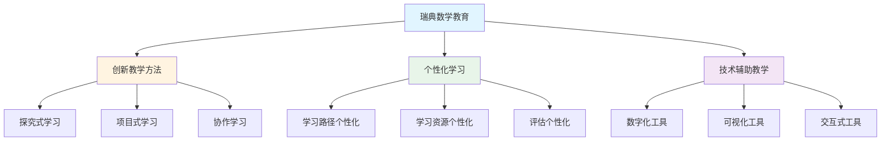

### 3.2 多维对比矩阵在瑞典数学教育中的应用

**应用特点**：
- ✅ **深度分析**：使用多维对比矩阵进行深度分析
- ✅ **多角度对比**：通过多维对比矩阵从多个角度对比
- ✅ **发现规律**：使用多维对比矩阵发现规律
- ✅ **支持决策**：通过多维对比矩阵支持决策

**应用示例**：

| 学习策略 | 学习效果 | 学习效率 | 学习动机 | 适用学生 | 推荐度 |
|---------|---------|---------|---------|---------|--------|
| **自主学习** | ⭐⭐⭐⭐ | ⭐⭐⭐⭐⭐ | ⭐⭐⭐⭐ | 自律学生 | ⭐⭐⭐⭐ |
| **协作学习** | ⭐⭐⭐⭐⭐ | ⭐⭐⭐ | ⭐⭐⭐⭐⭐ | 社交学生 | ⭐⭐⭐⭐⭐ |
| **探究学习** | ⭐⭐⭐⭐⭐ | ⭐⭐⭐ | ⭐⭐⭐⭐⭐ | 好奇学生 | ⭐⭐⭐⭐⭐ |
| **传统教学** | ⭐⭐⭐ | ⭐⭐⭐⭐ | ⭐⭐ | 所有学生 | ⭐⭐⭐ |

### 3.3 知识图谱在瑞典数学教育中的应用

**应用特点**：
- ✅ **知识关联**：使用知识图谱展示知识之间的关联
- ✅ **系统理解**：通过知识图谱实现系统理解
- ✅ **探索学习**：使用知识图谱支持探索学习
- ✅ **个性化学习**：通过知识图谱支持个性化学习

**应用示例**：

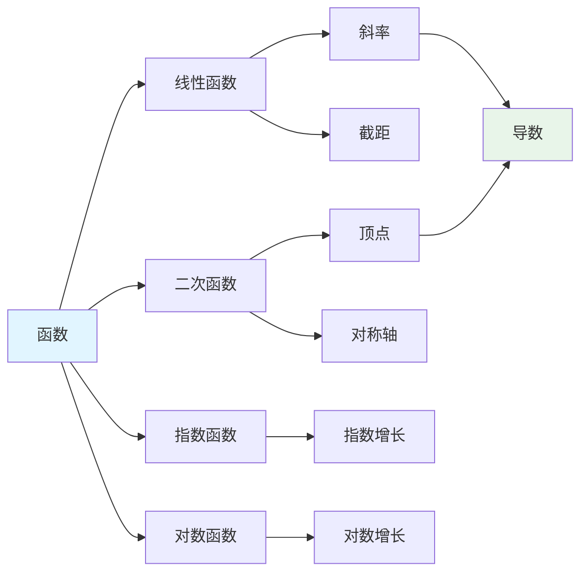

---

## 🇳🇴 四、挪威数学教育思维表征方法 (编号: C.INT.REP.04)

### 4.1 挪威数学教育思维表征方法体系

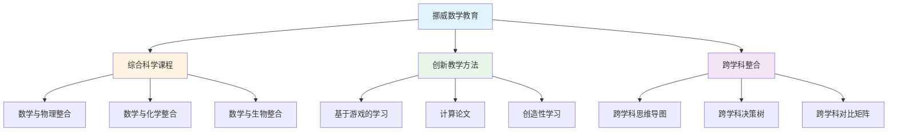

### 4.2 跨学科思维表征在挪威数学教育中的应用

**应用特点**：
- ✅ **跨学科整合**：使用思维表征方法整合不同学科
- ✅ **综合理解**：通过跨学科思维表征实现综合理解
- ✅ **实际问题解决**：使用跨学科思维表征解决实际问题
- ✅ **创新思维培养**：通过跨学科思维表征培养创新思维

**应用示例**：

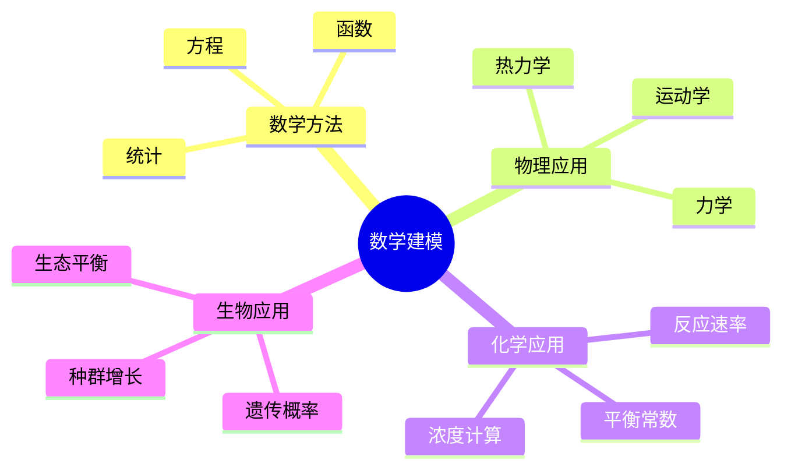

---

## 🇫🇮 五、芬兰数学教育思维表征方法 (编号: C.INT.REP.05)

### 5.1 芬兰数学教育思维表征方法体系

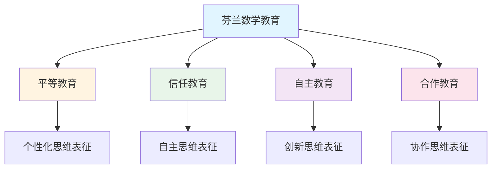

### 5.2 决策逻辑路径在芬兰数学教育中的应用

**应用特点**：
- ✅ **问题解决过程**：使用决策逻辑路径展示完整的问题解决过程
- ✅ **思维过程培养**：通过决策逻辑路径培养思维过程
- ✅ **反思能力培养**：使用决策逻辑路径培养反思能力
- ✅ **自主学习支持**：通过决策逻辑路径支持自主学习

**应用示例**：

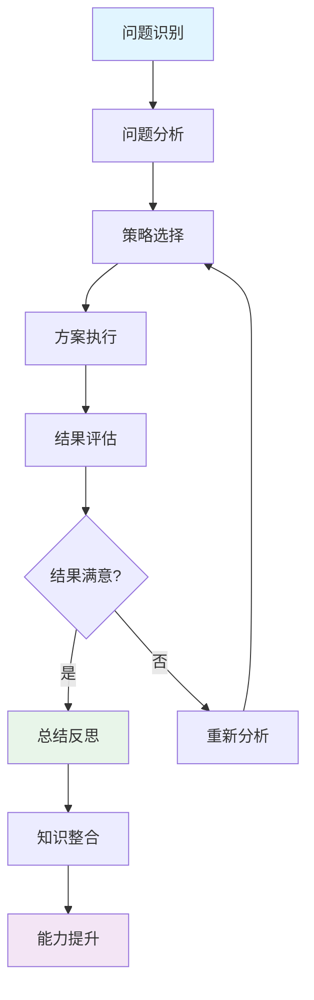

### 5.3 协作思维表征在芬兰数学教育中的应用

**应用特点**：
- ✅ **协作学习**：使用思维表征方法支持协作学习
- ✅ **知识共享**：通过思维表征方法实现知识共享
- ✅ **集体智慧**：使用思维表征方法汇聚集体智慧
- ✅ **团队合作**：通过思维表征方法培养团队合作能力

---

## 🌍 六、国际思维表征方法对比分析 (编号: C.INT.REP.06)

### 6.1 各国思维表征方法应用对比

| 国家 | 主要方法 | 应用特点 | 教育理念 | 优势 |
|------|---------|---------|---------|------|
| **新加坡** | 思维导图、决策树、决策逻辑路径 | 系统化、结构化、问题解决导向 | 高效教学、问题解决 | 系统性强、实用性强 |
| **瑞典** | 多维对比矩阵、知识图谱、创新方法 | 创新性、个性化、技术辅助 | 创新教育、个性化学习 | 创新性强、适应性强 |
| **挪威** | 跨学科思维表征、综合方法 | 跨学科、综合性、实际问题 | 综合教育、实际问题解决 | 综合性强、实用性强 |
| **芬兰** | 决策逻辑路径、协作思维表征 | 平等、信任、自主、合作 | 平等教育、信任教育 | 平等性强、自主性强 |

### 6.2 思维表征方法整合框架

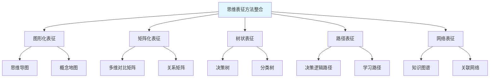

---

## 📊 七、思维表征方法应用指南 (编号: C.INT.REP.07)

### 7.1 方法选择决策树

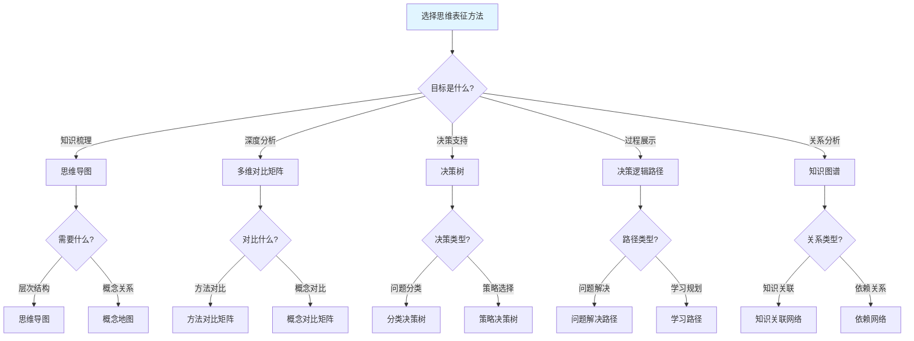

### 7.2 方法应用场景矩阵

| 应用场景 | 推荐方法 | 理由 | 示例 |
|---------|---------|------|------|
| **概念学习** | 思维导图、概念地图 | 直观、层次清晰 | 函数概念学习 |
| **方法对比** | 多维对比矩阵 | 系统化、易于对比 | 解题方法对比 |
| **问题分类** | 决策树 | 结构化、逻辑清晰 | 数学问题分类 |
| **问题解决** | 决策逻辑路径 | 过程完整、可追溯 | 应用题解决 |
| **知识关联** | 知识图谱 | 关系完整、支持探索 | 函数知识网络 |
| **学习规划** | 学习路径 | 步骤清晰、可操作 | 函数学习路径 |

### 7.3 方法整合应用流程

**流程说明**：
1. **问题识别**：明确需要解决的问题
2. **方法选择**：根据问题特点选择合适的方法
3. **方法应用**：应用选择的方法解决问题
4. **结果分析**：分析应用结果
5. **方法整合**：整合多种方法
6. **结果优化**：优化结果
7. **应用总结**：总结应用经验

---

## 🎯 八、FormalMath项目整合建议 (编号: C.INT.REP.08)

### 8.1 核心概念思维表征增强建议

**建议1：增强思维导图**
- ✅ 添加更多分支和子分支
- ✅ 使用颜色和图标增强视觉效果
- ✅ 添加交互式元素

**建议2：添加决策树**
- ✅ 为每个核心概念添加决策树
- ✅ 使用决策树支持问题解决
- ✅ 使用决策树支持学习决策

**建议3：添加决策逻辑路径**
- ✅ 为每个核心概念添加决策逻辑路径
- ✅ 使用决策逻辑路径展示问题解决过程
- ✅ 使用决策逻辑路径支持反思

**建议4：增强多维对比矩阵**
- ✅ 添加更多对比维度
- ✅ 使用量化指标
- ✅ 添加可视化元素

### 8.2 思维表征方法整合框架

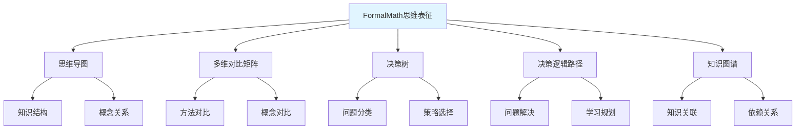

---

## 📚 九、参考文献 (编号: C.INT.REP.09)

### 9.1 新加坡数学教育

1. **Ministry of Education, Singapore (2020).** *Primary Mathematics Syllabus*. Singapore: Ministry of Education.
2. **Kaur, B., & Yeap, B. H. (2009).** *Mathematical Problem Solving in Singapore Schools*. Singapore: World Scientific.
3. **Fan, L., & Zhu, Y. (2007).** Representation of problem-solving procedures: A comparative look at China, Singapore, and US mathematics textbooks. *Educational Studies in Mathematics*, 66(1), 61-75.

### 9.2 瑞典数学教育

1. **Swedish National Agency for Education (2018).** *Curriculum for the Compulsory School, Preschool Class and School-age Educare*. Stockholm: Swedish National Agency for Education.
2. **Bergqvist, E., & Lithner, J. (2012).** Mathematical reasoning in teachers' presentations. *Journal of Mathematical Behavior*, 31(2), 252-269.
3. **Boesen, J., et al. (2014).** Developing mathematical competence: From the intended to the enacted curriculum. *Journal of Mathematical Behavior*, 33, 72-87.

### 9.3 挪威数学教育

1. **Norwegian Directorate for Education and Training (2019).** *Curriculum for Mathematics*. Oslo: Norwegian Directorate for Education and Training.
2. **Hauge, T. E., & Norenes, S. O. (2015).** Collaborative learning through digital storytelling in mathematics. *Computers & Education*, 79, 59-73.

### 9.4 芬兰数学教育

1. **Finnish National Agency for Education (2016).** *National Core Curriculum for Basic Education*. Helsinki: Finnish National Agency for Education.
2. **Sahlberg, P. (2011).** *Finnish Lessons: What Can the World Learn from Educational Change in Finland?* New York: Teachers College Press.
3. **Kupiainen, S., et al. (2015).** Finnish students' school engagement profiles in the light of PISA 2012. *Scandinavian Journal of Educational Research*, 59(2), 162-177.

### 9.5 思维表征方法

1. **Buzan, T. (2006).** *The Mind Map Book*. London: BBC Active.
2. **Novak, J. D., & Cañas, A. J. (2008).** The theory underlying concept maps and how to construct and use them. *Technical Report IHMC CmapTools*.
3. **Quinlan, J. R. (1986).** Induction of decision trees. *Machine Learning*, 1(1), 81-106.

---

## 🔗 十、关联文档 (编号: C.INT.REP.10)

- [思维表征工具与模板](./00-思维表征工具与模板-2025年11月28日.md)
- [新加坡数学教育方法深入研究](./00-新加坡数学教育方法深入研究-2025年11月28日.md)
- [认知方式表征综合](../04-认知工具/07-认知方式表征综合.md)
- [多种思维表征方式对比与整合](./00-多种思维表征方式对比与整合-2025年1月.md)

---

**创建日期**: 2025年11月28日
**最后更新**: 2025年11月28日
**维护状态**: 持续更新中
