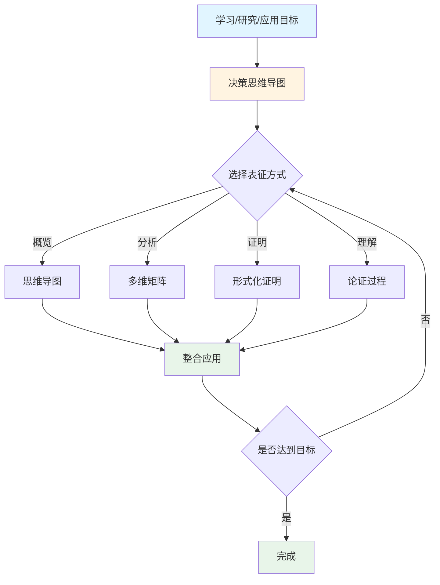
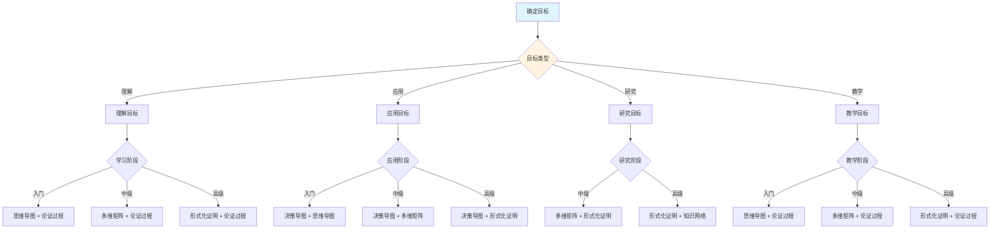

# 多种思维表征方式对比与整合

**主题编号**: C.00.42
**创建日期**: 2025年1月
**最后更新**: 2025年1月
**状态**: 持续推进中

---

## 📋 概述

本文档对比分析FormalMath概念体系中的**多种思维表征方式**，展示它们的互补性和整合应用，包括：
- 思维导图
- 多维概念矩阵对比
- 概念定义属性关系形式化论证证明
- 充分的论证过程
- 决策思维导图

**目标**：
- 深入理解不同表征方式的特点和优势
- 展示不同表征方式的互补关系
- 建立多种表征方式的整合应用框架
- 提供表征方式选择的决策指导

**理论基础**：
- 集合论与范畴论双视角框架
- 直观-知性-理性三维认知模型
- 多维度知识矩阵分析
- 形式化证明系统

---

## 🎯 一、多种思维表征方式总览 (编号: C.00.42.01)

### 1.1 表征方式体系

```mermaid
graph TD
    A[思维表征方式] --> B[思维导图]
    A --> C[多维概念矩阵]
    A --> D[形式化论证证明]
    A --> E[论证过程]
    A --> F[决策思维导图]

    B --> B1[总体思维导图]
    B --> B2[分支关联思维导图]
    B --> B3[学习路径思维导图]
    B --> B4[概念关系思维导图]

    C --> C1[知识层次矩阵]
    C --> C2[知识领域矩阵]
    C --> C3[依赖关系矩阵]
    C --> C4[应用关系矩阵]
    C --> C5[学习难度矩阵]
    C --> C6[多维对比矩阵]

    D --> D1[公理体系]
    D --> D2[形式化定义]
    D --> D3[定理证明]
    D --> D4[属性关系证明]

    E --> E1[直观论证]
    E --> E2[知性论证]
    E --> E3[理性论证]
    E --> E4[综合论证]

    F --> F1[学习决策导图]
    F --> F2[研究决策导图]
    F --> F3[应用决策导图]
    F --> F4[教学决策导图]

    style A fill:#e1f5ff
    style B fill:#fff4e1
    style C fill:#e8f5e9
    style D fill:#f3e5f5
    style E fill:#fce4ec
    style F fill:#e0f2f1
```

### 1.2 表征方式特征对比

| 表征方式 | 主要特点 | 优势 | 局限性 | 适用场景 |
|---------|---------|------|--------|---------|
| **思维导图** | 直观、层次清晰 | 快速理解结构、易于记忆 | 难以量化、不够严格 | 知识概览、学习路径 |
| **多维矩阵** | 量化、多维度 | 深入分析、易于对比 | 可能过于复杂 | 深入分析、对比研究 |
| **形式化证明** | 严格、可验证 | 逻辑严密、可追溯 | 难以理解、需要基础 | 理论构建、验证 |
| **论证过程** | 充分、易理解 | 连接直观与形式化 | 可能不够严格 | 教学、学习 |
| **决策导图** | 实用、可操作 | 指导实践、支持决策 | 需要其他资源支持 | 学习决策、研究规划 |

---

## 📊 二、思维导图 vs 多维矩阵 (编号: C.00.42.02)

### 2.1 对比分析

**思维导图的特点**：
- ✅ 直观可视化
- ✅ 层次结构清晰
- ✅ 易于理解和记忆
- ❌ 难以量化关系
- ❌ 不够严格

**多维矩阵的特点**：
- ✅ 量化分析
- ✅ 多维度对比
- ✅ 易于发现规律
- ❌ 可能过于复杂
- ❌ 需要专业知识

### 2.2 互补关系

**思维导图 → 多维矩阵**：
- 思维导图提供总体框架
- 多维矩阵提供详细分析
- 思维导图指导矩阵构建
- 多维矩阵验证导图结构

**多维矩阵 → 思维导图**：
- 多维矩阵发现关系
- 思维导图可视化关系
- 多维矩阵优化导图结构
- 思维导图简化矩阵信息

### 2.3 整合应用示例

**示例：群概念的学习**

1. **使用思维导图**：建立群概念的总体框架
   - 群的定义
   - 群的分类
   - 群的关系

2. **使用多维矩阵**：深入分析群概念
   - 知识层次：L1中级层
   - 知识领域：D2代数
   - 学习难度：中等偏难
   - 应用广度：极广

3. **整合应用**：
   - 思维导图提供学习路径
   - 多维矩阵确定学习重点
   - 思维导图可视化矩阵信息
   - 多维矩阵验证导图结构

---

## 🔬 三、形式化证明 vs 论证过程 (编号: C.00.42.03)

### 3.1 对比分析

**形式化证明的特点**：
- ✅ 逻辑严密
- ✅ 可机器验证
- ✅ 可追溯性强
- ❌ 难以理解
- ❌ 需要专业知识

**论证过程的特点**：
- ✅ 易于理解
- ✅ 充分详细
- ✅ 连接直观与形式化
- ❌ 可能不够严格
- ❌ 难以验证

### 3.2 互补关系

**形式化证明 → 论证过程**：
- 形式化证明提供严格基础
- 论证过程解释证明思路
- 形式化证明验证论证正确性
- 论证过程帮助理解证明

**论证过程 → 形式化证明**：
- 论证过程提供直观理解
- 形式化证明严格化论证
- 论证过程指导证明方向
- 形式化证明完善论证

### 3.3 整合应用示例

**示例：Lagrange定理的学习**

1. **使用论证过程**：理解定理的直观意义
   - 问题提出：为什么子群的阶整除群的阶？
   - 直观理解：陪集分解的概念
   - 概念分析：子群、陪集、商群

2. **使用形式化证明**：严格证明定理
   - 公理体系：群的定义
   - 形式化定义：子群、陪集
   - 证明步骤：逐步推理

3. **整合应用**：
   - 论证过程提供理解基础
   - 形式化证明提供严格验证
   - 论证过程解释证明思路
   - 形式化证明完善论证过程

---

## 🎯 四、决策导图 vs 其他表征方式 (编号: C.00.42.04)

### 4.1 对比分析

**决策导图的特点**：
- ✅ 实用性强
- ✅ 可操作性好
- ✅ 整合多种资源
- ❌ 需要其他资源支持
- ❌ 可能过于简化

**其他表征方式的特点**：
- ✅ 各自有独特优势
- ✅ 提供详细信息
- ❌ 可能过于复杂
- ❌ 难以直接应用

### 4.2 互补关系

**决策导图 → 其他表征方式**：
- 决策导图提供应用框架
- 其他表征方式提供详细资源
- 决策导图指导资源选择
- 其他表征方式支持决策

**其他表征方式 → 决策导图**：
- 其他表征方式提供信息基础
- 决策导图整合应用信息
- 其他表征方式验证决策正确性
- 决策导图优化资源使用

### 4.3 整合应用示例

**示例：群概念的学习决策**

1. **使用决策导图**：确定学习路径
   - 学习目标：理解群概念
   - 学习阶段：中级
   - 学习路径：基础概念 → 群的定义 → 群的性质 → 群的应用

2. **使用其他表征方式**：提供学习资源
   - 思维导图：总体框架
   - 多维矩阵：详细分析
   - 形式化证明：严格基础
   - 论证过程：理解桥梁

3. **整合应用**：
   - 决策导图指导学习
   - 其他表征方式提供资源
   - 决策导图优化资源使用
   - 其他表征方式验证学习效果

---

## 🔄 五、多维度整合应用框架 (编号: C.00.42.05)

### 5.1 整合框架

### 5.2 整合应用流程

**流程1：学习流程**
1. 使用决策导图确定学习路径
2. 使用思维导图建立总体框架
3. 使用多维矩阵深入分析
4. 使用论证过程理解概念
5. 使用形式化证明严格验证

**流程2：研究流程**
1. 使用决策导图确定研究方向
2. 使用多维矩阵发现研究问题
3. 使用形式化证明构建理论
4. 使用论证过程解释研究思路
5. 使用思维导图可视化研究成果

**流程3：应用流程**
1. 使用决策导图确定应用场景
2. 使用多维矩阵分析应用需求
3. 使用论证过程理解应用方法
4. 使用形式化证明验证应用正确性
5. 使用思维导图总结应用经验

### 5.3 整合应用原则

**原则1：目标导向**
- 根据目标选择表征方式
- 整合应用服务于目标
- 评估整合应用效果

**原则2：互补优化**
- 利用不同表征方式的优势
- 弥补不同表征方式的不足
- 优化整合应用效果

**原则3：层次递进**
- 从直观到形式化
- 从简单到复杂
- 从理解到应用

---

## 📈 六、表征方式选择决策矩阵 (编号: C.00.42.06)

### 6.1 选择决策矩阵

| 目标类型 | 学习阶段 | 推荐表征方式 | 理由 |
|---------|---------|------------|------|
| **理解概念** | 入门 | 思维导图 + 论证过程 | 直观、易理解 |
| **理解概念** | 中级 | 多维矩阵 + 论证过程 | 深入分析、充分理解 |
| **理解概念** | 高级 | 形式化证明 + 论证过程 | 严格、系统 |
| **应用概念** | 入门 | 决策导图 + 思维导图 | 实用、直观 |
| **应用概念** | 中级 | 决策导图 + 多维矩阵 | 实用、深入 |
| **应用概念** | 高级 | 决策导图 + 形式化证明 | 实用、严格 |
| **研究概念** | 中级 | 多维矩阵 + 形式化证明 | 深入、严格 |
| **研究概念** | 高级 | 形式化证明 + 知识网络 | 严格、系统 |
| **教学概念** | 入门 | 思维导图 + 论证过程 | 直观、充分 |
| **教学概念** | 中级 | 多维矩阵 + 论证过程 | 深入、充分 |
| **教学概念** | 高级 | 形式化证明 + 论证过程 | 严格、充分 |

### 6.2 选择决策流程

---

## 🎓 七、整合应用最佳实践 (编号: C.00.42.07)

### 7.1 最佳实践原则

**原则1：循序渐进**
- 从简单表征方式开始
- 逐步引入复杂表征方式
- 根据理解程度调整

**原则2：目标导向**
- 明确使用目标
- 选择合适表征方式
- 评估使用效果

**原则3：互补整合**
- 利用不同表征方式的优势
- 弥补不同表征方式的不足
- 形成完整的知识体系

### 7.2 最佳实践示例

**示例1：初学者学习群概念**

1. **第一步**：使用思维导图建立总体框架
   - 群的定义
   - 群的分类
   - 群的关系

2. **第二步**：使用论证过程理解概念
   - 直观理解：对称性和变换
   - 概念分析：群的定义、分类、关系
   - 性质论证：基本性质、重要定理

3. **第三步**：使用多维矩阵深入分析
   - 知识层次：L1中级层
   - 知识领域：D2代数
   - 学习难度：中等偏难

4. **第四步**：使用形式化证明严格验证
   - Lagrange定理的形式化证明
   - 群同态的性质证明

**示例2：研究者研究群概念**

1. **第一步**：使用多维矩阵发现研究问题
   - 研究热点矩阵
   - 概念关系矩阵
   - 应用场景矩阵

2. **第二步**：使用形式化证明构建理论
   - 群的定义形式化
   - 重要定理形式化证明
   - 概念关系形式化证明

3. **第三步**：使用论证过程解释研究思路
   - 问题提出
   - 研究方法
   - 研究结果

4. **第四步**：使用思维导图可视化研究成果
   - 理论框架
   - 重要结果
   - 应用前景

---

## 🔗 八、关联文档 (编号: C.00.42.08)

### 8.1 思维导图文档

- [总体思维导图总览](./01-总体思维导图/00-总体思维导图总览.md)
- [决策思维导图体系](./01-总体思维导图/05-决策思维导图体系.md)

### 8.2 知识矩阵文档

- [知识矩阵总览](./02-知识矩阵/00-知识矩阵总览.md)
- [核心概念多维关系矩阵](./02-知识矩阵/10-核心概念多维关系矩阵.md)
- [多维矩阵对比分析](./02-知识矩阵/11-多维矩阵对比分析.md)

### 8.3 形式化证明文档

- [形式化证明系统](./00-形式化证明系统-2025年11月.md)
- [概念定义属性关系形式化论证证明系统](./00-概念定义属性关系形式化论证证明系统-2025年1月.md)

### 8.4 认知工具文档

- [认知工具总览](./04-认知工具/00-认知工具总览.md)
- [认知方式表征综合](./04-认知工具/07-认知方式表征综合.md)

### 8.5 核心概念文档

- [核心概念索引](./核心概念/00-核心概念索引.md)
- 所有33个核心概念的三视角版本文档

---

## ✅ 九、总结与展望 (编号: C.00.42.09)

### 9.1 总结

**多种思维表征方式的互补性**：
- 思维导图：直观、层次清晰
- 多维矩阵：量化、多维度
- 形式化证明：严格、可验证
- 论证过程：充分、易理解
- 决策导图：实用、可操作

**整合应用的价值**：
- 形成完整的知识体系
- 提供多角度的理解方式
- 支持不同层次的学习和研究
- 优化学习和研究效果

### 9.2 展望

**未来发展方向**：
- 进一步完善各种表征方式
- 建立更完善的整合应用框架
- 开发表征方式选择工具
- 建立表征方式效果评估体系

**持续改进计划**：
- 根据使用反馈优化表征方式
- 补充新的表征方式
- 完善整合应用流程
- 建立最佳实践库

---

**创建日期**: 2025年1月
**最后更新**: 2025年1月
**维护状态**: 持续更新中
**负责人**: FormalMath项目组
