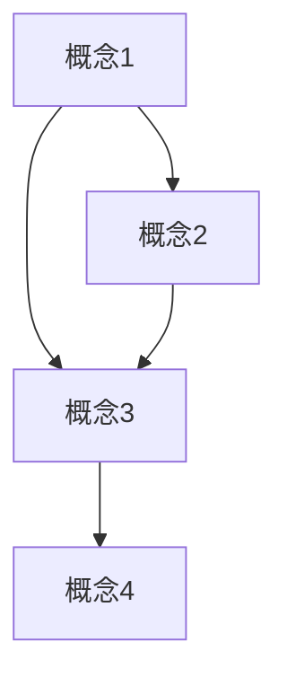

# FormalMath 概念体系实用模板与清单

**主题编号**: C.00.09
**创建日期**: 2025年11月21日
**最后更新**: 2025年11月21日

---

## 📋 目录 / Table of Contents

- [FormalMath 概念体系实用模板与清单](#formalmath-概念体系实用模板与清单)
  - [📋 目录 / Table of Contents](#-目录--table-of-contents)
  - [📋 概述 (编号: C.00.09.01)](#-概述-编号-c000901)
  - [📝 一、学习计划模板 (编号: C.00.09.02)](#-一学习计划模板-编号-c000902)
    - [模板1: 基础学习计划](#模板1-基础学习计划)
    - [模板2: 深入研究计划](#模板2-深入研究计划)
  - [✅ 二、问题解决检查清单 (编号: C.00.09.03)](#-二问题解决检查清单-编号-c000903)
    - [清单1: 问题分析检查清单](#清单1-问题分析检查清单)
    - [清单2: 方法选择检查清单](#清单2-方法选择检查清单)
    - [清单3: 验证检查清单](#清单3-验证检查清单)
  - [📊 三、学习进度跟踪模板 (编号: C.00.09.04)](#-三学习进度跟踪模板-编号-c000904)
    - [模板1: 学习进度跟踪表](#模板1-学习进度跟踪表)
  - [🕸️ 四、知识网络构建模板 (编号: C.00.09.05)](#️-四知识网络构建模板-编号-c000905)
    - [模板1: 概念网络构建模板](#模板1-概念网络构建模板)
  - [关联文档](#关联文档)
    - [模板2: 定理依赖网络模板](#模板2-定理依赖网络模板)
  - [🔍 五、工具使用检查清单 (编号: C.00.09.06)](#-五工具使用检查清单-编号-c000906)
    - [清单1: 学习工具使用检查清单](#清单1-学习工具使用检查清单)
    - [清单2: 研究工具使用检查清单](#清单2-研究工具使用检查清单)
  - [🔗 关联文档 (编号: C.00.09.07)](#-关联文档-编号-c000907)
    - [导航和使用文档](#导航和使用文档)
    - [总览文档](#总览文档)

---

## 📋 概述 (编号: C.00.09.01)

本文档提供FormalMath概念体系的实用模板和检查清单，帮助用户系统化地使用各种工具和方法。

**目标**: 提供可复用的模板和检查清单，提高使用效率

---

## 📝 一、学习计划模板 (编号: C.00.09.02)

### 模板1: 基础学习计划

```markdown
# 学习计划：[主题名称]

**学习目标**: [描述学习目标]
**学习时间**: [开始日期] - [结束日期]
**预计时间**: [小时数] 小时

## 阶段1: 建立整体认识
- [ ] 查看 [数学知识体系全景图](./01-总体思维导图/01-数学知识体系全景图.md)
- [ ] 查看 [分支关联思维导图](./01-总体思维导图/02-分支关联思维导图.md)
- [ ] 查看 [学习难度矩阵](./02-知识矩阵/03-学习难度矩阵.md)
- [ ] 查看 [时间维度矩阵](./02-知识矩阵/08-时间维度矩阵.md)
**完成日期**: [日期]

## 阶段2: 学习核心概念
- [ ] 查看 [主题概念总览](./03-主题概念梳理/00-主题概念总览.md)
- [ ] 学习 [相关概念文档](./03-主题概念梳理/)
- [ ] 使用 [概念级关联网络](./05-知识关联网络/01-概念级关联网络.md) 理解关系
**完成日期**: [日期]

## 阶段3: 记忆和理解
- [ ] 使用 [记忆与理解工具详细版](./04-认知工具/05-记忆与理解工具详细版.md) 记忆概念
- [ ] 创建概念卡片
- [ ] 绘制关系图
**完成日期**: [日期]

## 阶段4: 应用和巩固
- [ ] 使用 [问题解决工具](./04-认知工具/06-问题解决工具.md) 解决问题
- [ ] 使用 [方法级关联网络](./05-知识关联网络/03-方法级关联网络.md) 查找方法
- [ ] 循环复习
**完成日期**: [日期]

## 学习总结
**完成情况**: [完成百分比]%
**主要收获**: [描述主要收获]
**待改进**: [描述待改进的地方]
```

### 模板2: 深入研究计划

```markdown
# 研究计划：[研究方向]

**研究目标**: [描述研究目标]
**研究时间**: [开始日期] - [结束日期]

## 阶段1: 领域调研
- [ ] 查看 [研究热点矩阵](./02-知识矩阵/07-研究热点矩阵.md)
- [ ] 查看 [历史发展矩阵](./02-知识矩阵/06-历史发展矩阵.md)
- [ ] 识别前沿问题
**完成日期**: [日期]

## 阶段2: 知识准备
- [ ] 查看 [概念层次矩阵](./02-知识矩阵/02-概念层次矩阵.md) 了解前置知识
- [ ] 查看 [学习路径思维导图](./01-总体思维导图/03-学习路径思维导图.md) 规划学习路径
- [ ] 学习必要的基础知识
**完成日期**: [日期]

## 阶段3: 深入研究
- [ ] 使用 [方法级关联网络](./05-知识关联网络/03-方法级关联网络.md) 了解研究方法
- [ ] 使用 [定理级关联网络](./05-知识关联网络/02-定理级关联网络.md) 理解理论依赖
- [ ] 进行研究
**完成日期**: [日期]

## 阶段4: 成果总结
- [ ] 更新知识网络
- [ ] 总结研究成果
- [ ] 规划下一步
**完成日期**: [日期]

## 研究总结
**完成情况**: [完成百分比]%
**主要成果**: [描述主要成果]
**下一步计划**: [描述下一步计划]
```

---

## ✅ 二、问题解决检查清单 (编号: C.00.09.03)

### 清单1: 问题分析检查清单

```markdown
## 问题分析检查清单

### 问题理解
- [ ] 问题类型已识别（证明/计算/构造/分析）
- [ ] 问题条件已明确
- [ ] 问题目标已明确
- [ ] 问题难度已评估

### 问题分解
- [ ] 复杂问题已分解为简单子问题
- [ ] 子问题之间的关系已明确
- [ ] 解决顺序已确定

### 问题转化
- [ ] 问题已转化为熟悉的形式
- [ ] 等价问题已识别
- [ ] 特殊化/一般化已考虑

**相关文档**: [问题解决工具](./04-认知工具/06-问题解决工具.md)
```

### 清单2: 方法选择检查清单

```markdown
## 方法选择检查清单

### 方法查找
- [ ] 已使用 [方法级关联网络](./05-知识关联网络/03-方法级关联网络.md) 查找相关方法
- [ ] 已使用 [定理级关联网络](./05-知识关联网络/02-定理级关联网络.md) 查找相关定理
- [ ] 已考虑多种方法

### 方法选择
- [ ] 方法适合问题类型
- [ ] 方法适合问题难度
- [ ] 方法的前置条件已满足
- [ ] 方法的优缺点已评估

### 方法应用
- [ ] 方法步骤已明确
- [ ] 方法细节已理解
- [ ] 方法应用已执行

**相关文档**: [方法级关联网络](./05-知识关联网络/03-方法级关联网络.md)
```

### 清单3: 验证检查清单

```markdown
## 验证检查清单

### 逻辑检查
- [ ] 推理步骤正确
- [ ] 逻辑链条完整
- [ ] 没有逻辑漏洞

### 计算检查
- [ ] 计算过程正确
- [ ] 计算结果合理
- [ ] 计算已复核

### 特例检查
- [ ] 特例验证通过
- [ ] 边界情况已考虑
- [ ] 反例已检查

**相关文档**: [问题解决工具](./04-认知工具/06-问题解决工具.md)
```

---

## 📊 三、学习进度跟踪模板 (编号: C.00.09.04)

### 模板1: 学习进度跟踪表

```markdown
# 学习进度跟踪：[主题名称]

**开始日期**: [日期]
**目标完成日期**: [日期]
**当前进度**: [百分比]%

## 学习阶段跟踪

| 阶段 | 内容 | 计划时间 | 实际时间 | 完成状态 | 完成日期 |
|-----|------|---------|---------|---------|---------|
| 阶段1 | 建立整体认识 | [小时] | [小时] | [ ] | [日期] |
| 阶段2 | 学习核心概念 | [小时] | [小时] | [ ] | [日期] |
| 阶段3 | 记忆和理解 | [小时] | [小时] | [ ] | [日期] |
| 阶段4 | 应用和巩固 | [小时] | [小时] | [ ] | [日期] |

## 概念掌握情况

| 概念 | 理解程度 | 记忆程度 | 应用能力 | 备注 |
|-----|---------|---------|---------|------|
| [概念1] | [1-5] | [1-5] | [1-5] | [备注] |
| [概念2] | [1-5] | [1-5] | [1-5] | [备注] |

**评分标准**: 1=未掌握, 2=初步掌握, 3=基本掌握, 4=熟练掌握, 5=精通

## 工具使用情况

| 工具 | 使用次数 | 使用效果 | 备注 |
|-----|---------|---------|------|
| [思维导图](./01-总体思维导图/) | [次数] | [效果] | [备注] |
| [知识矩阵](./02-知识矩阵/) | [次数] | [效果] | [备注] |
| [关联网络](./05-知识关联网络/) | [次数] | [效果] | [备注] |
| [认知工具](./04-认知工具/) | [次数] | [效果] | [备注] |

## 学习总结

**本周/本月完成**:
- [ ] [完成项1]
- [ ] [完成项2]

**下周/下月计划**:
- [ ] [计划项1]
- [ ] [计划项2]

**遇到的问题**:
- [问题1]: [解决方案]
- [问题2]: [解决方案]

**改进建议**:
- [建议1]
- [建议2]
```

---

## 🕸️ 四、知识网络构建模板 (编号: C.00.09.05)

### 模板1: 概念网络构建模板

```markdown
# 概念网络：[主题名称]

**构建日期**: [日期]
**最后更新**: [日期]

## 核心概念

### 一级概念（基础概念）
- [概念1]: [定义/说明]
  - 关联概念: [概念A], [概念B]
  - 相关定理: [定理1], [定理2]
  - 应用场景: [场景1], [场景2]

- [概念2]: [定义/说明]
  - 关联概念: [概念C], [概念D]
  - 相关定理: [定理3], [定理4]
  - 应用场景: [场景3], [场景4]

### 二级概念（进阶概念）
- [概念3]: [定义/说明]
  - 前置概念: [概念1], [概念2]
  - 关联概念: [概念E], [概念F]
  - 相关定理: [定理5], [定理6]

### 三级概念（高级概念）
- [概念4]: [定义/说明]
  - 前置概念: [概念1], [概念2], [概念3]
  - 关联概念: [概念G], [概念H]
  - 相关定理: [定理7], [定理8]

## 概念关系图



## 关联文档

- [概念级关联网络](./05-知识关联网络/01-概念级关联网络.md)
- [定理级关联网络](./05-知识关联网络/02-定理级关联网络.md)
- [方法级关联网络](./05-知识关联网络/03-方法级关联网络.md)

### 模板2: 定理依赖网络模板

```markdown
    # 定理依赖网络：[主题名称]

    **构建日期**: [日期]
    **最后更新**: [日期]

    ## 基础定理

    ### 定理1: [定理名称]
    - **内容**: [定理表述]
    - **前置定理**: 无
    - **依赖定理**: [定理A], [定理B]
    - **应用**: [应用场景]

    ### 定理2: [定理名称]
    - **内容**: [定理表述]
    - **前置定理**: [定理1]
    - **依赖定理**: [定理C], [定理D]
    - **应用**: [应用场景]

    ## 进阶定理

    ### 定理3: [定理名称]
    - **内容**: [定理表述]
    - **前置定理**: [定理1], [定理2]
    - **依赖定理**: [定理E], [定理F]
    - **应用**: [应用场景]

    ## 定理依赖关系图

    ```mermaid
    graph TD
        A[定理1] --> B[定理2]
        A --> C[定理3]
        B --> C
        C --> D[定理4]
    ```

    ## 关联文档

    - [定理级关联网络](./05-知识关联网络/02-定理级关联网络.md)

```

---

## 🔍 五、工具使用检查清单 (编号: C.00.09.06)

### 清单1: 学习工具使用检查清单

```markdown
    ## 学习工具使用检查清单

    ### 思维导图
    - [ ] 已查看 [总体思维导图总览](./01-总体思维导图/00-总体思维导图总览.md)
    - [ ] 已查看 [数学知识体系全景图](./01-总体思维导图/01-数学知识体系全景图.md)
    - [ ] 已查看 [学习路径思维导图](./01-总体思维导图/03-学习路径思维导图.md)
    - [ ] 已建立整体认识

    ### 知识矩阵
    - [ ] 已查看 [学习难度矩阵](./02-知识矩阵/03-学习难度矩阵.md) 评估难度
    - [ ] 已查看 [概念层次矩阵](./02-知识矩阵/02-概念层次矩阵.md) 了解层次
    - [ ] 已查看 [时间维度矩阵](./02-知识矩阵/08-时间维度矩阵.md) 规划时间
    - [ ] 已进行多维度分析

    ### 概念梳理
    - [ ] 已查看 [主题概念总览](./03-主题概念梳理/00-主题概念总览.md)
    - [ ] 已学习相关概念文档
    - [ ] 已理解核心概念

    ### 关联网络
    - [ ] 已使用 [概念级关联网络](./05-知识关联网络/01-概念级关联网络.md) 理解概念关系
    - [ ] 已使用 [定理级关联网络](./05-知识关联网络/02-定理级关联网络.md) 理解定理依赖
    - [ ] 已建立知识网络

    ### 认知工具
    - [ ] 已使用 [学习策略工具详细版](./04-认知工具/04-学习策略工具详细版.md) 选择策略
    - [ ] 已使用 [记忆与理解工具详细版](./04-认知工具/05-记忆与理解工具详细版.md) 记忆概念
    - [ ] 已使用 [问题解决工具](./04-认知工具/06-问题解决工具.md) 解决问题
```

### 清单2: 研究工具使用检查清单

```markdown
    ## 研究工具使用检查清单

    ### 研究热点
    - [ ] 已查看 [研究热点矩阵](./02-知识矩阵/07-研究热点矩阵.md)
    - [ ] 已识别前沿问题
    - [ ] 已了解研究活跃度

    ### 历史发展
    - [ ] 已查看 [历史发展矩阵](./02-知识矩阵/06-历史发展矩阵.md)
    - [ ] 已了解发展历史
    - [ ] 已理解重要里程碑

    ### 方法网络
    - [ ] 已使用 [方法级关联网络](./05-知识关联网络/03-方法级关联网络.md) 了解方法
    - [ ] 已选择研究方法
    - [ ] 已理解方法关联

    ### 定理网络
    - [ ] 已使用 [定理级关联网络](./05-知识关联网络/02-定理级关联网络.md) 了解定理
    - [ ] 已理解定理依赖
    - [ ] 已掌握相关定理
```

---

## 🔗 关联文档 (编号: C.00.09.07)

### 导航和使用文档

- [快速导航](./00-快速导航.md) - 快速找到所需文档
- [综合使用指南](./00-综合使用指南.md) - 详细使用指南
- [跨模块整合指南](./00-跨模块整合指南.md) - 模块整合指南
- [实际应用案例](./00-实际应用案例.md) - 实际应用案例
- [快速参考卡片](./00-快速参考卡片.md) - 快速参考卡片

### 总览文档

- [README.md](./README.md) - 概念体系总览
- [SUMMARY.md](./SUMMARY.md) - 概念体系总结
- [完整索引](./00-完整索引.md) - 完整文档索引

---

**创建日期**: 2025年11月21日
**最后更新**: 2025年11月21日
**维护状态**: 持续更新中
**版本**: v1.0
