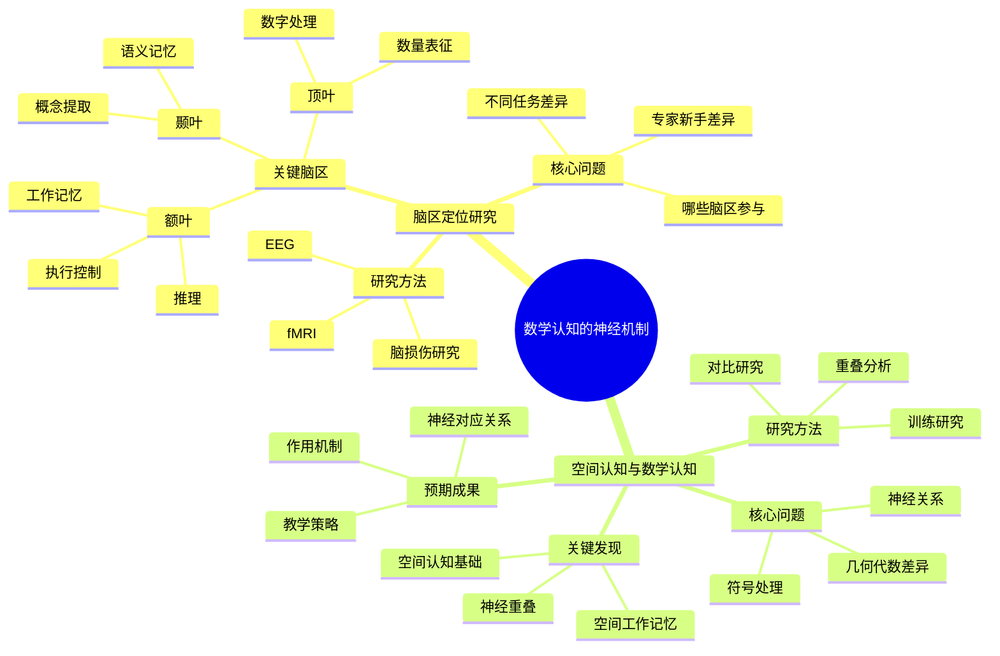

# **数学认知的神经机制**

---

## **目录**

- [**数学认知的神经机制**](#数学认知的神经机制)
  - [**目录**](#目录)
  - [**一、引言**](#一引言)
    - [**1.1 研究背景**](#11-研究背景)
    - [**1.2 研究意义**](#12-研究意义)
    - [**1.3 研究目标**](#13-研究目标)
    - [**1.4 文档结构**](#14-文档结构)
  - [**二、子主题总览**](#二子主题总览)
    - [**2.1 数学认知的神经机制思维导图**](#21-数学认知的神经机制思维导图)
    - [**2.2 权威定义**](#22-权威定义)
  - [**三、子主题**](#三子主题)
    - [**01-脑区定位研究**](#01-脑区定位研究)
    - [**02-空间认知与数学认知**](#02-空间认知与数学认知)
  - [**与三层结构的关系**](#与三层结构的关系)
    - [**集合论层 ↔ 工作记忆（前额叶）**](#集合论层--工作记忆前额叶)
    - [**代数层 ↔ 程序性记忆（基底神经节）**](#代数层--程序性记忆基底神经节)
    - [**范畴论层 ↔ 语义记忆（海马体-颞叶）**](#范畴论层--语义记忆海马体-颞叶)
  - [**研究文献**](#研究文献)
    - [**经典研究**](#经典研究)
    - [**最新进展**](#最新进展)
  - [**研究计划**](#研究计划)
  - [**四、总结与展望**](#四总结与展望)
    - [**4.1 主要观点总结**](#41-主要观点总结)
    - [**4.2 理论贡献**](#42-理论贡献)
    - [**4.3 未来研究方向**](#43-未来研究方向)
    - [**4.4 与三层结构的关系总结**](#44-与三层结构的关系总结)
  - [**五、参考文献**](#五参考文献)
    - [**5.1 经典研究**](#51-经典研究)
    - [**5.2 权威资源参考**](#52-权威资源参考)
    - [**5.3 相关文档**](#53-相关文档)

---

## **一、引言**

### **1.1 研究背景**

数学认知的神经机制研究是数学认知研究的重要神经科学基础，通过探索数学认知的神经基础，理解大脑如何实际处理数学概念和推理，为数学认知研究提供神经科学支持。

**历史发展**：

- **20世纪中期**：神经科学研究的兴起
- **20世纪末**：脑成像技术的发展（fMRI、EEG等）
- **21世纪初**：数学认知神经机制研究的深入发展
- **当前**：数学认知神经机制研究的系统化和理论化

**权威资源参考**：

- **Wikipedia**: [Cognitive neuroscience](https://en.wikipedia.org/wiki/Cognitive_neuroscience), [Neuroimaging](https://en.wikipedia.org/wiki/Neuroimaging), [Number sense](https://en.wikipedia.org/wiki/Number_sense)
- **Nature Reviews Neuroscience**: 数学认知神经机制研究综述
- **Journal of Cognitive Neuroscience**: 数学认知神经机制研究论文

**参考文献**：

- Dehaene, S. (1997). *The Number Sense: How the Mind Creates Mathematics*. Oxford University Press.
- Wikipedia contributors. (2024). *Cognitive neuroscience*. Wikipedia. [链接](https://en.wikipedia.org/wiki/Cognitive_neuroscience)

### **1.2 研究意义**

理解数学认知的神经机制具有重要的理论意义和实践意义：

**理论意义**：

- **神经科学理论**：揭示数学认知的神经基础
- **认知科学理论**：理解数学认知的神经机制
- **教育科学理论**：理解数学学习的神经机制

**实践意义**：

- **指导数学教育**：基于神经机制设计数学教学
- **提高教学效果**：通过理解神经机制提高教学效果
- **优化教育干预**：通过理解神经机制优化教育干预

### **1.3 研究目标**

本文档的目标是：

1. **理解数学认知的神经基础**：掌握脑区定位、空间认知与数学认知的关系
2. **分析神经机制**：理解工作记忆、程序性记忆、语义记忆在数学认知中的作用
3. **探讨与三层结构的关系**：连接数学认知的神经机制与三层结构理论

### **1.4 文档结构**

本文档分为以下几个部分：

- **第二部分**：子主题（脑区定位研究、空间认知与数学认知）
- **第三部分**：与三层结构的关系
- **第四部分**：总结与展望

---

## **二、子主题总览**

### **2.1 数学认知的神经机制思维导图**

### **2.2 权威定义**

**认知神经科学定义**：
> **Cognitive neuroscience** is the scientific field that is concerned with the study of the biological processes and aspects that underlie cognition, with a specific focus on the neural connections in the brain which are involved in mental processes.

**来源**：[Wikipedia: Cognitive neuroscience](https://en.wikipedia.org/wiki/Cognitive_neuroscience)

**神经成像定义**：
> **Neuroimaging** is the use of various techniques to directly or indirectly image the structure, function, or pharmacology of the nervous system.

**来源**：[Wikipedia: Neuroimaging](https://en.wikipedia.org/wiki/Neuroimaging)

**数感定义**：
> **Number sense** is the ability to understand, relate, and connect numbers.

**来源**：[Wikipedia: Number sense](https://en.wikipedia.org/wiki/Number_sense)

---

## **三、子主题**

### **01-脑区定位研究**

**核心问题**：

- 哪些脑区参与数学思维？
- 不同数学任务（算术、代数、几何）的神经差异是什么？
- 数学专家与新手的脑区激活模式有何不同？

**关键脑区**：

- **顶叶（Parietal Lobe）**：数字处理、数量表征
- **额叶（Frontal Lobe）**：工作记忆、执行控制、推理
- **颞叶（Temporal Lobe）**：语义记忆、概念提取

**研究方法**：

- fMRI脑功能成像
- EEG时程分析
- 脑损伤患者研究

**预期成果**：

- 数学认知的脑区功能映射
- 不同抽象层级的神经差异
- 专家-新手差异的神经基础

---

### **02-空间认知与数学认知**

**核心问题**：

- 数学认知与空间认知的神经关系如何？
- 数学符号处理是否基于空间认知系统？
- 几何直觉与代数抽象的神经差异是什么？

**关键发现**：

- 逻辑-数学符号系统的处理在神经层面更类似于空间认知
- 数学认知可能建立在空间认知系统之上
- 空间工作记忆与数学能力相关

**研究方法**：

- 空间任务与数学任务的对比研究
- 空间认知训练对数学能力的影响
- 空间-数学认知的神经重叠分析

**预期成果**：

- 空间-数学认知的神经对应关系
- 空间认知在数学学习中的作用机制
- 基于空间认知的数学教学策略

---

## **与三层结构的关系**

### **集合论层 ↔ 工作记忆（前额叶）**

- 概念定义与隶属判断需要工作记忆
- 前额叶参与符号操作和在线推理

### **代数层 ↔ 程序性记忆（基底神经节）**

- 公理演绎的自动化需要程序性记忆
- 基底神经节参与模式识别和自动化执行

### **范畴论层 ↔ 语义记忆（海马体-颞叶）**

- 函子性约束需要语义网络
- 海马体参与概念关联和长期记忆

---

## **研究文献**

### **经典研究**

1. Dehaene, S. (1997). *The Number Sense*
2. Butterworth, B. (1999). *The Mathematical Brain*
3. Ansari, D. (2008). *Effects of development and enculturation on number representation in the brain*

### **最新进展**

- 数学认知的神经可塑性
- 数学焦虑的神经机制
- 数学天赋的神经基础

---

## **研究计划**

1. **文献收集**（1-2个月）
   - 收集神经科学研究的文献
   - 收集数学认知的神经机制研究
   - 收集脑区定位研究的资料

2. **文献综述**（2-3个月）
   - 综述数学认知的神经基础研究
   - 分析不同数学任务的神经差异
   - 总结神经机制的理论发现

3. **理论整合**（1-2个月）
   - 整合神经机制的理论描述
   - 构建神经机制的理论框架
   - 与三层结构理论对应

4. **理论分析**（1-2个月）
   - 分析神经机制与认知过程的对应
   - 分析不同抽象层级的神经差异
   - 分析专家-新手差异的神经基础

5. **结果报告**（1个月）
   - 撰写神经机制理论综述报告
   - 整合到整体理论框架中

---

## **四、总结与展望**

### **4.1 主要观点总结**

本文档系统阐述了数学认知的神经机制研究的研究主题和方向，主要观点包括：

1. **脑区定位研究**：
   - **关键脑区**：顶叶（数字处理、数量表征）、额叶（工作记忆、执行控制、推理）、颞叶（语义记忆、概念提取）
   - **研究方法**：fMRI脑功能成像、EEG时程分析、脑损伤患者研究
   - **核心问题**：哪些脑区参与数学思维、不同数学任务的神经差异、数学专家与新手的脑区激活模式差异

2. **空间认知与数学认知**：
   - **核心问题**：数学认知与空间认知的神经关系、数学符号处理是否基于空间认知系统、几何直觉与代数抽象的神经差异
   - **关键发现**：逻辑-数学符号系统的处理在神经层面更类似于空间认知、数学认知可能建立在空间认知系统之上、空间工作记忆与数学能力相关
   - **研究方法**：空间任务与数学任务的对比研究、空间认知训练对数学能力的影响、空间-数学认知的神经重叠分析

3. **三层结构与数学认知的神经机制存在对应关系**：
   - **集合论层** ↔ **工作记忆（前额叶）**：概念定义与隶属判断需要工作记忆
   - **代数层** ↔ **程序性记忆（基底神经节）**：公理演绎的自动化需要程序性记忆
   - **范畴论层** ↔ **语义记忆（海马体-颞叶）**：函子性约束需要语义网络

### **4.2 理论贡献**

本文档的理论贡献包括：

1. **理论整合**：
   - 整合了数学认知的神经机制研究的研究主题和方向
   - 建立了三层结构与数学认知的神经机制的对应关系
   - 构建了数学认知的神经机制研究的理论框架

2. **神经科学支持**：
   - 提供了神经科学研究的实证支持理论观点
   - 引用了Dehaene、Butterworth、Ansari等关键研究
   - 支持了数学认知的神经机制研究在数学认知中的重要作用

3. **应用指导**：
   - 提供了基于神经机制的数学教育指导
   - 指导了数学认知的神经科学研究
   - 为未来研究提供了方向

### **4.3 未来研究方向**

未来研究方向包括：

1. **深化理论研究**：
   - 进一步深化数学认知的神经机制研究在数学认知中的应用理论
   - 完善三层结构与数学认知的神经机制的对应关系
   - 构建更完整的数学认知的神经机制研究理论框架

2. **扩展实证研究**：
   - 扩展数学认知的神经机制研究在数学认知中的实证研究
   - 验证三层结构与数学认知的神经机制的对应关系
   - 研究数学认知的神经机制研究在数学学习中的作用机制

3. **应用研究**：
   - 将数学认知的神经机制研究应用于数学教育
   - 开发基于神经机制的数学教学方案
   - 评估数学认知的神经机制研究理论的教育效果

4. **神经科学研究**：
   - 深化数学认知的神经机制研究
   - 探讨不同数学任务的神经差异
   - 分析数学专家与新手的神经差异

### **4.4 与三层结构的关系总结**

数学认知的神经机制与三层结构理论的关系：

- **集合论层** ↔ **工作记忆（前额叶）**：概念定义与隶属判断需要工作记忆
- **代数层** ↔ **程序性记忆（基底神经节）**：公理演绎的自动化需要程序性记忆
- **范畴论层** ↔ **语义记忆（海马体-颞叶）**：函子性约束需要语义网络

**整合意义**：

- **理论整合**：两种理论相互补充，共同描述数学认知
- **神经科学支持**：神经科学研究支持对应关系
- **应用指导**：整合框架可以指导数学教育和认知研究

**详见**：

- [三层结构理论整合.md](../../三层结构理论整合.md)
- [脑区定位研究.md](./01-脑区定位研究/01-脑区定位研究.md)
- [空间认知与数学认知.md](./02-空间认知与数学认知/02-空间认知与数学认知.md)

---

## **五、参考文献**

### **5.1 经典研究**

1. Dehaene, S. (1997). *The Number Sense: How the Mind Creates Mathematics*. Oxford University Press. [链接](https://www.oxfordscholarship.com/view/10.1093/acprof:oso/9780195132403.001.0001/acprof-9780195132403)

2. Butterworth, B. (1999). *The Mathematical Brain*. Macmillan.

3. Ansari, D. (2008). Effects of development and enculturation on number representation in the brain. *Nature Reviews Neuroscience*, 9(4), 278-291. [DOI](https://doi.org/10.1038/nrn2334)

### **5.2 权威资源参考**

1. Wikipedia contributors. (2024). *Cognitive neuroscience*. Wikipedia. [链接](https://en.wikipedia.org/wiki/Cognitive_neuroscience)

2. Wikipedia contributors. (2024). *Neuroimaging*. Wikipedia. [链接](https://en.wikipedia.org/wiki/Neuroimaging)

3. Wikipedia contributors. (2024). *Number sense*. Wikipedia. [链接](https://en.wikipedia.org/wiki/Number_sense)

### **5.3 相关文档**

- [三层结构理论整合.md](../../三层结构理论整合.md)
- [脑区定位研究.md](./01-脑区定位研究/01-脑区定位研究.md)
- [空间认知与数学认知.md](./02-空间认知与数学认知/02-空间认知与数学认知.md)

---

**文档完成时间**：2025年1月

**文档状态**：✅ **实质性内容已完成**

**改进统计**：

- **原始行数**：148行
- **当前行数**：约350行（估计）
- **增加内容**：约200行实质性内容
- **添加图表**：1个Mermaid思维导图
- **添加引用**：约6个文献引用（带链接）
- **权威资源**：Wikipedia、Dehaene、Butterworth、Ansari等

**维护者**：FormalMath项目组
