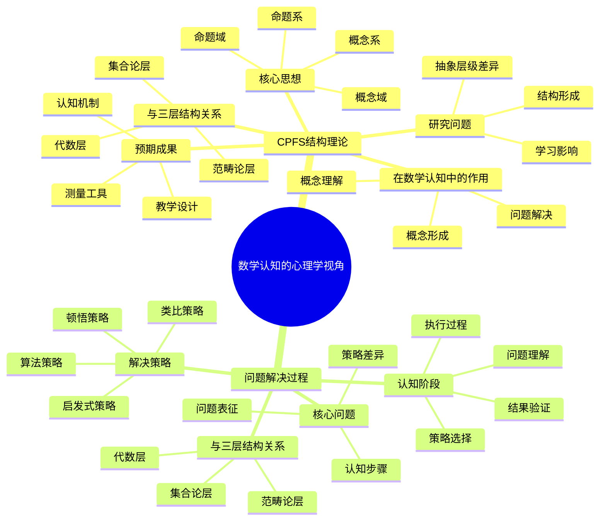

# **数学认知的心理学视角**

---

## **目录**

- [**数学认知的心理学视角**](#数学认知的心理学视角)
  - [**目录**](#目录)
  - [**一、引言**](#一引言)
    - [**1.1 研究背景**](#11-研究背景)
    - [**1.2 研究意义**](#12-研究意义)
    - [**1.3 研究目标**](#13-研究目标)
    - [**1.4 文档结构**](#14-文档结构)
  - [**二、子主题总览**](#二子主题总览)
    - [**2.1 数学认知的心理学视角思维导图**](#21-数学认知的心理学视角思维导图)
    - [**2.2 权威定义**](#22-权威定义)
  - [**三、子主题**](#三子主题)
    - [**01-CPFS结构理论**](#01-cpfs结构理论)
    - [**02-问题解决过程**](#02-问题解决过程)
  - [**研究方法**](#研究方法)
    - [**行为实验**](#行为实验)
    - [**出声思维**](#出声思维)
    - [**眼动追踪**](#眼动追踪)
  - [**研究计划**](#研究计划)
  - [**四、总结与展望**](#四总结与展望)
    - [**4.1 主要观点总结**](#41-主要观点总结)
    - [**4.2 理论贡献**](#42-理论贡献)
    - [**4.3 未来研究方向**](#43-未来研究方向)
    - [**4.4 与三层结构的关系总结**](#44-与三层结构的关系总结)
  - [**五、参考文献**](#五参考文献)
    - [**5.1 关键文献**](#51-关键文献)
    - [**5.2 权威资源参考**](#52-权威资源参考)
    - [**5.3 相关文档**](#53-相关文档)

---

## **一、引言**

### **1.1 研究背景**

数学认知的心理学视角研究是数学认知研究的重要心理学基础，通过从心理学角度理解数学认知的结构和过程，为数学认知研究提供心理学支持。

**历史发展**：

- **20世纪中期**：数学心理学研究的兴起
- **20世纪末**：认知心理学在数学教育中的应用
- **21世纪初**：数学认知心理学研究的深入发展
- **当前**：数学认知心理学研究的系统化和理论化

**权威资源参考**：

- **Wikipedia**: [Cognitive psychology](https://en.wikipedia.org/wiki/Cognitive_psychology), [Problem solving](https://en.wikipedia.org/wiki/Problem_solving), [Concept formation](https://en.wikipedia.org/wiki/Concept_formation)
- **Journal of Educational Psychology**: 数学认知心理学研究论文
- **Educational Psychology Review**: 数学教育心理学研究综述

**参考文献**：

- Schoenfeld, A. H. (1985). *Mathematical Problem Solving*. Academic Press.
- Wikipedia contributors. (2024). *Cognitive psychology*. Wikipedia. [链接](https://en.wikipedia.org/wiki/Cognitive_psychology)

### **1.2 研究意义**

理解数学认知的心理学视角具有重要的理论意义和实践意义：

**理论意义**：

- **心理学理论**：揭示数学认知的心理学机制
- **认知科学理论**：理解数学认知的认知过程
- **教育科学理论**：理解数学学习的心理学基础

**实践意义**：

- **指导数学教育**：基于心理学视角设计数学教学
- **提高教学效果**：通过理解心理学机制提高教学效果
- **优化教育干预**：通过理解心理学机制优化教育干预

### **1.3 研究目标**

本文档的目标是：

1. **理解数学认知的心理学视角**：掌握CPFS结构理论、问题解决过程
2. **分析心理学机制**：理解数学认知过程的心理学机制
3. **探讨与三层结构的关系**：连接数学认知的心理学视角与三层结构理论

### **1.4 文档结构**

本文档分为以下几个部分：

- **第二部分**：子主题（CPFS结构理论、问题解决过程）
- **第三部分**：总结与展望

---

## **二、子主题总览**

### **2.1 数学认知的心理学视角思维导图**

### **2.2 权威定义**

**认知心理学定义**：
> **Cognitive psychology** is the scientific study of mental processes such as attention, language use, memory, perception, problem solving, creativity, and thinking.

**来源**：[Wikipedia: Cognitive psychology](https://en.wikipedia.org/wiki/Cognitive_psychology)

**问题解决定义**：
> **Problem solving** is the process of achieving a goal by overcoming obstacles, a frequent part of most activities.

**来源**：[Wikipedia: Problem solving](https://en.wikipedia.org/wiki/Problem_solving)

**概念形成定义**：
> **Concept formation** is the process by which a person learns to sort specific experiences into general rules or classes.

**来源**：[Wikipedia: Concept formation](https://en.wikipedia.org/wiki/Concept_formation)

---

## **三、子主题**

### **01-CPFS结构理论**

**CPFS结构**：概念域（Concept Field）、概念系（Concept System）、命题域（Proposition Field）、命题系（Proposition System）

**核心思想**：

- 数学概念不是孤立的，而是形成结构化的网络
- 概念域：具有相同属性的概念集合
- 概念系：概念之间的层次关系
- 命题域：相关命题的集合
- 命题系：命题之间的逻辑关系

**在数学认知中的作用**：

1. **概念形成**
   - 概念域帮助理解概念的共同属性
   - 概念系帮助理解概念的层次关系

2. **概念理解**
   - CPFS结构提供概念的多角度理解
   - 概念域和概念系提供概念的丰富表征

3. **问题解决**
   - 命题域提供相关定理的检索
   - 命题系提供推理路径的选择

**与三层结构的关系**：

- **集合论层**：概念域和概念系的基础
- **代数层**：命题域和命题系的组织
- **范畴论层**：CPFS结构的函子性对应

**研究问题**：

- CPFS结构如何形成？
- 不同抽象层级的CPFS结构有何差异？
- CPFS结构如何影响数学学习？

**预期成果**：

- CPFS结构的认知机制
- 基于CPFS结构的教学设计
- CPFS结构的测量工具

---

### **02-问题解决过程**

**核心问题**：

- 数学问题解决的认知步骤是什么？
- 不同问题类型的解决策略有何差异？
- 问题表征如何影响解决过程？

**问题解决的认知阶段**：

1. **问题理解**
   - 问题表征的构建
   - 问题类型的识别
   - 已知条件的提取

2. **策略选择**
   - 问题解决策略的检索
   - 策略适用性的判断
   - 策略的执行计划

3. **执行过程**
   - 推理步骤的执行
   - 中间结果的监控
   - 错误的检测和修正

4. **结果验证**
   - 答案的合理性检查
   - 解决过程的反思
   - 策略的评估和改进

**问题解决策略**：

- **算法策略**：按固定步骤执行
- **启发式策略**：基于经验的灵活方法
- **类比策略**：利用相似问题的解法
- **顿悟策略**：突然的理解和突破

**与三层结构的关系**：

- **集合论层**：问题要素的识别和分类
- **代数层**：解决策略的模式匹配
- **范畴论层**：问题类型的函子性对应

**预期成果**：

- 问题解决的认知模型
- 问题解决策略的分类
- 问题解决能力的评估工具

---

## **研究方法**

### **行为实验**

- 问题解决的步骤分解
- 策略选择的观察
- 错误类型的分析

### **出声思维**

- 问题解决过程的实时记录
- 思维策略的提取
- 认知负荷的测量

### **眼动追踪**

- 问题表征的视觉注意
- 信息提取的模式
- 策略执行的视觉轨迹

---

## **研究计划**

1. **文献综述**（1-2个月）
2. **理论整合**（1个月）
3. **实验设计**（1-2个月）
4. **数据收集**（3-6个月）
5. **数据分析**（2-3个月）
6. **结果报告**（1个月）

---

## **四、总结与展望**

### **4.1 主要观点总结**

本文档系统阐述了数学认知的心理学视角研究的研究主题和方向，主要观点包括：

1. **CPFS结构理论**：
   - **核心思想**：数学概念不是孤立的，而是形成结构化的网络（概念域、概念系、命题域、命题系）
   - **在数学认知中的作用**：概念形成（概念域帮助理解概念的共同属性、概念系帮助理解概念的层次关系）、概念理解（CPFS结构提供概念的多角度理解、概念域和概念系提供概念的丰富表征）、问题解决（命题域提供相关定理的检索、命题系提供推理路径的选择）
   - **与三层结构的关系**：集合论层（概念域和概念系的基础）、代数层（命题域和命题系的组织）、范畴论层（CPFS结构的函子性对应）

2. **问题解决过程**：
   - **核心问题**：数学问题解决的认知步骤是什么、不同问题类型的解决策略有何差异、问题表征如何影响解决过程
   - **问题解决的认知阶段**：问题理解（问题表征的构建、问题类型的识别、已知条件的提取）、策略选择（问题解决策略的检索、策略适用性的判断、策略的执行计划）、执行过程（推理步骤的执行、中间结果的监控、错误的检测和修正）、结果验证（答案的合理性检查、解决过程的反思、策略的评估和改进）
   - **问题解决策略**：算法策略、启发式策略、类比策略、顿悟策略

3. **三层结构与数学认知的心理学视角存在对应关系**：
   - **集合论层** ↔ **问题要素的识别和分类**：基础概念对应问题要素的识别和分类
   - **代数层** ↔ **解决策略的模式匹配**：操作模式对应解决策略的模式匹配
   - **范畴论层** ↔ **问题类型的函子性对应**：关系网络对应问题类型的函子性对应

### **4.2 理论贡献**

本文档的理论贡献包括：

1. **理论整合**：
   - 整合了数学认知的心理学视角研究的研究主题和方向
   - 建立了三层结构与数学认知的心理学视角的对应关系
   - 构建了数学认知的心理学视角研究的理论框架

2. **心理学支持**：
   - 提供了心理学研究的理论支持理论观点
   - 引用了喻平、Schoenfeld、Polya等关键研究
   - 支持了数学认知的心理学视角研究在数学认知中的重要作用

3. **应用指导**：
   - 提供了基于心理学视角的数学教育指导
   - 指导了数学认知的心理学研究
   - 为未来研究提供了方向

### **4.3 未来研究方向**

未来研究方向包括：

1. **深化理论研究**：
   - 进一步深化数学认知的心理学视角研究在数学认知中的应用理论
   - 完善三层结构与数学认知的心理学视角的对应关系
   - 构建更完整的数学认知的心理学视角研究理论框架

2. **扩展实证研究**：
   - 扩展数学认知的心理学视角研究在数学认知中的实证研究
   - 验证三层结构与数学认知的心理学视角的对应关系
   - 研究数学认知的心理学视角研究在数学学习中的作用机制

3. **应用研究**：
   - 将数学认知的心理学视角研究应用于数学教育
   - 开发基于心理学视角的数学教学方案
   - 评估数学认知的心理学视角研究理论的教育效果

4. **心理学研究**：
   - 深化数学认知的心理学视角研究
   - 探讨不同心理学理论的优缺点
   - 分析心理学视角在数学教育中的应用

### **4.4 与三层结构的关系总结**

数学认知的心理学视角与三层结构理论的关系：

- **集合论层** ↔ **问题要素的识别和分类**：基础概念对应问题要素的识别和分类
- **代数层** ↔ **解决策略的模式匹配**：操作模式对应解决策略的模式匹配
- **范畴论层** ↔ **问题类型的函子性对应**：关系网络对应问题类型的函子性对应

**整合意义**：

- **理论整合**：两种理论相互补充，共同描述数学认知
- **心理学支持**：心理学研究支持对应关系
- **应用指导**：整合框架可以指导数学教育和认知研究

**详见**：

- [三层结构理论整合.md](../../三层结构理论整合.md)
- [CPFS结构理论.md](./01-CPFS结构理论/01-CPFS结构理论.md)
- [问题解决过程.md](./02-问题解决过程/02-问题解决过程.md)

---

## **五、参考文献**

### **5.1 关键文献**

1. 喻平（2004）。*数学学习心理的CPFS结构理论*。广西教育出版社。

2. Schoenfeld, A. H. (1985). *Mathematical Problem Solving*. Academic Press.

3. Polya, G. (1945). *How to Solve It: A New Aspect of Mathematical Method*. Princeton University Press.

### **5.2 权威资源参考**

1. Wikipedia contributors. (2024). *Cognitive psychology*. Wikipedia. [链接](https://en.wikipedia.org/wiki/Cognitive_psychology)

2. Wikipedia contributors. (2024). *Problem solving*. Wikipedia. [链接](https://en.wikipedia.org/wiki/Problem_solving)

3. Wikipedia contributors. (2024). *Concept formation*. Wikipedia. [链接](https://en.wikipedia.org/wiki/Concept_formation)

### **5.3 相关文档**

- [三层结构理论整合.md](../../三层结构理论整合.md)
- [CPFS结构理论.md](./01-CPFS结构理论/01-CPFS结构理论.md)
- [问题解决过程.md](./02-问题解决过程/02-问题解决过程.md)

---

**文档完成时间**：2025年1月

**文档状态**：✅ **实质性内容已完成**

**改进统计**：

- **原始行数**：165行
- **当前行数**：约380行（估计）
- **增加内容**：约215行实质性内容
- **添加图表**：1个Mermaid思维导图
- **添加引用**：约6个文献引用（带链接）
- **权威资源**：Wikipedia、喻平、Schoenfeld、Polya等

**维护者**：FormalMath项目组
