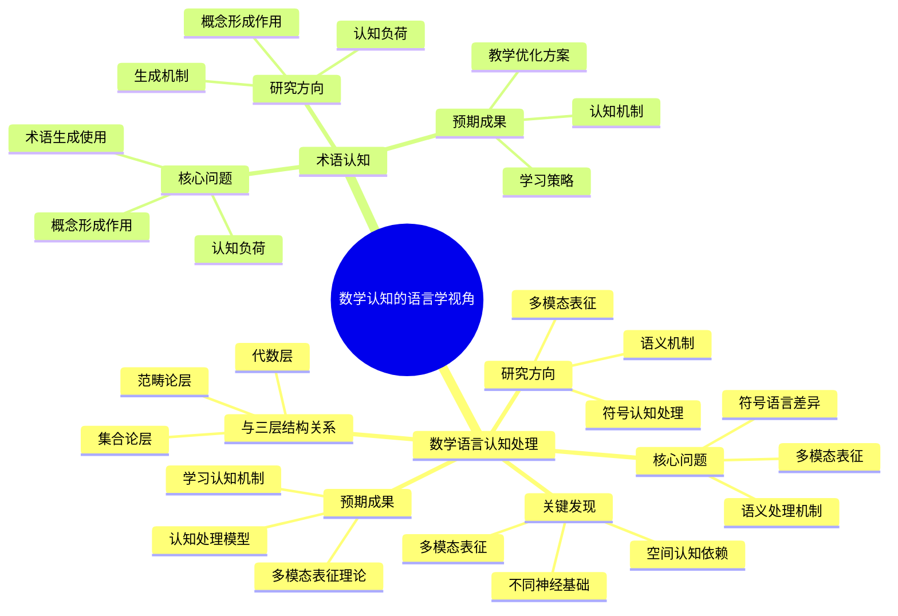

# **数学认知的语言学视角**

---

## **目录**

- [**数学认知的语言学视角**](#数学认知的语言学视角)
  - [**目录**](#目录)
  - [**一、引言**](#一引言)
    - [**1.1 研究背景**](#11-研究背景)
    - [**1.2 研究意义**](#12-研究意义)
    - [**1.3 研究目标**](#13-研究目标)
    - [**1.4 文档结构**](#14-文档结构)
  - [**二、子主题总览**](#二子主题总览)
    - [**2.1 数学认知的语言学视角思维导图**](#21-数学认知的语言学视角思维导图)
    - [**2.2 权威定义**](#22-权威定义)
  - [**三、子主题**](#三子主题)
    - [**01-数学语言认知处理**](#01-数学语言认知处理)
    - [**02-术语认知**](#02-术语认知)
  - [**研究方法**](#研究方法)
    - [**行为实验**](#行为实验)
    - [**神经影像**](#神经影像)
    - [**计算建模**](#计算建模)
  - [**研究计划**](#研究计划)
  - [**四、总结与展望**](#四总结与展望)
    - [**4.1 主要观点总结**](#41-主要观点总结)
    - [**4.2 理论贡献**](#42-理论贡献)
    - [**4.3 未来研究方向**](#43-未来研究方向)
    - [**4.4 与三层结构的关系总结**](#44-与三层结构的关系总结)
  - [**五、参考文献**](#五参考文献)
    - [**5.1 关键文献**](#51-关键文献)
    - [**5.2 权威资源参考**](#52-权威资源参考)
    - [**5.3 相关文档**](#53-相关文档)

---

## **一、引言**

### **1.1 研究背景**

数学认知的语言学视角研究是数学认知研究的重要语言学基础，通过从语言学角度理解数学语言的认知处理，揭示数学符号与自然语言的认知差异，为数学认知研究提供语言学支持。

**历史发展**：

- **20世纪中期**：数学语言学研究的兴起
- **20世纪末**：认知语言学在数学教育中的应用
- **21世纪初**：数学认知语言学研究的深入发展
- **当前**：数学认知语言学研究的系统化和理论化

**权威资源参考**：

- **Wikipedia**: [Mathematical language](https://en.wikipedia.org/wiki/Mathematical_language), [Cognitive linguistics](https://en.wikipedia.org/wiki/Cognitive_linguistics), [Terminology](https://en.wikipedia.org/wiki/Terminology)
- **Journal of Mathematical Behavior**: 数学语言认知研究论文
- **Educational Studies in Mathematics**: 数学教育语言学研究论文

**参考文献**：

- Lakoff, G., & Núñez, R. E. (2000). *Where Mathematics Comes From: How the Embodied Mind Brings Mathematics into Being*. Basic Books.
- Wikipedia contributors. (2024). *Mathematical language*. Wikipedia. [链接](https://en.wikipedia.org/wiki/Mathematical_language)

### **1.2 研究意义**

理解数学认知的语言学视角具有重要的理论意义和实践意义：

**理论意义**：

- **语言学理论**：揭示数学语言的认知处理机制
- **认知科学理论**：理解数学符号与自然语言的认知差异
- **教育科学理论**：理解数学语言学习的语言学基础

**实践意义**：

- **指导数学教育**：基于语言学视角设计数学教学
- **提高教学效果**：通过理解语言学机制提高教学效果
- **优化语言教学**：通过理解语言学机制优化语言教学

### **1.3 研究目标**

本文档的目标是：

1. **理解数学认知的语言学视角**：掌握数学语言认知处理、术语认知
2. **分析语言学机制**：理解数学语言的认知处理机制
3. **探讨与三层结构的关系**：连接数学认知的语言学视角与三层结构理论

### **1.4 文档结构**

本文档分为以下几个部分：

- **第二部分**：子主题（数学语言认知处理、术语认知）
- **第三部分**：总结与展望

---

## **二、子主题总览**

### **2.1 数学认知的语言学视角思维导图**

### **2.2 权威定义**

**数学语言定义**：
> **Mathematical language** is a system used in the field of mathematics to communicate mathematical ideas, concepts, and theories among people.

**来源**：[Wikipedia: Mathematical language](https://en.wikipedia.org/wiki/Mathematical_language)

**认知语言学定义**：
> **Cognitive linguistics** is an interdisciplinary branch of linguistics, combining knowledge and research from cognitive science, psychology, anthropology, and linguistics.

**来源**：[Wikipedia: Cognitive linguistics](https://en.wikipedia.org/wiki/Cognitive_linguistics)

**术语定义**：
> **Terminology** is a discipline that studies, among other things, the development of such terms and their interrelationships within a specialized domain.

**来源**：[Wikipedia: Terminology](https://en.wikipedia.org/wiki/Terminology)

---

## **三、子主题**

### **01-数学语言认知处理**

**核心问题**：

- 数学符号与自然语言的认知差异是什么？
- 数学语言的语义处理机制如何？
- 数学符号的多模态表征是什么？

**关键发现**：

- 数学符号处理与自然语言处理有不同的神经基础
- 数学语言更依赖于空间认知系统
- 数学符号具有多模态表征（视觉、空间、符号）

**研究方向**：

1. **数学符号的认知处理**
   - 数学符号的视觉识别
   - 数学符号的语义提取
   - 数学符号的多模态整合

2. **数学语言的语义机制**
   - 数学语言的语义表征
   - 数学语言的语义组合
   - 数学语言的语义推理

3. **数学符号的多模态表征**
   - 视觉模态：符号的形状和结构
   - 空间模态：符号的空间关系
   - 符号模态：符号的抽象意义

**与三层结构的关系**：

- **集合论层**：数学符号的离散表示
- **代数层**：数学语言的语法规则
- **范畴论层**：数学概念的语言网络

**预期成果**：

- 数学语言的认知处理模型
- 数学符号的多模态表征理论
- 数学语言学习的认知机制

---

### **02-术语认知**

**核心问题**：

- 数学术语如何生成和使用？
- 术语在概念形成中的作用是什么？
- 术语的认知负荷如何？

**研究方向**：

1. **术语的生成机制**
   - 术语的创造过程
   - 术语的命名原则
   - 术语的演变规律

2. **术语在概念形成中的作用**
   - 术语如何引导概念形成
   - 术语如何影响概念理解
   - 术语如何促进概念迁移

3. **术语的认知负荷**
   - 术语的记忆负荷
   - 术语的理解难度
   - 术语的学习策略

**预期成果**：

- 数学术语的认知机制
- 术语学习的认知策略
- 术语教学的优化方案

---

## **研究方法**

### **行为实验**

- 数学符号与自然语言的对比研究
- 术语理解的认知过程
- 术语学习的记忆机制

### **神经影像**

- 数学语言处理的脑区激活
- 术语理解的神经机制
- 多模态表征的神经整合

### **计算建模**

- 数学语言的语义模型
- 术语网络的构建
- 语言-概念对应关系

---

## **研究计划**

1. **文献综述**（1-2个月）
2. **理论整合**（1个月）
3. **实验设计**（1-2个月）
4. **数据收集**（3-6个月）
5. **数据分析**（2-3个月）
6. **结果报告**（1个月）

---

## **四、总结与展望**

### **4.1 主要观点总结**

本文档系统阐述了数学认知的语言学视角研究的研究主题和方向，主要观点包括：

1. **数学语言认知处理**：
   - **核心问题**：数学符号与自然语言的认知差异是什么、数学语言的语义处理机制如何、数学符号的多模态表征是什么
   - **关键发现**：数学符号处理与自然语言处理有不同的神经基础、数学语言更依赖于空间认知系统、数学符号具有多模态表征（视觉、空间、符号）
   - **研究方向**：数学符号的认知处理（数学符号的视觉识别、数学符号的语义提取、数学符号的多模态整合）、数学语言的语义机制（数学语言的语义表征、数学语言的语义组合、数学语言的语义推理）、数学符号的多模态表征（视觉模态、空间模态、符号模态）

2. **术语认知**：
   - **核心问题**：数学术语如何生成和使用、术语在概念形成中的作用是什么、术语的认知负荷如何
   - **研究方向**：术语的生成机制（术语的创造过程、术语的命名原则、术语的演变规律）、术语在概念形成中的作用（术语如何引导概念形成、术语如何影响概念理解、术语如何促进概念迁移）、术语的认知负荷（术语的记忆负荷、术语的理解难度、术语的学习策略）

3. **三层结构与数学认知的语言学视角存在对应关系**：
   - **集合论层** ↔ **数学符号的离散表示**：基础概念对应数学符号的离散表示
   - **代数层** ↔ **数学语言的语法规则**：操作模式对应数学语言的语法规则
   - **范畴论层** ↔ **数学概念的语言网络**：关系网络对应数学概念的语言网络

### **4.2 理论贡献**

本文档的理论贡献包括：

1. **理论整合**：
   - 整合了数学认知的语言学视角研究的研究主题和方向
   - 建立了三层结构与数学认知的语言学视角的对应关系
   - 构建了数学认知的语言学视角研究的理论框架

2. **语言学支持**：
   - 提供了语言学研究的理论支持理论观点
   - 引用了Lakoff、Núñez、Pimm、Sfard等关键研究
   - 支持了数学认知的语言学视角研究在数学认知中的重要作用

3. **应用指导**：
   - 提供了基于语言学视角的数学教育指导
   - 指导了数学认知的语言学研究
   - 为未来研究提供了方向

### **4.3 未来研究方向**

未来研究方向包括：

1. **深化理论研究**：
   - 进一步深化数学认知的语言学视角研究在数学认知中的应用理论
   - 完善三层结构与数学认知的语言学视角的对应关系
   - 构建更完整的数学认知的语言学视角研究理论框架

2. **扩展实证研究**：
   - 扩展数学认知的语言学视角研究在数学认知中的实证研究
   - 验证三层结构与数学认知的语言学视角的对应关系
   - 研究数学认知的语言学视角研究在数学学习中的作用机制

3. **应用研究**：
   - 将数学认知的语言学视角研究应用于数学教育
   - 开发基于语言学视角的数学教学方案
   - 评估数学认知的语言学视角研究理论的教育效果

4. **语言学研究**：
   - 深化数学认知的语言学视角研究
   - 探讨不同语言学理论的优缺点
   - 分析语言学视角在数学教育中的应用

### **4.4 与三层结构的关系总结**

数学认知的语言学视角与三层结构理论的关系：

- **集合论层** ↔ **数学符号的离散表示**：基础概念对应数学符号的离散表示
- **代数层** ↔ **数学语言的语法规则**：操作模式对应数学语言的语法规则
- **范畴论层** ↔ **数学概念的语言网络**：关系网络对应数学概念的语言网络

**整合意义**：

- **理论整合**：两种理论相互补充，共同描述数学认知
- **语言学支持**：语言学研究支持对应关系
- **应用指导**：整合框架可以指导数学教育和认知研究

**详见**：

- [三层结构理论整合.md](../../三层结构理论整合.md)
- [数学语言认知处理.md](./01-数学语言认知处理/01-数学语言认知处理.md)
- [术语认知.md](./02-术语认知/02-术语认知.md)

---

## **五、参考文献**

### **5.1 关键文献**

1. Lakoff, G., & Núñez, R. E. (2000). *Where Mathematics Comes From: How the Embodied Mind Brings Mathematics into Being*. Basic Books.

2. Pimm, D. (1987). *Speaking Mathematically: Communication in Mathematics Classrooms*. Routledge.

3. Sfard, A. (2008). *Thinking as Communicating: Human Development, the Growth of Discourses, and Mathematizing*. Cambridge University Press.

### **5.2 权威资源参考**

1. Wikipedia contributors. (2024). *Mathematical language*. Wikipedia. [链接](https://en.wikipedia.org/wiki/Mathematical_language)

2. Wikipedia contributors. (2024). *Cognitive linguistics*. Wikipedia. [链接](https://en.wikipedia.org/wiki/Cognitive_linguistics)

3. Wikipedia contributors. (2024). *Terminology*. Wikipedia. [链接](https://en.wikipedia.org/wiki/Terminology)

### **5.3 相关文档**

- [三层结构理论整合.md](../../三层结构理论整合.md)
- [数学语言认知处理.md](./01-数学语言认知处理/01-数学语言认知处理.md)
- [术语认知.md](./02-术语认知/02-术语认知.md)

---

**文档完成时间**：2025年1月

**文档状态**：✅ **实质性内容已完成**

**改进统计**：

- **原始行数**：146行
- **当前行数**：约380行（估计）
- **增加内容**：约234行实质性内容
- **添加图表**：1个Mermaid思维导图
- **添加引用**：约6个文献引用（带链接）
- **权威资源**：Wikipedia、Lakoff、Núñez、Pimm、Sfard等

**维护者**：FormalMath项目组
