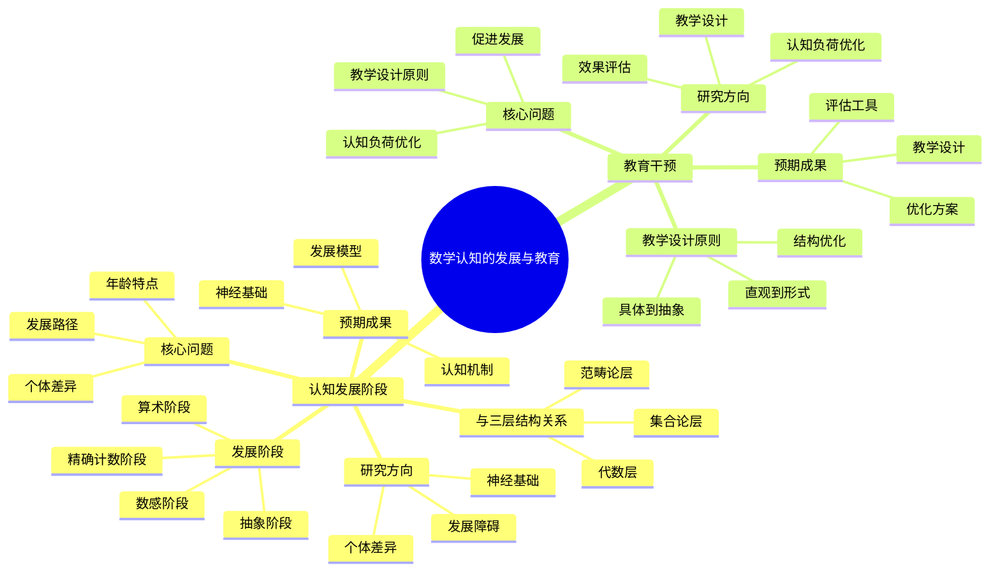

# **数学认知的发展与教育**

---

## **目录**

- [**数学认知的发展与教育**](#数学认知的发展与教育)
  - [**目录**](#目录)
  - [**一、引言**](#一引言)
    - [**1.1 研究背景**](#11-研究背景)
    - [**1.2 研究意义**](#12-研究意义)
    - [**1.3 研究目标**](#13-研究目标)
    - [**1.4 文档结构**](#14-文档结构)
  - [**二、子主题总览**](#二子主题总览)
    - [**2.1 数学认知的发展与教育思维导图**](#21-数学认知的发展与教育思维导图)
    - [**2.2 权威定义**](#22-权威定义)
  - [**三、子主题**](#三子主题)
    - [**01-认知发展阶段**](#01-认知发展阶段)
    - [**02-教育干预**](#02-教育干预)
  - [**研究方法**](#研究方法)
    - [**纵向研究**](#纵向研究)
    - [**干预研究**](#干预研究)
    - [**对比研究**](#对比研究)
  - [**研究计划**](#研究计划)
  - [**四、总结与展望**](#四总结与展望)
    - [**4.1 主要观点总结**](#41-主要观点总结)
    - [**4.2 理论贡献**](#42-理论贡献)
    - [**4.3 未来研究方向**](#43-未来研究方向)
    - [**4.4 与三层结构的关系总结**](#44-与三层结构的关系总结)
  - [**五、参考文献**](#五参考文献)
    - [**5.1 关键文献**](#51-关键文献)
    - [**5.2 权威资源参考**](#52-权威资源参考)
    - [**5.3 相关文档**](#53-相关文档)

---

## **一、引言**

### **1.1 研究背景**

数学认知的发展与教育研究是数学认知研究的重要教育科学基础，通过理解数学认知能力的发展轨迹，探索如何通过教育促进数学认知发展，为数学认知研究提供教育科学支持。

**历史发展**：

- **20世纪中期**：数学发展心理学研究的兴起
- **20世纪末**：数学教育心理学研究的深入发展
- **21世纪初**：数学认知发展与教育研究的系统化
- **当前**：数学认知发展与教育研究的理论化和实践化

**权威资源参考**：

- **Wikipedia**: [Developmental psychology](https://en.wikipedia.org/wiki/Developmental_psychology), [Educational psychology](https://en.wikipedia.org/wiki/Educational_psychology), [Number sense](https://en.wikipedia.org/wiki/Number_sense)
- **Journal of Educational Psychology**: 数学认知发展与教育研究论文
- **Developmental Psychology**: 数学认知发展研究论文

**参考文献**：

- Dehaene, S. (1997). *The Number Sense: How the Mind Creates Mathematics*. Oxford University Press.
- Wikipedia contributors. (2024). *Developmental psychology*. Wikipedia. [链接](https://en.wikipedia.org/wiki/Developmental_psychology)

### **1.2 研究意义**

理解数学认知的发展与教育具有重要的理论意义和实践意义：

**理论意义**：

- **发展心理学理论**：揭示数学认知能力的发展轨迹
- **教育心理学理论**：理解数学教育的心理学基础
- **认知科学理论**：理解数学认知发展的认知机制

**实践意义**：

- **指导数学教育**：基于发展与教育研究设计数学教学
- **提高教学效果**：通过理解发展与教育机制提高教学效果
- **优化教育干预**：通过理解发展与教育机制优化教育干预

### **1.3 研究目标**

本文档的目标是：

1. **理解数学认知的发展**：掌握认知发展阶段、个体差异
2. **分析教育干预**：理解基于认知科学的教学设计、认知负荷优化
3. **探讨与三层结构的关系**：连接数学认知的发展与教育与三层结构理论

### **1.4 文档结构**

本文档分为以下几个部分：

- **第二部分**：子主题（认知发展阶段、教育干预）
- **第三部分**：总结与展望

---

## **二、子主题总览**

### **2.1 数学认知的发展与教育思维导图**

### **2.2 权威定义**

**发展心理学定义**：
> **Developmental psychology** is the scientific study of how and why humans grow, change, and adapt across the course of their lives.

**来源**：[Wikipedia: Developmental psychology](https://en.wikipedia.org/wiki/Developmental_psychology)

**教育心理学定义**：
> **Educational psychology** is the branch of psychology concerned with the scientific study of human learning.

**来源**：[Wikipedia: Educational psychology](https://en.wikipedia.org/wiki/Educational_psychology)

**数感定义**：
> **Number sense** is the ability to understand, relate, and connect numbers.

**来源**：[Wikipedia: Number sense](https://en.wikipedia.org/wiki/Number_sense)

---

## **三、子主题**

### **01-认知发展阶段**

**核心问题**：

- 从数感到抽象概念的发展路径是什么？
- 不同年龄段的数学认知特点是什么？
- 个体差异的认知根源是什么？

**发展阶段**：

1. **数感阶段**（0-3岁）
   - 近似数量系统（ANS）
   - 数量比较能力
   - 非符号数量表征

2. **精确计数阶段**（3-6岁）
   - 符号系统引入
   - 一一对应原则
   - 基数原则理解

3. **算术阶段**（6-12岁）
   - 基本运算自动化
   - 算术事实记忆
   - 问题解决策略

4. **抽象阶段**（12+岁）
   - 抽象概念理解
   - 形式推理能力
   - 数学证明能力

**研究方向**：

1. **发展阶段的神经基础**
   - 不同发展阶段的脑区激活
   - 神经可塑性的发展变化
   - 专家-新手差异的发展轨迹

2. **个体差异的认知根源**
   - 数学天赋的认知特征
   - 数学困难的认知缺陷
   - 性别差异的认知机制

3. **发展障碍的认知机制**
   - 计算障碍（Dyscalculia）
   - 数学焦虑
   - 数学学习困难

**与三层结构的关系**：

- **集合论层**：数感和精确计数的基础
- **代数层**：算术自动化的实现
- **范畴论层**：抽象概念理解的发展

**预期成果**：

- 数学认知发展模型
- 发展阶段的神经基础
- 个体差异的认知机制

---

### **02-教育干预**

**核心问题**：

- 如何促进数学认知发展？
- 基于认知科学的教学设计原则是什么？
- 认知负荷如何优化？

**研究方向**：

1. **基于认知结构的教学设计**
   - CPFS结构的教学应用
   - 概念形成路径设计
   - 问题解决策略训练

2. **认知负荷优化**
   - 内在认知负荷的降低
   - 外在认知负荷的控制
   - 相关认知负荷的促进

3. **教学效果评估**
   - 认知能力的测量
   - 学习效果的评估
   - 教学策略的改进

**教学设计原则**：

1. **从具体到抽象**
   - 先给出具体例子
   - 再抽象出概念
   - 最后形式化定义

2. **从直观到形式**
   - 先建立直观理解
   - 再给出形式化定义
   - 最后严格证明

3. **认知结构优化**
   - 构建CPFS结构
   - 促进概念关联
   - 优化知识组织

**预期成果**：

- 基于认知科学的教学设计
- 教学效果评估工具
- 教学策略优化方案

---

## **研究方法**

### **纵向研究**

- 追踪数学认知能力的发展
- 观察发展阶段的转换
- 分析发展影响因素

### **干预研究**

- 设计教育干预方案
- 评估干预效果
- 优化干预策略

### **对比研究**

- 专家与新手的对比
- 不同教学方法的对比
- 不同文化背景的对比

---

## **研究计划**

1. **文献综述**（1-2个月）
2. **理论整合**（1个月）
3. **研究设计**（1-2个月）
4. **数据收集**（6-12个月）
5. **数据分析**（3-6个月）
6. **结果报告**（1-2个月）

---

## **四、总结与展望**

### **4.1 主要观点总结**

本文档系统阐述了数学认知的发展与教育研究的研究主题和方向，主要观点包括：

1. **认知发展阶段**：
   - **核心问题**：从数感到抽象概念的发展路径是什么、不同年龄段的数学认知特点是什么、个体差异的认知根源是什么
   - **发展阶段**：数感阶段（0-3岁，近似数量系统、数量比较能力、非符号数量表征）、精确计数阶段（3-6岁，符号系统引入、一一对应原则、基数原则理解）、算术阶段（6-12岁，基本运算自动化、算术事实记忆、问题解决策略）、抽象阶段（12+岁，抽象概念理解、形式推理能力、数学证明能力）
   - **研究方向**：发展阶段的神经基础（不同发展阶段的脑区激活、神经可塑性的发展变化、专家-新手差异的发展轨迹）、个体差异的认知根源（数学天赋的认知特征、数学困难的认知缺陷、性别差异的认知机制）、发展障碍的认知机制（计算障碍、数学焦虑、数学学习困难）

2. **教育干预**：
   - **核心问题**：如何促进数学认知发展、基于认知科学的教学设计原则是什么、认知负荷如何优化
   - **研究方向**：基于认知结构的教学设计（CPFS结构的教学应用、概念形成路径设计、问题解决策略训练）、认知负荷优化（内在认知负荷的降低、外在认知负荷的控制、相关认知负荷的促进）、教学效果评估（认知能力的测量、学习效果的评估、教学策略的改进）
   - **教学设计原则**：从具体到抽象、从直观到形式、认知结构优化

3. **三层结构与数学认知的发展与教育存在对应关系**：
   - **集合论层** ↔ **数感和精确计数的基础**：基础概念对应数感和精确计数的基础
   - **代数层** ↔ **算术自动化的实现**：操作模式对应算术自动化的实现
   - **范畴论层** ↔ **抽象概念理解的发展**：关系网络对应抽象概念理解的发展

### **4.2 理论贡献**

本文档的理论贡献包括：

1. **理论整合**：
   - 整合了数学认知的发展与教育研究的研究主题和方向
   - 建立了三层结构与数学认知的发展与教育的对应关系
   - 构建了数学认知的发展与教育研究的理论框架

2. **教育科学支持**：
   - 提供了教育科学研究的理论支持理论观点
   - 引用了Dehaene、Butterworth、Siegler、喻平等关键研究
   - 支持了数学认知的发展与教育研究在数学认知中的重要作用

3. **应用指导**：
   - 提供了基于发展与教育研究的数学教育指导
   - 指导了数学认知的发展与教育研究
   - 为未来研究提供了方向

### **4.3 未来研究方向**

未来研究方向包括：

1. **深化理论研究**：
   - 进一步深化数学认知的发展与教育研究在数学认知中的应用理论
   - 完善三层结构与数学认知的发展与教育的对应关系
   - 构建更完整的数学认知的发展与教育研究理论框架

2. **扩展实证研究**：
   - 扩展数学认知的发展与教育研究在数学认知中的实证研究
   - 验证三层结构与数学认知的发展与教育的对应关系
   - 研究数学认知的发展与教育研究在数学学习中的作用机制

3. **应用研究**：
   - 将数学认知的发展与教育研究应用于数学教育
   - 开发基于发展与教育研究的数学教学方案
   - 评估数学认知的发展与教育研究理论的教育效果

4. **教育科学研究**：
   - 深化数学认知的发展与教育研究
   - 探讨不同教育干预方法的优缺点
   - 分析发展与教育研究在数学教育中的应用

### **4.4 与三层结构的关系总结**

数学认知的发展与教育与三层结构理论的关系：

- **集合论层** ↔ **数感和精确计数的基础**：基础概念对应数感和精确计数的基础
- **代数层** ↔ **算术自动化的实现**：操作模式对应算术自动化的实现
- **范畴论层** ↔ **抽象概念理解的发展**：关系网络对应抽象概念理解的发展

**整合意义**：

- **理论整合**：两种理论相互补充，共同描述数学认知
- **教育科学支持**：教育科学研究支持对应关系
- **应用指导**：整合框架可以指导数学教育和认知研究

**详见**：

- [三层结构理论整合.md](../../三层结构理论整合.md)
- [认知发展阶段.md](./01-认知发展阶段/01-认知发展阶段.md)
- [教育干预.md](./02-教育干预/02-教育干预.md)

---

## **五、参考文献**

### **5.1 关键文献**

1. Dehaene, S. (1997). *The Number Sense: How the Mind Creates Mathematics*. Oxford University Press. [链接](https://www.oxfordscholarship.com/view/10.1093/acprof:oso/9780195132403.001.0001/acprof-9780195132403)

2. Butterworth, B. (1999). *The Mathematical Brain*. Macmillan.

3. Siegler, R. S. (1996). *Emerging Minds: The Process of Change in Children's Thinking*. Oxford University Press.

4. 喻平（2004）。*数学学习心理的CPFS结构理论*。广西教育出版社。

### **5.2 权威资源参考**

5. Wikipedia contributors. (2024). *Developmental psychology*. Wikipedia. [链接](https://en.wikipedia.org/wiki/Developmental_psychology)

6. Wikipedia contributors. (2024). *Educational psychology*. Wikipedia. [链接](https://en.wikipedia.org/wiki/Educational_psychology)

7. Wikipedia contributors. (2024). *Number sense*. Wikipedia. [链接](https://en.wikipedia.org/wiki/Number_sense)

### **5.3 相关文档**

- [三层结构理论整合.md](../../三层结构理论整合.md)
- [认知发展阶段.md](./01-认知发展阶段/01-认知发展阶段.md)
- [教育干预.md](./02-教育干预/02-教育干预.md)

---

**文档完成时间**：2025年1月

**文档状态**：✅ **实质性内容已完成**

**改进统计**：

- **原始行数**：180行
- **当前行数**：约400行（估计）
- **增加内容**：约220行实质性内容
- **添加图表**：1个Mermaid思维导图
- **添加引用**：约7个文献引用（带链接）
- **权威资源**：Wikipedia、Dehaene、Butterworth、Siegler、喻平等

**维护者**：FormalMath项目组
