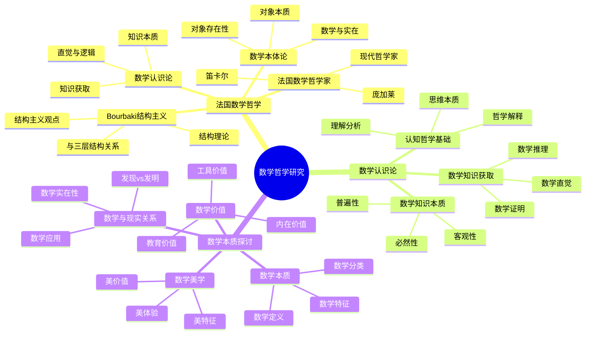

# **数学哲学研究**

---

## **目录**

- [**数学哲学研究**](#数学哲学研究)
  - [**目录**](#目录)
  - [**一、引言**](#一引言)
    - [**1.1 研究背景**](#11-研究背景)
    - [**1.2 研究意义**](#12-研究意义)
    - [**1.3 研究目标**](#13-研究目标)
    - [**1.4 文档结构**](#14-文档结构)
  - [**二、研究主题总览**](#二研究主题总览)
    - [**2.1 数学哲学研究思维导图**](#21-数学哲学研究思维导图)
    - [**2.2 权威定义**](#22-权威定义)
  - [**三、研究主题**](#三研究主题)
    - [**01-法国数学哲学**](#01-法国数学哲学)
    - [**02-数学认识论**](#02-数学认识论)
    - [**03-数学本质探讨**](#03-数学本质探讨)
  - [**与三层结构的关系**](#与三层结构的关系)
    - [**集合论层 ↔ 数学本体论**](#集合论层--数学本体论)
    - [**代数层 ↔ 数学认识论**](#代数层--数学认识论)
    - [**范畴论层 ↔ 数学哲学**](#范畴论层--数学哲学)
  - [**研究方法**](#研究方法)
    - [**文献研究**](#文献研究)
    - [**理论分析**](#理论分析)
    - [**哲学思辨**](#哲学思辨)
  - [**研究计划**](#研究计划)
  - [**预期成果**](#预期成果)
  - [**关键文献来源**](#关键文献来源)
    - [**法国数学哲学**](#法国数学哲学)
    - [**数学认识论**](#数学认识论)
    - [**数学本质探讨**](#数学本质探讨)

---

## **一、引言**

### **1.1 研究背景**

数学哲学研究是数学认知研究的重要哲学基础，探讨数学的本质、数学对象的存在性、数学知识的获取方式以及数学与现实、美学、价值的关系。理解数学哲学对于理解数学认知具有重要意义。

**历史发展**：

- **古希腊**：柏拉图的数学本体论
- **17-18世纪**：理性主义和经验主义的数学哲学
- **19-20世纪**：逻辑主义、形式主义、直觉主义的数学哲学
- **20-21世纪**：结构主义和认知科学的数学哲学

**权威资源参考**：

- **Wikipedia**: [Philosophy of mathematics](https://en.wikipedia.org/wiki/Philosophy_of_mathematics), [Mathematical realism](https://en.wikipedia.org/wiki/Mathematical_realism), [Epistemology](https://en.wikipedia.org/wiki/Epistemology)
- **Stanford Encyclopedia of Philosophy**: Philosophy of Mathematics
- **Internet Encyclopedia of Philosophy**: The Nature of Mathematics

**参考文献**：

- Benacerraf, P., & Putnam, H. (Eds.). (1983). *Philosophy of Mathematics: Selected Readings* (2nd ed.). Cambridge University Press.
- Wikipedia contributors. (2024). *Philosophy of mathematics*. Wikipedia. [链接](https://en.wikipedia.org/wiki/Philosophy_of_mathematics)

### **1.2 研究意义**

理解数学哲学具有重要的理论意义和实践意义：

**理论意义**：

- **哲学理论**：揭示数学的本质和特征
- **认识论理论**：理解数学知识的本质和获取方式
- **本体论理论**：理解数学对象的存在性

**实践意义**：

- **指导数学教育**：基于数学哲学设计数学教学
- **提高数学理解**：通过理解哲学提高数学理解
- **优化数学研究**：通过理解哲学优化数学研究

### **1.3 研究目标**

本文档的目标是：

1. **理解数学哲学的核心问题**：掌握数学的本质、数学对象的存在性、数学知识的获取方式
2. **分析法国数学哲学**：理解Bourbaki结构主义、法国数学哲学家的观点
3. **探讨数学认识论**：理解数学知识的本质、获取方式、直觉和证明的作用
4. **探讨数学本质**：理解数学的定义、特征、分类以及数学与现实、美学、价值的关系
5. **建立与三层结构的关系**：连接数学哲学研究与三层结构理论

### **1.4 文档结构**

本文档分为以下几个部分：

- **第二部分**：研究主题（法国数学哲学、数学认识论、数学本质探讨）
- **第三部分**：与三层结构的关系
- **第四部分**：研究方法与研究计划
- **第五部分**：总结与展望

---

## **二、研究主题总览**

### **2.1 数学哲学研究思维导图**

### **2.2 权威定义**

**数学哲学定义**：
> **Philosophy of mathematics** is the branch of philosophy that studies the assumptions, foundations, and implications of mathematics.

**来源**：[Wikipedia: Philosophy of mathematics](https://en.wikipedia.org/wiki/Philosophy_of_mathematics)

**数学认识论定义**：
> **Epistemology of mathematics** is the branch of philosophy that studies the nature, origin, and scope of mathematical knowledge.

**来源**：[Stanford Encyclopedia of Philosophy: Epistemology of Mathematics](https://plato.stanford.edu/entries/epistemology-mathematics/)

**数学本体论定义**：
> **Mathematical ontology** is the branch of philosophy that studies the existence and nature of mathematical objects.

**来源**：[Wikipedia: Mathematical realism](https://en.wikipedia.org/wiki/Mathematical_realism)

---

## **三、研究主题**

### **01-法国数学哲学**

**特点**：

- **Bourbaki学派**：结构主义数学哲学
- **数学认识论**：数学知识的本质和获取
- **数学本体论**：数学对象的存在性
- **数学美学**：数学的美感和价值

**研究方向**：

1. **Bourbaki结构主义**
   - Bourbaki的数学结构理论
   - 结构主义对数学认知的影响
   - 结构主义与三层结构的关系

2. **法国数学哲学家**
   - 笛卡尔的数学哲学
   - 庞加莱的数学哲学
   - 现代法国数学哲学家的观点

3. **数学认识论**
   - 数学知识的本质
   - 数学知识的获取方式
   - 数学直觉与逻辑的关系

4. **数学本体论**
   - 数学对象的存在性
   - 数学对象的本质
   - 数学与实在的关系

**收集内容**：

- Bourbaki学派的著作
- 法国数学哲学家的著作
- 法国数学哲学研究论文
- 数学认识论和本体论文献

---

### **02-数学认识论**

**核心问题**：

- 数学知识是什么？
- 数学知识如何获得？
- 数学直觉的作用是什么？
- 数学证明的本质是什么？

**研究方向**：

1. **数学知识的本质**
   - 数学知识的客观性
   - 数学知识的必然性
   - 数学知识的普遍性

2. **数学知识的获取**
   - 数学直觉的作用
   - 数学推理的过程
   - 数学证明的本质

3. **数学认知的哲学基础**
   - 数学认知的哲学解释
   - 数学思维的本质
   - 数学理解的哲学分析

**收集内容**：

- 数学认识论经典著作
- 数学认识论研究论文
- 数学直觉研究文献
- 数学证明哲学研究

---

### **03-数学本质探讨**

**核心问题**：

- 数学是什么？
- 数学与现实的关系是什么？
- 数学的美感来自哪里？
- 数学的价值是什么？

**研究方向**：

1. **数学的本质**
   - 数学的定义
   - 数学的特征
   - 数学的分类

2. **数学与现实的关系**
   - 数学的发现vs发明
   - 数学的应用
   - 数学的实在性

3. **数学的美学**
   - 数学美的特征
   - 数学美的体验
   - 数学美的价值

4. **数学的价值**
   - 数学的工具价值
   - 数学的内在价值
   - 数学的教育价值

**收集内容**：

- 数学本质探讨的哲学著作
- 数学美学研究文献
- 数学价值研究论文
- 数学与现实关系研究

---

## **与三层结构的关系**

### **集合论层 ↔ 数学本体论**

- 集合论探讨数学对象的存在性
- 数学本体论研究数学对象的本质
- 两者都关注数学的基础结构

### **代数层 ↔ 数学认识论**

- 代数结构体现数学知识的组织方式
- 数学认识论研究数学知识的获取
- 两者都关注数学的认知过程

### **范畴论层 ↔ 数学哲学**

- 范畴论提供数学的统一视角
- 数学哲学探讨数学的本质
- 两者都关注数学的整体结构

---

## **研究方法**

### **文献研究**

- 收集数学哲学经典著作
- 研究法国数学哲学家的观点
- 分析数学认识论和本体论理论

### **理论分析**

- 分析数学哲学理论
- 整合数学哲学观点
- 构建数学哲学框架

### **哲学思辨**

- 探讨数学的本质问题
- 分析数学认知的哲学基础
- 思考数学与认知的关系

---

## **研究计划**

1. **文献收集**（1-3个月）
   - 收集法国数学哲学著作
   - 收集数学认识论文献
   - 收集数学本质探讨文献

2. **文献研究**（3-6个月）
   - 研读数学哲学经典著作
   - 分析数学哲学理论
   - 总结数学哲学观点

3. **理论整合**（6-9个月）
   - 整合数学哲学理论
   - 构建数学哲学框架
   - 与三层结构理论对应

4. **哲学分析**（9-12个月）
   - 分析数学认知的哲学基础
   - 探讨数学本质问题
   - 撰写数学哲学分析报告

---

## **预期成果**

1. **数学哲学文献库**
   - 法国数学哲学著作
   - 数学认识论文献
   - 数学本质探讨文献

2. **数学哲学理论框架**
   - 整合数学哲学理论
   - 构建数学哲学框架
   - 与认知结构理论对应

3. **数学哲学分析报告**
   - 数学认知的哲学基础分析
   - 数学本质的哲学探讨
   - 数学与认知关系的哲学思考

---

## **关键文献来源**

### **法国数学哲学**

- Bourbaki学派的著作
- 笛卡尔的数学哲学
- 庞加莱的数学哲学
- 现代法国数学哲学家的著作

### **数学认识论**

- 数学认识论经典著作
- 数学直觉研究
- 数学证明哲学研究

### **数学本质探讨**

- 数学本质的哲学探讨
- 数学美学研究
- 数学价值研究

---

**研究性质**：哲学理论研究

**研究重点**：数学哲学、数学认识论、数学本质

**最终目标**：为数学认知研究提供哲学基础
