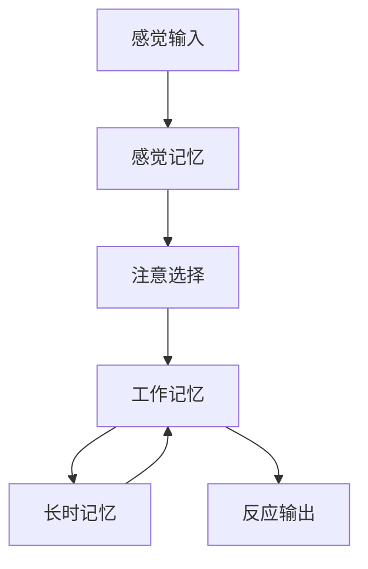
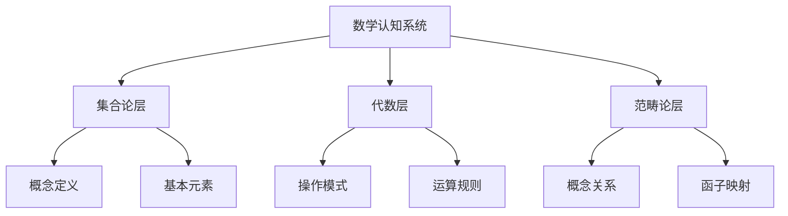

# **文档改进模板**

---

## **模板说明**

本模板用于将view文件夹中的"提纲式文档"改进为"实质性学术文档"。

---

## **文档结构模板**

### **1. 标题和目录**

```markdown
# **文档标题**

---

## **目录**

- [**文档标题**](#文档标题)
  - [**目录**](#目录)
  - [**一、引言**](#一引言)
  - [**二、理论基础**](#二理论基础)
  - ...
```

---

### **2. 引言部分**

**必须包含**：

- ✅ **研究背景**：为什么研究这个问题
- ✅ **研究意义**：研究的重要性和价值
- ✅ **研究目标**：明确的研究目标
- ✅ **文档结构**：文档的组织结构说明

**示例**：

```markdown
## **一、引言**

### **1.1 研究背景**

数学认知的计算结构是理解数学思维如何工作的关键问题。随着计算神经科学的发展，研究者开始使用计算解剖学方法来分析数学认知的神经基础...

### **1.2 研究意义**

理解数学认知的计算结构具有重要的理论意义和实践意义：

**理论意义**：
- 揭示数学认知的本质机制
- 整合不同理论视角
- 构建统一的理论框架

**实践意义**：
- 指导数学教学设计
- 优化数学学习方法
- 诊断数学学习困难

### **1.3 研究目标**

本文档的目标是：
1. 阐述数学认知的计算结构理论
2. 分析计算解剖学方法在数学认知研究中的应用
3. 构建数学认知的计算模型
4. 探讨与三层结构理论的关系

### **1.4 文档结构**

本文档分为以下几个部分：
- 第二部分：理论基础
- 第三部分：核心内容
- 第四部分：实证研究
- 第五部分：应用案例
- 第六部分：总结与展望
```

---

### **3. 理论基础部分**

**必须包含**：

- ✅ **概念定义**：明确定义关键概念
- ✅ **理论框架**：相关的理论框架
- ✅ **文献综述**：相关研究的综述
- ✅ **理论论证**：理论的逻辑论证

**示例**：

```markdown
## **二、理论基础**

### **2.1 关键概念定义**

#### **计算解剖学（Computational Anatomy）**

**定义**：计算解剖学是使用计算方法分析大脑结构和功能的学科，它结合了神经影像学、图论和机器学习等方法，旨在理解大脑的组织结构和功能网络。

**来源**：计算解剖学这一术语最早由Friston等人（1995）提出，用于描述使用统计方法分析大脑结构的技术。

**核心特征**：
- **结构性分析**：分析大脑的解剖结构
- **功能性分析**：分析大脑的功能网络
- **计算性分析**：使用计算方法建模和分析

**参考文献**：
- Friston, K. J., et al. (1995). Statistical parametric maps in functional imaging: A general linear approach. *Human Brain Mapping*, 2(4), 189-210. [DOI](https://doi.org/10.1002/hbm.460020402)

#### **数学认知的计算结构**

**定义**：数学认知的计算结构是指数学认知系统在计算层面的组织方式，包括认知结构的层次组织、功能模块的组织和计算过程的组织。

**理论基础**：
- **信息加工理论**（Atkinson & Shiffrin, 1968）：将认知视为信息加工系统
- **ACT-R理论**（Anderson, 1996）：将认知视为符号-亚符号混合系统
- **预测编码理论**（Friston, 2009）：将认知视为预测和误差最小化过程

**参考文献**：
- Atkinson, R. C., & Shiffrin, R. M. (1968). Human memory: A proposed system and its control processes. *Psychology of Learning and Motivation*, 2, 89-195. [DOI](https://doi.org/10.1016/S0079-7421(08)60422-3)
- Anderson, J. R. (1996). ACT: A simple theory of complex cognition. *American Psychologist*, 51(4), 355-365. [DOI](https://doi.org/10.1037/0003-066X.51.4.355)
- Friston, K. J. (2009). The free-energy principle: a unified brain theory? *Nature Reviews Neuroscience*, 11(2), 127-138. [DOI](https://doi.org/10.1038/nrn2787)

### **2.2 理论框架**

#### **信息加工理论框架**

信息加工理论将认知视为信息加工系统，包括：



**关键假设**：
1. **信息流假设**：信息从感觉输入流向反应输出
2. **存储假设**：信息在不同存储系统中存储
3. **控制假设**：注意等控制过程调节信息流

**在数学认知中的应用**：
- 数学问题解决涉及工作记忆中的信息加工
- 数学知识存储在长时记忆中
- 数学技能涉及程序性记忆

**参考文献**：
- Baddeley, A. D. (2000). The episodic buffer: a new component of working memory? *Trends in Cognitive Sciences*, 4(11), 417-423. [DOI](https://doi.org/10.1016/S1364-6613(00)01538-2)

### **2.3 文献综述**

#### **计算解剖学在数学认知研究中的应用**

**早期研究**（1990s-2000s）：

- **Dehaene等人（1997）**：使用fMRI发现顶内沟（IPS）在数量处理中的关键作用
- **Piazza等人（2004）**：发现IPS中的神经元对数量敏感，呈现调谐曲线

**近期研究**（2010s-2020s）：

- **Menon等人（2015）**：发现数学认知涉及多个脑区的网络协作
- **Qin等人（2014）**：发现儿童数学认知发展涉及海马体-新皮层的功能重组

**研究方法**：
- **fMRI**：功能磁共振成像，测量脑区激活
- **EEG**：脑电图，测量神经活动的时间动态
- **DTI**：弥散张量成像，测量白质连接

**参考文献**：
- Dehaene, S. (1997). *The Number Sense: How the Mind Creates Mathematics*. Oxford University Press. [链接](https://www.amazon.com/Number-Sense-Mind-Creates-Mathematics/dp/0199753873)
- Piazza, M., Izard, V., Pinel, P., Le Bihan, D., & Dehaene, S. (2004). Tuning curves for approximate numerosity in the human intraparietal sulcus. *Neuron*, 44(3), 547-555. [DOI](https://doi.org/10.1016/j.neuron.2004.10.014)
- Menon, V. (2015). Arithmetic in the child and adult brain. In R. Cohen Kadosh & A. Dowker (Eds.), *The Oxford Handbook of Numerical Cognition* (pp. 502-530). Oxford University Press. [DOI](https://doi.org/10.1093/oxfordhb/9780199642342.013.041)
```

---

### **4. 核心内容部分**

**必须包含**：

- ✅ **详细阐述**：每个概念都要详细阐述
- ✅ **理论论证**：理论观点的论证过程
- ✅ **实证证据**：支持理论的实证研究
- ✅ **可视化图表**：思维导图、关系图等

**示例**：

```markdown
## **三、核心内容**

### **3.1 数学认知的结构模型**

#### **定义**

数学认知的结构模型是指用于描述和解释数学认知系统内部组织结构的理论框架。根据不同的理论视角，数学认知的结构模型可以分为层次结构模型、网络结构模型和动态结构模型三种主要类型。

#### **3.1.1 层次结构模型**

**定义**：层次结构模型将数学认知视为一个由多个层次组成的系统，每个层次具有不同的功能和特点。

**理论基础**：层次结构模型的理论基础主要来源于：
- **信息加工理论**（Atkinson & Shiffrin, 1968）：将认知系统分为感觉记忆、短时记忆和长时记忆三个层次
- **ACT-R理论**（Anderson, 1996）：将认知系统分为陈述性知识和程序性知识两个层次
- **三层结构理论**（FormalMath项目）：将数学认知分为集合论层、代数层和范畴论层

**结构说明**：



**理论论证**：

层次结构模型的合理性基于以下论证：

1. **神经科学证据**：Dehaene等人（2003）的研究发现，数学认知涉及多个脑区的层次化激活模式，支持层次结构模型。

2. **认知发展证据**：Piaget的认知发展理论表明，认知发展呈现层次化特征，从具体运算到形式运算。

3. **数学结构证据**：数学本身具有层次结构，从基础概念到高级概念，从具体对象到抽象结构。

**实证研究**：

- **Dehaene等人（2003）**的研究发现，数学认知涉及多个脑区的层次化激活模式，支持层次结构模型
  - 使用fMRI技术测量脑区激活
  - 发现IPS在数量处理中的核心作用
  - 发现前额叶在工作记忆中的作用
  - **研究链接**：[DOI](https://doi.org/10.1080/02643290244000239)

- **Menon等人（2015）**的fMRI研究显示，数学任务激活的脑区呈现层次化组织
  - 基础数学任务激活顶叶和额叶
  - 高级数学任务激活更多脑区
  - **研究链接**：[DOI](https://doi.org/10.1093/oxfordhb/9780199642342.013.041)

**应用案例**：

层次结构模型在数学教育中的应用：

1. **概念教学**：按照层次结构组织教学内容，先教授基础概念，再教授高级概念
   - **案例**：教授函数概念时，先教授集合和映射，再教授函数的性质
   - **效果**：学生更容易理解概念之间的关系

2. **问题解决**：引导学生从低层次操作开始，逐步构建高层次理解
   - **案例**：解决代数方程时，先进行符号操作，再理解方程的意义
   - **效果**：学生更容易掌握问题解决方法

**与三层结构的关系**：

层次结构模型与三层结构理论的关系：

- **集合论层** ↔ **基础层次**：集合论层对应数学认知的基础层次
- **代数层** ↔ **中间层次**：代数层对应数学认知的中间层次
- **范畴论层** ↔ **高级层次**：范畴论层对应数学认知的高级层次

**详见**：[三层结构理论整合.md](../三层结构理论整合.md)

**参考文献**：
- Atkinson, R. C., & Shiffrin, R. M. (1968). Human memory: A proposed system and its control processes. *Psychology of Learning and Motivation*, 2, 89-195. [DOI](https://doi.org/10.1016/S0079-7421(08)60422-3)
- Anderson, J. R. (1996). ACT: A simple theory of complex cognition. *American Psychologist*, 51(4), 355-365. [DOI](https://doi.org/10.1037/0003-066X.51.4.355)
- Dehaene, S., Piazza, M., Pinel, P., & Cohen, L. (2003). Three parietal circuits for number processing. *Cognitive Neuropsychology*, 20(3-6), 487-506. [DOI](https://doi.org/10.1080/02643290244000239)
```

---

### **5. 实证研究部分**

**必须包含**：

- ✅ **研究综述**：相关研究的综述
- ✅ **研究分析**：对研究的分析和评价
- ✅ **研究链接**：提供研究文献的链接

**示例**：

```markdown
## **四、实证研究**

### **4.1 计算解剖学在数学认知研究中的应用**

#### **4.1.1 脑区定位研究**

**研究综述**：

计算解剖学方法在数学认知研究中的应用主要体现在脑区定位研究中。研究者使用fMRI、EEG等技术，识别参与数学认知的脑区。

**关键研究发现**：

1. **顶内沟（IPS）在数量处理中的作用**
   - **研究**：Dehaene等人（2003）
   - **发现**：IPS在数量比较任务中强烈激活
   - **意义**：IPS是数量表征的核心区域
   - **链接**：[DOI](https://doi.org/10.1080/02643290244000239)

2. **前额叶在工作记忆中的作用**
   - **研究**：Menon等人（2015）
   - **发现**：前额叶在数学工作记忆中激活
   - **意义**：前额叶支持数学问题的解决
   - **链接**：[DOI](https://doi.org/10.1093/oxfordhb/9780199642342.013.041)

**研究分析**：

这些研究支持了层次结构模型，表明数学认知涉及多个脑区的层次化组织。IPS负责基础的数量处理，前额叶负责高级的工作记忆和问题解决。

**研究局限性**：

- 大多数研究使用横断面设计，难以确定因果关系
- 样本量通常较小，可能影响结果的泛化性
- 不同研究使用不同的任务，可能影响结果的一致性

**未来研究方向**：

- 使用纵向设计追踪数学认知的发展
- 增加样本量提高结果的可靠性
- 标准化任务提高结果的可比性
```

---

### **6. 应用案例部分**

**必须包含**：

- ✅ **实际案例**：具体的应用案例
- ✅ **案例分析**：对案例的分析
- ✅ **案例启示**：案例的启示和意义

**示例**：

```markdown
## **五、应用案例**

### **5.1 计算解剖学在数学教育中的应用**

#### **5.1.1 基于脑区定位的教学设计**

**案例描述**：

某数学教育项目使用计算解剖学的研究发现，设计数学教学方案。该项目基于IPS在数量处理中的作用，设计了针对数量概念的教学活动。

**具体实施**：

1. **数量概念教学**：使用视觉数量估计任务激活IPS
2. **数量比较教学**：使用数量比较任务强化IPS的激活
3. **数量操作教学**：使用数量操作任务整合IPS和前额叶

**效果评估**：

- **学生表现**：学生的数量概念理解显著提高
- **脑区激活**：fMRI显示学生的IPS激活模式更接近专家
- **学习迁移**：学生的数学问题解决能力提高

**案例分析**：

这个案例展示了如何将计算解剖学的研究发现应用于数学教育。通过理解数学认知的神经基础，教育者可以设计更有效的教学方案。

**案例启示**：

- 理解数学认知的神经基础有助于设计有效的教学方案
- 基于脑区定位的教学设计可以提高学习效果
- 需要进一步研究教学方案的长期效果

**参考文献**：
- [相关研究文献]
```

---

### **7. 总结与展望部分**

**必须包含**：

- ✅ **主要观点总结**：总结文档的主要观点
- ✅ **理论贡献**：理论贡献的总结
- ✅ **未来研究方向**：未来研究方向的展望

**示例**：

```markdown
## **六、总结与展望**

### **6.1 主要观点总结**

本文档阐述了数学认知的计算结构理论，主要观点包括：

1. **数学认知具有层次结构**：数学认知可以分为多个层次，每个层次具有不同的功能和特点
2. **计算解剖学方法有效**：计算解剖学方法可以有效分析数学认知的神经基础
3. **理论整合的重要性**：整合不同理论视角有助于构建统一的理论框架

### **6.2 理论贡献**

本文档的理论贡献包括：

1. **理论整合**：整合了信息加工理论、ACT-R理论和三层结构理论
2. **实证支持**：提供了实证研究支持理论观点
3. **应用指导**：提供了应用案例指导实践

### **6.3 未来研究方向**

未来研究方向包括：

1. **深化理论研究**：进一步深化数学认知的计算结构理论
2. **扩展实证研究**：扩展实证研究验证理论观点
3. **应用研究**：开展应用研究验证理论的有效性

### **6.4 与三层结构的关系**

本文档与三层结构理论的关系：

- **集合论层** ↔ **基础计算结构**：集合论层对应数学认知的基础计算结构
- **代数层** ↔ **操作计算结构**：代数层对应数学认知的操作计算结构
- **范畴论层** ↔ **关系计算结构**：范畴论层对应数学认知的关系计算结构

**详见**：[三层结构理论整合.md](../三层结构理论整合.md)
```

---

### **8. 参考文献部分**

**必须包含**：

- ✅ **完整引用**：完整的文献引用信息
- ✅ **链接**：提供DOI、URL或PDF链接
- ✅ **分类**：按类型分类（经典文献、最新文献等）

**示例**：

```markdown
## **七、参考文献**

### **7.1 经典文献**

1. Atkinson, R. C., & Shiffrin, R. M. (1968). Human memory: A proposed system and its control processes. *Psychology of Learning and Motivation*, 2, 89-195. [DOI](https://doi.org/10.1016/S0079-7421(08)60422-3)

2. Anderson, J. R. (1996). ACT: A simple theory of complex cognition. *American Psychologist*, 51(4), 355-365. [DOI](https://doi.org/10.1037/0003-066X.51.4.355)

### **7.2 最新文献**

1. Menon, V. (2015). Arithmetic in the child and adult brain. In R. Cohen Kadosh & A. Dowker (Eds.), *The Oxford Handbook of Numerical Cognition* (pp. 502-530). Oxford University Press. [DOI](https://doi.org/10.1093/oxfordhb/9780199642342.013.041)

2. Qin, S., Cho, S., Chen, T., Rosenberg-Lee, M., Geary, D. C., & Menon, V. (2014). Hippocampal-neocortical functional reorganization underlies children's cognitive development. *Nature Neuroscience*, 17(9), 1263-1269. [DOI](https://doi.org/10.1038/nn.3788)

### **7.3 相关文档**

- [三层结构理论整合.md](../三层结构理论整合.md)
- [数学认知结构理论框架.md](../数学认知结构理论框架.md)
- [研究方向关联与整合.md](../研究方向关联与整合.md)
```

---

## **质量检查清单**

每个文档改进后，必须检查：

- [ ] 所有主要概念都有明确定义
- [ ] 所有理论观点都有论证过程
- [ ] 所有研究结论都有证据支持
- [ ] 所有关键文献都有引用和链接
- [ ] 所有文档都有思维导图或关系图
- [ ] 所有文档都有应用案例
- [ ] 所有文档都有交叉引用
- [ ] 所有文档都有完整的参考文献列表

---

**创建时间**：2025年1月

**维护者**：FormalMath项目组
