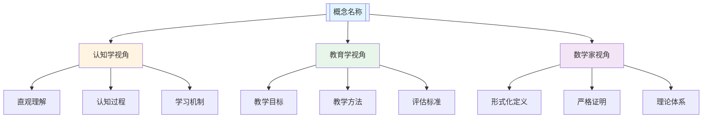
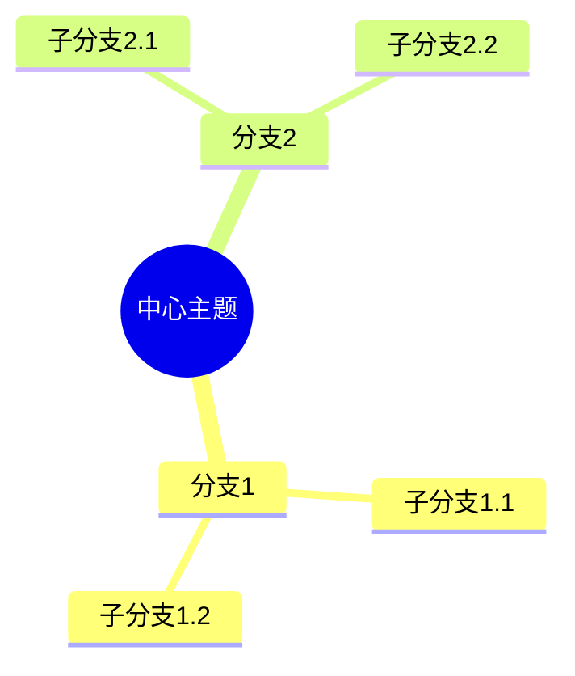
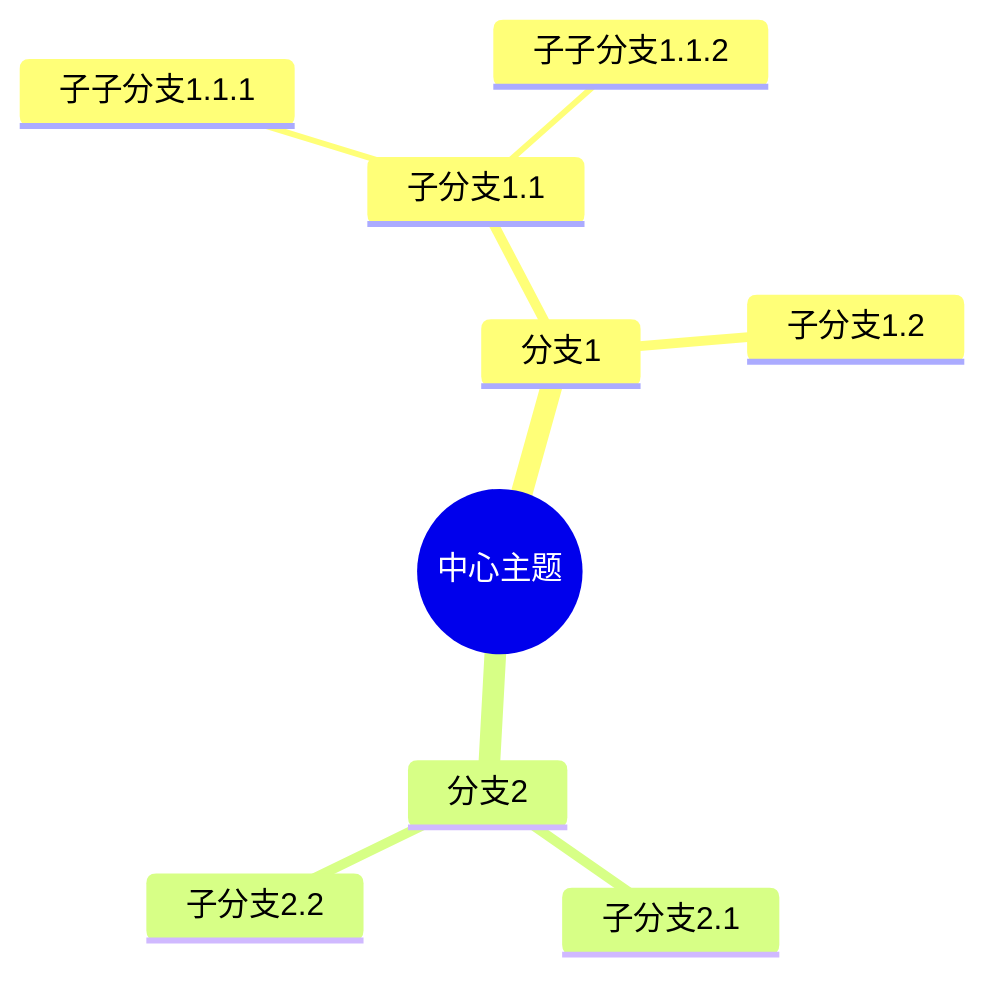
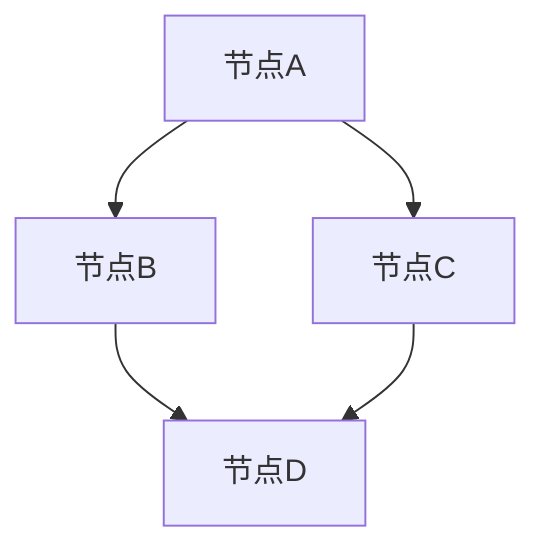
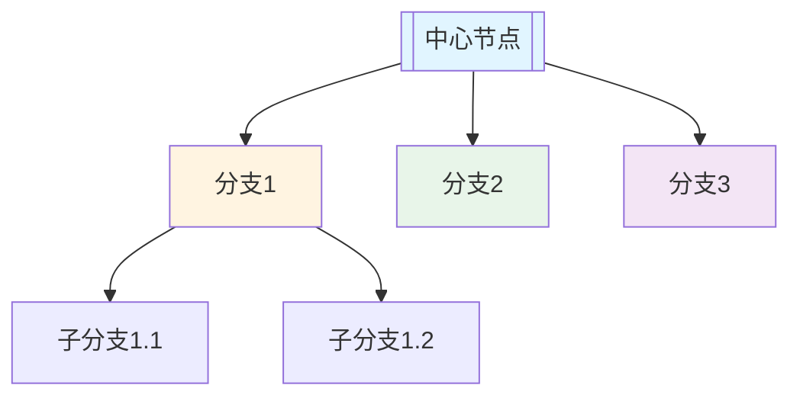
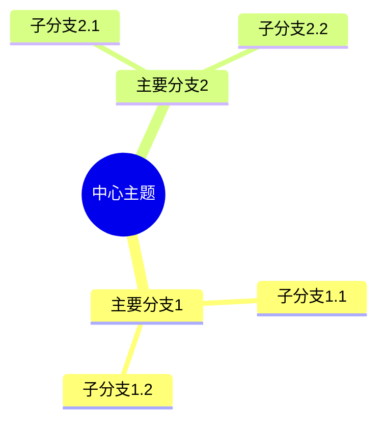
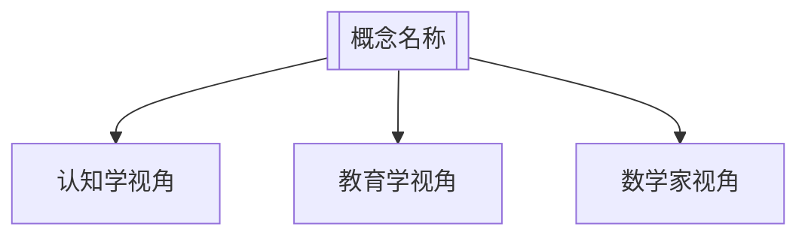

# 思维表征工具与模板

**创建日期**: 2025年11月28日
**最后更新**: 2025年11月28日
**状态**: ✅ 工具和模板完成

---

## 📋 概述

本文档提供思维表征的工具、模板、制作指南和转换工具，用于指导FormalMath项目核心概念文件的思维表征部分编写。

---

## 🎯 一、思维表征模板

### 1.1 完整模板

```markdown
### 五、思维表征：用多种方式理解[概念名称]

#### 5.1 思维导图：知识结构

```mermaid
mindmap
  root(([概念名称]))
    [主要分支1]
      [子分支1.1]
      [子分支1.2]
      [子分支1.3]
    [主要分支2]
      [子分支2.1]
      [子分支2.2]
      [子分支2.3]
    [主要分支3]
      [子分支3.1]
      [子分支3.2]
      [子分支3.3]
```

**说明**：
- **主要分支1**：[说明主要分支1的内容]
- **主要分支2**：[说明主要分支2的内容]
- **主要分支3**：[说明主要分支3的内容]

#### 5.2 矩阵对比：不同解释方式的对比

| 解释方式 | 特点 | 方法 | 工具 | 适用阶段 | 优势 | 局限 |
|---------|------|------|------|---------|------|------|
| **直观解释** | [特点] | [方法] | [工具] | [适用阶段] | [优势] | [局限] |
| **知性解释** | [特点] | [方法] | [工具] | [适用阶段] | [优势] | [局限] |
| **理性解释** | [特点] | [方法] | [工具] | [适用阶段] | [优势] | [局限] |
| **多视角解释** | [特点] | [方法] | [工具] | [适用阶段] | [优势] | [局限] |

**说明**：
- **直观解释**：[说明直观解释的特点和应用]
- **知性解释**：[说明知性解释的特点和应用]
- **理性解释**：[说明理性解释的特点和应用]
- **多视角解释**：[说明多视角解释的特点和应用]

#### 5.3 多视角表征：从不同角度表征概念



**说明**：
- **认知学视角**：[说明认知学视角的表征]
- **教育学视角**：[说明教育学视角的表征]
- **数学家视角**：[说明数学家视角的表征]
- **三视角整合**：[说明三视角的整合]
```

### 1.2 简化模板（快速版本）

```markdown
### 五、思维表征：用多种方式理解[概念名称]

#### 5.1 思维导图：知识结构
[使用Mermaid mindmap创建思维导图]

#### 5.2 矩阵对比：不同解释方式的对比
[使用表格对比不同解释方式]

#### 5.3 多视角表征：从不同角度表征概念
[使用Mermaid graph创建多视角表征]
```

---

## 🎯 二、思维导图制作指南

### 2.1 Mermaid思维导图语法

**基本语法**：


**高级语法**：


### 2.2 思维导图设计原则

**1. 层次清晰**：
- 中心主题明确
- 主要分支清晰
- 子分支有序

**2. 内容完整**：
- 覆盖主要方面
- 包含关键要素
- 没有遗漏重要内容

**3. 结构合理**：
- 分支数量适中
- 层次深度适当
- 逻辑关系清晰

### 2.3 思维导图制作步骤

**步骤1**：确定中心主题
- 明确概念名称
- 确定核心内容

**步骤2**：确定主要分支
- 识别主要方面
- 确定分支数量

**步骤3**：确定子分支
- 细化每个分支
- 确定子分支内容

**步骤4**：创建思维导图
- 使用Mermaid语法
- 检查语法正确性

**步骤5**：优化和完善
- 检查内容完整性
- 优化结构合理性
- 完善说明文字

---

## 🎯 三、矩阵对比制作指南

### 3.1 矩阵对比设计原则

**1. 对比维度**：
- 选择有意义的对比维度
- 确保维度相互独立
- 确保维度全面覆盖

**2. 内容准确**：
- 确保内容准确
- 确保对比合理
- 确保说明清晰

**3. 格式统一**：
- 使用统一的表格格式
- 使用统一的术语
- 使用统一的风格

### 3.2 矩阵对比制作步骤

**步骤1**：确定对比对象
- 确定要对比的解释方式
- 确定对比的维度

**步骤2**：收集对比信息
- 收集每个解释方式的信息
- 整理对比维度

**步骤3**：创建对比表格
- 使用Markdown表格语法
- 填写对比内容

**步骤4**：优化和完善
- 检查内容准确性
- 优化表格格式
- 完善说明文字

### 3.3 矩阵对比模板

**基础模板**：
```markdown
| 解释方式 | 特点 | 方法 | 工具 | 适用阶段 | 优势 | 局限 |
|---------|------|------|------|---------|------|------|
| **方式1** | [特点] | [方法] | [工具] | [适用阶段] | [优势] | [局限] |
| **方式2** | [特点] | [方法] | [工具] | [适用阶段] | [优势] | [局限] |
```

**扩展模板**：
```markdown
| 解释方式 | 特点 | 方法 | 工具 | 适用阶段 | 优势 | 局限 | 应用场景 |
|---------|------|------|------|---------|------|------|---------|
| **方式1** | [特点] | [方法] | [工具] | [适用阶段] | [优势] | [局限] | [应用场景] |
| **方式2** | [特点] | [方法] | [工具] | [适用阶段] | [优势] | [局限] | [应用场景] |
```

---

## 🎯 四、多视角表征制作指南

### 4.1 Mermaid流程图语法

**基本语法**：


**高级语法**：


### 4.2 多视角表征设计原则

**1. 视角完整**：
- 包含三个主要视角
- 每个视角都有充分内容
- 视角之间相互补充

**2. 结构清晰**：
- 中心节点明确
- 分支结构清晰
- 层次关系明确

**3. 内容准确**：
- 每个视角的内容准确
- 视角之间的关系清晰
- 整合说明合理

### 4.3 多视角表征制作步骤

**步骤1**：确定中心概念
- 明确概念名称
- 确定核心内容

**步骤2**：确定三个视角
- 认知学视角
- 教育学视角
- 数学家视角

**步骤3**：确定每个视角的内容
- 认知学视角的内容
- 教育学视角的内容
- 数学家视角的内容

**步骤4**：创建多视角表征
- 使用Mermaid语法
- 检查语法正确性

**步骤5**：优化和完善
- 检查内容完整性
- 优化结构合理性
- 完善说明文字

---

## 🎯 五、思维表征转换工具

### 5.1 文本到思维导图转换

**工具说明**：
- 将文本内容转换为思维导图
- 自动识别层次结构
- 生成Mermaid代码

**使用步骤**：
1. 准备文本内容
2. 识别层次结构
3. 生成Mermaid代码
4. 优化和完善

**转换模板**：
```markdown
输入文本：
- 主要分支1
  - 子分支1.1
  - 子分支1.2
- 主要分支2
  - 子分支2.1
  - 子分支2.2

输出Mermaid：

```

### 5.2 列表到矩阵转换

**工具说明**：
- 将列表内容转换为矩阵
- 自动识别对比维度
- 生成表格代码

**使用步骤**：
1. 准备列表内容
2. 识别对比维度
3. 生成表格代码
4. 优化和完善

**转换模板**：
```markdown
输入列表：
- 解释方式1：特点A，方法B，工具C
- 解释方式2：特点D，方法E，工具F

输出表格：
| 解释方式 | 特点 | 方法 | 工具 |
|---------|------|------|------|
| **方式1** | A | B | C |
| **方式2** | D | E | F |
```

### 5.3 概念到多视角转换

**工具说明**：
- 将概念内容转换为多视角表征
- 自动识别三个视角
- 生成流程图代码

**使用步骤**：
1. 准备概念内容
2. 识别三个视角
3. 生成流程图代码
4. 优化和完善

**转换模板**：
```markdown
输入概念：
- 概念名称：[名称]
- 认知学视角：[内容]
- 教育学视角：[内容]
- 数学家视角：[内容]

输出流程图：

```

---

## 🎯 六、思维表征检查清单

### 6.1 内容完整性检查

- [ ] **思维导图部分**：
  - [ ] 包含中心主题
  - [ ] 包含主要分支
  - [ ] 包含子分支
  - [ ] 内容完整充分

- [ ] **矩阵对比部分**：
  - [ ] 包含对比对象
  - [ ] 包含对比维度
  - [ ] 包含对比内容
  - [ ] 说明清晰准确

- [ ] **多视角表征部分**：
  - [ ] 包含三个视角
  - [ ] 每个视角都有内容
  - [ ] 视角之间有关联
  - [ ] 整合说明合理

### 6.2 质量检查

- [ ] **准确性**：
  - [ ] 内容准确无误
  - [ ] 结构合理有效
  - [ ] 说明清晰准确
  - [ ] 可视化正确

- [ ] **完整性**：
  - [ ] 三个部分都有内容
  - [ ] 每个部分内容充分
  - [ ] 没有遗漏重要内容
  - [ ] 内容相互补充

- [ ] **清晰性**：
  - [ ] 思维导图清晰
  - [ ] 矩阵对比清晰
  - [ ] 多视角表征清晰
  - [ ] 说明文字清晰

- [ ] **有效性**：
  - [ ] 有助于理解
  - [ ] 有助于教学
  - [ ] 有助于应用
  - [ ] 有助于发展

---

## 🎯 七、思维表征质量标准

### 7.1 优秀标准

**内容质量**：
- ✅ 三个部分都有丰富的内容
- ✅ 思维导图结构清晰
- ✅ 矩阵对比准确全面
- ✅ 多视角表征完整有效

**可视化质量**：
- ✅ Mermaid图表正确
- ✅ 表格格式统一
- ✅ 可视化清晰有效
- ✅ 说明文字充分

**教学价值**：
- ✅ 有助于理解概念
- ✅ 有助于教学应用
- ✅ 有助于知识整合
- ✅ 有助于思维发展

### 7.2 良好标准

**内容质量**：
- ✅ 三个部分都有基本内容
- ✅ 思维导图基本清晰
- ✅ 矩阵对比基本准确
- ✅ 多视角表征基本完整

**可视化质量**：
- ✅ Mermaid图表基本正确
- ✅ 表格格式基本统一
- ✅ 可视化基本清晰
- ✅ 说明文字基本充分

**教学价值**：
- ✅ 基本有助于理解
- ✅ 基本有助于教学
- ✅ 基本有助于整合

### 7.3 需要改进

**内容质量**：
- ⚠️ 某个部分内容不足
- ⚠️ 思维导图不够清晰
- ⚠️ 矩阵对比不够准确
- ⚠️ 多视角表征不够完整

**可视化质量**：
- ⚠️ Mermaid图表有错误
- ⚠️ 表格格式不统一
- ⚠️ 可视化不够清晰
- ⚠️ 说明文字不够充分

**教学价值**：
- ⚠️ 理解效果不佳
- ⚠️ 教学效果不佳
- ⚠️ 整合效果不佳

---

## 🎯 八、思维表征最佳实践

### 8.1 制作建议

**1. 从思维导图开始**：
- 先创建思维导图
- 确定知识结构
- 明确主要分支

**2. 完善矩阵对比**：
- 基于思维导图创建矩阵
- 对比不同解释方式
- 说明各自特点

**3. 整合多视角**：
- 整合三个视角
- 说明视角关系
- 提供整合说明

### 8.2 常见问题

**问题1**：如何设计有效的思维导图？

**解决方案**：
- 确定中心主题
- 识别主要分支
- 细化子分支
- 保持层次清晰

**问题2**：如何创建准确的矩阵对比？

**解决方案**：
- 选择有意义的对比维度
- 确保内容准确
- 使用统一的格式
- 提供清晰的说明

**问题3**：如何整合多视角表征？

**解决方案**：
- 明确三个视角
- 确定每个视角的内容
- 说明视角之间的关系
- 提供整合说明

---

## 🎯 九、思维表征资源

### 9.1 参考资源

**理论资源**：
- 思维表征理论
- 可视化理论
- 认知工具理论

**实践资源**：
- 思维导图案例
- 矩阵对比案例
- 多视角表征案例

**工具资源**：
- Mermaid语法参考
- 表格制作工具
- 可视化工具

### 9.2 学习资源

**学习材料**：
- 思维表征理论
- 制作指南
- 最佳实践

**培训资源**：
- 培训课程
- 工作坊
- 研讨会

---

## 🎯 十、总结

### 10.1 核心要点

1. **模板**：提供完整的思维表征模板
2. **制作指南**：提供思维导图、矩阵对比、多视角表征的制作指南
3. **转换工具**：提供文本到思维导图、列表到矩阵、概念到多视角的转换工具
4. **检查清单**：提供内容完整性和质量检查清单
5. **质量标准**：提供优秀、良好、需要改进的标准
6. **最佳实践**：提供制作建议和常见问题解决方案

### 10.2 使用建议

1. **使用模板**：使用模板创建思维表征部分
2. **遵循指南**：遵循制作指南创建内容
3. **使用工具**：使用转换工具提高效率
4. **使用检查清单**：使用检查清单检查内容
5. **使用质量标准**：使用质量标准评估质量
6. **遵循最佳实践**：遵循制作建议和最佳实践

---

**创建日期**: 2025年11月28日
**最后更新**: 2025年11月28日
**状态**: ✅ 工具和模板完成
