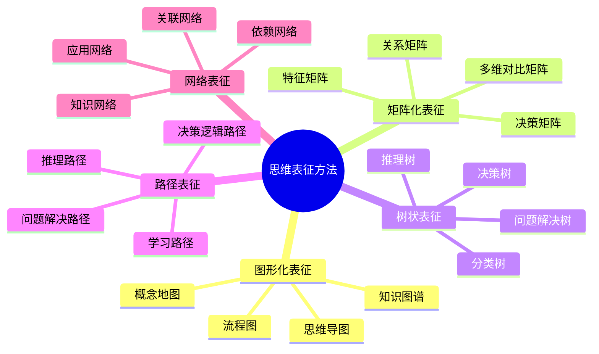
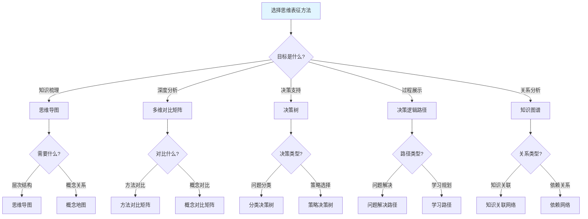
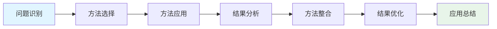
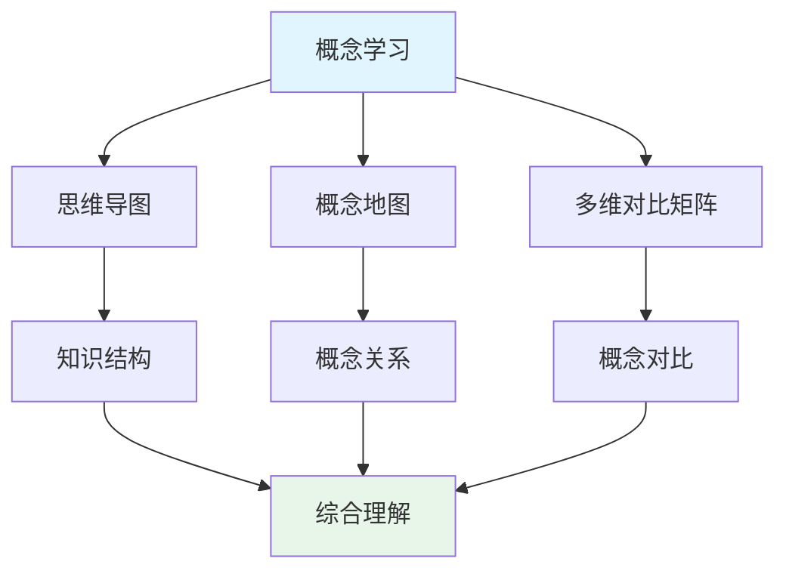
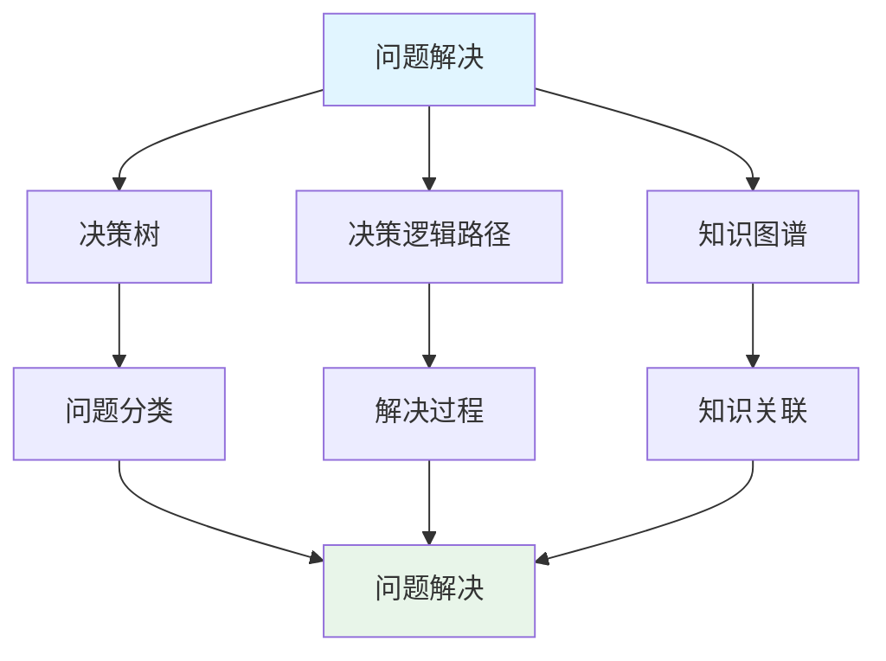

# 思维表征方法全面整合指南

**创建日期**: 2025年11月28日
**最后更新**: 2025年11月28日
**状态**: ✅ 整合指南完成

---

## 📋 概述

本文档提供思维表征方法的全面整合指南，整合思维导图、多维对比矩阵、决策树、决策逻辑路径、知识图谱等多种思维表征方式，结合新加坡、瑞典、挪威、芬兰等国际优秀教育国家的实践经验，为FormalMath项目提供完整的思维表征方法体系。

---

## 🎯 一、思维表征方法体系 (编号: C.INT.GUIDE.01)

### 1.1 思维表征方法分类

### 1.2 思维表征方法特征矩阵

| 表征方法 | 主要特点 | 优势 | 局限性 | 适用场景 | 国际应用 |
|---------|---------|------|--------|---------|---------|
| **思维导图** | 直观、层次清晰、易于理解 | 快速理解结构、易于记忆、促进创造力 | 难以量化、不够严格 | 知识概览、学习路径、概念梳理 | 新加坡、芬兰广泛使用 |
| **多维对比矩阵** | 量化、多维度、系统化 | 深入分析、易于对比、发现规律 | 可能过于复杂、需要专业知识 | 深入分析、对比研究、决策支持 | 瑞典、挪威强调使用 |
| **决策树** | 结构化、逻辑清晰、可操作 | 指导决策、展示路径、支持推理 | 可能过于简化、需要完整信息 | 决策分析、问题解决、概率推理 | 新加坡、瑞典广泛应用 |
| **决策逻辑路径** | 系统化、步骤清晰、可追溯 | 展示完整过程、支持反思、培养逻辑思维 | 可能过于详细、需要时间 | 问题解决、学习规划、教学指导 | 芬兰、挪威重点培养 |
| **知识图谱** | 网络化、关系完整、动态 | 展示复杂关系、支持探索、发现关联 | 可能过于复杂、难以理解 | 知识关联、研究分析、系统理解 | 各国都在发展 |
| **概念地图** | 概念化、关系明确、结构化 | 理解概念关系、组织知识、支持学习 | 可能过于静态、需要更新 | 概念学习、知识组织、教学规划 | 新加坡、芬兰常用 |

---

## 🎯 二、思维表征方法选择指南 (编号: C.INT.GUIDE.02)

### 2.1 方法选择决策树

### 2.2 方法应用场景矩阵

| 应用场景 | 推荐方法 | 理由 | 示例 |
|---------|---------|------|------|
| **概念学习** | 思维导图、概念地图 | 直观、层次清晰 | 函数概念学习 |
| **方法对比** | 多维对比矩阵 | 系统化、易于对比 | 解题方法对比 |
| **问题分类** | 决策树 | 结构化、逻辑清晰 | 数学问题分类 |
| **问题解决** | 决策逻辑路径 | 过程完整、可追溯 | 应用题解决 |
| **知识关联** | 知识图谱 | 关系完整、支持探索 | 函数知识网络 |
| **学习规划** | 学习路径 | 步骤清晰、可操作 | 函数学习路径 |
| **教学指导** | 决策逻辑路径、思维导图 | 过程清晰、结构完整 | 函数教学指导 |
| **研究分析** | 知识图谱、多维对比矩阵 | 关系完整、深度分析 | 函数研究分析 |

---

## 🎯 三、思维表征方法整合框架 (编号: C.INT.GUIDE.03)

### 3.1 整合原则

**原则1：目标导向**
- 根据目标选择方法
- 整合应用服务于目标
- 评估整合应用效果

**原则2：互补优化**
- 利用不同方法的优势
- 弥补不同方法的不足
- 优化整合应用效果

**原则3：层次递进**
- 从直观到形式化
- 从简单到复杂
- 从理解到应用

### 3.2 整合流程

**流程说明**：
1. **问题识别**：明确需要解决的问题
2. **方法选择**：根据问题特点选择合适的方法
3. **方法应用**：应用选择的方法解决问题
4. **结果分析**：分析应用结果
5. **方法整合**：整合多种方法
6. **结果优化**：优化结果
7. **应用总结**：总结应用经验

### 3.3 整合应用示例

**示例1：概念学习整合**

**应用步骤**：
1. 使用思维导图梳理知识结构
2. 使用概念地图理解概念关系
3. 使用多维对比矩阵对比不同概念
4. 整合三种方法实现综合理解

**示例2：问题解决整合**

**应用步骤**：
1. 使用决策树对问题进行分类
2. 使用决策逻辑路径展示解决过程
3. 使用知识图谱查找相关知识
4. 整合三种方法实现问题解决

---

## 🎯 四、核心概念思维表征增强方案 (编号: C.INT.GUIDE.04)

### 4.1 增强内容清单

**每个核心概念应包含**：

1. **思维导图**（已有）
   - ✅ 知识结构
   - ✅ 概念关系
   - ✅ 应用场景

2. **多维对比矩阵**（已有）
   - ✅ 解释方式对比
   - ⚠️ 需要增强：添加更多对比维度

3. **多视角表征**（已有）
   - ✅ 认知学视角
   - ✅ 教育学视角
   - ✅ 数学家视角

4. **决策树**（新增）
   - ⚠️ 问题分类决策树
   - ⚠️ 策略选择决策树
   - ⚠️ 方法应用决策树

5. **决策逻辑路径**（新增）
   - ⚠️ 问题解决路径
   - ⚠️ 学习规划路径
   - ⚠️ 教学指导路径

6. **知识图谱**（可选）
   - ⚠️ 知识关联网络
   - ⚠️ 依赖关系网络
   - ⚠️ 应用关系网络

### 4.2 增强实施步骤

**步骤1：检查现有内容**
- 检查每个核心概念的思维表征部分
- 识别缺失的内容
- 确定需要增强的部分

**步骤2：添加决策树**
- 为每个核心概念创建决策树
- 确定问题分类标准
- 定义策略选择规则

**步骤3：添加决策逻辑路径**
- 为每个核心概念创建决策逻辑路径
- 设计问题解决流程
- 设计学习规划流程

**步骤4：增强多维对比矩阵**
- 添加更多对比维度
- 使用量化指标
- 添加可视化元素

**步骤5：优化整合**
- 整合所有思维表征方法
- 确保内容一致性
- 优化可视化效果

---

## 🎯 五、国际经验整合 (编号: C.INT.GUIDE.05)

### 5.1 新加坡经验

**核心特点**：
- ✅ 系统化思维表征
- ✅ 问题解决导向
- ✅ CPA方法整合

**应用建议**：
- 使用思维导图梳理知识结构
- 使用决策树支持问题分类
- 使用决策逻辑路径展示问题解决过程

### 5.2 瑞典经验

**核心特点**：
- ✅ 创新思维表征
- ✅ 个性化学习
- ✅ 技术辅助

**应用建议**：
- 使用多维对比矩阵进行深度分析
- 使用知识图谱支持探索学习
- 使用创新方法培养创造力

### 5.3 挪威经验

**核心特点**：
- ✅ 跨学科整合
- ✅ 综合科学课程
- ✅ 实际问题解决

**应用建议**：
- 使用跨学科思维表征
- 使用综合方法解决实际问题
- 使用知识网络整合不同学科

### 5.4 芬兰经验

**核心特点**：
- ✅ 平等教育
- ✅ 信任教育
- ✅ 自主教育

**应用建议**：
- 使用决策逻辑路径培养自主能力
- 使用协作思维表征支持合作学习
- 使用个性化方法适应不同学生

---

## 🎯 六、实施检查清单 (编号: C.INT.GUIDE.06)

### 6.1 内容完整性检查

- [ ] **思维导图**：
  - [ ] 包含中心主题
  - [ ] 包含主要分支
  - [ ] 包含子分支
  - [ ] 内容完整充分

- [ ] **多维对比矩阵**：
  - [ ] 包含对比对象
  - [ ] 包含对比维度（至少5个维度）
  - [ ] 包含对比内容
  - [ ] 说明清晰准确

- [ ] **多视角表征**：
  - [ ] 包含三个视角
  - [ ] 每个视角都有内容
  - [ ] 视角之间有关联
  - [ ] 整合说明合理

- [ ] **决策树**：
  - [ ] 包含问题定义
  - [ ] 包含判断条件
  - [ ] 包含结果定义
  - [ ] 逻辑清晰完整

- [ ] **决策逻辑路径**：
  - [ ] 包含所有关键步骤
  - [ ] 包含判断和反馈
  - [ ] 包含总结和反思
  - [ ] 过程完整可操作

- [ ] **知识图谱**（可选）：
  - [ ] 包含知识关联
  - [ ] 包含依赖关系
  - [ ] 包含应用关系
  - [ ] 网络结构清晰

### 6.2 质量检查

- [ ] **准确性**：
  - [ ] 内容准确无误
  - [ ] 结构合理有效
  - [ ] 说明清晰准确
  - [ ] 可视化正确

- [ ] **完整性**：
  - [ ] 所有部分都有内容
  - [ ] 每个部分内容充分
  - [ ] 没有遗漏重要内容
  - [ ] 内容相互补充

- [ ] **清晰性**：
  - [ ] 思维导图清晰
  - [ ] 矩阵对比清晰
  - [ ] 多视角表征清晰
  - [ ] 决策树清晰
  - [ ] 决策逻辑路径清晰
  - [ ] 多维对比矩阵清晰
  - [ ] 说明文字清晰

- [ ] **有效性**：
  - [ ] 有助于理解
  - [ ] 有助于教学
  - [ ] 有助于应用
  - [ ] 有助于发展

---

## 🎯 七、最佳实践 (编号: C.INT.GUIDE.07)

### 7.1 制作建议

**1. 从思维导图开始**：
- 先创建思维导图
- 确定知识结构
- 明确主要分支

**2. 完善多维对比矩阵**：
- 基于思维导图创建矩阵
- 对比不同解释方式
- 添加更多对比维度
- 说明各自特点

**3. 整合多视角**：
- 整合三个视角
- 说明视角关系
- 提供整合说明

**4. 添加决策树**：
- 创建决策树
- 确定判断条件
- 定义结果

**5. 添加决策逻辑路径**：
- 设计问题解决路径
- 确定关键步骤
- 添加判断和反馈

**6. 创建多维对比矩阵**：
- 确定对比对象和维度
- 收集对比信息
- 创建对比表格

### 7.2 常见问题

**问题1**：如何选择合适的方法？

**解决方案**：
- 根据目标选择方法
- 参考方法选择决策树
- 考虑应用场景
- 结合多种方法

**问题2**：如何整合多种方法？

**解决方案**：
- 遵循整合原则
- 使用整合流程
- 参考整合示例
- 优化整合效果

**问题3**：如何确保质量？

**解决方案**：
- 使用检查清单
- 遵循质量标准
- 参考最佳实践
- 持续改进

---

## 🎯 八、总结 (编号: C.INT.GUIDE.08)

### 8.1 核心要点

1. **方法体系**：建立了完整的思维表征方法体系
2. **选择指南**：提供了方法选择决策树和应用场景矩阵
3. **整合框架**：建立了整合原则、流程和示例
4. **增强方案**：提供了核心概念思维表征增强方案
5. **国际经验**：整合了新加坡、瑞典、挪威、芬兰的实践经验
6. **检查清单**：提供了内容完整性和质量检查清单
7. **最佳实践**：提供了制作建议和常见问题解决方案

### 8.2 使用建议

1. **理解方法体系**：理解各种思维表征方法的特点和适用场景
2. **选择合适方法**：根据目标和应用场景选择合适的方法
3. **整合多种方法**：遵循整合原则和流程，整合多种方法
4. **增强核心概念**：按照增强方案增强核心概念的思维表征部分
5. **参考国际经验**：参考国际优秀教育国家的实践经验
6. **使用检查清单**：使用检查清单确保内容完整性和质量
7. **遵循最佳实践**：遵循制作建议和最佳实践

---

## 🔗 九、关联文档 (编号: C.INT.GUIDE.09)

- [国际优秀教育国家思维表征方法研究](./00-国际优秀教育国家思维表征方法研究-2025年11月28日.md)
- [思维表征工具与模板](./00-思维表征工具与模板-2025年11月28日.md)
- [认知方式表征综合](../04-认知工具/07-认知方式表征综合.md)
- [多种思维表征方式对比与整合](./00-多种思维表征方式对比与整合-2025年1月.md)

---

**创建日期**: 2025年11月28日
**最后更新**: 2025年11月28日
**维护状态**: 持续更新中
