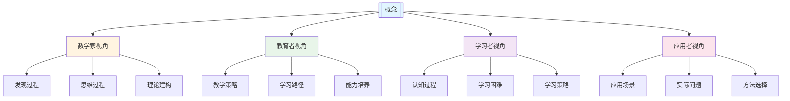

# 批量添加数学解释：模板和指南

**创建日期**: 2025年11月28日
**状态**: 📋 模板和指南

---

## 📋 概述

本文档提供为33个核心概念批量添加数学解释的模板和指南，确保所有概念都有一致的高质量数学解释。

---

## 🎯 数学解释的标准结构

### 标准结构

每个核心概念的数学解释部分应包含以下五个部分：

1. **一、直观解释：概念是什么？**
   - 1.1 具体例子（生活中的例子、数学中的例子）
   - 1.2 形象类比（与熟悉概念的类比）
   - 1.3 几何直观（图形表示、图像表示）
   - 1.4 操作体验（通过操作理解概念）

2. **二、知性解释：概念的本质是什么？**
   - 2.1 概念定义（内涵、外延）
   - 2.2 分类体系（按不同标准分类）
   - 2.3 抽象结构（运算结构、关系结构、代数结构）
   - 2.4 知识体系（在数学体系中的位置、与其他概念的关系）

3. **三、理性解释：概念的公理化定义**
   - 3.1 公理体系（公理化定义、公理的意义）
   - 3.2 形式化证明（关键性质的证明）
   - 3.3 系统建构（在数学基础中的地位、发展历史）

4. **四、多视角解释：从不同角度理解概念**
   - 4.1 数学家视角（概念是如何被发现的？）
   - 4.2 教育者视角（如何教学概念？）
   - 4.3 学习者视角（如何学习概念？）
   - 4.4 应用者视角（如何应用概念？）

5. **五、思维表征：用多种方式理解概念**
   - 5.1 思维导图（概念的知识结构）
   - 5.2 矩阵对比（不同解释方式的对比）
   - 5.3 多视角表征（从不同角度表征概念）

---

## 📝 插入位置

数学解释部分应插入在"数学家视角"部分之后，"三视角整合"部分之前。

**标准位置**：

```
## 🔬 数学家视角：如何思考[概念]
  ...（数学家视角的内容）...

---

## 💡 数学解释：为什么[概念]是这样定义的 (编号: C.CORE.XXX.05)
  ...（数学解释的内容）...

---

## 🔗 三视角整合 (编号: C.CORE.XXX.06)
```

---

## 📋 内容要求

### 1. 直观解释要求

- **具体例子**：至少3个生活中的例子，3个数学中的例子
- **形象类比**：至少2个与熟悉概念的类比
- **几何直观**：至少1种图形或图像表示
- **操作体验**：至少1种通过操作理解概念的方法

### 2. 知性解释要求

- **概念定义**：明确概念的内涵和外延
- **分类体系**：至少2种分类方式
- **抽象结构**：至少描述运算结构、关系结构或代数结构中的一种
- **知识体系**：说明概念在数学体系中的位置和与其他概念的关系

### 3. 理性解释要求

- **公理体系**：如果有公理化定义，说明公理及其意义
- **形式化证明**：至少1个关键性质的证明
- **系统建构**：说明概念在数学基础中的地位和发展历史

### 4. 多视角解释要求

- **数学家视角**：说明概念是如何被发现的
- **教育者视角**：说明如何教学概念
- **学习者视角**：说明如何学习概念
- **应用者视角**：说明如何应用概念

### 5. 思维表征要求

- **思维导图**：使用Mermaid创建概念的知识结构思维导图
- **矩阵对比**：创建不同解释方式的对比矩阵
- **多视角表征**：使用Mermaid创建多视角表征图

---

## 🔧 模板代码

### 插入位置标记

在"三视角整合"部分之前插入：

```markdown
---

## 💡 数学解释：为什么[概念]是这样定义的 (编号: C.CORE.XXX.05)

### 一、直观解释：[概念]是什么？

#### 1.1 具体例子

**生活中的例子**：
- **[例子1]**：[描述]
  - 例如：[具体例子]
  - **为什么这样定义**：[解释]
- **[例子2]**：[描述]
  - 例如：[具体例子]
  - **为什么这样定义**：[解释]

**数学中的例子**：
- **[例子1]**：[描述]
  - 例如：[具体例子]
  - **为什么这样定义**：[解释]

#### 1.2 形象类比

**[类比1]**：
- **[概念]就像"[类比对象]"**
  - [类比说明]
- **为什么这样类比**：[解释]

#### 1.3 几何直观

**[直观表示1]**：
- [描述]
- **为什么使用[表示方式]**：[解释]

#### 1.4 操作体验

**[操作1]**：
- [操作描述]
- **为什么这样操作**：[解释]

### 二、知性解释：[概念]的本质是什么？

#### 2.1 概念定义

**[概念]的内涵**：
- **[核心特征1]**：[描述]
- **[核心特征2]**：[描述]
- **为什么这样定义**：[解释]

**[概念]的外延**：
- **[类型1]**：[描述]
- **[类型2]**：[描述]
- **为什么这样分类**：[解释]

#### 2.2 分类体系

**按[标准1]分类**：
- **[类型1]**：[描述]
- **[类型2]**：[描述]
- **为什么这样分类**：[解释]

#### 2.3 抽象结构

**[概念]的[结构类型]结构**：
- **[结构1]**：[描述]
- **[结构2]**：[描述]
- **为什么有这些结构**：[解释]

#### 2.4 知识体系

**[概念]在数学体系中的位置**：
- **[位置描述]**：[说明]
- **为什么是[位置]**：[解释]

**[概念]与其他概念的关系**：
- **[关系1]**：[描述]
- **[关系2]**：[描述]
- **为什么有这些关系**：[解释]

### 三、理性解释：[概念]的公理化定义

#### 3.1 公理体系

**[公理体系名称]**：
- **[公理1]**：[描述]
  - 形式：[形式化表述]
  - **为什么需要这个公理**：[解释]

#### 3.2 形式化证明

**[性质名称]的证明**：
- **[性质]**：[描述]
  - **证明**：[证明过程]
  - **为什么这样证明**：[解释]

#### 3.3 系统建构

**[概念]论在数学基础中的地位**：
- **[地位描述]**：[说明]
- **为什么[地位]**：[解释]

**[概念]论的发展历史**：
- **[历史事件1]**：[描述]
- **[历史事件2]**：[描述]
- **为什么这样发展**：[解释]

### 四、多视角解释：从不同角度理解[概念]

#### 4.1 数学家视角：[概念]是如何被发现的？

**[关键人物]的发现过程**：
- **问题提出**：[描述]
- **关键洞察**：[描述]
- **重要发现**：[描述]
- **为什么这样发现**：[解释]

#### 4.2 教育者视角：如何教学[概念]？

**教学策略**：
- **[策略1]**：[描述]
- **[策略2]**：[描述]
- **为什么这样教学**：[解释]

**学习路径**：
- **阶段1**：[描述]
- **阶段2**：[描述]
- **为什么这样设计**：[解释]

#### 4.3 学习者视角：如何学习[概念]？

**认知过程**：
- **直观阶段**：[描述]
- **概念阶段**：[描述]
- **形式化阶段**：[描述]
- **为什么这样学习**：[解释]

**学习困难**：
- **困难1**：[描述]
- **困难2**：[描述]
- **如何克服**：[描述]

#### 4.4 应用者视角：如何应用[概念]？

**应用场景**：
- **[场景1]**：[描述]
- **[场景2]**：[描述]
- **为什么这样应用**：[解释]

**应用方法**：
- **[方法1]**：[描述]
- **[方法2]**：[描述]
- **为什么这样应用**：[解释]

### 五、思维表征：用多种方式理解[概念]

#### 5.1 思维导图：[概念]的知识结构

```mermaid
mindmap
  root(([概念]))
    [分支1]
      [子分支1]
      [子分支2]
    [分支2]
      [子分支1]
      [子分支2]
```

#### 5.2 矩阵对比：不同解释方式的对比

| 解释方式 | 特点 | 方法 | 工具 | 适用阶段 | 优势 | 局限 |
|---------|------|------|------|---------|------|------|
| **直观解释** | 具体、形象、可视 | 例子、类比、直观 | 图形、图像 | 入门阶段 | 易于理解 | 不够严格 |
| **知性解释** | 概念、分类、抽象 | 定义、分类、结构 | 概念图、知识图谱 | 中级阶段 | 系统完整 | 不够直观 |
| **理性解释** | 公理、证明、形式化 | 公理、证明、系统 | 形式化工具、证明系统 | 高级阶段 | 严格准确 | 不够具体 |
| **多视角解释** | 多角度、整合 | 多视角、整合 | 多视角工具 | 所有阶段 | 全面深入 | 可能复杂 |

#### 5.3 多视角表征：从不同角度表征[概念]



---

## 🔗 三视角整合 (编号: C.CORE.XXX.06)

```

---

## 📊 已完成的概念

1. ✅ **集合** (C.CORE.001) - 已完成
2. ✅ **函数** (C.CORE.002) - 已完成
3. ✅ **自然数** (C.CORE.003) - 已完成

---

## 📋 待完成的概念

### P0优先级（基础数学）

4. ⏳ **整数** (C.CORE.004) - 待完成
5. ⏳ **有理数** (C.CORE.005) - 待完成
6. ⏳ **实数** (C.CORE.006) - 待完成
7. ⏳ **复数** (C.CORE.007) - 待完成

### P1优先级（代数结构）

8. ⏳ **群** (C.CORE.008) - 待完成
9. ⏳ **环** (C.CORE.009) - 待完成
10. ⏳ **域** (C.CORE.010) - 待完成

---

## 🎯 批量处理策略

### 策略1：按优先级批量处理

1. **先完成P0优先级**（基础数学）
   - 整数、有理数、实数、复数
2. **再完成P1优先级**（代数结构）
   - 群、环、域

### 策略2：使用模板快速生成

1. **复制模板**
2. **替换概念名称**
3. **填充具体内容**
4. **调整思维导图和矩阵**

### 策略3：参考已完成概念

1. **参考集合概念的数学解释**
2. **参考函数概念的数学解释**
3. **参考自然数概念的数学解释**
4. **保持结构一致性**

---

## 📝 质量检查清单

### 内容完整性检查

- [ ] 直观解释包含具体例子、形象类比、几何直观、操作体验
- [ ] 知性解释包含概念定义、分类体系、抽象结构、知识体系
- [ ] 理性解释包含公理体系、形式化证明、系统建构
- [ ] 多视角解释包含数学家、教育者、学习者、应用者视角
- [ ] 思维表征包含思维导图、矩阵对比、多视角表征

### 内容质量检查

- [ ] 每个"为什么"都有明确的解释
- [ ] 每个例子都有具体的说明
- [ ] 每个类比都有清晰的对应关系
- [ ] 每个证明都有完整的逻辑链条

### 格式一致性检查

- [ ] 编号格式正确
- [ ] 标题格式一致
- [ ] 思维导图格式正确
- [ ] 矩阵格式一致

---

**文档创建时间**: 2025年11月28日
**状态**: 📋 模板和指南
