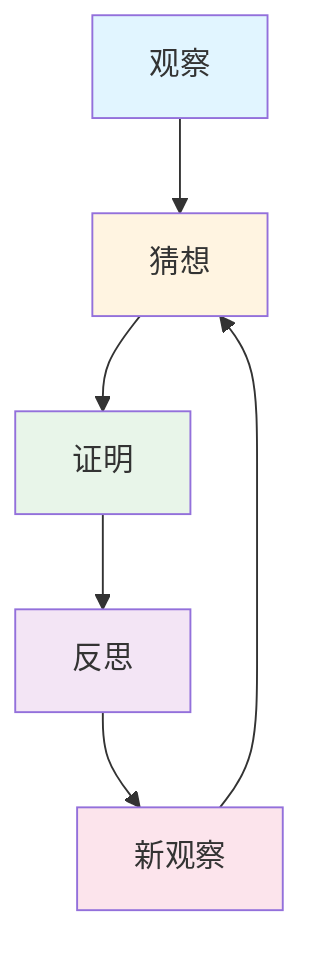
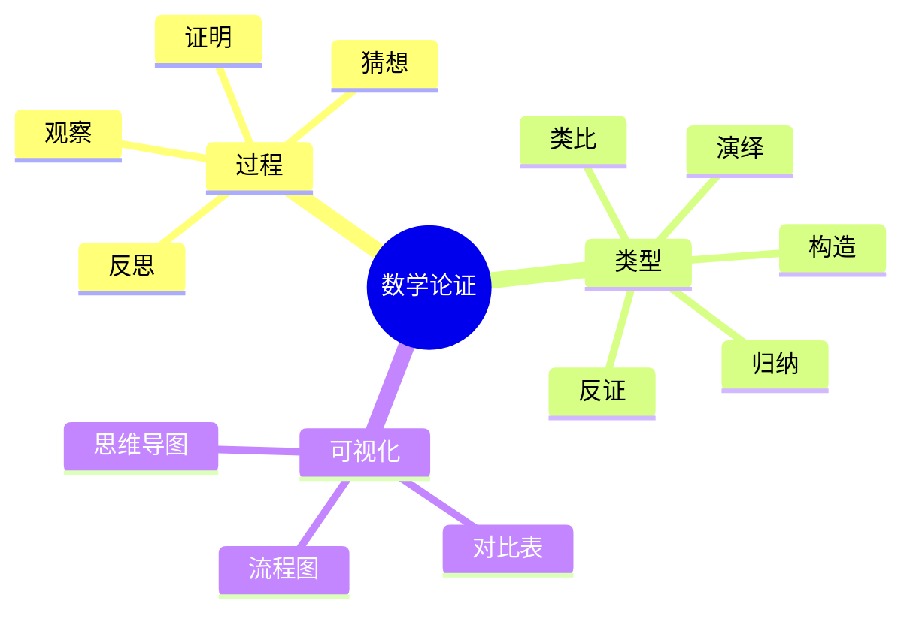

# 批量添加数学论证模板和指南 - 2025年11月28日

## 📋 概述

本文档旨在为FormalMath项目中33个核心概念的"数学家视角"部分添加"数学论证"提供模板和详细指南。此工作将遵循之前建立的数学论证过程分析框架，确保论证的完整性、逻辑性和可理解性。

**目标**:
1. 提供统一的"数学论证"内容结构模板
2. 指导如何为每个核心概念撰写高质量的数学论证
3. 确保论证内容符合观察、猜想、证明、反思四个步骤以及归纳、演绎、类比、反证、构造五种类型

---

## 🎯 一、数学论证内容结构模板 (编号: C.ARGUE.TEMPLATE.01)

以下是将在每个核心概念的`三视角版.md`文件中"数学家视角"部分新增的"数学论证"模块的结构。该部分应放在"数学解释"之后、"三视角整合"之前。

```markdown
## 🔍 数学论证：如何论证[概念名] (编号: C.CORE.XXX.06)

### 一、论证过程：从观察到反思

#### 1.1 观察（Observation）

**具体现象观察**：

- **现象1**：[描述观察到的具体数学现象]
  - 例如：[提供1-2个具体例子]
  - **为什么重要**：这个现象揭示了[概念]的某个重要特征
- **现象2**：[描述另一个观察到的现象]
  - 例如：[提供1-2个具体例子]
  - **为什么重要**：这个现象揭示了[概念]的另一个重要特征

**模式识别**：

- **模式1**：[识别出的数学模式]
  - 例如：[提供具体例子]
  - **为什么重要**：这个模式可能反映了[概念]的深层结构
- **模式2**：[识别出的另一个模式]
  - 例如：[提供具体例子]
  - **为什么重要**：这个模式可能反映了[概念]的另一个深层结构

**问题提出**：

- **问题1**：[基于观察提出的问题]
  - **为什么提出**：这个问题可能揭示[概念]的本质
- **问题2**：[基于观察提出的另一个问题]
  - **为什么提出**：这个问题可能揭示[概念]的另一个方面

#### 1.2 猜想（Conjecture）

**归纳猜想**：

- **猜想1**：[基于观察提出的归纳猜想]
  - **依据**：[说明猜想的依据]
  - **为什么提出**：这个猜想可能揭示[概念]的一般规律
- **猜想2**：[基于观察提出的另一个归纳猜想]
  - **依据**：[说明猜想的依据]
  - **为什么提出**：这个猜想可能揭示[概念]的另一个一般规律

**类比猜想**：

- **猜想1**：[基于类比提出的猜想]
  - **类比对象**：[说明与什么类比]
  - **为什么提出**：这个类比可能揭示[概念]的深层结构
- **猜想2**：[基于类比提出的另一个猜想]
  - **类比对象**：[说明与什么类比]
  - **为什么提出**：这个类比可能揭示[概念]的另一个深层结构

**直觉猜想**：

- **猜想1**：[基于数学直觉提出的猜想]
  - **直觉来源**：[说明直觉的来源]
  - **为什么提出**：这个直觉可能揭示[概念]的本质
- **猜想2**：[基于数学直觉提出的另一个猜想]
  - **直觉来源**：[说明直觉的来源]
  - **为什么提出**：这个直觉可能揭示[概念]的另一个本质

#### 1.3 证明（Proof）

**直接证明**：

- **证明1**：[直接证明某个猜想]
  - **证明思路**：[说明证明的主要思路]
  - **关键步骤**：[说明证明的关键步骤]
  - **为什么这样证明**：这个证明方法直接、清晰
- **证明2**：[直接证明另一个猜想]
  - **证明思路**：[说明证明的主要思路]
  - **关键步骤**：[说明证明的关键步骤]
  - **为什么这样证明**：这个证明方法直接、清晰

**间接证明**：

- **反证法**：[使用反证法证明某个猜想]
  - **假设**：[说明假设的内容]
  - **矛盾**：[说明导出的矛盾]
  - **为什么这样证明**：反证法适合证明否定性命题
- **构造法**：[使用构造法证明某个存在性命题]
  - **构造方法**：[说明构造的方法]
  - **验证**：[说明如何验证构造的正确性]
  - **为什么这样证明**：构造法适合证明存在性命题

**数学归纳法**：

- **归纳证明**：[使用数学归纳法证明某个命题]
  - **基础步骤**：[说明基础步骤]
  - **归纳步骤**：[说明归纳步骤]
  - **为什么这样证明**：数学归纳法适合证明关于自然数的命题

#### 1.4 反思（Reflection）

**过程回顾**：

- **论证回顾**：[回顾整个论证过程]
  - **成功之处**：[说明论证的成功之处]
  - **不足之处**：[说明论证的不足之处]
  - **改进方向**：[说明可能的改进方向]

**方法总结**：

- **证明方法**：[总结使用的证明方法]
  - **方法特点**：[说明方法的特点]
  - **适用范围**：[说明方法的适用范围]
- **证明技巧**：[总结使用的证明技巧]
  - **技巧要点**：[说明技巧的要点]
  - **应用场景**：[说明技巧的应用场景]

**理论意义**：

- **理论贡献**：[说明论证的理论贡献]
  - **为什么重要**：这个论证揭示了[概念]的某个重要方面
- **应用价值**：[说明论证的应用价值]
  - **为什么重要**：这个论证可以应用于[具体应用场景]

### 二、论证类型：多种推理方式

#### 2.1 归纳论证（Inductive Reasoning）

**不完全归纳**：

- **例子1**：[提供不完全归纳的例子]
  - **观察**：[说明观察到的现象]
  - **结论**：[说明得出的结论]
  - **局限性**：[说明不完全归纳的局限性]
- **例子2**：[提供另一个不完全归纳的例子]
  - **观察**：[说明观察到的现象]
  - **结论**：[说明得出的结论]
  - **局限性**：[说明不完全归纳的局限性]

**数学归纳法**：

- **例子1**：[提供数学归纳法的例子]
  - **命题**：[说明要证明的命题]
  - **证明**：[说明证明过程]
  - **为什么有效**：数学归纳法是严格的归纳证明
- **例子2**：[提供另一个数学归纳法的例子]
  - **命题**：[说明要证明的命题]
  - **证明**：[说明证明过程]
  - **为什么有效**：数学归纳法是严格的归纳证明

#### 2.2 演绎论证（Deductive Reasoning）

**三段论**：

- **例子1**：[提供三段论的例子]
  - **大前提**：[说明大前提]
  - **小前提**：[说明小前提]
  - **结论**：[说明结论]
  - **为什么有效**：三段论是严格的演绎推理
- **例子2**：[提供另一个三段论的例子]
  - **大前提**：[说明大前提]
  - **小前提**：[说明小前提]
  - **结论**：[说明结论]
  - **为什么有效**：三段论是严格的演绎推理

**假言推理**：

- **例子1**：[提供假言推理的例子]
  - **前提**：[说明前提]
  - **结论**：[说明结论]
  - **为什么有效**：假言推理是严格的演绎推理
- **例子2**：[提供另一个假言推理的例子]
  - **前提**：[说明前提]
  - **结论**：[说明结论]
  - **为什么有效**：假言推理是严格的演绎推理

#### 2.3 类比论证（Analogical Reasoning）

**结构类比**：

- **例子1**：[提供结构类比的例子]
  - **类比对象**：[说明类比的对象]
  - **相似性**：[说明相似性]
  - **结论**：[说明得出的结论]
  - **局限性**：[说明类比的局限性]
- **例子2**：[提供另一个结构类比的例子]
  - **类比对象**：[说明类比的对象]
  - **相似性**：[说明相似性]
  - **结论**：[说明得出的结论]
  - **局限性**：[说明类比的局限性]

**性质类比**：

- **例子1**：[提供性质类比的例子]
  - **类比对象**：[说明类比的对象]
  - **相似性**：[说明相似性]
  - **结论**：[说明得出的结论]
  - **局限性**：[说明类比的局限性]

#### 2.4 反证论证（Proof by Contradiction）

**反证法**：

- **例子1**：[提供反证法的例子]
  - **假设**：[说明假设的内容]
  - **矛盾**：[说明导出的矛盾]
  - **结论**：[说明得出的结论]
  - **为什么有效**：反证法是严格的间接证明
- **例子2**：[提供另一个反证法的例子]
  - **假设**：[说明假设的内容]
  - **矛盾**：[说明导出的矛盾]
  - **结论**：[说明得出的结论]
  - **为什么有效**：反证法是严格的间接证明

#### 2.5 构造论证（Constructive Reasoning）

**构造法**：

- **例子1**：[提供构造法的例子]
  - **构造方法**：[说明构造的方法]
  - **验证**：[说明如何验证构造的正确性]
  - **为什么有效**：构造法是严格的直接证明
- **例子2**：[提供另一个构造法的例子]
  - **构造方法**：[说明构造的方法]
  - **验证**：[说明如何验证构造的正确性]
  - **为什么有效**：构造法是严格的直接证明

### 三、论证可视化：用图形表示论证过程

#### 3.1 论证流程图



#### 3.2 论证类型对比

| 论证类型 | 特点 | 适用场景 | 优势 | 局限 |
|---------|------|---------|------|------|
| **归纳论证** | 从特殊到一般 | 发现规律、提出猜想 | 启发性强 | 结论或然 |
| **演绎论证** | 从一般到特殊 | 严格证明、逻辑推理 | 结论必然 | 需要前提 |
| **类比论证** | 基于相似性 | 启发思路、发现联系 | 创造性高 | 结论或然 |
| **反证论证** | 假设否定 | 证明否定性命题 | 间接有效 | 需要矛盾 |
| **构造论证** | 直接构造 | 证明存在性命题 | 直接明确 | 需要构造 |

#### 3.3 论证思维导图



---

## 🎯 二、撰写指南 (编号: C.ARGUE.GUIDE.01)

### 2.1 通用要求

- **完整性**：确保论证过程包含观察、猜想、证明、反思四个完整步骤
- **多样性**：确保论证类型涵盖归纳、演绎、类比、反证、构造等多种方式
- **逻辑性**：确保论证逻辑严密、推理清晰
- **可理解性**：确保论证过程易于理解，使用具体例子和清晰说明
- **历史性**：结合历史发展，展现论证的历史背景和演变过程

### 2.2 各步骤撰写要点

#### 2.2.1 观察

- **具体性**：提供具体的数学现象和例子
- **多样性**：涵盖不同类型的观察（计算、图形、实验等）
- **问题导向**：从观察中自然引出问题

#### 2.2.2 猜想

- **依据明确**：说明猜想的依据（观察、类比、直觉）
- **表述清晰**：猜想的表述要清晰、准确
- **可验证性**：猜想应该是可以验证的

#### 2.2.3 证明

- **思路清晰**：说明证明的主要思路
- **步骤完整**：提供完整的证明步骤或关键步骤
- **方法多样**：使用多种证明方法（直接、间接、归纳等）

#### 2.2.4 反思

- **全面性**：全面回顾论证过程
- **批判性**：指出论证的优缺点
- **前瞻性**：提出改进方向和应用价值

### 2.3 各类型撰写要点

#### 2.3.1 归纳论证

- **例子充分**：提供足够的例子支持归纳
- **模式明确**：明确识别出的模式
- **局限性说明**：说明不完全归纳的局限性

#### 2.3.2 演绎论证

- **前提明确**：明确说明前提
- **推理严格**：确保推理过程严格
- **结论必然**：说明结论的必然性

#### 2.3.3 类比论证

- **相似性明确**：明确说明类比对象的相似性
- **结论合理**：确保类比得出的结论合理
- **局限性说明**：说明类比的局限性

#### 2.3.4 反证论证

- **假设明确**：明确说明假设的内容
- **矛盾清晰**：清晰说明导出的矛盾
- **结论必然**：说明结论的必然性

#### 2.3.5 构造论证

- **构造方法明确**：明确说明构造的方法
- **验证完整**：完整验证构造的正确性
- **应用说明**：说明构造的应用价值

---

## 📝 三、插入位置 (编号: C.ARGUE.POSITION.01)

数学论证部分应插入在：

- **之前**：数学解释部分（`## 💡 数学解释`）
- **之后**：三视角整合部分（`## 🔗 三视角整合`）

具体位置：
```markdown
## 💡 数学解释：为什么[概念名]是这样定义的 (编号: C.CORE.XXX.05)
...
[数学解释内容]
...

---

## 🔍 数学论证：如何论证[概念名] (编号: C.CORE.XXX.06)
...
[数学论证内容]
...

---

## 🔗 三视角整合 (编号: C.CORE.XXX.07)
```

同时需要更新目录结构，在"数学解释"之后添加"数学论证"的链接。

---

## 📊 四、完成标准 (编号: C.ARGUE.STANDARD.01)

每个概念的数学论证部分应满足：

1. ✅ **完整性**：包含观察、猜想、证明、反思四个步骤
2. ✅ **多样性**：涵盖至少3种不同的论证类型
3. ✅ **具体性**：每个步骤都有具体的例子和说明
4. ✅ **逻辑性**：论证逻辑严密、推理清晰
5. ✅ **可视化**：包含流程图、对比表、思维导图等可视化内容
6. ✅ **历史性**：结合历史发展，展现论证的历史背景

---

**创建日期**: 2025年11月28日
**最后更新**: 2025年11月28日
**维护状态**: 持续更新中
