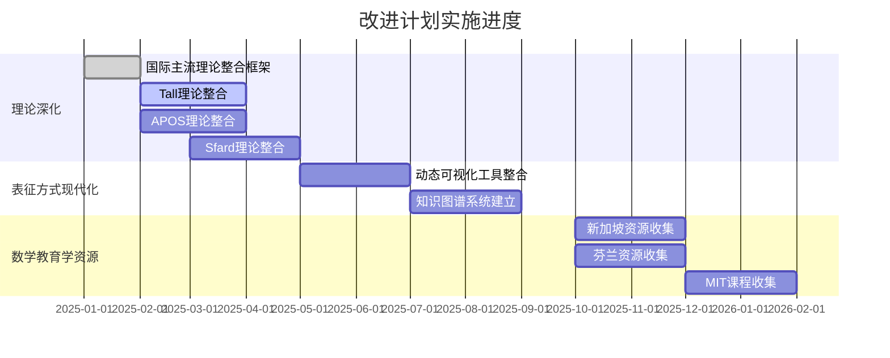

# 改进计划实施进度跟踪

**主题编号**: C.00.64
**创建日期**: 2025年1月
**最后更新**: 2025年1月
**状态**: 📋 跟踪中

---

## 📋 执行摘要

本文档跟踪FormalMath概念体系深度改进计划的实施进度，记录各项任务的完成情况、遇到的问题和下一步行动。

**跟踪原则**：
- **实时更新**：及时更新任务状态
- **问题记录**：记录遇到的问题和解决方案
- **进度可视化**：通过图表展示整体进度

---

## 📊 一、总体进度 (编号: C.00.64.01)

### 1.1 整体完成度

| 阶段 | 计划时间 | 当前状态 | 完成度 | 备注 |
|------|---------|---------|--------|------|
| **第一阶段：理论深化** | 3-4个月 | 🔄 进行中 | 10% | 框架文档已创建，3个示例已完成 |
| **第二阶段：表征方式现代化** | 4-5个月 | 📋 待开始 | 0% | - |
| **第三阶段：数学教育学资源整合** | 4-5个月 | 🔄 进行中 | 5% | 框架文档已创建，MIT资源已开始收集 |
| **第四阶段：权威资源整合** | 持续进行 | 📋 待开始 | 0% | - |

**总体完成度**：约6.5%（框架文档完成，4个示例创建，资源收集进展）

### 1.2 进度可视化

---

## ✅ 二、已完成工作 (编号: C.00.64.02)

### 2.1 文档创建（2025年1月）

1. ✅ **概念体系深度改进计划**（C.00.60）
   - 完成时间：2025年1月
   - 状态：✅ 已完成
   - 内容：详细的改进计划，包含9个主要章节

2. ✅ **权威资源调研报告**（C.00.61）
   - 完成时间：2025年1月
   - 状态：✅ 已完成
   - 内容：权威资源调研结果，包含7个主要部分

3. ✅ **国际主流数学认知理论整合框架**（C.00.62）
   - 完成时间：2025年1月
   - 状态：✅ 框架已创建
   - 内容：理论整合框架，包含10个章节

4. ✅ **数学教育学资源收集框架**（C.00.63）
   - 完成时间：2025年1月
   - 状态：✅ 框架已创建
   - 内容：资源收集框架，包含11个章节

### 2.2 计划更新（2025年1月）

1. ✅ **改进计划国际化调整**
   - 将CPFS结构理论定位为补充理论
   - 优先整合国际主流理论
   - 更新理论优先级

2. ✅ **数学教育学资源整合计划添加**
   - 添加新加坡数学教育资源整合计划
   - 添加芬兰、挪威数学教育资源整合计划
   - 添加著名大学和中小学课程整合计划

### 2.3 示例创建（2025年1月）

1. ✅ **集合概念的多理论分析示例**
   - 完成时间：2025年1月
   - 状态：✅ 已完成
   - 内容：运用5个国际主流理论分析集合概念
   - 价值：为其他32个核心概念提供分析模板

2. ✅ **函数概念的多理论分析示例**
   - 完成时间：2025年1月
   - 状态：✅ 已完成
   - 内容：运用5个国际主流理论分析函数概念
   - 价值：为其他31个核心概念提供分析参考

3. ✅ **自然数概念的多理论分析示例**
   - 完成时间：2025年1月
   - 状态：✅ 已完成
   - 内容：运用5个国际主流理论分析自然数概念
   - 价值：为其他30个核心概念提供分析参考

4. ✅ **群概念的多理论分析示例**
   - 完成时间：2025年1月
   - 状态：✅ 已完成
   - 内容：运用5个国际主流理论分析群概念
   - 价值：为其他29个核心概念提供分析参考，特别是抽象代数概念

---

## 📋 三、进行中工作 (编号: C.00.64.03)

### 3.1 理论整合框架构建

**当前任务**：国际主流数学认知理论整合框架

**进度**：
- ✅ 框架文档已创建
- ✅ 集合概念多理论分析示例已完成
- 📋 理论核心内容待补充
- 📋 剩余32个核心概念的多理论分析待开始

**下一步行动**：
1. 深入研读Tall三个世界理论核心文献
2. 深入研读Dubinsky APOS理论核心文献
3. 为更多核心概念建立多理论分析（已完成集合示例）

### 3.2 资源收集框架构建

**当前任务**：数学教育学资源收集框架

**进度**：
- ✅ 框架文档已创建
- ✅ MIT OCW数学课程资源索引已创建（6门课程）
- 📋 更多资源收集进行中
- 📋 资源索引持续建立

**下一步行动**：
1. 继续收集MIT OCW数学课程（目标10+门）
2. 访问新加坡教育部网站，收集课程大纲
3. 访问IB、AP官方网站，收集课程大纲
4. 创建Stanford、Harvard课程资源索引

---

## ⏳ 四、待开始工作 (编号: C.00.64.04)

### 4.1 理论深化阶段

1. **Tall三个世界理论整合**
   - 状态：📋 待开始
   - 预计时间：2-3个月
   - 优先级：高

2. **Dubinsky APOS理论整合**
   - 状态：📋 待开始
   - 预计时间：2-3个月
   - 优先级：高

3. **Sfard交流理论整合**
   - 状态：📋 待开始
   - 预计时间：1-2个月
   - 优先级：高

4. **Piaget认知发展理论整合**
   - 状态：📋 待开始
   - 预计时间：1-2个月
   - 优先级：高

5. **Vygotsky社会文化理论整合**
   - 状态：📋 待开始
   - 预计时间：1-2个月
   - 优先级：高

6. **CPFS结构理论补充整合**
   - 状态：📋 待开始
   - 预计时间：1-2个月
   - 优先级：中

### 4.2 表征方式现代化阶段

1. **动态可视化工具整合**
   - 状态：📋 待开始
   - 预计时间：2-3个月
   - 优先级：高

2. **知识图谱系统建立**
   - 状态：📋 待开始
   - 预计时间：3-4个月
   - 优先级：中

3. **交互式证明助手整合**
   - 状态：📋 待开始
   - 预计时间：2-3个月
   - 优先级：中

4. **多模态表达丰富**
   - 状态：📋 待开始
   - 预计时间：2-3个月
   - 优先级：中

### 4.3 数学教育学资源整合阶段

1. **新加坡数学教育资源整合**
   - 状态：📋 待开始
   - 预计时间：2-3个月
   - 优先级：高

2. **芬兰数学教育资源整合**
   - 状态：📋 待开始
   - 预计时间：2-3个月
   - 优先级：高

3. **挪威数学教育资源整合**
   - 状态：📋 待开始
   - 预计时间：1-2个月
   - 优先级：中

4. **著名大学数学课程整合**
   - 状态：📋 待开始
   - 预计时间：2-3个月
   - 优先级：高

5. **著名中小学数学课程整合**
   - 状态：📋 待开始
   - 预计时间：2-3个月
   - 优先级：高

6. **权威数学教育书籍整合**
   - 状态：📋 待开始
   - 预计时间：1-2个月
   - 优先级：中

---

## 🎯 五、本周重点任务 (编号: C.00.64.05)

### 5.1 理论整合（优先级：高）

1. **研读Tall三个世界理论核心文献**
   - 目标：深入理解三个世界理论
   - 产出：理论总结文档

2. **研读Dubinsky APOS理论核心文献**
   - 目标：深入理解APOS理论
   - 产出：理论总结文档

3. **为1-2个核心概念建立多理论分析示例**
   - 目标：验证多理论分析框架
   - 产出：示例分析文档

### 5.2 资源收集（优先级：高）

1. **收集MIT OCW数学课程列表**
   - 目标：建立MIT课程资源索引
   - 产出：课程列表文档

2. **收集新加坡数学教育课程大纲**
   - 目标：建立新加坡课程资源索引
   - 产出：课程大纲文档

3. **收集IB、AP课程大纲**
   - 目标：建立国际课程资源索引
   - 产出：课程大纲文档

---

## 📝 六、问题与挑战 (编号: C.00.64.06)

### 6.1 当前问题

1. **理论文献获取**：
   - 问题：需要获取国际主流理论的权威文献
   - 解决方案：通过学术数据库和官方网站获取

2. **资源访问**：
   - 问题：部分资源可能需要付费或特殊访问权限
   - 解决方案：优先收集免费公开资源，建立资源链接索引

3. **时间管理**：
   - 问题：改进计划涉及内容广泛，需要合理分配时间
   - 解决方案：按优先级分阶段实施，先完成高优先级任务

### 6.2 已解决问题

1. ✅ **理论优先级确定**：已明确国际主流理论优先，CPFS结构理论作为补充
2. ✅ **框架文档创建**：已创建理论整合框架和资源收集框架

---

## 📈 七、关键指标 (编号: C.00.64.07)

### 7.1 文档创建指标

| 指标 | 目标 | 当前 | 完成率 |
|------|------|------|--------|
| **框架文档** | 5个 | 4个 | 80% |
| **理论整合文档** | 6个 | 0个 | 0% |
| **资源收集文档** | 10+个 | 0个 | 0% |

### 7.2 理论整合指标

| 指标 | 目标 | 当前 | 完成率 |
|------|------|------|--------|
| **国际主流理论整合** | 6个 | 0个 | 0% |
| **核心概念多理论分析** | 33个 | 4个 | 12% |

### 7.3 资源收集指标

| 指标 | 目标 | 当前 | 完成率 |
|------|------|------|--------|
| **新加坡资源** | 20+ | 0 | 0% |
| **MIT课程** | 30+ | 0 | 0% |
| **IB/AP课程** | 18+ | 0 | 0% |

---

## 🔗 八、关联文档 (编号: C.00.64.08)

### 8.1 计划文档

- [概念体系深度改进计划](./00-概念体系深度改进计划-2025年1月.md)
- [权威资源调研报告](./00-权威资源调研报告-2025年1月.md)

### 8.2 框架文档

- [国际主流数学认知理论整合框架](./00-国际主流数学认知理论整合框架-2025年1月.md)
- [数学教育学资源收集框架](./00-数学教育学资源收集框架-2025年1月.md)

---

## ✅ 九、下一步行动 (编号: C.00.64.09)

### 9.1 本周行动（优先级：高）

1. ✅ **为"集合"概念建立多理论分析示例**（已完成）
2. **研读Tall三个世界理论核心文献**
3. **研读Dubinsky APOS理论核心文献**
4. **收集MIT OCW数学课程列表**
5. **为"函数"或"自然数"概念建立多理论分析示例**

### 9.2 本月行动（优先级：高）

1. **完成Tall三个世界理论整合方案设计**
2. **完成Dubinsky APOS理论整合方案设计**
3. **完成MIT OCW数学课程资源收集**
4. **完成新加坡数学教育课程大纲收集**

---

**创建日期**: 2025年1月
**最后更新**: 2025年1月
**维护状态**: 持续更新中
**状态**: 📋 跟踪中
