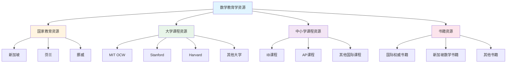

# 数学教育学资源收集框架

**主题编号**: C.00.63
**创建日期**: 2025年1月
**最后更新**: 2025年1月
**状态**: 📋 构建中

---

## 📋 执行摘要

本文档建立数学教育学资源的收集和整理框架，系统收集新加坡、芬兰、挪威等国际先进数学教育资源，以及MIT、Stanford等著名大学的数学教育课程，为FormalMath概念体系提供丰富的教育资源支持。

**收集原则**：
- **权威性优先**：优先收集权威机构和著名学校的资源
- **系统性收集**：系统收集课程大纲、教材、教学方法等
- **分类整理**：按国家、学校、课程类型分类整理

---

## 🎯 一、资源收集总览 (编号: C.00.63.01)

### 1.1 资源分类

| 资源类型 | 优先级 | 收集范围 | 预期数量 |
|---------|--------|---------|---------|
| **新加坡数学教育** | 高 | 课程大纲、教材、教学方法 | 20+ |
| **芬兰数学教育** | 高 | 课程标准、教师教育、教学方法 | 15+ |
| **挪威数学教育** | 中 | 综合科学课程、创新方法 | 10+ |
| **MIT数学课程** | 高 | OCW课程、课程大纲 | 30+ |
| **Stanford数学课程** | 高 | 在线课程、课程大纲 | 25+ |
| **Harvard数学课程** | 中 | 课程大纲、在线资源 | 20+ |
| **IB数学课程** | 高 | MYP、DP课程大纲 | 10+ |
| **AP数学课程** | 高 | 课程大纲、考试资源 | 8+ |
| **权威书籍** | 中 | 数学教育理论、实践指南 | 30+ |

### 1.2 收集框架



---

## 📚 二、新加坡数学教育资源 (编号: C.00.63.02)

### 2.1 课程大纲资源

**收集清单**：

1. **小学数学大纲**：
   - 《数学教学大纲（小一至小六）》（2021年）
   - 课程目标、主题与大概念
   - 课程结构

2. **中学数学大纲**：
   - 《中学数学大纲》（2020年）
   - 数学大概念：性质与关系、运算与算法、表征与交流、抽象与应用
   - 问题解决框架

**资源链接**：
- 新加坡教育部官方网站
- 相关学术论文和研究报告

### 2.2 教材和书籍资源

**收集清单**：

1. **教材系列**：
   - 《新加坡数学》系列教材
   - 《New Syllabus》系列
   - 各年级教材

2. **书籍资源**：
   - 《新加坡数学国际奥数思维训练》系列
   - 《新加坡数学教学研究及启示》
   - 其他相关书籍

**资源链接**：
- 出版社官方网站
- 在线书店
- 学术数据库

### 2.3 著名学校资源

**收集清单**：

1. **公教中学（Catholic High School）**：
   - 课程设置
   - 教学特色
   - 教学资源

2. **南洋初级学院（Nanyang Junior College）**：
   - 大学预科课程
   - 教学资源

3. **NUS附属数理中学**：
   - 六年制综合课程
   - 数学和科学教育特色

**资源链接**：
- 学校官方网站
- 相关研究报告

### 2.4 教师教育资源

**收集清单**：

1. **数学教育学专业课程**：
   - 课程设置
   - 教学和评价方法
   - 教师培养模式

2. **教师培训资源**：
   - 培训课程
   - 教学方法指导
   - 评价标准

**资源链接**：
- 新加坡国立教育学院
- 相关学术论文

---

## 🇫🇮 三、芬兰数学教育资源 (编号: C.00.63.03)

### 3.1 课程标准资源

**收集清单**：

1. **基础教育课程标准**（2016年改革）：
   - 核心素养：思维和学会学习、信息技术、社会参与和可持续发展
   - 数学课程目标
   - 课程内容安排

2. **高中数学课程标准**：
   - 课程目标
   - 内容结构
   - 评估标准

**资源链接**：
- 芬兰教育部官方网站
- 相关研究报告

### 3.2 教师教育资源

**收集清单**：

1. **综合性大学教师教育**：
   - "整全教育者"培养模式
   - 跨学科教学和通识教育
   - 课程设置

2. **教师培训资源**：
   - 培训课程
   - 教学方法
   - 评价标准

**资源链接**：
- 赫尔辛基大学
- 阿尔托大学
- 相关研究报告

### 3.3 著名大学资源

**收集清单**：

1. **赫尔辛基大学**：
   - 数学与统计学系课程
   - 数学教育相关课程
   - 在线资源

2. **阿尔托大学**：
   - 理学院数学课程
   - 数学教育相关课程

**资源链接**：
- 大学官方网站
- 课程目录
- 在线课程平台

---

## 🇳🇴 四、挪威数学教育资源 (编号: C.00.63.04)

### 4.1 综合科学课程资源

**收集清单**：

1. **综合科学课程设计**：
   - 数学与物理、化学等学科的整合
   - 跨学科教学方法
   - 课程大纲

2. **创新教学方法**：
   - 基于游戏的数学学习
   - 计算论文（Computational Essays）
   - 创造性学习方法

**资源链接**：
- 挪威教育部官方网站
- 相关学术论文

### 4.2 著名大学资源

**收集清单**：

1. **奥斯陆大学**：
   - 数学系课程
   - 数学教育相关课程

2. **挪威科技大学（NTNU）**：
   - 数学系课程
   - 应用数学课程

**资源链接**：
- 大学官方网站
- 课程目录

---

## 🎓 五、著名大学数学课程资源 (编号: C.00.63.05)

### 5.1 MIT（麻省理工学院）

**收集清单**：

1. **MIT OpenCourseWare（OCW）**：
   - 数学系所有课程
   - 课程大纲和讲义
   - 作业和考试
   - 视频讲座

2. **重点课程**：
   - 18.01单变量微积分
   - 18.02多变量微积分
   - 18.03微分方程
   - 18.06线性代数
   - 其他数学课程

**资源链接**：
- MIT OCW官方网站：https://ocw.mit.edu/
- MIT数学系网站

### 5.2 Stanford（斯坦福大学）

**收集清单**：

1. **数学系课程**：
   - 本科数学课程
   - 研究生数学课程
   - 数学教育相关课程

2. **在线课程**：
   - Stanford在线课程平台
   - 课程视频和资料

**资源链接**：
- Stanford数学系网站
- Stanford在线课程平台

### 5.3 Harvard（哈佛大学）

**收集清单**：

1. **数学系课程**：
   - 本科数学课程
   - 研究生数学课程
   - 数学教育相关课程

2. **在线资源**：
   - 课程大纲
   - 在线课程

**资源链接**：
- Harvard数学系网站
- Harvard在线课程平台

### 5.4 其他著名大学

**收集清单**：

1. **Princeton、Yale、Cambridge、Oxford等**：
   - 数学系课程
   - 在线资源

**资源链接**：
- 各大学官方网站
- 课程目录

---

## 🏫 六、著名中小学数学课程资源 (编号: C.00.63.06)

### 6.1 IB（国际文凭）课程

**收集清单**：

1. **IB MYP（中学项目）**：
   - 数学课程大纲
   - 评估标准
   - 教学资源

2. **IB DP（大学预科项目）**：
   - 数学课程大纲（分析与方法、应用与解释）
   - 评估标准
   - 考试资源

**资源链接**：
- IB官方网站：https://www.ibo.org/
- IB数学课程页面

### 6.2 AP（大学先修）课程

**收集清单**：

1. **AP数学课程**：
   - AP微积分AB
   - AP微积分BC
   - AP统计学
   - AP计算机科学A

2. **课程资源**：
   - 课程大纲
   - 考试资源
   - 教学资源

**资源链接**：
- College Board官方网站：https://apcentral.collegeboard.org/
- AP数学课程页面

### 6.3 其他国际课程

**收集清单**：

1. **A-Level数学课程**（英国）：
   - 课程大纲
   - 考试资源

2. **其他国际课程体系**

**资源链接**：
- 各课程体系官方网站

---

## 📖 七、权威数学教育书籍资源 (编号: C.00.63.07)

### 7.1 国际权威书籍

**收集清单**：

1. **数学教育理论经典**：
   - Tall相关著作
   - Dubinsky相关著作
   - Sfard相关著作
   - 其他理论著作

2. **数学教学方法书籍**：
   - 问题解决教学
   - 数学建模教学
   - 其他教学方法

3. **数学课程设计书籍**：
   - 课程设计理论
   - 课程实施指南

**资源链接**：
- 学术出版社
- 在线书店
- 学术数据库

### 7.2 新加坡数学书籍

**收集清单**：

1. **教材系列**：
   - 《新加坡数学》系列
   - 各年级教材

2. **教学资源**：
   - 《新加坡数学国际奥数思维训练》系列
   - 其他教学资源

**资源链接**：
- 出版社官方网站
- 在线书店

---

## 📊 八、资源整理框架 (编号: C.00.63.08)

### 8.1 资源分类体系

```
数学教育学资源/
├── 01-国家教育资源/
│   ├── 01-新加坡/
│   │   ├── 课程大纲/
│   │   ├── 教材资源/
│   │   ├── 学校资源/
│   │   └── 教师教育/
│   ├── 02-芬兰/
│   │   ├── 课程标准/
│   │   ├── 教师教育/
│   │   └── 大学资源/
│   └── 03-挪威/
│       ├── 综合科学课程/
│       └── 大学资源/
├── 02-大学课程资源/
│   ├── 01-MIT/
│   ├── 02-Stanford/
│   ├── 03-Harvard/
│   └── 04-其他大学/
├── 03-中小学课程资源/
│   ├── 01-IB课程/
│   ├── 02-AP课程/
│   └── 03-其他国际课程/
└── 04-书籍资源/
    ├── 01-国际权威书籍/
    └── 02-新加坡数学书籍/
```

### 8.2 资源索引文档

**为每类资源创建索引文档**：
- 资源列表
- 资源链接
- 资源描述
- 资源评价

---

## ✅ 九、收集进度跟踪 (编号: C.00.63.09)

### 9.1 收集状态

| 资源类型 | 计划数量 | 已收集 | 完成率 | 状态 |
|---------|---------|--------|--------|------|
| **新加坡数学教育** | 20+ | 0 | 0% | 📋 待开始 |
| **芬兰数学教育** | 15+ | 0 | 0% | 📋 待开始 |
| **挪威数学教育** | 10+ | 0 | 0% | 📋 待开始 |
| **MIT数学课程** | 30+ | 0 | 0% | 📋 待开始 |
| **Stanford数学课程** | 25+ | 0 | 0% | 📋 待开始 |
| **Harvard数学课程** | 20+ | 0 | 0% | 📋 待开始 |
| **IB数学课程** | 10+ | 0 | 0% | 📋 待开始 |
| **AP数学课程** | 8+ | 0 | 0% | 📋 待开始 |
| **权威书籍** | 30+ | 0 | 0% | 📋 待开始 |

### 9.2 收集计划

**第一阶段（1个月内）**：
- 完成新加坡数学教育课程大纲收集
- 完成MIT OCW数学课程收集
- 完成IB、AP课程大纲收集

**第二阶段（2-3个月内）**：
- 完成芬兰、挪威数学教育资源收集
- 完成Stanford、Harvard数学课程收集
- 完成权威书籍收集

---

## 🔗 十、关联文档 (编号: C.00.63.10)

### 10.1 相关计划文档

- [概念体系深度改进计划](./00-概念体系深度改进计划-2025年1月.md)
- [权威资源调研报告](./00-权威资源调研报告-2025年1月.md)

---

## ✅ 十一、下一步行动 (编号: C.00.63.11)

### 11.1 立即行动

1. **访问MIT OCW网站，收集数学课程列表**
2. **访问新加坡教育部网站，收集课程大纲**
3. **访问IB、AP官方网站，收集课程大纲**

### 11.2 短期计划（1个月内）

1. **完成MIT OCW数学课程资源收集**
2. **完成新加坡数学教育课程大纲收集**
3. **完成IB、AP课程大纲收集**
4. **建立资源索引文档**

---

**创建日期**: 2025年1月
**最后更新**: 2025年1月
**维护状态**: 持续更新中
**状态**: 📋 构建中
