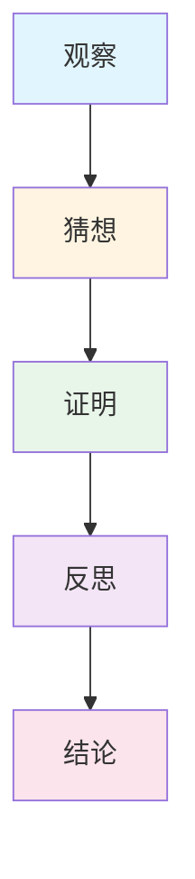
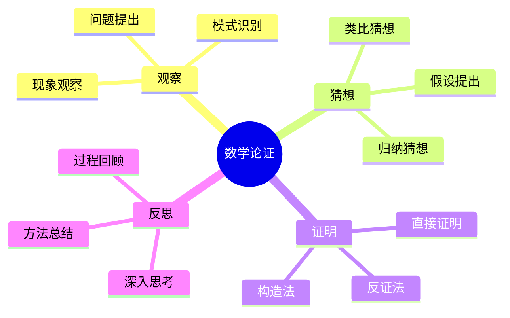

# 数学论证工具与模板

**创建日期**: 2025年11月28日
**最后更新**: 2025年11月28日
**状态**: ✅ 工具和模板完成

---

## 📋 概述

本文档提供数学论证的工具、模板、检查清单和质量标准，用于指导FormalMath项目核心概念文件的数学论证部分编写。

---

## 🎯 一、数学论证模板

### 1.1 完整模板

```markdown
## 🔍 数学论证：如何论证[概念名称] (编号: C.CORE.XXX.06)

### 1. 论证过程（Argumentation Process）

#### 1.1 观察（Observation）

**现象观察**：
- **观察1**：[描述观察到的现象]
- **观察2**：[描述观察到的现象]
- **观察3**：[描述观察到的现象]

**模式识别**：
- **模式1**：[识别的模式]
- **模式2**：[识别的模式]
- **模式3**：[识别的模式]

**问题提出**：
- **问题1**：[提出的问题]
- **问题2**：[提出的问题]
- **问题3**：[提出的问题]

#### 1.2 猜想（Conjecture）

**归纳猜想**：
- **猜想1**：[基于观察的猜想]
- **猜想2**：[基于模式的猜想]
- **猜想3**：[基于问题的猜想]

**类比猜想**：
- **类比对象**：[类比的对象]
- **类比猜想**：[基于类比的猜想]
- **类比理由**：[类比的合理性]

**假设提出**：
- **假设1**：[提出的假设]
- **假设2**：[提出的假设]
- **假设3**：[提出的假设]

#### 1.3 证明（Proof）

**直接证明**：
- **证明目标**：[证明的目标]
- **证明步骤**：[详细的证明步骤]
- **证明结论**：[证明的结论]

**反证法**：
- **假设**：[假设的否定]
- **推导**：[推导过程]
- **矛盾**：[得出的矛盾]
- **结论**：[证明的结论]

**构造法**：
- **构造目标**：[构造的目标]
- **构造过程**：[构造的过程]
- **验证**：[验证构造的正确性]

#### 1.4 反思（Reflection）

**过程回顾**：
- **成功之处**：[成功的地方]
- **困难之处**：[困难的地方]
- **改进之处**：[可以改进的地方]

**方法总结**：
- **关键方法**：[关键的方法]
- **适用条件**：[适用的条件]
- **推广价值**：[推广的价值]

**深入思考**：
- **未解决问题**：[未解决的问题]
- **研究方向**：[研究方向]
- **理论意义**：[理论意义]

### 2. 论证类型（Argumentation Types）

#### 2.1 归纳论证（Inductive Reasoning）

**特点**：
- 从特殊到一般
- 基于观察和实验
- 结论具有或然性

**应用**：
- [说明归纳论证的应用]

**例子**：
- [提供归纳论证的例子]

#### 2.2 演绎论证（Deductive Reasoning）

**特点**：
- 从一般到特殊
- 基于逻辑推理
- 结论具有必然性

**应用**：
- [说明演绎论证的应用]

**例子**：
- [提供演绎论证的例子]

#### 2.3 类比论证（Analogical Reasoning）

**特点**：
- 基于相似性
- 从已知到未知
- 结论具有启发性

**应用**：
- [说明类比论证的应用]

**例子**：
- [提供类比论证的例子]

#### 2.4 反证法（Proof by Contradiction）

**特点**：
- 假设否定结论
- 推导出矛盾
- 证明原结论

**应用**：
- [说明反证法的应用]

**例子**：
- [提供反证法的例子]

#### 2.5 构造法（Constructive Reasoning）

**特点**：
- 直接构造对象
- 验证构造正确性
- 证明存在性

**应用**：
- [说明构造法的应用]

**例子**：
- [提供构造法的例子]

### 3. 论证可视化（Argumentation Visualization）

#### 3.1 论证流程图



#### 3.2 论证类型对比表

| 论证类型 | 特点 | 适用场景 | 优势 | 局限 |
|---------|------|---------|------|------|
| **归纳论证** | 从特殊到一般 | 发现规律 | 直观易懂 | 结论或然 |
| **演绎论证** | 从一般到特殊 | 严格证明 | 结论必然 | 需要前提 |
| **类比论证** | 基于相似性 | 启发思考 | 富有启发性 | 结论不确定 |
| **反证法** | 假设否定 | 证明否定 | 简洁有力 | 需要矛盾 |
| **构造法** | 直接构造 | 存在性证明 | 具体明确 | 构造困难 |

#### 3.3 论证思维导图



---

## 🎯 二、数学论证检查清单

### 2.1 内容完整性检查

- [ ] **论证过程部分**：
  - [ ] 包含观察阶段
  - [ ] 包含猜想阶段
  - [ ] 包含证明阶段
  - [ ] 包含反思阶段
  - [ ] 每个阶段都有充分内容

- [ ] **论证类型部分**：
  - [ ] 包含至少3种论证类型
  - [ ] 说明每种论证类型的特点
  - [ ] 提供每种论证类型的应用
  - [ ] 提供每种论证类型的例子

- [ ] **论证可视化部分**：
  - [ ] 包含论证流程图
  - [ ] 包含论证类型对比表
  - [ ] 包含论证思维导图
  - [ ] 可视化清晰有效

### 2.2 质量检查

- [ ] **准确性**：
  - [ ] 观察准确
  - [ ] 猜想合理
  - [ ] 证明严格
  - [ ] 反思深入

- [ ] **完整性**：
  - [ ] 论证过程完整
  - [ ] 论证类型多样
  - [ ] 可视化完整
  - [ ] 没有遗漏重要内容

- [ ] **清晰性**：
  - [ ] 语言清晰
  - [ ] 结构清晰
  - [ ] 逻辑清晰
  - [ ] 可视化清晰

- [ ] **严格性**：
  - [ ] 证明严格
  - [ ] 推理正确
  - [ ] 结论可靠
  - [ ] 方法有效

---

## 🎯 三、数学论证质量标准

### 3.1 优秀标准

**内容质量**：
- ✅ 四个阶段都有丰富的内容
- ✅ 论证类型多样且恰当
- ✅ 证明严格准确
- ✅ 反思深入全面

**结构质量**：
- ✅ 结构清晰有序
- ✅ 层次分明
- ✅ 逻辑连贯
- ✅ 格式统一

**教学价值**：
- ✅ 有助于理解论证过程
- ✅ 有助于掌握论证方法
- ✅ 有助于培养论证能力
- ✅ 有助于发展数学思维

### 3.2 良好标准

**内容质量**：
- ✅ 四个阶段都有基本内容
- ✅ 论证类型基本多样
- ✅ 证明基本严格
- ✅ 反思基本深入

**结构质量**：
- ✅ 结构基本清晰
- ✅ 层次基本分明
- ✅ 逻辑基本连贯
- ✅ 格式基本统一

**教学价值**：
- ✅ 基本有助于理解
- ✅ 基本有助于掌握
- ✅ 基本有助于培养

### 3.3 需要改进

**内容质量**：
- ⚠️ 某个阶段内容不足
- ⚠️ 论证类型不够多样
- ⚠️ 证明不够严格
- ⚠️ 反思不够深入

**结构质量**：
- ⚠️ 结构不够清晰
- ⚠️ 层次不够分明
- ⚠️ 逻辑不够连贯
- ⚠️ 格式不够统一

**教学价值**：
- ⚠️ 理解效果不佳
- ⚠️ 掌握效果不佳
- ⚠️ 培养效果不佳

---

## 🎯 四、数学论证工具

### 4.1 观察工具

**工具说明**：
- 用于系统观察现象
- 识别模式和规律
- 提出有意义的问题

**使用步骤**：
1. 确定观察对象
2. 系统收集数据
3. 识别模式和规律
4. 提出有意义的问题

**观察模板**：
```markdown
**观察对象**：[观察的对象]
- **现象1**：[观察到的现象]
- **现象2**：[观察到的现象]
- **模式**：[识别的模式]
- **问题**：[提出的问题]
```

### 4.2 猜想工具

**工具说明**：
- 用于生成合理猜想
- 基于观察和模式
- 考虑类比和假设

**使用步骤**：
1. 分析观察结果
2. 识别模式和规律
3. 提出初步猜想
4. 验证猜想的合理性

**猜想模板**：
```markdown
**猜想**：[猜想的表述]
- **依据**：[猜想的依据]
- **合理性**：[猜想的合理性]
- **验证方法**：[验证的方法]
```

### 4.3 证明工具

**工具说明**：
- 用于进行严格证明
- 选择合适的证明方法
- 确保证明的严格性

**使用步骤**：
1. 明确证明目标
2. 选择证明方法
3. 执行证明步骤
4. 检查证明正确性

**证明模板**：
```markdown
**证明目标**：[证明的目标]
- **证明方法**：[选择的证明方法]
- **证明步骤**：[详细的证明步骤]
- **证明结论**：[证明的结论]
```

### 4.4 反思工具

**工具说明**：
- 用于深入反思论证过程
- 总结方法和经验
- 发现问题和改进方向

**使用步骤**：
1. 回顾论证过程
2. 总结成功经验
3. 发现问题和困难
4. 提出改进方向

**反思模板**：
```markdown
**过程回顾**：[回顾论证过程]
- **成功之处**：[成功的地方]
- **困难之处**：[困难的地方]
- **改进方向**：[改进的方向]
```

---

## 🎯 五、数学论证最佳实践

### 5.1 编写建议

**1. 从观察开始**：
- 仔细观察现象
- 识别模式和规律
- 提出有意义的问题

**2. 合理猜想**：
- 基于观察提出猜想
- 考虑类比和假设
- 验证猜想的合理性

**3. 严格证明**：
- 选择合适的证明方法
- 执行严格的证明步骤
- 确保证明的正确性

**4. 深入反思**：
- 回顾论证过程
- 总结方法和经验
- 发现问题和改进方向

### 5.2 常见问题

**问题1**：如何选择合适的证明方法？

**解决方案**：
- 根据问题类型选择
- 根据已知条件选择
- 根据证明目标选择

**问题2**：如何确保证明的严格性？

**解决方案**：
- 使用严格的逻辑推理
- 检查每一步的正确性
- 确保结论的可靠性

**问题3**：如何平衡直观和严格？

**解决方案**：
- 在观察和猜想中强调直观
- 在证明中强调严格
- 在反思中整合两者

---

## 🎯 六、数学论证评估工具

### 6.1 自我评估

**评估项目**：
- [ ] 内容是否完整
- [ ] 内容是否准确
- [ ] 内容是否清晰
- [ ] 证明是否严格
- [ ] 结构是否合理

**评估方法**：
- 使用检查清单
- 使用质量标准
- 进行同行评审

### 6.2 同行评估

**评估项目**：
- [ ] 内容质量
- [ ] 证明严格性
- [ ] 结构质量
- [ ] 教学价值

**评估方法**：
- 提供评估表格
- 收集反馈意见
- 进行改进

### 6.3 用户评估

**评估项目**：
- [ ] 理解效果
- [ ] 掌握效果
- [ ] 应用效果
- [ ] 满意度

**评估方法**：
- 用户调查
- 使用反馈
- 效果评估

---

## 🎯 七、数学论证资源

### 7.1 参考资源

**理论资源**：
- 数学证明理论
- 逻辑推理理论
- 论证理论

**实践资源**：
- 证明案例
- 论证方法
- 研究论文

**工具资源**：
- 证明模板
- 论证方法库
- 例子库

### 7.2 学习资源

**学习材料**：
- 数学论证理论
- 编写指南
- 最佳实践

**培训资源**：
- 培训课程
- 工作坊
- 研讨会

---

## 🎯 八、总结

### 8.1 核心要点

1. **模板**：提供完整的论证模板
2. **检查清单**：提供内容完整性和质量检查清单
3. **质量标准**：提供优秀、良好、需要改进的标准
4. **工具**：提供观察、猜想、证明、反思工具
5. **最佳实践**：提供编写建议和常见问题解决方案
6. **评估工具**：提供自我评估、同行评估、用户评估工具

### 8.2 使用建议

1. **使用模板**：使用模板编写数学论证部分
2. **使用检查清单**：编写完成后使用检查清单检查
3. **使用质量标准**：使用质量标准评估内容质量
4. **使用工具**：使用工具进行观察、猜想、证明、反思
5. **遵循最佳实践**：遵循编写建议和最佳实践
6. **进行评估**：进行自我评估、同行评估、用户评估

---

**创建日期**: 2025年11月28日
**最后更新**: 2025年11月28日
**状态**: ✅ 工具和模板完成
