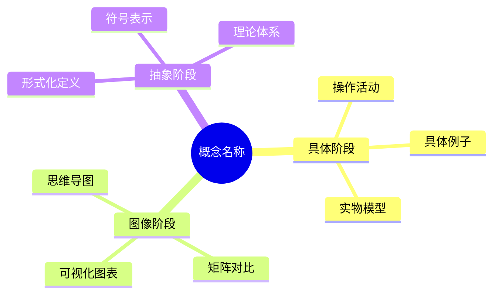

# 新加坡数学教育方法应用指南

**创建日期**: 2025年11月28日
**最后更新**: 2025年11月28日
**状态**: ✅ 应用指南完成

---

## 📋 概述

本文档提供将新加坡数学教育方法（特别是CPA方法和问题解决模型）应用到FormalMath项目核心概念文件中的具体指南。

---

## 🎯 一、CPA方法在核心概念文件中的应用

### 1.1 在"直观理解"部分应用具体阶段

#### 1.1.1 添加操作活动

**建议格式**：

```markdown
### 操作活动：理解[概念名称]

**活动目标**：通过具体操作理解[概念名称]的本质

**活动材料**：
- [列出所需材料]

**活动步骤**：
1. [步骤1]
2. [步骤2]
3. [步骤3]

**活动反思**：
- 通过这个活动，你发现了什么？
- [概念名称]的本质是什么？
```

**具体例子（集合概念）**：

```markdown
### 操作活动：理解集合

**活动目标**：通过具体操作理解集合的本质

**活动材料**：
- 不同颜色的积木
- 分类盒

**活动步骤**：
1. 将积木按颜色分类
2. 观察每一类积木的共同特征
3. 理解"集合"是"具有共同特征的事物的整体"

**活动反思**：
- 通过这个活动，你发现了什么？
- 集合的本质是什么？
```

#### 1.1.2 添加具体例子

**建议格式**：

```markdown
**具体例子1**：[例子名称]
- **情境**：[描述具体情境]
- **操作**：[描述具体操作]
- **理解**：[说明如何通过操作理解概念]
```

### 1.2 在"思维表征"部分应用图像阶段

#### 1.2.1 增强思维导图

**建议**：
- 使用Mermaid思维导图
- 包含具体-图像-抽象的层次
- 展示概念的多重表征

**示例结构**：



#### 1.2.2 增强矩阵对比

**建议**：
- 对比具体、图像、抽象三种表征方式
- 说明每种方式的优势和局限
- 提供使用建议

**示例表格**：

| 表征方式 | 特点 | 方法 | 工具 | 适用阶段 | 优势 | 局限 |
|---------|------|------|------|---------|------|------|
| **具体表征** | 具体、可操作 | 实物操作、动手实践 | 教具、学具 | 入门阶段 | 易于理解 | 不够抽象 |
| **图像表征** | 视觉、直观 | 图表、图形、模型 | 思维导图、图表工具 | 中级阶段 | 直观清晰 | 不够严格 |
| **抽象表征** | 符号、形式化 | 符号操作、逻辑推理 | 数学符号、公式 | 高级阶段 | 严格准确 | 不够具体 |

### 1.3 在"形式化定义"部分应用抽象阶段

#### 1.3.1 渐进式定义

**建议格式**：

```markdown
### 渐进式定义

**第一步：直观定义（具体阶段）**
[使用自然语言描述概念]

**第二步：操作定义（图像阶段）**
[使用操作和图像描述概念]

**第三步：形式化定义（抽象阶段）**
[使用数学符号和公式定义概念]
```

### 1.4 CPA方法的三阶段转换

#### 1.4.1 添加转换指南

**建议格式**：

```markdown
### CPA方法三阶段转换指南

**从具体到图像**：
- **转换条件**：[说明何时可以转换]
- **转换方法**：[说明如何转换]
- **转换标志**：[说明转换成功的标志]

**从图像到抽象**：
- **转换条件**：[说明何时可以转换]
- **转换方法**：[说明如何转换]
- **转换标志**：[说明转换成功的标志]

**灵活转换**：
- **根据需要转换**：[说明何时需要回到上一阶段]
- **多阶段并存**：[说明如何同时使用多个阶段]
```

---

## 🎯 二、问题解决模型在数学论证部分的应用

### 2.1 在"观察"部分应用"理解问题"

#### 2.1.1 增强问题分析

**建议格式**：

```markdown
#### 1.1 观察（Observation）

**问题理解**：
- **问题情境**：[描述问题情境]
- **已知信息**：[列出已知信息]
- **未知信息**：[列出未知信息]
- **问题要求**：[明确问题要求]

**问题分析**：
- **问题类型**：[识别问题类型]
- **关键要素**：[识别关键要素]
- **关系理解**：[理解各要素之间的关系]
```

### 2.2 在"猜想"部分应用"制定计划"

#### 2.2.1 增强策略选择

**建议格式**：

```markdown
#### 1.2 猜想（Conjecture）

**策略选择**：
- **可用策略**：[列出可用的解决策略]
- **策略选择**：[说明选择的策略]
- **选择理由**：[说明选择理由]

**计划制定**：
- **解决步骤**：[列出详细的解决步骤]
- **预期结果**：[预测可能的结果]
- **备选方案**：[准备备选方案]
```

### 2.3 在"证明"部分应用"执行计划"

#### 2.3.1 增强过程记录

**建议格式**：

```markdown
#### 1.3 证明（Proof）

**证明计划**：
- **证明目标**：[明确证明目标]
- **证明步骤**：[列出证明步骤]
- **关键技巧**：[说明关键技巧]

**证明执行**：
- **步骤1**：[详细记录步骤1]
- **步骤2**：[详细记录步骤2]
- **步骤3**：[详细记录步骤3]

**中间检查**：
- **检查点1**：[检查中间结果1]
- **检查点2**：[检查中间结果2]
```

### 2.4 在"反思"部分应用"检查答案"

#### 2.4.1 增强验证和反思

**建议格式**：

```markdown
#### 1.4 反思（Reflection）

**答案验证**：
- **结果验证**：[验证结果的合理性]
- **过程检查**：[检查证明过程的正确性]
- **方法验证**：[用不同方法验证]

**策略反思**：
- **策略有效性**：[评估策略的有效性]
- **策略改进**：[提出策略改进建议]
- **方法总结**：[总结可复用的方法]
```

---

## 🎯 三、螺旋式课程设计在核心概念文件中的应用

### 3.1 知识层次标注

#### 3.1.1 添加层次标识

**建议格式**：

```markdown
## 知识层次

### L0基础层：直观理解
[基础层内容]

### L1中级层：严格定义
[中级层内容]

### L2高级层：深入定理
[高级层内容]

### L3研究层：开放问题
[研究层内容]
```

### 3.2 螺旋路径说明

#### 3.2.1 添加螺旋路径

**建议格式**：

```markdown
## 螺旋式学习路径

**第一次出现（L0基础层）**：
- **阶段**：[说明出现阶段]
- **内容**：[说明学习内容]
- **目标**：[说明学习目标]

**第二次出现（L1中级层）**：
- **阶段**：[说明出现阶段]
- **内容**：[说明学习内容]
- **目标**：[说明学习目标]

**第三次出现（L2高级层）**：
- **阶段**：[说明出现阶段]
- **内容**：[说明学习内容]
- **目标**：[说明学习目标]
```

---

## 🎯 四、具体应用示例

### 4.1 集合概念的应用示例

#### 4.1.1 直观理解部分（具体阶段）

```markdown
### 操作活动：理解集合

**活动目标**：通过具体操作理解集合的本质

**活动材料**：
- 不同颜色的积木（红色、蓝色、绿色）
- 分类盒

**活动步骤**：
1. 将所有积木混合在一起
2. 按颜色将积木分类
3. 观察每一类积木的共同特征
4. 理解"集合"是"具有共同特征的事物的整体"

**活动反思**：
- 通过这个活动，你发现了什么？
- 集合的本质是什么？
- 如何判断一个物体是否属于某个集合？
```

#### 4.1.2 思维表征部分（图像阶段）

```markdown
### 5.1 思维导图：集合的知识结构

[包含具体-图像-抽象三个层次的思维导图]

### 5.2 矩阵对比：不同表征方式的对比

[对比具体、图像、抽象三种表征方式]
```

#### 4.1.3 形式化定义部分（抽象阶段）

```markdown
### 渐进式定义

**第一步：直观定义（具体阶段）**
集合是具有共同特征的事物的整体。

**第二步：操作定义（图像阶段）**
集合可以通过分类操作来理解：将具有共同特征的事物归为一类。

**第三步：形式化定义（抽象阶段）**
集合是一个数学对象，满足ZFC公理体系。
```

### 4.2 函数概念的应用示例

#### 4.2.1 直观理解部分（具体阶段）

```markdown
### 操作活动：理解函数

**活动目标**：通过具体操作理解函数的本质

**活动材料**：
- 函数机器模型
- 输入卡片
- 输出卡片

**活动步骤**：
1. 将数字卡片放入函数机器
2. 观察输出的数字
3. 理解函数是"输入-输出"的关系
4. 发现每个输入对应唯一的输出

**活动反思**：
- 通过这个活动，你发现了什么？
- 函数的本质是什么？
- 如何判断一个关系是否是函数？
```

---

## 🎯 五、实施检查清单

### 5.1 CPA方法应用检查清单

- [ ] **具体阶段**：
  - [ ] 添加操作活动
  - [ ] 提供具体例子
  - [ ] 使用实物和教具说明

- [ ] **图像阶段**：
  - [ ] 使用思维导图
  - [ ] 使用矩阵对比
  - [ ] 使用可视化工具

- [ ] **抽象阶段**：
  - [ ] 提供形式化定义
  - [ ] 进行严格证明
  - [ ] 建立理论体系

- [ ] **三阶段转换**：
  - [ ] 说明转换条件
  - [ ] 说明转换方法
  - [ ] 说明转换标志

### 5.2 问题解决模型应用检查清单

- [ ] **理解问题**：
  - [ ] 分析问题情境
  - [ ] 识别已知和未知
  - [ ] 理解问题要求

- [ ] **制定计划**：
  - [ ] 选择解决策略
  - [ ] 制定解决步骤
  - [ ] 预测可能结果

- [ ] **执行计划**：
  - [ ] 按计划执行
  - [ ] 记录解决过程
  - [ ] 检查中间结果

- [ ] **检查答案**：
  - [ ] 验证答案合理性
  - [ ] 检查解决过程
  - [ ] 反思解决策略

### 5.3 螺旋式设计应用检查清单

- [ ] **知识层次**：
  - [ ] 标注L0基础层
  - [ ] 标注L1中级层
  - [ ] 标注L2高级层
  - [ ] 标注L3研究层

- [ ] **螺旋路径**：
  - [ ] 说明第一次出现
  - [ ] 说明第二次出现
  - [ ] 说明第三次出现
  - [ ] 说明阶段间联系

---

## 🎯 六、质量评估标准

### 6.1 CPA方法应用质量

**优秀标准**：
- ✅ 三个阶段都有丰富的内容
- ✅ 三个阶段之间有清晰的转换
- ✅ 提供了具体的操作活动
- ✅ 提供了丰富的可视化内容
- ✅ 提供了严格的形式化定义

**良好标准**：
- ✅ 三个阶段都有基本内容
- ✅ 说明了阶段转换
- ✅ 提供了操作活动
- ✅ 提供了可视化内容
- ✅ 提供了形式化定义

**需要改进**：
- ⚠️ 某个阶段内容不足
- ⚠️ 缺少阶段转换说明
- ⚠️ 缺少操作活动
- ⚠️ 缺少可视化内容
- ⚠️ 缺少形式化定义

### 6.2 问题解决模型应用质量

**优秀标准**：
- ✅ 四个步骤都有详细内容
- ✅ 提供了多种解决策略
- ✅ 详细记录了解决过程
- ✅ 全面验证了答案
- ✅ 深入反思了策略

**良好标准**：
- ✅ 四个步骤都有基本内容
- ✅ 提供了解决策略
- ✅ 记录了解决过程
- ✅ 验证了答案
- ✅ 反思了策略

**需要改进**：
- ⚠️ 某个步骤内容不足
- ⚠️ 缺少解决策略
- ⚠️ 缺少过程记录
- ⚠️ 缺少答案验证
- ⚠️ 缺少策略反思

---

## 🎯 七、常见问题与解决方案

### 7.1 CPA方法应用问题

**问题1**：如何判断学生是否准备好从具体阶段转换到图像阶段？

**解决方案**：
- 观察学生是否能够熟练进行具体操作
- 测试学生是否能够理解具体操作的含义
- 引导学生尝试用图像表示具体操作

**问题2**：如何判断学生是否准备好从图像阶段转换到抽象阶段？

**解决方案**：
- 观察学生是否能够理解图像的含义
- 测试学生是否能够用语言描述图像
- 引导学生尝试用符号表示图像

**问题3**：如何处理学生需要回到上一阶段的情况？

**解决方案**：
- 允许学生根据需要回到上一阶段
- 提供多层次的支撑
- 鼓励学生多轮循环学习

### 7.2 问题解决模型应用问题

**问题1**：如何帮助学生理解问题？

**解决方案**：
- 引导学生重述问题
- 使用图形表示问题
- 列出所有已知和未知信息

**问题2**：如何帮助学生选择解决策略？

**解决方案**：
- 介绍多种解决策略
- 分析问题类型
- 根据问题类型推荐策略

**问题3**：如何帮助学生检查答案？

**解决方案**：
- 用不同方法验证答案
- 检查解决过程的每一步
- 反思使用的策略是否有效

---

## 🎯 八、总结

### 8.1 核心要点

1. **CPA方法**：
   - 具体阶段：操作活动、具体例子
   - 图像阶段：思维导图、矩阵对比
   - 抽象阶段：形式化定义、严格证明

2. **问题解决模型**：
   - 理解问题：分析问题情境
   - 制定计划：选择解决策略
   - 执行计划：记录解决过程
   - 检查答案：验证和反思

3. **螺旋式设计**：
   - L0基础层：直观理解
   - L1中级层：严格定义
   - L2高级层：深入定理
   - L3研究层：开放问题

### 8.2 应用建议

1. **循序渐进**：从简单概念开始应用
2. **灵活调整**：根据学生能力调整应用
3. **持续改进**：基于反馈持续改进
4. **效果评估**：定期评估应用效果

---

## 🔗 关联文档

### 相关文档

- [新加坡数学教育方法深入研究](./00-新加坡数学教育方法深入研究-2025年11月28日.md)
- [新加坡数学教案](./00-新加坡数学教案-2025年11月28日.md) ⭐ 新增
- [新加坡数学教育书籍索引](./00-新加坡数学教育书籍索引-2025年11月28日.md) ⭐ 新增
- [新加坡数学教育知识归纳](./00-新加坡数学教育知识归纳-2025年11月28日.md) ⭐ 新增

### 相关资源文档

- [新加坡数学教育课程资源索引](../00-归档/06-资源库/00-资源库/新加坡数学教育课程资源索引-2025年1月.md)

---

**创建日期**: 2025年11月28日
**最后更新**: 2025年11月28日
**状态**: ✅ 应用指南完成
