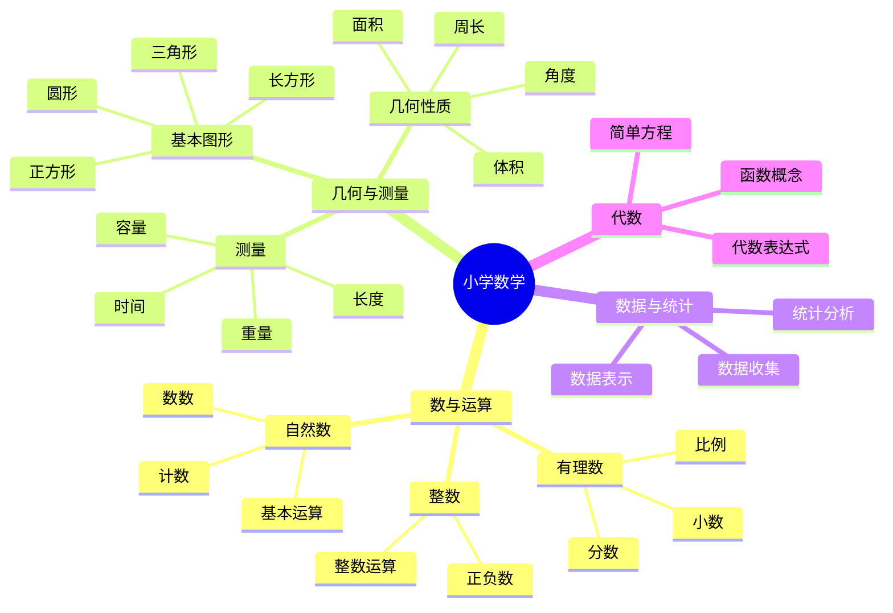
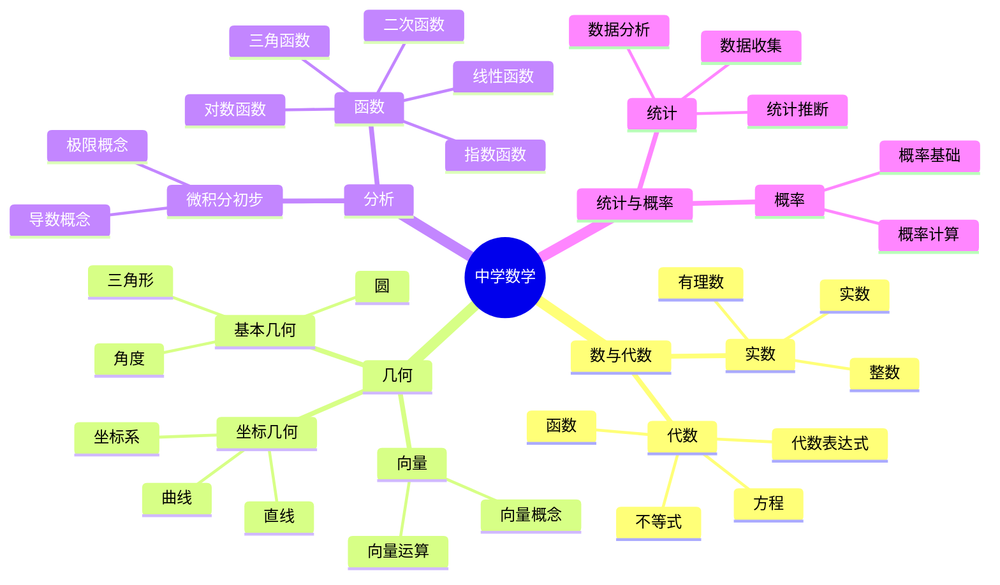
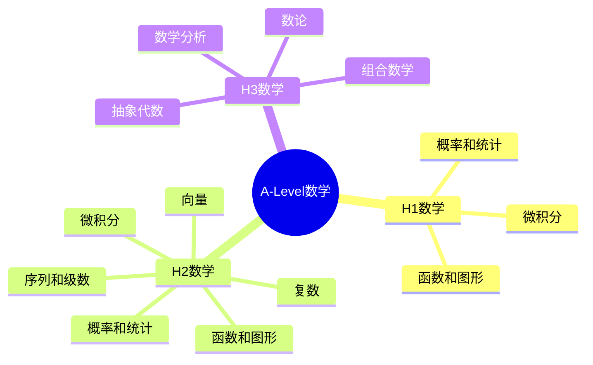
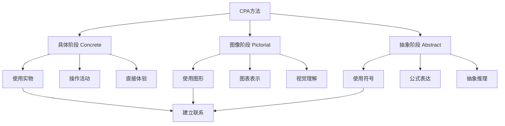
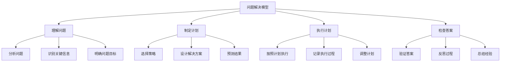
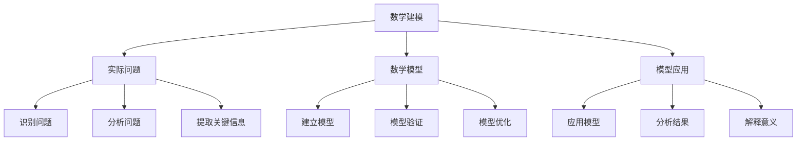
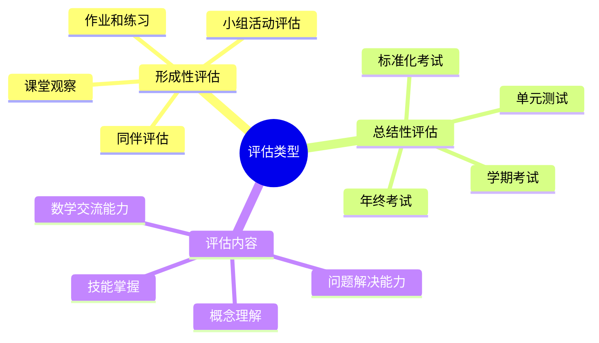
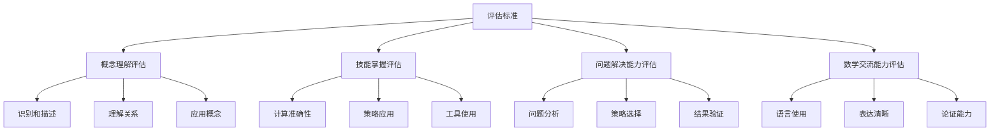
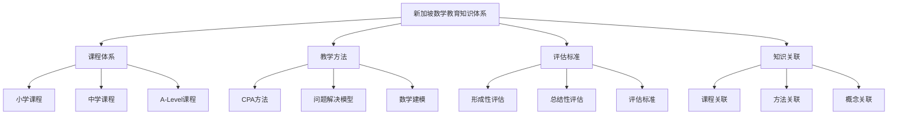

# 新加坡数学教育知识归纳

**创建日期**: 2025年11月28日
**最后更新**: 2025年11月28日
**状态**: ✅ 知识归纳完成

---

## 📋 概述

本文档系统归纳新加坡数学教育的核心知识点和教学方法，包括课程体系、教学方法、评估标准、知识结构等，为FormalMath项目提供全面的知识框架。

---

## 🎯 一、课程体系知识归纳 (编号: C.SG.KNOW.01)

### 1.1 小学数学课程知识结构

**知识层次**：

1. **基础层（小一至小二）**：
   - 自然数：数数、计数、基本运算
   - 基本图形：识别、分类
   - 基本测量：长度、重量、容量、时间

2. **发展层（小三至小四）**：
   - 有理数：分数、小数、比例
   - 几何：角度、周长、面积
   - 数据：数据收集、表示、分析

3. **应用层（小五至小六）**：
   - 代数：简单方程、代数表达式
   - 函数：函数概念、图表
   - 统计：统计图表、数据分析

**关联核心概念**：
- 自然数（C.CORE.003）
- 整数（C.CORE.004）
- 有理数（C.CORE.005）
- 函数（C.CORE.002）
- 集合（C.CORE.001）

---

### 1.2 中学数学课程知识结构

**知识层次**：

1. **基础层（中一至中二）**：
   - 数与代数：实数、代数表达式、方程、不等式
   - 几何：基本几何、角度、三角形
   - 统计：数据收集、表示、分析

2. **发展层（中三至中四）**：
   - 函数：线性函数、二次函数、指数函数、对数函数、三角函数
   - 几何：坐标几何、向量
   - 微积分：极限概念、导数概念

**关联核心概念**：
- 函数（C.CORE.002）
- 极限（C.CORE.013）
- 导数（C.CORE.015）
- 向量空间（C.CORE.011）

---

### 1.3 A-Level数学课程知识结构

**知识层次**：

1. **H1数学**：
   - 函数和图形
   - 微积分
   - 概率和统计

2. **H2数学**：
   - 函数和图形
   - 序列和级数
   - 向量
   - 复数
   - 微积分
   - 概率和统计

3. **H3数学（高级）**：
   - 数学分析
   - 抽象代数
   - 数论
   - 组合数学

**关联核心概念**：
- H1数学：函数（C.CORE.002）、导数（C.CORE.015）、积分（C.CORE.016）
- H2数学：所有基础核心概念
- H3数学：所有33个核心概念

---

## 🎓 二、教学方法知识归纳 (编号: C.SG.KNOW.02)

### 2.1 CPA方法知识结构

**知识要点**：

1. **具体阶段（Concrete）**：
   - **目标**：通过具体操作建立数学概念的直观理解
   - **方法**：使用教具、学具、实物进行数学操作
   - **特点**：直接体验、多感官参与、建立具体经验
   - **应用**：所有数学概念的教学起点

2. **图像阶段（Pictorial）**：
   - **目标**：通过图像和图表理解数学概念
   - **方法**：使用思维导图、数轴、条形图等工具
   - **特点**：视觉理解、建立图像与符号的联系
   - **应用**：从具体到抽象的过渡桥梁

3. **抽象阶段（Abstract）**：
   - **目标**：通过符号和公式进行抽象推理
   - **方法**：使用数学符号、公式、定理
   - **特点**：抽象思维、形式化理解、理论应用
   - **应用**：数学概念的高级理解

**关联核心概念**：
- 与所有核心概念相关（教学方法）

---

### 2.2 问题解决模型知识结构

**知识要点**：

1. **理解问题**：
   - 分析问题的关键信息
   - 识别问题的类型
   - 明确问题的目标

2. **制定计划**：
   - 选择适当的策略
   - 设计解决方案
   - 预测可能的结果

3. **执行计划**：
   - 按照计划执行
   - 记录执行过程
   - 调整计划

4. **检查答案**：
   - 验证答案的合理性
   - 反思解决过程
   - 总结经验和教训

**关联核心概念**：
- 与所有核心概念相关（问题解决方法）

---

### 2.3 数学建模知识结构

**知识要点**：

1. **实际问题**：
   - 从实际问题出发
   - 分析问题的关键信息
   - 提取数学要素

2. **数学模型**：
   - 建立数学模型
   - 验证模型的合理性
   - 优化模型结构

3. **模型应用**：
   - 应用模型解决实际问题
   - 分析模型的结果
   - 解释模型的意义

**关联核心概念**：
- 与所有核心概念相关（建模方法）

---

## 📊 三、评估标准知识归纳 (编号: C.SG.KNOW.03)

### 3.1 评估类型知识结构

**知识要点**：

1. **形成性评估**：
   - **目的**：及时了解学生学习情况，调整教学策略
   - **方法**：课堂观察、作业和练习、小组活动评估、同伴评估
   - **特点**：持续进行、及时反馈、促进学习

2. **总结性评估**：
   - **目的**：评估学生对学习内容的整体掌握情况
   - **方法**：单元测试、学期考试、年终考试、标准化考试
   - **特点**：定期进行、全面评估、记录成绩

3. **评估内容**：
   - **概念理解**：识别和描述数学概念、理解概念之间的关系、应用概念解决问题
   - **技能掌握**：计算技能准确性、问题解决策略应用、数学工具使用能力
   - **问题解决能力**：问题分析和建模、策略选择和实施、结果验证和反思
   - **数学交流能力**：数学语言使用、数学表达清晰度、数学论证能力

**关联核心概念**：
- 与所有核心概念相关（评估标准）

---

### 3.2 评估标准知识结构

**知识要点**：

1. **概念理解评估**：
   - 识别和描述数学概念
   - 理解概念之间的关系
   - 应用概念解决问题

2. **技能掌握评估**：
   - 计算技能准确性
   - 问题解决策略应用
   - 数学工具使用能力

3. **问题解决能力评估**：
   - 问题分析和建模
   - 策略选择和实施
   - 结果验证和反思

4. **数学交流能力评估**：
   - 数学语言使用
   - 数学表达清晰度
   - 数学论证能力

**关联核心概念**：
- 与所有核心概念相关（评估标准）

---

## 🔗 四、知识关联网络 (编号: C.SG.KNOW.04)

### 4.1 课程与核心概念关联

| 课程阶段 | 核心概念 | 知识要点 | 教学方法 |
|---------|---------|---------|---------|
| 小一至小二 | 自然数（C.CORE.003） | 数数、计数、基本运算 | CPA方法、问题解决 |
| 小三至小四 | 有理数（C.CORE.005） | 分数、小数、比例 | CPA方法、数学建模 |
| 小五至小六 | 函数（C.CORE.002） | 函数概念、图表 | CPA方法、问题解决 |
| 中一至中二 | 函数（C.CORE.002） | 函数概念、图像 | CPA方法、数学建模 |
| 中三至中四 | 导数（C.CORE.015） | 导数概念、应用 | CPA方法、问题解决 |
| A-Level | 所有核心概念 | 深入理论、应用 | 问题解决、数学建模 |

### 4.2 教学方法与核心概念关联

| 教学方法 | 适用核心概念 | 应用要点 | 效果评估 |
|---------|------------|---------|---------|
| CPA方法 | 所有核心概念 | 从具体到抽象 | 概念理解、技能掌握 |
| 问题解决模型 | 所有核心概念 | 系统化解决问题 | 问题解决能力 |
| 数学建模 | 函数、导数、积分等 | 实际问题建模 | 应用能力 |

---

## 📚 五、知识体系总结 (编号: C.SG.KNOW.05)

### 5.1 核心知识框架

### 5.2 知识要点总结

**课程体系**：
- 小学：基础数学概念、数数、基本运算、分数、小数、几何、测量、数据、代数
- 中学：函数、几何、统计、概率、微积分初步
- A-Level：深入数学理论、应用数学、研究数学

**教学方法**：
- CPA方法：从具体到图像到抽象的渐进过程
- 问题解决模型：理解问题、制定计划、执行计划、检查答案
- 数学建模：实际问题转化为数学模型

**评估标准**：
- 形成性评估：课堂观察、作业和练习、小组活动评估
- 总结性评估：单元测试、学期考试、年终考试
- 评估内容：概念理解、技能掌握、问题解决能力、数学交流能力

**知识关联**：
- 课程与核心概念的对应关系
- 教学方法与核心概念的应用关系
- 评估标准与核心概念的评估关系

---

## 🔗 六、关联文档 (编号: C.SG.KNOW.06)

### 6.1 相关研究文档

- [新加坡数学教育方法深入研究](./00-新加坡数学教育方法深入研究-2025年11月28日.md)
- [新加坡数学教育方法应用指南](./00-新加坡数学教育方法应用指南-2025年11月28日.md)
- [新加坡数学教案](./00-新加坡数学教案-2025年11月28日.md)
- [新加坡数学教育书籍索引](./00-新加坡数学教育书籍索引-2025年11月28日.md)

### 6.2 相关资源文档

- [新加坡数学教育课程资源索引](../00-归档/06-资源库/00-资源库/新加坡数学教育课程资源索引-2025年1月.md)

---

**创建日期**: 2025年11月28日
**最后更新**: 2025年11月28日
**维护状态**: 持续更新中
**状态**: ✅ 知识归纳完成
