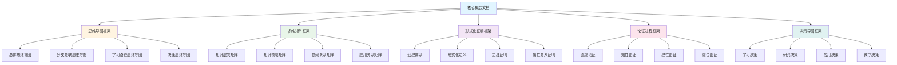

# 核心概念与新框架整合指南

**主题编号**: C.00.44
**创建日期**: 2025年1月
**最后更新**: 2025年1月
**状态**: 持续完善中

---

## 📋 概述

本文档提供FormalMath核心概念文档与新创建的多种思维表征方式框架的整合指南，帮助用户理解如何将核心概念文档与思维导图、多维矩阵、形式化证明、论证过程、决策导图等框架结合使用。

**目标**：

- 说明核心概念文档与新框架的关系
- 提供整合使用的具体方法
- 展示不同场景下的使用策略
- 建立完整的知识学习体系

---

## 🎯 一、核心概念文档与新框架的关系 (编号: C.00.44.01)

### 1.1 关系图

### 1.2 关系说明

**核心概念文档**是基础，包含：

- 概念的三视角分析（认知学、教育学、数学家视角）
- 概念的严格定义和形式化表述
- 概念的性质和重要定理
- 概念的应用实例

**新框架**提供：

- **思维导图**：知识结构的可视化
- **多维矩阵**：概念关系的量化分析
- **形式化证明**：严格的理论基础
- **论证过程**：充分的理解桥梁
- **决策导图**：实用的应用指导

---

## 📚 二、学习场景整合使用 (编号: C.00.44.02)

### 2.1 初学者学习场景

**目标**：理解核心概念

**使用流程**：

1. **第一步：使用决策思维导图**
   - 查看[学习决策思维导图](../01-总体思维导图/05-决策思维导图体系.md)
   - 确定学习目标和学习阶段
   - 选择学习路径

2. **第二步：使用总体思维导图**
   - 查看[数学知识体系全景图](../01-总体思维导图/01-数学知识体系全景图.md)
   - 了解概念在整个知识体系中的位置
   - 建立总体框架

3. **第三步：阅读核心概念文档**
   - 阅读核心概念的三视角版本文档
   - 重点关注认知学视角的直观理解
   - 理解概念的基本定义和性质

4. **第四步：使用论证过程**
   - 参考核心概念文档中的论证过程
   - 理解概念的直观意义
   - 掌握概念的基本应用

**示例：学习群概念**:

1. 使用学习决策导图 → 确定学习路径：基础概念 → 群的定义 → 群的性质 → 群的应用
2. 使用总体思维导图 → 了解群在代数结构中的位置
3. 阅读[群-三视角版](./核心概念/08-群-三视角版.md) → 理解群的定义和基本性质
4. 使用论证过程 → 理解群的直观意义（对称性和变换）

### 2.2 中级学习者场景

**目标**：深入理解核心概念

**使用流程**：

1. **第一步：使用多维矩阵**
   - 查看[核心概念多维关系矩阵](../02-知识矩阵/10-核心概念多维关系矩阵.md)
   - 了解概念的多维度特征
   - 发现概念之间的关系

2. **第二步：阅读核心概念文档**
   - 深入阅读核心概念的三视角版本文档
   - 重点关注知性维度的概念分析
   - 理解概念的分类和关系

3. **第三步：使用形式化证明**
   - 参考[概念定义属性关系形式化论证证明系统](../00-概念定义属性关系形式化论证证明系统-2025年1月.md)
   - 理解概念的形式化定义
   - 学习重要定理的证明思路

4. **第四步：使用分支关联思维导图**
   - 查看[分支关联思维导图](../01-总体思维导图/02-分支关联思维导图.md)
   - 了解概念与其他分支的关联
   - 建立跨分支的知识联系

**示例：深入学习向量空间概念**:

1. 使用多维矩阵 → 了解向量空间的知识层次（L1中级层）、知识领域（D2代数）、学习难度（中等）
2. 阅读[向量空间-三视角版](./核心概念/11-向量空间-三视角版.md) → 深入理解向量空间的定义、性质和分类
3. 使用形式化证明 → 学习基和维数定理的形式化证明
4. 使用分支关联思维导图 → 了解向量空间与线性映射、矩阵的关系

### 2.3 高级学习者场景

**目标**：研究核心概念

**使用流程**：

1. **第一步：使用研究决策导图**
   - 查看[研究决策思维导图](../01-总体思维导图/05-决策思维导图体系.md)
   - 确定研究方向和研究问题
   - 选择研究方法

2. **第二步：使用形式化证明系统**
   - 深入研读[概念定义属性关系形式化论证证明系统](../00-概念定义属性关系形式化论证证明系统-2025年1月.md)
   - 学习完整的形式化证明
   - 理解证明的逻辑结构

3. **第三步：使用知识关联网络**
   - 查看[概念级关联网络](../05-知识关联网络/01-概念级关联网络.md)
   - 发现概念之间的深层关联
   - 探索研究问题

4. **第四步：阅读核心概念文档**
   - 重点关注数学家视角的思维过程
   - 了解概念的历史发展和开放问题
   - 探索前沿研究方向

**示例：研究群概念**:

1. 使用研究决策导图 → 确定研究方向：群表示论
2. 使用形式化证明系统 → 学习Lagrange定理的完整形式化证明
3. 使用知识关联网络 → 发现群与向量空间、表示的关系
4. 阅读[群-三视角版](./核心概念/08-群-三视角版.md) → 了解群论的历史发展和开放问题

---

## 🔬 三、研究场景整合使用 (编号: C.00.44.03)

### 3.1 理论研究场景

**目标**：构建理论体系

**使用流程**：

1. **使用研究决策导图** → 确定理论研究方向
2. **使用多维矩阵** → 分析概念之间的关系
3. **使用形式化证明系统** → 构建严格的理论基础
4. **使用知识关联网络** → 发现理论之间的关联

### 3.2 应用研究场景

**目标**：应用概念解决实际问题

**使用流程**：

1. **使用应用决策导图** → 确定应用场景
2. **使用核心概念文档** → 了解概念的应用实例
3. **使用多维矩阵** → 分析应用场景矩阵
4. **使用论证过程** → 理解应用方法

---

## 💼 四、应用场景整合使用 (编号: C.00.44.04)

### 4.1 教学应用场景

**目标**：教授核心概念

**使用流程**：

1. **使用教学决策导图** → 确定教学内容和教学方法
2. **使用核心概念文档** → 参考教育学视角的教学策略
3. **使用思维导图** → 可视化知识结构
4. **使用论证过程** → 提供充分的理解桥梁

### 4.2 工程应用场景

**目标**：应用概念解决工程问题

**使用流程**：

1. **使用应用决策导图** → 确定工程应用场景
2. **使用核心概念文档** → 了解概念的实际应用
3. **使用多维矩阵** → 分析应用场景矩阵
4. **使用形式化证明** → 验证应用的正确性

---

## 🔄 五、整合使用最佳实践 (编号: C.00.44.05)

### 5.1 最佳实践原则

**原则1：目标导向**:

- 根据学习/研究/应用目标选择框架
- 整合使用服务于目标
- 评估使用效果

**原则2：层次递进**:

- 从直观到形式化
- 从简单到复杂
- 从理解到应用

**原则3：互补整合**:

- 利用不同框架的优势
- 弥补不同框架的不足
- 形成完整的知识体系

### 5.2 最佳实践示例

**示例：完整学习群概念**:

**阶段1：入门理解**:

1. 使用学习决策导图 → 确定学习路径
2. 使用总体思维导图 → 建立总体框架
3. 阅读群-三视角版 → 理解群的定义
4. 使用论证过程 → 理解群的直观意义

**阶段2：深入分析**:

1. 使用多维矩阵 → 分析群的多维度特征
2. 阅读群-三视角版 → 深入理解群的性质
3. 使用形式化证明 → 学习Lagrange定理的证明
4. 使用分支关联思维导图 → 了解群与其他概念的关系

**阶段3：应用研究**:

1. 使用研究决策导图 → 确定研究方向
2. 使用知识关联网络 → 发现研究问题
3. 使用形式化证明系统 → 构建理论体系
4. 阅读群-三视角版 → 了解开放问题

---

## 📊 六、整合使用决策矩阵 (编号: C.00.44.06)

### 6.1 使用决策矩阵

| 目标类型 | 学习阶段 | 推荐框架组合 | 核心概念文档使用重点 |
|---------|---------|------------|---------------------|
| **理解概念** | 入门 | 决策导图 + 思维导图 + 论证过程 | 认知学视角、直观理解 |
| **理解概念** | 中级 | 多维矩阵 + 论证过程 + 形式化证明 | 知性维度、概念分析 |
| **理解概念** | 高级 | 形式化证明 + 知识网络 + 决策导图 | 理性维度、形式化定义 |
| **应用概念** | 入门 | 决策导图 + 核心概念文档 | 应用实例、实际应用 |
| **应用概念** | 中级 | 多维矩阵 + 决策导图 + 核心概念文档 | 应用场景、应用方法 |
| **研究概念** | 中级 | 多维矩阵 + 形式化证明 + 知识网络 | 数学家视角、开放问题 |
| **研究概念** | 高级 | 形式化证明 + 知识网络 + 核心概念文档 | 历史发展、前沿研究 |
| **教学概念** | 入门 | 教学决策导图 + 核心概念文档 | 教育学视角、教学策略 |
| **教学概念** | 中级 | 思维导图 + 论证过程 + 核心概念文档 | 教学路径、教学方法 |

---

## 🔗 七、关联文档 (编号: C.00.44.07)

### 7.1 核心概念文档

- [核心概念索引](./核心概念/00-核心概念索引.md)
- 所有33个核心概念的三视角版本文档

### 7.2 新框架文档

- [概念体系全面梳理与推进计划](./00-概念体系全面梳理与推进计划-2025年1月.md)
- [概念定义属性关系形式化论证证明系统](./00-概念定义属性关系形式化论证证明系统-2025年1月.md)
- [多种思维表征方式对比与整合](./00-多种思维表征方式对比与整合-2025年1月.md)
- [决策思维导图体系](./01-总体思维导图/05-决策思维导图体系.md)

### 7.3 其他相关文档

- [README.md](./README.md)
- [知识矩阵总览](./02-知识矩阵/00-知识矩阵总览.md)
- [认知工具总览](./04-认知工具/00-认知工具总览.md)

---

## ✅ 八、总结 (编号: C.00.44.08)

本文档提供了核心概念文档与新框架的整合使用指南，帮助用户：

1. **理解关系**：理解核心概念文档与新框架的关系
2. **选择策略**：根据不同场景选择合适的框架组合
3. **整合使用**：形成完整的学习和研究体系
4. **最佳实践**：遵循最佳实践原则和方法

**核心价值**：

- 提供系统化的学习路径
- 支持不同层次的学习需求
- 整合多种思维表征方式
- 形成完整的知识体系

---

**创建日期**: 2025年1月
**最后更新**: 2025年1月
**维护状态**: 持续完善中
**负责人**: FormalMath项目组
