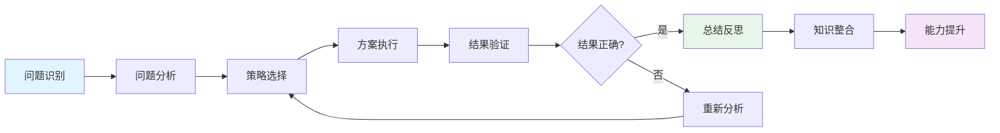

# 核心概念思维表征批量更新指南

**创建日期**: 2025年11月28日
**最后更新**: 2025年11月28日
**状态**: 📋 更新指南

---

## 📋 概述

本文档提供批量更新所有33个核心概念思维表征部分的指南，确保每个概念都包含：
- 5.1 思维导图（已有）
- 5.2 矩阵对比（已有）
- 5.3 多视角表征（已有）
- 5.4 决策树（新增）
- 5.5 决策逻辑路径（新增）
- 5.6 多维对比矩阵增强版（新增）

---

## 🎯 更新模板

### 模板1：决策树（5.4节）

```markdown
#### 5.4 决策树：[概念名称]问题分类和策略选择

```mermaid
graph TD
    A[[概念名称]问题] --> B{问题类型}
    B -->|类型1| C[策略1]
    B -->|类型2| D[策略2]
    B -->|类型3| E[策略3]
    B -->|类型4| F[策略4]

    C --> C1{条件判断}
    C1 -->|条件1| C2[方法1.1]
    C1 -->|条件2| C3[方法1.2]

    D --> D1{条件判断}
    D1 -->|条件1| D2[方法2.1]
    D1 -->|条件2| D3[方法2.2]

    E --> E1{条件判断}
    E1 -->|条件1| E2[方法3.1]
    E1 -->|条件2| E3[方法3.2]

    F --> F1{条件判断}
    F1 -->|条件1| F2[方法4.1]
    F1 -->|条件2| F3[方法4.2]

    style A fill:#e1f5ff
    style B fill:#fff4e1
```

**说明**：
- **问题分类**：根据问题类型进行分类
- **策略选择**：根据问题类型选择相应的解决策略
- **方法应用**：根据具体问题选择合适的方法
```

### 模板2：决策逻辑路径（5.5节）

```markdown
#### 5.5 决策逻辑路径：[概念名称]问题解决过程



**说明**：
- **问题识别**：识别[概念名称]问题的类型和关键要素
- **问题分析**：分析问题的条件和目标
- **策略选择**：根据问题类型选择解决策略
- **方案执行**：执行选定的解决方案
- **结果验证**：验证结果的正确性
- **总结反思**：总结解题过程，反思解题方法
- **知识整合**：整合相关知识点
- **能力提升**：提升问题解决能力
```

### 模板3：多维对比矩阵增强版（5.6节）

```markdown
#### 5.6 多维对比矩阵：[概念名称]概念特征对比

| 对比维度 | 方面1 | 方面2 | 方面3 | 方面4 |
|---------|------|------|------|------|
| **核心特征** | [特征1] | [特征2] | [特征3] | [特征4] |
| **理解难度** | ⭐⭐ | ⭐⭐⭐ | ⭐⭐⭐ | ⭐⭐⭐⭐ |
| **应用频率** | ⭐⭐⭐⭐⭐ | ⭐⭐⭐⭐ | ⭐⭐⭐ | ⭐⭐⭐ |
| **理论基础** | [理论1] | [理论2] | [理论3] | [理论4] |
| **教学重点** | [重点1] | [重点2] | [重点3] | [重点4] |
| **学习阶段** | [阶段1] | [阶段2] | [阶段3] | [阶段4] |
| **认知维度** | [维度1] | [维度2] | [维度3] | [维度4] |
| **思维表征** | [方法1] | [方法2] | [方法3] | [方法4] |

**说明**：
- **核心特征**：每个方面的核心特征
- **理解难度**：从1星到5星，表示理解难度
- **应用频率**：从1星到5星，表示应用频率
- **理论基础**：每个方面的理论基础
- **教学重点**：每个方面的教学重点
- **学习阶段**：每个方面的学习阶段
- **认知维度**：每个方面的认知维度
- **思维表征**：每个方面推荐的思维表征方法
```

---

## 📝 更新步骤

### 步骤1：定位插入位置

在每个核心概念文件中，找到：
```markdown
#### 5.3 多视角表征：从不同角度表征[概念名称]
...
```

在这部分之后、`---`之前插入新的三个部分。

### 步骤2：添加决策树（5.4节）

根据概念的特点，设计问题分类和策略选择决策树。

### 步骤3：添加决策逻辑路径（5.5节）

使用标准的问题解决路径模板。

### 步骤4：添加多维对比矩阵增强版（5.6节）

根据概念的特点，设计多维度对比矩阵。

### 步骤5：更新目录

如果文件有目录，需要更新目录，添加：
- 5.4 决策树：[概念名称]问题分类和策略选择
- 5.5 决策逻辑路径：[概念名称]问题解决过程
- 5.6 多维对比矩阵：[概念名称]概念特征对比

---

## 🎯 概念分类和更新策略

### 基础数学概念（7个）

1. **集合** ✅ 已完成
2. **函数** - 需要更新
3. **自然数** - 需要更新
4. **整数** - 需要更新
5. **有理数** - 需要更新
6. **实数** - 需要更新
7. **复数** - 需要更新

**特点**：基础概念，问题类型相对简单，决策树可以侧重于基本运算和性质。

### 代数结构概念（5个）

8. **群** - 需要更新
9. **环** - 需要更新
10. **域** - 需要更新
11. **向量空间** - 需要更新
12. **线性映射** - 需要更新

**特点**：抽象代数概念，决策树应侧重于结构性质和证明方法。

### 分析学概念（5个）

13. **极限** - 需要更新
14. **连续** - 需要更新
15. **导数** - 需要更新
16. **积分** - 需要更新
17. **级数** - 需要更新

**特点**：分析学概念，决策树应侧重于计算方法、存在性证明和应用。

### 几何学概念（5个）

18. **流形** - 需要更新
19. **黎曼流形** - 需要更新
20. **曲率** - 需要更新
21. **概形** - 需要更新
22. **层** - 需要更新

**特点**：几何概念，决策树应侧重于几何性质和构造方法。

### 拓扑学概念（3个）

23. **拓扑空间** - 需要更新
24. **同伦** - 需要更新
25. **同调** - 需要更新

**特点**：拓扑概念，决策树应侧重于拓扑性质和同调方法。

### 数论概念（3个）

26. **素数** - 需要更新
27. **同余** - 需要更新
28. **L函数** - 需要更新

**特点**：数论概念，决策树应侧重于数论方法和应用。

### 离散数学概念（3个）

29. **图** - 需要更新
30. **组合数** - 需要更新
31. **算法** - 需要更新

**特点**：离散数学概念，决策树应侧重于算法和组合方法。

### 交叉领域概念（2个）

32. **表示** - 需要更新
33. **朗兰兹纲领** - 需要更新

**特点**：交叉领域概念，决策树应侧重于跨领域应用和理论整合。

---

## ✅ 检查清单

更新完成后，检查：

- [ ] 5.4 决策树部分已添加
- [ ] 5.5 决策逻辑路径部分已添加
- [ ] 5.6 多维对比矩阵增强版部分已添加
- [ ] 目录已更新（如果有）
- [ ] Mermaid图表语法正确
- [ ] 表格格式正确
- [ ] 说明文字完整
- [ ] 内容与概念特点匹配

---

## 📚 参考示例

- **集合概念**：`核心概念/01-集合-三视角版.md`（已完成，可作为参考）
- **函数概念**：`核心概念/02-函数-三视角版.md`（待更新）

---

**创建日期**: 2025年11月28日
**最后更新**: 2025年11月28日
**维护状态**: 持续更新中
