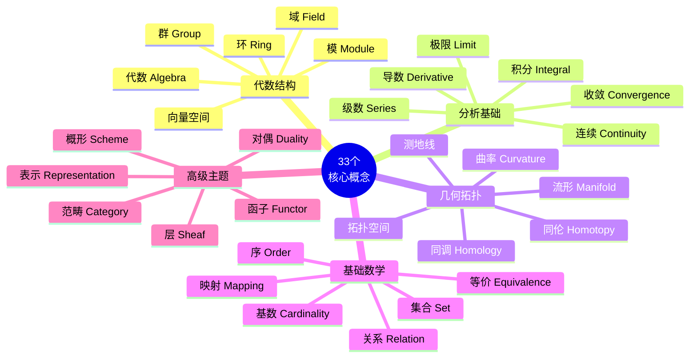
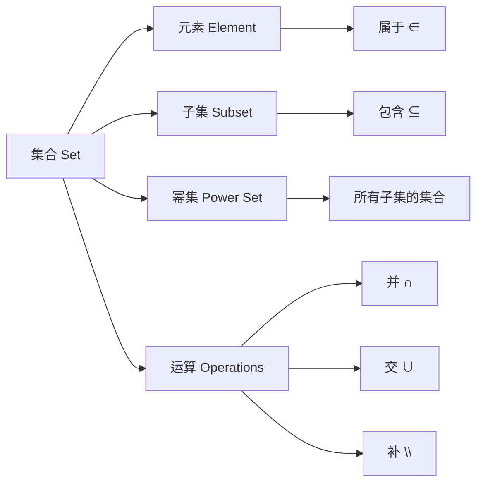
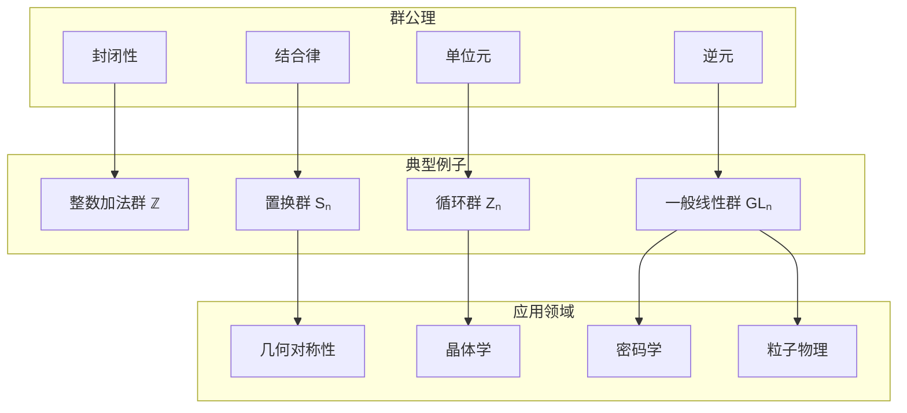
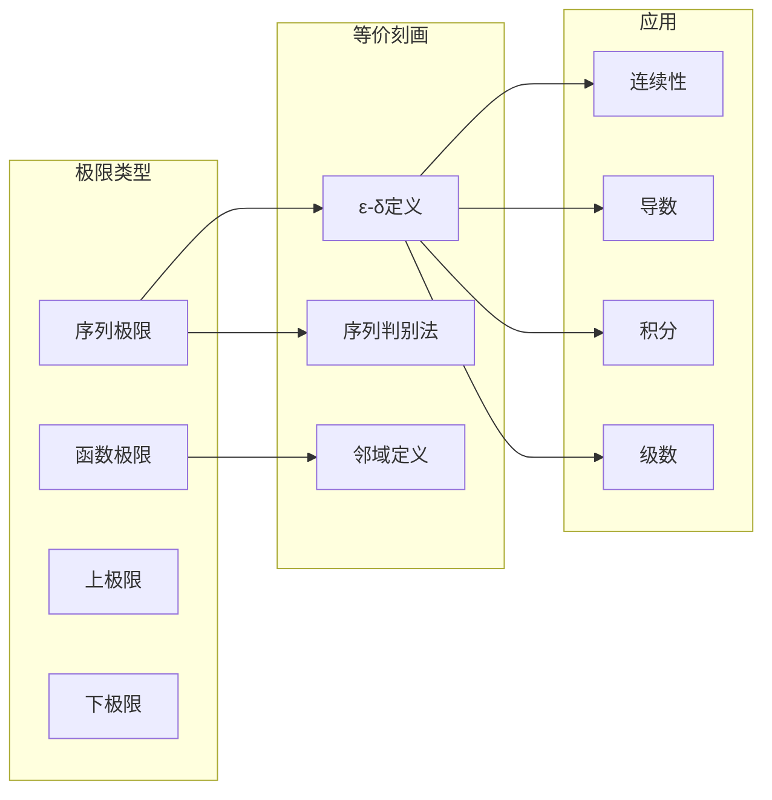
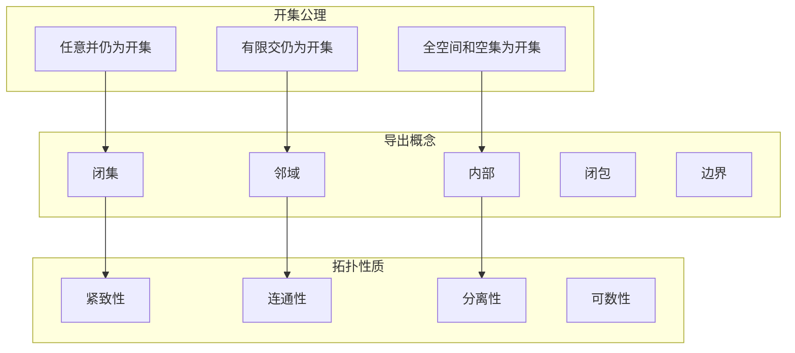
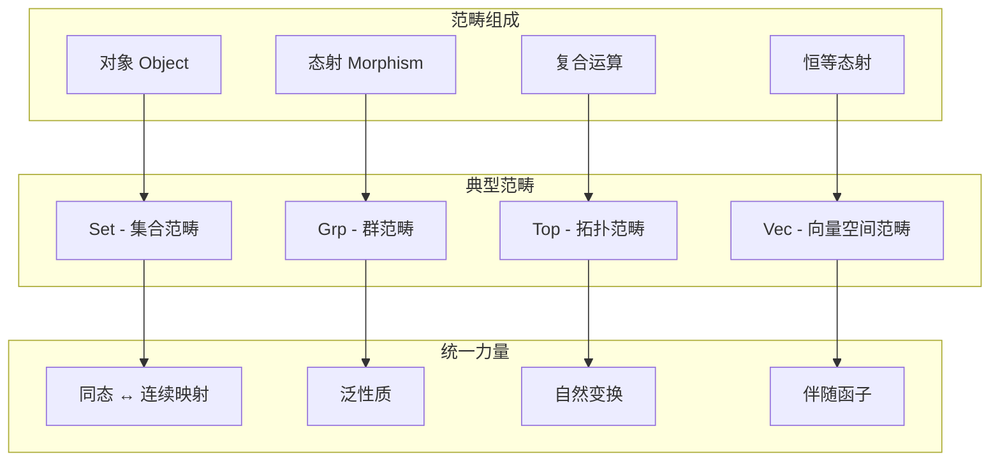
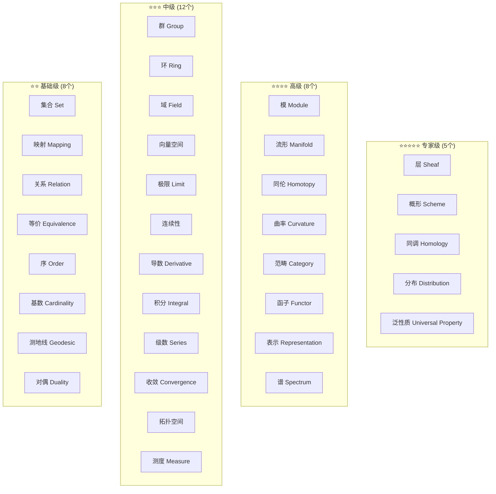
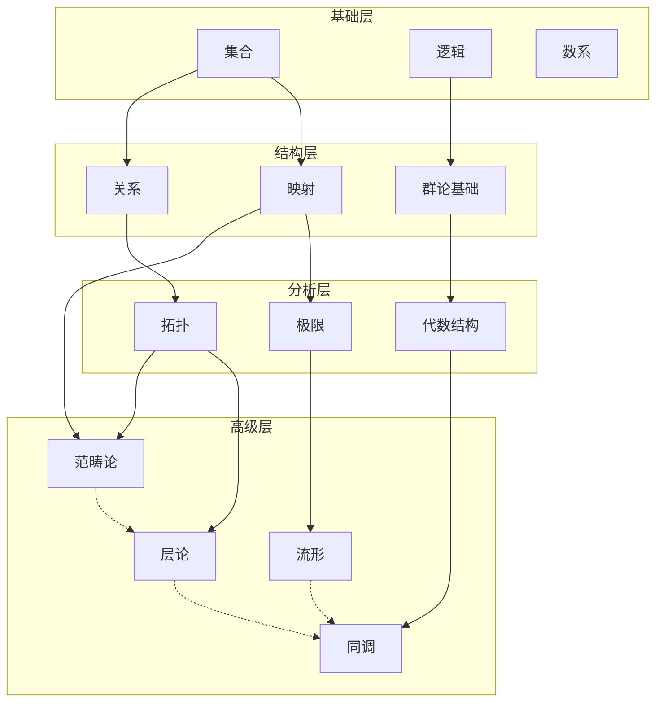
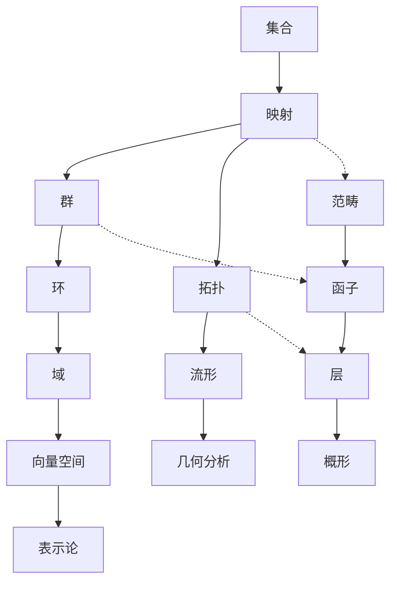

# 核心概念总索引

> 本文档提供 FormalMath 项目中33个核心概念的完整索引，包含概念难度分级、学习先决条件和快速跳转链接。

---

## 📊 核心概念全景图

---

## 🔤 33个核心概念完整列表

### 按学科分类索引

| 编号 | 概念名称 | 英文名称 | 学科 | 难度 | 前置概念 |
|------|----------|----------|------|------|----------|
| 01 | [集合](#概念01-集合) | Set | 基础 | ⭐⭐ | 无 |
| 02 | [映射](#概念02-映射) | Mapping | 基础 | ⭐⭐ | 集合 |
| 03 | [关系](#概念03-关系) | Relation | 基础 | ⭐⭐ | 集合、映射 |
| 04 | [等价](#概念04-等价) | Equivalence | 基础 | ⭐⭐ | 关系 |
| 05 | [序](#概念05-序) | Order | 基础 | ⭐⭐⭐ | 关系 |
| 06 | [群](#概念06-群) | Group | 代数 | ⭐⭐⭐ | 集合、映射 |
| 07 | [环](#概念07-环) | Ring | 代数 | ⭐⭐⭐ | 群、集合运算 |
| 08 | [域](#概念08-域) | Ring | 代数 | ⭐⭐⭐ | 环 |
| 09 | [向量空间](#概念09-向量空间) | Vector Space | 代数 | ⭐⭐⭐ | 域、群 |
| 10 | [模](#概念10-模) | Module | 代数 | ⭐⭐⭐⭐ | 环、向量空间 |
| 11 | [极限](#概念11-极限) | Limit | 分析 | ⭐⭐⭐ | 实数、集合 |
| 12 | [连续性](#概念12-连续性) | Continuity | 分析 | ⭐⭐⭐ | 极限、映射 |
| 13 | [导数](#概念13-导数) | Derivative | 分析 | ⭐⭐⭐ | 极限、函数 |
| 14 | [积分](#概念14-积分) | Integral | 分析 | ⭐⭐⭐ | 极限、求和 |
| 15 | [级数](#概念15-级数) | Series | 分析 | ⭐⭐⭐ | 序列、极限 |
| 16 | [收敛](#概念16-收敛) | Convergence | 分析 | ⭐⭐⭐⭐ | 极限、拓扑 |
| 17 | [拓扑空间](#概念17-拓扑空间) | Topological Space | 拓扑 | ⭐⭐⭐ | 集合、开集 |
| 18 | [流形](#概念18-流形) | Manifold | 几何 | ⭐⭐⭐⭐ | 拓扑空间、分析 |
| 19 | [同伦](#概念19-同伦) | Homotopy | 拓扑 | ⭐⭐⭐⭐ | 连续映射 |
| 20 | [同调](#概念20-同调) | Homology | 拓扑 | ⭐⭐⭐⭐⭐ | 同伦、代数 |
| 21 | [曲率](#概念21-曲率) | Curvature | 几何 | ⭐⭐⭐⭐ | 微分、流形 |
| 22 | [测地线](#概念22-测地线) | Geodesic | 几何 | ⭐⭐⭐⭐ | 曲率、变分 |
| 23 | [层](#概念23-层) | Sheaf | 代数几何 | ⭐⭐⭐⭐⭐ | 拓扑空间、范畴 |
| 24 | [概形](#概念24-概形) | Scheme | 代数几何 | ⭐⭐⭐⭐⭐ | 层、环论 |
| 25 | [范畴](#概念25-范畴) | Category | 基础 | ⭐⭐⭐⭐ | 集合、映射 |
| 26 | [函子](#概念26-函子) | Functor | 基础 | ⭐⭐⭐⭐ | 范畴 |
| 27 | [表示](#概念27-表示) | Representation | 代数 | ⭐⭐⭐⭐ | 群、向量空间 |
| 28 | [对偶](#概念28-对偶) | Duality | 多分支 | ⭐⭐⭐⭐ | 范畴、线性代数 |
| 29 | [基数](#概念29-基数) | Cardinality | 集合论 | ⭐⭐⭐ | 集合、映射 |
| 30 | [测度](#概念30-测度) | Measure | 分析 | ⭐⭐⭐⭐ | 集合论、积分 |
| 31 | [分布](#概念31-分布) | Distribution | 分析 | ⭐⭐⭐⭐⭐ | 泛函分析、测度 |
| 32 | [谱](#概念32-谱) | Spectrum | 分析/代数 | ⭐⭐⭐⭐⭐ | 算子、理想 |
| 33 | [泛性质](#概念33-泛性质) | Universal Property | 范畴 | ⭐⭐⭐⭐⭐ | 范畴、函子 |

---

## 🎯 概念详细说明

### 概念01：集合

| 属性 | 内容 |
|------|------|
| **定义** | 确定的不同对象的整体 |
| **重要性** | ⭐⭐⭐⭐⭐ 现代数学的基础语言 |
| **典型例子** | ℕ, ℤ, ℚ, ℝ, ℂ, ∅ |
| **相关概念** | 映射、关系、基数、拓扑 |
| **学习资源** | [集合论基础](../docs/01-基础数学/集合论/01-集合论基础.md) |

---

### 概念06：群

| 属性 | 内容 |
|------|------|
| **定义** | 带有满足特定公理的二元运算的集合 |
| **重要性** | ⭐⭐⭐⭐⭐ 代数学的核心结构 |
| **历史** | Galois(1830), Cayley(1854) |
| **推广** | 环、域、模、李群、代数群 |
| **学习资源** | [群论基础](../docs/03-代数学/01-群论/) |

---

### 概念11：极限

| 属性 | 内容 |
|------|------|
| **定义** | 变量趋近某值时函数的趋近行为 |
| **重要性** | ⭐⭐⭐⭐⭐ 分析学的基石 |
| **历史** | Cauchy(1821), Weierstrass(1872) |
| **关键定理** | 极限唯一性、四则运算、夹逼定理 |
| **学习资源** | [极限理论](../docs/02-分析学/01-极限/) |

---

### 概念17：拓扑空间

| 属性 | 内容 |
|------|------|
| **定义** | 装备了满足特定公理的"开集"族的集合 |
| **重要性** | ⭐⭐⭐⭐⭐ 现代几何和分析的基础 |
| **历史** | Hausdorff(1914), Bourbaki |
| **推广** | 度量空间、流形、概形、topos |
| **学习资源** | [拓扑学基础](../docs/04-几何拓扑/01-拓扑学/) |

---

### 概念25：范畴

| 属性 | 内容 |
|------|------|
| **定义** | 由对象和态射组成的代数结构 |
| **重要性** | ⭐⭐⭐⭐⭐ 现代数学的统一语言 |
| **历史** | Eilenberg-MacLane(1945) |
| **应用** | 同调代数、代数几何、逻辑学 |
| **学习资源** | [范畴论入门](../docs/01-基础数学/范畴论入门/) |

---

## 📈 概念难度分级体系

### 难度分布金字塔

---

## 🎓 学习先决条件图

### 全局依赖网络

### 推荐学习顺序

| 阶段 | 概念组合 | 预计时间 | 验证方式 |
|------|----------|----------|----------|
| 第1阶段 | 集合+映射+关系 | 2周 | 能定义函数和等价类 |
| 第2阶段 | 群+环+域 | 4周 | 能证明Lagrange定理 |
| 第3阶段 | 极限+连续+导数+积分 | 6周 | 能证明微积分基本定理 |
| 第4阶段 | 拓扑空间+流形基础 | 4周 | 能理解紧致性和连通性 |
| 第5阶段 | 范畴+函子+层 | 6周 | 能用泛性质构造对象 |
| 第6阶段 | 同调+概形 | 8周 | 能计算简单同调群 |

---

## 🔗 快速跳转链接

### 按学科快速导航

| 学科 | 核心概念 | 详细索引 | 学习路径 |
|------|----------|----------|----------|
| 基础数学 | 6个 | [基础概念](01-基础数学/) | [基础路径](../docs/00-全局学习路径/) |
| 代数学 | 7个 | [代数概念](03-代数学/) | [代数路径](../docs/03-代数学/) |
| 分析学 | 6个 | [分析概念](02-分析学/) | [分析路径](../docs/02-分析学/) |
| 几何拓扑 | 6个 | [几何概念](04-几何拓扑/) | [几何路径](../docs/04-几何拓扑/) |
| 高级专题 | 8个 | [高级概念](00-知识层次体系/L3/) | [高级路径](../docs/00-知识层次体系/) |

### 概念关系图谱

---

## 📚 学习资源汇总

### 每个概念的标配资源

| 资源类型 | 描述 | 位置 |
|----------|------|------|
| 形式化定义 | 严格的数学定义 | 各概念文档 |
| 直观解释 | 图形和类比 | [核心概念理解三问](../docs/00-核心概念理解三问/) |
| 工作示例 | 具体计算示例 | [工作示例库](../docs/00-工作示例库/) |
| 证明练习 | 相关定理证明 | [定理依赖网络](../docs/00-全局定理依赖网络/) |
| 跨学科应用 | 实际应用场景 | [跨学科应用网络](../docs/00-跨学科应用网络/) |

---

> **使用指南**：本索引是探索 FormalMath 核心概念的起点。建议从基础概念开始，按照先决条件图逐步深入。每个概念都有完整的学习资源和交叉引用。

---

*本文档索引33个核心数学概念 | FormalMath 项目组 | 2026-04*
