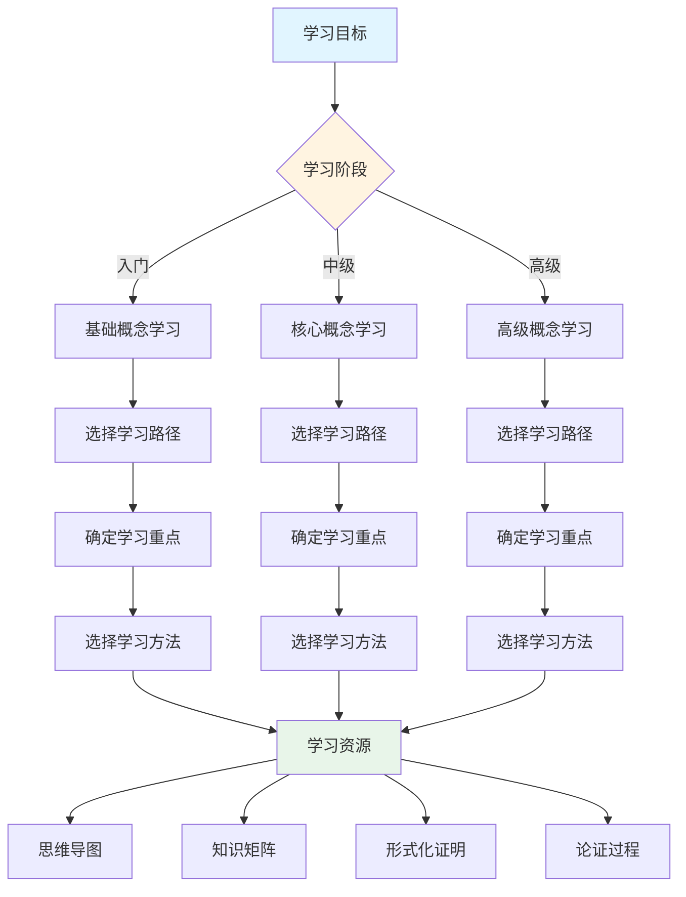
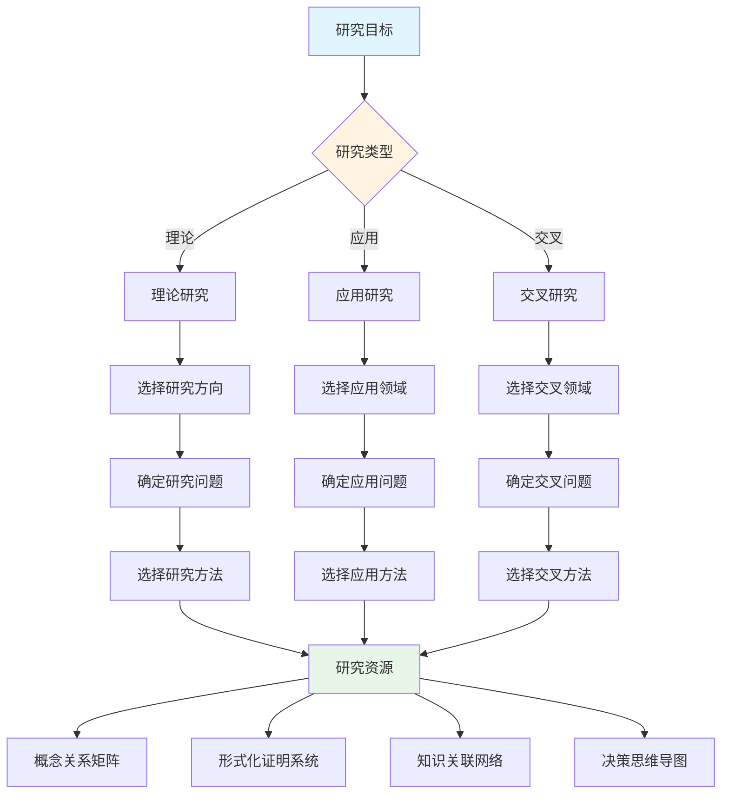
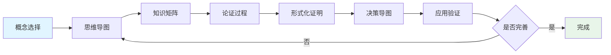

# 概念体系全面梳理与推进计划

**主题编号**: C.00.40
**创建日期**: 2025年1月
**最后更新**: 2025年1月
**状态**: 持续推进中

---

## 📋 概述

本文档制定FormalMath概念体系的全面梳理与推进计划，整合**思维导图、多维概念矩阵对比、概念定义属性关系形式化论证证明、充分的论证过程、决策思维导图**等多种思维表征方式，建立系统化的概念体系推进框架。

**核心目标**：

- 整合多种思维表征方式，形成互补的知识体系
- 增强形式化论证证明系统，确保严格性和可追溯性
- 建立决策思维导图体系，支持学习和研究决策
- 持续完善和推进概念体系

**理论基础**：

- 集合论与范畴论双视角框架
- 直观-知性-理性三维认知模型
- 形式化证明系统（Metamath标准）
- 多维度知识矩阵分析

---

## 🎯 一、多种思维表征方式整合框架 (编号: C.00.40.01)

### 1.1 思维表征方式体系

```mermaid
graph TD
    A[概念体系思维表征] --> B[思维导图]
    A --> C[多维概念矩阵]
    A --> D[形式化论证证明]
    A --> E[论证过程]
    A --> F[决策思维导图]

    B --> B1[总体思维导图]
    B --> B2[分支关联思维导图]
    B --> B3[学习路径思维导图]
    B --> B4[概念关系思维导图]

    C --> C1[知识层次矩阵]
    C --> C2[知识领域矩阵]
    C --> C3[依赖关系矩阵]
    C --> C4[应用关系矩阵]
    C --> C5[学习难度矩阵]
    C --> C6[多维对比矩阵]

    D --> D1[公理体系]
    D --> D2[形式化定义]
    D --> D3[定理证明]
    D --> D4[属性关系证明]

    E --> E1[直观论证]
    E --> E2[知性论证]
    E --> E3[理性论证]
    E --> E4[综合论证]

    F --> F1[学习决策导图]
    F --> F2[研究决策导图]
    F --> F3[应用决策导图]
    F --> F4[教学决策导图]

    style A fill:#e1f5ff
    style B fill:#fff4e1
    style C fill:#e8f5e9
    style D fill:#f3e5f5
    style E fill:#fce4ec
    style F fill:#e0f2f1
```



### 1.2 表征方式互补关系

| 表征方式 | 优势 | 适用场景 | 与其他方式的互补 |
|---------|------|---------|------------------|
| **思维导图** | 直观、层次清晰 | 知识概览、学习路径 | 为矩阵提供结构框架 |
| **多维矩阵** | 量化、多维度 | 深入分析、对比研究 | 为证明提供关系基础 |
| **形式化证明** | 严格、可验证 | 理论构建、验证 | 为论证提供逻辑基础 |
| **论证过程** | 充分、易理解 | 教学、学习 | 连接形式化与直观 |
| **决策导图** | 实用、可操作 | 学习决策、研究规划 | 整合所有表征方式 |

---

## 📊 二、多维概念矩阵对比体系 (编号: C.00.40.02)

### 2.1 矩阵对比框架

**目标**：通过多维度矩阵对比，深入理解概念之间的关系、层次和特征。

**对比维度**：

1. **知识层次对比**：L0基础层、L1中级层、L2高级层、L3研究层
2. **知识领域对比**：基础数学、代数、分析、几何、拓扑、数论、离散、交叉
3. **认知维度对比**：直观维度、知性维度、理性维度
4. **依赖关系对比**：直接依赖、间接依赖、深层依赖
5. **应用关系对比**：理论应用、实际应用、交叉应用
6. **学习难度对比**：直观理解、形式化理解、深入应用

### 2.2 矩阵对比分析方法

**方法1：跨维度对比**:

- 对比同一概念在不同维度上的表现
- 发现概念的多元特征
- 识别概念的核心属性

**方法2：跨概念对比**:

- 对比不同概念在同一维度上的表现
- 发现概念之间的相似性和差异性
- 建立概念分类体系

**方法3：跨矩阵对比**:

- 对比不同矩阵的结构和特征
- 发现知识体系的整体规律
- 优化知识组织方式

### 2.3 矩阵对比应用

**应用1：学习路径规划**:

- 通过难度矩阵和层次矩阵规划学习顺序
- 通过依赖矩阵确定前置知识
- 通过应用矩阵选择学习重点

**应用2：知识结构优化**:

- 通过对比发现知识结构的不足
- 优化概念之间的关系组织
- 完善知识体系的完整性

**应用3：研究问题发现**:

- 通过对比发现研究空白
- 识别概念之间的潜在关联
- 提出新的研究问题

---

## 🔬 三、概念定义属性关系形式化论证证明 (编号: C.00.40.03)

### 3.1 形式化论证证明体系

**目标**：为每个核心概念建立完整的形式化论证证明体系，包括：

- 概念的形式化定义
- 属性的形式化表述
- 属性之间关系的证明
- 概念之间关系的证明

**证明标准**：

- **L0层次**：直观证明（适合教学和理解）
- **L1层次**：严格证明（使用基本定理和逻辑推理）
- **L2层次**：形式化证明（完全形式化，可机器验证）

### 3.2 形式化证明结构

每个概念的形式化论证证明包含：

1. **公理体系**
   - 基础公理
   - 定义公理
   - 性质公理

2. **形式化定义**
   - 一阶逻辑表述
   - 类型系统定义
   - 等价定义

3. **属性关系证明**
   - 基本性质证明
   - 重要定理证明
   - 关系定理证明

4. **概念关系证明**
   - 包含关系证明
   - 等价关系证明
   - 转换关系证明

### 3.3 证明方法体系

**方法1：构造性证明**:

- 直接构造满足条件的对象
- 适用于存在性证明

**方法2：反证法**:

- 假设结论不成立，推出矛盾
- 适用于唯一性证明

**方法3：归纳法**:

- 数学归纳法
- 结构归纳法
- 适用于递归定义的概念

**方法4：范畴论方法**:

- 使用函子和自然变换
- 适用于结构保持的证明

### 3.4 证明覆盖计划

**P0优先级（基础数学）**：8个概念

- ✅ 集合 - Cantor定理
- ✅ 自然数 - 数学归纳法
- ✅ 实数 - 完备性定理
- ⏳ 函数 - 复合函数性质
- ⏳ 整数 - 构造和性质
- ⏳ 有理数 - 构造和性质
- ⏳ 复数 - 代数基本定理
- ⏳ 关系 - 等价关系性质

**P1优先级（各分支核心概念）**：21个概念

- ✅ 群 - Lagrange定理
- ⏳ 环 - 理想和商环
- ⏳ 域 - Galois理论
- ⏳ 向量空间 - 基和维数
- ⏳ 线性映射 - 秩-零度定理
- ⏳ 极限 - 极限存在性
- ⏳ 连续 - 连续函数性质
- ⏳ 导数 - 微分中值定理
- ✅ 积分 - 微积分基本定理
- ⏳ 级数 - 收敛性判定
- ⏳ 流形 - 流形构造
- ⏳ 黎曼流形 - 度量和曲率
- ⏳ 曲率 - 曲率计算
- ⏳ 拓扑空间 - 拓扑性质
- ⏳ 同伦 - 同伦等价
- ⏳ 同调 - 同调群计算
- ⏳ 概形 - 概形构造
- ⏳ 层 - 层上同调
- ⏳ 素数 - 素数定理
- ⏳ 同余 - 中国剩余定理
- ⏳ L函数 - 函数方程

**P2优先级（其他重要概念）**：4个概念

- ⏳ 图 - 图论基本定理
- ⏳ 组合数 - 组合恒等式
- ⏳ 算法 - 算法正确性
- ⏳ 表示 - 表示论基本定理
- ⏳ 朗兰兹纲领 - 纲领框架

---

## 💭 四、充分的论证过程 (编号: C.00.40.04)

### 4.1 论证过程体系

**目标**：为每个概念提供充分的论证过程，连接直观理解与形式化证明。

**论证层次**：

1. **直观论证**（直观维度）
   - 形象化解释
   - 具体例子
   - 类比说明

2. **知性论证**（知性维度）
   - 概念分析
   - 分类讨论
   - 关系梳理

3. **理性论证**（理性维度）
   - 逻辑推理
   - 形式化证明
   - 系统建构

4. **综合论证**（整合维度）
   - 多维度整合
   - 跨视角分析
   - 整体把握

### 4.2 论证过程结构

每个概念的论证过程包含：

1. **问题提出**
   - 为什么需要这个概念？
   - 这个概念解决什么问题？

2. **直观理解**
   - 形象化描述
   - 具体例子
   - 类比说明

3. **概念分析**
   - 概念定义
   - 概念分类
   - 概念关系

4. **性质论证**
   - 基本性质
   - 重要定理
   - 应用价值

5. **形式化证明**
   - 严格证明
   - 形式化表述
   - 可验证性

6. **综合总结**
   - 多维度整合
   - 学习建议
   - 进一步研究

### 4.3 论证过程模板

```markdown
## 概念名称的论证过程

### 1. 问题提出
- **背景**：为什么需要这个概念？
- **问题**：这个概念解决什么问题？
- **意义**：这个概念的重要性是什么？

### 2. 直观理解（直观维度）
- **形象化描述**：[用形象的语言描述]
- **具体例子**：[给出具体例子]
- **类比说明**：[用类比帮助理解]

### 3. 概念分析（知性维度）
- **概念定义**：[给出严格定义]
- **概念分类**：[分类讨论]
- **概念关系**：[与其他概念的关系]

### 4. 性质论证（理性维度）
- **基本性质**：[列出基本性质]
- **重要定理**：[重要定理及其证明思路]
- **应用价值**：[应用场景]

### 5. 形式化证明（形式化层次）
- **公理体系**：[使用的公理]
- **形式化定义**：[形式化表述]
- **证明步骤**：[详细证明步骤]

### 6. 综合总结（整合维度）
- **多维度整合**：[整合不同维度]
- **学习建议**：[学习路径建议]
- **进一步研究**：[研究方向建议]
```

---

## 🎯 五、决策思维导图体系 (编号: C.00.40.05)

### 5.1 决策思维导图框架

**目标**：建立决策思维导图体系，支持概念学习、研究和应用的决策。

**决策类型**：

1. **学习决策导图**
   - 学习路径选择
   - 学习重点确定
   - 学习方法选择

2. **研究决策导图**
   - 研究方向选择
   - 研究问题确定
   - 研究方法选择

3. **应用决策导图**
   - 应用场景选择
   - 应用方法确定
   - 应用效果评估

4. **教学决策导图**
   - 教学内容选择
   - 教学方法确定
   - 教学效果评估

### 5.2 学习决策思维导图



### 5.3 研究决策思维导图



### 5.4 决策因素分析

**学习决策因素**：

- 学习目标（理解、应用、研究）
- 学习阶段（入门、中级、高级）
- 学习时间（短期、中期、长期）
- 学习资源（教材、论文、工具）

**研究决策因素**：

- 研究目标（理论、应用、交叉）
- 研究深度（基础、深入、前沿）
- 研究资源（文献、工具、合作）
- 研究时间（短期、中期、长期）

**应用决策因素**：

- 应用领域（理论、工程、科学）
- 应用复杂度（简单、中等、复杂）
- 应用资源（工具、数据、人力）
- 应用效果（效率、准确性、可靠性）

---

## 🔄 六、多种表征方式整合应用 (编号: C.00.40.06)

### 6.1 整合应用框架

**目标**：整合多种思维表征方式，形成互补的知识体系。

**整合方式**：

1. **层次整合**
   - 思维导图提供总体框架
   - 知识矩阵提供详细分析
   - 形式化证明提供严格基础
   - 论证过程提供理解桥梁
   - 决策导图提供应用指导

2. **维度整合**
   - 直观维度：思维导图、形象化论证
   - 知性维度：知识矩阵、概念分析
   - 理性维度：形式化证明、逻辑推理
   - 应用维度：决策导图、实践指导

3. **过程整合**
   - 学习过程：思维导图 → 知识矩阵 → 论证过程 → 形式化证明
   - 研究过程：知识矩阵 → 形式化证明 → 决策导图 → 应用验证
   - 应用过程：决策导图 → 知识矩阵 → 论证过程 → 实践应用

### 6.2 整合应用示例

**示例：群概念的多表征整合**:

1. **思维导图**：提供群概念的总体框架和关系
   - 群的定义
   - 群的分类
   - 群的关系

2. **知识矩阵**：提供群概念的多维度分析
   - 知识层次：L1中级层
   - 知识领域：D2代数
   - 学习难度：中等偏难
   - 应用广度：极广

3. **形式化证明**：提供群概念的严格证明
   - 群的定义（公理化）
   - Lagrange定理（形式化证明）
   - 同态定理（形式化证明）

4. **论证过程**：提供群概念的充分论证
   - 直观理解：对称性、变换
   - 概念分析：群的定义、分类、关系
   - 性质论证：基本性质、重要定理
   - 形式化证明：严格证明

5. **决策导图**：提供群概念的学习和应用指导
   - 学习路径：基础 → 核心 → 应用
   - 学习重点：定义、性质、应用
   - 应用场景：对称性、编码、密码学

### 6.3 整合应用流程



---

## 📈 七、推进计划与优先级 (编号: C.00.40.07)

### 7.1 推进计划

**阶段1：框架建立**（已完成）

- ✅ 多种思维表征方式框架
- ✅ 多维概念矩阵对比体系
- ✅ 形式化论证证明体系框架
- ✅ 论证过程体系框架
- ✅ 决策思维导图体系框架

**阶段2：内容补充**（进行中）

- ⏳ 为所有33个核心概念补充形式化证明
- ⏳ 为所有33个核心概念补充充分论证过程
- ⏳ 创建学习决策思维导图
- ⏳ 创建研究决策思维导图
- ⏳ 创建应用决策思维导图

**阶段3：整合优化**（计划中）

- ⏳ 整合多种表征方式
- ⏳ 优化知识体系结构
- ⏳ 完善决策支持系统
- ⏳ 建立质量评估体系

**阶段4：持续改进**（持续）

- ⏳ 根据反馈持续改进
- ⏳ 补充新的表征方式
- ⏳ 优化现有内容
- ⏳ 扩展应用场景

### 7.2 优先级划分

**P0优先级（基础数学）**：8个概念

- 集合、函数、自然数、整数、有理数、实数、复数、关系

**P1优先级（各分支核心概念）**：21个概念

- 群、环、域、向量空间、线性映射
- 极限、连续、导数、积分、级数
- 流形、黎曼流形、曲率
- 拓扑空间、同伦、同调
- 概形、层
- 素数、同余、L函数

**P2优先级（其他重要概念）**：4个概念

- 图、组合数、算法、表示、朗兰兹纲领

### 7.3 时间规划

**2025年1月**：

- 完成框架建立
- 完成P0优先级概念的形式化证明和论证过程
- 创建基础决策思维导图

**2025年2月**：

- 完成P1优先级概念的形式化证明和论证过程
- 完善决策思维导图体系
- 开始整合优化工作

**2025年3月**：

- 完成P2优先级概念的形式化证明和论证过程
- 完成整合优化工作
- 建立质量评估体系

**2025年4月及以后**：

- 持续改进和完善
- 根据反馈优化内容
- 扩展应用场景

---

## 🔗 八、关联文档 (编号: C.00.40.08)

### 8.1 思维导图文档

- [总体思维导图总览](./01-总体思维导图/00-总体思维导图总览.md)
- [数学知识体系全景图](./01-总体思维导图/01-数学知识体系全景图.md)
- [分支关联思维导图](./01-总体思维导图/02-分支关联思维导图.md)
- [学习路径思维导图](./01-总体思维导图/03-学习路径思维导图.md)

### 8.2 知识矩阵文档

- [知识矩阵总览](./02-知识矩阵/00-知识矩阵总览.md)
- [核心概念多维关系矩阵](./02-知识矩阵/10-核心概念多维关系矩阵.md)
- [多维矩阵对比分析](./02-知识矩阵/11-多维矩阵对比分析.md)
- [集合论与范畴论视角概念关系矩阵](./02-知识矩阵/12-集合论与范畴论视角概念关系矩阵.md)

### 8.3 形式化证明文档

- [形式化证明系统](./00-形式化证明系统-2025年11月.md)
- [形式化定义标准模板](./00-形式化定义标准模板-2025年11月.md)
- [形式化定义检查清单](./00-形式化定义检查清单-2025年11月.md)

### 8.4 认知工具文档

- [认知工具总览](./04-认知工具/00-认知工具总览.md)
- [认知方式表征综合](./04-认知工具/07-认知方式表征综合.md)
- [认知方式表征完整总结](./04-认知工具/17-认知方式表征完整总结.md)

### 8.5 核心概念文档

- [核心概念索引](./核心概念/00-核心概念索引.md)
- 所有33个核心概念的三视角版本文档

---

## ✅ 九、完成情况跟踪 (编号: C.00.40.09)

### 9.1 框架建立情况

- ✅ 多种思维表征方式框架：已完成
- ✅ 多维概念矩阵对比体系：已完成
- ✅ 形式化论证证明体系框架：已完成
- ✅ 论证过程体系框架：已完成
- ✅ 决策思维导图体系框架：已完成

### 9.2 内容补充情况

**形式化证明**：

- ✅ 已完成：5个概念（集合、自然数、实数、群、积分）
- ⏳ 进行中：28个概念

**论证过程**：

- ✅ 已完成：33个概念（三视角版本包含论证过程）
- ⏳ 需要增强：补充更充分的形式化论证

**决策思维导图**：

- ⏳ 待创建：学习决策、研究决策、应用决策、教学决策

### 9.3 整合优化情况

- ⏳ 待开始：多种表征方式整合
- ⏳ 待开始：知识体系结构优化
- ⏳ 待开始：决策支持系统完善

---

## 🎯 十、下一步行动 (编号: C.00.40.10)

### 10.1 立即行动项

1. **创建决策思维导图文档**
   - 学习决策思维导图
   - 研究决策思维导图
   - 应用决策思维导图
   - 教学决策思维导图

2. **增强形式化证明系统**
   - 为P0优先级概念补充完整形式化证明
   - 建立形式化证明模板
   - 建立证明质量评估标准

3. **完善论证过程**
   - 为所有概念补充充分的形式化论证
   - 建立论证过程模板
   - 建立论证质量评估标准

### 10.2 短期行动项（1个月内）

1. **完成P0优先级概念的形式化证明**
2. **创建完整的决策思维导图体系**
3. **建立多种表征方式的整合框架**
4. **创建整合应用示例**

### 10.3 中期行动项（3个月内）

1. **完成P1优先级概念的形式化证明**
2. **完成所有概念的充分论证过程**
3. **完成多种表征方式的整合优化**
4. **建立质量评估体系**

---

**创建日期**: 2025年1月
**最后更新**: 2025年1月
**维护状态**: 持续推进中
**负责人**: FormalMath项目组
