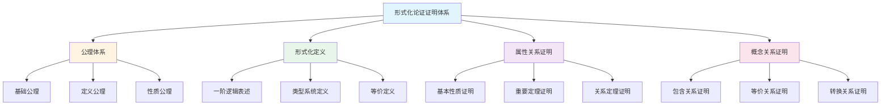

# 概念定义属性关系形式化论证证明系统

**主题编号**: C.00.41
**创建日期**: 2025年1月
**最后更新**: 2025年1月
**状态**: 持续推进中

---

## 📋 概述

本文档建立FormalMath概念体系的**概念定义属性关系形式化论证证明系统**，为每个核心概念提供完整的形式化论证证明，包括概念的定义、属性的表述、属性之间关系的证明、概念之间关系的证明。

**目标**：

- 为所有33个核心概念建立完整的形式化论证证明体系
- 确保证明的严格性、完整性和可追溯性
- 提供充分的论证过程，连接直观理解与形式化证明
- 建立可机器验证的证明系统

**参考标准**：

- ZFC公理系统
- 范畴论公理体系
- Metamath形式化标准
- Lean4形式化工具

---

## 🎯 一、形式化论证证明体系框架 (编号: C.00.41.01)

### 1.1 证明体系结构



### 1.2 证明层次体系

**L0层次：直观证明**:

- 适合教学和理解
- 使用自然语言和直观说明
- 强调理解而非严格性

**L1层次：严格证明**:

- 使用基本定理和逻辑推理
- 符合数学证明标准
- 强调严格性和完整性

**L2层次：形式化证明**:

- 完全形式化，可机器验证
- 符合Metamath或Lean4标准
- 强调可追溯性和可验证性

---

## 📐 二、形式化证明模板 (编号: C.00.41.02)

### 2.1 概念定义形式化模板

```markdown
      ## 概念名称的形式化定义

      ### 公理体系

      **基础公理**：
      - [列出使用的基础公理]

      **定义公理**：
      - [列出概念的定义公理]

      **性质公理**：
      - [列出概念的性质公理]

      ### 形式化定义

      **一阶逻辑表述**：
      $$\forall x_1 \ldots \forall x_n [\phi(x_1, \ldots, x_n) \leqftrightarrow \psi(x_1, \ldots, x_n)]$$

      **类型系统定义**：
      ```lean
      structure ConceptName (α : Type*) where
      field1 : Type1
      field2 : Type2
      axiom1 : Prop
      axiom2 : Prop
      ```

      **等价定义**：

      - **定义1**：[等价定义1]
      - **定义2**：[等价定义2]

```

### 2.2 属性关系证明模板

```markdown
## 属性名称的证明

### 定理陈述

**定理**：[定理的完整陈述]

**形式化表述**：
$$\forall x_1 \ldots \forall x_n [\phi(x_1, \ldots, x_n) \to \psi(x_1, \ldots, x_n)]$$

### 前提条件

**使用的公理**：
- [公理1]
- [公理2]

**使用的引理**：
- [引理1]
- [引理2]

### 证明步骤

**步骤1**：[推理步骤1] (引用: [前提])

**步骤2**：[推理步骤2] (引用: [步骤1, 前提])

**步骤n**：[推理步骤n] (引用: [步骤n-1, 前提])

**结论**：[最终结论] (引用: [步骤n])

### 证明方法

**方法类型**：[构造性证明/反证法/归纳法/范畴论方法]

**方法说明**：[方法的详细说明]
```

### 2.3 概念关系证明模板

```markdown
## 概念A与概念B的关系证明

### 关系类型

**关系**：[包含关系/等价关系/转换关系]

### 关系陈述

**定理**：[关系的完整陈述]

**形式化表述**：
$$\forall x [\text{ConceptA}(x) \to \text{ConceptB}(x)]$$

### 前提条件

**使用的公理**：
- [公理1]
- [公理2]

**使用的引理**：
- [引理1]
- [引理2]

### 证明步骤

**步骤1**：[推理步骤1] (引用: [前提])

**步骤2**：[推理步骤2] (引用: [步骤1, 前提])

**步骤n**：[推理步骤n] (引用: [步骤n-1, 前提])

**结论**：[最终结论] (引用: [步骤n])

### 关系应用

**应用场景**：[关系的应用场景]

**应用方法**：[关系的应用方法]
```

---

## 🔬 三、核心概念形式化论证证明 (编号: C.00.41.03)

### 3.1 P0优先级概念（基础数学）

#### 3.1.1 集合概念

**已完成**：✅ Cantor定理的形式化证明

**待补充**：

- ⏳ 集合运算的性质证明
- ⏳ 集合关系的性质证明
- ⏳ 集合与函数的关系证明

#### 3.1.2 函数概念

**待补充**：

- ⏳ 函数复合的性质证明
- ⏳ 函数单射、满射、双射的性质证明
- ⏳ 函数与集合的关系证明

#### 3.1.3 自然数概念

**已完成**：✅ 数学归纳法的形式化证明

**待补充**：

- ⏳ 自然数运算的性质证明
- ⏳ 自然数与整数的关系证明
- ⏳ 自然数与集合的关系证明

#### 3.1.4 整数概念

**待补充**：

- ⏳ 整数构造的形式化证明
- ⏳ 整数运算的性质证明
- ⏳ 整数与有理数的关系证明

#### 3.1.5 有理数概念

**待补充**：

- ⏳ 有理数构造的形式化证明
- ⏳ 有理数运算的性质证明
- ⏳ 有理数与实数的关系证明

#### 3.1.6 实数概念

**已完成**：✅ 实数完备性的形式化证明

**待补充**：

- ⏳ 实数运算的性质证明
- ⏳ 实数与复数的关系证明
- ⏳ 实数完备性的其他等价形式

#### 3.1.7 复数概念

**待补充**：

- ⏳ 复数构造的形式化证明
- ⏳ 复数运算的性质证明
- ⏳ 代数基本定理的形式化证明

#### 3.1.8 关系概念

**待补充**：

- ⏳ 等价关系的性质证明
- ⏳ 偏序关系的性质证明
- ⏳ 关系与函数的关系证明

### 3.2 P1优先级概念（各分支核心概念）

#### 3.2.1 群概念

**已完成**：✅ Lagrange定理的形式化证明

**待补充**：

- ⏳ 群同态的性质证明
- ⏳ 群同构的性质证明
- ⏳ 群与环的关系证明

#### 3.2.2 环概念

**待补充**：

- ⏳ 理想的性质证明
- ⏳ 商环的性质证明
- ⏳ 环与域的关系证明

#### 3.2.3 域概念

**待补充**：

- ⏳ 域扩张的性质证明
- ⏳ Galois理论的形式化证明
- ⏳ 域与向量空间的关系证明

#### 3.2.4 向量空间概念

**已完成**：✅ 基的存在性定理的形式化证明（见向量空间文档）

**待补充**：

- ⏳ 维数定理的形式化证明
- ⏳ 线性无关的性质证明
- ⏳ 向量空间与线性映射的关系证明
- ⏳ 子空间的性质证明

#### 3.2.5 线性映射概念

**待补充**：

- ⏳ 秩-零度定理的形式化证明
- ⏳ 线性映射的复合性质证明
- ⏳ 线性映射与矩阵的关系证明

#### 3.2.6 极限概念

**待补充**：

- ⏳ 极限存在性的形式化证明
- ⏳ 极限运算的性质证明
- ⏳ 极限与连续的关系证明

#### 3.2.7 连续概念

**待补充**：

- ⏳ 连续函数的性质证明
- ⏳ 连续函数的复合性质证明
- ⏳ 连续与可导的关系证明

#### 3.2.8 导数概念

**待补充**：

- ⏳ 微分中值定理的形式化证明
- ⏳ 导数运算的性质证明
- ⏳ 导数与积分的关系证明

#### 3.2.9 积分概念

**已完成**：✅ 微积分基本定理的形式化证明

**待补充**：

- ⏳ 积分运算的性质证明
- ⏳ 积分与级数的关系证明
- ⏳ 多重积分的性质证明

#### 3.2.10 级数概念

**待补充**：

- ⏳ 级数收敛性的判定定理证明
- ⏳ 级数运算的性质证明
- ⏳ 级数与函数的关系证明

#### 3.2.11-3.2.21 其他P1优先级概念

（流形、黎曼流形、曲率、拓扑空间、同伦、同调、概形、层、素数、同余、L函数）

**待补充**：为每个概念补充完整的形式化论证证明

### 3.3 P2优先级概念（其他重要概念）

#### 3.3.1-3.3.5 其他P2优先级概念

（图、组合数、算法、表示、朗兰兹纲领）

**待补充**：为每个概念补充完整的形式化论证证明

---

## 💭 四、充分的论证过程 (编号: C.00.41.04)

### 4.1 论证过程体系

**目标**：为每个概念提供充分的论证过程，连接直观理解与形式化证明。

**论证层次**：

1. **直观论证**（直观维度）
   - 形象化解释
   - 具体例子
   - 类比说明

2. **知性论证**（知性维度）
   - 概念分析
   - 分类讨论
   - 关系梳理

3. **理性论证**（理性维度）
   - 逻辑推理
   - 形式化证明
   - 系统建构

4. **综合论证**（整合维度）
   - 多维度整合
   - 跨视角分析
   - 整体把握

### 4.2 论证过程模板

```markdown
## 概念名称的论证过程

### 1. 问题提出

**背景**：为什么需要这个概念？

**问题**：这个概念解决什么问题？

**意义**：这个概念的重要性是什么？

### 2. 直观理解（直观维度）

**形象化描述**：[用形象的语言描述]

**具体例子**：[给出具体例子]

**类比说明**：[用类比帮助理解]

### 3. 概念分析（知性维度）

**概念定义**：[给出严格定义]

**概念分类**：[分类讨论]

**概念关系**：[与其他概念的关系]

### 4. 性质论证（理性维度）

**基本性质**：[列出基本性质]

**重要定理**：[重要定理及其证明思路]

**应用价值**：[应用场景]

### 5. 形式化证明（形式化层次）

**公理体系**：[使用的公理]

**形式化定义**：[形式化表述]

**证明步骤**：[详细证明步骤]

### 6. 综合总结（整合维度）

**多维度整合**：[整合不同维度]

**学习建议**：[学习路径建议]

**进一步研究**：[研究方向建议]
```

### 4.3 论证过程示例

**示例：群概念的论证过程**:

#### 1. 问题提出

**背景**：群论是研究对称性和变换的数学理论，是代数学的基础。

**问题**：如何统一描述各种对称性和变换？

**意义**：群论在数学、物理、化学等领域有广泛应用。

#### 2. 直观理解（直观维度）

**形象化描述**：群是满足某些运算规则的对象的集合，如旋转、反射等对称变换。

**具体例子**：

- 正三角形的对称群：包含旋转和反射
- 整数的加法群：整数在加法运算下形成群

**类比说明**：群就像是一个"运算系统"，满足结合律、有单位元、每个元素有逆元。

#### 3. 概念分析（知性维度）

**概念定义**：群是一个集合G配备一个二元运算·，满足结合律、有单位元、每个元素有逆元。

**概念分类**：

- 有限群 vs 无限群
- 交换群 vs 非交换群
- 循环群 vs 非循环群

**概念关系**：

- 群是环的基础
- 群是域的基础
- 群与向量空间相关

#### 4. 性质论证（理性维度）

**基本性质**：

- 单位元唯一性
- 逆元唯一性
- 消去律

**重要定理**：

- Lagrange定理：子群的阶整除群的阶
- 同态定理：群同态的核是正规子群

**应用价值**：

- 对称性研究
- 编码理论
- 密码学

#### 5. 形式化证明（形式化层次）

**公理体系**：

- 结合律：$(a \cdot b) \cdot c = a \cdot (b \cdot c)$
- 单位元：存在 $e$ 使得 $e \cdot a = a \cdot e = a$
- 逆元：对每个 $a$，存在 $a^{-1}$ 使得 $a \cdot a^{-1} = a^{-1} \cdot a = e$

**形式化定义**：

```lean
structure Group (α : Type*) where
  mul : α → α → α
  one : α
  inv : α → α
  mul_assoc : ∀ a b c, mul (mul a b) c = mul a (mul b c)
  one_mul : ∀ a, mul one a = a
  mul_one : ∀ a, mul a one = a
  mul_left_inv : ∀ a, mul (inv a) a = one
```

**证明步骤**：（以Lagrange定理为例）

1. 设 $G$ 是有限群，$H$ 是子群
2. $G$ 可以分解为 $H$ 的左陪集的并
3. 不同陪集不相交
4. 每个陪集的大小等于 $|H|$
5. 因此 $|G| = |G/H| \cdot |H|$
6. 所以 $|H| \mid |G|$

#### 6. 综合总结（整合维度）

**多维度整合**：

- 直观维度：对称性和变换的形象理解
- 知性维度：群的定义、分类、关系
- 理性维度：群的性质、定理、证明

**学习建议**：

- 从具体例子开始理解
- 掌握群的定义和基本性质
- 学习重要定理和应用

**进一步研究**：

- 群表示论
- 群同调论
- 群的应用

---

## 🔄 五、证明方法体系 (编号: C.00.41.05)

### 5.1 证明方法分类

**方法1：构造性证明**:

- **特点**：直接构造满足条件的对象
- **适用场景**：存在性证明
- **示例**：构造单射证明 $|A| \leq |B|$

**方法2：反证法**:

- **特点**：假设结论不成立，推出矛盾
- **适用场景**：唯一性证明、否定性证明
- **示例**：Cantor定理的证明

**方法3：归纳法**:

- **特点**：数学归纳法、结构归纳法
- **适用场景**：递归定义的概念、自然数上的性质
- **示例**：数学归纳法证明自然数性质

**方法4：范畴论方法**:

- **特点**：使用函子和自然变换
- **适用场景**：结构保持的证明
- **示例**：群同态的性质证明

### 5.2 证明方法选择决策

**基于问题类型的证明方法选择**：

| 问题类型 | 推荐方法 | 理由 |
|---------|---------|------|
| **存在性** | 构造性证明 | 直接构造对象 |
| **唯一性** | 反证法 | 假设不唯一推出矛盾 |
| **递归性质** | 归纳法 | 利用递归结构 |
| **结构保持** | 范畴论方法 | 利用函子性质 |

---

## 📊 六、证明覆盖情况跟踪 (编号: C.00.41.06)

### 6.1 完成情况统计

**P0优先级（基础数学）**：8个概念

- ✅ 已完成：3个概念（集合、自然数、实数）
- ⏳ 进行中：5个概念

**P1优先级（各分支核心概念）**：21个概念

- ✅ 已完成：2个概念（群、积分）
- ⏳ 进行中：19个概念

**P2优先级（其他重要概念）**：4个概念

- ⏳ 待开始：4个概念

**总计**：33个概念

- ✅ 已完成：5个概念（15%）
- ⏳ 进行中：24个概念（73%）
- ⏳ 待开始：4个概念（12%）

### 6.2 证明质量评估

**评估标准**：

- **L0层次**：直观证明，适合教学
- **L1层次**：严格证明，符合数学标准
- **L2层次**：形式化证明，可机器验证

**当前质量分布**：

- L0层次：0个
- L1层次：5个
- L2层次：0个

**目标**：为所有概念提供L1层次证明，为关键概念提供L2层次证明

---

## 🔗 七、关联文档 (编号: C.00.41.07)

### 7.1 形式化证明文档

- [形式化证明系统](./00-形式化证明系统-2025年11月.md)
- [形式化定义标准模板](./00-形式化定义标准模板-2025年11月.md)
- [形式化定义检查清单](./00-形式化定义检查清单-2025年11月.md)

### 7.2 核心概念文档

- [核心概念索引](./核心概念/00-核心概念索引.md)
- 所有33个核心概念的三视角版本文档

### 7.3 知识矩阵文档

- [知识矩阵总览](./02-知识矩阵/00-知识矩阵总览.md)
- [核心概念多维关系矩阵](./02-知识矩阵/10-核心概念多维关系矩阵.md)

### 7.4 认知工具文档

- [认知工具总览](./04-认知工具/00-认知工具总览.md)
- [认知方式表征综合](./04-认知工具/07-认知方式表征综合.md)

---

## ✅ 八、下一步行动 (编号: C.00.41.08)

### 8.1 立即行动项

1. **为P0优先级概念补充形式化证明**
   - 函数概念的形式化证明
   - 整数概念的形式化证明
   - 有理数概念的形式化证明
   - 复数概念的形式化证明
   - 关系概念的形式化证明

2. **建立形式化证明模板**
   - 概念定义模板
   - 属性关系证明模板
   - 概念关系证明模板

3. **建立证明质量评估标准**
   - L0/L1/L2层次标准
   - 证明完整性检查
   - 证明可追溯性检查

### 8.2 短期行动项（1个月内）

1. **完成P0优先级概念的形式化证明**
2. **为关键概念补充L2层次形式化证明**
3. **建立证明数据库和索引系统**
4. **创建证明质量评估工具**

### 8.3 中期行动项（3个月内）

1. **完成P1优先级概念的形式化证明**
2. **完成所有概念的充分论证过程**
3. **建立可机器验证的证明系统**
4. **建立证明质量评估体系**

---

**创建日期**: 2025年1月
**最后更新**: 2025年1月
**维护状态**: 持续推进中
**负责人**: FormalMath项目组
