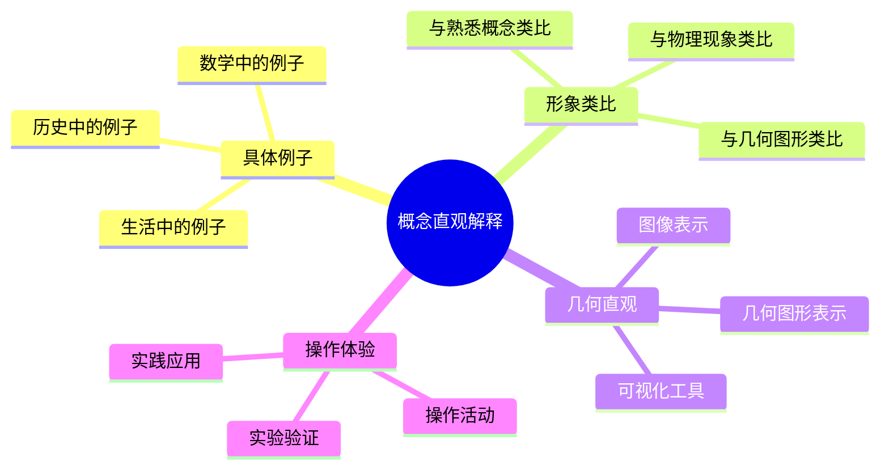
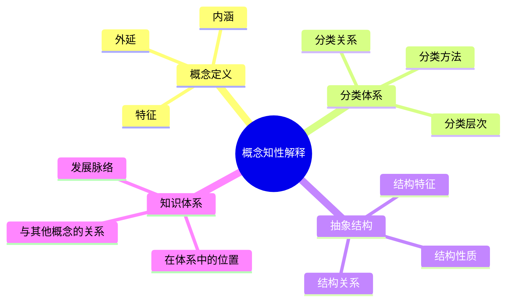
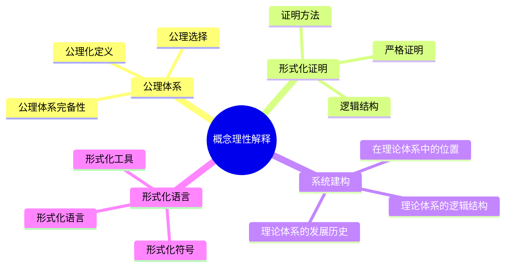
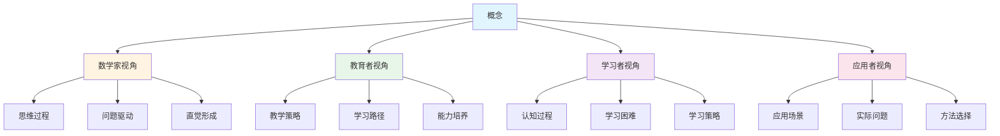
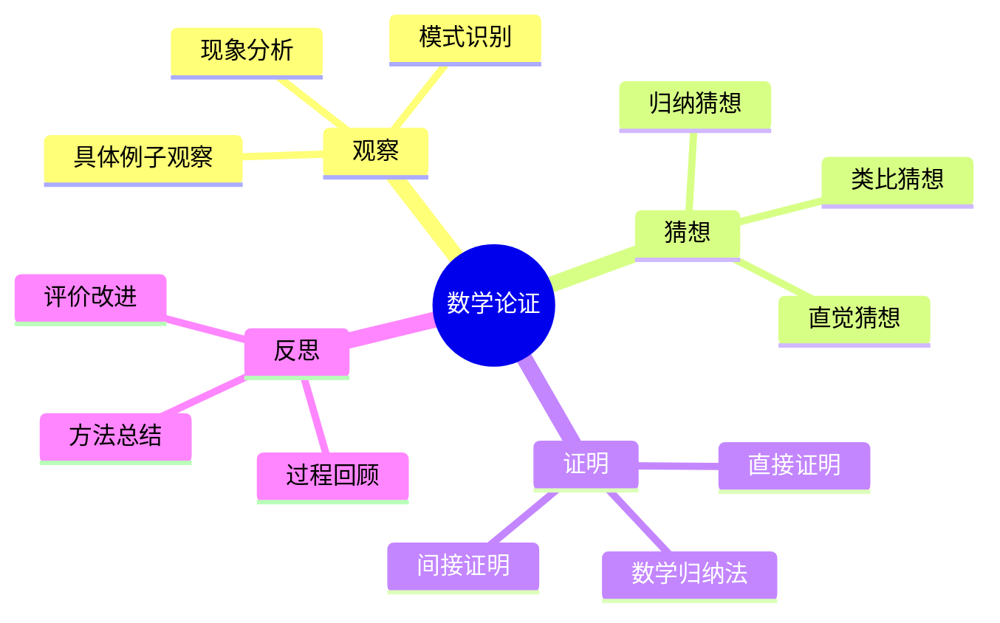
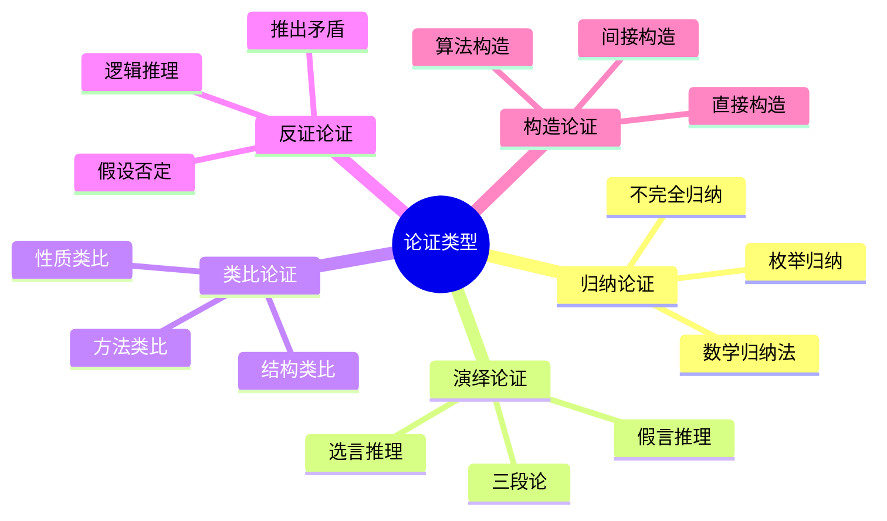
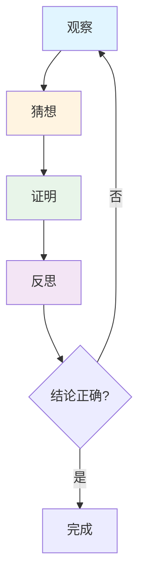
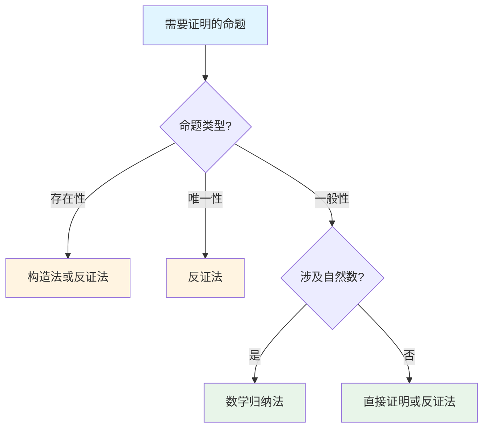
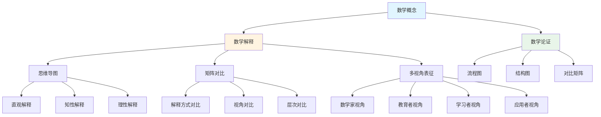
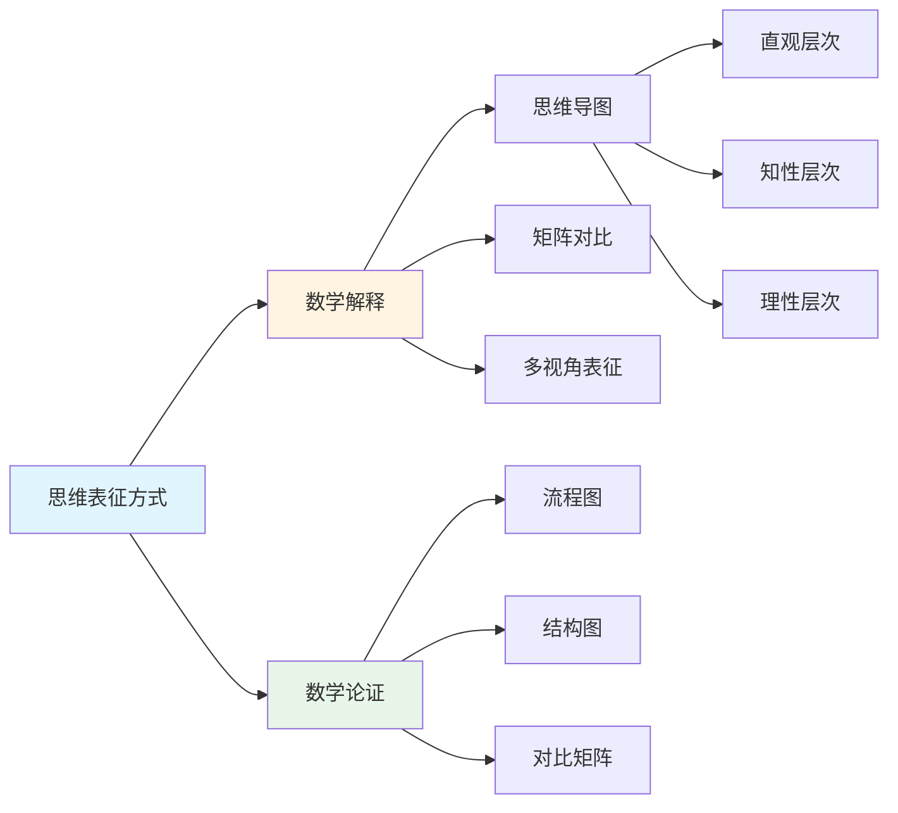

# 思维表征方式整合方案

**创建日期**: 2025年11月28日
**状态**: ✅ 完成

---

## 📋 概述

本文档整合多种思维表征方式，包括思维导图、矩阵对比、多视角表征等，建立思维表征方式的整合应用框架，为33个核心概念的思维表征提供理论基础和方法指导。

**目标**：

- 整合多种思维表征方式
- 建立思维表征方式的整合框架
- 提供思维表征方式的应用指南
- 指导思维表征方式在数学解释和论证中的应用

---

## 🎯 一、思维表征方式的分类

### 1.1 按结构类型分类

#### 1.1.1 树状结构

**代表工具**：思维导图

**特征**：

- 层次清晰
- 关系单一（主要是父子关系）
- 适合展示知识结构

**应用场景**：

- 概念的知识结构
- 概念的分支关系
- 概念的学习路径

#### 1.1.2 网络结构

**代表工具**：知识图谱、概念地图

**特征**：

- 关系复杂
- 多关系类型
- 适合展示关系网络

**应用场景**：

- 概念的关系网络
- 概念的多重关系
- 概念的关联分析

#### 1.1.3 矩阵结构

**代表工具**：知识矩阵、对比矩阵

**特征**：

- 易于比较
- 量化关系
- 适合对比分析

**应用场景**：

- 概念特征对比
- 概念关系对比
- 多维度分析

#### 1.1.4 层次结构

**代表工具**：概念层次、知识层次

**特征**：

- 层次分明
- 递进关系
- 适合展示层次

**应用场景**：

- 概念的层次结构
- 概念的递进关系
- 概念的层次分析

### 1.2 按功能类型分类

#### 1.2.1 知识组织类

**工具**：思维导图、知识图谱、概念地图

**功能**：

- 组织知识结构
- 展示知识关系
- 建立知识体系

#### 1.2.2 对比分析类

**工具**：矩阵对比、特征对比

**功能**：

- 对比概念特征
- 对比关系类型
- 多维度分析

#### 1.2.3 过程展示类

**工具**：流程图、过程图

**功能**：

- 展示思维过程
- 展示推理过程
- 展示问题解决过程

#### 1.2.4 多视角类

**工具**：多视角思维导图、多视角矩阵

**功能**：

- 展示多视角理解
- 整合不同视角
- 对比不同视角

---

## 🎯 二、思维表征方式在数学解释中的应用

### 2.1 思维导图在数学解释中的应用

#### 2.1.1 直观解释的思维导图

**结构**：

**应用**：

- 展示直观解释的结构
- 组织直观解释的内容
- 指导直观解释的设计

#### 2.1.2 知性解释的思维导图

**结构**：

**应用**：

- 展示知性解释的结构
- 组织知性解释的内容
- 指导知性解释的设计

#### 2.1.3 理性解释的思维导图

**结构**：

**应用**：

- 展示理性解释的结构
- 组织理性解释的内容
- 指导理性解释的设计

### 2.2 矩阵对比在数学解释中的应用

#### 2.2.1 解释方式对比矩阵

| 解释方式 | 直观解释 | 知性解释 | 理性解释 |
|---------|---------|---------|---------|
| **特点** | 具体、形象、可视 | 概念、分类、抽象 | 公理、证明、形式化 |
| **方法** | 例子、类比、直观 | 定义、分类、结构 | 公理、证明、系统 |
| **工具** | 图形、图像、动画 | 概念图、知识图谱 | 形式化工具、证明系统 |
| **适用阶段** | 入门阶段 | 中级阶段 | 高级阶段 |
| **优势** | 易于理解 | 系统完整 | 严格准确 |
| **局限** | 不够严格 | 不够直观 | 不够具体 |

#### 2.2.2 视角对比矩阵

| 视角 | 数学家视角 | 教育者视角 | 学习者视角 | 应用者视角 |
|------|-----------|-----------|-----------|-----------|
| **关注点** | 思维过程 | 教学策略 | 认知过程 | 应用场景 |
| **方法** | 第一人称描述 | 教学设计 | 认知分析 | 应用案例 |
| **工具** | 思维导图 | 教学资源 | 学习工具 | 应用工具 |
| **优势** | 深入理解 | 有效教学 | 易于学习 | 实际应用 |

### 2.3 多视角表征在数学解释中的应用

#### 2.3.1 多视角思维导图

**结构**：

#### 2.3.2 多视角矩阵整合

**整合方法**：

- 将不同视角的解释整合到一个矩阵中
- 对比不同视角的解释方式
- 展示不同视角的互补关系

---

## 🎯 三、思维表征方式在数学论证中的应用

### 3.1 思维导图在数学论证中的应用

#### 3.1.1 论证过程思维导图

**结构**：

#### 3.1.2 论证类型思维导图

**结构**：

### 3.2 矩阵对比在数学论证中的应用

#### 3.2.1 论证类型对比矩阵

| 论证类型 | 推理方向 | 结论性质 | 严格程度 | 适用场景 | 优势 | 局限 |
|---------|---------|---------|---------|---------|------|------|
| **归纳论证** | 特殊→一般 | 或然性 | 中等 | 发现规律 | 启发性强 | 不够严格 |
| **演绎论证** | 一般→特殊 | 必然性 | 高 | 严格证明 | 严格准确 | 需要前提 |
| **类比论证** | 相似→相似 | 或然性 | 低 | 启发思考 | 易于理解 | 不够严格 |
| **反证论证** | 否定→矛盾 | 必然性 | 高 | 存在性证明 | 逻辑清晰 | 需要技巧 |
| **构造论证** | 构造→存在 | 必然性 | 高 | 存在性证明 | 具体明确 | 需要构造 |

#### 3.2.2 论证步骤对比矩阵

| 论证步骤 | 观察 | 猜想 | 证明 | 反思 |
|---------|------|------|------|------|
| **主要活动** | 发现规律 | 提出假设 | 严格证明 | 总结评价 |
| **思维特点** | 感性认识 | 直觉思维 | 逻辑思维 | 元认知 |
| **工具支持** | 观察工具 | 猜想工具 | 证明工具 | 反思工具 |
| **时间分配** | 20% | 20% | 50% | 10% |

### 3.3 流程图在数学论证中的应用

#### 3.3.1 论证过程流程图

**基本流程**：

#### 3.3.2 证明方法选择流程图

**选择流程**：

---

## 🎯 四、思维表征方式的整合框架

### 4.1 整合原则

#### 4.1.1 互补性原则

- **不同工具互补**：不同工具具有不同的优势
- **不同视角互补**：不同视角提供不同的理解
- **不同层次互补**：不同层次满足不同需求

#### 4.1.2 层次性原则

- **直观层次**：使用思维导图、可视化工具
- **知性层次**：使用矩阵对比、知识图谱
- **理性层次**：使用形式化工具、证明系统

#### 4.1.3 整合性原则

- **工具整合**：整合多种工具
- **视角整合**：整合多种视角
- **层次整合**：整合多种层次

### 4.2 整合框架

### 4.3 应用流程

#### 4.3.1 数学解释的应用流程

1. **选择解释层次**：根据学习阶段选择直观、知性或理性解释
2. **选择解释视角**：根据需求选择数学家、教育者、学习者或应用者视角
3. **选择表征工具**：根据解释内容选择思维导图、矩阵对比或多视角表征
4. **整合表征方式**：整合多种表征方式，形成完整的解释

#### 4.3.2 数学论证的应用流程

1. **观察阶段**：使用观察工具和思维导图
2. **猜想阶段**：使用猜想工具和类比矩阵
3. **证明阶段**：使用证明工具和流程图
4. **反思阶段**：使用反思工具和对比矩阵

---

## 🎯 五、思维表征方式的应用指南

### 5.1 针对不同学习阶段

#### 5.1.1 入门阶段

**推荐工具**：

- **思维导图**：展示概念结构
- **可视化工具**：展示直观理解
- **简单矩阵**：对比基本特征

**应用重点**：

- 直观理解
- 形象表征
- 简单对比

#### 5.1.2 中级阶段

**推荐工具**：

- **知识图谱**：展示关系网络
- **矩阵对比**：对比概念特征
- **多视角表征**：展示多角度理解

**应用重点**：

- 概念理解
- 关系分析
- 多角度思考

#### 5.1.3 高级阶段

**推荐工具**：

- **形式化工具**：展示形式化结构
- **证明系统**：展示证明过程
- **系统建构图**：展示理论体系

**应用重点**：

- 严格证明
- 系统建构
- 理论发展

### 5.2 针对不同学习目标

#### 5.2.1 理解概念

**推荐工具**：

- **思维导图**：展示概念结构
- **矩阵对比**：对比概念特征
- **多视角表征**：展示多角度理解

**应用方法**：

- 从多个角度理解概念
- 对比不同概念
- 整合不同视角

#### 5.2.2 应用概念

**推荐工具**：

- **应用流程图**：展示应用过程
- **案例矩阵**：对比应用场景
- **方法选择图**：指导方法选择

**应用方法**：

- 展示应用过程
- 对比应用场景
- 指导方法选择

#### 5.2.3 发展能力

**推荐工具**：

- **思维过程图**：展示思维过程
- **能力发展图**：展示能力发展
- **反思矩阵**：引导反思

**应用方法**：

- 展示思维过程
- 培养思维能力
- 引导反思

---

## 📊 六、思维表征方式整合框架总结

### 6.1 框架结构

### 6.2 应用原则

1. **多层次结合**：结合直观、知性、理性三个层次
2. **多工具并用**：使用思维导图、矩阵对比、流程图等多种工具
3. **多视角整合**：整合数学家、教育者、学习者、应用者四个视角
4. **因材施教**：根据学习阶段和学习目标选择适当的表征方式

---

## 📝 七、下一步工作

1. **为前10个核心概念添加数学解释**：使用思维导图、矩阵对比等工具
2. **为前10个核心概念添加数学论证**：使用流程图、结构图等工具
3. **开发思维表征工具**：开发思维导图、矩阵对比等工具的制作指南

---

**文档创建时间**: 2025年11月28日
**状态**: ✅ 完成
