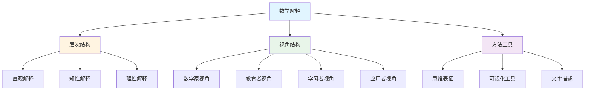

# 数学解释理论框架

**创建日期**: 2025年11月28日
**状态**: ✅ 完成

---

## 📋 概述

本文档建立数学解释的理论框架，明确数学解释的定义、特征、层次结构，以及与数学定义的区别，为33个核心概念的数学解释提供理论基础。

**目标**：

- 建立数学解释的理论框架
- 明确数学解释的层次结构
- 提供数学解释的方法和标准

---

## 🎯 一、数学解释的定义和特征

### 1.1 数学解释的定义

**数学解释**是指通过多种方式（直观、知性、理性）帮助学习者理解数学概念、定理、方法的内在含义、形成过程、应用场景和思维本质的过程。

**核心要素**：

- **为什么**：解释概念为什么是这样定义的
- **如何形成**：解释概念是如何形成的
- **如何应用**：解释概念如何应用
- **思维本质**：揭示概念背后的数学思维

### 1.2 数学解释与数学定义的区别

| 维度 | 数学定义 | 数学解释 |
|------|---------|---------|
| **目的** | 精确描述概念 | 帮助理解概念 |
| **内容** | 形式化表述 | 多角度说明 |
| **方式** | 符号、公式 | 文字、图像、例子 |
| **层次** | 单一层次 | 多层次（直观、知性、理性） |
| **受众** | 专业数学工作者 | 所有学习者 |
| **作用** | 规范概念 | 理解概念 |

### 1.3 数学解释的特征

#### 1.3.1 多维度性

数学解释应该从多个维度进行：

- **历史维度**：概念的历史发展
- **认知维度**：概念的认知过程
- **应用维度**：概念的实际应用
- **美学维度**：概念的数学美

#### 1.3.2 多层次性

数学解释应该包含多个层次：

- **直观层次**：感性认识、形象思维
- **知性层次**：概念理解、分类归纳
- **理性层次**：逻辑推理、形式化证明

#### 1.3.3 多视角性

数学解释应该从多个视角进行：

- **数学家视角**：数学家如何思考
- **教育者视角**：如何教学
- **学习者视角**：如何学习
- **应用者视角**：如何应用

---

## 🎯 二、数学解释的层次结构

### 2.1 直观解释（Intuitive Explanation）

#### 2.1.1 定义

**直观解释**是通过具体例子、形象类比、几何直观等方式，帮助学习者获得对数学概念的感性认识和形象理解。

#### 2.1.2 特征

- **具体性**：使用具体的例子
- **形象性**：使用形象的类比
- **可视性**：使用图形、图像
- **体验性**：通过操作获得体验

#### 2.1.3 方法

1. **具体例子**
   - 使用生活中的例子
   - 使用数学中的具体例子
   - 使用历史中的例子

2. **形象类比**
   - 与熟悉的概念类比
   - 与物理现象类比
   - 与几何图形类比

3. **几何直观**
   - 使用几何图形
   - 使用图像表示
   - 使用可视化工具

4. **操作体验**
   - 通过操作理解概念
   - 通过实验验证概念
   - 通过实践应用概念

#### 2.1.4 示例：集合的直观解释

**具体例子**：

- 一个班级的学生构成一个集合
- 书架上的书构成一个集合
- 自然数构成一个集合

**形象类比**：

- 集合就像一个"容器"，里面装着元素
- 集合就像"袋子"，元素就像"球"

**几何直观**：

- 使用韦恩图表示集合
- 使用数轴表示数集

### 2.2 知性解释（Intellectual Explanation）

#### 2.2.1 定义

**知性解释**是通过概念定义、分类体系、抽象结构等方式，帮助学习者理解数学概念的本质特征、分类关系和抽象结构。

#### 2.2.2 特征

- **概念性**：强调概念的本质
- **分类性**：进行分类和归纳
- **抽象性**：揭示抽象结构
- **系统性**：建立知识体系

#### 2.2.3 方法

1. **概念定义**
   - 明确概念的内涵
   - 明确概念的外延
   - 明确概念的特征

2. **分类体系**
   - 概念的分类
   - 概念的关系
   - 概念的层次

3. **抽象结构**
   - 概念的结构
   - 概念的性质
   - 概念的关系

4. **知识体系**
   - 概念在知识体系中的位置
   - 概念与其他概念的关系
   - 概念的发展脉络

#### 2.2.4 示例：集合的知性解释

**概念定义**：

- 集合是由确定的、互不相同的对象组成的整体
- 集合的元素具有确定性、互异性、无序性

**分类体系**：

- 有限集与无限集
- 可数集与不可数集
- 空集、单元素集、多元素集

**抽象结构**：

- 集合的运算结构（并、交、补）
- 集合的关系结构（包含、相等）
- 集合的代数结构（幂集、笛卡尔积）

### 2.3 理性解释（Rational Explanation）

#### 2.3.1 定义

**理性解释**是通过公理体系、形式化证明、系统建构等方式，帮助学习者理解数学概念的逻辑基础、证明过程和理论体系。

#### 2.3.2 特征

- **逻辑性**：强调逻辑推理
- **严格性**：强调严格证明
- **系统性**：强调系统建构
- **形式化**：使用形式化语言

#### 2.3.3 方法

1. **公理体系**
   - 概念的公理化定义
   - 公理的选择和意义
   - 公理体系的完备性

2. **形式化证明**
   - 严格的形式化证明
   - 证明的逻辑结构
   - 证明的方法和技巧

3. **系统建构**
   - 概念在理论体系中的位置
   - 理论体系的逻辑结构
   - 理论体系的发展历史

4. **形式化语言**
   - 使用形式化符号
   - 使用形式化语言
   - 使用形式化工具

#### 2.3.4 示例：集合的理性解释

**公理体系**：

- ZFC公理体系
- 外延公理、空集公理、配对公理等
- 公理体系的独立性和完备性

**形式化证明**：

- 集合运算的性质证明
- 集合关系的性质证明
- 集合定理的严格证明

**系统建构**：

- 集合论在数学基础中的地位
- 集合论与其他数学分支的关系
- 集合论的发展历史

---

## 🎯 三、数学解释的多视角结构

### 3.1 数学家视角的解释

#### 3.1.1 特征

- **思维过程**：展示数学家的思维过程
- **问题驱动**：从问题出发理解概念
- **直觉形成**：展示数学直觉的形成
- **美感体验**：展示数学的美感

#### 3.1.2 方法

1. **第一人称描述**：用第一人称描述思维过程
2. **问题提出**：展示问题的提出过程
3. **概念形成**：展示概念的形成过程
4. **理论发展**：展示理论的发展过程

### 3.2 教育者视角的解释

#### 3.2.1 特征

- **教学策略**：提供教学策略
- **学习路径**：设计学习路径
- **难点突破**：帮助突破难点
- **能力培养**：培养数学能力

#### 3.2.2 方法

1. **教学设计**：设计教学活动
2. **学习指导**：提供学习指导
3. **评估方法**：提供评估方法
4. **资源推荐**：推荐学习资源

### 3.3 学习者视角的解释

#### 3.3.1 特征

- **认知过程**：关注认知过程
- **困难识别**：识别学习困难
- **策略提供**：提供学习策略
- **反思引导**：引导反思

#### 3.3.2 方法

1. **认知分析**：分析认知过程
2. **困难诊断**：诊断学习困难
3. **策略指导**：提供学习策略
4. **反思引导**：引导反思

### 3.4 应用者视角的解释

#### 3.4.1 特征

- **应用场景**：展示应用场景
- **实际问题**：联系实际问题
- **方法选择**：指导方法选择
- **效果评估**：评估应用效果

#### 3.4.2 方法

1. **应用案例**：提供应用案例
2. **问题解决**：展示问题解决过程
3. **方法选择**：指导方法选择
4. **效果评估**：评估应用效果

---

## 🎯 四、数学解释的方法和工具

### 4.1 思维表征方式

#### 4.1.1 思维导图

**作用**：

- 展示概念的知识结构
- 展示概念的关系网络
- 展示概念的层次结构

**应用**：

- 概念的整体结构
- 概念的分支关系
- 概念的学习路径

#### 4.1.2 矩阵对比

**作用**：

- 对比不同概念的特征
- 对比不同解释方式
- 对比不同应用场景

**应用**：

- 概念特征对比
- 解释方式对比
- 应用场景对比

#### 4.1.3 多视角表征

**作用**：

- 从不同角度表征概念
- 展示概念的多面性
- 整合不同视角的理解

**应用**：

- 多视角思维导图
- 多视角矩阵对比
- 多视角知识图谱

### 4.2 可视化工具

#### 4.2.1 图形表示

- **几何图形**：使用几何图形表示概念
- **函数图像**：使用函数图像表示概念
- **流程图**：使用流程图表示过程

#### 4.2.2 动画演示

- **动态演示**：使用动画演示概念
- **交互演示**：使用交互工具演示概念
- **模拟实验**：使用模拟实验演示概念

### 4.3 文字描述

#### 4.3.1 叙述性描述

- **历史叙述**：叙述概念的历史发展
- **故事叙述**：用故事叙述概念
- **案例叙述**：用案例叙述概念

#### 4.3.2 分析性描述

- **概念分析**：分析概念的本质
- **关系分析**：分析概念的关系
- **应用分析**：分析概念的应用

---

## 🎯 五、数学解释的质量标准

### 5.1 准确性

- **概念准确**：概念解释准确无误
- **逻辑准确**：逻辑推理准确无误
- **事实准确**：历史事实准确无误

### 5.2 完整性

- **层次完整**：包含所有层次（直观、知性、理性）
- **视角完整**：包含所有视角（数学家、教育者、学习者、应用者）
- **内容完整**：包含所有必要内容

### 5.3 清晰性

- **表达清晰**：表达清晰易懂
- **结构清晰**：结构清晰有序
- **逻辑清晰**：逻辑清晰连贯

### 5.4 深度性

- **深度理解**：深入理解概念本质
- **深度分析**：深入分析概念关系
- **深度应用**：深入应用概念方法

### 5.5 启发性

- **启发思考**：启发学习者思考
- **启发探索**：启发学习者探索
- **启发创新**：启发学习者创新

---

## 🎯 六、数学解释的应用指南

### 6.1 针对不同学习阶段

#### 6.1.1 入门阶段

- **重点**：直观解释
- **方法**：具体例子、形象类比、几何直观
- **工具**：思维导图、可视化工具

#### 6.1.2 中级阶段

- **重点**：知性解释
- **方法**：概念定义、分类体系、抽象结构
- **工具**：矩阵对比、知识图谱

#### 6.1.3 高级阶段

- **重点**：理性解释
- **方法**：公理体系、形式化证明、系统建构
- **工具**：形式化工具、证明系统

### 6.2 针对不同学习目标

#### 6.2.1 理解概念

- **重点**：概念的本质和特征
- **方法**：多角度解释、多维度分析
- **工具**：思维导图、矩阵对比

#### 6.2.2 应用概念

- **重点**：概念的应用场景和方法
- **方法**：应用案例、问题解决
- **工具**：应用流程图、案例库

#### 6.2.3 发展能力

- **重点**：数学思维和能力
- **方法**：思维过程展示、能力培养
- **工具**：思维导图、能力评估工具

---

## 📊 七、数学解释框架总结

### 7.1 框架结构

### 7.2 应用原则

1. **多层次结合**：结合直观、知性、理性三个层次
2. **多视角整合**：整合数学家、教育者、学习者、应用者四个视角
3. **多工具并用**：使用思维导图、矩阵对比、可视化等多种工具
4. **因材施教**：根据学习阶段和学习目标选择解释方式

---

## 📝 八、下一步工作

1. **完成数学论证过程分析**：建立数学论证的理论框架
2. **整合思维表征方式**：建立思维表征方式的整合方案
3. **为前10个核心概念添加数学解释**：验证理论框架的有效性

---

**文档创建时间**: 2025年11月28日
**状态**: ✅ 完成
