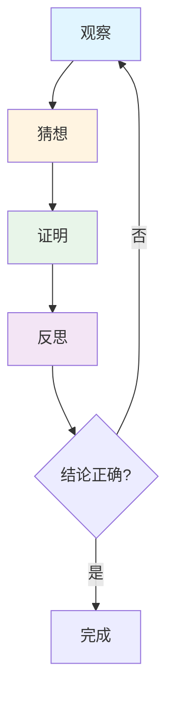
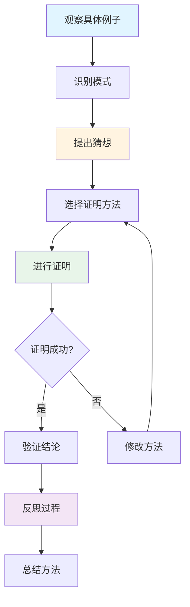
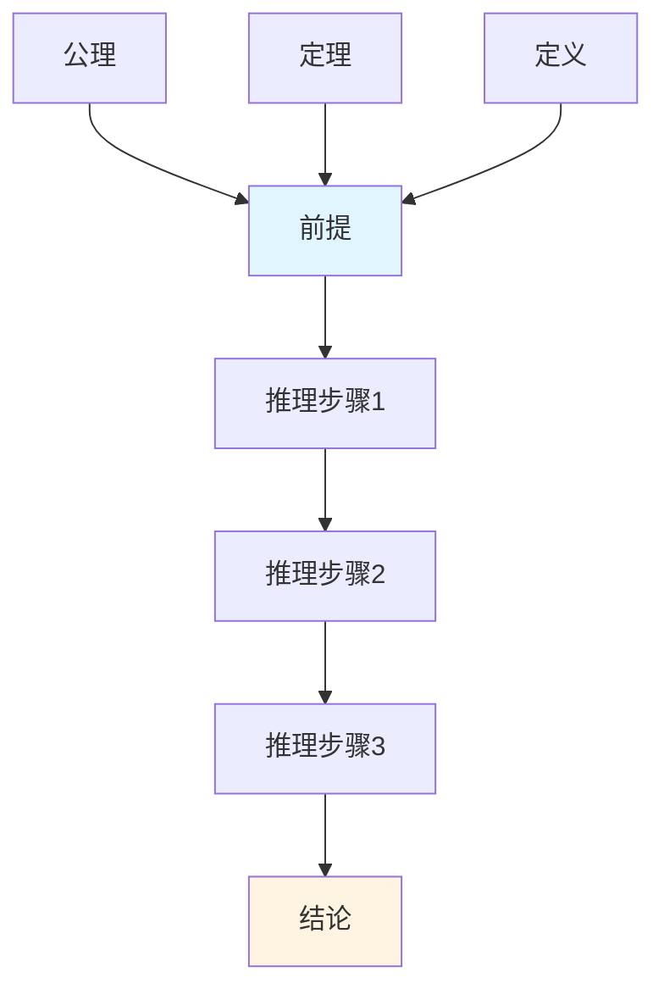
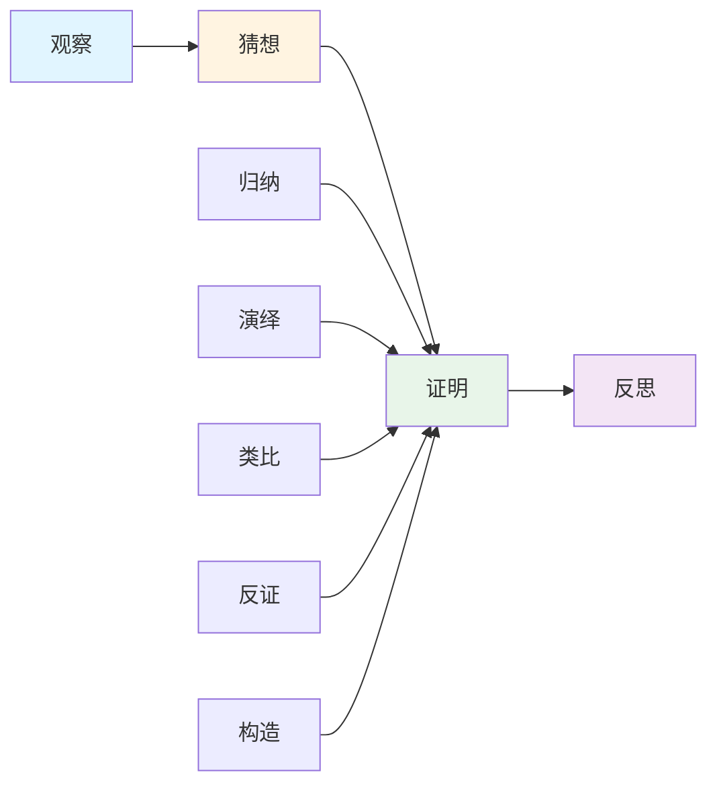

# 数学论证过程分析

**创建日期**: 2025年11月28日
**状态**: ✅ 完成

---

## 📋 概述

本文档分析数学论证的完整过程，包括论证步骤、论证类型、思维过程可视化，以及论证在教学中的应用，为33个核心概念的数学论证提供理论基础。

**目标**：

- 分析数学论证的完整过程
- 明确数学论证的类型和方法
- 提供数学论证的可视化方法
- 指导数学论证在教学中的应用

---

## 🎯 一、数学论证的定义和特征

### 1.1 数学论证的定义

**数学论证**是指通过逻辑推理、严格证明、系统建构等方式，从已知条件出发，经过一系列逻辑步骤，得出结论或建立理论的完整过程。

**核心要素**：

- **前提**：已知条件、公理、定理
- **推理**：逻辑推理过程
- **结论**：得出的结论或建立的定理
- **反思**：对论证过程的反思

### 1.2 数学论证的特征

#### 1.2.1 逻辑性

- **严格逻辑**：使用严格的逻辑推理
- **逻辑结构**：具有清晰的逻辑结构
- **逻辑链条**：形成完整的逻辑链条

#### 1.2.2 严格性

- **严格证明**：使用严格的证明方法
- **严格表述**：使用严格的数学语言
- **严格检验**：进行严格的逻辑检验

#### 1.2.3 系统性

- **系统建构**：系统建构数学理论
- **系统关联**：建立概念之间的系统关联
- **系统发展**：推动理论的系统发展

#### 1.2.4 创造性

- **创新思维**：需要创新思维
- **方法创新**：需要方法创新
- **理论创新**：需要理论创新

---

## 🎯 二、数学论证的步骤

### 2.1 观察（Observation）

#### 2.1.1 定义

**观察**是指通过具体例子、实验、计算等方式，发现数学现象、规律和模式的过程。

#### 2.1.2 方法

1. **具体例子观察**
   - 通过具体例子发现规律
   - 通过计算发现模式
   - 通过实验验证猜想

2. **模式识别**
   - 识别数学模式
   - 识别数学规律
   - 识别数学结构

3. **现象分析**
   - 分析数学现象
   - 分析数学关系
   - 分析数学性质

#### 2.1.3 示例：集合的观察

**具体例子观察**：

- 观察有限集合的元素个数
- 观察集合运算的结果
- 观察集合关系的特征

**模式识别**：

- 识别集合运算的规律
- 识别集合关系的模式
- 识别集合结构的特征

### 2.2 猜想（Conjecture）

#### 2.2.1 定义

**猜想**是指基于观察结果，提出关于数学现象、规律和模式的假设或命题。

#### 2.2.2 方法

1. **归纳猜想**
   - 从特殊到一般
   - 从具体到抽象
   - 从有限到无限

2. **类比猜想**
   - 与已知结果类比
   - 与相似结构类比
   - 与相关概念类比

3. **直觉猜想**
   - 基于数学直觉
   - 基于数学美感
   - 基于数学经验

#### 2.2.3 示例：集合的猜想

**归纳猜想**：

- 从有限集合的运算规律猜想无限集合的运算规律
- 从具体集合的性质猜想一般集合的性质

**类比猜想**：

- 与数的运算类比，猜想集合的运算
- 与逻辑运算类比，猜想集合的运算

### 2.3 证明（Proof）

#### 2.3.1 定义

**证明**是指通过严格的逻辑推理，从已知条件出发，经过一系列逻辑步骤，证明猜想或命题的过程。

#### 2.3.2 方法

1. **直接证明**
   - 从条件直接推出结论
   - 使用已知定理
   - 使用逻辑推理

2. **间接证明**
   - 反证法
   - 归谬法
   - 构造法

3. **数学归纳法**
   - 第一数学归纳法
   - 第二数学归纳法
   - 强归纳法

#### 2.3.3 示例：集合的证明

**直接证明**：

- 直接证明集合运算的性质
- 直接证明集合关系的性质

**间接证明**：

- 用反证法证明集合的某些性质
- 用构造法证明集合的存在性

### 2.4 反思（Reflection）

#### 2.4.1 定义

**反思**是指对论证过程进行回顾、总结、评价和改进的过程。

#### 2.4.2 方法

1. **过程回顾**
   - 回顾论证过程
   - 检查逻辑链条
   - 验证推理步骤

2. **方法总结**
   - 总结证明方法
   - 总结证明技巧
   - 总结证明思路

3. **评价改进**
   - 评价证明的优劣
   - 寻找改进方法
   - 探索新的证明方法

#### 2.4.3 示例：集合的反思

**过程回顾**：

- 回顾集合运算性质的证明过程
- 检查证明的逻辑链条

**方法总结**：

- 总结集合证明的常用方法
- 总结集合证明的技巧

---

## 🎯 三、数学论证的类型

### 3.1 归纳论证（Inductive Reasoning）

#### 3.1.1 定义

**归纳论证**是从特殊到一般的推理过程，通过观察多个特殊例子，得出一般结论。

#### 3.1.2 特征

- **从特殊到一般**：从特殊例子推出一般结论
- **不完全归纳**：基于有限例子
- **或然性**：结论具有或然性

#### 3.1.3 方法

1. **枚举归纳**：枚举所有情况
2. **不完全归纳**：基于部分例子
3. **数学归纳法**：严格的归纳证明

#### 3.1.4 示例

**不完全归纳**：

- 观察多个集合的运算规律
- 得出一般集合的运算规律

**数学归纳法**：

- 证明关于自然数的命题
- 证明关于集合的命题

### 3.2 演绎论证（Deductive Reasoning）

#### 3.2.1 定义

**演绎论证**是从一般到特殊的推理过程，从一般原理出发，推出特殊结论。

#### 3.2.2 特征

- **从一般到特殊**：从一般原理推出特殊结论
- **必然性**：结论具有必然性
- **严格性**：使用严格的逻辑推理

#### 3.2.3 方法

1. **三段论**：大前提、小前提、结论
2. **假言推理**：如果...那么...
3. **选言推理**：或者...或者...

#### 3.2.4 示例

**三段论**：

- 大前提：所有集合都有空集
- 小前提：A是一个集合
- 结论：A有空集

### 3.3 类比论证（Analogical Reasoning）

#### 3.3.1 定义

**类比论证**是通过比较相似结构，从已知结果推出未知结果的推理过程。

#### 3.3.2 特征

- **相似性**：基于相似结构
- **启发性**：具有启发性
- **或然性**：结论具有或然性

#### 3.3.3 方法

1. **结构类比**：比较结构相似性
2. **性质类比**：比较性质相似性
3. **方法类比**：比较方法相似性

#### 3.3.4 示例

**结构类比**：

- 集合的运算与数的运算类比
- 集合的关系与逻辑关系类比

### 3.4 反证论证（Proof by Contradiction）

#### 3.4.1 定义

**反证论证**是通过假设结论不成立，推出矛盾，从而证明结论成立的推理过程。

#### 3.4.2 特征

- **假设否定**：假设结论不成立
- **推出矛盾**：推出逻辑矛盾
- **证明成立**：从而证明结论成立

#### 3.4.3 方法

1. **假设否定**：假设结论不成立
2. **逻辑推理**：进行逻辑推理
3. **推出矛盾**：推出矛盾
4. **得出结论**：结论成立

#### 3.4.4 示例

**反证法证明**：

- 假设集合A不是空集
- 推出矛盾
- 从而证明A是空集

### 3.5 构造论证（Constructive Proof）

#### 3.5.1 定义

**构造论证**是通过构造具体的对象或方法，证明存在性或可行性的推理过程。

#### 3.5.2 特征

- **构造性**：构造具体对象
- **存在性**：证明存在性
- **可行性**：证明可行性

#### 3.5.3 方法

1. **直接构造**：直接构造对象
2. **间接构造**：通过其他对象构造
3. **算法构造**：通过算法构造

#### 3.5.4 示例

**构造证明**：

- 构造具体的集合
- 构造集合的运算
- 构造集合的关系

---

## 🎯 四、数学论证的思维过程可视化

### 4.1 论证流程图

#### 4.1.1 基本流程

#### 4.1.2 详细流程

### 4.2 论证结构图

#### 4.2.1 论证结构

### 4.3 论证类型对比矩阵

| 论证类型 | 推理方向 | 结论性质 | 严格程度 | 适用场景 |
|---------|---------|---------|---------|---------|
| **归纳论证** | 特殊→一般 | 或然性 | 中等 | 发现规律 |
| **演绎论证** | 一般→特殊 | 必然性 | 高 | 严格证明 |
| **类比论证** | 相似→相似 | 或然性 | 低 | 启发思考 |
| **反证论证** | 否定→矛盾 | 必然性 | 高 | 存在性证明 |
| **构造论证** | 构造→存在 | 必然性 | 高 | 存在性证明 |

---

## 🎯 五、数学论证在教学中的应用

### 5.1 培养学生的问题解决能力

#### 5.1.1 观察能力

- **培养观察习惯**：培养学生观察数学现象的习惯
- **提高观察能力**：提高学生识别模式和规律的能力
- **引导观察方法**：引导学生掌握观察的方法

#### 5.1.2 猜想能力

- **鼓励大胆猜想**：鼓励学生大胆提出猜想
- **培养猜想方法**：培养学生提出猜想的科学方法
- **验证猜想**：引导学生验证猜想

#### 5.1.3 证明能力

- **掌握证明方法**：帮助学生掌握各种证明方法
- **培养逻辑思维**：培养学生的逻辑思维能力
- **提高证明技巧**：提高学生的证明技巧

### 5.2 培养学生的数学思维

#### 5.2.1 逻辑思维

- **严格推理**：培养学生严格推理的能力
- **逻辑结构**：帮助学生理解逻辑结构
- **逻辑链条**：帮助学生建立逻辑链条

#### 5.2.2 创新思维

- **创新方法**：鼓励学生创新证明方法
- **多角度思考**：培养学生多角度思考的能力
- **探索精神**：培养学生的探索精神

### 5.3 教学设计

#### 5.3.1 观察活动设计

- **设计观察任务**：设计具体的观察任务
- **提供观察工具**：提供观察工具和方法
- **引导观察过程**：引导学生进行观察

#### 5.3.2 猜想活动设计

- **创设猜想情境**：创设有利于猜想的情境
- **引导猜想过程**：引导学生提出猜想
- **验证猜想**：引导学生验证猜想

#### 5.3.3 证明活动设计

- **选择证明方法**：帮助学生选择适当的证明方法
- **指导证明过程**：指导学生进行证明
- **评价证明结果**：评价学生的证明结果

---

## 📊 六、数学论证框架总结

### 6.1 论证过程框架

### 6.2 应用原则

1. **完整过程**：包含观察、猜想、证明、反思四个步骤
2. **多种方法**：使用归纳、演绎、类比、反证、构造等多种方法
3. **可视化**：使用流程图、结构图等可视化工具
4. **因材施教**：根据学生水平选择适当的论证方法

---

## 📝 七、下一步工作

1. **整合思维表征方式**：建立思维表征方式的整合方案
2. **为前10个核心概念添加数学论证**：验证理论框架的有效性
3. **开发论证工具**：开发数学论证的工具和模板

---

**文档创建时间**: 2025年11月28日
**状态**: ✅ 完成
