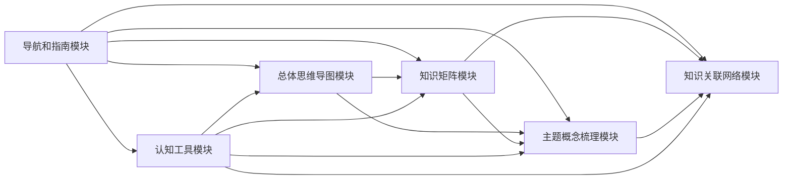

# FormalMath 概念体系系统概览

**主题编号**: C.00.11
**创建日期**: 2025年11月21日
**最后更新**: 2025年11月21日

---

## 📋 目录 / Table of Contents

- [FormalMath 概念体系系统概览](#formalmath-概念体系系统概览)
  - [📋 目录 / Table of Contents](#-目录--table-of-contents)
  - [📋 概述 (编号: C.00.11.01)](#-概述-编号-c001101)
  - [🏗️ 一、系统架构 (编号: C.00.11.02)](#️-一系统架构-编号-c001102)
    - [1.1 整体架构](#11-整体架构)
    - [1.2 模块层次](#12-模块层次)
  - [📊 二、模块功能 (编号: C.00.11.03)](#-二模块功能-编号-c001103)
    - [2.1 导航和指南模块 (C.00)](#21-导航和指南模块-c00)
    - [2.2 总体思维导图模块 (C.01)](#22-总体思维导图模块-c01)
    - [2.3 知识矩阵模块 (C.02)](#23-知识矩阵模块-c02)
    - [2.4 主题概念梳理模块 (C.03)](#24-主题概念梳理模块-c03)
    - [2.5 认知工具模块 (C.04)](#25-认知工具模块-c04)
    - [2.6 知识关联网络模块 (C.05)](#26-知识关联网络模块-c05)
    - [2.7 文档主题分析模块 (C.06)](#27-文档主题分析模块-c06)
  - [🔗 三、模块关系 (编号: C.00.11.04)](#-三模块关系-编号-c001104)
    - [3.1 模块依赖关系](#31-模块依赖关系)
    - [3.2 模块互补关系](#32-模块互补关系)
  - [📈 四、使用统计 (编号: C.00.11.05)](#-四使用统计-编号-c001105)
    - [4.1 文档统计](#41-文档统计)
    - [4.2 功能覆盖](#42-功能覆盖)
    - [4.3 扩展内容](#43-扩展内容)
  - [🔗 关联文档 (编号: C.00.11.06)](#-关联文档-编号-c001106)
    - [导航和使用文档](#导航和使用文档)
    - [总览文档](#总览文档)

---

## 📋 概述 (编号: C.00.11.01)

本文档提供FormalMath概念体系的系统概览，包括系统架构、模块功能、模块关系和使用统计。

**目标**: 提供概念体系的整体视图

---

## 🏗️ 一、系统架构 (编号: C.00.11.02)

### 1.1 整体架构

```mermaid
graph TD
    A[概念体系] --> B[导航和指南模块]
    A --> C[总体思维导图模块]
    A --> D[知识矩阵模块]
    A --> E[主题概念梳理模块]
    A --> F[认知工具模块]
    A --> G[知识关联网络模块]
    A --> H[文档主题分析模块]

    B --> B1[快速导航]
    B --> B2[使用指南]
    B --> B3[索引和FAQ]

    C --> C1[知识体系全景]
    C --> C2[分支关联]
    C --> C3[学习路径]

    D --> D1[关联矩阵]
    D --> D2[层次矩阵]
    D --> D3[难度矩阵]
    D --> D4[应用矩阵]
    D --> D5[历史发展]
    D --> D6[研究热点]
    D --> D7[时间维度]

    E --> E1[基础数学]
    E --> E2[代数结构]
    E --> E3[分析学]
    E --> E4[几何学]
    E --> E5[拓扑学]
    E --> E6[数论]
    E --> E7[交叉领域]

    F --> F1[思维模型]
    F --> F2[知识组织]
    F --> F3[学习策略]
    F --> F4[记忆理解]
    F --> F5[问题解决]

    G --> G1[概念关联]
    G --> G2[定理关联]
    G --> G3[方法关联]
```

### 1.2 模块层次

| 层次 | 模块 | 功能 |
|-----|------|------|
| **导航层** | 导航和指南模块 | 提供导航、指南、索引、FAQ等 |
| **展示层** | 总体思维导图模块 | 提供直观的知识结构展示 |
| **分析层** | 知识矩阵模块 | 提供多维度量化分析 |
| **内容层** | 主题概念梳理模块 | 提供详细的概念内容 |
| **工具层** | 认知工具模块 | 提供学习和理解工具 |
| **关系层** | 知识关联网络模块 | 提供细粒度的关联关系 |
| **分析层** | 文档主题分析模块 | 提供文档分析功能 |

---

## 📊 二、模块功能 (编号: C.00.11.03)

### 2.1 导航和指南模块 (C.00)

**功能**: 提供导航、指南、索引、FAQ等支持功能

**文档数**: 11个

| 文档 | 功能 |
|-----|------|
| [快速导航](./00-快速导航.md) | 快速找到所需文档 |
| [综合使用指南](./00-综合使用指南.md) | 详细使用指南 |
| [跨模块整合指南](./00-跨模块整合指南.md) | 模块整合指南 |
| [完整索引](./00-完整索引.md) | 完整文档索引 |
| [常见问题解答](./00-常见问题解答.md) | 常见问题解答 |
| [实际应用案例](./00-实际应用案例.md) | 实际应用案例 |
| [快速参考卡片](./00-快速参考卡片.md) | 快速参考卡片 |
| [实用模板与清单](./00-实用模板与清单.md) | 实用模板与清单 |
| [更新日志](./00-更新日志.md) | 更新历史记录 |
| [系统概览](./00-系统概览.md) | 系统概览（本文档） |
| [README.md](./README.md) | 概念体系总览 |
| [SUMMARY.md](./SUMMARY.md) | 概念体系总结 |

### 2.2 总体思维导图模块 (C.01)

**功能**: 提供直观的知识结构展示

**文档数**: 5个

| 文档 | 功能 |
|-----|------|
| [总体思维导图总览](./01-总体思维导图/00-总体思维导图总览.md) | 模块总览 |
| [数学知识体系全景图](./01-总体思维导图/01-数学知识体系全景图.md) | 知识全景 |
| [分支关联思维导图](./01-总体思维导图/02-分支关联思维导图.md) | 分支关联 |
| [学习路径思维导图](./01-总体思维导图/03-学习路径思维导图.md) | 学习路径 |
| [全面知识体系思维导图](./01-总体思维导图/04-全面知识体系思维导图.md) | 全面体系 |

### 2.3 知识矩阵模块 (C.02)

**功能**: 提供多维度量化分析

**文档数**: 9个

| 文档 | 功能 |
|-----|------|
| [知识矩阵总览](./02-知识矩阵/00-知识矩阵总览.md) | 矩阵总览 |
| [分支关联矩阵](./02-知识矩阵/01-分支关联矩阵.md) | 关联分析 |
| [概念层次矩阵](./02-知识矩阵/02-概念层次矩阵.md) | 层次分析 |
| [学习难度矩阵](./02-知识矩阵/03-学习难度矩阵.md) | 难度评估 |
| [应用场景矩阵](./02-知识矩阵/04-应用场景矩阵.md) | 应用分析 |
| [多维度知识矩阵总览](./02-知识矩阵/05-多维度知识矩阵总览.md) | 多维度总览 |
| [历史发展矩阵](./02-知识矩阵/06-历史发展矩阵.md) | 历史发展 ⭐ |
| [研究热点矩阵](./02-知识矩阵/07-研究热点矩阵.md) | 研究热点 ⭐ |
| [时间维度矩阵](./02-知识矩阵/08-时间维度矩阵.md) | 时间维度 ⭐ |

### 2.4 主题概念梳理模块 (C.03)

**功能**: 提供详细的概念内容

**文档数**: 8个

| 文档 | 功能 |
|-----|------|
| [主题概念总览](./03-主题概念梳理/00-主题概念总览.md) | 概念总览 |
| [基础数学概念](./03-主题概念梳理/01-基础数学概念.md) | 基础概念 |
| [代数结构概念](./03-主题概念梳理/02-代数结构概念.md) | 代数概念 |
| [分析学概念](./03-主题概念梳理/03-分析学概念.md) | 分析概念 |
| [几何学概念](./03-主题概念梳理/04-几何学概念.md) | 几何概念 |
| [拓扑学概念](./03-主题概念梳理/05-拓扑学概念.md) | 拓扑概念 |
| [数论概念](./03-主题概念梳理/06-数论概念.md) | 数论概念 |
| [交叉领域概念](./03-主题概念梳理/07-交叉领域概念.md) | 交叉概念 |

### 2.5 认知工具模块 (C.04)

**功能**: 提供学习和理解工具

**文档数**: 7个

| 文档 | 功能 |
|-----|------|
| [认知工具总览](./04-认知工具/00-认知工具总览.md) | 工具总览 |
| [思维模型工具](./04-认知工具/01-思维模型工具.md) | 思维模型 |
| [知识组织方法](./04-认知工具/02-知识组织方法.md) | 组织方法 |
| [认知工具应用指南](./04-认知工具/03-认知工具应用指南.md) | 应用指南 |
| [学习策略工具详细版](./04-认知工具/04-学习策略工具详细版.md) | 学习策略 ⭐ |
| [记忆与理解工具详细版](./04-认知工具/05-记忆与理解工具详细版.md) | 记忆理解 ⭐ |
| [问题解决工具](./04-认知工具/06-问题解决工具.md) | 问题解决 ⭐ |

### 2.6 知识关联网络模块 (C.05)

**功能**: 提供细粒度的关联关系

**文档数**: 4个

| 文档 | 功能 |
|-----|------|
| [知识关联网络总览](./05-知识关联网络/00-知识关联网络总览.md) | 网络总览 |
| [概念级关联网络](./05-知识关联网络/01-概念级关联网络.md) | 概念关联 ⭐ |
| [定理级关联网络](./05-知识关联网络/02-定理级关联网络.md) | 定理关联 ⭐ |
| [方法级关联网络](./05-知识关联网络/03-方法级关联网络.md) | 方法关联 ⭐ |

### 2.7 文档主题分析模块 (C.06)

**功能**: 提供文档分析功能

**文档数**: 40个（包括总览和分析文档）

---

## 🔗 三、模块关系 (编号: C.00.11.04)

### 3.1 模块依赖关系

### 3.2 模块互补关系

| 模块1 | 模块2 | 互补关系 |
|------|------|---------|
| **思维导图** | **知识矩阵** | 直观 + 量化 |
| **概念梳理** | **关联网络** | 静态 + 动态 |
| **知识矩阵** | **关联网络** | 矩阵 + 网络 |
| **认知工具** | **所有模块** | 工具 + 内容 |

---

## 📈 四、使用统计 (编号: C.00.11.05)

### 4.1 文档统计

| 模块 | 文档数 | 占比 |
|-----|-------|------|
| **导航和指南模块** | 12 | 15% |
| **总体思维导图模块** | 5 | 6% |
| **知识矩阵模块** | 9 | 11% |
| **主题概念梳理模块** | 8 | 10% |
| **认知工具模块** | 7 | 9% |
| **知识关联网络模块** | 4 | 5% |
| **文档主题分析模块** | 40 | 49% |
| **总计** | 85 | 100% |

### 4.2 功能覆盖

| 功能 | 覆盖度 | 说明 |
|-----|-------|------|
| **导航功能** | 100% | 完整的导航系统 |
| **学习功能** | 100% | 完整的学习工具 |
| **理解功能** | 100% | 完整的理解工具 |
| **分析功能** | 100% | 完整的分析工具 |
| **研究功能** | 100% | 完整的研究工具 |
| **问题解决功能** | 100% | 完整的问题解决工具 |

### 4.3 扩展内容

| 扩展类型 | 完成度 | 说明 |
|---------|-------|------|
| **知识矩阵扩展** | 100% | 3个新矩阵已完成 |
| **认知工具扩展** | 100% | 3个新工具已完成 |
| **知识关联网络扩展** | 100% | 3个新网络已完成 |
| **指南文档扩展** | 100% | 8个指南文档已完成 |

---

## 🔗 关联文档 (编号: C.00.11.06)

### 导航和使用文档

- [快速导航](./00-快速导航.md) - 快速找到所需文档
- [综合使用指南](./00-综合使用指南.md) - 详细使用指南
- [完整索引](./00-完整索引.md) - 完整文档索引
- [更新日志](./00-更新日志.md) - 更新历史记录

### 总览文档

- [README.md](./README.md) - 概念体系总览
- [SUMMARY.md](./SUMMARY.md) - 概念体系总结

---

**创建日期**: 2025年11月21日
**最后更新**: 2025年11月21日
**维护状态**: 持续更新中
**版本**: v1.0
