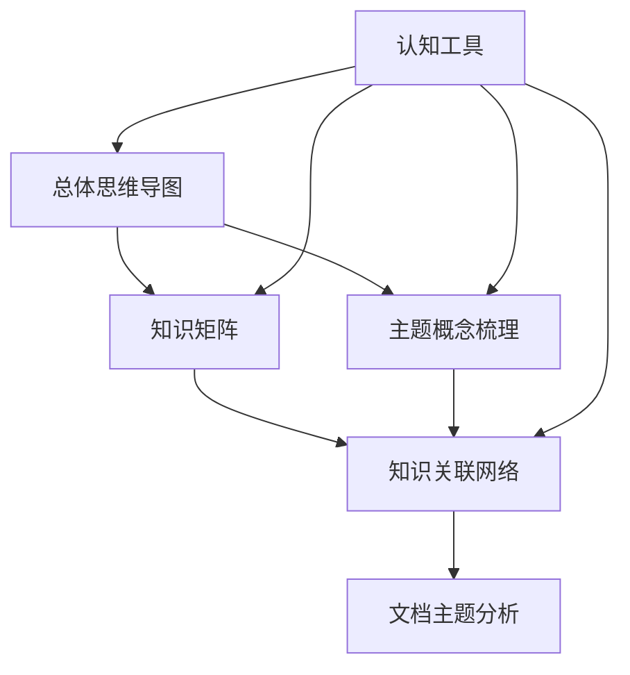

# FormalMath 概念体系跨模块整合指南

**主题编号**: C.00.04
**创建日期**: 2025年11月21日
**最后更新**: 2025年11月21日

---

## 📋 目录 / Table of Contents

- [FormalMath 概念体系跨模块整合指南](#formalmath-概念体系跨模块整合指南)
  - [📋 目录 / Table of Contents](#-目录--table-of-contents)
  - [📋 概述 (编号: C.00.04.01)](#-概述-编号-c000401)
  - [🔗 一、模块关联关系 (编号: C.00.04.02)](#-一模块关联关系-编号-c000402)
    - [1.1 模块依赖关系图](#11-模块依赖关系图)
    - [1.2 模块功能互补关系](#12-模块功能互补关系)
    - [1.3 模块数据流向](#13-模块数据流向)
  - [🔄 二、模块整合模式 (编号: C.00.04.03)](#-二模块整合模式-编号-c000403)
    - [2.1 探索式整合模式](#21-探索式整合模式)
    - [2.2 学习式整合模式](#22-学习式整合模式)
    - [2.3 研究式整合模式](#23-研究式整合模式)
    - [2.4 应用式整合模式](#24-应用式整合模式)
  - [📊 三、整合应用示例 (编号: C.00.04.04)](#-三整合应用示例-编号-c000404)
    - [3.1 示例1: 学习群论](#31-示例1-学习群论)
    - [3.2 示例2: 研究代数几何](#32-示例2-研究代数几何)
    - [3.3 示例3: 解决拓扑问题](#33-示例3-解决拓扑问题)
  - [🎯 四、整合最佳实践 (编号: C.00.04.05)](#-四整合最佳实践-编号-c000405)
    - [4.1 整合原则](#41-整合原则)
    - [4.2 整合技巧](#42-整合技巧)
    - [4.3 常见整合错误](#43-常见整合错误)
    - [4.4 整合效果评估](#44-整合效果评估)
  - [🔗 关联文档 (编号: C.00.04.06)](#-关联文档-编号-c000406)
    - [导航和使用文档](#导航和使用文档)
    - [核心模块](#核心模块)

---

## 📋 概述 (编号: C.00.04.01)

本文档提供FormalMath概念体系的跨模块整合指南，展示如何有效组合使用不同模块的工具和方法。

**目标**: 建立模块间的整合使用体系

---

## 🔗 一、模块关联关系 (编号: C.00.04.02)

### 1.1 模块依赖关系图




### 1.2 模块功能互补关系

| 模块1 | 模块2 | 互补关系 | 整合价值 |
|------|------|---------|---------|
| **思维导图** | **知识矩阵** | 直观 + 量化 | 全面理解 |
| **概念梳理** | **关联网络** | 静态 + 动态 | 深入理解 |
| **知识矩阵** | **关联网络** | 矩阵 + 网络 | 多维度分析 |
| **认知工具** | **所有模块** | 工具 + 内容 | 高效使用 |

### 1.3 模块数据流向

```text
思维导图 (结构)
    ↓
知识矩阵 (分析)
    ↓
概念梳理 (内容)
    ↓
关联网络 (关系)
    ↓
认知工具 (应用)
```

---

## 🔄 二、模块整合模式 (编号: C.00.04.03)

### 2.1 探索式整合模式

**适用场景**: 探索新领域

**整合流程**:

1. **思维导图** → 建立整体认识
   - [数学知识体系全景图](./01-总体思维导图/01-数学知识体系全景图.md)

2. **知识矩阵** → 多维度分析
   - [分支关联矩阵](./02-知识矩阵/01-分支关联矩阵.md)
   - [学习难度矩阵](./02-知识矩阵/03-学习难度矩阵.md)

3. **概念梳理** → 理解核心概念
   - [主题概念总览](./03-主题概念梳理/00-主题概念总览.md)

4. **关联网络** → 理解概念关系
   - [概念级关联网络](./05-知识关联网络/01-概念级关联网络.md)

**优势**: 从宏观到微观，系统化探索

### 2.2 学习式整合模式

**适用场景**: 系统学习

**整合流程**:

1. **学习策略工具** → 选择学习策略
   - [学习策略工具详细版](./04-认知工具/04-学习策略工具详细版.md)

2. **时间维度矩阵** → 规划学习时间
   - [时间维度矩阵](./02-知识矩阵/08-时间维度矩阵.md)

3. **概念梳理** → 学习概念
   - [主题概念总览](./03-主题概念梳理/00-主题概念总览.md)

4. **记忆工具** → 记忆和理解
   - [记忆与理解工具详细版](./04-认知工具/05-记忆与理解工具详细版.md)

5. **关联网络** → 建立知识网络
   - [概念级关联网络](./05-知识关联网络/01-概念级关联网络.md)

**优势**: 系统化学习，高效记忆

### 2.3 研究式整合模式

**适用场景**: 深入研究

**整合流程**:

1. **研究热点矩阵** → 了解研究动态
   - [研究热点矩阵](./02-知识矩阵/07-研究热点矩阵.md)

2. **历史发展矩阵** → 了解历史背景
   - [历史发展矩阵](./02-知识矩阵/06-历史发展矩阵.md)

3. **方法级关联网络** → 了解研究方法
   - [方法级关联网络](./05-知识关联网络/03-方法级关联网络.md)

4. **定理级关联网络** → 了解理论依赖
   - [定理级关联网络](./05-知识关联网络/02-定理级关联网络.md)

5. **问题解决工具** → 解决研究问题
   - [问题解决工具](./04-认知工具/06-问题解决工具.md)

**优势**: 全面了解，深入研究

### 2.4 应用式整合模式

**适用场景**: 实际应用

**整合流程**:

1. **应用场景矩阵** → 了解应用场景
   - [应用场景矩阵](./02-知识矩阵/04-应用场景矩阵.md)

2. **概念梳理** → 理解应用概念
   - [主题概念总览](./03-主题概念梳理/00-主题概念总览.md)

3. **方法级关联网络** → 选择应用方法
   - [方法级关联网络](./05-知识关联网络/03-方法级关联网络.md)

4. **问题解决工具** → 解决实际问题
   - [问题解决工具](./04-认知工具/06-问题解决工具.md)

**优势**: 理论联系实际，高效应用

---

## 📊 三、整合应用示例 (编号: C.00.04.04)

### 3.1 示例1: 学习群论

**目标**: 系统学习群论

**整合步骤**:

1. **思维导图阶段**
   - 查看[代数结构概念](./03-主题概念梳理/02-代数结构概念.md)中的群论部分
   - 了解群论在代数结构中的位置

2. **知识矩阵阶段**
   - 查看[概念层次矩阵](./02-知识矩阵/02-概念层次矩阵.md)了解群的层次
   - 查看[学习难度矩阵](./02-知识矩阵/03-学习难度矩阵.md)评估难度

3. **概念梳理阶段**
   - 深入学习[代数结构概念](./03-主题概念梳理/02-代数结构概念.md)
   - 理解群的定义、性质、例子

4. **关联网络阶段**
   - 查看[概念级关联网络](./05-知识关联网络/01-概念级关联网络.md)中的群论网络
   - 理解群与其他概念的关系

5. **认知工具阶段**
   - 使用[记忆与理解工具详细版](./04-认知工具/05-记忆与理解工具详细版.md)记忆概念
   - 使用[问题解决工具](./04-认知工具/06-问题解决工具.md)解决问题

### 3.2 示例2: 研究代数几何

**目标**: 规划代数几何研究方向

**整合步骤**:

1. **研究热点阶段**
   - 查看[研究热点矩阵](./02-知识矩阵/07-研究热点矩阵.md)了解代数几何热点
   - 识别前沿问题

2. **历史发展阶段**
   - 查看[历史发展矩阵](./02-知识矩阵/06-历史发展矩阵.md)了解发展历史
   - 理解重要里程碑

3. **时间规划阶段**
   - 查看[时间维度矩阵](./02-知识矩阵/08-时间维度矩阵.md)规划学习时间
   - 了解理论成熟度

4. **关联网络阶段**
   - 查看[概念级关联网络](./05-知识关联网络/01-概念级关联网络.md)中的代数-几何关联
   - 理解跨分支关联

5. **方法网络阶段**
   - 查看[方法级关联网络](./05-知识关联网络/03-方法级关联网络.md)了解研究方法
   - 选择研究工具

### 3.3 示例3: 解决拓扑问题

**目标**: 解决拓扑学问题

**整合步骤**:

1. **问题分析阶段**
   - 使用[问题解决工具](./04-认知工具/06-问题解决工具.md)分析问题
   - 识别问题类型

2. **概念理解阶段**
   - 查看[拓扑学概念](./03-主题概念梳理/05-拓扑学概念.md)理解相关概念
   - 查看[概念级关联网络](./05-知识关联网络/01-概念级关联网络.md)理解概念关系

3. **方法查找阶段**
   - 查看[方法级关联网络](./05-知识关联网络/03-方法级关联网络.md)查找相关方法
   - 查看[定理级关联网络](./05-知识关联网络/02-定理级关联网络.md)查找相关定理

4. **解决方案阶段**
   - 应用方法解决问题
   - 使用[问题解决工具](./04-认知工具/06-问题解决工具.md)验证

---

## 🎯 四、整合最佳实践 (编号: C.00.04.05)

### 4.1 整合原则

1. **循序渐进**: 从简单到复杂，从整体到局部
2. **互补使用**: 利用不同模块的优势互补
3. **循环迭代**: 多次使用不同模块深化理解
4. **灵活组合**: 根据需求灵活组合模块

### 4.2 整合技巧

1. **建立工作流**: 为不同场景建立标准工作流
2. **记录路径**: 记录有效的整合路径
3. **优化组合**: 根据效果优化模块组合
4. **分享经验**: 分享成功的整合经验

### 4.3 常见整合错误

1. **单一使用**: 只使用一个模块，忽略其他模块
2. **顺序混乱**: 不按逻辑顺序使用模块
3. **过度依赖**: 过度依赖某个模块
4. **缺乏整合**: 各模块独立使用，缺乏整合

### 4.4 整合效果评估

| 评估维度 | 评估标准 | 改进方向 |
|---------|---------|---------|
| **理解深度** | 是否深入理解 | 增加关联网络使用 |
| **学习效率** | 是否高效学习 | 优化工具组合 |
| **记忆效果** | 是否有效记忆 | 加强记忆工具使用 |
| **应用能力** | 是否能应用 | 增加问题解决练习 |

---

## 🔗 关联文档 (编号: C.00.04.06)

### 导航和使用文档

- [快速导航](./00-快速导航.md) - 快速找到所需文档
- [综合使用指南](./00-综合使用指南.md) - 详细使用指南
- [README.md](./README.md) - 概念体系总览

### 核心模块

- [总体思维导图总览](./01-总体思维导图/00-总体思维导图总览.md)
- [知识矩阵总览](./02-知识矩阵/00-知识矩阵总览.md)
- [主题概念总览](./03-主题概念梳理/00-主题概念总览.md)
- [认知工具总览](./04-认知工具/00-认知工具总览.md)
- [知识关联网络总览](./05-知识关联网络/00-知识关联网络总览.md)

---

**创建日期**: 2025年11月21日
**最后更新**: 2025年11月21日
**维护状态**: 持续更新中
**版本**: v1.0
