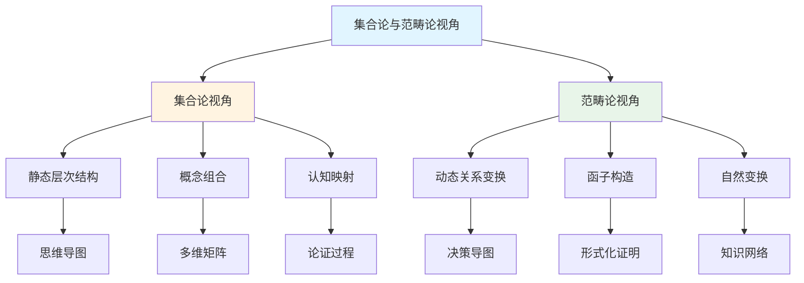

# 集合论与范畴论视角与新框架整合指南

**主题编号**: C.00.47
**创建日期**: 2025年1月
**最后更新**: 2025年1月
**状态**: 持续完善中

---

## 📋 概述

本文档提供FormalMath集合论与范畴论双视角框架与新创建的多种思维表征方式框架的整合指南，展示如何将集合论与范畴论视角与决策思维导图、形式化证明、多维矩阵、论证过程等框架结合使用。

**目标**：

- 说明集合论与范畴论视角与新框架的关系
- 提供整合使用的具体方法
- 展示不同场景下的使用策略
- 建立完整的双视角应用体系

**理论基础**：

- 集合论与范畴论双视角框架
- 直观-知性-理性三维认知模型
- 多种思维表征方式整合框架
- 形式化证明系统

---

## 🎯 一、集合论与范畴论视角与新框架的关系 (编号: C.00.47.01)

### 1.1 关系图

### 1.2 关系说明

**集合论视角**提供：

- 静态层次结构：概念的层次关系
- 概念组合：基础概念的组合方式
- 认知映射：概念与认知结构的映射

**范畴论视角**提供：

- 动态关系变换：概念之间的变换
- 函子构造：结构保持的映射
- 自然变换：函子之间的变换

**新框架**提供：

- **思维导图**：可视化层次结构（集合论视角）
- **多维矩阵**：量化关系分析（集合论+范畴论视角）
- **形式化证明**：严格的理论基础（集合论+范畴论视角）
- **论证过程**：充分的理解桥梁（集合论视角）
- **决策导图**：实用的应用指导（范畴论视角）

**整合价值**：

- 集合论视角为新框架提供结构基础
- 范畴论视角为新框架提供变换框架
- 新框架为双视角提供应用场景

---

## 📚 二、学习场景整合使用 (编号: C.00.47.02)

### 2.1 初学者学习场景

**目标**：理解核心概念

**整合使用流程**：

1. **使用集合论视角：思维导图**
   - 查看[总体思维导图](../01-总体思维导图/00-总体思维导图总览.md)
   - 了解概念的层次结构
   - 建立总体框架

2. **使用集合论视角：概念组合**
   - 查看[集合论视角的概念层次结构分析](./00-集合论视角的概念层次结构分析.md)
   - 理解概念的基础概念组合
   - 掌握概念的构造方式

3. **使用决策思维导图**
   - 查看[学习决策思维导图](../01-总体思维导图/05-决策思维导图体系.md)
   - 确定学习路径
   - 选择学习资源

4. **使用论证过程**
   - 参考核心概念文档中的论证过程
   - 理解概念的直观意义
   - 掌握概念的基本应用

**示例：学习群概念**:

1. 使用集合论视角 → 理解群是集合+函数+元素的组合
2. 使用思维导图 → 建立群概念的总体框架
3. 使用学习决策导图 → 确定学习路径：基础概念 → 群的定义 → 群的性质 → 群的应用
4. 使用论证过程 → 理解群的直观意义（对称性和变换）

### 2.2 中级学习者场景

**目标**：深入理解核心概念

**整合使用流程**：

1. **使用集合论视角：多维矩阵**
   - 查看[集合论与范畴论视角概念关系矩阵](../02-知识矩阵/12-集合论与范畴论视角概念关系矩阵.md)
   - 了解概念的层次分布
   - 发现概念的组合关系

2. **使用范畴论视角：动态关系**
   - 查看[范畴论视角的概念关系动态表征](./00-范畴论视角的概念关系动态表征.md)
   - 理解概念之间的变换
   - 掌握函子构造

3. **使用形式化证明**
   - 参考[概念定义属性关系形式化论证证明系统](./00-概念定义属性关系形式化论证证明系统-2025年1月.md)
   - 理解概念的形式化定义
   - 学习重要定理的证明思路

4. **使用多维矩阵**
   - 查看[核心概念多维关系矩阵](../02-知识矩阵/10-核心概念多维关系矩阵.md)
   - 了解概念的多维度特征
   - 发现概念之间的关系

**示例：深入学习向量空间概念**:

1. 使用集合论视角 → 理解向量空间是集合+域+函数的组合
2. 使用范畴论视角 → 理解向量空间范畴的函子构造
3. 使用多维矩阵 → 了解向量空间的知识层次（L1中级层）、知识领域（D2代数）
4. 使用形式化证明 → 学习基的存在性定理的证明

### 2.3 高级学习者场景

**目标**：研究核心概念

**整合使用流程**：

1. **使用研究决策导图**
   - 查看[研究决策思维导图](../01-总体思维导图/05-决策思维导图体系.md)
   - 确定研究方向和研究问题
   - 选择研究方法

2. **使用范畴论视角：函子理论**
   - 深入研读[范畴论视角的概念关系动态表征](./00-范畴论视角的概念关系动态表征.md)
   - 学习函子构造理论
   - 理解自然变换

3. **使用形式化证明系统**
   - 深入研读[概念定义属性关系形式化论证证明系统](./00-概念定义属性关系形式化论证证明系统-2025年1月.md)
   - 学习完整的形式化证明
   - 理解证明的逻辑结构

4. **使用知识关联网络**
   - 查看[概念级关联网络](../05-知识关联网络/01-概念级关联网络.md)
   - 发现概念之间的深层关联
   - 探索研究问题

**示例：研究群概念**:

1. 使用研究决策导图 → 确定研究方向：群表示论
2. 使用范畴论视角 → 理解群范畴到向量空间范畴的函子
3. 使用形式化证明系统 → 学习Lagrange定理的完整形式化证明
4. 使用知识关联网络 → 发现群与向量空间、表示的关系

---

## 🔬 三、研究场景整合使用 (编号: C.00.47.03)

### 3.1 理论研究场景

**目标**：构建理论体系

**整合使用流程**：

1. **使用集合论视角：概念层次**
   - 使用集合论视角分析概念的层次结构
   - 理解概念的基础概念组合
   - 建立概念的构造方式

2. **使用范畴论视角：函子理论**
   - 使用范畴论视角分析概念之间的函子关系
   - 理解结构保持的映射
   - 建立理论的范畴结构

3. **使用形式化证明系统**
   - 使用形式化证明构建严格的理论基础
   - 确保证明的可追溯性
   - 建立可机器验证的证明

4. **使用多维矩阵**
   - 使用多维矩阵分析概念之间的关系
   - 发现理论的整体结构
   - 优化理论的组织方式

### 3.2 应用研究场景

**目标**：应用概念解决实际问题

**整合使用流程**：

1. **使用应用决策导图** → 确定应用场景
2. **使用集合论视角：概念组合** → 理解应用中的概念组合
3. **使用范畴论视角：函子应用** → 理解应用中的函子构造
4. **使用论证过程** → 理解应用方法

---

## 💼 四、应用场景整合使用 (编号: C.00.47.04)

### 4.1 教学应用场景

**目标**：教授核心概念

**整合使用流程**：

1. **使用教学决策导图** → 确定教学内容和教学方法
2. **使用集合论视角：概念层次** → 使用思维导图可视化层次结构
3. **使用范畴论视角：动态关系** → 使用知识图谱可视化关系变换
4. **使用论证过程** → 提供充分的理解桥梁

### 4.2 工程应用场景

**目标**：应用概念解决工程问题

**整合使用流程**：

1. **使用应用决策导图** → 确定工程应用场景
2. **使用集合论视角：概念组合** → 理解工程中的概念组合
3. **使用范畴论视角：函子应用** → 理解工程中的函子构造
4. **使用形式化证明** → 验证应用的正确性

---

## 🔄 五、整合使用最佳实践 (编号: C.00.47.05)

### 5.1 最佳实践原则

**原则1：双视角互补**:

- 集合论视角提供静态结构
- 范畴论视角提供动态变换
- 两者结合形成完整理解

**原则2：框架整合**:

- 思维导图可视化集合论视角的层次结构
- 知识网络可视化范畴论视角的关系变换
- 形式化证明严格化双视角的理论基础

**原则3：层次递进**:

- 从集合论视角的静态理解开始
- 过渡到范畴论视角的动态理解
- 最终形成双视角的整合理解

### 5.2 最佳实践示例

**示例：完整学习群概念**:

**阶段1：集合论视角理解**:

1. 使用集合论视角 → 理解群是集合+函数+元素的组合
2. 使用思维导图 → 建立群概念的层次结构
3. 使用多维矩阵 → 分析群的概念层次（L1层）

**阶段2：范畴论视角理解**:

1. 使用范畴论视角 → 理解群范畴的函子构造
2. 使用知识网络 → 可视化群与其他概念的关系
3. 使用多维矩阵 → 分析群的范畴结构

**阶段3：双视角整合**:

1. 使用形式化证明 → 严格化双视角的理论基础
2. 使用决策导图 → 指导学习和应用
3. 使用论证过程 → 整合双视角的理解

---

## 📊 六、整合使用决策矩阵 (编号: C.00.47.06)

### 6.1 使用决策矩阵

| 目标类型 | 学习阶段 | 推荐视角 | 推荐框架 | 整合方式 |
|---------|---------|---------|---------|---------|
| **理解概念** | 入门 | 集合论视角 | 思维导图、论证过程 | 集合论视角提供结构，思维导图可视化 |
| **理解概念** | 中级 | 双视角 | 多维矩阵、形式化证明 | 双视角提供完整理解，多维矩阵分析 |
| **理解概念** | 高级 | 范畴论视角 | 形式化证明、知识网络 | 范畴论视角提供变换，形式化证明严格化 |
| **应用概念** | 入门 | 集合论视角 | 决策导图、应用实例 | 集合论视角提供结构，决策导图指导应用 |
| **应用概念** | 中级 | 双视角 | 多维矩阵、决策导图 | 双视角提供完整理解，多维矩阵分析应用 |
| **研究概念** | 中级 | 范畴论视角 | 形式化证明、知识网络 | 范畴论视角提供变换，形式化证明构建理论 |
| **研究概念** | 高级 | 双视角 | 形式化证明、知识网络 | 双视角提供完整理解，形式化证明严格化 |

---

## 🔗 七、关联文档 (编号: C.00.47.07)

### 7.1 集合论与范畴论视角文档

- [集合论与范畴论视角的概念体系重构框架](./00-集合论与范畴论视角的概念体系重构框架.md)
- [集合论视角的概念层次结构分析](./00-集合论视角的概念层次结构分析.md)
- [范畴论视角的概念关系动态表征](./00-范畴论视角的概念关系动态表征.md)
- [集合论与范畴论视角整合分析](./00-集合论与范畴论视角整合分析.md)
- [集合论与范畴论视角应用示例-群](./00-集合论与范畴论视角应用示例-群.md)
- [集合论与范畴论视角概念关系矩阵](../02-知识矩阵/12-集合论与范畴论视角概念关系矩阵.md)

### 7.2 新框架文档

- [概念体系全面梳理与推进计划](./00-概念体系全面梳理与推进计划-2025年1月.md)
- [决策思维导图体系](./01-总体思维导图/05-决策思维导图体系.md)
- [概念定义属性关系形式化论证证明系统](./00-概念定义属性关系形式化论证证明系统-2025年1月.md)
- [多种思维表征方式对比与整合](./00-多种思维表征方式对比与整合-2025年1月.md)

### 7.3 其他相关文档

- [核心概念索引](./核心概念/00-核心概念索引.md)
- [知识矩阵总览](./02-知识矩阵/00-知识矩阵总览.md)
- [认知工具总览](./04-认知工具/00-认知工具总览.md)

---

## ✅ 八、总结 (编号: C.00.47.08)

本文档提供了集合论与范畴论双视角框架与新框架的整合使用指南，帮助用户：

1. **理解关系**：理解双视角与新框架的关系
2. **选择策略**：根据不同场景选择合适的视角和框架组合
3. **整合使用**：形成完整的学习和研究体系
4. **最佳实践**：遵循最佳实践原则和方法

**核心价值**：

- 提供系统化的学习路径
- 支持不同层次的学习需求
- 整合双视角和多种框架
- 形成完整的知识体系

---

**创建日期**: 2025年1月
**最后更新**: 2025年1月
**维护状态**: 持续完善中
**负责人**: FormalMath项目组
