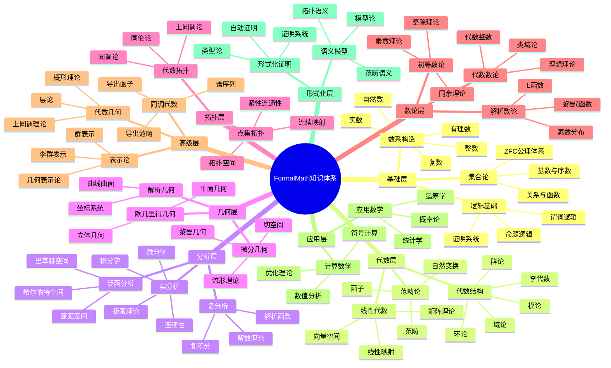
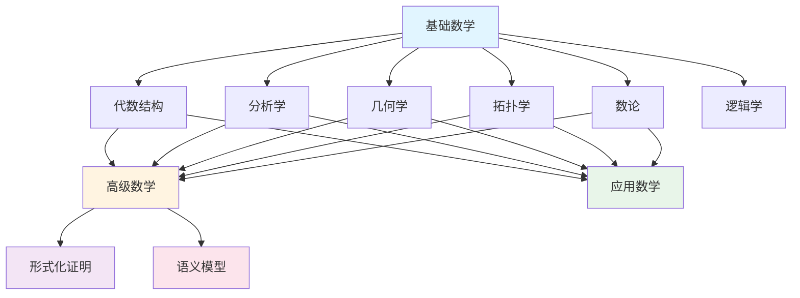
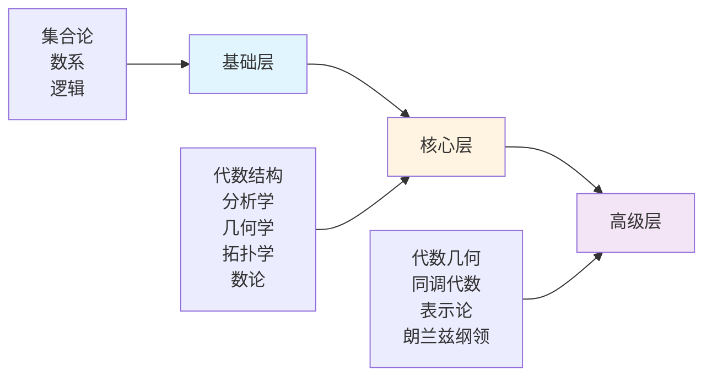
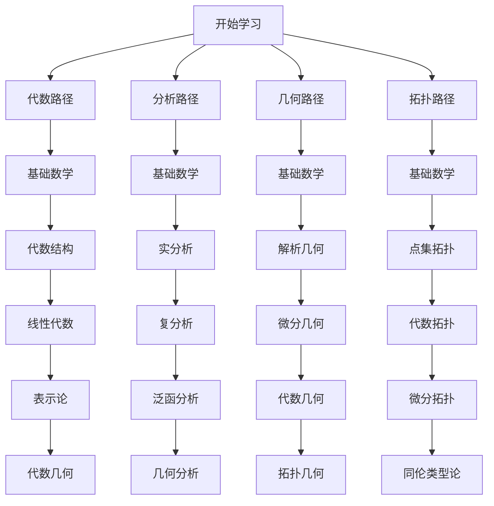

# FormalMath 总体思维导图总览

## 📋 概述

本文档提供FormalMath项目数学知识体系的总体思维导图，通过可视化方式展示数学知识的整体结构和关联关系。

**创建日期**: 2025年11月21日
**目标**: 建立数学知识体系的宏观认知框架

---

## 🗺️ 数学知识体系全景图

### 核心层次结构

---

## 🔗 分支关联关系

### 基础数学到各分支的演进

---

## 📊 知识层次结构

### 三层知识架构

---

## 🎯 学习路径概览

### 主要学习路径

---

## 📚 详细文档

- [数学知识体系全景图](./01-数学知识体系全景图.md)
- [分支关联思维导图](./02-分支关联思维导图.md)
- [学习路径思维导图](./03-学习路径思维导图.md)

---

**创建日期**: 2025年11月21日
**维护状态**: 持续更新中
