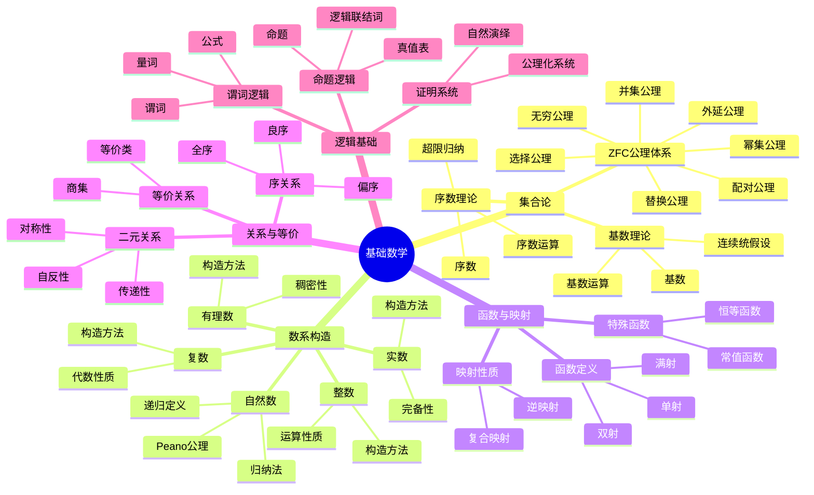
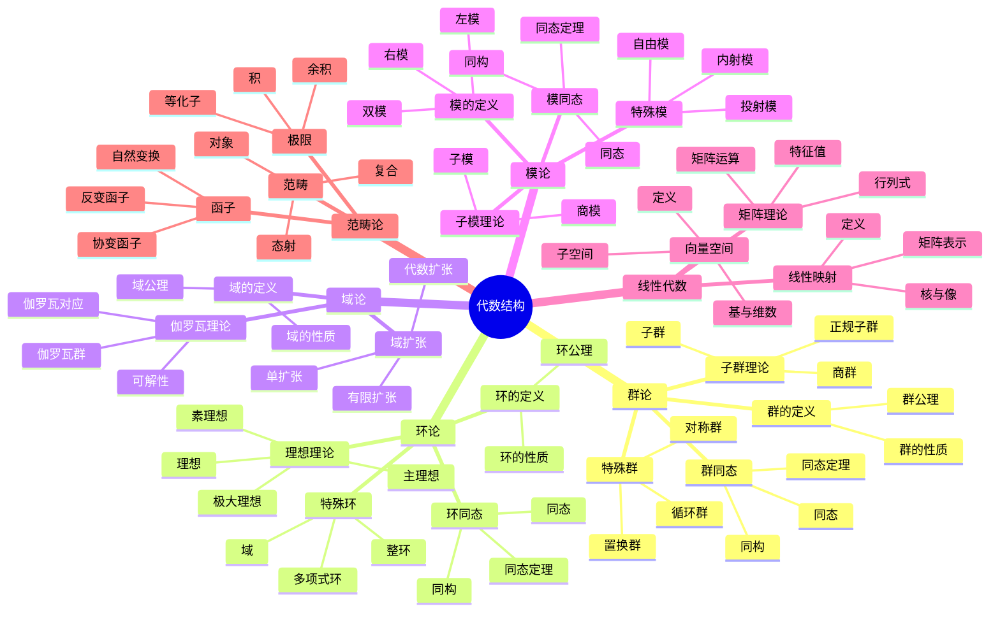
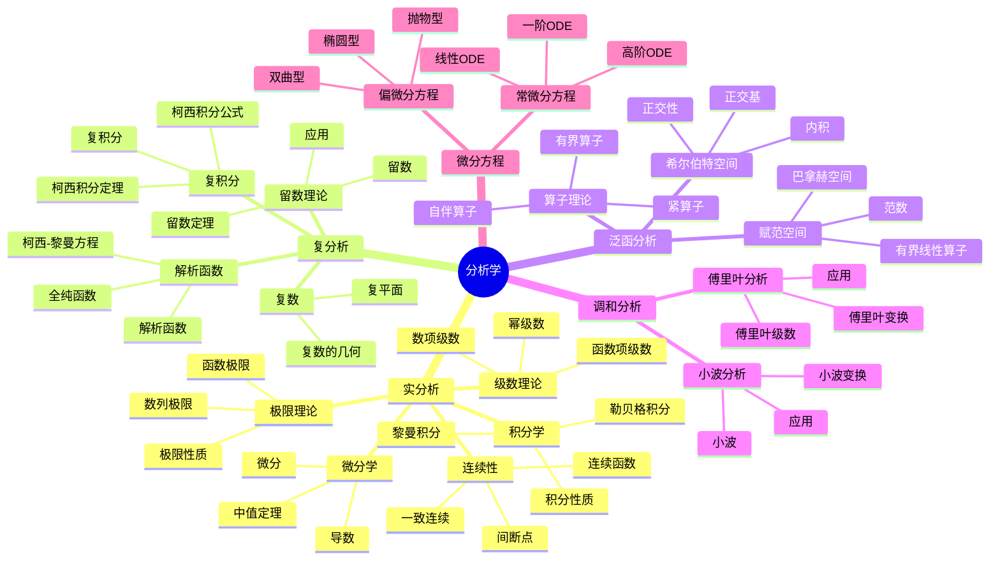
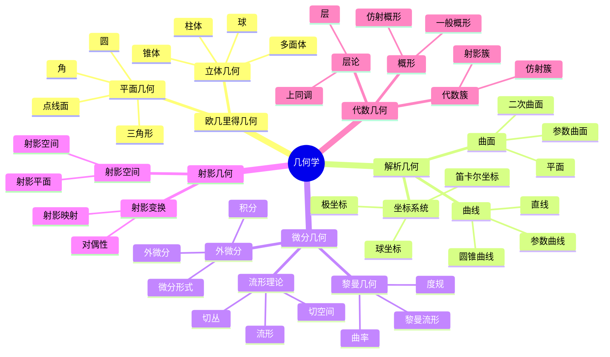
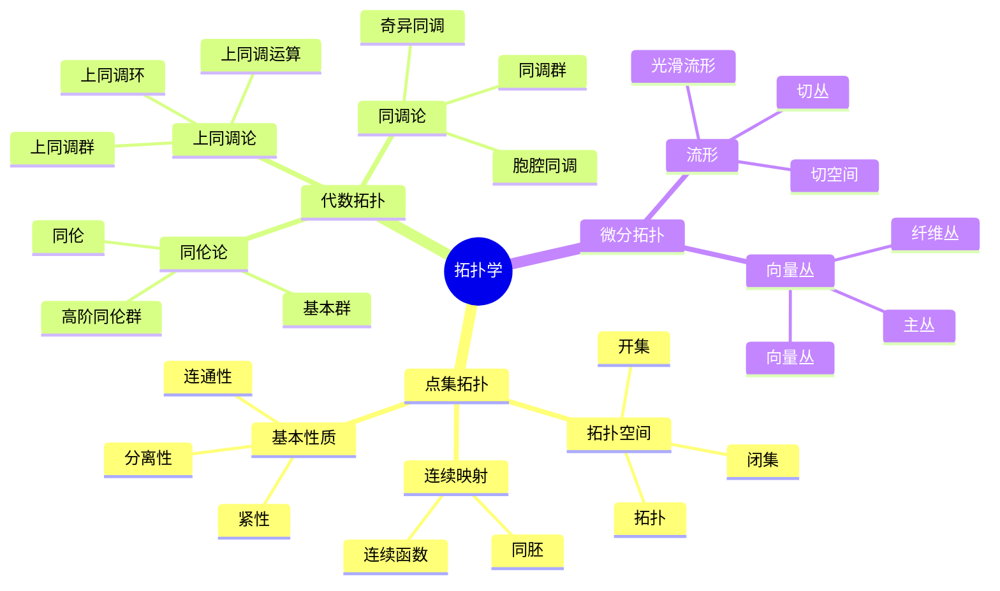
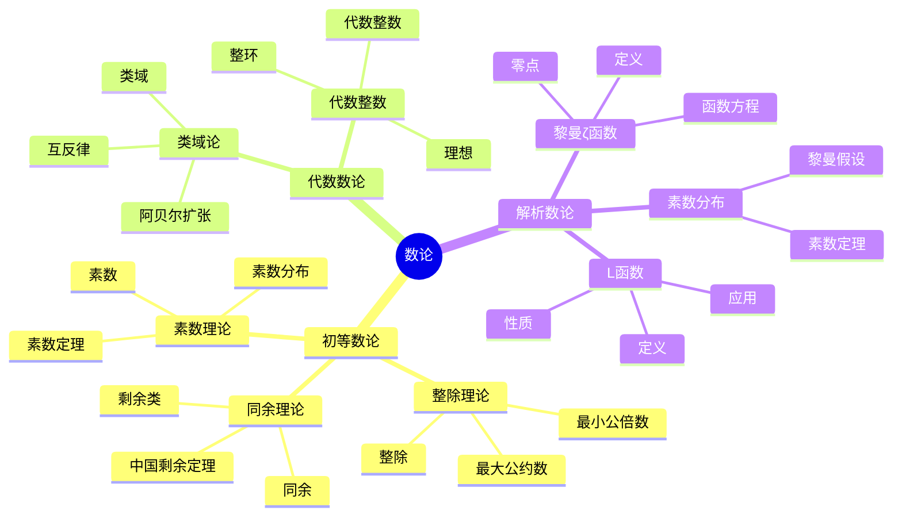
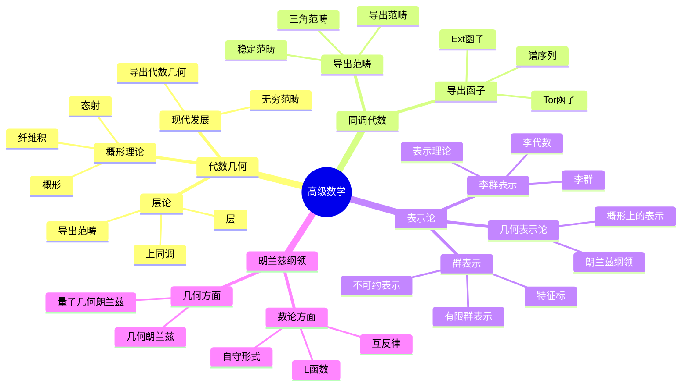
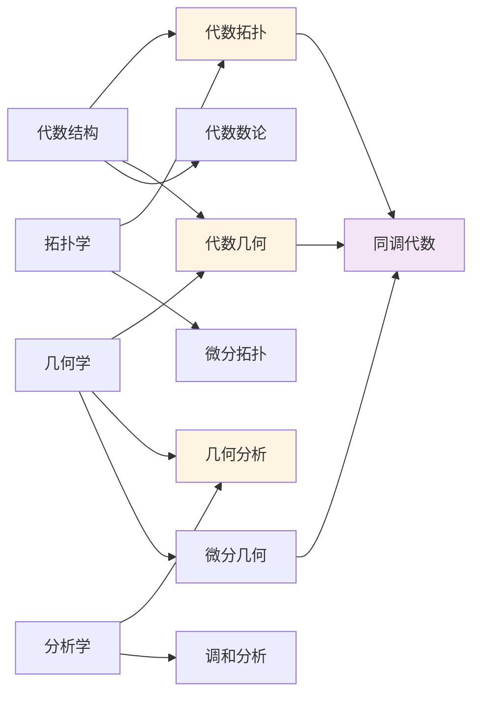

# 数学知识体系全景图

**主题编号**: C.01.01
**创建日期**: 2025年11月21日
**最后更新**: 2025年11月21日

---

## 📋 目录 / Table of Contents

- [数学知识体系全景图](#数学知识体系全景图)
  - [📋 目录 / Table of Contents](#-目录--table-of-contents)
  - [📋 概述 (编号: C.01.01.01)](#-概述-编号-c010101)
  - [🗺️ 完整知识体系思维导图 (编号: C.01.01.02)](#️-完整知识体系思维导图-编号-c010102)
    - [1. 基础数学层 (编号: C.01.01.02.01)](#1-基础数学层-编号-c01010201)
    - [2. 代数结构层 (编号: C.01.01.02.02)](#2-代数结构层-编号-c01010202)
    - [3. 分析学层 (编号: C.01.01.02.03)](#3-分析学层-编号-c01010203)
    - [4. 几何学层 (编号: C.01.01.02.04)](#4-几何学层-编号-c01010204)
    - [5. 拓扑学层 (编号: C.01.01.02.05)](#5-拓扑学层-编号-c01010205)
    - [6. 数论层 (编号: C.01.01.02.06)](#6-数论层-编号-c01010206)
    - [7. 高级数学层 (编号: C.01.01.02.07)](#7-高级数学层-编号-c01010207)
  - [🔗 跨分支关联 (编号: C.01.01.03)](#-跨分支关联-编号-c010103)
    - [主要交叉领域](#主要交叉领域)

---

## 📋 概述 (编号: C.01.01.01)

本文档提供FormalMath项目数学知识体系的完整全景图，通过多维度思维导图展示数学知识的整体结构。

---

## 🗺️ 完整知识体系思维导图 (编号: C.01.01.02)

### 1. 基础数学层 (编号: C.01.01.02.01)

### 2. 代数结构层 (编号: C.01.01.02.02)

### 3. 分析学层 (编号: C.01.01.02.03)

### 4. 几何学层 (编号: C.01.01.02.04)

### 5. 拓扑学层 (编号: C.01.01.02.05)

### 6. 数论层 (编号: C.01.01.02.06)

### 7. 高级数学层 (编号: C.01.01.02.07)

---

## 🔗 跨分支关联 (编号: C.01.01.03)

### 主要交叉领域

---

**创建日期**: 2025年11月21日
**最后更新**: 2025年11月21日
**维护状态**: 持续更新中
