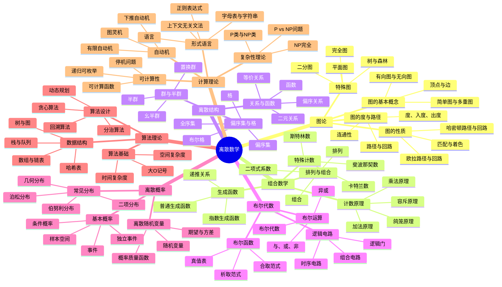
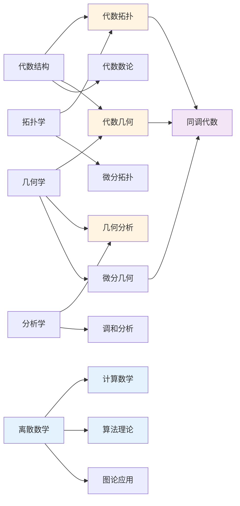

# 数学知识体系全景图

**主题编号**: C.01.01
**创建日期**: 2025年11月21日
**最后更新**: 2025年1月（三视角转换全面完成）

---

## 📋 目录 / Table of Contents

- [数学知识体系全景图](#数学知识体系全景图)
  - [📋 目录 / Table of Contents](#-目录--table-of-contents)
  - [📋 概述 (编号: C.01.01.01)](#-概述-编号-c010101)
  - [🗺️ 完整知识体系思维导图 (编号: C.01.01.02)](#️-完整知识体系思维导图-编号-c010102)
    - [1. 基础数学层 (编号: C.01.01.02.01)](#1-基础数学层-编号-c01010201)
    - [2. 代数结构层 (编号: C.01.01.02.02)](#2-代数结构层-编号-c01010202)
    - [3. 分析学层 (编号: C.01.01.02.03)](#3-分析学层-编号-c01010203)
    - [4. 几何学层 (编号: C.01.01.02.04)](#4-几何学层-编号-c01010204)
    - [5. 拓扑学层 (编号: C.01.01.02.05)](#5-拓扑学层-编号-c01010205)
    - [6. 数论层 (编号: C.01.01.02.06)](#6-数论层-编号-c01010206)
    - [7. 离散数学层 (编号: C.01.01.02.07)](#7-离散数学层-编号-c01010207)
    - [8. 高级数学层 (编号: C.01.01.02.08)](#8-高级数学层-编号-c01010208)
  - [🔗 跨分支关联 (编号: C.01.01.03)](#-跨分支关联-编号-c010103)
    - [主要交叉领域](#主要交叉领域)
  - [📖 详细概念说明](#-详细概念说明)

---

## 📋 概述 (编号: C.01.01.01)

本文档提供FormalMath项目数学知识体系的完整全景图，通过多维度思维导图展示数学知识的整体结构。

**核心概念三视角版本**: 思维导图中涉及的33个核心概念已完成三视角转换，每个概念都包含认知学、教育学、数学家三个视角的深度分析。详见：[核心概念索引](../核心概念/00-核心概念索引.md) ⭐ - 所有33个核心概念的三视角版本

**哲学维度**: 数学知识体系的结构也反映了不同的哲学观点。逻辑主义强调从逻辑基础构建，直觉主义强调构造性结构，形式主义强调形式化结构，结构主义强调结构关系。详见[数学哲学维度矩阵](../02-知识矩阵/09-数学哲学维度矩阵.md)。

---

## 🗺️ 完整知识体系思维导图 (编号: C.01.01.02)

### 1. 基础数学层 (编号: C.01.01.02.01)

### 2. 代数结构层 (编号: C.01.01.02.02)

### 3. 分析学层 (编号: C.01.01.02.03)

### 4. 几何学层 (编号: C.01.01.02.04)

### 5. 拓扑学层 (编号: C.01.01.02.05)

### 6. 数论层 (编号: C.01.01.02.06)

### 7. 离散数学层 (编号: C.01.01.02.07)

### 8. 高级数学层 (编号: C.01.01.02.08)

---

## 🔗 跨分支关联 (编号: C.01.01.03)

### 主要交叉领域

---

---

## 📖 详细概念说明

本文档的思维导图提供了知识结构框架。如需了解每个概念的详细定义、性质、关系和证明思路，请参考：

- [数学知识体系全景图-详细说明](./01-数学知识体系全景图-详细说明.md) ⭐ 新增 - 提供详细的概念说明

---

**创建日期**: 2025年11月21日
**最后更新**: 2025年1月（三视角转换全面完成）
**维护状态**: 持续更新中
