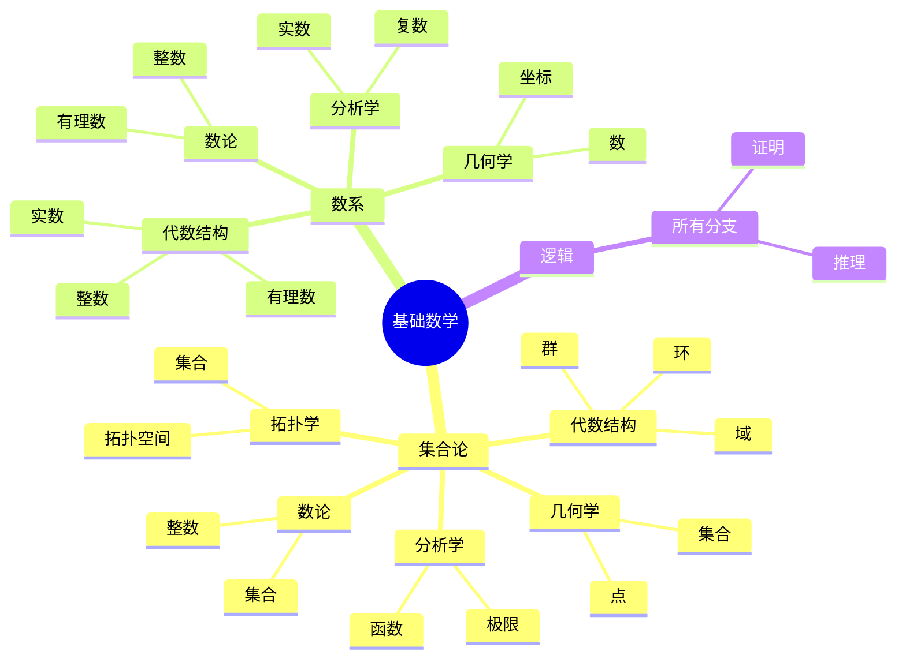
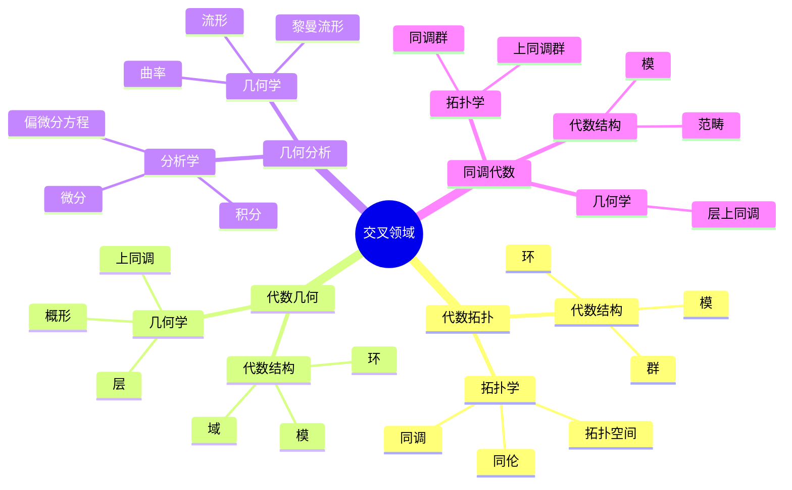

# 分支关联思维导图

**主题编号**: C.01.02
**创建日期**: 2025年11月21日
**最后更新**: 2025年11月21日

---

## 📋 目录 / Table of Contents

- [分支关联思维导图](#分支关联思维导图)
  - [📋 目录 / Table of Contents](#-目录--table-of-contents)
  - [📋 概述 (编号: C.01.02.01)](#-概述-编号-c010201)
  - [🔗 主要分支关联 (编号: C.01.02.02)](#-主要分支关联-编号-c010202)
    - [基础数学到各分支](#基础数学到各分支)
    - [交叉领域关联](#交叉领域关联)
  - [📊 关联强度分析 (编号: C.01.02.03)](#-关联强度分析-编号-c010203)
    - [强关联分支对](#强关联分支对)
    - [中等关联分支对](#中等关联分支对)

---

## 📋 概述 (编号: C.01.02.01)

本文档通过思维导图形式展示FormalMath项目中各数学分支之间的关联关系。

---

## 🔗 主要分支关联 (编号: C.01.02.02)

### 基础数学到各分支

### 交叉领域关联

---

## 📊 关联强度分析 (编号: C.01.02.03)

### 强关联分支对

1. **基础数学 ↔ 所有分支** (⭐⭐⭐⭐⭐)
   - **关联表现**: 基础数学提供所有分支的基础工具和语言
   - **具体内容**: 集合论为所有分支提供基本语言；数系构造是所有数学的基础；函数与映射是分析、代数、几何的核心工具；逻辑为所有分支提供推理基础
   - **应用**: 学习任何数学分支前必须先掌握基础数学
   - **数学原理**: 所有数学概念最终都建立在集合论和逻辑基础上

2. **代数结构 ↔ 几何学** (⭐⭐⭐⭐⭐) - 代数几何
   - **关联表现**: 代数几何是两者的结合
   - **具体内容**: 概形理论将几何对象与交换环对应；层论将几何上的函数层与环上的模对应；代数簇用理想描述；上同调用同调代数研究几何对象的拓扑性质
   - **应用**: 数论（费马大定理）、编码理论、密码学
   - **数学原理**: Hilbert零点定理建立理想与代数集的对应

3. **几何学 ↔ 拓扑学** (⭐⭐⭐⭐⭐) - 拓扑几何
   - **关联表现**: 拓扑学研究几何对象的拓扑性质
   - **具体内容**: 流形是拓扑空间；基本群、同调群是拓扑不变量；纤维丛连接拓扑与几何
   - **应用**: 分类流形、证明几何定理
   - **数学原理**: 拓扑不变量用于区分不同的几何对象

4. **分析学 ↔ 几何学** (⭐⭐⭐⭐⭐) - 微分几何
   - **关联表现**: 微分几何用分析方法研究几何对象
   - **具体内容**: 流形上的微积分；曲率用导数描述；测地线用微分方程求解
   - **应用**: 广义相对论、最优传输、机器学习
   - **数学原理**: 将几何问题转化为分析问题

### 中等关联分支对

1. **代数结构 ↔ 分析学** (⭐⭐⭐⭐) - 泛函分析
   - **关联表现**: 泛函分析中的算子代数
   - **具体内容**: 算子代数（C*代数、von Neumann代数）；李群表示论；函数空间的结构
   - **应用**: 量子力学、偏微分方程
   - **数学原理**: 用代数方法研究函数空间
2. **代数结构 ↔ 拓扑学** (⭐⭐⭐⭐) - 代数拓扑
3. **数论 ↔ 代数结构** (⭐⭐⭐⭐) - 代数数论

---

**创建日期**: 2025年11月21日
**最后更新**: 2025年11月21日
**维护状态**: 持续更新中
