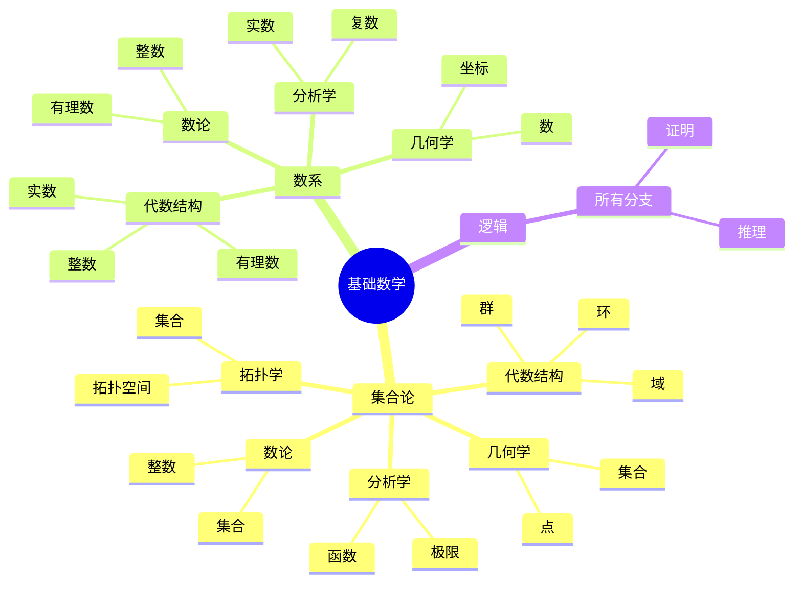
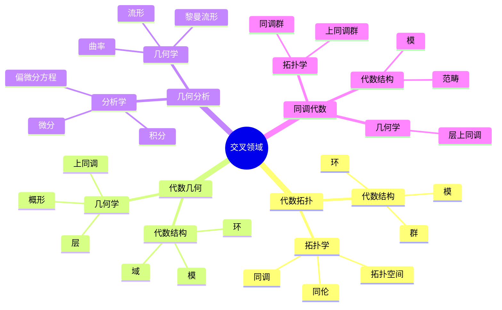

# 分支关联思维导图

**主题编号**: C.01.02
**创建日期**: 2025年11月21日
**最后更新**: 2025年11月21日

---

## 📋 目录 / Table of Contents

- [分支关联思维导图](#分支关联思维导图)
  - [📋 目录 / Table of Contents](#-目录--table-of-contents)
  - [📋 概述 (编号: C.01.02.01)](#-概述-编号-c010201)
  - [🔗 主要分支关联 (编号: C.01.02.02)](#-主要分支关联-编号-c010202)
    - [基础数学到各分支](#基础数学到各分支)
    - [交叉领域关联](#交叉领域关联)
  - [📊 关联强度分析 (编号: C.01.02.03)](#-关联强度分析-编号-c010203)
    - [强关联分支对](#强关联分支对)
    - [中等关联分支对](#中等关联分支对)

---

## 📋 概述 (编号: C.01.02.01)

本文档通过思维导图形式展示FormalMath项目中各数学分支之间的关联关系。

---

## 🔗 主要分支关联 (编号: C.01.02.02)

### 基础数学到各分支

### 交叉领域关联

---

## 📊 关联强度分析 (编号: C.01.02.03)

### 强关联分支对

1. **基础数学 ↔ 所有分支** (⭐⭐⭐⭐⭐)
2. **代数结构 ↔ 几何学** (⭐⭐⭐⭐⭐) - 代数几何
3. **几何学 ↔ 拓扑学** (⭐⭐⭐⭐⭐) - 拓扑几何
4. **分析学 ↔ 几何学** (⭐⭐⭐⭐⭐) - 微分几何

### 中等关联分支对

1. **代数结构 ↔ 分析学** (⭐⭐⭐⭐) - 泛函分析
2. **代数结构 ↔ 拓扑学** (⭐⭐⭐⭐) - 代数拓扑
3. **数论 ↔ 代数结构** (⭐⭐⭐⭐) - 代数数论

---

**创建日期**: 2025年11月21日
**最后更新**: 2025年11月21日
**维护状态**: 持续更新中
