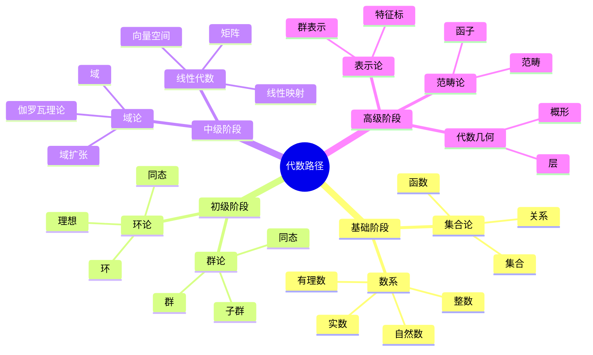
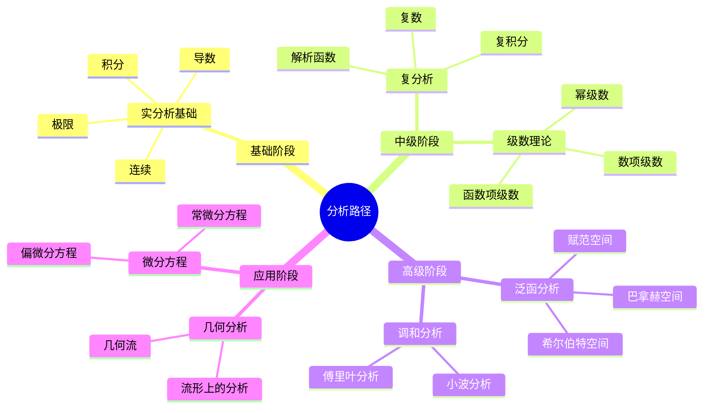
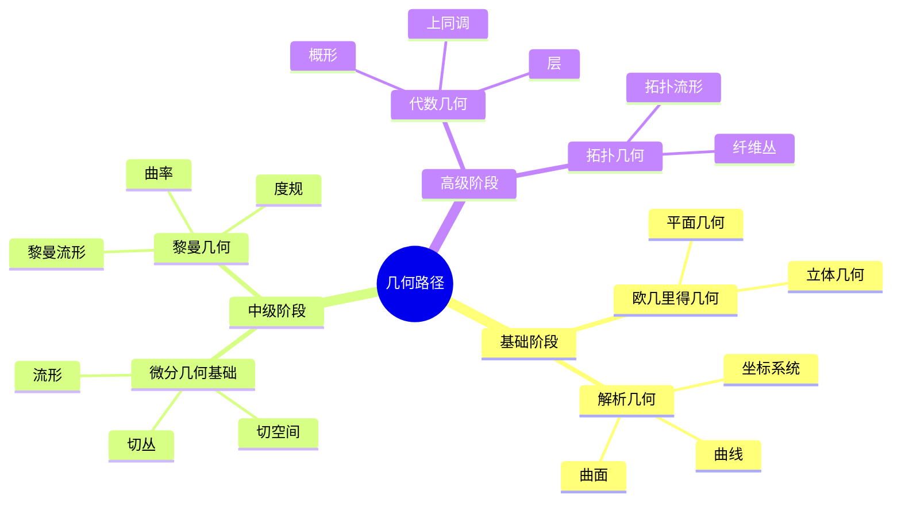
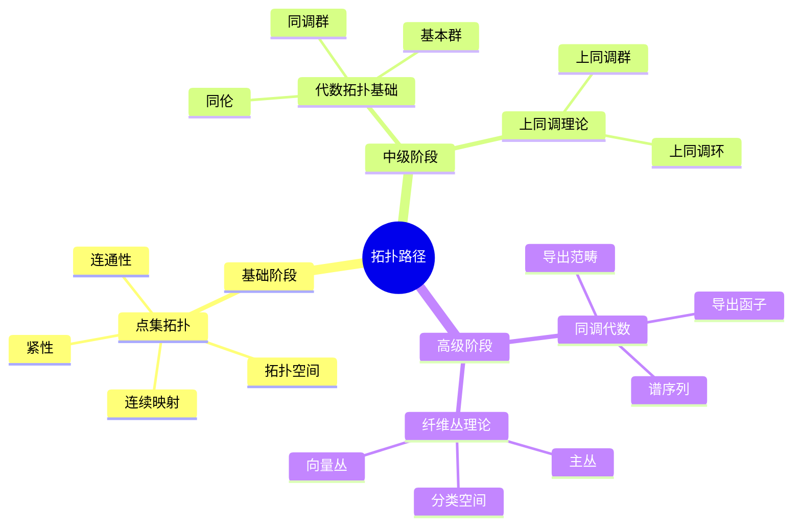
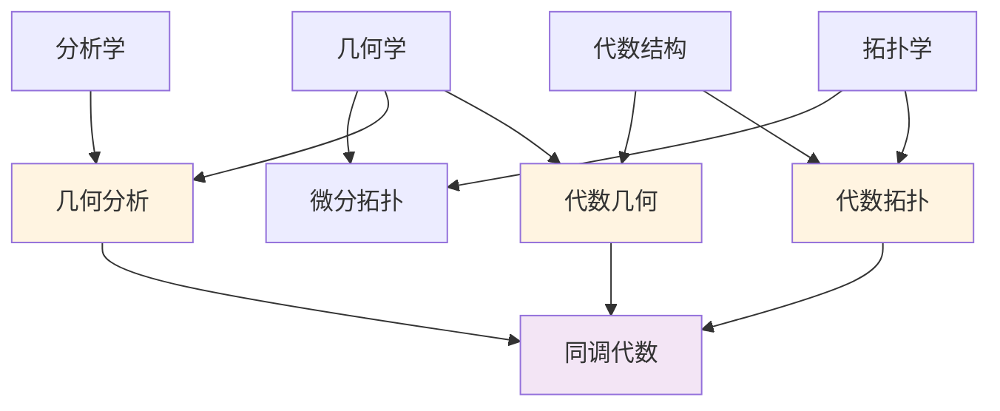

# 学习路径思维导图

**主题编号**: C.01.03
**创建日期**: 2025年11月21日
**最后更新**: 2025年11月21日

---

## 📋 目录 / Table of Contents

- [学习路径思维导图](#学习路径思维导图)
  - [📋 目录 / Table of Contents](#-目录--table-of-contents)
  - [📋 概述 (编号: C.01.03.01)](#-概述-编号-c010301)
  - [🎯 主要学习路径 (编号: C.01.03.02)](#-主要学习路径-编号-c010302)
    - [代数路径](#代数路径)
    - [分析路径](#分析路径)
    - [几何路径](#几何路径)
    - [拓扑路径](#拓扑路径)
  - [🔄 路径交叉点 (编号: C.01.03.03)](#-路径交叉点-编号-c010303)
    - [关键交叉概念](#关键交叉概念)
  - [📈 学习建议 (编号: C.01.03.04)](#-学习建议-编号-c010304)
    - [路径选择](#路径选择)
    - [时间规划](#时间规划)

---

## 📋 概述 (编号: C.01.03.01)

本文档通过思维导图形式展示FormalMath项目的学习路径规划。

**使用说明**:

- **学习阶段**: 每个分支的学习分为基础阶段、初级阶段、中级阶段、高级阶段和应用阶段
- **学习顺序**: 按照阶段顺序学习，每个阶段都有明确的学习目标
- **学习时间**: 根据个人情况调整学习时间，建议每个阶段至少1-2个月
- **学习评估**: 每个阶段结束后进行评估，确保掌握后再进入下一阶段
- **路径选择**: 根据学习目标选择合适的路径，可以同时学习多个路径

---

## 🎯 主要学习路径 (编号: C.01.03.02)

### 代数路径

### 分析路径

**学习说明**:

- **基础阶段**: 掌握实分析的基本概念，理解极限、连续、导数、积分
- **中级阶段**: 学习复分析和级数理论，理解复变函数和级数收敛
- **高级阶段**: 学习泛函分析和调和分析，掌握函数空间理论
- **应用阶段**: 学习微分方程和几何分析，应用分析理论解决实际问题

**学习建议**:

- **时间分配**: 基础阶段3-6个月，中级阶段6-12个月，高级阶段12-24个月，应用阶段6-12个月
- **前置要求**: 基础数学（实数理论、函数理论）
- **学习重点**: 掌握$\varepsilon$-$\delta$语言，理解分析证明方法

### 几何路径

### 拓扑路径

---

## 🔄 路径交叉点 (编号: C.01.03.03)

### 关键交叉概念

---

## 📈 学习建议 (编号: C.01.03.04)

### 路径选择

1. **初学者**: 从基础数学开始，选择一条主路径
2. **中级学习者**: 在主路径基础上，探索交叉领域
3. **高级学习者**: 深入交叉领域，学习前沿理论

### 时间规划

- **基础阶段**: 3-6个月
- **中级阶段**: 6-12个月
- **高级阶段**: 12-24个月

---

**创建日期**: 2025年11月21日
**最后更新**: 2025年11月21日
**维护状态**: 持续更新中
