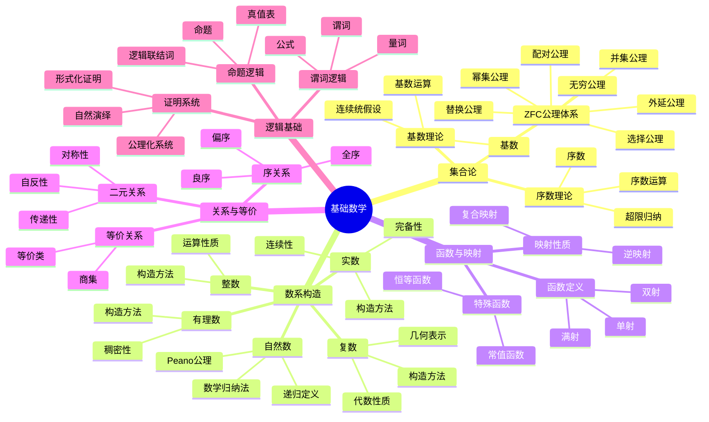
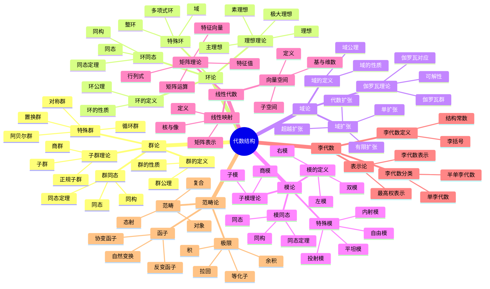
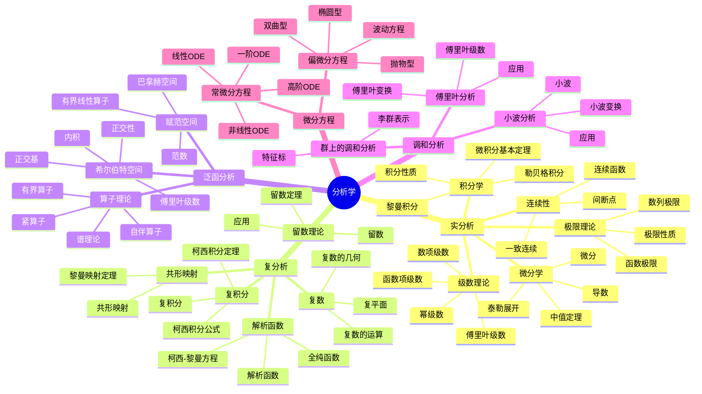
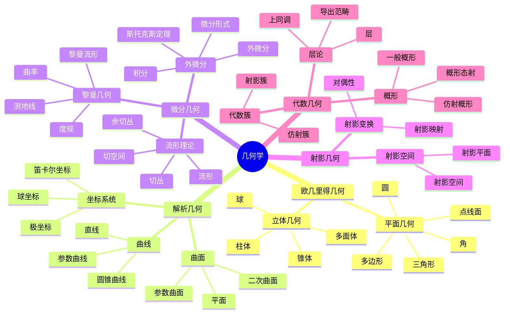
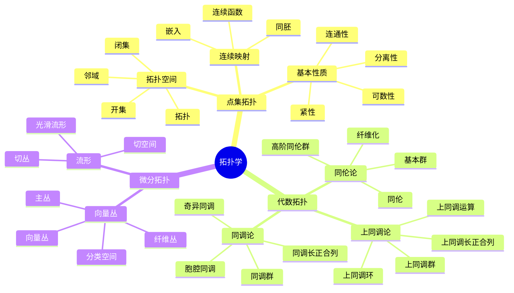
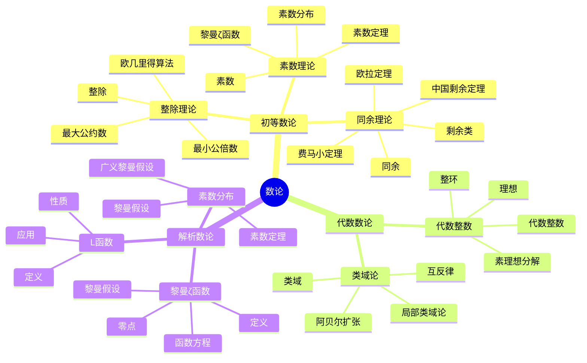
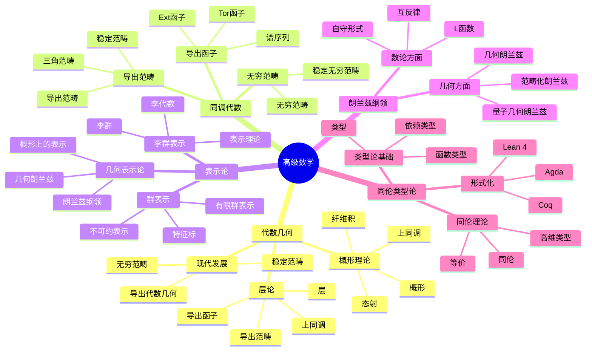
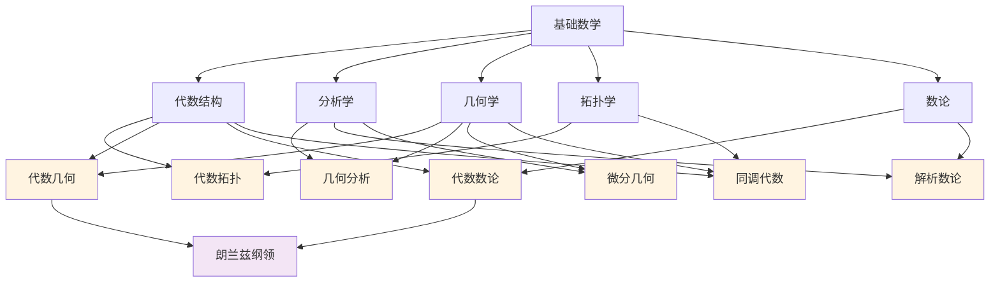
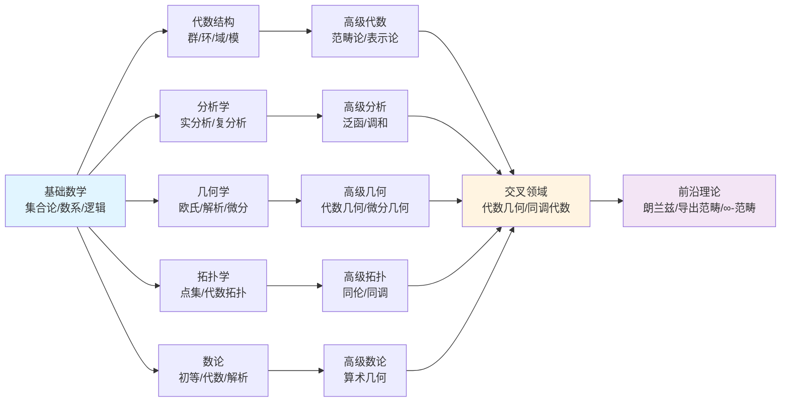

# FormalMath 全面知识体系思维导图

## 📋 概述

本文档提供FormalMath项目的全面知识体系思维导图，基于docs文件夹中的所有文档内容，系统化地展示数学知识的整体结构、关联关系和发展脉络。

**创建日期**: 2025年11月21日
**数据来源**: docs文件夹所有文档
**目标**: 建立完整的知识认知体系

---

## 🗺️ 一、核心知识体系全景图

### 1.1 基础层（Foundation Layer）

### 1.2 代数层（Algebraic Layer）

### 1.3 分析层（Analysis Layer）

### 1.4 几何层（Geometry Layer）

### 1.5 拓扑层（Topology Layer）

### 1.6 数论层（Number Theory Layer）

### 1.7 高级数学层（Advanced Mathematics Layer）

---

## 🔗 二、跨分支关联网络

### 2.1 主要交叉领域

### 2.2 知识演进路径

---

## 📊 三、知识体系统计

### 3.1 分支覆盖

| 分支 | 子分支数 | 核心概念数 | 文档数量 | 完成度 |
|-----|---------|----------|---------|--------|
| 基础数学 | 5 | 50+ | 10+ | 100% |
| 代数结构 | 7 | 150+ | 20+ | 100% |
| 分析学 | 5 | 80+ | 15+ | 100% |
| 几何学 | 5 | 70+ | 12+ | 100% |
| 拓扑学 | 3 | 60+ | 10+ | 100% |
| 数论 | 3 | 50+ | 8+ | 100% |
| 逻辑学 | 3 | 30+ | 5+ | 90% |
| 计算数学 | 2 | 40+ | 6+ | 85% |
| 应用数学 | 10+ | 100+ | 15+ | 90% |
| 高级数学 | 8+ | 200+ | 30+ | 95% |

### 3.2 交叉领域

| 交叉领域 | 涉及分支 | 核心概念数 | 重要性 |
|---------|---------|----------|--------|
| 代数拓扑 | 代数+拓扑 | 50+ | ⭐⭐⭐⭐⭐ |
| 代数几何 | 代数+几何 | 100+ | ⭐⭐⭐⭐⭐ |
| 几何分析 | 分析+几何 | 60+ | ⭐⭐⭐⭐⭐ |
| 代数数论 | 代数+数论 | 40+ | ⭐⭐⭐⭐ |
| 解析数论 | 分析+数论 | 35+ | ⭐⭐⭐⭐ |
| 微分几何 | 分析+几何 | 70+ | ⭐⭐⭐⭐⭐ |
| 同调代数 | 代数+拓扑+几何 | 80+ | ⭐⭐⭐⭐⭐ |

---

## 🎯 四、知识体系特点

### 4.1 系统性

- **完整覆盖**: 涵盖所有主要数学分支
- **层次清晰**: 从基础到高级，层次分明
- **关联明确**: 分支间关联关系清晰

### 4.2 前沿性

- **现代理论**: 包含概形理论、导出范畴、朗兰兹纲领等前沿内容
- **交叉融合**: 展示现代数学的交叉融合趋势
- **形式化**: 包含形式化证明和语义模型

### 4.3 实用性

- **学习路径**: 提供清晰的学习路径指导
- **应用导向**: 包含应用数学和计算数学
- **工具支持**: 提供认知工具和学习方法

---

## 🔗 五、关联文档

### 项目文档

- [项目索引](../../docs/项目索引.md)
- [术语词典总索引](../../docs/FormalMath术语词典总索引.md)
- [跨分支知识关联图谱](../../docs/跨分支知识关联图谱-2025年11月20日.md)
- [知识关联图谱系统](../../docs/知识关联图谱系统-2025年8月30日.md)

### 概念体系文档

- [总体思维导图总览](./00-总体思维导图总览.md)
- [数学知识体系全景图](./01-数学知识体系全景图.md)
- [分支关联思维导图](./02-分支关联思维导图.md)
- [学习路径思维导图](./03-学习路径思维导图.md)

---

**创建日期**: 2025年11月21日
**维护状态**: 持续更新中
**版本**: v1.0
