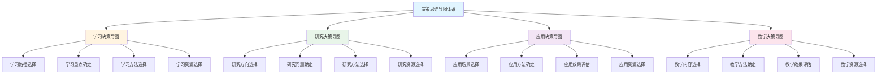
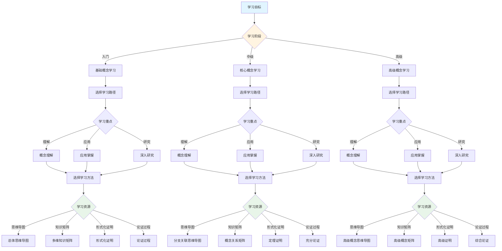
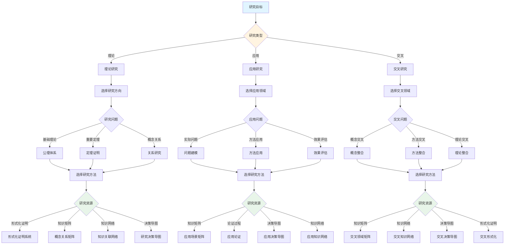
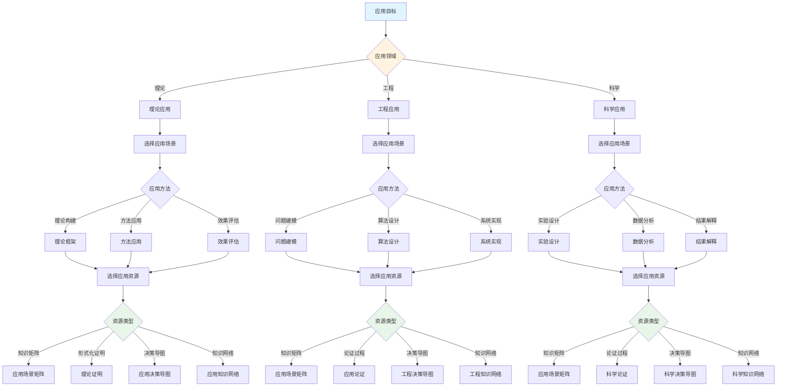
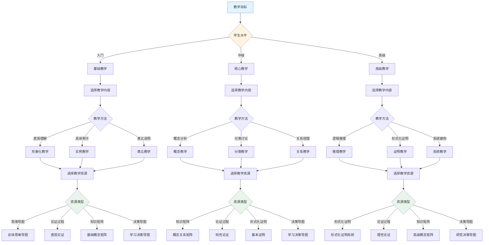

# 决策思维导图体系

**主题编号**: C.01.05
**创建日期**: 2025年1月
**最后更新**: 2025年1月

---

## 📋 概述

本文档建立FormalMath概念体系的决策思维导图体系，整合思维导图、知识矩阵、形式化证明、论证过程等多种表征方式，为概念学习、研究和应用提供决策支持。

**目标**：建立系统化的决策思维导图体系，支持：

- 学习路径决策
- 研究方向决策
- 应用场景决策
- 教学方法决策

**理论基础**：

- 集合论与范畴论双视角框架
- 直观-知性-理性三维认知模型
- 多维度知识矩阵分析
- 形式化证明系统

---

## 🎯 一、决策思维导图总览 (编号: C.01.05.01)

### 1.1 决策类型体系

### 1.2 决策因素分析

**决策因素矩阵**：

| 决策类型 | 主要因素 | 次要因素 | 评估标准 |
|---------|---------|---------|---------|
| **学习决策** | 学习目标、学习阶段 | 学习时间、学习资源 | 理解深度、应用能力 |
| **研究决策** | 研究目标、研究方向 | 研究资源、研究时间 | 理论贡献、应用价值 |
| **应用决策** | 应用领域、应用复杂度 | 应用资源、应用效果 | 效率、准确性、可靠性 |
| **教学决策** | 教学目标、学生水平 | 教学资源、教学时间 | 理解程度、应用能力 |

---

## 📚 二、学习决策思维导图 (编号: C.01.05.02)

### 2.1 学习决策流程

### 2.2 学习路径决策矩阵

| 学习目标 | 学习阶段 | 推荐路径 | 学习重点 | 学习方法 | 学习资源 |
|---------|---------|---------|---------|---------|---------|
| **理解概念** | 入门 | 基础→核心→应用 | 概念定义、基本性质 | 直观理解、具体例子 | 思维导图、论证过程 |
| **应用概念** | 中级 | 核心→应用→深入 | 应用方法、应用场景 | 实例分析、实践应用 | 知识矩阵、形式化证明 |
| **研究概念** | 高级 | 深入→前沿→创新 | 理论构建、前沿问题 | 形式化证明、理论研究 | 形式化证明、知识矩阵 |

### 2.3 学习重点决策

**基于知识矩阵的学习重点决策**：

1. **知识层次矩阵** → 确定学习层次
   - L0基础层：基础概念和基本性质
   - L1中级层：核心概念和重要定理
   - L2高级层：高级概念和前沿理论

2. **学习难度矩阵** → 确定学习顺序
   - 简单概念：优先学习
   - 中等概念：循序渐进
   - 困难概念：需要充分准备

3. **依赖关系矩阵** → 确定前置知识
   - 直接依赖：必须掌握
   - 间接依赖：建议掌握
   - 深层依赖：需要系统学习

### 2.4 学习方法决策

**基于认知维度的学习方法决策**：

1. **直观维度**（入门阶段）
   - 使用思维导图建立总体框架
   - 使用具体例子理解概念
   - 使用类比说明加深理解

2. **知性维度**（中级阶段）
   - 使用知识矩阵深入分析
   - 使用概念分类系统理解
   - 使用关系分析建立联系

3. **理性维度**（高级阶段）
   - 使用形式化证明严格理解
   - 使用逻辑推理深入分析
   - 使用系统建构整体把握

---

## 🔬 三、研究决策思维导图 (编号: C.01.05.03)

### 3.1 研究决策流程

### 3.2 研究方向决策矩阵

| 研究类型 | 研究方向 | 研究问题 | 研究方法 | 研究资源 |
|---------|---------|---------|---------|---------|
| **理论研究** | 基础理论 | 公理体系、概念定义 | 形式化证明、逻辑推理 | 形式化证明系统、知识矩阵 |
| **理论研究** | 重要定理 | 定理证明、性质研究 | 构造性证明、反证法 | 形式化证明、论证过程 |
| **理论研究** | 概念关系 | 概念关系、结构研究 | 范畴论方法、集合论方法 | 知识矩阵、知识网络 |
| **应用研究** | 实际问题 | 问题建模、方法应用 | 实例分析、实践验证 | 应用场景矩阵、决策导图 |
| **应用研究** | 方法应用 | 方法优化、效果评估 | 实验验证、效果分析 | 应用知识网络、论证过程 |
| **交叉研究** | 概念交叉 | 概念整合、理论统一 | 多视角分析、整合方法 | 交叉领域矩阵、知识网络 |

### 3.3 研究问题决策

**基于知识矩阵的研究问题决策**：

1. **研究热点矩阵** → 确定研究方向
   - 热点问题：当前研究重点
   - 前沿问题：未来研究方向
   - 空白问题：研究空白领域

2. **概念关系矩阵** → 发现研究问题
   - 强关联：深入研究关系
   - 弱关联：探索潜在关系
   - 无关联：发现新关系

3. **应用场景矩阵** → 发现应用问题
   - 理论应用：理论构建问题
   - 实际应用：实际问题应用
   - 交叉应用：跨领域应用

### 3.4 研究方法决策

**基于形式化证明的研究方法决策**：

1. **构造性证明** → 存在性研究
   - 直接构造对象
   - 适用于存在性证明

2. **反证法** → 唯一性研究
   - 假设结论不成立
   - 适用于唯一性证明

3. **归纳法** → 递归结构研究
   - 数学归纳法
   - 结构归纳法

4. **范畴论方法** → 结构保持研究
   - 函子和自然变换
   - 适用于结构研究

---

## 💼 四、应用决策思维导图 (编号: C.01.05.04)

### 4.1 应用决策流程

### 4.2 应用场景决策矩阵

| 应用领域 | 应用场景 | 应用方法 | 应用资源 | 评估标准 |
|---------|---------|---------|---------|---------|
| **理论应用** | 理论构建 | 形式化证明、逻辑推理 | 形式化证明系统、知识矩阵 | 严格性、完整性 |
| **理论应用** | 方法应用 | 方法选择、方法优化 | 知识矩阵、决策导图 | 有效性、效率 |
| **工程应用** | 问题建模 | 问题分析、模型构建 | 应用场景矩阵、论证过程 | 准确性、实用性 |
| **工程应用** | 算法设计 | 算法选择、算法优化 | 知识矩阵、形式化证明 | 效率、正确性 |
| **科学应用** | 实验设计 | 实验设计、数据分析 | 应用场景矩阵、论证过程 | 科学性、可靠性 |
| **科学应用** | 结果解释 | 理论解释、结果分析 | 知识矩阵、形式化证明 | 准确性、可信度 |

### 4.3 应用方法决策

**基于应用场景矩阵的应用方法决策**：

1. **理论应用** → 使用形式化证明
   - 理论构建：形式化证明系统
   - 方法应用：知识矩阵分析
   - 效果评估：逻辑推理验证

2. **工程应用** → 使用论证过程
   - 问题建模：应用场景矩阵
   - 算法设计：知识矩阵分析
   - 系统实现：决策导图指导

3. **科学应用** → 使用综合方法
   - 实验设计：应用场景矩阵
   - 数据分析：知识矩阵分析
   - 结果解释：形式化证明验证

---

## 🎓 五、教学决策思维导图 (编号: C.01.05.05)

### 5.1 教学决策流程

### 5.2 教学内容决策矩阵

| 学生水平 | 教学内容 | 教学方法 | 教学资源 | 评估方法 |
|---------|---------|---------|---------|---------|
| **入门** | 基础概念 | 直观理解、具体例子 | 思维导图、论证过程 | 理解程度、应用能力 |
| **入门** | 基本性质 | 形象化教学、类比说明 | 思维导图、知识矩阵 | 理解程度、记忆能力 |
| **中级** | 核心概念 | 概念分析、分类讨论 | 知识矩阵、论证过程 | 理解深度、应用能力 |
| **中级** | 重要定理 | 关系梳理、证明思路 | 形式化证明、论证过程 | 理解深度、推理能力 |
| **高级** | 高级概念 | 逻辑推理、形式化证明 | 形式化证明系统、知识矩阵 | 理解深度、研究能力 |
| **高级** | 前沿理论 | 系统建构、理论研究 | 形式化证明、知识网络 | 研究能力、创新能力 |

### 5.3 教学方法决策

**基于认知维度的教学方法决策**：

1. **直观维度**（入门教学）
   - 使用思维导图建立框架
   - 使用具体例子理解概念
   - 使用类比说明加深理解

2. **知性维度**（中级教学）
   - 使用知识矩阵深入分析
   - 使用概念分类系统理解
   - 使用关系分析建立联系

3. **理性维度**（高级教学）
   - 使用形式化证明严格理解
   - 使用逻辑推理深入分析
   - 使用系统建构整体把握

---

## 🔄 六、决策整合应用 (编号: C.01.05.06)

### 6.1 决策整合框架

**目标**：整合学习、研究、应用、教学四种决策类型，形成统一的决策支持系统。

**整合方式**：

1. **层次整合**
   - 学习决策：提供学习路径
   - 研究决策：提供研究方向
   - 应用决策：提供应用方法
   - 教学决策：提供教学方法

2. **资源整合**
   - 思维导图：提供总体框架
   - 知识矩阵：提供详细分析
   - 形式化证明：提供严格基础
   - 论证过程：提供理解桥梁
   - 决策导图：提供应用指导

3. **过程整合**
   - 学习过程：学习决策 → 知识矩阵 → 论证过程 → 形式化证明
   - 研究过程：研究决策 → 知识矩阵 → 形式化证明 → 应用验证
   - 应用过程：应用决策 → 知识矩阵 → 论证过程 → 实践应用
   - 教学过程：教学决策 → 知识矩阵 → 论证过程 → 教学评估

### 6.2 决策整合示例

**示例：群概念的综合决策**

1. **学习决策**：
   - 学习路径：基础概念 → 群的定义 → 群的性质 → 群的应用
   - 学习重点：群的定义、Lagrange定理、同态定理
   - 学习方法：直观理解 → 概念分析 → 形式化证明

2. **研究决策**：
   - 研究方向：群论基础理论
   - 研究问题：Lagrange定理的推广、同态定理的应用
   - 研究方法：形式化证明、范畴论方法

3. **应用决策**：
   - 应用场景：对称性研究、编码理论、密码学
   - 应用方法：群作用、群表示、群同态
   - 应用资源：知识矩阵、形式化证明、决策导图

4. **教学决策**：
   - 教学内容：群的定义、群的性质、群的应用
   - 教学方法：直观理解 → 概念分析 → 形式化证明
   - 教学资源：思维导图、知识矩阵、形式化证明、论证过程

---

## 🔗 七、关联文档 (编号: C.01.05.07)

### 7.1 思维导图文档

- [总体思维导图总览](./00-总体思维导图总览.md)
- [数学知识体系全景图](./01-数学知识体系全景图.md)
- [分支关联思维导图](./02-分支关联思维导图.md)
- [学习路径思维导图](./03-学习路径思维导图.md)

### 7.2 知识矩阵文档

- [知识矩阵总览](../02-知识矩阵/00-知识矩阵总览.md)
- [核心概念多维关系矩阵](../02-知识矩阵/10-核心概念多维关系矩阵.md)
- [多维矩阵对比分析](../02-知识矩阵/11-多维矩阵对比分析.md)

### 7.3 形式化证明文档

- [形式化证明系统](../00-形式化证明系统-2025年11月.md)
- [形式化定义标准模板](../00-形式化定义标准模板-2025年11月.md)

### 7.4 认知工具文档

- [认知工具总览](../04-认知工具/00-认知工具总览.md)
- [认知方式表征综合](../04-认知工具/07-认知方式表征综合.md)

### 7.5 核心概念文档

- [核心概念索引](../核心概念/00-核心概念索引.md)
- 所有33个核心概念的三视角版本文档

---

## ✅ 八、完成情况 (编号: C.01.05.08)

### 8.1 框架建立

- ✅ 决策思维导图体系框架：已完成
- ✅ 学习决策思维导图：已完成
- ✅ 研究决策思维导图：已完成
- ✅ 应用决策思维导图：已完成
- ✅ 教学决策思维导图：已完成

### 8.2 内容完善

- ✅ 决策流程设计：已完成
- ✅ 决策矩阵设计：已完成
- ✅ 决策因素分析：已完成
- ✅ 决策整合框架：已完成

### 8.3 决策导图示例完成情况

- ✅ **33个核心概念决策导图示例**：已全部完成 ✅
  - 基础数学：7个（集合、函数、自然数、整数、有理数、实数、复数）
  - 代数结构：5个（群、环、域、向量空间、线性映射）
  - 分析学：5个（极限、连续、导数、积分、级数）
  - 拓扑学：3个（拓扑空间、同伦、同调）
  - 几何学：5个（流形、黎曼流形、曲率、概形、层）
  - 数论：3个（素数、同余、L函数）
  - 离散数学：3个（图、组合数、算法）
  - 交叉领域：2个（表示、朗兰兹纲领）
- ✅ **所有决策导图示例**：包含学习、研究、应用、教学四种决策类型
- ✅ **所有决策导图示例**：包含关联文档部分，链接到相关文档

详见：[核心概念索引](../核心概念/00-核心概念索引.md) ⭐ 最新 - 所有33个核心概念的决策导图示例

### 8.4 后续工作

- ⏳ 建立决策效果评估体系
- ⏳ 完善决策支持系统
- ⏳ 持续优化决策流程
- ⏳ 根据使用反馈持续优化和完善

---

**创建日期**: 2025年1月
**最后更新**: 2025年1月
**维护状态**: 持续更新中
