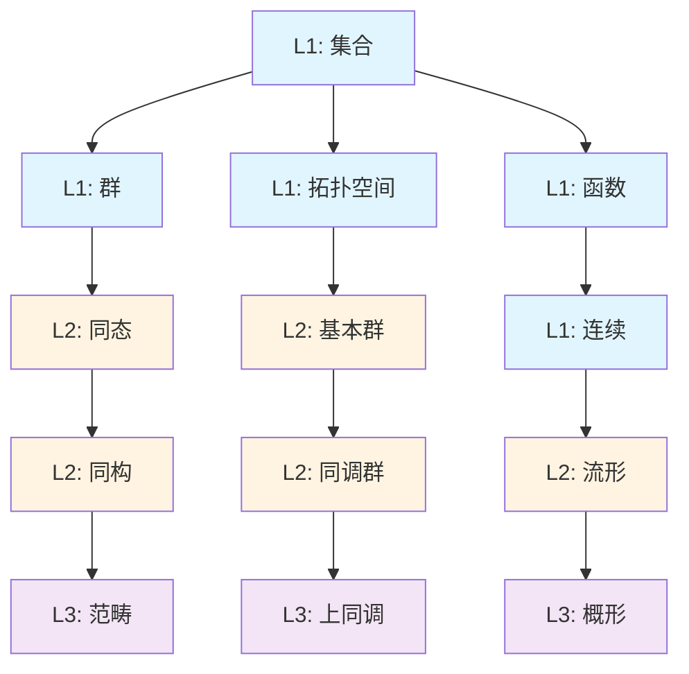

# 概念层次矩阵

**主题编号**: C.02.02
**创建日期**: 2025年11月21日
**最后更新**: 2025年11月21日

---

## 📋 目录 / Table of Contents

- [概念层次矩阵](#概念层次矩阵)
  - [📋 目录 / Table of Contents](#-目录--table-of-contents)
  - [📋 概述 (编号: C.02.02.01)](#-概述-编号-c020201)
  - [📊 概念层次分类 (编号: C.02.02.02)](#-概念层次分类-编号-c020202)
    - [层次定义](#层次定义)
  - [📈 各分支概念层次矩阵 (编号: C.02.02.03)](#-各分支概念层次矩阵-编号-c020203)
    - [基础数学](#基础数学)
    - [代数结构](#代数结构)
    - [分析学](#分析学)
    - [几何学](#几何学)
    - [拓扑学](#拓扑学)
    - [数论](#数论)
  - [🔗 跨层次依赖关系 (编号: C.02.02.04)](#-跨层次依赖关系-编号-c020204)
    - [典型依赖路径](#典型依赖路径)
  - [🎯 学习建议 (编号: C.02.02.05)](#-学习建议-编号-c020205)
    - [基于层次的学习顺序](#基于层次的学习顺序)
    - [关键依赖路径](#关键依赖路径)

---

## 📋 概述 (编号: C.02.02.01)

本文档通过矩阵形式展示FormalMath项目中数学概念的抽象层次和依赖关系。

---

## 📊 概念层次分类 (编号: C.02.02.02)

### 层次定义

- **L1 (基础层)**: 基础概念，不依赖其他高级概念
- **L2 (中级层)**: 中级概念，依赖L1概念
- **L3 (高级层)**: 高级概念，依赖L1和L2概念

---

## 📈 各分支概念层次矩阵 (编号: C.02.02.03)

### 基础数学

| 概念 | L1基础 | L2中级 | L3高级 | 依赖关系 |
|-----|--------|--------|--------|---------|
| 集合 | ✅ | - | - | 无 |
| 函数 | ✅ | - | - | 集合 |
| 关系 | ✅ | - | - | 集合 |
| 基数 | ✅ | - | - | 集合 |
| 序数 | ✅ | - | - | 集合 |
| 自然数 | ✅ | - | - | 集合 |
| 实数 | ✅ | - | - | 有理数 |
| 复数 | ✅ | - | - | 实数 |

### 代数结构

| 概念 | L1基础 | L2中级 | L3高级 | 依赖关系 |
|-----|--------|--------|--------|---------|
| 群 | ✅ | - | - | 集合、函数 |
| 环 | ✅ | - | - | 群 |
| 域 | ✅ | - | - | 环 |
| 模 | ✅ | - | - | 环、群 |
| 子群 | ✅ | - | - | 群 |
| 理想 | ✅ | - | - | 环 |
| 商群 | ✅ | - | - | 群、子群 |
| 同态 | ✅ | - | - | 群/环/域 |
| 同构 | ✅ | - | - | 同态 |
| 伽罗瓦群 | - | ✅ | - | 群、域 |
| 李代数 | - | ✅ | - | 群、线性代数 |
| 范畴 | - | ✅ | - | 集合、函数 |
| 函子 | - | ✅ | - | 范畴 |
| 导出范畴 | - | - | ✅ | 范畴、同调代数 |

### 分析学

| 概念 | L1基础 | L2中级 | L3高级 | 依赖关系 |
|-----|--------|--------|--------|---------|
| 极限 | ✅ | - | - | 实数、函数 |
| 连续 | ✅ | - | - | 极限 |
| 导数 | ✅ | - | - | 极限 |
| 积分 | ✅ | - | - | 极限、连续 |
| 级数 | ✅ | - | - | 极限 |
| 全纯函数 | - | ✅ | - | 导数、复数 |
| 解析函数 | - | ✅ | - | 全纯函数 |
| 赋范空间 | - | ✅ | - | 向量空间、分析 |
| 巴拿赫空间 | - | ✅ | - | 赋范空间 |
| 希尔伯特空间 | - | ✅ | - | 巴拿赫空间、内积 |
| 算子理论 | - | - | ✅ | 巴拿赫空间、希尔伯特空间 |
| 谱理论 | - | - | ✅ | 算子理论 |

### 几何学

| 概念 | L1基础 | L2中级 | L3高级 | 依赖关系 |
|-----|--------|--------|--------|---------|
| 点 | ✅ | - | - | 无 |
| 线 | ✅ | - | - | 点 |
| 面 | ✅ | - | - | 线 |
| 角 | ✅ | - | - | 线 |
| 距离 | ✅ | - | - | 点 |
| 坐标系统 | ✅ | - | - | 点、数 |
| 曲线 | ✅ | - | - | 点、函数 |
| 曲面 | ✅ | - | - | 曲线 |
| 流形 | - | ✅ | - | 拓扑、分析 |
| 切空间 | - | ✅ | - | 流形 |
| 黎曼流形 | - | ✅ | - | 流形、度规 |
| 曲率 | - | ✅ | - | 黎曼流形 |
| 概形 | - | - | ✅ | 环、拓扑 |
| 层 | - | - | ✅ | 概形、范畴 |

### 拓扑学

| 概念 | L1基础 | L2中级 | L3高级 | 依赖关系 |
|-----|--------|--------|--------|---------|
| 拓扑空间 | ✅ | - | - | 集合 |
| 开集 | ✅ | - | - | 拓扑空间 |
| 闭集 | ✅ | - | - | 拓扑空间 |
| 连续映射 | ✅ | - | - | 拓扑空间 |
| 紧性 | ✅ | - | - | 拓扑空间 |
| 连通性 | ✅ | - | - | 拓扑空间 |
| 同胚 | ✅ | - | - | 连续映射 |
| 基本群 | - | ✅ | - | 拓扑空间、群 |
| 同调群 | - | ✅ | - | 拓扑空间、群 |
| 上同调群 | - | ✅ | - | 同调群 |
| 纤维丛 | - | - | ✅ | 拓扑空间、群 |

### 数论

| 概念 | L1基础 | L2中级 | L3高级 | 依赖关系 |
|-----|--------|--------|--------|---------|
| 整除 | ✅ | - | - | 整数 |
| 最大公约数 | ✅ | - | - | 整除 |
| 素数 | ✅ | - | - | 整除 |
| 同余 | ✅ | - | - | 整除 |
| 欧拉函数 | ✅ | - | - | 同余 |
| 代数整数 | - | ✅ | - | 整数、域 |
| 理想 | - | ✅ | - | 环、代数整数 |
| 类域论 | - | - | ✅ | 域、群 |
| 黎曼ζ函数 | - | ✅ | - | 分析、数论 |
| L函数 | - | - | ✅ | 黎曼ζ函数 |

---

## 🔗 跨层次依赖关系 (编号: C.02.02.04)

### 典型依赖路径

---

## 🎯 学习建议 (编号: C.02.02.05)

### 基于层次的学习顺序

1. **第一阶段**: 掌握所有L1基础概念
2. **第二阶段**: 在L1基础上学习L2中级概念
3. **第三阶段**: 在L1和L2基础上学习L3高级概念

### 关键依赖路径

- **代数路径**: 集合 → 群 → 同态 → 范畴 → 导出范畴
- **拓扑路径**: 集合 → 拓扑空间 → 基本群 → 同调群 → 上同调
- **几何路径**: 点 → 流形 → 黎曼流形 → 概形

---

**创建日期**: 2025年11月21日
**最后更新**: 2025年11月21日
**维护状态**: 持续更新中
