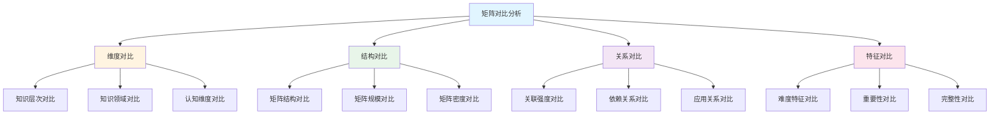

# 多维矩阵对比分析

**主题编号**: C.02.11
**创建日期**: 2025年11月21日
**最后更新**: 2025年11月21日

---

## 📋 概述

本文档提供多维矩阵的对比分析方法，展示如何通过对比不同矩阵来深入理解数学知识的结构、关系和特征。

**目标**: 建立矩阵对比分析体系，通过多维度对比发现知识规律

---

## 🎯 一、矩阵对比分析框架 (编号: C.02.11.01)

### 1.1 对比维度

---

## 📊 二、知识层次矩阵对比 (编号: C.02.11.02)

### 2.1 不同知识层次的矩阵特征对比

| 矩阵特征 | L0基础层 | L1中级层 | L2高级层 | L3研究层 |
|---------|---------|---------|---------|---------|
| **概念数量** | 多 | 中 | 少 | 极少 |
| **关联密度** | 低 | 中 | 高 | 极高 |
| **依赖深度** | 浅 | 中 | 深 | 极深 |
| **应用广度** | 广 | 很广 | 较广 | 窄 |
| **学习难度** | 低 | 中 | 高 | 极高 |
| **直观程度** | 高 | 中 | 低 | 极低 |

### 2.2 知识层次矩阵示例对比

#### L0基础层矩阵示例（集合概念）

| 维度 | 指标 | 集合 |
|------|------|------|
| **知识层次** | L0基础 | ⭐⭐⭐⭐⭐ |
| **直观理解** | 高 | ⭐⭐⭐⭐⭐ |
| **形式化程度** | 低 | ⭐⭐ |
| **应用广度** | 广 | ⭐⭐⭐⭐⭐ |

#### L2高级层矩阵示例（概形概念）

| 维度 | 指标 | 概形 |
|------|------|------|
| **知识层次** | L2高级 | ⭐⭐⭐⭐⭐ |
| **直观理解** | 低 | ⭐⭐ |
| **形式化程度** | 高 | ⭐⭐⭐⭐⭐ |
| **应用广度** | 较广 | ⭐⭐⭐ |

**对比分析**:

- **直观理解**: L0层概念更直观，L2层概念更抽象
- **形式化程度**: L0层形式化程度低，L2层形式化程度高
- **应用广度**: L0层应用更广，L2层应用更专业

---

## 🔗 三、知识领域矩阵对比 (编号: C.02.11.03)

### 3.1 不同知识领域的矩阵特征对比

| 矩阵特征 | 基础数学 | 代数结构 | 分析学 | 几何学 | 拓扑学 | 数论 |
|---------|---------|---------|--------|--------|--------|------|
| **概念数量** | 多 | 中 | 中 | 中 | 少 | 少 |
| **关联密度** | 极高 | 高 | 高 | 高 | 中 | 中 |
| **直观程度** | 中 | 低 | 中 | 高 | 低 | 低 |
| **形式化程度** | 中 | 高 | 中 | 中 | 高 | 高 |
| **应用广度** | 极广 | 广 | 很广 | 很广 | 较广 | 较广 |

### 3.2 知识领域矩阵示例对比

#### 基础数学矩阵（集合）

| 维度 | D1基础 | D2代数 | D3分析 | D4几何 | D5拓扑 | D6数论 |
|------|--------|--------|--------|--------|--------|--------|
| **集合** | ⭐⭐⭐⭐⭐ | ⭐⭐⭐⭐ | ⭐⭐⭐⭐ | ⭐⭐⭐ | ⭐⭐⭐⭐ | ⭐⭐⭐ |

#### 代数结构矩阵（群）

| 维度 | D1基础 | D2代数 | D3分析 | D4几何 | D5拓扑 | D6数论 |
|------|--------|--------|--------|--------|--------|--------|
| **群** | ⭐⭐⭐ | ⭐⭐⭐⭐⭐ | ⭐⭐⭐ | ⭐⭐⭐⭐ | ⭐⭐⭐⭐ | ⭐⭐⭐ |

**对比分析**:

- **领域关联**: 基础数学与所有领域高度关联，代数结构主要关联代数和几何
- **应用范围**: 基础数学应用范围最广，代数结构应用范围较窄
- **依赖关系**: 基础数学是其他领域的基础，代数结构依赖基础数学

---

## 🧠 四、认知维度矩阵对比 (编号: C.02.11.04)

### 4.1 不同认知维度的矩阵特征对比

| 矩阵特征 | 直观维度 | 知性维度 | 理性维度 |
|---------|---------|---------|---------|
| **理解方式** | 形象化 | 概念化 | 形式化 |
| **工具支持** | 思维导图 | 概念地图 | 证明系统 |
| **学习阶段** | 入门 | 中级 | 高级 |
| **数学分支** | 几何学 | 分析学 | 拓扑学 |
| **知识层次** | L0基础 | L1中级 | L2高级 |

### 4.2 认知维度矩阵示例对比

#### 直观维度矩阵（群论）

| 概念 | 直观理解 | 形象类比 | 具体例子 | 几何表示 |
|------|---------|---------|---------|---------|
| **群** | ⭐⭐⭐⭐⭐ | ⭐⭐⭐⭐⭐ | ⭐⭐⭐⭐ | ⭐⭐⭐⭐ |
| **子群** | ⭐⭐⭐⭐ | ⭐⭐⭐⭐ | ⭐⭐⭐ | ⭐⭐⭐ |
| **同态** | ⭐⭐⭐ | ⭐⭐⭐ | ⭐⭐⭐ | ⭐⭐ |

#### 知性维度矩阵（群论）

| 概念 | 概念定义 | 分类体系 | 关联关系 | 抽象结构 |
|------|---------|---------|---------|---------|
| **群** | ⭐⭐⭐⭐⭐ | ⭐⭐⭐⭐⭐ | ⭐⭐⭐⭐⭐ | ⭐⭐⭐⭐⭐ |
| **子群** | ⭐⭐⭐⭐⭐ | ⭐⭐⭐⭐ | ⭐⭐⭐⭐ | ⭐⭐⭐⭐ |
| **同态** | ⭐⭐⭐⭐⭐ | ⭐⭐⭐⭐ | ⭐⭐⭐⭐⭐ | ⭐⭐⭐⭐ |

#### 理性维度矩阵（群论）

| 概念 | 公理体系 | 形式化定义 | 逻辑推理 | 证明系统 |
|------|---------|-----------|---------|---------|
| **群** | ⭐⭐⭐⭐⭐ | ⭐⭐⭐⭐⭐ | ⭐⭐⭐⭐⭐ | ⭐⭐⭐⭐ |
| **子群** | ⭐⭐⭐⭐ | ⭐⭐⭐⭐⭐ | ⭐⭐⭐⭐ | ⭐⭐⭐ |
| **同态** | ⭐⭐⭐⭐ | ⭐⭐⭐⭐⭐ | ⭐⭐⭐⭐⭐ | ⭐⭐⭐⭐ |

**对比分析**:

- **理解方式**: 直观维度强调形象化，知性维度强调概念化，理性维度强调形式化
- **工具支持**: 不同维度需要不同的工具支持
- **学习路径**: 从直观到知性到理性的学习路径

---

## 📈 五、矩阵结构对比 (编号: C.02.11.05)

### 5.1 矩阵结构类型对比

| 结构类型 | 特点 | 适用场景 | 示例 |
|---------|------|---------|------|
| **对称矩阵** | 对称关系 | 关联关系、相似性 | 分支关联矩阵 |
| **三角矩阵** | 层次关系 | 依赖关系、层次结构 | 概念层次矩阵 |
| **稀疏矩阵** | 关联较少 | 独立概念、低关联 | 独立概念矩阵 |
| **稠密矩阵** | 关联较多 | 核心概念、高关联 | 核心概念矩阵 |

### 5.2 矩阵规模对比

| 矩阵规模 | 概念数量 | 关联数量 | 复杂度 | 适用场景 |
|---------|---------|---------|--------|---------|
| **小规模** | <10 | <50 | 低 | 单一主题 |
| **中规模** | 10-50 | 50-500 | 中 | 单一分支 |
| **大规模** | 50-200 | 500-5000 | 高 | 多分支 |
| **超大规模** | >200 | >5000 | 极高 | 全知识体系 |

### 5.3 矩阵密度对比

| 矩阵密度 | 关联比例 | 特征 | 适用场景 |
|---------|---------|------|---------|
| **稀疏** | <10% | 概念独立 | 基础概念 |
| **中等** | 10-50% | 概念关联 | 一般概念 |
| **稠密** | 50-80% | 概念高度关联 | 核心概念 |
| **极稠密** | >80% | 概念完全关联 | 系统概念 |

---

## 🔍 六、矩阵关系对比 (编号: C.02.11.06)

### 6.1 关联强度对比

| 关联类型 | 强度范围 | 特征 | 示例 |
|---------|---------|------|------|
| **极强关联** | ⭐⭐⭐⭐⭐ | 核心依赖 | 集合→函数 |
| **强关联** | ⭐⭐⭐⭐ | 重要依赖 | 群→环 |
| **中等关联** | ⭐⭐⭐ | 一般关联 | 群→拓扑 |
| **弱关联** | ⭐⭐ | 间接关联 | 群→数论 |
| **很弱关联** | ⭐ | 极少关联 | 群→组合 |

### 6.2 依赖关系对比

| 依赖类型 | 深度 | 特征 | 示例 |
|---------|------|------|------|
| **直接依赖** | 1 | 直接关系 | 函数→集合 |
| **间接依赖** | 2-3 | 间接关系 | 积分→函数→集合 |
| **深层依赖** | 4-5 | 深层关系 | 流形→拓扑→集合 |
| **极深依赖** | >5 | 极深关系 | 朗兰兹纲领→多个概念链 |

### 6.3 应用关系对比

| 应用类型 | 广度 | 特征 | 示例 |
|---------|------|------|------|
| **理论应用** | 广 | 理论构建 | 集合论 |
| **实际应用** | 很广 | 实际问题 | 函数、算法 |
| **交叉应用** | 较广 | 跨领域 | 群表示、拓扑几何 |

---

## 📊 七、矩阵特征对比 (编号: C.02.11.07)

### 7.1 难度特征对比

| 难度类型 | 范围 | 特征 | 示例 |
|---------|------|------|------|
| **直观理解** | ⭐-⭐⭐⭐⭐⭐ | 形象化程度 | 几何>代数>拓扑 |
| **形式化理解** | ⭐-⭐⭐⭐⭐⭐ | 严格程度 | 拓扑>代数>几何 |
| **深入应用** | ⭐-⭐⭐⭐⭐⭐ | 应用复杂度 | 分析>几何>代数 |

### 7.2 重要性对比

| 重要性类型 | 范围 | 特征 | 示例 |
|---------|------|------|------|
| **基础重要性** | ⭐-⭐⭐⭐⭐⭐ | 基础地位 | 集合>函数>群 |
| **应用重要性** | ⭐-⭐⭐⭐⭐⭐ | 应用价值 | 函数>算法>群 |
| **理论重要性** | ⭐-⭐⭐⭐⭐⭐ | 理论价值 | 集合>群>概形 |

### 7.3 完整性对比

| 完整性类型 | 范围 | 特征 | 示例 |
|---------|------|------|------|
| **术语完整性** | 0-100% | 术语覆盖 | 基础数学>高级数学 |
| **理论完整性** | 0-100% | 理论覆盖 | 代数结构>应用数学 |
| **示例完整性** | 0-100% | 示例覆盖 | 基础数学>拓扑学 |

---

## 🎯 八、矩阵对比分析方法 (编号: C.02.11.08)

### 8.1 对比分析步骤

1. **选择对比矩阵**: 确定要对比的矩阵类型和范围
2. **提取对比维度**: 确定对比的维度和指标
3. **计算对比指标**: 计算对比的数值和特征
4. **分析对比结果**: 分析对比的规律和差异
5. **总结对比结论**: 总结对比的发现和建议

### 8.2 对比分析工具

| 工具 | 功能 | 适用场景 |
|-----|------|---------|
| **矩阵运算** | 矩阵加减、乘除 | 数值对比 |
| **统计分析** | 均值、方差、相关性 | 特征对比 |
| **可视化** | 图表、热力图 | 直观对比 |
| **机器学习** | 聚类、分类 | 模式发现 |

### 8.3 对比分析应用

- **学习路径规划**: 通过对比不同概念的难度和重要性规划学习路径
- **知识结构优化**: 通过对比不同矩阵的结构优化知识组织
- **教学策略设计**: 通过对比不同认知维度设计教学策略
- **研究问题发现**: 通过对比不同矩阵发现研究问题

---

## 🔗 关联文档

- [知识矩阵总览 (C.02.00)](./00-知识矩阵总览.md)
- [分支关联矩阵 (C.02.01)](./01-分支关联矩阵.md)
- [概念层次矩阵 (C.02.02)](./02-概念层次矩阵.md)
- [核心概念多维关系矩阵 (C.02.10)](./10-核心概念多维关系矩阵.md)
- [认知方式表征综合 (C.04.07)](../04-认知工具/07-认知方式表征综合.md)

---

**创建日期**: 2025年11月21日
**最后更新**: 2025年11月21日
**维护状态**: 持续更新中
