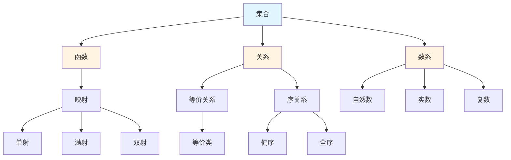

# 基础数学概念梳理

## 📋 概述

本文档系统梳理基础数学领域的核心概念，包括集合论、数系、函数与映射、关系与等价、逻辑基础等。

---

## 🎯 核心概念体系

### 1. 集合论核心概念

#### 基础概念

- **集合 (Set)**: 由确定对象组成的整体
- **元素 (Element)**: 集合中的个体对象
- **子集 (Subset)**: 一个集合的所有元素都属于另一个集合
- **幂集 (Power Set)**: 集合的所有子集构成的集合
- **并集 (Union)**: 两个集合所有元素的集合
- **交集 (Intersection)**: 两个集合共同元素的集合
- **差集 (Difference)**: 属于一个集合但不属于另一个集合的元素
- **补集 (Complement)**: 相对于全集的差集

#### 高级概念

- **基数 (Cardinality)**: 集合中元素的个数
- **序数 (Ordinal)**: 表示顺序的数
- **ZFC公理体系**: 集合论的公理化基础
- **连续统假设**: 关于基数的问题

### 2. 数系核心概念

#### 自然数

- **Peano公理**: 自然数的公理化定义
- **数学归纳法**: 证明自然数性质的方法
- **递归定义**: 通过自身定义自身的方法

#### 整数

- **整数构造**: 从自然数构造整数
- **整数运算**: 加法、减法、乘法
- **整数性质**: 交换律、结合律、分配律

#### 有理数

- **有理数构造**: 从整数构造有理数
- **有理数性质**: 稠密性、可数性
- **有理数运算**: 四则运算

#### 实数

- **实数构造**: 从有理数构造实数
- **实数完备性**: 实数系的完备性
- **实数性质**: 连续性、不可数性

#### 复数

- **复数构造**: 从实数构造复数
- **复数表示**: 代数形式、三角形式、指数形式
- **复数运算**: 加法、乘法、除法

### 3. 函数与映射核心概念

#### 基础概念

- **函数 (Function)**: 从一个集合到另一个集合的映射
- **定义域 (Domain)**: 函数的输入集合
- **值域 (Range)**: 函数的输出集合
- **像 (Image)**: 函数值的集合
- **原像 (Preimage)**: 函数值对应的输入集合

#### 函数性质

- **单射 (Injection)**: 不同的输入对应不同的输出
- **满射 (Surjection)**: 每个输出都有对应的输入
- **双射 (Bijection)**: 既是单射又是满射

#### 特殊函数

- **恒等函数**: 输出等于输入的函数
- **常值函数**: 输出恒为常数的函数
- **复合函数**: 两个函数的复合
- **反函数**: 双射函数的逆映射

### 4. 关系与等价核心概念

#### 二元关系

- **二元关系**: 两个集合元素之间的对应关系
- **自反性**: 每个元素与自己有关系
- **对称性**: 如果a与b有关系，则b与a也有关系
- **传递性**: 如果a与b有关系，b与c有关系，则a与c有关系

#### 等价关系

- **等价关系**: 满足自反性、对称性、传递性的关系
- **等价类**: 等价关系下的元素分类
- **商集**: 所有等价类构成的集合

#### 序关系

- **偏序关系**: 满足自反性、反对称性、传递性的关系
- **全序关系**: 任意两个元素都可比较的偏序关系
- **良序关系**: 每个非空子集都有最小元的全序关系

### 5. 逻辑基础核心概念

#### 命题逻辑

- **命题**: 可以判断真假的陈述句
- **逻辑联结词**: 且、或、非、蕴含、当且仅当
- **真值表**: 命题逻辑运算的真值表
- **逻辑等价**: 两个命题在所有情况下真值相同

#### 谓词逻辑

- **谓词**: 包含变量的陈述
- **量词**: 全称量词、存在量词
- **公式**: 由谓词和量词构成的逻辑表达式
- **自由变量**: 不受量词约束的变量
- **约束变量**: 受量词约束的变量

#### 证明系统

- **自然演绎**: 基于推理规则的自然证明系统
- **公理化系统**: 基于公理和推理规则的形式系统
- **证明**: 从前提推导结论的过程

---

## 🔗 概念关联图

---

## 📊 概念重要性矩阵

| 概念 | 基础性 | 应用性 | 重要性 |
|-----|--------|--------|--------|
| 集合 | ⭐⭐⭐⭐⭐ | ⭐⭐⭐⭐⭐ | ⭐⭐⭐⭐⭐ |
| 函数 | ⭐⭐⭐⭐⭐ | ⭐⭐⭐⭐⭐ | ⭐⭐⭐⭐⭐ |
| 关系 | ⭐⭐⭐⭐ | ⭐⭐⭐⭐ | ⭐⭐⭐⭐ |
| 自然数 | ⭐⭐⭐⭐⭐ | ⭐⭐⭐⭐ | ⭐⭐⭐⭐⭐ |
| 实数 | ⭐⭐⭐⭐⭐ | ⭐⭐⭐⭐⭐ | ⭐⭐⭐⭐⭐ |
| 复数 | ⭐⭐⭐⭐ | ⭐⭐⭐⭐ | ⭐⭐⭐⭐ |
| 等价关系 | ⭐⭐⭐⭐ | ⭐⭐⭐ | ⭐⭐⭐⭐ |
| 序关系 | ⭐⭐⭐ | ⭐⭐⭐ | ⭐⭐⭐ |
| 命题逻辑 | ⭐⭐⭐⭐ | ⭐⭐⭐ | ⭐⭐⭐⭐ |
| 谓词逻辑 | ⭐⭐⭐ | ⭐⭐⭐ | ⭐⭐⭐ |

---

**创建日期**: 2025年11月21日
**维护状态**: 持续更新中
