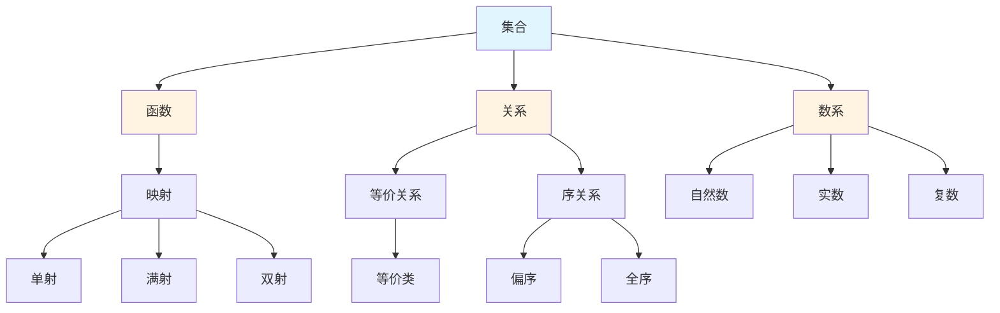

# 基础数学概念梳理

**主题编号**: C.03.01
**创建日期**: 2025年11月21日
**最后更新**: 2025年11月21日

---

## 📋 目录 / Table of Contents

- [基础数学概念梳理](#基础数学概念梳理)
  - [📋 目录 / Table of Contents](#-目录--table-of-contents)
  - [📋 概述 (编号: C.03.01.01)](#-概述-编号-c030101)
  - [🎯 核心概念体系 (编号: C.03.01.02)](#-核心概念体系-编号-c030102)
    - [1. 集合论核心概念 (编号: C.03.01.02.01)](#1-集合论核心概念-编号-c03010201)
      - [基础概念](#基础概念)
      - [高级概念](#高级概念)
    - [2. 数系核心概念 (编号: C.03.01.02.02)](#2-数系核心概念-编号-c03010202)
      - [自然数](#自然数)
      - [整数](#整数)
      - [有理数](#有理数)
      - [实数](#实数)
      - [复数](#复数)
    - [3. 函数与映射核心概念 (编号: C.03.01.02.03)](#3-函数与映射核心概念-编号-c03010203)
      - [基础概念](#基础概念-1)
      - [函数性质](#函数性质)
      - [特殊函数](#特殊函数)
    - [4. 关系与等价核心概念 (编号: C.03.01.02.04)](#4-关系与等价核心概念-编号-c03010204)
      - [二元关系](#二元关系)
      - [等价关系](#等价关系)
      - [序关系](#序关系)
    - [5. 逻辑基础核心概念 (编号: C.03.01.02.05)](#5-逻辑基础核心概念-编号-c03010205)
      - [命题逻辑](#命题逻辑)
      - [谓词逻辑](#谓词逻辑)
      - [证明系统](#证明系统)
  - [🔗 概念关联图 (编号: C.03.01.03)](#-概念关联图-编号-c030103)
  - [📊 概念重要性矩阵 (编号: C.03.01.04)](#-概念重要性矩阵-编号-c030104)

---

## 📋 概述 (编号: C.03.01.01)

本文档系统梳理基础数学领域的核心概念，包括集合论、数系、函数与映射、关系与等价、逻辑基础等。

---

## 🎯 核心概念体系 (编号: C.03.01.02)

### 1. 集合论核心概念 (编号: C.03.01.02.01)

#### 基础概念

- **集合 (Set)**: 由确定对象组成的整体
  - **严格定义**: 集合是满足ZFC公理的对象，通常用描述法 $\{x : P(x)\}$ 或列举法表示
  - **性质**: 集合的元素是确定的、互异的、无序的
  - **记号**: $x \in A$ 表示 $x$ 是 $A$ 的元素，$A \subseteq B$ 表示 $A$ 是 $B$ 的子集
- **元素 (Element)**: 集合中的个体对象
  - **定义**: 属于集合的对象，满足集合的定义条件
- **子集 (Subset)**: 一个集合的所有元素都属于另一个集合
  - **严格定义**: $A \subseteq B \Leftrightarrow \forall x (x \in A \Rightarrow x \in B)$
  - **性质**: 空集是任意集合的子集；集合是自身的子集
- **幂集 (Power Set)**: 集合的所有子集构成的集合
  - **定义**: $\mathcal{P}(A) = \{B : B \subseteq A\}$
  - **性质**: $|\mathcal{P}(A)| = 2^{|A|}$（$n$ 个元素的集合有 $2^n$ 个子集）
  - **证明思路**: 每个元素要么在子集中要么不在，共 $2^n$ 种可能
- **并集 (Union)**: 两个集合所有元素的集合
  - **定义**: $A \cup B = \{x : x \in A \text{ 或 } x \in B\}$
  - **性质**: 交换律 $A \cup B = B \cup A$，结合律 $(A \cup B) \cup C = A \cup (B \cup C)$
- **交集 (Intersection)**: 两个集合共同元素的集合
  - **定义**: $A \cap B = \{x : x \in A \text{ 且 } x \in B\}$
  - **性质**: 交换律、结合律；分配律 $A \cap (B \cup C) = (A \cap B) \cup (A \cap C)$
- **差集 (Difference)**: 属于一个集合但不属于另一个集合的元素
  - **定义**: $A \setminus B = \{x : x \in A \text{ 且 } x \notin B\}$
  - **性质**: $A \setminus B = A \cap B^c$（$B^c$ 是 $B$ 的补集）
- **补集 (Complement)**: 相对于全集的差集
  - **定义**: 在全集 $U$ 中，$A^c = U \setminus A = \{x \in U : x \notin A\}$
  - **性质**: $(A^c)^c = A$，$A \cup A^c = U$，$A \cap A^c = \emptyset$（德摩根律）

#### 高级概念

- **基数 (Cardinality)**: 集合中元素的个数
  - **定义**: 有限集合 $A$ 的基数 $|A|$ 是 $A$ 中元素的个数
  - **性质**: $|A \cup B| = |A| + |B| - |A \cap B|$（容斥原理）
  - **无限基数**: 可数无限集的基数为 $\aleph_0$，实数集的基数为 $\mathfrak{c}$
- **序数 (Ordinal)**: 表示顺序的数
  - **定义**: 序数是良序集的同构类，表示顺序位置
  - **性质**: 每个序数都是其所有前驱序数的集合
  - **应用**: 超限归纳法、序数算术
- **ZFC公理体系**: 集合论的公理化基础
  - **核心公理**: 外延公理、配对公理、并集公理、幂集公理、无穷公理、替换公理、选择公理
  - **重要性**: 为所有数学提供基础，避免罗素悖论等矛盾
- **连续统假设**: 关于基数的问题
  - **表述**: 不存在基数严格介于 $\aleph_0$ 和 $\mathfrak{c}$ 之间的集合
  - **地位**: 在ZFC中既不能证明也不能否定（哥德尔、科恩）

### 2. 数系核心概念 (编号: C.03.01.02.02)

#### 自然数

- **Peano公理**: 自然数的公理化定义
  - **公理1**: $0$ 是自然数
  - **公理2**: 每个自然数 $n$ 有唯一后继 $S(n)$
  - **公理3**: $0$ 不是任何数的后继
  - **公理4**: 不同自然数的后继不同（单射性）
  - **公理5**: 数学归纳法原理
  - **重要性**: 为自然数提供严格基础，所有自然数性质可由此推导
- **数学归纳法**: 证明自然数性质的方法
  - **原理**: 若 $P(0)$ 成立，且 $P(n) \Rightarrow P(n+1)$，则 $\forall n P(n)$
  - **证明思路**: 假设存在反例，取最小反例 $m$，则 $P(m-1)$ 成立，由归纳步骤得 $P(m)$ 成立，矛盾
  - **变体**: 强归纳法（假设 $P(0), \ldots, P(n)$ 都成立，证明 $P(n+1)$）
- **递归定义**: 通过自身定义自身的方法
  - **定义**: 用已定义的值定义新值，如 $f(0) = a$，$f(n+1) = g(f(n))$
  - **存在性**: 由递归定理保证递归定义的函数存在且唯一
  - **应用**: 阶乘 $n!$、斐波那契数列等

#### 整数

- **整数构造**: 从自然数构造整数
- **整数运算**: 加法、减法、乘法
- **整数性质**: 交换律、结合律、分配律

#### 有理数

- **有理数构造**: 从整数构造有理数
- **有理数性质**: 稠密性、可数性
- **有理数运算**: 四则运算

#### 实数

- **实数构造**: 从有理数构造实数
- **实数完备性**: 实数系的完备性
- **实数性质**: 连续性、不可数性

#### 复数

- **复数构造**: 从实数构造复数
- **复数表示**: 代数形式、三角形式、指数形式
- **复数运算**: 加法、乘法、除法

### 3. 函数与映射核心概念 (编号: C.03.01.02.03)

#### 基础概念

- **函数 (Function)**: 从一个集合到另一个集合的映射
  - **严格定义**: 函数 $f: A \to B$ 是满足单值性的关系：$\forall a \in A, \exists! b \in B, (a,b) \in f$
  - **记号**: $f(a) = b$ 表示 $(a,b) \in f$，$b$ 是 $a$ 的像
  - **性质**: 每个输入对应唯一输出
- **定义域 (Domain)**: 函数的输入集合
  - **定义**: $\text{dom}(f) = \{a : \exists b, (a,b) \in f\} = A$
- **值域 (Range)**: 函数的输出集合
  - **定义**: $\text{ran}(f) = \{b : \exists a, (a,b) \in f\} = f(A)$
  - **注意**: 值域是像的子集，可能真包含于目标集合 $B$
- **像 (Image)**: 函数值的集合
  - **定义**: 子集 $S \subseteq A$ 的像 $f(S) = \{f(x) : x \in S\}$
  - **性质**: $f(A \cup B) = f(A) \cup f(B)$，但 $f(A \cap B) \subseteq f(A) \cap f(B)$（一般不等）
- **原像 (Preimage)**: 函数值对应的输入集合
  - **定义**: 子集 $T \subseteq B$ 的原像 $f^{-1}(T) = \{x \in A : f(x) \in T\}$
  - **性质**: $f^{-1}(T \cup U) = f^{-1}(T) \cup f^{-1}(U)$，$f^{-1}(T \cap U) = f^{-1}(T) \cap f^{-1}(U)$

#### 函数性质

- **单射 (Injection)**: 不同的输入对应不同的输出
  - **严格定义**: $f: A \to B$ 是单射当且仅当 $\forall x_1, x_2 \in A, f(x_1) = f(x_2) \Rightarrow x_1 = x_2$
  - **等价条件**: $\forall y \in B, |f^{-1}(\{y\})| \leq 1$
  - **性质**: 单射的复合仍是单射
- **满射 (Surjection)**: 每个输出都有对应的输入
  - **严格定义**: $f: A \to B$ 是满射当且仅当 $\forall y \in B, \exists x \in A, f(x) = y$
  - **等价条件**: $f(A) = B$（像等于目标集合）
  - **性质**: 满射的复合仍是满射
- **双射 (Bijection)**: 既是单射又是满射
  - **严格定义**: $f: A \to B$ 是双射当且仅当 $f$ 既是单射又是满射
  - **性质**: 双射存在逆函数 $f^{-1}: B \to A$，满足 $f^{-1}(f(x)) = x$ 和 $f(f^{-1}(y)) = y$
  - **应用**: 两个集合等势（基数相同）当且仅当存在双射

#### 特殊函数

- **恒等函数**: 输出等于输入的函数
- **常值函数**: 输出恒为常数的函数
- **复合函数**: 两个函数的复合
- **反函数**: 双射函数的逆映射

### 4. 关系与等价核心概念 (编号: C.03.01.02.04)

#### 二元关系

- **二元关系**: 两个集合元素之间的对应关系
- **自反性**: 每个元素与自己有关系
- **对称性**: 如果a与b有关系，则b与a也有关系
- **传递性**: 如果a与b有关系，b与c有关系，则a与c有关系

#### 等价关系

- **等价关系**: 满足自反性、对称性、传递性的关系
- **等价类**: 等价关系下的元素分类
- **商集**: 所有等价类构成的集合

#### 序关系

- **偏序关系**: 满足自反性、反对称性、传递性的关系
- **全序关系**: 任意两个元素都可比较的偏序关系
- **良序关系**: 每个非空子集都有最小元的全序关系

### 5. 逻辑基础核心概念 (编号: C.03.01.02.05)

#### 命题逻辑

- **命题**: 可以判断真假的陈述句
- **逻辑联结词**: 且、或、非、蕴含、当且仅当
- **真值表**: 命题逻辑运算的真值表
- **逻辑等价**: 两个命题在所有情况下真值相同

#### 谓词逻辑

- **谓词**: 包含变量的陈述
- **量词**: 全称量词、存在量词
- **公式**: 由谓词和量词构成的逻辑表达式
- **自由变量**: 不受量词约束的变量
- **约束变量**: 受量词约束的变量

#### 证明系统

- **自然演绎**: 基于推理规则的自然证明系统
- **公理化系统**: 基于公理和推理规则的形式系统
- **证明**: 从前提推导结论的过程

---

## 🔗 概念关联图 (编号: C.03.01.03)

---

## 📊 概念重要性矩阵 (编号: C.03.01.04)

| 概念 | 基础性 | 应用性 | 重要性 |
|-----|--------|--------|--------|
| 集合 | ⭐⭐⭐⭐⭐ | ⭐⭐⭐⭐⭐ | ⭐⭐⭐⭐⭐ |
| 函数 | ⭐⭐⭐⭐⭐ | ⭐⭐⭐⭐⭐ | ⭐⭐⭐⭐⭐ |
| 关系 | ⭐⭐⭐⭐ | ⭐⭐⭐⭐ | ⭐⭐⭐⭐ |
| 自然数 | ⭐⭐⭐⭐⭐ | ⭐⭐⭐⭐ | ⭐⭐⭐⭐⭐ |
| 实数 | ⭐⭐⭐⭐⭐ | ⭐⭐⭐⭐⭐ | ⭐⭐⭐⭐⭐ |
| 复数 | ⭐⭐⭐⭐ | ⭐⭐⭐⭐ | ⭐⭐⭐⭐ |
| 等价关系 | ⭐⭐⭐⭐ | ⭐⭐⭐ | ⭐⭐⭐⭐ |
| 序关系 | ⭐⭐⭐ | ⭐⭐⭐ | ⭐⭐⭐ |
| 命题逻辑 | ⭐⭐⭐⭐ | ⭐⭐⭐ | ⭐⭐⭐⭐ |
| 谓词逻辑 | ⭐⭐⭐ | ⭐⭐⭐ | ⭐⭐⭐ |

---

**创建日期**: 2025年11月21日
**最后更新**: 2025年11月21日
**维护状态**: 持续更新中
